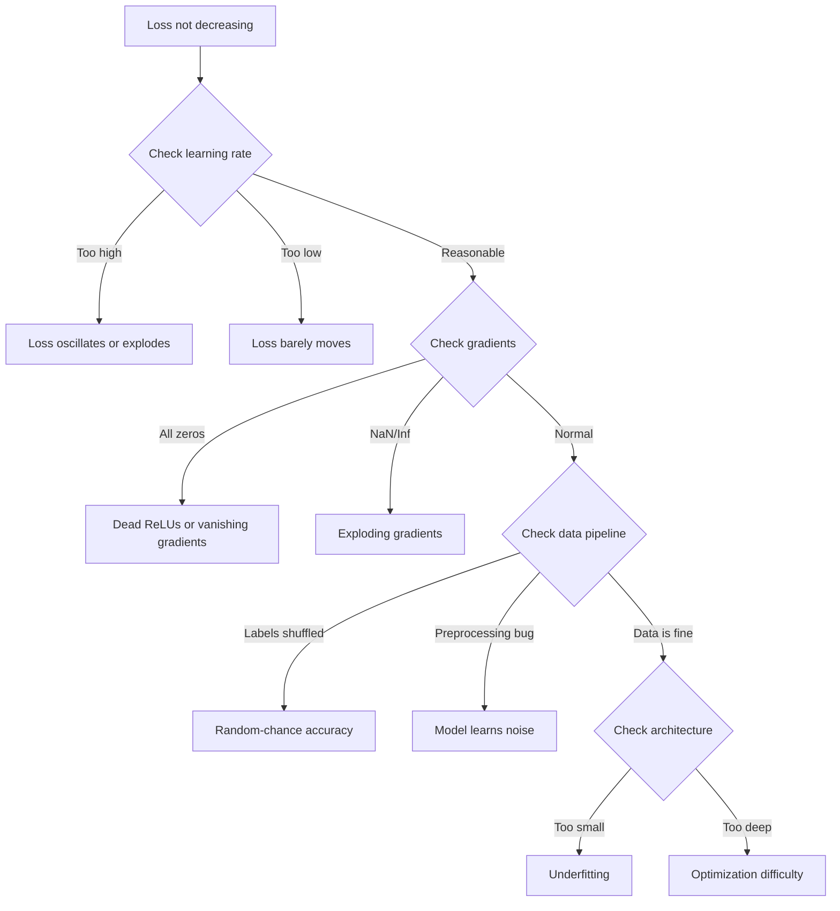
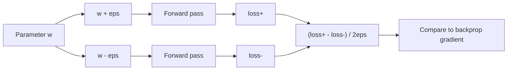
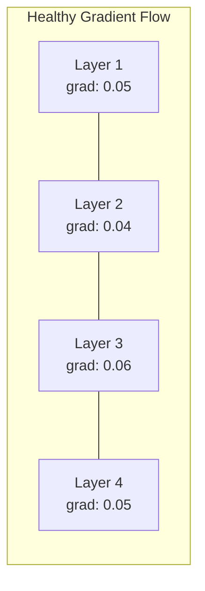
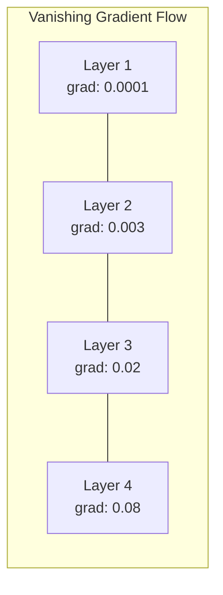
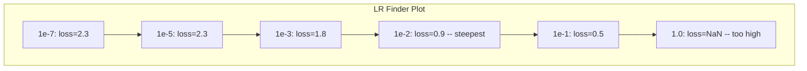

# 调试 شبكات عصبية

> شبكةك 编译成功了――它运行了――它产生了一个数字――这个数字是错误的,而且什么都没有崩――欢迎来到最难的类型调试:没有错误消息的调试――

**类型：**بناء
**语言：**بايثون، بايتورش
**前置要求：**المرحلة 03 الدروس 01-10 ((خاصة التنشر الخلفي، وظائف الخسارة، المحفزات)
**时间：**90 دقيقة

## 學习目标

- استخدام نظامية التحليل المطلوب 策略诊断常见网络故障(NaN فقدان、平坦的损失曲线、过配、oscillation)
- 应用 "overfit one batch" 技术, تجربة نموذج الهندسة المعمارية 和 حلقة التدريب نعم أم لا صحيح
- 检查 درجة الحجم توزيع النشاط وطبيعة الوزن، لتحديد اختفاء/انفجار درجة الحجم 问题
- إنشاء قائمة تحديد التحذير، تغطية خط أنابيب البيانات ‬عملية النموذج ‬الخسارة الوظيفة ‬التحسين ومعدل التعلم ‬

## 问题

传统软件坏掉时会崩──零指标会抛出例外──类型不匹配 会在编译时间 失败──缺失一次会产生明显错误的输出──

الشبكات العصبية لن تعطيك هذه الميزة

سيتم تنفيذ الشبكة العصبية المفقودة، وتطبيق قيمة الخسارة، وتصدر التنبؤات. قد تنخفض الخسارة. قد تبدو التنبؤات معقولة. ولكن النموذج موجودة في الخطأ: تعلم المقاطع المختصرة. ضجيج الذاكرة أو الحصول على الحد الأدنى المحلي غير المفيد.

بين نموذج يمكن العمل و نموذج مفقود، عادة ما يختلف فقط سطر واحد من وضع خطأ في الموقع`zero_grad()`、转置的尺寸、偏差 10x 的学习率──经典的"وصفة لتدريب الشبكات العصبية"(2019)开篇就说:"أكثر الأخطاء الشائعة في شبكة العصبية هي الأخطاء التي لا تتحطم".

هذه الدروس سوف تعلّمك إيجاد هذه الحشرات

## مفهوم الأساسي

### إصلاح طريقة التفكير

نسيان الطباعة والإصطدام التشغيل العصبي الشبكة التشغيل العصبي تحتاج إلى طريقة نظامية، لأن حلقة الملاحظات 很慢  كل مرة تدريب 需要几分钟到几小时) ، والعراض أيضاً مضحكة خسارة سيئة قد يعني 20 نوع مختلف من المشاكل)

黄金法则:**从简单开始，一次只增加一个复杂度，并独立验证每一部分。**



### العرض 1: الخسارة 不下降

هذه هي الشكوى الأكثر شيوعا. حلقة التدريب في العمل، الأوقات لا تتقدم باستمرار، بينما الخسارة تشتت بشكل مستقر أو قوي.

**错误的 learning rate。**太高: الخسارة تتذبذب أو تقفز إلى NaN。太低: الخسارة أسفل بطيئة جدا، تبدو مثل هو平的。 بالنسبة لأدم، من 1e-3 开始。 بالنسبة للجد، من 1e-1 أو 1e-2 开始。 قبل أن يقرر في أماكن أخرى هناك مشاكل،始终尝试 3 个相差 10x من معدلات التعلم(على سبيل المثال 1e-2、1e-3、1e-4)。

**Dead ReLUs。**إذا استقبل أحد الخلايا العصبية ReLU  دخول سلبي كبير جدا، فإنه يخرج 0، ومرحله هو 0. فإنه لن ينشط مرة أخرى.

**Vanishing gradients。**في استخدام شبكات عميقة من التفعيلات sigmoid أو tanh، درجات في الخلف 传播时会指数级小小. عندما يصلون إلى الطبقة الأولى، تقريبا ~0.

**Exploding gradients。**相反问题:Gradients 指数级增长──常见于RNNs 和非常深的网络──Loss 跳到NaN──修复方法:gradient clipping(`torch.nn.utils.clip_grad_norm_`)、 انخفاض معدل التعلم، أو إضافة التطبيع

### العلامة الثانية: الخسارة تراجعت لكن النموذج كان سيئاً جداً

فقدان أسفل: دقة التدريب تصل إلى 99٪. ولكن دقة الاختبار هي 55٪. أو النموذج في البيانات الحقيقية تسبب أي معنى للخروج.

**Overfitting。**النموذج 记住了训练数据,而不是学习模式── training loss 和 validation loss 之间的差距 会随时间变大──修复方法:更多数据、减量、减肥、早期停止、数据增量──

**Data leakage。**بيانات الاختبار فجر إلى التدريب。 دقة 高得可疑──常见原因:فصل 之前 shuffle、 استخدام مجموعة بيانات كاملة إحصاءات القيام بعملية معالجة مسبقة、 مختلف تقسيمات  بين وجود عينات مضاعفة──修复方法:先 split,再 preprocess,检查重复ات──

**Label errors。**معظم مجموعات البيانات الحقيقية في المجموعات هناك 5-10٪ من اللبؤات هي خطأ(نورتكوت وآخرون، 2021 -- "خطأ اللبؤات الشاملة في مجموعات الاختبار")

### العرض الثالث: ظهور نسبة إضافية أو إضافية في حالة الخسارة

قيمة الخسارة 变成 `nan`أو`inf`التدريبات قد فشلت

**Learning rate 太高。**تحديثات تدريجية 跨得太远, يؤدي إلى انفجار الأوزان.

**log(0) 或 log(negative)。**خسارة الانتروبيا المتقاطعة 会计算 `log(p)`إذا كان نموذجك 输出精确 0 أو احتمالات سلبية، سيقوم التسجيل بانفجارها 修复方法:`[eps, 1-eps]`، من بينهم`eps=1e-7`.

**除以零。**عادة ما تكون هناك عدة أشكال من أشكال من أشكال المكونات.

**Numerical overflow。**النشاطات 输入 `exp()`سوف تظهر Inf――Softmax 特别容易出现这种问题──修复方法:在指数化之前减去max(log-sum-exp truc)

### التقنية 1: التحقق من الدرجة

تقارن التدرجات التحليلية الخاصة بك ((من الخلفية) مع التدرجات الرقمية ((من الاختلافات المحدودة)

参数 `w`من التراجع الرقمي:

```
grad_numerical = (loss(w + eps) - loss(w - eps)) / (2 * eps)
```

致性指标 (اختلاف نسبي):

```
rel_diff = |grad_analytical - grad_numerical| / max(|grad_analytical|, |grad_numerical|, 1e-8)
```

إذا`rel_diff < 1e-5`صحيح ..`rel_diff > 1e-3`هناك حشرات تقريباً



### التقنية 2:إحصاءات الإشغال

خلال التدريب  مراقبة متوسط و الانحرافات القياسية في كل مستوى من التنشيطات خلال فترة التدريب ٬ وسوف تحافظ على متوسط ٬ قرب 0٬ ستد ٬ قرب 1 ٬ أو على الأقل تحافظ على حدود ٬

| Health indicator | Mean | Std | Diagnosis |
|-----------------|------|-----|-----------|
| Healthy | ~0 | ~1 | Network 正常学习 |
| Saturated | >>0 or <<0 | ~0 | Activations 卡在极端值 |
| Dead | 0 | 0 | Neurons 已经 dead（全为零） |
| Exploding | >>10 | >>10 | Activations 无界增长 |

### التقنية 3: التشكل المتدريج

رسم متوسط حجم الدرجات في كل طبقة. في شبكة الصحة، يجب أن تكون درجات الدرجات في كل طبقة قريبة. إذا كان درجات الدرجات في الطبقات الأولى من الطبقات الأخيرة، 1000x، هناك تراجع في الاختفاء.





### تقنية 4: اختبار أكثر من اللازم في مجموعة واحدة

هذا هو أهم واحد من التعلم العميق إصلاح التكنولوجيا.

خذ مجموعة صغيرة ((8-32 عينة)  تدريب 100+ تكرار فوقها‬‬‬‬‬‬‬‬‬‬‬‬‬‬‬‬‬‬‬‬‬‬‬‬‬‬‬‬‬‬‬‬‬‬‬‬‬‬‬‬‬‬‬‬‬‬‬‬‬‬‬‬‬‬‬‬‬‬‬‬‬‬‬‬‬‬‬‬‬‬‬‬‬‬‬‬‬‬‬‬‬‬‬‬‬‬‬‬‬‬‬‬‬‬‬‬‬‬‬‬‬‬‬‬‬‬‬‬‬‬‬‬‬‬‬‬‬‬‬‬‬‬‬‬‬‬‬‬‬‬‬‬‬‬‬‬‬‬‬‬‬‬‬‬‬‬‬‬‬‬‬‬‬‬‬‬‬‬‬‬‬‬‬‬‬‬‬‬‬‬‬‬‬‬‬‬‬‬‬‬‬‬‬‬‬‬‬‬‬‬‬‬‬‬‬‬‬‬‬‬‬‬‬‬‬‬‬‬‬‬‬‬‬‬‬‬‬‬‬‬‬‬‬‬‬‬‬‬‬‬‬‬‬‬‬‬‬‬‬‬‬‬‬‬‬‬‬‬‬‬‬‬‬‬‬‬‬‬‬‬‬‬‬‬‬‬‬‬‬‬‬‬‬‬‬‬‬‬‬‬‬‬‬‬‬‬‬‬‬‬‬‬‬‬‬‬‬‬‬‬‬‬‬‬‬‬‬‬‬‬‬‬‬‬‬‬‬‬‬‬‬‬‬‬‬‬‬‬‬‬‬‬‬‬‬‬‬‬‬‬‬‬‬‬‬‬‬‬‬‬‬‬‬‬‬‬‬‬‬‬‬‬‬‬‬‬‬‬‬‬‬‬‬‬‬‬‬‬‬‬‬‬‬‬‬‬‬‬‬‬‬‬‬‬‬‬‬‬‬‬‬‬‬‬‬‬‬‬‬‬‬‬‬‬‬‬‬‬‬‬‬‬‬‬‬‬‬‬‬‬‬‬‬‬‬‬‬‬‬‬‬‬‬‬‬‬‬‬‬‬‬‬‬‬‬‬‬‬‬‬‬‬‬‬‬‬‬‬‬‬‬‬‬‬‬‬‬‬‬‬‬‬‬‬‬‬‬‬‬‬

هذا الاختبار يمكن أن يُقبض عليه:
- 损坏的损失函数
- 损坏的 倒退通行
- الهندسة المعمارية 太小,不能表示数据
- المحفزات  بدون اتصال لمعايير النموذج
- البيانات و العلامات غير متوافقة

إنها تستغرق 30 ثانية فقط للعمل، لكنها يمكن أن توفر ساعات كاملة من التدريب

### التقنية 5:متعلم معدل

ليزلي سميث ((2017) ، أعلن أنه في عصر واحد، سيتم تحديد معدل التعلم من صغير جداً ((1e-7) ، إلى كبير جداً ((10) ، في نفس الوقت، سجل الخسارة.



أفضل LR من بين مثالات: ~ 1e-3 ((أعمق نقطة 之前一个数量级)

### 常见 حشرات البيتورش

هذه هي أخطاء مجتمع PyTorch في أكثر التضليلات في الوقت الكلي:

| Bug | Symptom | Fix |
|-----|---------|-----|
| 忘记 `optimizer.zero_grad()` | Gradients 在 batches 之间累积，loss oscillates | 在 `loss.backward()` 之前添加 `optimizer.zero_grad()` |
| test time 忘记 `model.eval()` | Dropout 和 batch norm 行为不同，test accuracy 在不同 runs 之间变化 | 添加 `model.eval()` 和 `torch.no_grad()` |
| 错误的 tensor shapes | Silent broadcasting 产生错误结果，没有报错 | debugging 期间在每个 operation 后打印 shapes |
| CPU/GPU mismatch | `RuntimeError: expected CUDA tensor` | 对 model 和 data 都使用 `.to(device)` |
| 没有 detach tensors | Computation graph 不断增长，OOM | 使用 `.detach()` 或 `with torch.no_grad()` |
| In-place operations 破坏 autograd | `RuntimeError: modified by in-place operation` | 将 `x += 1` 替换为 `x = x + 1` |
| Data 未 normalized | Loss 卡在 random-chance 水平 | 将 inputs normalize 到 mean=0, std=1 |
| Labels dtype 错误 | Cross-entropy 期望 `Long`，却得到 `Float` | 转换 labels：`labels.long()` |

### طاولة إصلاح الأخطاء الرئيسية

| Symptom | Likely cause | First thing to try |
|---------|-------------|-------------------|
| Loss 卡在 -log(1/num_classes) | Model 正在预测 uniform distribution | 检查 data pipeline，验证 labels 匹配 inputs |
| 几步后 Loss NaN | Learning rate 太高 | 将 LR 降低 10x |
| Loss 立即 NaN | log(0) 或除以零 | 在 log/division operations 中添加 epsilon |
| Loss 剧烈 oscillating | LR 太高或 batch size 太小 | 降低 LR，增大 batch size |
| Loss 下降后 plateau | LR 对 fine-tuning phase 来说太高 | 添加 LR schedule（cosine 或 step decay） |
| Training acc 高，test acc 低 | Overfitting | 添加 dropout、weight decay、更多数据 |
| Training acc = test acc = chance | Model 没有学到任何东西 | 运行 overfit-one-batch test |
| Training acc = test acc 但都很低 | Underfitting | 更大的 model、更多 layers、更多 features |
| Gradients 全为零 | Dead ReLUs 或 detached computation graph | 切换到 LeakyReLU，检查 `.requires_grad` |
| Training 期间 out of memory | Batch 太大或 graph 未释放 | 降低 batch size，在 eval 使用 `torch.no_grad()` |


```figure
learning-curves
```

## بناءها

مجموعة أدوات التشخيص، لتحكم في تنشيطات، ومرحبات، و منحنى الخسارة.

### 步骤 1: شبكةDebugger Class

في نموذج PyTorch، سجل كل مستوى من التفعيل و إحصاءات التراجع.

```python
import torch
import torch.nn as nn
import math


class NetworkDebugger:
    def __init__(self, model):
        self.model = model
        self.activation_stats = {}
        self.gradient_stats = {}
        self.loss_history = []
        self.lr_losses = []
        self.hooks = []
        self._register_hooks()

    def _register_hooks(self):
        for name, module in self.model.named_modules():
            if isinstance(module, (nn.Linear, nn.Conv2d, nn.ReLU, nn.LeakyReLU)):
                hook = module.register_forward_hook(self._make_activation_hook(name))
                self.hooks.append(hook)
                hook = module.register_full_backward_hook(self._make_gradient_hook(name))
                self.hooks.append(hook)

    def _make_activation_hook(self, name):
        def hook(module, input, output):
            with torch.no_grad():
                out = output.detach().float()
                self.activation_stats[name] = {
                    "mean": out.mean().item(),
                    "std": out.std().item(),
                    "fraction_zero": (out == 0).float().mean().item(),
                    "min": out.min().item(),
                    "max": out.max().item(),
                }
        return hook

    def _make_gradient_hook(self, name):
        def hook(module, grad_input, grad_output):
            if grad_output[0] is not None:
                with torch.no_grad():
                    grad = grad_output[0].detach().float()
                    self.gradient_stats[name] = {
                        "mean": grad.mean().item(),
                        "std": grad.std().item(),
                        "abs_mean": grad.abs().mean().item(),
                        "max": grad.abs().max().item(),
                    }
        return hook

    def record_loss(self, loss_value):
        self.loss_history.append(loss_value)

    def check_loss_health(self):
        if len(self.loss_history) < 2:
            return "NOT_ENOUGH_DATA"
        recent = self.loss_history[-10:]
        if any(math.isnan(v) or math.isinf(v) for v in recent):
            return "NAN_OR_INF"
        if len(self.loss_history) >= 20:
            first_half = sum(self.loss_history[:10]) / 10
            second_half = sum(self.loss_history[-10:]) / 10
            if second_half >= first_half * 0.99:
                return "NOT_DECREASING"
        if len(recent) >= 5:
            diffs = [recent[i+1] - recent[i] for i in range(len(recent)-1)]
            if max(diffs) - min(diffs) > 2 * abs(sum(diffs) / len(diffs)):
                return "OSCILLATING"
        return "HEALTHY"

    def check_activations(self):
        issues = []
        for name, stats in self.activation_stats.items():
            if stats["fraction_zero"] > 0.5:
                issues.append(f"DEAD_NEURONS: {name} has {stats['fraction_zero']:.0%} zero activations")
            if abs(stats["mean"]) > 10:
                issues.append(f"EXPLODING_ACTIVATIONS: {name} mean={stats['mean']:.2f}")
            if stats["std"] < 1e-6:
                issues.append(f"COLLAPSED_ACTIVATIONS: {name} std={stats['std']:.2e}")
        return issues if issues else ["HEALTHY"]

    def check_gradients(self):
        issues = []
        grad_magnitudes = []
        for name, stats in self.gradient_stats.items():
            grad_magnitudes.append((name, stats["abs_mean"]))
            if stats["abs_mean"] < 1e-7:
                issues.append(f"VANISHING_GRADIENT: {name} abs_mean={stats['abs_mean']:.2e}")
            if stats["abs_mean"] > 100:
                issues.append(f"EXPLODING_GRADIENT: {name} abs_mean={stats['abs_mean']:.2e}")
        if len(grad_magnitudes) >= 2:
            first_mag = grad_magnitudes[0][1]
            last_mag = grad_magnitudes[-1][1]
            if last_mag > 0 and first_mag / last_mag > 100:
                issues.append(f"GRADIENT_RATIO: first/last = {first_mag/last_mag:.0f}x (vanishing)")
        return issues if issues else ["HEALTHY"]

    def print_report(self):
        print("\n=== NETWORK DEBUGGER REPORT ===")
        print(f"\nLoss health: {self.check_loss_health()}")
        if self.loss_history:
            print(f"  Last 5 losses: {[f'{v:.4f}' for v in self.loss_history[-5:]]}")
        print("\nActivation diagnostics:")
        for item in self.check_activations():
            print(f"  {item}")
        print("\nGradient diagnostics:")
        for item in self.check_gradients():
            print(f"  {item}")
        print("\nPer-layer activation stats:")
        for name, stats in self.activation_stats.items():
            print(f"  {name}: mean={stats['mean']:.4f} std={stats['std']:.4f} zero={stats['fraction_zero']:.1%}")
        print("\nPer-layer gradient stats:")
        for name, stats in self.gradient_stats.items():
            print(f"  {name}: abs_mean={stats['abs_mean']:.2e} max={stats['max']:.2e}")

    def remove_hooks(self):
        for hook in self.hooks:
            hook.remove()
        self.hooks.clear()
```

### 步骤 2: اختبار أكثر من اللازم

```python
def overfit_one_batch(model, x_batch, y_batch, criterion, lr=0.01, steps=200):
    optimizer = torch.optim.Adam(model.parameters(), lr=lr)
    model.train()
    print("\n=== OVERFIT ONE BATCH TEST ===")
    print(f"Batch size: {x_batch.shape[0]}, Steps: {steps}")

    for step in range(steps):
        optimizer.zero_grad()
        output = model(x_batch)
        loss = criterion(output, y_batch)
        loss.backward()
        optimizer.step()

        if step % 50 == 0 or step == steps - 1:
            with torch.no_grad():
                preds = (output > 0).float() if output.shape[-1] == 1 else output.argmax(dim=1)
                targets = y_batch if y_batch.dim() == 1 else y_batch.squeeze()
                acc = (preds.squeeze() == targets).float().mean().item()
            print(f"  Step {step:3d} | Loss: {loss.item():.6f} | Accuracy: {acc:.1%}")

    final_loss = loss.item()
    if final_loss > 0.1:
        print(f"\n  FAIL: Loss did not converge ({final_loss:.4f}). Model or training loop is broken.")
        return False
    print(f"\n  PASS: Loss converged to {final_loss:.6f}")
    return True
```

### 步骤 3:متعلم معدل العثور

```python
def find_learning_rate(model, x_data, y_data, criterion, start_lr=1e-7, end_lr=10, steps=100):
    import copy
    original_state = copy.deepcopy(model.state_dict())
    optimizer = torch.optim.SGD(model.parameters(), lr=start_lr)
    lr_mult = (end_lr / start_lr) ** (1 / steps)

    model.train()
    results = []
    best_loss = float("inf")
    current_lr = start_lr

    print("\n=== LEARNING RATE FINDER ===")

    for step in range(steps):
        optimizer.zero_grad()
        output = model(x_data)
        loss = criterion(output, y_data)

        if math.isnan(loss.item()) or loss.item() > best_loss * 10:
            break

        best_loss = min(best_loss, loss.item())
        results.append((current_lr, loss.item()))

        loss.backward()
        optimizer.step()

        current_lr *= lr_mult
        for param_group in optimizer.param_groups:
            param_group["lr"] = current_lr

    model.load_state_dict(original_state)

    if len(results) < 10:
        print("  Could not complete LR sweep -- loss diverged too quickly")
        return results

    min_loss_idx = min(range(len(results)), key=lambda i: results[i][1])
    suggested_lr = results[max(0, min_loss_idx - 10)][0]

    print(f"  Swept {len(results)} steps from {start_lr:.0e} to {results[-1][0]:.0e}")
    print(f"  Minimum loss {results[min_loss_idx][1]:.4f} at lr={results[min_loss_idx][0]:.2e}")
    print(f"  Suggested learning rate: {suggested_lr:.2e}")

    return results
```

### 步骤 4:محقق درجة

```python
def _flat_to_multi_index(flat_idx, shape):
    multi_idx = []
    remaining = flat_idx
    for dim in reversed(shape):
        multi_idx.insert(0, remaining % dim)
        remaining //= dim
    return tuple(multi_idx)


def gradient_check(model, x, y, criterion, eps=1e-4):
    model.train()
    x_double = x.double()
    y_double = y.double()
    model_double = model.double()

    print("\n=== GRADIENT CHECK ===")
    overall_max_diff = 0
    checked = 0

    for name, param in model_double.named_parameters():
        if not param.requires_grad:
            continue

        layer_max_diff = 0

        model_double.zero_grad()
        output = model_double(x_double)
        loss = criterion(output, y_double)
        loss.backward()
        analytical_grad = param.grad.clone()

        num_checks = min(5, param.numel())
        for i in range(num_checks):
            idx = _flat_to_multi_index(i, param.shape)
            original = param.data[idx].item()

            param.data[idx] = original + eps
            with torch.no_grad():
                loss_plus = criterion(model_double(x_double), y_double).item()

            param.data[idx] = original - eps
            with torch.no_grad():
                loss_minus = criterion(model_double(x_double), y_double).item()

            param.data[idx] = original

            numerical = (loss_plus - loss_minus) / (2 * eps)
            analytical = analytical_grad[idx].item()

            denom = max(abs(numerical), abs(analytical), 1e-8)
            rel_diff = abs(numerical - analytical) / denom

            layer_max_diff = max(layer_max_diff, rel_diff)
            checked += 1

        overall_max_diff = max(overall_max_diff, layer_max_diff)
        status = "OK" if layer_max_diff < 1e-5 else "MISMATCH"
        print(f"  {name}: max_rel_diff={layer_max_diff:.2e} [{status}]")

    model.float()

    print(f"\n  Checked {checked} parameters")
    if overall_max_diff < 1e-5:
        print("  PASS: Gradients match (rel_diff < 1e-5)")
    elif overall_max_diff < 1e-3:
        print("  WARN: Small differences (1e-5 < rel_diff < 1e-3)")
    else:
        print("  FAIL: Gradient mismatch detected (rel_diff > 1e-3)")
    return overall_max_diff
```

### الخطوة 5: إفساد الشبكات

الآن سوف تطبق المعدات على الشبكات المكسورة

```python
def demo_broken_networks():
    torch.manual_seed(42)
    x = torch.randn(64, 10)
    y = (x[:, 0] > 0).long()

    print("\n" + "=" * 60)
    print("BUG 1: Learning rate too high (lr=10)")
    print("=" * 60)
    model1 = nn.Sequential(nn.Linear(10, 32), nn.ReLU(), nn.Linear(32, 2))
    debugger1 = NetworkDebugger(model1)
    optimizer1 = torch.optim.SGD(model1.parameters(), lr=10.0)
    criterion = nn.CrossEntropyLoss()
    for step in range(20):
        optimizer1.zero_grad()
        out = model1(x)
        loss = criterion(out, y)
        debugger1.record_loss(loss.item())
        loss.backward()
        optimizer1.step()
    debugger1.print_report()
    debugger1.remove_hooks()

    print("\n" + "=" * 60)
    print("BUG 2: Dead ReLUs from bad initialization")
    print("=" * 60)
    model2 = nn.Sequential(nn.Linear(10, 32), nn.ReLU(), nn.Linear(32, 32), nn.ReLU(), nn.Linear(32, 2))
    with torch.no_grad():
        for m in model2.modules():
            if isinstance(m, nn.Linear):
                m.weight.fill_(-1.0)
                m.bias.fill_(-5.0)
    debugger2 = NetworkDebugger(model2)
    optimizer2 = torch.optim.Adam(model2.parameters(), lr=1e-3)
    for step in range(50):
        optimizer2.zero_grad()
        out = model2(x)
        loss = criterion(out, y)
        debugger2.record_loss(loss.item())
        loss.backward()
        optimizer2.step()
    debugger2.print_report()
    debugger2.remove_hooks()

    print("\n" + "=" * 60)
    print("BUG 3: Missing zero_grad (gradients accumulate)")
    print("=" * 60)
    model3 = nn.Sequential(nn.Linear(10, 32), nn.ReLU(), nn.Linear(32, 2))
    debugger3 = NetworkDebugger(model3)
    optimizer3 = torch.optim.SGD(model3.parameters(), lr=0.01)
    for step in range(50):
        out = model3(x)
        loss = criterion(out, y)
        debugger3.record_loss(loss.item())
        loss.backward()
        optimizer3.step()
    debugger3.print_report()
    debugger3.remove_hooks()

    print("\n" + "=" * 60)
    print("HEALTHY NETWORK: Correct setup for comparison")
    print("=" * 60)
    model_good = nn.Sequential(nn.Linear(10, 32), nn.ReLU(), nn.Linear(32, 2))
    debugger_good = NetworkDebugger(model_good)
    optimizer_good = torch.optim.Adam(model_good.parameters(), lr=1e-3)
    for step in range(50):
        optimizer_good.zero_grad()
        out = model_good(x)
        loss = criterion(out, y)
        debugger_good.record_loss(loss.item())
        loss.backward()
        optimizer_good.step()
    debugger_good.print_report()
    debugger_good.remove_hooks()

    print("\n" + "=" * 60)
    print("OVERFIT-ONE-BATCH TEST (healthy model)")
    print("=" * 60)
    model_test = nn.Sequential(nn.Linear(10, 32), nn.ReLU(), nn.Linear(32, 2))
    overfit_one_batch(model_test, x[:8], y[:8], criterion)

    print("\n" + "=" * 60)
    print("LEARNING RATE FINDER")
    print("=" * 60)
    model_lr = nn.Sequential(nn.Linear(10, 32), nn.ReLU(), nn.Linear(32, 2))
    find_learning_rate(model_lr, x, y, criterion)

    print("\n" + "=" * 60)
    print("GRADIENT CHECK")
    print("=" * 60)
    model_grad = nn.Sequential(nn.Linear(10, 8), nn.ReLU(), nn.Linear(8, 2))
    gradient_check(model_grad, x[:4], y[:4], criterion)
```

## استخدمها

### أدوات متكاملة بـ "بيتورش"

```python
import torch
import torch.nn as nn

model = nn.Sequential(
    nn.Linear(768, 256),
    nn.ReLU(),
    nn.Linear(256, 10),
)

with torch.autograd.detect_anomaly():
    output = model(input_tensor)
    loss = criterion(output, target)
    loss.backward()

for name, param in model.named_parameters():
    if param.grad is not None:
        print(f"{name}: grad_mean={param.grad.abs().mean():.2e}")
```

### الوزن والتحيزات 集成

```python
import wandb

wandb.init(project="debug-training")

for epoch in range(100):
    loss = train_one_epoch()
    wandb.log({
        "loss": loss,
        "lr": optimizer.param_groups[0]["lr"],
        "grad_norm": torch.nn.utils.clip_grad_norm_(model.parameters(), float("inf")),
    })

    for name, param in model.named_parameters():
        if param.grad is not None:
            wandb.log({f"grad/{name}": wandb.Histogram(param.grad.cpu().numpy())})
```

### المكتب التنسري

```python
from torch.utils.tensorboard import SummaryWriter

writer = SummaryWriter("runs/debug_experiment")

for epoch in range(100):
    loss = train_one_epoch()
    writer.add_scalar("Loss/train", loss, epoch)

    for name, param in model.named_parameters():
        writer.add_histogram(f"weights/{name}", param, epoch)
        if param.grad is not None:
            writer.add_histogram(f"gradients/{name}", param.grad, epoch)
```

### إعادة تحديد القائمة التحققية (مدرسة كاملة)

1. 运行 اختبار فيتس-وين-باتش
2. 打印 النموذج ملخص، اعتبار معايير الاختبار 合理。
3. باستخدام البيانات العشوائية 运行一次前进,检查输出形状──
4. تدريب 5 أوقات، فقدان التحقق
5. لا توجد طبقات ميتة، لا يوجد انفجارات
6. 检查梯度流: لا اختفاء، لا انفجار
7. خط بيانات التحقق: طبع 5 عينات عشوائية وملفاتها

## 交付 it

本课会产出:
- `outputs/prompt-nn-debugger.md`-- يستخدم للتشخيص الفشل في تدريب شبكة الأعصاب
- `outputs/skill-debug-checklist.md`-- تستخدم لتشغيل مشاكل التدريب قائمة التحقق من شجرة القرار

إصلاح أشكال التنفيذ الرئيسية:
- إلى نصوص التدريب الإنتاج 添加 المراقبة
- كل خطوة ستعمل التفعيل و إحصاءات التراجع  سجل إلى W & B أو TensorBoard
- لأجل فقدان العصبية الميتة ((> 80% صفر) أو انفجار التدفق
- كل مرة تعديل الهندسة المعمارية أو خطوط البيانات 时,始终运行 overfit-one-batch test

## التدريب

1. **添加 exploding gradient detector。**修改 `NetworkDebugger`، دعها تفتيش المراحل عندما تتجاوز العدالة ، ومع ذلك تلقائياً يوصي بقيمة قطع المراحل.

2. **构建 dead neuron resurrector。**编写一个函数,识别死 ReLU神经元(始终输出 0),并使用Kaiming初始化重新初始化它们的进来的重量──展示这能恢复一个>70%神经元都死的网络──

3. **实现带 plotting 的 learning rate finder。**扩展 `find_learning_rate`, سوف حفظ النتيجة ل CSV, ومصدر كتابة منفردة قراءة CSV, استخدام اللوحات المقابلة  عرض LR مقابل منحنى الخسارة, وتعرف CIFAR-10 على ResNet-18 من أفضل LR,

4. **创建 data pipeline validator。**编写一个函数,检查:train/test split 之间重复样本、标签分布失衡(>10:1 تناسب)、输入正常化(中接近0,std 接近 1),以及数据中的NaN/Inf值──在一个故意腐败的数据集上运行它──

5. **Debug 一个真实 failure。**استخدام الدرجة 10 中的迷你框架,引入一个微妙的bug(على سبيل المثال,在后向中转置重矩阵),并使用梯度检查 精确定位哪个参数的梯度 不正确──记录调试过程──

## 关键术语

| Term | What people say | What it actually means |
|------|----------------|----------------------|
| Silent bug | "它能运行，但结果很差" | 不产生错误但降低 model quality 的 bug，是 ML 中占主导的 failure mode |
| Dead ReLU | "neurons 死了" | 输入始终为负的 ReLU neuron，因此它输出 0，并永久接收 0 Gradient |
| Vanishing gradients | "Early layers 停止学习" | Gradients 在 layers 中指数级缩小，使 early layers 的 weights 实际上被冻结 |
| Exploding gradients | "Loss 变成了 NaN" | Gradients 在 layers 中指数级增长，导致 weight updates 大到 overflow |
| Gradient checking | "验证 backprop 是否正确" | 将 backprop 得到的 analytical gradients 与 finite differences 得到的 numerical gradients 比较 |
| Overfit-one-batch | "最重要的 debug test" | 在单个小 batch 上训练，以验证 model 是否能学习；如果不能，说明存在根本性问题 |
| LR finder | "Sweep 以找到正确的 learning rate" | 在一个 epoch 内指数级增大 learning rate，并选择 loss diverge 前的 rate |
| Data leakage | "Test data 泄漏进 training" | test set 的信息污染了 training，产生人为偏高的 accuracy |
| Activation statistics | "监控 layer health" | 跟踪每层 output 的 mean、std 和 zero-fraction，以检测 dead、saturated 或 exploding neurons |
| Gradient clipping | "限制 Gradient magnitude" | 当 Gradients 的 norm 超过 threshold 时将其缩小，防止 exploding gradient updates |

## 延伸阅读

- سميث، "تطورات التعلم الدورية للتدريب الشبكات العصبية" (2017) -- 提出 learning rate range test(LR finder)
- نورثكوت وآخرون، "خطأ اللبنان المنتشر في مجموعات الاختبار يزعج مؤشرات التعلم الآلي" (2021) -- يثبت ImageNet、CIFAR-10 وآخرين المؤشرات الرئيسية أن 3-6% من اللبنانات هي خاطئة
- تشانغ وغيره، "فهم التعلم العميق يتطلب إعادة التفكير في التعميم" (2017) -- هذا المقال يظهر أن الشبكات العصبية يمكن أن تتذكر علامات عشوائية، وهذا هو أيضا اختبار أكثر من اللازم في مجموعة واحدة
- وثائق PyTorch 中 حول `torch.autograd.detect_anomaly`和 `torch.autograd.set_detect_anomaly`إكتشاف NaN / Inf مدمج
