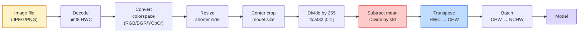
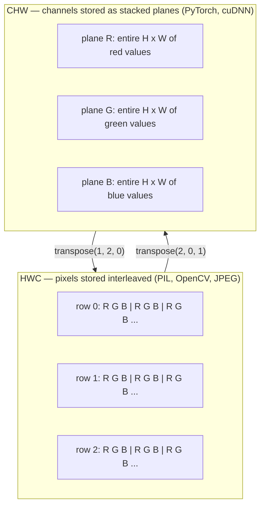

# 图像基础  بيكسل قناة مساحات الألوان

> الصورة هي ضغط ضوئي. كل نموذج رؤية ستستخدمها لاحقاً، بدأ من هذه الحقيقة.

**类型：**بناء
**语言：**بايثون
**前置要求：**المرحلة 1 الدروس 12 (عمليات التنسور) ، المرحلة 3 الدروس 11 (الاندرو إلى بيتورش)
**时间：**45 دقيقة

## 學习目标

- شرح كيفية تفريق المشهد المتواصل إلى بيكسل، وكذلك لماذا ستحدد القرارات عن الاختبار والقياس أعلى حدود كل نموذج
- وضع الصور على أنها صف NumPy 读取、切片和检查,并熟练在HWC和CHW布局之间切换
- في RGB,الشمراء,HSV و YCbCr , وتوضيح كل نوع من الفضاء اللون
- 严格按照火焰视的预期应用 级预处理(تطبيع 标准化、尺寸、道-第一)

## 问题

ستقرأ كل مقالة ستقرأ كل مقالة ستقوم بتنزيل كل وزن مدرب من قبل ستقوم بتدوين كل API رؤية ستقوم بإدخال إدخال مع رمز محدد`uint8`图像传给期望 `float32`النموذج، فإنه لا يزال يعمل، و ينتج نتائج لا معنى لها‬‬‬‬‬‬‬‬‬‬‬‬‬‬‬‬‬‬‬‬‬‬‬‬‬‬‬‬‬‬‬‬‬‬‬‬‬‬‬‬‬‬‬‬‬‬‬‬‬‬‬‬‬‬‬‬‬‬‬‬‬‬‬‬‬‬‬‬‬‬‬‬‬‬‬‬‬‬‬‬‬‬‬‬‬‬‬‬‬‬‬‬‬‬‬‬‬‬‬‬‬‬‬‬‬‬‬‬‬‬‬‬‬‬‬‬‬‬‬‬‬‬‬‬‬‬‬‬‬‬‬‬‬‬‬‬‬‬‬‬‬‬‬‬‬‬‬‬‬‬‬‬‬‬‬‬‬‬‬‬‬‬‬‬‬‬‬‬‬‬‬‬‬‬‬‬‬‬‬‬‬‬‬‬‬‬‬‬‬‬‬‬‬‬‬‬‬‬‬‬‬‬‬‬‬‬‬‬‬‬‬‬‬‬‬‬‬‬‬‬‬‬‬‬‬‬‬‬‬‬‬‬‬‬‬‬‬‬‬‬‬‬‬‬‬‬‬‬‬‬‬‬‬‬‬‬‬‬‬‬‬‬‬‬‬‬‬‬‬‬‬‬‬‬‬‬‬‬‬‬‬‬‬‬‬‬‬‬‬‬‬‬‬‬‬‬‬‬‬‬‬‬‬‬‬‬‬‬‬‬‬‬‬‬‬‬‬‬‬‬‬‬‬‬‬‬‬‬‬‬‬‬‬‬‬‬‬‬‬‬‬‬‬‬‬‬‬‬‬‬‬‬‬‬‬‬‬‬‬‬‬‬‬‬‬‬‬‬‬‬‬‬‬‬‬‬‬‬‬‬‬‬‬‬‬‬‬‬‬‬‬‬‬‬‬‬‬‬‬‬‬‬‬‬‬‬‬‬‬‬‬‬‬‬‬‬‬‬‬‬‬‬‬‬‬‬‬‬‬‬‬‬‬‬‬‬‬‬‬‬‬‬‬‬‬‬‬‬‬‬‬‬‬‬‬‬‬‬‬‬‬‬‬‬‬‬‬‬‬‬‬‬‬‬‬‬‬‬‬‬‬‬‬‬‬‬‬‬‬

بمجرد أن تعرف التحوّل في ما يزحلق فوقه، فإنه ليس معقداً في حد ذاته. النقطة الصعبة هي،   张图像 على الكاميرا، JPEG المفكّر، PIL، OpenCV، مشعل رؤية و CUDA النواة من أجل مختلفة المعنى.

هذا الدروس سوف تصلح هذا الأساس، حتى يمكن لهذا الدور التالي المحتويات أن تبنى عليه. في النهاية، سوف تعرف ما هو بيكسل، لماذا كل بيكسل لديه ثلاثة أرقام بدلا من واحد، طبيعية مع إحصاءات ImageNet 

## 概念

### 完整预处理 خط الأنابيب 一览

كل نظام رؤية مستوى الإنتاج هو نفس سلسلة من التحولات المُعكسية. أي خطوة خارج الخطأ، فإن المدخلات التي يشاهدها النموذج تختلف عن المدخلات التي يتم تدريبها.



الصفوف الاخرى والاخرى هي 80% من النقص في الصمت: عدم وجود قياس، فضلا عن التخطيط

### البيكسل هو عينة، وليس مربع

أجهزة الاستشعار الكاميرا ستقوم بتحديد الفوتون على الكاشف الصغير. كل كاشف خلال فترة قصيرة من الوقت يُصنع ضوءًا ويعطي ولتاجًا متناسبًا مع عدد الفوتون الذي يضربه. ثم سيقوم المستشعر بتفريق هذا الجهد إلى عدد كامل.

```
Continuous scene                 Sensor grid                     Digital image
(infinite detail)                (H x W detectors)               (H x W integers)

    ~~~~~                        +--+--+--+--+--+                 210 198 180 155 120
   ♪ ♪ 205 195 178 152 118 ♪
  - الضوء - - - - - - - - - - - - - - - - - - - - - - - - - - - - - - - - - - - - - - - - - - - - - - - - - - - - - - - - - - - - - - - - - - - - - - - - - - - - - - - - - - - - - - - - - - - - - - - - - - - - - - - - - - - - - - - - - - - - - - - - - - - - - - - - - - - - - - - - - - - - - - - - - - - - - - - - - - - - - - - - - - - - - - - - - - - - - - - - - - - - - - - - - - - - - - - - - - - - - - - - - - - - - - - - - - - - - - - - - - - - - - - - - - - - - - - - - - - - - - - - - - - - - - - - - - - - - - - - - - - - - - - - - - - - - - - - - - - - - - - - - - - - - - - - - - - - - - - - - - - - - - - - - - - - - - - - - - - - - - - - - - - - - - - - - - - - - - - - - - - - - - - - - - - - - - - - - - - - - - - - - - - - - - - - - - - - - - - - - - - - - - - - - - - - - - - - - - - - - - - - - - - - - - - - - - - - - - - - - - - - - - - - - - - - - - - - - - - - - - - - - - - - - - - - - - - - - - - - - - - - - - - - - - - - - - - - - - - - - - - - - - - - - - - - - - - - - - - - - - - - - - - - - - -
   ~~~~~                         |  |  |  |  |  |                 195 185 170 148 112
                                 +--+--+--+--+--+                 188 180 165 145 108
```

هذه الخطوة ستحدث خيارين، يحددون الحدود العليا لجميع المهام التالية:

- **Spatial sampling**قرر المشهد في كل مرة على عدد الكشفات.
- **Intensity quantization**قرر الجهد 被分桶多细──8 بت 提供 256 个水平,是显示的标准──10、12、16 بت 提供更平滑的梯度,对医疗成像、HDR和原始传感器管道很重要──

البيكسل ليس مع مساحة لون مربع صغير. انها قياس منفرد. عندما تقوم بالقياس أو التناوب، أنت تقوم بإعادة تصميم هذه الشبكة القياسية.

### لماذا هناك ثلاثة قنوات

واحد الكشف 会统计整个可见光谱范围内的光子,那就是灰度.为了 الحصول على اللون, الاستشعار 会用红、绿、蓝过 mozaic 覆盖网格.经过 демосаи化 经过测试后,每个空间位置都有三个整数:附近红色过探测器、绿色过探测器和蓝色过探测器的响应──这些三整数就是一个像素的RGB三重点──

```
One pixel in memory:

    (R, G, B) = (210, 140, 30)   <- reddish-orange

An H x W RGB image:

    shape (H, W, 3)     stored as   H rows of W pixels of 3 values
                                    each in [0, 255] for uint8
```

三并不奇怪──深度相机会添加Z频道──卫星会添加红外线和紫外线带──医学扫描通常有一个频道──X-ray、CT) 或很多频道──超谱)──频道的数量是最后一个轴;conv layer 会学习跨频道 混合──

### 两种布局公约:HWC 和 CHW

مع نفس الجهاز، هناك ترتيبين. كل شخص يختار واحد منهم.

```
HWC (height, width, channels)           CHW (channels, height, width)

   W ->                                    H ->
  +-----+-----+-----+                     +-----+-----+
H |R G B|R G B|R G B|                   C |R R R R R R|
| +-----+-----+-----+                   | +-----+-----+
v |R G B|R G B|R G B|                   v |G G G G G G|
  +-----+-----+-----+                     +-----+-----+
                                          |B B B B B B|
                                          +-----+-----+

   PIL, OpenCV, matplotlib,              PyTorch, most deep learning
   almost every image file on disk       frameworks, cuDNN kernels
```

السبب في وجود CHW هو محور التحويل في الحجر 会沿 H 和 W 滑动。把频道轴 放在前面, يعني أن كل حجر قادر على رؤية كل قناة على متن الطائرة الثنائية المستمرة,从而干净地

ستقوم بإدخال 1000 مرة

```
img_chw = img_hwc.transpose(2, 0, 1)      # NumPy
img_chw = img_hwc.permute(2, 0, 1)        # PyTorch tensor
```

ترتيب الذاكرة 可视化:



### نطاق البايت و dtype

ثلاث اتفاقيات

| Convention | dtype | Range | 你会在哪里见到它 |
|------------|-------|-------|------------------|
| Raw | `uint8` | [0, 255] | Disk 上的文件、PIL、OpenCV output |
| Normalized | `float32` | [0.0, 1.0] | `img.astype('float32') / 255` 之后 |
| Standardized | `float32` | 大约 [-2, +2] | 减去 mean 并除以 std 之后 |

شبكة التحول هي في المدخلات الموحدة على تدريباتها.`mean=[0.485, 0.456, 0.406]`.`std=[0.229, 0.224, 0.225]`هو في مجموعة التدريب ImageNet كاملة 上، على [0, 1] الطبيعية بيكسل  حساب الحصول على ثلاثة قنوات من المتوسط الحسابي 和 الانحراف القياسي──把 خام `uint8`النموذج الموحد الموحد للطائرة العائمة، هو الأكثر شيوعا في رؤية التطبيقات.

### الفضاء اللوني و لماذا يوجد

RGB هو شكل التقاط، لكنه ليس دائماً أكثر تعبيرات مفيدة للنموذج.

```
 RGB               HSV                       YCbCr / YUV

 R red             H hue (angle 0-360)       Y luminance (brightness)
 G green           S saturation (0-1)        Cb chroma blue-yellow
 B blue            V value/brightness (0-1)  Cr chroma red-green

 Linear to         Separates color from      Separates brightness from
 sensor output     brightness. Useful for    color. JPEG and most video
                   color thresholding, UI    codecs compress the chroma
                   sliders, simple filters   channels harder because the
                                             human eye is less sensitive
                                             to chroma detail than to Y.
```

بالنسبة لمعظم سي إن إن الحديث، ستلتقي بـ RGB.

- **HSV** رمز سيرتك الذاتية الكلاسيكي  تخصيص الألوان  توازن الأبيض
- **YCbCr** 读取 JPEG 内部、视频管道、只在Y 上操作的超分辨率模型──
- **Grayscale** OCR ‬نموذج الوثيقة، وكل لون هو متغير المضايقة وليس حالة الإشارة‬

من RGB 转灰度是加权和, وليس متوسط, لأن العين البشرية أكثر حساسية لللون الأخضر من الأحمر أو الأزرق:

```
Y = 0.299 R + 0.587 G + 0.114 B       (ITU-R BT.601, the classic weights)
```

### نسبة الجوانب ∆توسع و التقاطع

كل نموذج لديه حجم مدخل ثابت ((معظم تصنيف ImageNet هو 224x224, كاشف الحديث 常用 384x384 أو 512x512)

- **Resize shorter side, then center crop** 标准 ImageNet وصفة‬‬‬‬‬‬‬‬‬‬‬‬‬‬‬‬‬‬‬‬‬‬‬‬‬‬‬‬‬‬‬‬‬‬‬‬‬‬‬‬‬‬‬‬‬‬‬‬‬‬‬‬‬‬‬‬‬‬‬‬‬‬‬‬‬‬‬‬‬‬‬‬‬‬‬‬‬‬‬‬‬‬‬‬‬‬‬‬‬‬‬‬‬‬‬‬‬‬‬‬‬‬‬‬‬‬‬‬‬‬‬‬‬‬‬‬‬‬‬‬‬‬‬‬‬‬‬‬‬‬‬‬‬‬‬‬‬‬‬‬‬‬‬‬‬‬‬‬‬‬‬‬‬‬‬‬‬‬‬‬‬‬‬‬‬‬‬‬‬‬‬‬‬‬‬‬‬‬‬‬‬‬‬‬‬‬‬‬‬‬‬‬‬‬‬‬‬‬‬‬‬‬‬‬‬‬‬‬‬‬‬‬‬‬‬‬‬‬‬‬‬‬‬‬‬‬‬‬‬‬‬‬‬‬‬‬‬‬‬‬‬‬‬‬‬‬‬‬‬‬‬‬‬‬‬‬‬‬‬‬‬‬‬‬‬‬‬‬‬‬‬‬‬‬‬‬‬‬‬‬‬‬‬‬‬‬‬‬‬‬‬‬‬‬‬‬‬‬‬‬‬‬‬‬‬‬‬‬‬‬‬‬‬‬‬‬‬‬‬‬‬‬‬‬‬‬‬‬‬‬‬‬‬‬‬‬‬‬‬‬‬‬‬‬‬‬‬‬‬‬‬‬‬‬‬‬‬‬‬‬‬‬‬‬‬‬‬‬‬‬‬‬‬‬‬‬‬‬‬‬‬‬‬‬‬‬‬‬‬‬‬‬‬‬‬‬‬‬‬‬‬‬‬‬‬‬‬‬‬‬‬‬‬‬‬‬‬‬‬‬‬‬‬‬‬‬‬‬‬‬‬‬‬‬‬‬‬‬‬‬‬‬‬‬‬‬‬‬‬‬‬‬‬‬‬‬‬‬‬‬‬‬‬‬‬‬‬‬‬‬‬‬‬‬‬‬‬‬‬‬‬‬‬‬‬‬‬‬‬‬‬‬‬‬‬‬‬‬‬‬‬‬
- **Resize and pad** الحفاظ على نسبة الجانب 和 كل نقطة، اضافة أسود边──الاكتشاف 和 OCR المعتاد الممارسة‬
- **Resize directly to target** 拉伸图像──便宜,会扭曲几何, ولكن لمعظم مهام التصنيف 足够好──

عندما تكون الشبكة الجديدة غير متوافقة مع الشبكة القديمة، يتخذ طريقة التقاطع قراراً كيفية حساب الـ Pixel:

```
Nearest neighbour     fastest, blocky, only choice for masks/labels
Bilinear              fast, smooth, default for most image resizing
Bicubic               slower, sharper on upscaling
Lanczos               slowest, best quality, used for final display
```

 تجربة قانون: التدريب باستخدام المليوني، ستعمل على رؤية الأصول باستخدام الميكوبيك أو المكعبات، أي شيء يحتوي على عدد كامل من أجهزة تعريف الفصل القريبة.


```figure
conv-output-size
```

## بناءها

### الخطوة 1: تحميل الصورة ومراجعة الشكل

استخدام وسادة قم بتحميل أي JPEG أو PNG، تحويل إلى NumPy، ومطبوع المحتوى الذي تحصل عليه.

```python
import numpy as np
from PIL import Image

def synthetic_rgb(h=128, w=192, seed=0):
    rng = np.random.default_rng(seed)
    yy, xx = np.meshgrid(np.linspace(0, 1, h), np.linspace(0, 1, w), indexing="ij")
    r = (np.sin(xx * 6) * 0.5 + 0.5) * 255
    g = yy * 255
    b = (1 - yy) * xx * 255
    rgb = np.stack([r, g, b], axis=-1) + rng.normal(0, 6, (h, w, 3))
    return np.clip(rgb, 0, 255).astype(np.uint8)

arr = synthetic_rgb()
# 或从 disk 加载：
# arr = np.asarray(Image.open("your_image.jpg").convert("RGB"))

print(f"type:   {type(arr).__name__}")
print(f"dtype:  {arr.dtype}")
print(f"shape:  {arr.shape}     # (H, W, C)")
print(f"min:    {arr.min()}")
print(f"max:    {arr.max()}")
print(f"pixel at (0, 0): {arr[0, 0]}")
```

预期 الناتج:`shape: (H, W, 3)`.`dtype: uint8`المدى`[0, 255]`أيّا كان البايت من الكاميرا أو مُشفّر JPEG أو مولد صناعي، فهذا هو التمثيل القنويني على القرص

### الخطوة 2: تفكيك القناة و إعادة ترتيبها

تفصل عن R、G、B، ثم تحويل من HWC إلى PyTorch استخدام CHW

```python
R = arr[:, :, 0]
G = arr[:, :, 1]
B = arr[:, :, 2]
print(f"R shape: {R.shape}, mean: {R.mean():.1f}")
print(f"G shape: {G.shape}, mean: {G.mean():.1f}")
print(f"B shape: {B.shape}, mean: {B.mean():.1f}")

arr_chw = arr.transpose(2, 0, 1)
print(f"\nHWC shape: {arr.shape}")
print(f"CHW shape: {arr_chw.shape}")
```

ثلاثة طائرة على نطاق الرمادي، كل قناة واحد.

### الخطوة 3:تحويل المعدل الرمادي و HSV

إضافة الوصول إلى المستوى الرمادي ثم تحرك RGB إلى HSV

```python
def rgb_to_grayscale(rgb):
    weights = np.array([0.299, 0.587, 0.114], dtype=np.float32)
    return (rgb.astype(np.float32) @ weights).astype(np.uint8)

def rgb_to_hsv(rgb):
    rgb_f = rgb.astype(np.float32) / 255.0
    r, g, b = rgb_f[..., 0], rgb_f[..., 1], rgb_f[..., 2]
    cmax = np.max(rgb_f, axis=-1)
    cmin = np.min(rgb_f, axis=-1)
    delta = cmax - cmin

    h = np.zeros_like(cmax)
    mask = delta > 0
    rmax = mask & (cmax == r)
    gmax = mask & (cmax == g)
    bmax = mask & (cmax == b)
    h[rmax] = ((g[rmax] - b[rmax]) / delta[rmax]) % 6
    h[gmax] = ((b[gmax] - r[gmax]) / delta[gmax]) + 2
    h[bmax] = ((r[bmax] - g[bmax]) / delta[bmax]) + 4
    h = h * 60.0

    s = np.where(cmax > 0, delta / cmax, 0)
    v = cmax
    return np.stack([h, s, v], axis=-1)

gray = rgb_to_grayscale(arr)
hsv = rgb_to_hsv(arr)
print(f"gray shape: {gray.shape}, range: [{gray.min()}, {gray.max()}]")
print(f"hsv   shape: {hsv.shape}")
print(f"hue range: [{hsv[..., 0].min():.1f}, {hsv[..., 0].max():.1f}] degrees")
print(f"sat range: [{hsv[..., 1].min():.2f}, {hsv[..., 1].max():.2f}]")
print(f"val range: [{hsv[..., 2].min():.2f}, {hsv[..., 2].max():.2f}]")
```

واحد خروج Hue هو درجة، الامتصاص و قيمة في [0, 1] 中── This with OpenCV `hsv_full`الاتفاقية 匹配

### الخطوة 4: تطبيع وتعظيم وتعكس إعادة التأثير

من البايت الخام 转到预训练的图像网模型 期望的精确 Tensor,然后再转回来──

```python
mean = np.array([0.485, 0.456, 0.406], dtype=np.float32)
std = np.array([0.229, 0.224, 0.225], dtype=np.float32)

def preprocess_imagenet(rgb_uint8):
    x = rgb_uint8.astype(np.float32) / 255.0
    x = (x - mean) / std
    x = x.transpose(2, 0, 1)
    return x

def deprocess_imagenet(chw_float32):
    x = chw_float32.transpose(1, 2, 0)
    x = x * std + mean
    x = np.clip(x * 255.0, 0, 255).astype(np.uint8)
    return x

x = preprocess_imagenet(arr)
print(f"preprocessed shape: {x.shape}     # (C, H, W)")
print(f"preprocessed dtype: {x.dtype}")
print(f"preprocessed mean per channel:  {x.mean(axis=(1, 2)).round(3)}")
print(f"preprocessed std  per channel:  {x.std(axis=(1, 2)).round(3)}")

roundtrip = deprocess_imagenet(x)
max_diff = np.abs(roundtrip.astype(int) - arr.astype(int)).max()
print(f"roundtrip max pixel diff: {max_diff}    # 应该是 0 或 1")
```

متوسط القناة 应接近0,std 接近1── هذا الزوج من قبل العملية / إزالة العملية 正是 كل مشعل رؤية `transforms.Normalize`دعونا نفعل ما في الأسفل

### الخطوة 5: استخدام ثلاث طرق للتقاطع

في النوع الأعلى من النوعين، والمقارنة القريبة بليليوني و ثنائي الكوب، والفرق أكثر وضوحا.

```python
target = (arr.shape[0] * 3, arr.shape[1] * 3)

nearest = np.asarray(Image.fromarray(arr).resize(target[::-1], Image.NEAREST))
bilinear = np.asarray(Image.fromarray(arr).resize(target[::-1], Image.BILINEAR))
bicubic = np.asarray(Image.fromarray(arr).resize(target[::-1], Image.BICUBIC))

def local_roughness(x):
    gy = np.diff(x.astype(float), axis=0)
    gx = np.diff(x.astype(float), axis=1)
    return float(np.abs(gy).mean() + np.abs(gx).mean())

for name, out in [("nearest", nearest), ("bilinear", bilinear), ("bicubic", bicubic)]:
    print(f"{name:>8}  shape={out.shape}  roughness={local_roughness(out):6.2f}")
```

قريبا من القسوة 分数最高, لأنه يحافظ على الجانب الصلب.

## استخدمها

`torchvision.transforms`سأضع كل ما هو فوق في خط أنابيب مكون.`preprocess_imagenet`فعل شيء,并额外加入 resize 和 فصل

```python
import torch
from torchvision import transforms
from PIL import Image

img = Image.fromarray(synthetic_rgb(256, 256))

pipeline = transforms.Compose([
    transforms.Resize(256),
    transforms.CenterCrop(224),
    transforms.ToTensor(),
    transforms.Normalize(mean=[0.485, 0.456, 0.406], std=[0.229, 0.224, 0.225]),
])

x = pipeline(img)
print(f"tensor type:  {type(x).__name__}")
print(f"tensor dtype: {x.dtype}")
print(f"tensor shape: {tuple(x.shape)}      # (C, H, W)")
print(f"per-channel mean: {x.mean(dim=(1, 2)).tolist()}")
print(f"per-channel std:  {x.std(dim=(1, 2)).tolist()}")

batch = x.unsqueeze(0)
print(f"\nbatched shape: {tuple(batch.shape)}   # (N, C, H, W) — ready for a model")
```

أربع خطوات، يجب أن تكون هكذا:`Resize(256)`ضع الجانب الأقصى   تكمّل إلى 256`CenterCrop(224)`من وسط الحصول على ملصق 224x224؛`ToTensor()`إضافة إلى 255 وبدل HWC إلى CHW`Normalize`减去 ImageNet يعني 并除以 std。颠倒这个顺序会改变到达模型的内容。

## 交付 it

本课会产出:

- `outputs/prompt-vision-preprocessing-audit.md` بطاقة نموذجية أو بطاقة مجموعة بيانات يمكن تحويلها إلى قائمة، يجب على فريق التنظيم الالتزام بتغيرات التحضير المحددة.
- `outputs/skill-image-tensor-inspector.md` مهارة، أعطى أي صورة تشكل Tensor أو صف، تقرير dtype ‬وضع ‬المدى، وكذلك تبدو خام ‬المعتاد أو الموحد‬

## التدريب

1. **(Easy)**分別使用 OpenCV (`cv2.imread`) 和 وسادة 加载一张 JPEG──打印`(0, 0)`处的Pixel── شرح فرق ترتيب القناة، ثم كتابة خطة تحويل، وجعل صف OpenCV مع صف وسادة 完全 متطابق‬
2. **(Medium)**编写 `standardize(img, mean, std)`و العكس ، جعل الثاني قادر على إرسال أي صورة`roundtrip_max_diff <= 1`测试── يجب أن تكون وظيفتك قادرة على استخدام نفس المكالمة مع معالجة نفس الوقت HWC الصور الواحدة张 والكتلة في NCHW──
3. **(Hard)**خذ 3 قنوات ImageNet الموحد التنسور، وجعل من خلال 1x1 conv، هذا conv تعلم RGB إلى واحد قناة على نطاق الرمادي مزيج الوزن`[0.299, 0.587, 0.114]`،结结它们,并验证输出与你的手动 `rgb_to_grayscale`في خطأ النقطة المتحركة 范围内匹配. ما هي التحولات الكلاسيكية في الفضاء اللون يمكن أن تكتب في 1x1 التخزين؟

## 关键术语

| Term | 人们的说法 | 它实际的意思 |
|------|----------------|----------------------|
| Pixel | “一个彩色方块” | 一个 grid location 上的一次光强采样；color 用三个数字，grayscale 用一个数字 |
| Channel | “颜色” | 堆叠成 image Tensor 的并行 spatial grid 之一；在 HWC 中是最后一个 axis，在 CHW 中是第一个 |
| HWC / CHW | “shape” | image Tensor 的 axis ordering；disk 和 PIL 使用 HWC，PyTorch 和 cuDNN 使用 CHW |
| Normalize | “缩放图像” | 除以 255，让 Pixel 落在 [0, 1] 中；这是必要的，但还不充分 |
| Standardize | “零中心化” | 按 channel 减去 mean 并除以 std，使 input distribution 匹配模型训练时看到的分布 |
| Grayscale conversion | “对 channel 求平均” | 使用系数 0.299/0.587/0.114 的加权和，匹配人类 luminance perception |
| Interpolation | “resize 如何选 Pixel” | 当新 grid 与旧 grid 不对齐时决定 output value 的规则；label 用 nearest，training 用 bilinear，display 用 bicubic |
| Aspect ratio | “宽高比” | 区分“resize and pad”和“resize and stretch”的 ratio |

## 延伸阅读

- [Charles Poynton — A Guided Tour of Color Space](https://poynton.ca/PDFs/Guided_tour.pdf)حول لماذا يوجد الكثير من الفضاء اللوني وكل من أهم وأوضح التفاصيل التقنية
- [PyTorch Vision Transforms Docs](https://pytorch.org/vision/stable/transforms.html) أنت في الإنتاج المكونة العملية
- [How JPEG Works (Colt McAnlis)](https://www.youtube.com/watch?v=F1kYBnY6mwg) على خريطة النموذج التحتية، وDCT و لماذا JPEG 编码 YCbCr وليس RGB وضوحا
- [ImageNet Preprocessing Conventions (torchvision models)](https://pytorch.org/vision/stable/models.html) `mean=[0.485, 0.456, 0.406]`مصدر السلطة، وكذلك كل نموذج في حديقة الحيوان لماذا يتوقع ذلك
