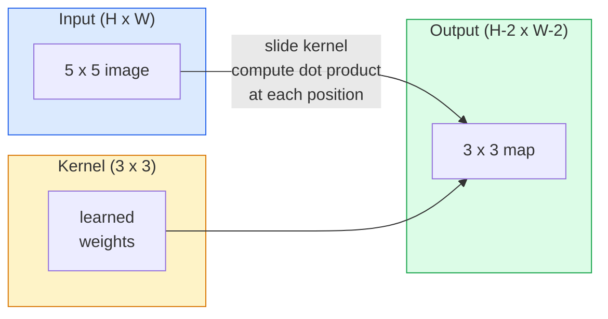
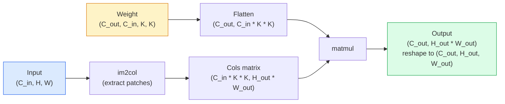

# التحولات من الصفر

> التموج هو طبقة كثيفة صغيرة جداً، يمكنك أن تشتريها على صورة واحدة، وتشارك في كل مكان نفس المجموعة من الوزن.

**Type:** Build
**Languages:** Python
**Prerequisites:** Phase 3 (Deep Learning Core), Phase 4 Lesson 01 (Image Fundamentals)
**Time:** ~75 分钟

## 學习目标
- استخدام NumPy فقط من صفر لتحقيق 2D التجميع، بما في ذلك الحلقة المربطة  نسخة و متجهة `im2col` إصدار
- 针对输入尺寸、核心尺寸、padding 和 step 的任意组合,计算输出空间尺寸,并解释 `(H - K + 2P) / S + 1`公式为什么成立
- يدخل في تصميم الأجزاء (الجهاز، الضباب، الشديدة، والسخيفة) ، وأوضح كل ما يسبب تنشيطات
- وضع التحولات على حافة واحدة، ووضع عمق التجميع على حافة الاستقبال

## 问题
في صورة RGB 224x224 تستخدم طبقة متصلة بالكامل ، كل عصبية  تحتاج إلى 224 * 224 * 3 = 150,528 وزن إدخال ∙ طبقة مخفية من 1000 وحدة فقط لديها بالفعل 1.5 مليار جزيئ ، وهذا قبل أن تتعلم أي شيء مفيد ∙ أسوأ من ذلك ، هذه الطبقة لا تعرف كلب من الزاوية اليسرى والكلب من الزاوية اليمنى السفلى هي نفس النموذج ∙ إنها تعتبر كل صورة موقعا على حدة كعامل مستقل ، وهذا في الواقع هو خطأ في الصورة: نقل قطة واحدة من ثلاث صور ، لا ينبغي أن يضطر الشبكة إلى إعادة تعلم هذا المفهوم ∙

图像模型 تحتاج إلى نوعين:**translation equivariance**(إدخال متحرك عندما يخرج أيضاً مع تحرك) و**parameter sharing**(مثل جهاز كشف الميزات في جميع المواقع) ―― الطبقات الكثيفة 两者都不给你──Convolution 两者都天然具备──

إن التحوّل لم يُصنع للتعلم العميق. إنه أيضًا تحديد الحافة في التضخم الجافغي، والضباب الغاسسي في التصوير الصناعي، وكذلك عملية مشابهة خلف كل فلتر الصوت.

## 概念
### ذرة واحدة، تتزلج

سوف تأخذ التناغم الثنائي الأبعاد ماتريكس وزن صغير تسمى النواة أو المصفاة، سوف تتسرب من خلال إدخالها، وتحسب في كل موقع لكل عنصر ضربة والنسبة والنسبة والنسبة والنسبة والنسبة والنسبة والنسبة والنسبة والنسبة والنسبة والنسبة والنسبة والنسبة والنسبة والنسبة والنسبة والنسبة والنسبة والنسبة والنسبة والنسبة والنسبة والنسبة والنسبة والنسبة والنسبة والنسبة والنسبة والنسبة والنسبة والنسبة والنسبة والنسبة والنسبة والنسبة والنسبة والنسبة والنسبة والنسبة والنسبة والنسبة والنسبة والنسبة والنسبة والنسبة والنسبة والنسبة والنسبة والنسبة والنسبة والنسبة والنسبة والنسبة والنسبة والنسبة والنسبة والنسبة والنسبة والنسبة والنسبة والنسبة والنسبة والنسبة والنسبة والنسبة والنسبة والنسبة والنسبة والنسبة والنسبة والنسبة والنسبة والنسبة والنسبة والنسبة والنسبة والنسبة والنسبة والنسبة والنسبة إلى



مثال 3x3 محدد،输入为 5x5 ((بدون ملابس، خطوة 1):

```
Input X (5 x 5):                Kernel W (3 x 3):

  1  2  0  1  2                   1  0 -1
  0  1  3  1  0                   2  0 -2
  2  1  0  2  1                   1  0 -1
  1  0  2  1  3
  2  1  1  0  1

The kernel slides across every valid 3 x 3 window. Output Y is 3 x 3:

 Y[0,0] = sum( W * X[0:3, 0:3] )
 Y[0,1] = sum( W * X[0:3, 1:4] )
 Y[0,2] = sum( W * X[0:3, 2:5] )
 Y[1,0] = sum( W * X[1:4, 0:3] )
 ... and so on
```

هذا هو الصيغة**shared weights、locality、sliding window**,هذه هي الفكرة الكاملة كل شيء آخر هو الحسابات

### صيغة حجم الإنتاج

给定输入空间尺寸 `H`حجم الألغام`K`التدليك`P`、دفع`S`:

```
H_out = floor( (H - K + 2P) / S ) + 1
```

تذكر ذلك. ستحسبها في كل معمارة.

| Scenario | H | K | P | S | H_out |
|----------|---|---|---|---|-------|
| Valid conv，无 padding | 32 | 3 | 0 | 1 | 30 |
| Same conv（保持尺寸） | 32 | 3 | 1 | 1 | 32 |
| 按 2 倍 downsample | 32 | 3 | 1 | 2 | 16 |
| Pool 2x2 | 32 | 2 | 0 | 2 | 16 |
| 大 receptive field | 32 | 7 | 3 | 2 | 16 |

"المثل" يعني اختيار P، حتى يكون عند S == 1 时 H_out == H。 بالنسبة للجزيرة K،也就是 P = (K - 1) / 2。 هذا هو السبب في أن الأجرام 3x3 占主导地位: فإنها ما زالت تمتلك نقطة مركزية من أجرام الجيدية الأقل。

### التدليك

بعد أن تتراكم 20 صورة، تصبح الصورة 224×224 184×184، وهذا يعني أن الحسابات على الحدود المضطربة، ستضطر أيضاً إلى تكوين صيغة متوافقة من الروابط المتبقية.

```
Zero padding (P = 1) on a 5 x 5 input:

  0  0  0  0  0  0  0
  0  1  2  0  1  2  0
  0  0  1  3  1  0  0
  0  2  1  0  2  1  0       Now the kernel can centre on pixel
  0  1  0  2  1  3  0       (0, 0) and still have three rows and
  0  2  1  1  0  1  0       three columns of values to multiply.
  0  0  0  0  0  0  0
```

实践中会遇到的模式:`zero`(أفضل رؤى)`reflect`(镜像边缘, في النماذج التوليدية`replicate`(مُعدّة)`circular`(المتوسط، في مشاكل الدرجة الثلاثة 中使用)

### خطوة

الخطوة هي الخطوة المتحركة`stride=1`هو القيمة المُعتمدة`stride=2`سوف يسمح بتقليل حجم الفضاء إلى النصف ، في سي إن إن داخل لا تستخدم طبقة تجميع فردية ولكن إجراء طريقة تقليدية للنموذج التدريجي.

```
Stride 1 on a 5 x 5 input, 3 x 3 kernel:

  starts: (0,0) (0,1) (0,2)        -> output row 0
          (1,0) (1,1) (1,2)        -> output row 1
          (2,0) (2,1) (2,2)        -> output row 2

  Output: 3 x 3

Stride 2 on the same input:

  starts: (0,0) (0,2)              -> output row 0
          (2,0) (2,2)              -> output row 1

  Output: 2 x 2
```

### قنوات مدخول متعددة

الصورة الحقيقية لديها ثلاثة قنوات. RGB  إدخال 3x3 التناغم  في الواقع هو 3x3x3 جسم: كل قناة إدخال لديها قطعة 3x3   في كل مكان، سوف تقوم على جميع القطعة الثلاث ضرب والبحث، ومضافة التحيز ‬

```
Input:   (C_in,  H,  W)        3 x 5 x 5
Kernel:  (C_in,  K,  K)        3 x 3 x 3 (one kernel)
Output:  (1,     H', W')       2D map

For a layer that produces C_out output channels, you stack C_out kernels:

Weight:  (C_out, C_in, K, K)   e.g. 64 x 3 x 3 x 3
Output:  (C_out, H', W')       64 x 3 x 3

Parameter count: C_out * C_in * K * K + C_out   (the + C_out is biases)
```

آخر خط هو ما تحسب عليه في النموذج.`64 * 3 * 3 * 3 + 64 = 1,792`个参数──很便宜──

### خدعة إم2كول

حلقات مستقرة  سهلة القراءة، ولكن بطيئة.



كل مستوى إنتاج من التنسيقات تطبيقات هي هذه الفكرة مع التسجيل التخفيجي من نوع ما

### الحقل الاستقبالي

单个3x3 conv 会查看9 输入像素──堆叠两个3x3 conv,第二层中的一个神经细胞 会查看5x5 输入像素──三个3x3 conv 给出7x7──一般来说:

```
RF after L stacked K x K convs (stride 1) = 1 + L * (K - 1)

With strides:   RF grows multiplicatively with stride along each layer.
```

السبب الأساسي لـ "一路 3x3" 能够有效(VGG、ResNet、ConvNeXt) هو، أن منطقتين 3x3 看到的输入区域与一个 5x5 conv 类似,但参数较少,而且中间多一个非线性.


```figure
convolution-kernel
```

## بناءها
### الخطوة 1: وضع صف

من الحد الأدنى من البدائية 开始: واحد في صف H x W  حول إضافة صفر من وظيفة ‬‬‬‬‬‬‬‬‬‬‬‬‬‬‬‬‬‬‬‬‬‬‬‬‬‬‬‬‬‬‬‬‬‬‬‬‬‬‬‬‬‬‬‬‬‬‬‬‬‬‬‬‬‬‬‬‬‬‬‬‬‬‬‬‬‬‬‬‬‬‬‬‬‬‬‬‬‬‬‬‬‬‬‬‬‬‬‬‬‬‬‬‬‬‬‬‬‬‬‬‬‬‬‬‬‬‬‬‬‬‬‬‬‬‬‬‬‬‬‬‬‬‬‬‬‬‬‬‬‬‬‬‬‬‬‬‬‬‬‬‬‬‬‬‬‬‬‬‬‬‬‬‬‬‬‬‬‬‬‬‬‬‬‬‬‬‬‬‬‬‬‬‬‬‬‬‬‬‬‬‬‬‬‬‬‬‬‬‬‬‬‬‬‬‬‬‬‬‬‬‬‬‬‬‬‬‬‬‬‬‬‬‬‬‬‬‬‬‬‬‬‬‬‬‬‬‬‬‬‬‬‬‬‬‬‬‬‬‬‬‬‬‬‬‬‬‬‬‬‬‬‬‬‬‬‬‬‬‬‬‬‬‬‬‬‬‬‬‬‬‬‬‬‬‬‬‬‬‬‬‬‬‬‬‬‬‬‬‬‬‬‬‬‬‬‬‬‬‬‬‬‬‬‬‬‬‬‬‬‬‬‬‬‬‬‬‬‬‬‬‬‬‬‬‬‬‬‬‬‬‬‬‬‬‬‬‬‬‬‬‬‬‬‬‬‬‬‬‬‬‬‬‬‬‬‬‬‬‬‬‬‬‬‬‬‬‬‬‬‬‬‬‬‬‬‬‬‬‬‬‬‬‬‬‬‬‬‬‬‬‬‬‬‬‬‬‬‬‬‬‬‬‬‬‬‬‬‬‬‬‬‬‬‬‬‬‬‬‬‬‬‬‬‬‬‬‬‬‬‬‬‬‬‬‬‬‬‬‬‬‬‬‬‬‬‬‬‬‬‬‬‬‬‬‬‬‬‬‬‬‬‬‬‬‬‬‬‬‬‬‬‬‬‬‬‬‬‬‬‬

```python
import numpy as np

def pad2d(x, p):
    if p == 0:
        return x
    h, w = x.shape[-2:]
    out = np.zeros(x.shape[:-2] + (h + 2 * p, w + 2 * p), dtype=x.dtype)
    out[..., p:p + h, p:p + w] = x
    return out

x = np.arange(9).reshape(3, 3)
print(x)
print()
print(pad2d(x, 1))
```

المحاور المتراكمة`x.shape[:-2]`ويعني نفس الوظيفة لا تحتاج إلى تغيير يمكن أن تعمل على`(H, W)`.`(C, H, W)`أو`(N, C, H, W)`.

### الخطوة 2: استخدام خروط嵌套 لتحقيق تحويل ثنائي الأبعاد

参考实现:慢,但毫不含糊.`torch.nn.functional.conv2d`ما يجب القيام به

```python
def conv2d_naive(x, w, b=None, stride=1, padding=0):
    c_in, h, w_in = x.shape
    c_out, c_in_w, kh, kw = w.shape
    assert c_in == c_in_w

    x_pad = pad2d(x, padding)
    h_out = (h + 2 * padding - kh) // stride + 1
    w_out = (w_in + 2 * padding - kw) // stride + 1

    out = np.zeros((c_out, h_out, w_out), dtype=np.float32)
    for oc in range(c_out):
        for i in range(h_out):
            for j in range(w_out):
                hs = i * stride
                ws = j * stride
                patch = x_pad[:, hs:hs + kh, ws:ws + kw]
                out[oc, i, j] = np.sum(patch * w[oc])
        if b is not None:
            out[oc] += b[oc]
    return out
```

أربع حلقات متجمعة ((قناة الخروج、خط、عمود، إضافة أخرى إلى C_in、kh、kw من خفية التطلبات)

### الخطوة 3: تحديد النواة التي تم تصميمها باليد

بناء جوهر صوبل عمودي، وضعها على صورة خطوة واحدة من المجموعة، ثم مشاهدة الحافة العمودية 被点亮──

```python
def synthetic_step_image():
    img = np.zeros((1, 16, 16), dtype=np.float32)
    img[:, :, 8:] = 1.0
    return img

sobel_x = np.array([
    [[-1, 0, 1],
     [-2, 0, 2],
     [-1, 0, 1]]
], dtype=np.float32)[None]

x = synthetic_step_image()
y = conv2d_naive(x, sobel_x, padding=1)
print(y[0].round(1))
```

预期在第7 列出现更大的正值(从左到右亮度增加),其他位置为零──这个印印就是你确认数学正确的智力检查──

### 步骤 4: im2col

ضع输入中 كل نافذة بحجم النواة 转换为一列的矩阵──对 `C_in=3, K=3`كل صف 27 رقم

```python
def im2col(x, kh, kw, stride=1, padding=0):
    c_in, h, w = x.shape
    x_pad = pad2d(x, padding)
    h_out = (h + 2 * padding - kh) // stride + 1
    w_out = (w + 2 * padding - kw) // stride + 1

    cols = np.zeros((c_in * kh * kw, h_out * w_out), dtype=x.dtype)
    col = 0
    for i in range(h_out):
        for j in range(w_out):
            hs = i * stride
            ws = j * stride
            patch = x_pad[:, hs:hs + kh, ws:ws + kw]
            cols[:, col] = patch.reshape(-1)
            col += 1
    return cols, h_out, w_out
```

لا يزال حلقة Python، ولكن الآن الحسابات الثقيلة تتحول إلى متعلقة متجهة.

### الخطوة 5: من خلال im2col + matmul 实现快速 conv

استخدم ضرب المصفوفة مرة واحدة لتحويل حلقة أربعة أضعاف

```python
def conv2d_im2col(x, w, b=None, stride=1, padding=0):
    c_out, c_in, kh, kw = w.shape
    cols, h_out, w_out = im2col(x, kh, kw, stride, padding)
    w_flat = w.reshape(c_out, -1)
    out = w_flat @ cols
    if b is not None:
        out += b[:, None]
    return out.reshape(c_out, h_out, w_out)
```

إصدارات: إصدارات: إصدارات: إصدارات: إصدارات: إصدارات: إصدارات: إصدارات: إصدارات: إصدارات: إصدارات: إصدارات: إصدارات: إصدارات: إصدارات: إصدارات: إصدارات: إصدارات: إصدارات: إصدارات: إصدارات: إصدارات: إصدارات: إصدارات: إصدارات: إصدارات: إصدارات: إصدارات: إصدارات: إصدارات: إصدارات: إصدارات: إصدارات: إصدارات: إصدارات: إصدارات: إصدارات: إصدارات: إصدارات: إصدارات: إصدارات: إصدارات: إصدارات: إصدارات: إصدارات: إصدارات: إصدارات: إصدارات: إصدارات: إصدارات: إصدارات: إصدارات: إصدارات: إصدارات: إصدارات: إصدارات: إصدارات: إصدارات: إصدارات: إصدارات: إصدارات: إصدارات: إصدارات: إصدارات: إصدارات: إصدارات: إصدارات: إصدارات: إصدارات: إصدارات: إصدارات: إصدارات: إصدارات: إص: إصدارات: إصدارات: إص: إصدارات: إص: إص: إص: إصدارات: إصدارات: إص: إصدارات: إص: إص: إص: إص: إص: إص: إص: إص: إص: إص: إص: إص: إص: إص: إص: إص: إص: إص: إص: إص: إص: إص: إص: إص: إص: إص: إص: إص: إص: إص: إص: إص: إ

```python
rng = np.random.default_rng(0)
x = rng.normal(0, 1, (3, 16, 16)).astype(np.float32)
w = rng.normal(0, 1, (8, 3, 3, 3)).astype(np.float32)
b = rng.normal(0, 1, (8,)).astype(np.float32)

y_naive = conv2d_naive(x, w, b, padding=1)
y_im2col = conv2d_im2col(x, w, b, padding=1)

print(f"max abs diff: {np.max(np.abs(y_naive - y_im2col)):.2e}")
```

`max abs diff`يجب أن تكون`1e-5`左右── هذا الاختلاف من نقطة عائمة 累加顺序، ليس حثالة──

### الخطوة 6: مجموعة من الأجزاء

خمسة مرشحات، عرض طبقة واحدة من الملفوفات قبل أي تدريب

```python
KERNELS = {
    "identity": np.array([[0, 0, 0], [0, 1, 0], [0, 0, 0]], dtype=np.float32),
    "blur_3x3": np.ones((3, 3), dtype=np.float32) / 9.0,
    "sharpen": np.array([[0, -1, 0], [-1, 5, -1], [0, -1, 0]], dtype=np.float32),
    "sobel_x": np.array([[-1, 0, 1], [-2, 0, 2], [-1, 0, 1]], dtype=np.float32),
    "sobel_y": np.array([[-1, -2, -1], [0, 0, 0], [1, 2, 1]], dtype=np.float32),
}

def apply_kernel(img2d, kernel):
    x = img2d[None].astype(np.float32)
    w = kernel[None, None]
    return conv2d_im2col(x, w, padding=1)[0]
```

 تطبيق إلى أي صورة على نطاق الرمادي 上时,blur 会柔化,حادة 会让边缘更清晰,Sobel-x 会点亮 الرواح العمودية,Sobel-y 会点亮 الحواف الأفقية──正是 AlexNet 和 VGG في اول طبقة من التدريبات المشتركة, 最终学到的模式,因为优秀的图像模型无论后续任务是什么,都需要边缘和斑探测器──

## استخدمها
بيتورش `nn.Conv2d`مع أجزاء أوتوغراد CUDA و تحسين cuDNN 包装了同一个操作──形象学 完全相同──

```python
import torch
import torch.nn as nn

conv = nn.Conv2d(in_channels=3, out_channels=64, kernel_size=3, stride=1, padding=1)
print(conv)
print(f"weight shape: {tuple(conv.weight.shape)}   # (C_out, C_in, K, K)")
print(f"bias shape:   {tuple(conv.bias.shape)}")
print(f"param count:  {sum(p.numel() for p in conv.parameters())}")

x = torch.randn(8, 3, 224, 224)
y = conv(x)
print(f"\ninput  shape: {tuple(x.shape)}")
print(f"output shape: {tuple(y.shape)}")
```

- لا .`padding=1`换成 `padding=0`, لـ " توينترا " انخفض إلى 222 × 222`stride=1`换成 `stride=2`, لوقت المقابلة انخفض إلى 112 × 112 , هذا هو نفس المادية التي تتذكرها

## 交付 it
本课会产出:

- `outputs/prompt-cnn-architect.md`: إرسال عرض، إعطاء حجم المدخلات ‧ الميزانية المعيار 和 هدف حقل استقبلية 后,design一组 `Conv2d`طبقات، وكل خطوة باستخدام صحيح K / S / P
- `outputs/skill-conv-shape-calculator.md`: مهارة، على مستوى عبر مواصفات الشبكة،并返回 كل بلوك من شكل الخروج

## التدريب
1. **(Easy)**给定一个 128x128 مقياس الرمادي 输入,以及一组 `[Conv3x3(s=1,p=1), Conv3x3(s=2,p=1), Conv3x3(s=1,p=1), Conv3x3(s=2,p=1)]`، يدوي الحساب لكل طبقة من حجم المجال المخرج والحقل الاستقبالي`nn.Sequential`إجراء التحقق
2. **(Medium)**扩展 `conv2d_naive`和 `conv2d_im2col`، دعهم يقبلون`groups`参数―― دليل `groups=C_in=C_out`يمكن أن يعيد تعديل عمق، ويعد ملامحها هو`C * K * K`بدلاً من ذلك`C * C * K * K`.
3. **(Hard)**الإنجاز`conv2d_im2col`                                                                                                                                                                                                                                                              `x`和 `w`درجة. في نفس النفاذ والوزن على`torch.autograd.grad`验证──关键技巧是:`col2im`و يجب أن تتكثف على النافذة

## 关键术语
| Term | What people say | What it actually means |
|------|----------------|----------------------|
| Convolution | “滑动一个 filter” | 一个在每个空间位置用 shared weights 应用的可学习 dot product；数学上是 cross-correlation，但大家都叫它 convolution |
| Kernel / filter | “feature detector” | 一个形状为 (C_in, K, K) 的小型 weight tensor，它与输入窗口的 dot product 会产生一个输出像素 |
| Stride | “每次跳多远” | 连续 kernel placements 之间的步长；stride 2 会让每个空间维度减半 |
| Padding | “边缘上的零” | 在输入周围添加的额外值，使 kernel 可以以边界像素为中心；`same` padding 会让输出尺寸等于输入尺寸 |
| Receptive field | “neuron 能看到多少” | 某个输出 activation 所依赖的原始输入 patch，会随着深度和 stride 增长 |
| im2col | “GEMM trick” | 把每个 receptive window 重排成列，让 convolution 变成一次大型 matrix multiply，这是每个快速 conv kernel 的核心 |
| Depthwise conv | “每个 channel 一个 kernel” | 一个满足 `groups == C_in` 的 conv，每个输出 channel 只由匹配的输入 channel 计算得到；是 MobileNet 和 ConvNeXt 的 backbone |
| Translation equivariance | “输入平移，输出平移” | 输入平移 k 个像素时，输出也平移 k 个像素的性质；shared weights 天然带来这个性质 |

## 延伸阅读
- [A guide to convolution arithmetic for deep learning (Dumoulin & Visin, 2016)](https://arxiv.org/abs/1603.07285) كل درجة  استعارة التدفق / التدفق / التوسع 权威图解
- [CS231n: Convolutional Neural Networks for Visual Recognition](https://cs231n.github.io/convolutional-networks/) 经典 محاضرات ملاحظات, بما في ذلك الأساسية im2col  تفسير
- [The Annotated ConvNet (fast.ai)](https://nbviewer.org/github/fastai/fastbook/blob/master/13_convolutions.ipynb) دفتر مذكرات من كتابة يدوية 走 إلى تدريب تصنيف الأرقام
- [Receptive Field Arithmetic for CNNs (Dang Ha The Hien)](https://distill.pub/2019/computing-receptive-fields/) 具備 مقال درجة الجودة الحقل الاستقبالي 计算交互式讲解器
