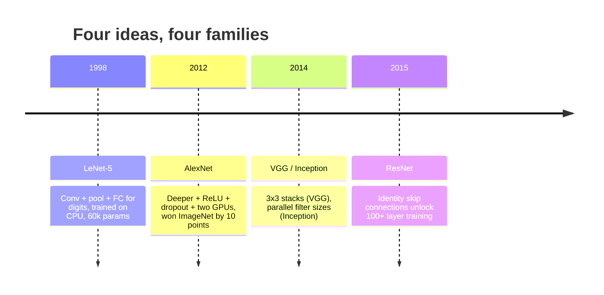
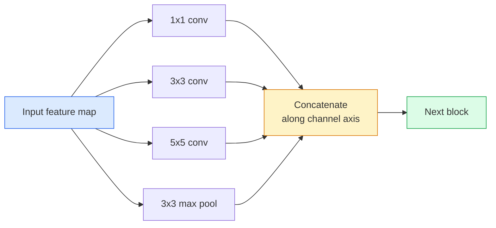
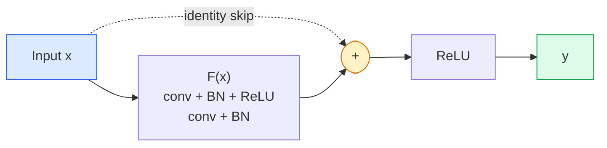

# سي إن إن  لينت إلى ريسنت

> في العقود الثلاثة الماضية كل CNN مهمة، في الأساس هي نفس النموذج غير الخطية downsample 配方، إعادة إضافة على فكرة جديدة.

**Type:** 学习 + 构建
**Languages:** Python
**先修要求：**المرحلة 3 الدروس 11 (PyTorch) ، المرحلة 4 الدروس 01 (مؤسسات الصورة) ، المرحلة 4 الدروس 02 (تحولات من الصفر)
**Time:** ~75 分钟

## 學习目标
-  تتبع LeNet-5 -> AlexNet -> VGG -> إنشاء -> سلسلة المباني ResNet,并说明每个家庭贡献的单一新想法
- في PyTorch تنفيذ LeNet-5 、 كتلة VGG 风格، فضلا عن ResNet BasicBlock، كل منها يتحكم في 40 صف
- تفسير لماذا يمكن أن تحويل اتصالات بقية إلى شبكة 1000 طبقة غير قابلة للتدريب إلى أحدث التكنولوجيا
- 阅读一个现代脊椎 (ResNet-18, ResNet-50), و查看源码前预测 أشكاله الإخراجية、المجال الاستقبالى 和 العد المعلم

## 问题
في عام 2011، أفضل تصنيف ImageNet من أفضل 5 دقة حوالي 74٪. في عام 2012 AlexNet  وصل إلى 85%. في عام 2015 ResNet  وصل إلى 96%. لا يوجد بيانات جديدة. لا يوجد جيل جديد من GPU. ارتفاع من فكرة بنية. مهندس الرؤية الذي يستطيع العمل  يجب أن يعرف أي فكرة تأتي من أي مقال، لأن كل فكرة تنتج في عام 2026، هي العمود الفقري من نفس المكونات.

按顺序学习这些网络也能让你避免一个常见错误: في شبكة بحجم LeNet 就能解决问题时,直接使用可用的最大模型──MNIST 不需要ResNet──了解每个家庭的规模曲线,能告诉你应该落在曲线的位置──

## 概念
### تغيير الرؤية



في الرؤية الكلاسيكية، لا شيء آخر أكثر أهمية من هذه الرابعة مرات

### (لينيت-5) (1998)

يان ليكون هو متعرف الأرقام ∙ 60,000 个参数∙ بليطين من المجموعة المشتركة ∙ طبقتين متصلتين بالكامل ∙ تنشطات التن

```
input (1, 32, 32)
  conv 5x5 -> (6, 28, 28)
  avg pool 2x2 -> (6, 14, 14)
  conv 5x5 -> (16, 10, 10)
  avg pool 2x2 -> (16, 5, 5)
  flatten -> 400
  dense -> 120
  dense -> 84
  dense -> 10
```

ما يقوله العالم الحديث CNN، أي التناوبات المتناوبة والعينة التنازلية مرة أخرى رأس المصنف الصغير، في الواقع هو طبقة عدد المزيد من القنوات، والتنشيطات أكبر، والتحسينات أفضل.

### أليكسنت (2012)

ثلاثة تحركات مع بعضها البعض تمكننا من إختراق ImageNet:

1. استخدام**ReLU**替代 tanh──Gradients 不再消失── تدريب السرعة提升六倍──
2. في الرأس متصل بالكامل 中使用 **Dropout**تحول التنظيم إلى طبقة واحدة، وليس إلى تيككوت
3. **Depth and width**خمسة طبقات من الملفات، ثلاثة طبقات كثيفة، 60M المعلمات، في اثنين من وحدات البيانات المعالجة الفنية، تدريب،并把模型 تمزق إلى اثنين من وحدات الكمبيوتر.

الرسم الثاني من المقال يظهر الانقسام بين GPU، أي اثنين من التيارات المتوازية. هذا التوازي هو حل عمل على مستوى الصلب، وليس في البنية. ولكن الأفكار الثلاثة السابقة لا تزال موجودة في كل نموذج تستخدمه.

### (VGG) (2014)

وجب سؤال واحد: ماذا سيحدث إذا استخدمنا فقط 3x3 من التحولات، ويتم زيادة عمقها؟

```
stack:   conv 3x3 -> conv 3x3 -> pool 2x2
repeat:  16 or 19 conv layers
```

两个 3 × 3 convs 看到的输入区域与一个 5 × 5 conv 相等,但参数更少 (2 * 9 * C^2 = 18C^2 مقابل 25 * C^2),并且中间额外多一个 ReLU。VGG 把这个观察变成完整架构──它的简单性,即一个区块类型反复堆叠,让它成为所有架构的后点参照──

代价: 138M المعلمات، تدريب بطيء، التأثير 昂贵

### بداية (2014,同年)

الجواب على "ما هو حجم النواة التي يجب أن أستخدمها؟" هو:



كل فروع مدينة متخصصة: 1x1 يستخدمها للاختلاط القناة، 3x3 يستخدمها للوطن النسيج، 5x5 يستخدمها لأنماط أكبر، تجمع يستخدمها لخصائص غير متغيرة من التحولات؛ التجميع 让下一层选择任何有用的分支.

### مشكلة التدهور

بحلول عام 2015، VGG-19 能工作، بينما VGG-32 不能── العميقة كان ينبغي أن يكون هناك مساعدة، ولكن بعد حوالي 20 طبقة، فقدان التدريب وفقدان الاختبار كان مختلفا تماما.

```
Plain deep network:
  y = f_L( f_{L-1}( ... f_1(x) ... ) )

Gradient wrt early layer:
  dL/dW_1 = dL/dy * df_L/df_{L-1} * ... * df_2/df_1 * df_1/dW_1

Each multiplicative term has magnitude roughly (weight magnitude) * (activation gain).
Stack 100 of them with gains < 1 and the gradient is effectively zero.
```

يمكن أن تعمل في 19 مستوى، وذلك بسبب معايير اللحظة تقريبا في نفس الوقت) دع التفعيلات الحفاظ على مقياس جيد. ولكن حتى معايير اللحظة، لا يمكن أن تنقذ أكثر من 30 مستوى أو نحو عمق.

### ResNet (2015)

هو، تشانغ، رين، سون طرح حل لجميع التغييرات:

```
standard block:   y = F(x)
residual block:   y = F(x) + x
```

`+ x`تعبير الطبقة 总能通过把 `F(x)`推到零来选择什么都不做──一个1000 طبقة ResNet 现在最差也不会比1层网络 差, لأن كل كتلة إضافية لديها فتحة هروب بسيطة──有这个保证, 优化器 愿意让每个块 变得* 稍微*有用;而稍微有用的块 堆叠100次,就是 state-of-the-art──



هذه المجموعة تتغير في كل مكان:

- **BasicBlock**(الـ (ريسترنت-18, ريسرنت-34): اثنين من طائرات 3×3، قفز 跨过二者
- **Bottleneck**(ResNet-50، -101, -152): 1x1 أسفل، 3x3 وسط، 1x1 فوق، قفز 跨过三者── عندما تقرير القناة تعادل 很高时更便宜──

عندما يُرجع ضطر إلى عبور العينة التنازلية (الخطوة = 2) 时, سيتم استبدال مسار الهوية إلى خطوة 1x1=2 conv, لتتطابق الأشكال.

### لماذا بقايا معنى رؤية فوق

هذه الفكرة التي تهتم حقا ليس تصنيف الصور. انها تهتم بتركيز الشبكات العميقة من  دعاء المدرجات 能幸存下来 إلى أدوات هندسية موثوقة  قابل للانتشار.


```figure
pooling
```

## بناءها
### الخطوة 1: LeNet-5

واحد من الحد الأدنى والثقة من LeNet.`nn.CrossEntropyLoss`، وليس من الارتباطات الغوسية الأصلية

```python
import torch
import torch.nn as nn
import torch.nn.functional as F

class LeNet5(nn.Module):
    def __init__(self, num_classes=10):
        super().__init__()
        self.conv1 = nn.Conv2d(1, 6, kernel_size=5)
        self.conv2 = nn.Conv2d(6, 16, kernel_size=5)
        self.pool = nn.AvgPool2d(2)
        self.fc1 = nn.Linear(16 * 5 * 5, 120)
        self.fc2 = nn.Linear(120, 84)
        self.fc3 = nn.Linear(84, num_classes)

    def forward(self, x):
        x = self.pool(torch.tanh(self.conv1(x)))
        x = self.pool(torch.tanh(self.conv2(x)))
        x = torch.flatten(x, 1)
        x = torch.tanh(self.fc1(x))
        x = torch.tanh(self.fc2(x))
        return self.fc3(x)

net = LeNet5()
x = torch.randn(1, 1, 32, 32)
print(f"output: {net(x).shape}")
print(f"params: {sum(p.numel() for p in net.parameters()):,}")
```

الناتج المتوقع: `output: torch.Size([1, 10])`،`params: 61,706`هذا هو مصنف الأرقام الكاملة لـ "OpenModern Vision"

### الخطوة 2: حجر VGG

واحد بلاك قابل للاستخدام: اثنين من 3 × 3 محركات، ريلو، النظام المكون، المجموعة القصوى.

```python
class VGGBlock(nn.Module):
    def __init__(self, in_c, out_c):
        super().__init__()
        self.conv1 = nn.Conv2d(in_c, out_c, kernel_size=3, padding=1)
        self.bn1 = nn.BatchNorm2d(out_c)
        self.conv2 = nn.Conv2d(out_c, out_c, kernel_size=3, padding=1)
        self.bn2 = nn.BatchNorm2d(out_c)
        self.pool = nn.MaxPool2d(2)

    def forward(self, x):
        x = F.relu(self.bn1(self.conv1(x)))
        x = F.relu(self.bn2(self.conv2(x)))
        return self.pool(x)

class MiniVGG(nn.Module):
    def __init__(self, num_classes=10):
        super().__init__()
        self.stack = nn.Sequential(
            VGGBlock(3, 32),
            VGGBlock(32, 64),
            VGGBlock(64, 128),
        )
        self.head = nn.Sequential(
            nn.AdaptiveAvgPool2d(1),
            nn.Flatten(),
            nn.Linear(128, num_classes),
        )

    def forward(self, x):
        return self.head(self.stack(x))

net = MiniVGG()
x = torch.randn(1, 3, 32, 32)
print(f"output: {net(x).shape}")
print(f"params: {sum(p.numel() for p in net.parameters()):,}")
```

في المدخلات ذات الحجم CIFAR 上 استخدام ثلاثة كتلة VGG، حوض التكيف، طبقة خطية ∼ حوالي 290k المعلمات ∼ CIFAR-10 已足够──

### 步骤 3: واحد ResNet BasicBlock

البناء الأساسي لـ ResNet-18 و ResNet-34

```python
class BasicBlock(nn.Module):
    def __init__(self, in_c, out_c, stride=1):
        super().__init__()
        self.conv1 = nn.Conv2d(in_c, out_c, kernel_size=3, stride=stride, padding=1, bias=False)
        self.bn1 = nn.BatchNorm2d(out_c)
        self.conv2 = nn.Conv2d(out_c, out_c, kernel_size=3, stride=1, padding=1, bias=False)
        self.bn2 = nn.BatchNorm2d(out_c)
        if stride != 1 or in_c != out_c:
            self.shortcut = nn.Sequential(
                nn.Conv2d(in_c, out_c, kernel_size=1, stride=stride, bias=False),
                nn.BatchNorm2d(out_c),
            )
        else:
            self.shortcut = nn.Identity()

    def forward(self, x):
        out = F.relu(self.bn1(self.conv1(x)))
        out = self.bn2(self.conv2(out))
        out = out + self.shortcut(x)
        return F.relu(out)
```

طبقات مخزنة 上的 `bias=False`هو نوع من النظام القياسي للشحنة، لأن برنامج بيتا BN قد معالج التحيز، لذلك في الوقت نفسه تحمل التحيز المشترك هو ضائع.`shortcut`فقط تحتاج إلى صداقة حقيقية، وإلا فهي هوية غير عمل.

### الخطوة الرابعة: شبكة صغيرة

堆叠四组 BasicBlocks، الحصول على واحد مناسب لدخلات حجم CIFAR من قابل العمل ResNet

```python
class TinyResNet(nn.Module):
    def __init__(self, num_classes=10):
        super().__init__()
        self.stem = nn.Sequential(
            nn.Conv2d(3, 32, kernel_size=3, stride=1, padding=1, bias=False),
            nn.BatchNorm2d(32),
            nn.ReLU(inplace=True),
        )
        self.layer1 = self._make_group(32, 32, num_blocks=2, stride=1)
        self.layer2 = self._make_group(32, 64, num_blocks=2, stride=2)
        self.layer3 = self._make_group(64, 128, num_blocks=2, stride=2)
        self.layer4 = self._make_group(128, 256, num_blocks=2, stride=2)
        self.head = nn.Sequential(
            nn.AdaptiveAvgPool2d(1),
            nn.Flatten(),
            nn.Linear(256, num_classes),
        )

    def _make_group(self, in_c, out_c, num_blocks, stride):
        blocks = [BasicBlock(in_c, out_c, stride=stride)]
        for _ in range(num_blocks - 1):
            blocks.append(BasicBlock(out_c, out_c, stride=1))
        return nn.Sequential(*blocks)

    def forward(self, x):
        x = self.stem(x)
        x = self.layer1(x)
        x = self.layer2(x)
        x = self.layer3(x)
        x = self.layer4(x)
        return self.head(x)

net = TinyResNet()
x = torch.randn(1, 3, 32, 32)
print(f"output: {net(x).shape}")
print(f"params: {sum(p.numel() for p in net.parameters()):,}")
```

أربعة أجزاء من الكتلة، كل مجموعة اثنين.

### الخطوة 5: مقارنة كفاءة المعلمات إلى الميزات

ضع نفس المدخل عبر شبكات، ومقارنة مع العد البيروت

```python
def summary(name, net, x):
    y = net(x)
    params = sum(p.numel() for p in net.parameters())
    print(f"{name:12s}  input {tuple(x.shape)} -> output {tuple(y.shape)}  params {params:>10,}")

x = torch.randn(1, 3, 32, 32)
summary("LeNet5",     LeNet5(),       torch.randn(1, 1, 32, 32))
summary("MiniVGG",    MiniVGG(),      x)
summary("TinyResNet", TinyResNet(),   x)
```

ثلاثة نماذج، ثلاثة أوقات، عدد المعايير 相差三个 عددية درجة.

## استخدمها
`torchvision.models`إعطاء إصدارات متقدمة من جميع النماذج فوقها. توقيع الدعوة من مختلف الأسرة يتفق تماماً. هذا هو معنى استبعاد العمود الفقري.

```python
from torchvision.models import resnet18, ResNet18_Weights, vgg16, VGG16_Weights

r18 = resnet18(weights=ResNet18_Weights.IMAGENET1K_V1)
r18.eval()

print(f"ResNet-18 params: {sum(p.numel() for p in r18.parameters()):,}")
print(r18.layer1[0])
print()

v16 = vgg16(weights=VGG16_Weights.IMAGENET1K_V1)
v16.eval()
print(f"VGG-16   params: {sum(p.numel() for p in v16.parameters()):,}")
```

ريسنت-18 لديها 11.7M المعلمات. ويغ-16 لديها 138M. تعديل الصورة النتيجة الأولى  تقارب (69.8% مقابل 71.6%)  علاوة على ذلك، فإن الاتصالات المتبقية تُعطيك كفاءة 12x من المعلمات 收益. هذا هو السبب في أن فترة 2016 إلى ظهور ViT في عام 2021، كانت فاريان ريسنت دائماً غالبية، وما زالت غالبية في التنفيذ الحقيقي للمحاسبات المحدودة.

بالنسبة للتعلم النقل، فإن التركيبات دائما نفسها: الحمل المتدرب مسبقاً، التجميد على العمود الفقري، استبدال رأس المصنف.

```python
for p in r18.parameters():
    p.requires_grad = False
r18.fc = nn.Linear(r18.fc.in_features, 10)
```

三行──現在你擁有 10 فئة CIFAR تصنيف، فإنه يتبعه ImageNet 訓練出的 تمثيلات──

## 交付 it
本课会产出:

- `outputs/prompt-backbone-selector.md`: إشارة، وفقا للمهمة ∆ حجم المجموعة والحساب الميزانية  اختيار مناسبة لـ عائلة CNN (LeNet/VGG/ResNet/MobileNet/ConvNeXt) 
- `outputs/skill-residual-block-reviewer.md`: مهارة، سوف تتعلم ماودول PyTorch 并标记跳-connection 错误(تغيير الخطوة 时缺少快捷方式、快捷方式激活顺序、BN 相对的位置)

## التدريب
1. **(Easy)**手动 طبقة حسب طبقة`TinyResNet`ملامحها`sum(p.numel() for p in net.parameters())`بالنسبة لميزانية المعايير، أين ذهب الجزء الرئيسي، هو الموافقات، أو رأس المصنف؟
2. **(Medium)**实现 Bottleneck block (1x1 -> 3x3 -> 1x1 مع skip) ، وذلك لإنشاء شبكة على شكل ResNet-50 من CIFAR`TinyResNet`مقابل ذلك
3. **(Hard)**من`BasicBlock`تمرّد التواصل المباشر، في CIFAR-10 上分别 تدريب شبكة "مواضعة" من 34 كتلة وRESNET من 34 كتلة، كل تدريب 10 حقائق.

## 关键术语
| Term | What people say | What it actually means |
|------|----------------|----------------------|
| Backbone | “模型” | 产生 feature map 并馈送给 task head 的 convolutional blocks 堆栈 |
| Residual connection | “Skip connection” | `y = F(x) + x`；通过将 F 设为零，让 Optimizer 学习 identity，从而让任意 depth 可训练 |
| BasicBlock | “两个带 skip 的 3x3 convs” | ResNet-18/34 的 building block：conv-BN-ReLU-conv-BN-add-ReLU |
| Bottleneck | “1x1 down，3x3，1x1 up” | ResNet-50/101/152 block；在高 channel counts 下成本低，因为 3x3 运行在缩减后的 width 上 |
| Degradation problem | “更深反而更差” | 超过约 20 个 plain conv layers 后，training error 和 test error 都会增加；由 residual connections 解决，而不是靠更多数据 |
| Stem | “第一层” | 将 3-channel input 转换为基础 feature width 的初始 conv；ImageNet 通常是 7x7 stride 2，CIFAR 通常是 3x3 stride 1 |
| Head | “分类器” | final backbone block 之后的 layers：adaptive pool、flatten、linear(s) |
| Transfer learning | “Pretrained weights” | 加载在 ImageNet 上训练过的 backbone，并且只在你的 task 上 fine-tune head |

## 延伸阅读
- [Deep Residual Learning for Image Recognition (He et al., 2015)](https://arxiv.org/abs/1512.03385) مقالات ResNet 文本; 每张图都值得研究
- [Very Deep Convolutional Networks (Simonyan & Zisserman, 2014)](https://arxiv.org/abs/1409.1556) مقال VGG 文; لا يزال فهم  لماذا هو أفضل مرجع ل 3x3
- [ImageNet Classification with Deep CNNs (Krizhevsky et al., 2012)](https://papers.nips.cc/paper_files/paper/2012/hash/c399862d3b9d6b76c8436e924a68c45b-Abstract.html) AlexNet;终结 مكونات مصنوعة يدويا 时代的论文
- [Going Deeper with Convolutions (Szegedy et al., 2014)](https://arxiv.org/abs/1409.4842) البداية v1; لا يزال يظهر في تحويلات الرؤية وسط المصفاة المتوازية  فكرة
