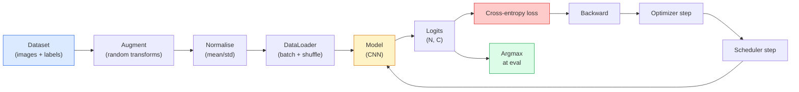

# تصنيف الصورة

> المصنف هو وظيفة من تقسيم الاحتمالات من البيكسل إلى الفئات العليا.

**Type:** Build
**Languages:** Python
**Prerequisites:** Phase 2 Lesson 09 (Model Evaluation), Phase 3 Lesson 10 (Mini Framework), Phase 4 Lesson 03 (CNNs)
**Time:** ~75 minutes

## 學习目标

- في CIFAR-10 上构建端到端 تصنيف الصور: مجموعة بيانات
- 解释每个组件的作用(dataloader、loss、optimizer、scheduler、augmentation),并预测其中任何一个出错会如何体现在 Loss 曲线上
- من التحقق من التخليط والتقطيع وتسهيل العلامات، وموضح متى يستحق إضافةها
- 阅读 ماتريكس الخلط 和 جدول الدقة / استدعاء لكل فئة ، باستخدام دقة إجمالية  خارج مجموعة بيانات التشخيص المعلومات وموديل الفشل

## 问题

كل مهمة رؤية على الخط النهائي، على مستوى ما، سوف تكون حول تصنيف الصورة. التعرف على المناطق، تصنيف. التقسيم. التقسيم. تصنيف. التسويق.

غالبية حوادث التصنيف غير موجودة في النموذج. تتمثل في خط الأنابيب: تخريب التطبيعات غير المتحركة، وتعزيز الملامح المتحولة، وتقسيم التحقق من التلوث من البيانات المتدربة، بعد فترة 30  انتشار معدل التعلم. يمكن أن يصل إلى 93% من CNN في CIFAR-10 على المعدل الصحيح، وعادة ما يصل إلى 70-75% فقط في حالة الخسارة، بينما تبدو منحنى الخسارة منطقية تمامًا.

هذا المقطع سوف يُدخل في خط الأنابيب بأكمله، فليُفحص كل جزء منه`torchvision.datasets`أي شيء يمكن أن يخفي الحشرات

## مفهوم الأساسي

### خط الأنابيب للتصنيف



كل خط في هذه الدورة ربما يحوي حذاء.`model(x).softmax()`مدينة حساب خطأ من درجاتها. تعزيزات لا تستخدم إلا للمدخلات، لا تستخدم على الملصقات، باستثناء الاختلاط، لأنه سوف يختلط في نفس الوقت.`optimizer.zero_grad()`يجب أن يتم تنفيذ كل خطوة مرة واحدة؛ قفزها سوف تتراكم درجة، تبدو مثل معدل التعلم 极不稳定── كل من هذه الأخطاء ستجعلها تعلّم 曲线变平, ولكن لا يلقي على الخطأ──

### التشابهات المتقاطعة مع اللوجيتس و softmax

تصنيف سوف يؤدي إلى إنتاج الصور`C`个数字,称为 logits. 应用 softmax 会把它们转换成概率分布:

```
softmax(z)_i = exp(z_i) / sum_j exp(z_j)
```

الإحتمالات السلبية للطبقة الـ "الـ "الـ "الـ "الـ "الـ "الـ "الـ "الـ "الـ "الـ "الـ"الـ "الـ"الـ"الـ"الـ"الـ"الـ"الـ"الـ"الـ"الـ"الـ"الـ"

```
CE(z, y) = -log( softmax(z)_y )
        = -z_y + log( sum_j exp(z_j) )
```

على الجانب الأيمن هي رقم الثمن ثابتة على الجانب الخاطئ`nn.CrossEntropyLoss`في المقابل، يتم تحديد المعدلات المعدنية المعدنية المعدنية المعدنية المعدنية المعدنية المعدنية المعدنية المعدنية المعدنية المعدنية المعدنية المعدنية المعدنية المعدنية المعدنية المعدنية المعدنية المعدنية المعدنية المعدنية المعدنية المعدنية المعدنية المعدنية المعدنية المعدنية المعدنية المعدنية المعدنية المعدنية المعدنية المعدنية المعدنية المعدنية المعدنية المعدنية المعدنية المعدنية المعدنية المعدنية المعدنية المعدنية المعدنية المعدنية المعدنية المعدنية المعدنية المعدنية المعدنية المعدنية المعدنية المعدنية المعدنية المعدنية المعدنية المعدنية المعدنية المعدنية المعدنية المعدنية المعدنية المعدنية المعدنية المعدنية المعدنية المعدنية المعدنية المعدنية المعدنية المعدنية المعدنية المعدنية المعدنية المعدنية المعدنية المعدنية المعدنية المعدنية المعدنية المعدنية المعدنية المعدنية المعدنية المعدنية المعدنية المعدنية المعدنية المعدنية المعدنية المعدنية المعدنية المعدنية المعدنية المعدنية المعدنية المعدنية المعدنية المعدنية المعدنية المعدنية المعدنية المعدنية المعدنية المعدنية المعدنية المعدنية المعدنية المعدنية المعدنية المعدنية المعدنية المعدنية المعدنية المعدنية المعدنية المعدنية المعدنية المعدنية المعدنية المعدنية المعدنية المعدنية المعدنية المعدنية المعدنية المعدنية المعدنية المعدنية المعدنية المعدنية المعدنية المعدنية المعدنية المعدنية المعدنية المعدنية المعدنية المعدنية المعدنية المعدنية المعدنية المعدنية المعدنية المعدنية المعدنية المعدنية المعدنية المعدنية المعدنية المعدنية المعدنية

### لماذا التكثيف فعال

إنّه من المفترض أن يكون هناك تحديداً إضافياً في الترجمة، ولكنّه لا يوجد أيّ تغيرات داخلية في المنتجات، أو في المزاحف، أو في الاضطرابات اللونية أو في الاحتيال.

```
Original crop:  "dog facing left"
Flip:           "dog facing right"       <- same label, different pixels
Rotate(+15):    "dog, slight tilt"
Colour jitter:  "dog in warmer light"
RandomErasing:  "dog with patch missing"
```

规则是:增长 必须保留标签──对数字做切割和旋转可能将将6 变成9; بالنسبة لهذه مجموعة البيانات، عليك استخدام نطاقات دوران أصغر،并选择尊重数字-specific invariations──

### خليط و خليط

التكثيف العادي سوف يحول البيكسلات، ولكن الحفاظ على العلامات لـ واحد حار.**Mixup**和 **cutmix**سوف نضع الثمن في نفس الوقت لفتح هذا النقطة

```
Mixup:
  lambda ~ Beta(a, a)
  x = lambda * x_i + (1 - lambda) * x_j
  y = lambda * y_i + (1 - lambda) * y_j

Cutmix:
  paste a random rectangle of x_j into x_i
  y = area-weighted mix of y_i and y_j
```

لماذا يكون ذلك مفيدًا: النموذج لا يتذكر أهداف واحدة ساخنة ، بل يتعلم بين الفصول                                                                                                                                                                                                                                                  

### تسليح اللوحات

لا تستخدم`[0, 0, 1, 0, 0]`كهدف تدريب، بل استخدام`[eps/C, eps/C, 1-eps, eps/C, eps/C]`، من بينهم`eps`هو مثل 0.1 مثل هذا القيمة الصغيرة. انها تمنع النموذج من تكوين أي من اللوجيتات المتقدمة، و تقريباً بدون تكلفة تحسين التصفية. منذ 1.10 بيتورش، تم إدخالها في.`nn.CrossEntropyLoss(label_smoothing=0.1)`.

### التقييم خارج دقة

الدقة الإجمالية سوف تغطي عدم التوازن. إذا كان التنبؤ دائمًا مع الطراز الأغلبية، يمكن الحصول على 90٪.

- **Per-class accuracy** كل فئة واحد الأرقام ؛ سيتم إعلان فوريًا أن الفئة لا تظهر كفاءة
- **Confusion matrix** C x C شبكة، من بينها الصف i col j = الطبقة الحقيقية i 被预测为类 j 的数量; Diagonal 是正确预测,off-diagonals 才是模型 问题所在。
- **Top-1 / Top-5** صحيح الطبقة نعم في أول 1 أو 5 التنبؤات في؛Top-5 بالنسبة ImageNet  مهم، لأن مثل نورويش تيريير و نورفولك تيريير هذه الفئات 确实存在歧义──
- **Calibration (ECE)**هل هناك حقاً 80% من الوقت صحيح؟ شبكات حديثة 系统性地过度自信; يمكن استخدام درجة الحرارة أو تسهيل التسمية


```figure
receptive-field
```

## بناءها

### الخطوة 1: مجموعة بيانات صناعية محددة

CIFAR-10  تقع على القرص الصوتي. لكي يجعل هذا الدروس قابلة للتعديل وسرعة، قمنا ببناء مجموعة بيانات اصطناعية تبدو مثل CIFAR، وذلك مع وجود هيكل خاص للدرجة، نموذج يجب أن تتعلم الصور 32x32 RGB.

```python
import numpy as np
import torch
from torch.utils.data import Dataset


def synthetic_cifar(num_per_class=1000, num_classes=10, seed=0):
    rng = np.random.default_rng(seed)
    X = []
    Y = []
    for c in range(num_classes):
        centre = rng.uniform(0, 1, (3,))
        freq = 2 + c
        for _ in range(num_per_class):
            yy, xx = np.meshgrid(np.linspace(0, 1, 32), np.linspace(0, 1, 32), indexing="ij")
            r = np.sin(xx * freq) * 0.5 + centre[0]
            g = np.cos(yy * freq) * 0.5 + centre[1]
            b = (xx + yy) * 0.5 * centre[2]
            img = np.stack([r, g, b], axis=-1)
            img += rng.normal(0, 0.08, img.shape)
            img = np.clip(img, 0, 1)
            X.append(img.astype(np.float32))
            Y.append(c)
    X = np.stack(X)
    Y = np.array(Y)
    idx = rng.permutation(len(X))
    return X[idx], Y[idx]


class ArrayDataset(Dataset):
    def __init__(self, X, Y, transform=None):
        self.X = X
        self.Y = Y
        self.transform = transform

    def __len__(self):
        return len(self.X)

    def __getitem__(self, i):
        img = self.X[i]
        if self.transform is not None:
            img = self.transform(img)
        img = torch.from_numpy(img).permute(2, 0, 1)
        return img, int(self.Y[i])
```

كل فئة لديها لونها الخاص و نمط تردد، إضافة إلى ضجيج غوسيان، إلزام نموذج تعلم إشارة، بدلا من بيكسل الذاكرة.

### الخطوة الثانية: التطبيع والإضافة

كل خط رؤية لديه هذين التحولين

```python
def standardize(mean, std):
    mean = np.array(mean, dtype=np.float32)
    std = np.array(std, dtype=np.float32)
    def _fn(img):
        return (img - mean) / std
    return _fn


def random_hflip(p=0.5):
    def _fn(img):
        if np.random.random() < p:
            return img[:, ::-1, :].copy()
        return img
    return _fn


def random_crop(pad=4):
    def _fn(img):
        h, w = img.shape[:2]
        padded = np.pad(img, ((pad, pad), (pad, pad), (0, 0)), mode="reflect")
        y = np.random.randint(0, 2 * pad)
        x = np.random.randint(0, 2 * pad)
        return padded[y:y + h, x:x + w, :]
    return _fn


def compose(*fns):
    def _fn(img):
        for fn in fns:
            img = fn(img)
        return img
    return _fn
```

في المحاصيل  قبل استخدام الرؤية-الباد، وليس الصفر-الباد، لأن الحدود السوداء هي إشارة، نموذج 会学会 بطريقة لا فائدة منها تجاهلها.

### 步骤 3: مزيج

في مرحلة التدريب 内部混合两张图像 和两个标签── يتحقق من تحويل المجموعة، لذلك يقع على مقربة من الممر المضي، وليس داخل مجموعة البيانات──

```python
def mixup_batch(x, y, num_classes, alpha=0.2):
    if alpha <= 0:
        return x, torch.nn.functional.one_hot(y, num_classes).float()
    lam = float(np.random.beta(alpha, alpha))
    idx = torch.randperm(x.size(0), device=x.device)
    x_mixed = lam * x + (1 - lam) * x[idx]
    y_onehot = torch.nn.functional.one_hot(y, num_classes).float()
    y_mixed = lam * y_onehot + (1 - lam) * y_onehot[idx]
    return x_mixed, y_mixed


def soft_cross_entropy(logits, soft_targets):
    log_probs = torch.log_softmax(logits, dim=-1)
    return -(soft_targets * log_probs).sum(dim=-1).mean()
```

`soft_cross_entropy`هو ضد التوزيع الناعم التسمية التنقلات. عندما يكون الهدف هو واحد حار.

### الخطوة 4: حلقة التدريب

完整配方: عبر البيانات مرة واحدة، كل دفعة 计算一次 gradients، كل عصر 执行一次 scheduler step。

```python
import torch
import torch.nn as nn
from torch.utils.data import DataLoader
from torch.optim import SGD
from torch.optim.lr_scheduler import CosineAnnealingLR

def train_one_epoch(model, loader, optimizer, device, num_classes, use_mixup=True):
    model.train()
    total, correct, loss_sum = 0, 0, 0.0
    for x, y in loader:
        x, y = x.to(device), y.to(device)
        if use_mixup:
            x_m, y_soft = mixup_batch(x, y, num_classes)
            logits = model(x_m)
            loss = soft_cross_entropy(logits, y_soft)
        else:
            logits = model(x)
            loss = nn.functional.cross_entropy(logits, y, label_smoothing=0.1)
        optimizer.zero_grad()
        loss.backward()
        optimizer.step()
        loss_sum += loss.item() * x.size(0)
        total += x.size(0)
        # Training accuracy vs the un-mixed labels `y` is only an approximation
        # when mixup is on (the model saw soft targets, not y). Treat it as a
        # rough progress signal; rely on val accuracy for real performance.
        with torch.no_grad():
            pred = logits.argmax(dim=-1)
            correct += (pred == y).sum().item()
    return loss_sum / total, correct / total


@torch.no_grad()
def evaluate(model, loader, device, num_classes):
    model.eval()
    total, correct = 0, 0
    loss_sum = 0.0
    cm = torch.zeros(num_classes, num_classes, dtype=torch.long)
    for x, y in loader:
        x, y = x.to(device), y.to(device)
        logits = model(x)
        loss = nn.functional.cross_entropy(logits, y)
        pred = logits.argmax(dim=-1)
        for t, p in zip(y.cpu(), pred.cpu()):
            cm[t, p] += 1
        loss_sum += loss.item() * x.size(0)
        total += x.size(0)
        correct += (pred == y).sum().item()
    return loss_sum / total, correct / total, cm
```

كل مرة تقوم بتدوين حلقة تدريبية يجب أن تتحقق من خمسة متغيرات:

1. التدريب 前调用 `model.train()`, التقييم 前调用 `model.eval()`, هذا سيشكل تغيير الانسحاب و النظام البشري
2. في`.backward()` 前调用 `.zero_grad()`.
3. 累积 metrics 时使用 `.item()`، هذا لن يجعل الرسم البياني الحسابي يعيش دائما.
4. التقييم 期间使用 `@torch.no_grad()`, و توفير الذاكرة و الوقت , لمنع الحوادث الصغيرة
5. للخطوط الخامة جعل argmax، بدلا من softmax جعل argmax، النتيجة نفسها، أقل واحد op¬¬

### الخطوة 5: التجميع

استخدام上一课的`TinyResNet`، تدرب عدة حقول ثم تقييمها

```python
from main import synthetic_cifar, ArrayDataset
from main import standardize, random_hflip, random_crop, compose
from main import mixup_batch, soft_cross_entropy
from main import train_one_epoch, evaluate
# TinyResNet comes from the previous lesson (03-cnns-lenet-to-resnet).
# Adjust the import path to wherever you stored the previous lesson's code.
from cnns_lenet_to_resnet import TinyResNet  # example placeholder

X, Y = synthetic_cifar(num_per_class=500)
split = int(0.9 * len(X))
X_train, Y_train = X[:split], Y[:split]
X_val, Y_val = X[split:], Y[split:]

mean = [0.5, 0.5, 0.5]
std = [0.25, 0.25, 0.25]
train_tf = compose(random_hflip(), random_crop(pad=4), standardize(mean, std))
eval_tf = standardize(mean, std)

train_ds = ArrayDataset(X_train, Y_train, transform=train_tf)
val_ds = ArrayDataset(X_val, Y_val, transform=eval_tf)

train_loader = DataLoader(train_ds, batch_size=128, shuffle=True, num_workers=0)
val_loader = DataLoader(val_ds, batch_size=256, shuffle=False, num_workers=0)

device = "cuda" if torch.cuda.is_available() else "cpu"
model = TinyResNet(num_classes=10).to(device)
optimizer = SGD(model.parameters(), lr=0.1, momentum=0.9, weight_decay=5e-4, nesterov=True)
scheduler = CosineAnnealingLR(optimizer, T_max=10)

for epoch in range(10):
    tr_loss, tr_acc = train_one_epoch(model, train_loader, optimizer, device, 10, use_mixup=True)
    va_loss, va_acc, _ = evaluate(model, val_loader, device, 10)
    scheduler.step()
    print(f"epoch {epoch:2d}  lr {scheduler.get_last_lr()[0]:.4f}  "
          f"train {tr_loss:.3f}/{tr_acc:.3f}  val {va_loss:.3f}/{va_acc:.3f}")
```

في مجموعة بيانات اصطناعية ، فإنه سوف يصل إلى دقة التحقق المثالية في خمس فترات ، وهذا هو التركيز: النبوب هو صحيح ، النموذج يمكن أن يتعلم شيء.

### الخطوة 6: قراءة المصفوفة الخلط

على وجه اليقين لا يمكن أن تخبرك نموذج في أي مكان يفشل ماتريكس الارتباك يمكن أن يكون

```python
def print_confusion(cm, labels=None):
    c = cm.shape[0]
    labels = labels or [str(i) for i in range(c)]
    print(f"{'':>6}" + "".join(f"{l:>5}" for l in labels))
    for i in range(c):
        row = cm[i].tolist()
        print(f"{labels[i]:>6}" + "".join(f"{v:>5}" for v in row))
    print()
    tp = cm.diag().float()
    fp = cm.sum(dim=0).float() - tp
    fn = cm.sum(dim=1).float() - tp
    prec = tp / (tp + fp).clamp_min(1)
    rec = tp / (tp + fn).clamp_min(1)
    f1 = 2 * prec * rec / (prec + rec).clamp_min(1e-9)
    for i in range(c):
        print(f"{labels[i]:>6}  prec {prec[i]:.3f}  rec {rec[i]:.3f}  f1 {f1[i]:.3f}")

_, _, cm = evaluate(model, val_loader, device, 10)
print_confusion(cm)
```

行是真类,列是预测. بين الفصول 3 و 5 ظهرت 1 حسابات خارج الشوارع، مما يعني أن النموذج 混 بين هذين الفئتين،并为定向数据收集或类型特定增强 提供起点──

## استخدمها

`torchvision`سأضع كل ما هو فوق في حزمة مكونات عادية.

```python
from torchvision.datasets import CIFAR10
from torchvision.transforms import Compose, RandomCrop, RandomHorizontalFlip, ToTensor, Normalize

mean = (0.4914, 0.4822, 0.4465)
std = (0.2470, 0.2435, 0.2616)
train_tf = Compose([
    RandomCrop(32, padding=4, padding_mode="reflect"),
    RandomHorizontalFlip(),
    ToTensor(),
    Normalize(mean, std),
])
eval_tf = Compose([ToTensor(), Normalize(mean, std)])

train_ds = CIFAR10(root="./data", train=True,  download=True, transform=train_tf)
val_ds   = CIFAR10(root="./data", train=False, download=True, transform=eval_tf)
```

هناك نقطتين يجب أن نلاحظها: المتوسط / ستد هو**dataset-specific**في الواقع، أنها في مجموعة تدريب CIFAR-10 التي تم تحديدها، وليس ImageNet؛ فإن البد التأثير هو سياسة المحاصيل المخصصة للمجتمع.

## 交付 it

本课会产出:

- `outputs/prompt-classifier-pipeline-auditor.md` إشارة سريعة، تستخدم في تدريب المراجعة وإذا كان يلبي الخمسة المتغيرات أعلاه، ومكشف الانتهاك الأول.
- `outputs/skill-classification-diagnostics.md` مهارة، أعطى خلط المصفوفة 和 أسماء الفئة 列表后,总结 لكل فئة الفشل,并提出最有影响的单个修复──

## التدريب

1. **(Easy)**في مجموعة بيانات اصطناعية، باستخدام نفس النموذج، تمارس التدريبات المختلطة والتي لا تتضارب، كل تدريب خمس حقائق.
2. **(Medium)**实现 Cutout: في كل صورة تدريبية 中随机把一个8×8 方块置零,并运行 ablation,对比无增长、hflip+crop、hflip+crop+cutout、hflip+crop+mixup。报告每种设置的 val精度──
3. **(Hard)**构建CIFAR-100管道(100 فئة، نفس حجم المدخل) ،并复现一次 Run تدريب ResNet-34,使结果与发表精度差在1% 以内。额外任务:扫三学习率和两个重量衰减,记录到本地 CSV,并生成最终的混-矩阵-顶级混表。

## 关键术语

| Term | 人们通常怎么说 | 它实际是什么意思 |
|------|----------------|----------------------|
| Logits | “Raw outputs” | 每张图像对应的 pre-softmax C 维 Vector；cross-entropy 期望接收它们，而不是 softmaxed values |
| Cross-entropy | “The loss” | 正确 class 的 negative log-probability；在一个稳定 op 中结合 log-softmax 和 NLL |
| DataLoader | “The batcher” | 用 shuffling、batching 和（可选）multi-worker loading 包装 dataset；一半 training bugs 都会被怪到它头上 |
| Augmentation | “Random transforms” | training time 的任何 pixel-level transform，只要它保留 label；教会 CNN 它原生不具备的 invariances |
| Mixup / Cutmix | “Mix two images” | 同时混合 inputs 和 labels，让 classifier 学习平滑插值，而不是硬边界 |
| Label smoothing | “Softer targets” | 用 (1-eps, eps/(C-1), ...) 替换 one-hot；改善 calibration，并略微提升 accuracy |
| Top-k accuracy | “Top-5” | 正确 class 位于 k 个最高 probability predictions 之中；用于包含真实歧义 classes 的 datasets |
| Confusion matrix | “Where errors live” | C x C table，其中 entry (i, j) 统计 true class i 被预测为 j 的 images 数量；diagonal 是正确项，off-diagonal 告诉你该修什么 |

## 延伸阅读

- [CS231n: Training Neural Networks](https://cs231n.github.io/neural-networks-3/)                                                                                                                                                                                                                                                                                                                                                                                                                                                                                                                            
- [Bag of Tricks for Image Classification (He et al., 2019)](https://arxiv.org/abs/1812.01187) كل المهارات الصغيرة معا، يمكن أن تجعل ImageNet على ارتفاع دقة ResNet  زيادة 3-4٪
- [mixup: Beyond Empirical Risk Minimization (Zhang et al., 2017)](https://arxiv.org/abs/1710.09412) ورقة اختلاط أولية ؛ ثلاث صفحات نظرية بالإضافة إلى تجربة مقنعة
- [Why temperature scaling matters (Guo et al., 2017)](https://arxiv.org/abs/1706.04599)هذه الورقة تثبت وجود خطأ في تحديد التوازن في الشبكات الحديثة، و تصلحها باستخدام معايير متوسطة
