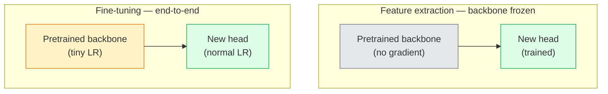

# التعلم النقلي والتنظيم الجيد

> لقد أمضى شخص آخر مليون جهاز كمبيوتر عمومي، لتعرف الشبكة العصبية الحافة والتركيبات والجزء من الأشياء هي مثل ماذا. قبل تدريب نموذجك الخاص، يجب عليك استعارة هذه الميزات.

**Type:** Build
**Languages:** Python
**Prerequisites:** Phase 4 Lesson 03 (CNNs), Phase 4 Lesson 04 (Image Classification)
**Time:** ~75 minutes

## 學习目标
- 区分 ميزة استخراج و ضبط دقيقة،并 حسب حجم مجموعة البيانات 域 المسافة 和 الحساب الميزانية 选择合适方法
- حمل العمود الفقري المدرب مسبقًا ، واستبدال رأس التصنيف ، و في 20 行 فقط رأس تدريب  الحصول على خط أساسي متاح
- استخدام معدلات التعلم التمييزية  تدريجياً تفكيك الطبقات، جعل الخصائص العامة المبكرة من الخصائص المحددة للمهمة في الفترة الأخيرة
- 诊断三类常见失败: بلاكات غير جمدة 上 LR 过高导致特征漂移、小数据集 上 BN إحصائيات انهيار، فضلا عن النسيان الكارثي

## 问题
في ImageNet على تدريب ResNet-50 حوالي تحتاج إلى 2000 ساعة GPU. القليل من الفرق يمكن أن تحمل كل مهمة على الإنترنت على هذا الميزانية. تقريبا جميع الفرق حقا على الإنترنت، هي العمود الفقري المدربة مسبقاً بالإضافة إلى رأس جديد، بينما هذا الرأس هو في مئات أو آلاف الصور المحددة للمهمة على تدريب.

هذا ليس طريقًا سريعًا. أي من CNN الذي تم تدريبه على ImageNet ، أول كتلة من conv لها تتعلم حواف ومشابهة لـ Gabor.

هناك ثلاثة أخطاء في انتظارك: استخدام معدل التعلم المرتفع جداً لتدمير الميزات المسبقة؛ 结过多 مما يؤدي إلى نقص المعلومات النموذجية؛ جعل إحصاءات تشغيل BatchNorm 漂移 إلى مجموعة بيانات صغيرة فوق، بينما بقية الشبكة العصبية لم تتعلم أي شيء من هذه المجموعة.

## 概念
### خص خصائص التأثير مقابل التأثير

هناك نوعان من النماذج، يعتمد على كمية الميزات المسبقة التي تتمتع بها، وكذلك كمية البيانات التي لديك.



经验法则:

| Dataset size | Domain distance | Recipe |
|--------------|-----------------|--------|
| < 1k images | 接近 ImageNet | 冻结 backbone，只训练 head |
| 1k-10k | 接近 | 冻结前 2-3 个 stages，fine-tune 其余部分 |
| 10k-100k | 任意 | 使用 discriminative LR 进行 end-to-end fine-tune |
| 100k+ | 远 | Fine-tune 全部参数；如果 domain 足够远，考虑从零训练 |

接近 ImageNet大致 يعني أن هناك محتوى كهذا مثل الكائنات ‬الصور الطبيعية RGB‬‬التسجيلات التشريعية المعدنية الطبية‬الصور القمر الصناعية فوق الرأس‬والجهاز المجهري‬ تنتمي إلى مجالات بعيدة، والخصائص ‬ما زالت مفيدة، ولكنك تحتاج إلى السماح بمزيد من الطبقات‬ ‬التطبيق‬‬‬‬‬‬‬‬‬‬‬‬‬‬‬‬‬‬‬‬‬‬‬‬‬‬‬‬‬‬‬‬‬‬‬‬‬‬‬‬‬‬‬‬‬‬‬‬‬‬‬‬‬‬‬‬‬‬‬‬‬‬‬‬‬‬‬‬‬‬‬‬‬‬‬‬‬‬‬‬‬‬‬‬‬‬‬‬‬‬‬‬‬‬‬‬‬‬‬‬‬‬‬‬‬‬‬‬‬‬‬‬‬‬‬‬‬‬‬‬‬‬‬‬‬‬‬‬‬‬‬‬‬‬‬‬‬‬‬‬‬‬‬‬‬‬‬‬‬‬‬‬‬‬‬‬‬‬‬‬‬‬‬‬‬‬‬‬‬‬‬‬‬‬‬‬‬‬‬‬‬‬‬‬‬‬‬‬‬‬‬‬‬‬‬‬‬‬‬‬‬‬‬‬‬‬‬‬‬‬‬‬‬‬‬‬‬‬‬‬‬‬‬‬‬‬‬‬‬‬‬‬‬‬‬‬‬‬‬‬‬‬‬‬‬‬‬‬‬‬‬‬‬‬‬‬‬‬‬‬‬‬‬‬‬‬‬‬‬‬‬‬‬‬‬‬‬‬‬‬‬‬‬‬‬‬‬‬‬‬‬‬‬‬‬‬‬‬‬‬‬‬‬‬‬‬‬‬‬‬‬‬‬‬‬‬‬‬‬‬‬‬‬‬‬‬‬‬‬‬‬‬‬‬‬‬‬‬‬‬‬‬‬‬‬‬‬‬‬‬‬‬‬‬‬‬‬‬‬‬‬‬‬‬‬‬‬‬‬‬‬‬‬‬‬‬‬‬‬‬‬‬‬‬‬‬‬‬‬‬‬‬‬‬‬‬‬‬‬‬‬‬‬‬‬‬‬‬‬‬‬

### لماذا التجمد يعمل على الإطلاق

لم تكن ميزات ImageNet التي تعلمتها CNN تخص هذه الفئات الـ 1000. أنها تتناسب بشكل خاص مع الخصائص الإحصائية للصور الطبيعية: حواف الأفقية محددة الأفقات، النماذج، أنماط التناقض، الأشكال البدائية. هذه الخصائص الإحصائية مستقرة جدا في كل مجال مرئي يمكن أن يُقال عن الإنسان. لهذا السبب عندما يتم تقييم نموذج جديد في ImageNet، في CIFAR-10، يضاف رأس خطي واحد فقط (غير رقيقة) إلى 80٪ + دقة. تعلمت أن: في هذه المهمة، كيفية إعطاء تلك الميزات التي يجب أن تتعلم بالفعل.

### معدلات التعلم التمييزية

عندما تصبحين على دراية بالتحديد، يجب أن تكون الطبقات المبكرة بطيئة أكثر من الطبقات المتأخرة.

```
Typical recipe:

  stage 0 (stem + first group): lr = base_lr / 100    (mostly fixed)
  stage 1:                       lr = base_lr / 10
  stage 2:                       lr = base_lr / 3
  stage 3 (last backbone group): lr = base_lr
  head:                          lr = base_lr  (or slightly higher)
```

في PyTorch، هذا مجرد نقل إلى مجموعة المعلمات من Optimizer 列表── نموذج واحد، خمسة معدلات التعلم، صفر إضافية كود‬‬‬‬‬‬‬‬‬‬‬‬‬‬‬‬‬‬‬‬‬‬‬‬‬‬‬‬‬‬‬‬‬‬‬‬‬‬‬‬‬‬‬‬‬‬‬‬‬‬‬‬‬‬‬‬‬‬‬‬‬‬‬‬‬‬‬‬‬‬‬‬‬‬‬‬‬‬‬‬‬‬‬‬‬‬‬‬‬‬‬‬‬‬‬‬‬‬‬‬‬‬‬‬‬‬‬‬‬‬‬‬‬‬‬‬‬‬‬‬‬‬‬‬‬‬‬‬‬‬‬‬‬‬‬‬‬‬‬‬‬‬‬‬‬‬‬‬‬‬‬‬‬‬‬‬‬‬‬‬‬‬‬‬‬‬‬‬‬‬‬‬‬‬‬‬‬‬‬‬‬‬‬‬‬‬‬‬‬‬‬‬‬‬‬‬‬‬‬‬‬‬‬‬‬‬‬‬‬‬‬‬‬‬‬‬‬‬‬‬‬‬‬‬‬‬‬‬‬‬‬‬‬‬‬‬‬‬‬‬‬‬‬‬‬‬‬‬‬‬‬‬‬‬‬‬‬‬‬‬‬‬‬‬‬‬‬‬‬‬‬‬‬‬‬‬‬‬‬‬‬‬‬‬‬‬‬‬‬‬‬‬‬‬‬‬‬‬‬‬‬‬‬‬‬‬‬‬‬‬‬‬‬‬‬‬‬‬‬‬‬‬‬‬‬‬‬‬‬‬‬‬‬‬‬‬‬‬‬‬‬‬‬‬‬‬‬‬‬‬‬‬‬‬‬‬‬‬‬‬‬‬‬‬‬‬‬‬‬‬‬‬‬‬‬‬‬‬‬‬‬‬‬‬‬‬‬‬‬‬‬‬‬‬‬‬‬‬‬‬‬‬‬‬‬‬‬‬‬‬‬‬‬‬‬‬‬‬‬‬‬‬‬‬‬‬‬‬‬‬‬‬‬‬‬‬‬‬‬‬‬‬‬‬‬‬‬‬‬‬‬‬‬‬‬‬‬‬‬‬‬‬‬‬‬‬‬‬‬‬

### مشكلة "بيتش نورم"

طبقات BN حتفظ في ImageNet 上 حساب الحصول على `running_mean`和 `running_var`البفارات. إذا كانت مهمتك توزيع مختلف للبيكسل، مثل إضاءة مختلفة، وأجهزة الاستشعار مختلفة، فضاء مختلف الألوان، ثم هذه البفارات هي الخطأ.

1. **在 train mode 下 fine-tune BN。**让 BN 随其它部分一起更新运行统计数据──当任务数据集 中等大小(>= 5k 例子)
2. **在 eval mode 下冻结 BN。**حافظ على إحصاءات ImageNet، فقط تدريب الوزن... عندما يصل متوسط المعلومات المتدفق مع مجموعة البيانات الصغيرة إلى BN
3. **用 GroupNorm 替换 BN。**完全 تحويل المتوسط المتحرك 问题── تستخدم للكشف وقطع الفخذ ، لأن حجم اللحظة في كل GPU 很小──

هذا يجعلها دقيقة، ينخفض 5-15%

### تصميم الرأس

رأس المصفوف هو 1-3 طبقات خطية إضافة إلى خيار خفض. كل مشعل رأس العمود الفقري

```
backbone.fc = nn.Linear(backbone.fc.in_features, num_classes)          # ResNet
backbone.classifier[1] = nn.Linear(..., num_classes)                    # EfficientNet, MobileNet
backbone.heads.head = nn.Linear(..., num_classes)                       # torchvision ViT
```

بالنسبة لمجموعات بيانات صغيرة، طبقة خطية واحدة عادة ما تكون كافية. عندما يتم توزيع المهام و توزيع العمود الفقري للتدريب، فإن إضافة طبقة مخفية ((خطية -> ريلو -> خفض -> خطية) سوف تساعد في ذلك.

### التهالك المتعدد للطبقات

هذا هو النسخة المُسطحة أكثر من LR المُميزة التي يستخدمها المُحافظون الجيدون الحديثون ((BEiT、DINOv2、ViT-B fine-tunes) ، وليس تقسيم الطبقات إلى مراحل، بل جعل كل طبقة من LR تمييزها فوق طبقة略小:

```
lr_layer_k = base_lr * decay^(L - k)
```

عندما التهالك = 0.75 且 L = 12 كتلة محول 时,第一个块的训练 LR 是头 LR 的 `0.75^11 ≈ 0.04x` هذا بالنسبة لمصطنعة المحولات أكثر أهمية من بالنسبة لسي إن إن ؛ بالنسبة لسي إن إن إن ، فإن المجموعات المرحلية من الـ LR عادة ما تكون كافية‬

### ما الذي يجب تقييمه

عمليات التعلم النقلية تحتاج إلى اثنين من الرقم الذي لا تتبع بينك:

- **Pretrained-only accuracy** العمود الفقري 结时时 رأس الدقة هذا هو طابقك 
- **Fine-tuned accuracy** تدريب نهاية إلى نهاية 后同一个模型的精度──这是你的天花板──

إذا كان المعدل الدقيق أقل من المعدل المسبق فقط، فإنك لديك معدل التعلم أو خطأ BN.


```figure
transfer-learning
```

## بناءها
### الخطوة الأولى: تحميل العمود الفقري المُدرب مسبقاً وتفتيشه

```python
import torch
import torch.nn as nn
from torchvision.models import resnet18, ResNet18_Weights

backbone = resnet18(weights=ResNet18_Weights.IMAGENET1K_V1)
print(backbone)
print()
print("classifier head:", backbone.fc)
print("feature dim:", backbone.fc.in_features)
```

`ResNet18`هناك أربع مراحل`layer1..layer4`), إضافة جذع و واحد `fc`كل رأس. كل قاعدة نخاع تصنيف مشعل لديها هيكل مشابه.

### 步骤 2: استخراج الميزة  تجميد كل شيء، استبدال الرأس

```python
def make_feature_extractor(num_classes=10):
    model = resnet18(weights=ResNet18_Weights.IMAGENET1K_V1)
    for p in model.parameters():
        p.requires_grad = False
    model.fc = nn.Linear(model.fc.in_features, num_classes)
    return model

model = make_feature_extractor(num_classes=10)
trainable = sum(p.numel() for p in model.parameters() if p.requires_grad)
frozen = sum(p.numel() for p in model.parameters() if not p.requires_grad)
print(f"trainable: {trainable:>10,}")
print(f"frozen:    {frozen:>10,}")
```

فقط`model.fc`هو قابل للتدريب.

### الخطوة الثالثة: التأقلم التمييزي

إستخدام، لإنشاء مجموعات المعلمات ذات معدلات تعلم محددة للمراحل.

```python
def discriminative_param_groups(model, base_lr=1e-3, decay=0.3):
    stages = [
        ["conv1", "bn1"],
        ["layer1"],
        ["layer2"],
        ["layer3"],
        ["layer4"],
        ["fc"],
    ]
    groups = []
    for i, names in enumerate(stages):
        lr = base_lr * (decay ** (len(stages) - 1 - i))
        params = [p for n, p in model.named_parameters()
                  if any(n.startswith(k) for k in names)]
        if params:
            groups.append({"params": params, "lr": lr, "name": "_".join(names)})
    return groups

model = resnet18(weights=ResNet18_Weights.IMAGENET1K_V1)
model.fc = nn.Linear(model.fc.in_features, 10)
for p in model.parameters():
    p.requires_grad = True

groups = discriminative_param_groups(model)
for g in groups:
    print(f"{g['name']:>10s}  lr={g['lr']:.2e}  params={sum(p.numel() for p in g['params']):>8,}")
```

`decay=0.3`يظهر معدل التدريب في كل مرحلة هو 30% من المرحلة التالية.`fc`-حصل على`base_lr`،`layer4`-حصل على`0.3 * base_lr`،`conv1`-حصل على`0.3^5 * base_lr ≈ 0.00243 * base_lr` يبدو ذلك جيداً، التجربة على ذلك فعلاً فعالة‬

### الخطوة 4: معالجة اللحوم

تستخدم BN تشغيل الإحصاءات و لا تكتشف وزنها كمساعدها

```python
def freeze_bn_stats(model):
    for m in model.modules():
        if isinstance(m, (nn.BatchNorm1d, nn.BatchNorm2d, nn.BatchNorm3d)):
            m.eval()
            for p in m.parameters():
                p.requires_grad = False
    return model
```

في كل عصر  بدأ `model.train()`بعد ذلك، استخدمها`model.train()`سوف تقطع كل المحتوى إلى وضع التدريب؛ هذه الوظيفة سوف تقطع فقط على طبقات BN عكس التقاط مرة أخرى.

### 步骤 5: حلقة تحسينية من نهاية إلى نهاية

```python
from torch.optim import SGD
from torch.utils.data import DataLoader
from torch.optim.lr_scheduler import CosineAnnealingLR
import torch.nn.functional as F

def fine_tune(model, train_loader, val_loader, device, epochs=5, base_lr=1e-3, freeze_bn=False):
    model = model.to(device)
    groups = discriminative_param_groups(model, base_lr=base_lr)
    optimizer = SGD(groups, momentum=0.9, weight_decay=1e-4, nesterov=True)
    scheduler = CosineAnnealingLR(optimizer, T_max=epochs)

    for epoch in range(epochs):
        model.train()
        if freeze_bn:
            freeze_bn_stats(model)
        tr_loss, tr_correct, tr_total = 0.0, 0, 0
        for x, y in train_loader:
            x, y = x.to(device), y.to(device)
            logits = model(x)
            loss = F.cross_entropy(logits, y, label_smoothing=0.1)
            optimizer.zero_grad()
            loss.backward()
            optimizer.step()
            tr_loss += loss.item() * x.size(0)
            tr_total += x.size(0)
            tr_correct += (logits.argmax(-1) == y).sum().item()
        scheduler.step()

        model.eval()
        va_total, va_correct = 0, 0
        with torch.no_grad():
            for x, y in val_loader:
                x, y = x.to(device), y.to(device)
                pred = model(x).argmax(-1)
                va_total += x.size(0)
                va_correct += (pred == y).sum().item()
        print(f"epoch {epoch}  train {tr_loss/tr_total:.3f}/{tr_correct/tr_total:.3f}  "
              f"val {va_correct/va_total:.3f}")
    return model
```

استخدام وصفة أعلاه في CIFAR-10 التدريب خمس حقائق، يمكن أن تُضيف`ResNet18-IMAGENET1K_V1`من حوالي 70% دقة الصور الخطية الصور الصورية 提升 إلى حوالي 93% دقة دقيقة المنسقة  إذا تدرب فقط الرأس و تماما لا تتحرك العمود الفقري، دقة سيكون في حوالي 86%  دخول المستوى‬

### الخطوة 6: التجمد التدريجي

فان التخطيط من النهاية إلى الأمام لكل عصر يفتح دورا.

```python
def progressive_unfreeze_schedule(model):
    stages = ["layer4", "layer3", "layer2", "layer1"]
    yielded = set()

    def start():
        for p in model.parameters():
            p.requires_grad = False
        for p in model.fc.parameters():
            p.requires_grad = True

    def unfreeze(epoch):
        if epoch < len(stages):
            name = stages[epoch]
            yielded.add(name)
            for n, p in model.named_parameters():
                if n.startswith(name):
                    p.requires_grad = True
            return name
        return None

    return start, unfreeze
```

في العصر الأول قبل استخدام مرة واحدة`start()`في كل عصر  بدأ 调用`unfreeze(epoch)`كلما حدث تغيير في المعلمات يمكن تدريبها يجب إعادة بناء المحفز وإلا فإن المعلمات المتجمدة لا تزال تحتفظ باللحظات المحفوظة في الاحتفاظ بها، وسوف تعيقها

## استخدمها
بالنسبة لمعظم المهام الحقيقية`torchvision.models`إضافة إلى ذلك، الكود الكافي هو الجهاز الأكثر ثقافة، فقط عندما تواجه مشكلة غير قابلة للحل عندما تواجه إعاقة مكتبة.

```python
from torchvision.models import resnet50, ResNet50_Weights

model = resnet50(weights=ResNet50_Weights.IMAGENET1K_V2)
model.fc = nn.Linear(model.fc.in_features, num_classes)
optimizer = torch.optim.AdamW(model.parameters(), lr=1e-4, weight_decay=1e-4)
```

إثنان آخرين من الاختلالات في مستوى الإنتاج:

- `timm`يقدم حوالي 800 عظم رأس مرئية مسبقة،并带一致的API(`timm.create_model("resnet50", pretrained=True, num_classes=10)`)― بالنسبة لأي نوع من الموسيقى الخفيفة خارج حديقة الحيوانات، فهو اختيار قياسي
- بالنسبة للمتحولات`transformers.AutoModelForImageClassification.from_pretrained(name, num_labels=N)`سوف تعطيك ViT / BEiT / DeiT، وتحمل النطاقات النطاقية مع النماذج النصية

## 交付 it
本课会产出:

- `outputs/prompt-fine-tune-planner.md` إشارة سريعة، ستعتمد على حجم مجموعة البيانات ‬مسافة النطاق و ميزانية الحساب ‬اختيار استخراج الميزات‬تحسينات تدريجية أو تحسينات نهاية إلى نهاية‬‬‬‬‬‬‬‬‬‬‬‬‬‬‬‬‬‬‬‬‬‬‬‬‬‬‬‬‬‬‬‬‬‬‬‬‬‬‬‬‬‬‬‬‬‬‬‬‬‬‬‬‬‬‬‬‬‬‬‬‬‬‬‬‬‬‬‬‬‬‬‬‬‬‬‬‬‬‬‬‬‬‬‬‬‬‬‬‬‬‬‬‬‬‬‬‬‬‬‬‬‬‬‬‬‬‬‬‬‬‬‬‬‬‬‬‬‬‬‬‬‬‬‬‬‬‬‬‬‬‬‬‬‬‬‬‬‬‬‬‬‬‬‬‬‬‬‬‬‬‬‬‬‬‬‬‬‬‬‬‬‬‬‬‬‬‬‬‬‬‬‬‬‬‬‬‬‬‬‬‬‬‬‬‬‬‬‬‬‬‬‬‬‬‬‬‬‬‬‬‬‬‬‬‬‬‬‬‬‬‬‬‬‬‬‬‬‬‬‬‬‬‬‬‬‬‬‬‬‬‬‬‬‬‬‬‬‬‬‬‬‬‬‬‬‬‬‬‬‬‬‬‬‬‬‬‬‬‬‬‬‬‬‬‬‬‬‬‬‬‬‬‬‬‬‬‬‬‬‬‬‬‬‬‬‬‬‬‬‬‬‬‬‬‬‬‬‬‬‬‬‬‬‬‬‬‬‬‬‬‬‬‬‬‬‬‬‬‬‬‬‬‬‬‬‬‬‬‬‬‬‬‬‬‬‬‬‬‬‬‬‬‬‬‬‬‬‬‬‬‬‬‬‬‬‬‬‬‬‬‬‬‬‬‬‬‬‬‬‬‬‬‬‬‬‬‬‬‬‬‬‬‬‬‬‬‬‬‬‬‬‬‬‬‬‬‬‬‬‬‬‬‬‬‬‬‬‬‬‬‬‬‬‬‬‬‬‬‬‬‬‬‬‬‬‬‬‬‬‬‬‬‬‬‬‬‬‬‬‬‬‬‬‬‬‬‬‬‬‬‬‬‬‬‬‬
- `outputs/skill-freeze-inspector.md` مهارة، وفق نموذج PyTorch 后، سوف تقرير ما هي المعايير التي يمكن تدريبها، ما هي طبقات BatchNorm 处于评估模式، فضلا عن تحسينات هل حققت بالفعل المعايير التي يمكن تدريبها 

## التدريب
1. **(Easy)**في نفس مجموعة بيانات CIFAR الاصطناعية`ResNet18`分别作为线性探测 ((脊椎结) 和完整细调 进行训练──并排报告两者精度──解释哪个缺口 说明特征转移 效果好,哪个缺口 说明效果不好──
2. **(Medium)**لديّ فكرة عن إدخال حشرة:`base_lr = 1e-1`، بدلا من الرأس فوق.`discriminative_param_groups`ساعد  استعادة ‬ ‬ ‬ ‬ ‬ ‬ ‬ ‬ ‬ ‬ ‬ ‬ ‬ ‬ ‬ ‬ ‬ ‬
3. **(Hard)**选取一个医学图像数据集(例如 CheXpert-small、PatchCamelyon 或 HAM10000),比较三种制度:((a) ImageNet-pretrained frozen backbone + linear head;(b) ImageNet-pretrained end-to-end fine-tune;(c) تدريب الخدش.

## 关键术语
| Term | What people say | What it actually means |
|------|----------------|----------------------|
| Feature extraction | “Freeze and train head” | Backbone parameters 冻结，只有新的 classifier head 接收 Gradient |
| Fine-tuning | “Retrain end-to-end” | 所有 parameters 都 trainable，通常使用比 scratch training 小得多的 LR |
| Discriminative LR | “Smaller LR for early layers” | Optimizer parameter groups，其中 early-stage LR 是 late-stage LR 的一部分 |
| Layer-wise LR decay | “Smooth LR gradient” | 每层 LR 乘以 decay^(L - k)；常见于 transformer fine-tunes |
| Catastrophic forgetting | “The model lost ImageNet” | 过高 LR 在新任务信号被学到之前覆盖了 pretrained features |
| BN statistics drift | “Running mean is wrong” | BatchNorm running_mean/var 是在不同于当前任务的 distribution 上计算的，会悄悄损害 accuracy |
| Linear probe | “Frozen backbone + linear head” | 对 pretrained features 的评估，即 frozen representation 之上最佳 linear classifier 的 accuracy |
| Catastrophic collapse | “Everything predicts one class” | 当 fine-tuning 的 LR 高到在 head 的 Gradient 能稳定之前就破坏 features 时发生 |

## 延伸阅读
- [How transferable are features in deep neural networks? (Yosinski et al., 2014)](https://arxiv.org/abs/1411.1792) هذا المقال يقيّم الميزات بين الطبقات المختلفة
- [Universal Language Model Fine-tuning (ULMFiT, Howard & Ruder, 2018)](https://arxiv.org/abs/1801.06146) الوصفة التمييزية الاولى لـ LR / التقدم في التجمد هذه الأفكار يمكن أن تنتقل مباشرة إلى الرؤية
- [timm documentation](https://huggingface.co/docs/timm) 现代 رؤية العظام الفقرية 以 و تدريبها 时精确精调默认的参考
- [A Simple Framework for Linear-Probe Evaluation (Kornblith et al., 2019)](https://arxiv.org/abs/1805.08974)لماذا دقة الصور الخطية مهمة، وكيفية تقديمها بشكل صحيح
