# 目标检测  من صفر تحقيق YOLO

> الكشف هو التصنيف + التراجعة ، في كل موقع من خريطة الميزات ، ثم باستخدام القمع غير القصوى 清理结果。

**类型：**الإنشاء
**语言：**بايثون
**前置要求：**المرحلة 4 الدروس 03 (CNNs) ، المرحلة 4 الدروس 04 (تصنيف الصور) ، المرحلة 4 الدروس 05 (تعلم النقل)
**时间：**حوالي 75 دقيقة

## 學习目标

-  شرح الشبكة والمركز  تصميم كيفية تحديد  تحويل إلى توقعات كثيفة  مشكلة,并说明输出テンসর 中每个数字的含义
- 计算 box   بين التقاطع فوق الاتحاد،并从零 تحقيق القمع غير القصوى
- في العمود الفقري المسبق للتدريب بناء رأس من نوع YOLO 风格، بما في ذلك التصنيف ‧ الموضوعية و خسائر التراجعة الصندوق
- 读懂一行 تحديد المقاييس(دقة@0.5, تذكر, mAP@0.5, mAP@0.5:0.95),并判断下一步应该调整哪个按

## 问题

التصنيف 会说 This张图是一个狗──Detection 会说在像素 (112, 40, 280, 210) 处有一个狗,在 (400, 180, 560, 310) 处有一个猫,画面中没有其他东西──这个结构性变化预测数量可变的带标签盒,而不是每张图一个标签是每个自动驾驶系统,每个监控产品,每个文档布局解析器和每个工厂视觉产线的依赖能力──

الكشف هو أيضا المكان الذي يظهر فيه جميع المقاطع في المشاهد. أي جزء من القناة يخرج خطأ، أو أنبوب في غياب المشهد. أو في موقع مختلف

يولو ((أنت فقط تنظر مرة واحدة، ريدمون وزملاء 2016) هو تصميم، فإنه يمر عبر شبكة conv من مرور واحد إلى الأمام 让所有这些实时运行起来; 同样结构决策至今仍然是现代探测器 ((YOLOv8، YOLOv9، YOLO-NAS، RT-DETR)

## 概念

### الكشف  كتنبؤ كثيف

التصنيف 每张图输出 C 个数字──YOLO 风格探测器 每张图输出 `(S x S x (5 + C))`个数字,其中 S هو حجم الشبكة الفضائية.

```mermaid
flowchart LR
    IMG["Input 416x416 RGB"] --> BB["Backbone<br/>(ResNet, DarkNet, ...)"]
    BB --> FM["Feature map<br/>(C_feat, 13, 13)"]
    FM --> HEAD["Detection head<br/>(1x1 convs)"]
    HEAD --> OUT["Output tensor<br/>(13, 13, B * (5 + C))"]
    OUT --> DEC["Decode<br/>(grid + sigmoid + exp)"]
    DEC --> NMS["Non-max suppression"]
    NMS --> RESULT["Final boxes"]

    style IMG fill:#dbeafe,stroke:#2563eb
    style HEAD fill:#fef3c7,stroke:#d97706
    style NMS fill:#fecaca,stroke:#dc2626
    style RESULT fill:#dcfce7,stroke:#16a34a
```



كل واحد`S * S`خلية الشبكة 会预测 `B`علبة:

- 4 个数字描述几何信息:`tx, ty, tw, th`.
- 1 个数字是对象性分数: هل يوجد شيء في مركز هذه الخلية؟
- C 个数字是类概率──

عدد كل خلية:`B * (5 + C)` بالنسبة لـ VOC، إذا`S=13, B=2, C=20`،هناك 50 رقم في كل خلية

### لماذا تحتاج إلى شبكات ومرافق

عودة عادية لجميع الأشياء`(x, y, w, h)` هذا من الصعب أن نصل إلى شبكة conv، لأن الصورة المسبقة لا ينبغي أن تجعل كل التنبؤات تتحرك بنفس الكمية  كل شيء في الفضاء يتم تحديد  شبكة  من خلال تقسيم كل مربع الحقيقة الأرضية إلى خلية الشبكة التي تقع في وسطها لحل هذه المشكلة ؛ فقط تلك الخلية  المسؤولة عن هذا الموضوع 

المرسومات  حل مشكلة ثانية──3x3 conv  صعوبة جدا من خلية ميزة من 16 بكسلات حقل استقبلية داخل التراجع خارج مربع 500 بكسل واسع── لذلك، نحن في كل خلية  مقدما تعريف `B`个先验盒形( ancors),并从每个 ancor 预测小的deltas──模型学习选择正确的 ancor 并微调它,而不是从零 Regression──

```
Anchor box priors (example for 416x416 input):

  small:   (30,  60)
  medium:  (75,  170)
  large:   (200, 380)

At each grid cell, every anchor emits (tx, ty, tw, th, obj, c_1, ..., c_C).
```

عادة ما يستخدم الكشف الحديث FPN، في مختلف القرارات 上 استخدام مجموعات مختلفة من المرسومات 浅层高分辨率地图 上放小型 المرصومات،深层低分辨率地图 上放大型 المرصومات──同样的思想,更多尺度──

### 解码 التنبؤات

أصلي`tx, ty, tw, th`ليست إحداثيات مربع؛ إنها تحتاج إلى تحويل في رسم قبل التركيب أهداف التراجعة:

```
centre x  = (sigmoid(tx) + cell_x) * stride
centre y  = (sigmoid(ty) + cell_y) * stride
width     = anchor_w * exp(tw)
height    = anchor_h * exp(th)
```

`sigmoid`ضع الحد من تحرك المركز داخل الخلية`exp`让宽可以从 ancora自由缩缩而不会发生符号翻转.`stride`ضع إحداثيات الشبكة  انقلب إلى البيكسلات ‬ هذا التشريح ‬ الخطوات منذ v2 ‬ منذ أن جاء في كل إصدار من YOLO ‬ ‫كل شيء هو نفسه‬‬

### (إي أو)

الكشف وسط قياس مربعين مقياس عام للشبهة:

```
IoU(A, B) = area(A intersect B) / area(A union B)
```

يُحدد يو = 1 يعبر عن نفس الشيء تماماً؛ يو = 0 يعبر عن عدم التكاثب. التنبؤ و مربع الحقيقة الأرضية يُقرر يو أن التنبؤ ما إذا كان محاسبة إيجابية حقيقية.

### القمع غير القصوى

في المرافق المجاورة، عادة ما تكون شبكة المشاركات التي يتم تدريبها على نفس الكائن  توقعات مربع تعليقها.

```
NMS(boxes, scores, iou_threshold):
    sort boxes by score descending
    keep = []
    while boxes not empty:
        pick the top-scoring box, add to keep
        remove every box with IoU > iou_threshold to the picked box
    return keep
```

典型值:اكتشاف الأشياء 中为 0.45──近期探测器 会用 `soft-NMS`.`DIoU-NMS`替代标准NMS، أو مباشرة تعلم القمع (RT-DETR) ، ولكن الهدف الهيكلي هو نفسه.

### الخسارة

خسارة يوولو هي ثلاثة خسائر ذات الوزن

```
L = lambda_coord * L_box(pred, target, where obj=1)
  + lambda_obj   * L_obj(pred, 1,     where obj=1)
  + lambda_noobj * L_obj(pred, 0,     where obj=0)
  + lambda_cls   * L_cls(pred, target, where obj=1)
```

只有 خلايا التي تحتوي على جسم 才会贡献 مربع-رجوع و خسائر التصنيف──不含物体的细胞 只贡献对象性损失(教模型保持沉默)──`lambda_noobj`عادةً يكون أقل من 0.5، لأن معظم الخلايا كانت فارغة، وإلا ستؤدي إلى الخسارة الإجمالية.

现代变体会把 MSE box loss 换成 CIoU / DIoU(直接优化 IoU), باستخدام فقدان التركيز 处理类失衡,并用质量焦失平衡对象性──三组件结构保持不变──

### مقاييس الكشف

الدقة غير قادرة على الانتقال مباشرة إلى الكشف.

- **Precision@IoU=0.5** في التنبؤات التي تم اعتبارها إيجابية، هناك الكثير من الصواب الحقيقي.
- **Recall@IoU=0.5**في الأشياء الحقيقية، وجدنا الكثير
- **AP@0.5** عتبة IoU 0.5 下 منحنى استدعاء الدقة 面积; لكل فئة 一个数──
- **mAP@0.5:0.95** فى حدود الـ 0.5, 0.55, ..., 0.95 上对 AP 求平均──COCO متريكا;最严格,也最有信息量──

أربعة تقارير يجب أن تقرر. إذا كان جهاز كشف في mAP@0.5 上很强, ولكن في mAP@0.5:0.95 上很弱,说明定位大致正确但不够紧; باستخدام أفضل خسارة إعادة التراجعة الصندوقية 修复.


```figure
object-detection-nms
```

## بناءها

### الخطوة الأولى:

الوسائل الأساسية للصف كله.`(x1, y1, x2, y2)`أشكال المجموعات الصندوقية

```python
import numpy as np

def box_iou(boxes_a, boxes_b):
    ax1, ay1, ax2, ay2 = boxes_a[:, 0], boxes_a[:, 1], boxes_a[:, 2], boxes_a[:, 3]
    bx1, by1, bx2, by2 = boxes_b[:, 0], boxes_b[:, 1], boxes_b[:, 2], boxes_b[:, 3]

    inter_x1 = np.maximum(ax1[:, None], bx1[None, :])
    inter_y1 = np.maximum(ay1[:, None], by1[None, :])
    inter_x2 = np.minimum(ax2[:, None], bx2[None, :])
    inter_y2 = np.minimum(ay2[:, None], by2[None, :])

    inter_w = np.clip(inter_x2 - inter_x1, 0, None)
    inter_h = np.clip(inter_y2 - inter_y1, 0, None)
    inter = inter_w * inter_h

    area_a = (ax2 - ax1) * (ay2 - ay1)
    area_b = (bx2 - bx1) * (by2 - by1)
    union = area_a[:, None] + area_b[None, :] - inter
    return inter / np.clip(union, 1e-8, None)
```

عُدْ إلى واحد`(N_a, N_b)`المصفوفات المقطوعة مع مربع واحد من الحقيقة الأرضية`(1, 4)`.

### 步骤 2: القمع غير أقصى

```python
def nms(boxes, scores, iou_threshold=0.45):
    order = np.argsort(-scores)
    keep = []
    while len(order) > 0:
        i = order[0]
        keep.append(i)
        if len(order) == 1:
            break
        rest = order[1:]
        ious = box_iou(boxes[[i]], boxes[rest])[0]
        order = rest[ious <= iou_threshold]
    return np.array(keep, dtype=np.int64)
```

确定性实现, ترتيب`O(N log N)`التعقيد، وتتطابق على نفس الإدخال`torchvision.ops.nms`من تصرفاتها

### 步骤 3: تشفير وتشفير الصندوق

في نقاط البيكسل و الشبكة  الرجعة الحقيقية `(tx, ty, tw, th)`أهداف 之间转换──

```python
def encode(box_xyxy, cell_x, cell_y, stride, anchor_wh):
    x1, y1, x2, y2 = box_xyxy
    cx = 0.5 * (x1 + x2)
    cy = 0.5 * (y1 + y2)
    w = x2 - x1
    h = y2 - y1
    tx = cx / stride - cell_x
    ty = cy / stride - cell_y
    tw = np.log(w / anchor_wh[0] + 1e-8)
    th = np.log(h / anchor_wh[1] + 1e-8)
    return np.array([tx, ty, tw, th])


def decode(tx_ty_tw_th, cell_x, cell_y, stride, anchor_wh):
    tx, ty, tw, th = tx_ty_tw_th
    cx = (sigmoid(tx) + cell_x) * stride
    cy = (sigmoid(ty) + cell_y) * stride
    w = anchor_wh[0] * np.exp(tw)
    h = anchor_wh[1] * np.exp(th)
    return np.array([cx - w / 2, cy - h / 2, cx + w / 2, cy + h / 2])


def sigmoid(x):
    return 1.0 / (1.0 + np.exp(-x))
```

测试:encode a box Re-decode يجب أن تتمكن من الحصول على مقربة جدا من النتيجة الأصلية`tx`في النطاق بعد السجماوي، فإن العكس السجماوي ليس قابلاً للعكس تماماً، لذلك سيكون هناك اختلافات طفيفة)

### الخطوة 4: واحد أصغر رأس يولو

خريطة الميزات فوق واحد 1x1 مخزن، إعادة تشكيل`(B, S, S, num_anchors, 5 + C)`.

```python
import torch
import torch.nn as nn

class YOLOHead(nn.Module):
    def __init__(self, in_c, num_anchors, num_classes):
        super().__init__()
        self.num_anchors = num_anchors
        self.num_classes = num_classes
        self.conv = nn.Conv2d(in_c, num_anchors * (5 + num_classes), kernel_size=1)

    def forward(self, x):
        n, _, h, w = x.shape
        y = self.conv(x)
        y = y.view(n, self.num_anchors, 5 + self.num_classes, h, w)
        y = y.permute(0, 3, 4, 1, 2).contiguous()
        return y
```

输出 شكل:`(N, H, W, num_anchors, 5 + C)`❖ آخر 维度保存 `[tx, ty, tw, th, obj, cls_0, ..., cls_{C-1}]`.

### الخطوة 5: تحديد الحقيقة الأساسية

لكل صندوق من الحقيقة، قرر من`(cell, anchor)`مسؤولة عن ذلك

```python
def assign_targets(boxes_xyxy, classes, anchors, stride, grid_size, num_classes):
    num_anchors = len(anchors)
    target = np.zeros((grid_size, grid_size, num_anchors, 5 + num_classes), dtype=np.float32)
    has_obj = np.zeros((grid_size, grid_size, num_anchors), dtype=bool)

    for box, cls in zip(boxes_xyxy, classes):
        x1, y1, x2, y2 = box
        cx, cy = 0.5 * (x1 + x2), 0.5 * (y1 + y2)
        gx, gy = int(cx / stride), int(cy / stride)
        bw, bh = x2 - x1, y2 - y1

        ious = np.array([
            (min(bw, aw) * min(bh, ah)) / (bw * bh + aw * ah - min(bw, aw) * min(bh, ah))
            for aw, ah in anchors
        ])
        best = int(np.argmax(ious))
        aw, ah = anchors[best]

        target[gy, gx, best, 0] = cx / stride - gx
        target[gy, gx, best, 1] = cy / stride - gy
        target[gy, gx, best, 2] = np.log(bw / aw + 1e-8)
        target[gy, gx, best, 3] = np.log(bh / ah + 1e-8)
        target[gy, gx, best, 4] = 1.0
        target[gy, gx, best, 5 + cls] = 1.0
        has_obj[gy, gx, best] = True
    return target, has_obj
```

اختيار المرسوم هو مع الحقيقة الأرضية 具有最佳形状 IoU هو وكيل رخيص، مطابقة لتعيين YOLOv2/v3──v5 及后续版本使用更复杂的策略((التوافق المرتبط بالمهمة، الديناميكية k) 來细化同一思路──

### الخطوة 6: ثلاثة خسائر

```python
def yolo_loss(pred, target, has_obj, lambda_coord=5.0, lambda_obj=1.0, lambda_noobj=0.5, lambda_cls=1.0):
    has_obj_t = torch.from_numpy(has_obj).bool()
    target_t = torch.from_numpy(target).float()

    # box-regression loss: only on cells with objects
    box_pred = pred[..., :4][has_obj_t]
    box_true = target_t[..., :4][has_obj_t]
    loss_box = torch.nn.functional.mse_loss(box_pred, box_true, reduction="sum")

    # objectness loss
    obj_pred = pred[..., 4]
    obj_true = target_t[..., 4]
    loss_obj_pos = torch.nn.functional.binary_cross_entropy_with_logits(
        obj_pred[has_obj_t], obj_true[has_obj_t], reduction="sum")
    loss_obj_neg = torch.nn.functional.binary_cross_entropy_with_logits(
        obj_pred[~has_obj_t], obj_true[~has_obj_t], reduction="sum")

    # classification loss on cells with objects
    cls_pred = pred[..., 5:][has_obj_t]
    cls_true = target_t[..., 5:][has_obj_t]
    loss_cls = torch.nn.functional.binary_cross_entropy_with_logits(
        cls_pred, cls_true, reduction="sum")

    total = (lambda_coord * loss_box
             + lambda_obj * loss_obj_pos
             + lambda_noobj * loss_obj_neg
             + lambda_cls * loss_cls)
    return total, {"box": loss_box.item(), "obj_pos": loss_obj_pos.item(),
                   "obj_neg": loss_obj_neg.item(), "cls": loss_cls.item()}
```

خمسة مُعايير فائقة، كل دراسة يولو، يجب أن تكون شفرة صلبة، يجب أن تكون صفحة.`lambda_coord=5, lambda_noobj=0.5`على الورق الأصلي YOLOv1، و حتى الآن لا يزال معقولة القيمة المتبعة.

### الخطوة 7: خط الأنابيب الإستدلال

فك أصل الصادرات الأصلية، تطبيق sigmoid/exp، وفقا لحد العضوية 过، ثم تنفيذ NMS。

```python
def postprocess(pred_tensor, anchors, stride, img_size, conf_threshold=0.25, iou_threshold=0.45):
    pred = pred_tensor.detach().cpu().numpy()
    grid_h, grid_w = pred.shape[1], pred.shape[2]
    num_anchors = len(anchors)

    boxes, scores, classes = [], [], []
    for gy in range(grid_h):
        for gx in range(grid_w):
            for a in range(num_anchors):
                tx, ty, tw, th, obj, *cls = pred[0, gy, gx, a]
                score = sigmoid(obj) * sigmoid(np.array(cls)).max()
                if score < conf_threshold:
                    continue
                cls_idx = int(np.argmax(cls))
                cx = (sigmoid(tx) + gx) * stride
                cy = (sigmoid(ty) + gy) * stride
                w = anchors[a][0] * np.exp(tw)
                h = anchors[a][1] * np.exp(th)
                boxes.append([cx - w / 2, cy - h / 2, cx + w / 2, cy + h / 2])
                scores.append(float(score))
                classes.append(cls_idx)

    if not boxes:
        return np.zeros((0, 4)), np.zeros((0,)), np.zeros((0,), dtype=int)
    boxes = np.array(boxes)
    scores = np.array(scores)
    classes = np.array(classes)
    keep = nms(boxes, scores, iou_threshold)
    return boxes[keep], scores[keep], classes[keep]
```

هذا هو كاملة الاختبار 路径: رأس -> فك -> عتبة -> NMS。

## استخدمها

`torchvision.models.detection`تم توفير كشافات درجة الإنتاج ذات نفس النظرية.

```python
import torch
from torchvision.models.detection import fasterrcnn_resnet50_fpn_v2

model = fasterrcnn_resnet50_fpn_v2(weights="DEFAULT")
model.eval()
with torch.no_grad():
    predictions = model([torch.randn(3, 400, 600)])
print(predictions[0].keys())
print(f"boxes:  {predictions[0]['boxes'].shape}")
print(f"scores: {predictions[0]['scores'].shape}")
print(f"labels: {predictions[0]['labels'].shape}")
```

لخطوط استنتاج في الوقت الحقيقي`ultralytics`(YOLOv8/v9) هو معيار اختيار:`from ultralytics import YOLO; model = YOLO('yolov8n.pt'); model(img)` النموذج سوف يعالج داخلياً فك التشفير و NMS ، ويعود إلى نفس ما تم بناؤه فوق `boxes / scores / labels`ثلاثة أفراد

## 交付 it

本课会产出:

- `outputs/prompt-detection-metric-reader.md` إرسال، إرسال `precision, recall, AP, mAP@0.5:0.95`转换为一句诊断和最有用的下一个实验──
- `outputs/skill-anchor-designer.md`مهارة، أعطيت مربعات حقيقة أساسية بعد`(w, h)`上运行 k-means,并返回 كل مستوى FPN من مجموعات المرسومات فضلا عن اختيار المرسومات الصحيحة عدد احصائيات التغطية المطلوبة

## التدريب

1. **（简单）** تحقيق `box_iou`و 1000 مجموعة أزواج الصناديق`torchvision.ops.box_iou`مقابل ∙ التحقق أكبر اختلاف مطلق ∙`1e-6`.
2. **（中等）**ستعمل`yolo_loss`移植为使用 `CIoU`في مجموعة بيانات صناعية 100 صورة 上展示: في نفس الفترة 数下,CIoU مقارنة مع MSE 收到更好最终 mAP@0.5:0.95。
3. **（困难）**实现多尺度 الاستنتاج: باستخدام ثلاث قرارات سوف تقوم بنفس الصورة النتيجة النموذج، ومجموعة التنبؤات، ثم تقوم بالعمل مرة واحدة في NMS.

## 关键术语

| Term | 人们怎么说 | 它实际是什么意思 |
|------|----------------|----------------------|
| Anchor | “Box prior” | 每个 grid cell 上的预定义 box shape，network 从中预测 deltas，而不是预测绝对坐标 |
| IoU | “Overlap” | 两个 box 的 Intersection-over-union；detection 中通用的相似度度量 |
| NMS | “Deduplicate” | 贪心算法，保留最高分 predictions，并移除高于阈值的重叠 predictions |
| Objectness | “Is there something here” | 每个 anchor、每个 cell 的 scalar，用于预测是否有 object 的中心落在该 cell 中 |
| Grid stride | “Downsample factor” | 每个 grid cell 对应的 pixels 数；416-px input 配 13-grid head 时 stride 为 32 |
| mAP | “Mean average precision” | precision-recall curve 下方面积的平均值，对 classes 求平均，并且（对 COCO）也对 IoU thresholds 求平均 |
| AP@0.5 | “PASCAL VOC AP” | IoU threshold 0.5 下的 average precision；该 metric 的宽松版本 |
| mAP@0.5:0.95 | “COCO AP” | 在 IoU thresholds 0.5..0.95、步长 0.05 上求平均；严格版本，也是当前社区标准 |

## 延伸阅读

- [YOLOv1: You Only Look Once (Redmon et al., 2016)](https://arxiv.org/abs/1506.02640)ورقة التركيب؛ كل يوولو بعد ذلك كان تحسين على هذا الهيكل
- [YOLOv3 (Redmon & Farhadi, 2018)](https://arxiv.org/abs/1804.02767) إدخال ورقة الرؤوس متعددة النطاقات في طراز FPN؛ حتى الآن لا يزال هناك رسم بياني واضح
- [Ultralytics YOLOv8 docs](https://docs.ultralytics.com) 当前生产参考; يشمل أشكال مجموعة البيانات
- [The Illustrated Guide to Object Detection (Jonathan Hui)](https://jonathan-hui.medium.com/object-detection-series-24d03a12f904) أفضل حديقة حيوانات الكشف الكاملة 导览; لفهم العلاقة بين DETR、RetinaNet、FCOS وYOLO
