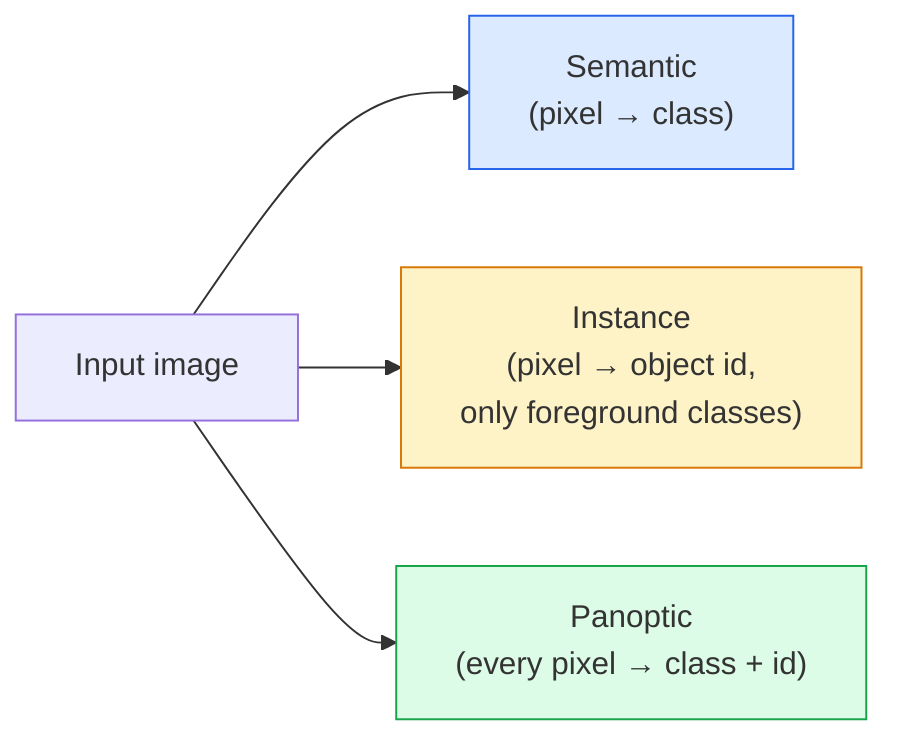
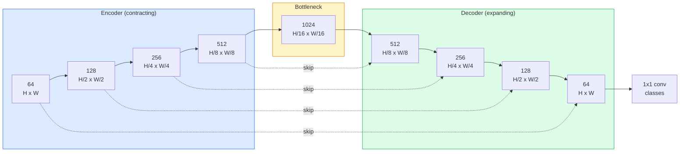

# التقسيم الترجموي  U-Net

> التقسيم هو على كل بيكسل  إجراء التصنيف. U-Net                                                                                                                                                                                                                                                                                                                                                                                                                                                                                                           

**Type:** Build
**Languages:** Python
**Prerequisites:** Phase 4 Lesson 03 (CNNs), Phase 4 Lesson 04 (Image Classification)
**Time:** ~75 minutes

## 學习目标
- 区分语义、实例 和泛光细分,并为给定问题选择正确任务
- في PyTorch من الصفر تشكيل U-Net، يحتوي على كتلة إكودر、قوق الزجاجة、 مع تحويلات نقل، فضلا عن الانقطاع الاتصالات
- 实现 pixel-wise cross-entropy、Dice loss، وكذلك الاختراق المشترك المتبقي للقطاعات الطبية والصناعية الحالية
- 按类 解读 IoU 和 Dice قياسات،并诊断低分是来自小物体回忆、限度精度,还是类失衡

## 问题
التصنيف لكل صورة 输出标签── تحديد لكل صورة 输出少量框── 分类 لكل بيكسل 输出标签──对于大小为`H x W`دخول، إنتاج هو شكل`H x W`(مؤثرة) أو `H x W x N_instances`هذا يعني أن لكل صورة هناك ملايين التنبؤات وليس واحدة

تشرح هيكل التقسيم لماذا يضمن تقريبا كل رؤية التنبؤات الكثيفة  منتجات: التصوير الطبي (قناع الورم)  القيادة الذاتية  الطرق  الممرات  العقبات  القمر الصناعي  البناء  الحدود المزروعة  تحليل الوثائق  المناطق المخطوطة  الروبوتات  المناطق القابلة للاستيعاب  هذه المهام لا يمكن أن تمر عبر الجهاز  رسم مربع لتحللها؛ فإنها تحتاج إلى صورة دقيقة‬‬‬‬‬‬‬‬‬‬‬‬‬‬‬‬‬‬‬‬‬‬‬‬‬‬‬‬‬‬‬‬‬‬‬‬‬‬‬‬‬‬‬‬‬‬‬‬‬‬‬‬‬‬‬‬‬‬‬‬‬‬‬‬‬‬‬‬‬‬‬‬‬‬‬‬‬‬‬‬‬‬‬‬‬‬‬‬‬‬‬‬‬‬‬‬‬‬‬‬‬‬‬‬‬‬‬‬‬‬‬‬‬‬‬‬‬‬‬‬‬‬‬‬‬‬‬‬‬‬‬‬‬‬‬‬‬‬‬‬‬‬‬‬‬‬‬‬‬‬‬‬‬‬‬‬‬‬‬‬‬‬‬‬‬‬‬‬‬‬‬‬‬‬‬‬‬‬‬‬‬‬‬‬‬‬‬‬‬‬‬‬‬‬‬‬‬‬‬‬‬‬‬‬‬‬‬‬‬‬‬‬‬‬‬‬‬‬‬‬‬‬‬‬‬‬‬‬‬‬‬‬‬‬‬‬‬‬‬‬‬‬‬‬‬‬‬‬‬‬‬‬‬‬‬‬‬‬‬‬‬‬‬‬‬‬‬‬‬‬‬‬‬‬‬‬‬‬‬‬‬‬‬‬‬‬‬‬‬‬‬‬‬‬‬‬‬‬‬‬‬‬‬‬‬‬‬‬‬‬‬‬‬‬‬‬‬‬‬‬‬‬‬‬‬‬‬‬‬‬‬‬‬‬‬‬‬‬‬‬‬‬‬‬‬‬‬‬‬‬‬‬‬‬‬‬‬‬‬‬‬‬‬‬‬‬‬‬

مشكلة البناء بسيطة ، ولكن الحل ليس بسيطًا: تحتاج إلى شبكة مع مشاهدة السياق العالمي للصورة.

## 概念
### 语义 vs 实例 vs 全景



- **Semantic**أظهرت أن هذا البيكسل هو الطريق، وهذا البيكسل هو السيارة.
- **Instance**أظهرت هذه البيكسل هي السيارة رقم 3 تلك البيكسل هي السيارة رقم 5
- **Panoptic**سوف يتم جمع كل شخص معا: كل بكسل حصل على علامة فئة، كل حالة حصل على هوية فريدة، الأشياء والأشياء تم تقسيمها.

本课涵盖语义──下一课(Mask R-CNN) تغطي حالة──

### شكل شبكة U-Net



المُخترع سوف يقلل من القرارة الفضائية  نصف أربع مرات،并将 道 翻倍──decoder 反向执行:将空间分辨率 翻倍四次,并将 道 减半──Skip connections 会在每个分辨率上把匹配的编码功能与解码功能 进行连接──最终的1x1 conv 在全分辨率下将`64 -> num_classes`.

لماذا تخطي الاتصالات أمر ضروري: عندما يحاول المفكّر إصدار توقعات على مستوى البيكسل ، فإنه يرى فقط خرائط ميزات صغيرة جداً.

### نقل مقابل عينة فوق المخطين

يجب على المفكّر توسيع الأبعاد الفضائية.

- **Transposed convolution**(`nn.ConvTranspose2d`)  قابل للتعلم العينة.‬‬‬‬‬‬‬‬‬‬‬‬‬‬‬‬‬‬‬‬‬‬‬‬‬‬‬‬‬‬‬‬‬‬‬‬‬‬‬‬‬‬‬‬‬‬‬‬‬‬‬‬‬‬‬‬‬‬‬‬‬‬‬‬‬‬‬‬‬‬‬‬‬‬‬‬‬‬‬‬‬‬‬‬‬‬‬‬‬‬‬‬‬‬‬‬‬‬‬‬‬‬‬‬‬‬‬‬‬‬‬‬‬‬‬‬‬‬‬‬‬‬‬‬‬‬‬‬‬‬‬‬‬‬‬‬‬‬‬‬‬‬‬‬‬‬‬‬‬‬‬‬‬‬‬‬‬‬‬‬‬‬‬‬‬‬‬‬‬‬‬‬‬‬‬‬‬‬‬‬‬‬‬‬‬‬‬‬‬‬‬‬‬‬‬‬‬‬‬‬‬‬‬‬‬‬‬‬‬‬‬‬‬‬‬‬‬‬‬‬‬‬‬‬‬‬‬‬‬‬‬‬‬‬‬‬‬‬‬‬‬‬‬‬‬‬‬‬‬‬‬‬‬‬‬‬‬‬‬‬‬‬‬‬‬‬‬‬‬‬‬‬‬‬‬‬‬‬‬‬‬‬‬‬‬‬‬‬‬‬‬‬‬‬‬‬‬‬‬‬‬‬‬‬‬‬‬‬‬‬‬‬‬‬‬‬‬‬‬‬‬‬‬‬‬‬‬‬‬‬‬‬‬‬‬‬‬‬‬‬‬‬‬‬‬‬‬‬‬‬‬‬‬‬‬‬‬‬‬‬‬‬‬‬‬‬‬‬‬‬‬‬‬‬‬‬‬‬‬‬‬‬‬‬‬‬‬‬‬‬‬‬‬‬‬‬‬‬‬‬‬‬‬‬‬‬‬‬‬‬‬‬‬‬‬‬‬‬‬‬‬‬‬‬‬‬‬‬‬‬‬‬‬‬‬‬‬‬‬‬‬‬‬‬‬‬‬‬‬‬‬‬‬‬‬‬‬‬‬‬‬‬‬‬‬‬‬‬‬‬‬‬‬‬‬‬‬‬‬‬‬‬‬‬‬‬‬‬‬‬‬‬‬‬‬‬‬‬‬‬‬
- **Bilinear upsample + 3x3 conv** نموذج مسطح 后接一个 conv── الأدوات 更少, المعايير 更少,现在是现代默认方案──

والثاني في المشاريع العملية يمكن رؤيته.

### شبكة البيكسل العليا من التقاطع

بالنسبة للكتابة المحتوية على فئات C، فإن النموذج الذي يتم إنتاجه هو`(N, C, H, W)`الهدف هو`(N, H, W)`، يحتوي على أرقام تعريف الفئة الكاملة.

```
Loss = mean over (n, h, w) of -log( softmax(logits[n, :, h, w])[target[n, h, w]] )
```

بيتورش 中的 `F.cross_entropy`أصل الحياة معالجة هذا الشكل.

### خسارة الجرود و لماذا تحتاجها

التقاطع الاندروبي ةساوي معاملة كل بكسل ة عندما تكون معظم فئة ة الإطار المحتوي، هذا خطأ ةالتصوير الطبي:99% خلفية، 1% ورم) ةشبكة يمكن أن تمر عبر جميع مواقع التنبؤ الخلفية  تحصل على دقة 99٪، ولكن لا يزال بلا فائدة ة

خسارة الجرعة من خلال تحسين الموقع المحدد بين القناع الحقيقي والقناع

```
Dice(p, y) = 2 * sum(p * y) / (sum(p) + sum(y) + epsilon)
Dice_loss = 1 - Dice
```

من بينهم`p`هو خريطة احتمالية sigmoid/softmax من فئة`y`هو قناع الحقيقة القاعدية الثنائية. فقط عندما تتداخل.

实践中, استخدام **combined loss**:

```
L = L_cross_entropy + lambda * L_dice       (lambda ~ 1)
```

التشابك المتقاطع في التدريب  ابتداء توفير مستقر دراجيت؛ هذا التدريب  بعد المرحلة التركيز على شكل قناع تطابق حقيقي 上―― هذا المجموعة هي المفهوم الممثل للتصوير الطبي، في أي مجموعة بيانات غير متوازنة من الفئة 上都很难被超越──

### مقاييس التقييم

- **Pixel accuracy** 预测正确的像素 百分比──计算便宜──与分类中的精度一样,在不平衡的数据上会失效──
- **IoU per class** تقاطع كل قناع فئة على الاتحاد؛ عبر الفئات 求平均 = mIoU。
- **Dice (F1 on pixels)** 类似 IoU؛`Dice = 2 * IoU / (1 + IoU)`التصوير الطبي أفضل من القيادة
- **Boundary F1**  قياس الحدود المتوقعة ومدى قربها من الحدود الأرضية والحقيقة، حتى لو كان هناك تحركات صغيرة سوف يتم معاقبةها.

                                                                                                                                                                                                                                                                                                                                                                                                                                                                                                                             

### قرار المدخل 权衡

سوف يقلل مقفر U-Net من القرار  نصف أربع مرات ، لذلك يجب أن يتم إدخال  ‬ 16 ‬ ‬ ‬ ‬ ‬ ‬ ‬ ‬ ‬ ‬ ‬ ‬ ‬ ‬ ‬ ‬ ‬ ‬ ‬ ‬ ‬ ‬ ‬ ‬ ‬ ‬ ‬ ‬ ‬ ‬ ‬ ‬ ‬ ‬ ‬ ‬ ‬ ‬ ‬ ‬ ‬ ‬ ‬ ‬ ‬ ‬ ‬ ‬ ‬ ‬ ‬ ‬ ‬ ‬ ‬ ‬ ‬ ‬ ‬ ‬ ‬ ‬ ‬ ‬ ‬ ‬ ‬ ‬ ‬ ‬ ‬ ‬ ‬ ‬ ‬ ‬ ‬ ‬ ‬ ‬ ‬ ‬ ‬ ‬ ‬ ‬ ‬ ‬ ‬ ‬ ‬ ‬ ‬ ‬ ‬ ‬ ‬ ‬ ‬ ‬ ‬ ‬ ‬ ‬ ‬ ‬ ‬ ‬ ‬ ‬ ‬ ‬ ‬ ‬ ‬ ‬ ‬ ‬ ‬ ‬ ‬ ‬ ‬ ‬ ‬ ‬ ‬ ‬ ‬ ‬ ‬ ‬ ‬ ‬ ‬ ‬ ‬ ‬ ‬ ‬ ‬ ‬ ‬ ‬ ‬ ‬ ‬ ‬ ‬ ‬ ‬ ‬ ‬ ‬ ‬ ‬ ‬ ‬ ‬ ‬ ‬ ‬ ‬ ‬ ‬ ‬ ‬ ‬ ‬ ‬ ‬ ‬ ‬ ‬ ‬ ‬ ‬ ‬ ‬ ‬ ‬ ‬ ‬ ‬ ‬ ‬ ‬ ‬ ‬ ‬ ‬ ‬ ‬ ‬ ‬ ‬ ‬ ‬ ‬ ‬ ‬ ‬ ‬ ‬ ‬ ‬ ‬ ‬ ‬ ‬ ‬ ‬ ‬ ‬ ‬ ‬ ‬ ‬ ‬ ‬ ‬ ‬ ‬ ‬ ‬ ‬ ‬ ‬ ‬ ‬ ‬ ‬ ‬ ‬ ‬ ‬ ‬ ‬ ‬ ‬`H * W * C_max`缩放,在1024x1024 且瓶频道为1024 时,前行通过 已经会使用数GB VRAM──

两个 معايير للعمل:
1. طلاء المدخل  处理带 تداخلات 256x256 طلاء، ثم الخياطة
2. استخدام الانحناءات الموسعة بدل عنق الزجاجة، في الحفاظ على حل فضائي أعلى مع توسيع مجال الاستقبال في نفس الوقت (عائلة DeepLab) 👇

بالنسبة للنموذج الأول، يمكنك استخدام إدخال 256x256 و 64 قناة قاعدة U-Net في 8 GB VRAM على التدريب المريح.


```figure
segmentation-flood
```

## بناءها
### الخطوة 1: حظر تشفير

两个 3x3 convs,带批量规范 和 ReLU.

```python
import torch
import torch.nn as nn
import torch.nn.functional as F

class DoubleConv(nn.Module):
    def __init__(self, in_c, out_c):
        super().__init__()
        self.net = nn.Sequential(
            nn.Conv2d(in_c, out_c, kernel_size=3, padding=1, bias=False),
            nn.BatchNorm2d(out_c),
            nn.ReLU(inplace=True),
            nn.Conv2d(out_c, out_c, kernel_size=3, padding=1, bias=False),
            nn.BatchNorm2d(out_c),
            nn.ReLU(inplace=True),
        )

    def forward(self, x):
        return self.net(x)
```

هذا الكتيب سيكون في جميع أنحاء المستخدمين`bias=False`لأن بيتا (بن) قد عالجت التحيز

### الخطوة الثانية: الكتل الهبوطية والارتفاعية

```python
class Down(nn.Module):
    def __init__(self, in_c, out_c):
        super().__init__()
        self.net = nn.Sequential(
            nn.MaxPool2d(2),
            DoubleConv(in_c, out_c),
        )

    def forward(self, x):
        return self.net(x)


class Up(nn.Module):
    def __init__(self, in_c, out_c):
        super().__init__()
        self.up = nn.Upsample(scale_factor=2, mode="bilinear", align_corners=False)
        self.conv = DoubleConv(in_c, out_c)

    def forward(self, x, skip):
        x = self.up(x)
        if x.shape[-2:] != skip.shape[-2:]:
            x = F.interpolate(x, size=skip.shape[-2:], mode="bilinear", align_corners=False)
        x = torch.cat([skip, x], dim=1)
        return self.conv(x)
```

فقط تحقق الشكل المكاني`shape[-2:]`) يمكن معالجة الأبعاد غير قادرة على 16 مدخلات مُفصلة ؛`F.interpolate`في المقابل، يتضمن الاختلافات الاختلافات المختلفة في القنوات، والتي لا ينبغي أن تكون من بينها.

### 步骤 3: شبكة الإنترنت

```python
class UNet(nn.Module):
    def __init__(self, in_channels=3, num_classes=2, base=64):
        super().__init__()
        self.inc = DoubleConv(in_channels, base)
        self.d1 = Down(base, base * 2)
        self.d2 = Down(base * 2, base * 4)
        self.d3 = Down(base * 4, base * 8)
        self.d4 = Down(base * 8, base * 16)
        self.u1 = Up(base * 16 + base * 8, base * 8)
        self.u2 = Up(base * 8 + base * 4, base * 4)
        self.u3 = Up(base * 4 + base * 2, base * 2)
        self.u4 = Up(base * 2 + base, base)
        self.outc = nn.Conv2d(base, num_classes, kernel_size=1)

    def forward(self, x):
        x1 = self.inc(x)
        x2 = self.d1(x1)
        x3 = self.d2(x2)
        x4 = self.d3(x3)
        x5 = self.d4(x4)
        x = self.u1(x5, x4)
        x = self.u2(x, x3)
        x = self.u3(x, x2)
        x = self.u4(x, x1)
        return self.outc(x)

net = UNet(in_channels=3, num_classes=2, base=32)
x = torch.randn(1, 3, 256, 256)
print(f"output: {net(x).shape}")
print(f"params: {sum(p.numel() for p in net.parameters()):,}")
```

شكل الخروج`(1, 2, 256, 256)` مقارنة مع حجم المساحة من المدخلات`num_classes`قنوات`base=32`ما يقرب من 7.7 م م م م

### الخطوة الرابعة: الخسائر

```python
def dice_loss(logits, targets, num_classes, eps=1e-6):
    probs = F.softmax(logits, dim=1)
    targets_one_hot = F.one_hot(targets, num_classes).permute(0, 3, 1, 2).float()
    dims = (0, 2, 3)
    intersection = (probs * targets_one_hot).sum(dim=dims)
    denom = probs.sum(dim=dims) + targets_one_hot.sum(dim=dims)
    dice = (2 * intersection + eps) / (denom + eps)
    return 1 - dice.mean()


def combined_loss(logits, targets, num_classes, lam=1.0):
    ce = F.cross_entropy(logits, targets)
    dc = dice_loss(logits, targets, num_classes)
    return ce + lam * dc, {"ce": ce.item(), "dice": dc.item()}
```

العربات  حسب الفئة 计算后再平均(العربات الكبيرة)。`eps`防止 batch 中缺失某些类 时出现除零──

### الخطوة 5: مقياس IoU

```python
@torch.no_grad()
def iou_per_class(logits, targets, num_classes):
    preds = logits.argmax(dim=1)
    ious = torch.zeros(num_classes)
    for c in range(num_classes):
        pred_c = (preds == c)
        true_c = (targets == c)
        inter = (pred_c & true_c).sum().float()
        union = (pred_c | true_c).sum().float()
        ious[c] = (inter / union) if union > 0 else torch.tensor(float("nan"))
    return ious
```

返回长度为 C's وكتور。`nan`标记批 中缺失的类  计算mIoU 时不要把这些值纳入平均――

### الخطوة 6: مجموعة بيانات اصطناعية للتحقق من النهاية إلى النهاية

في الخلفيات اللونية، تُنتج الأشكال، فيتوجب على الشبكة أن تتعلم الشكل، وليس لون البيكسل.

```python
import numpy as np
from torch.utils.data import Dataset, DataLoader

def synthetic_segmentation(num_samples=200, size=64, seed=0):
    rng = np.random.default_rng(seed)
    images = np.zeros((num_samples, size, size, 3), dtype=np.float32)
    masks = np.zeros((num_samples, size, size), dtype=np.int64)
    for i in range(num_samples):
        bg = rng.uniform(0, 1, (3,))
        images[i] = bg
        masks[i] = 0
        num_shapes = rng.integers(1, 4)
        for _ in range(num_shapes):
            cls = int(rng.integers(1, 3))
            color = rng.uniform(0, 1, (3,))
            cx, cy = rng.integers(10, size - 10, size=2)
            r = int(rng.integers(4, 12))
            yy, xx = np.meshgrid(np.arange(size), np.arange(size), indexing="ij")
            if cls == 1:
                mask = (xx - cx) ** 2 + (yy - cy) ** 2 < r ** 2
            else:
                mask = (np.abs(xx - cx) < r) & (np.abs(yy - cy) < r)
            images[i][mask] = color
            masks[i][mask] = cls
        images[i] += rng.normal(0, 0.02, images[i].shape)
        images[i] = np.clip(images[i], 0, 1)
    return images, masks


class SegDataset(Dataset):
    def __init__(self, images, masks):
        self.images = images
        self.masks = masks

    def __len__(self):
        return len(self.images)

    def __getitem__(self, i):
        img = torch.from_numpy(self.images[i]).permute(2, 0, 1).float()
        mask = torch.from_numpy(self.masks[i]).long()
        return img, mask
```

ثلاث فئات: خلفية (0) 、حلقات (1) 、 مربعات (2)  شبكة 必須学会区分形──

### الخطوة 7: حلقة التدريب

```python
def train_one_epoch(model, loader, optimizer, device, num_classes):
    model.train()
    loss_sum, total = 0.0, 0
    iou_sum = torch.zeros(num_classes)
    for x, y in loader:
        x, y = x.to(device), y.to(device)
        logits = model(x)
        loss, _ = combined_loss(logits, y, num_classes)
        optimizer.zero_grad()
        loss.backward()
        optimizer.step()
        loss_sum += loss.item() * x.size(0)
        total += x.size(0)
        iou_sum += iou_per_class(logits, y, num_classes).nan_to_num(0)
    return loss_sum / total, iou_sum / len(loader)
```

في مجموعة بيانات اصطناعية 上运行 10-30 عصر، مشاهدة فصول الشكل من MIoU 爬升 إلى 0.9 以上──`nan_to_num(0)`سوف نقوم بتقييم المجموعة من المجموعات المفقودة عندما تكون صفر ؛ للحصول على تحديدات دقيقة لكل فئة من المجموعات ، في مرحلة التقييم يجب أن تكون موجودة`torch.nanmean`بدلاً من ذلك في المتوسط المباشر

## استخدمها
بالنسبة للإنتاج`segmentation_models_pytorch`("smp") باستخدام أي مشعل أو timm الخلفية 封装了所有标准分割架构──三行代码:

```python
import segmentation_models_pytorch as smp

model = smp.Unet(
    encoder_name="resnet34",
    encoder_weights="imagenet",
    in_channels=3,
    classes=3,
)
```

实际工作中:
- **DeepLabV3+**استخدام الحوافز الموسعة بدلاً من استنتاج العينات القصوى، مما يجعل حلقة الزجاجة ابقاء القرارات؛
- **SegFormer**سوف يبدل مُرمّع الحروفات إلى محولات مرتبة؛ في العديد من المعايير، 上是当前 SOTA。
- **Mask2Former**- لا ، لا**OneFormer**في الهندسة المعمارية الوحيدة 中统一语义、实例 和泛光细分化──

هذا الشخص في`smp`أو`transformers`يمكن استخدامها كبدل تسريع،并使用相同的数据加载器──

## 交付 it
本课产出:

- `outputs/prompt-segmentation-task-picker.md` إشارة، تستخدم في اختيار بين التقسيم المفصل والتنسيق البنوبتي،并为给定任务命名架构──
- `outputs/skill-segmentation-mask-inspector.md` مهارة، للاستبيان عن توزيع الفصول إحصاءات القناع المتوقعة، وكذلك فصول غير متوقعة أو غير واضحة الحدود‬

## التدريب
1. **(Easy)**为 عمل التقسيم الثنائي ((مواجهة مقابل خلفية) تحقيق `bce_dice_loss` في مجموعة بيانات صناعية ذات فئتين 上验证، عندما كانت في المقدمة فقط 5% من البيكسلات 时، الخسارة المشتركة مقارنة بمثابة BCE 收更快──
2. **(Medium)**ستعمل`nn.Upsample + conv`إعادة التأثير`nn.ConvTranspose2d`في مجموعة بيانات اصطناعية 上 train二者并比较 mIoU。 observar نقل-conv 版本中棋牌文物 出现位置。
3. **(Hard)**选择取一个真实细分数据集 ((أوكسفورد-IIIT الحيوانات الأليفة 城市景观迷你分区,或一个医学子集),并将 U-Net 训练到距离 `smp.Unet`الإشارة لا تزيد عن 2 نقطة IoU  تقرير لكل فئة IoU، ومعرفة أي فئات من الفئة من التوجه إلى الخسارة

## 关键术语
| Term | What people say | What it actually means |
|------|----------------|----------------------|
| Semantic segmentation | “标注每个 pixel” | 对每个 pixel 进行 C classes 的 Classification；同一 class 的 instances 会合并 |
| Instance segmentation | “标注每个 object” | 分离同一 class 的不同 instances；仅 foreground |
| Panoptic segmentation | “Semantic + instance” | 每个 pixel 得到一个 class；每个 thing instance 还得到一个唯一 id |
| Skip connection | “U-Net bridge” | 将 encoder features concatenate 到匹配 resolution 的 decoder features 中；保留 high-frequency detail |
| Transposed conv | “Deconvolution” | 可学习的 upsampling；可能产生 checkerboard artifacts |
| Dice loss | “Overlap loss” | 1 - 2|A ∩ B| / (|A| + |B|)；直接优化 mask overlap，并且对 class imbalance 鲁棒 |
| mIoU | “Mean intersection over union” | 跨 classes 平均 IoU；segmentation 的 community-standard metric |
| Boundary F1 | “Boundary accuracy” | 只在 boundary pixels 上计算的 F1 score；对 precision-critical tasks 很重要 |

## 延伸阅读
- [U-Net: Convolutional Networks for Biomedical Image Segmentation (Ronneberger et al., 2015)](https://arxiv.org/abs/1505.04597)ورقة أولية ، الجميع سيجدون صورة في الصفحة الثانية
- [Fully Convolutional Networks (Long et al., 2015)](https://arxiv.org/abs/1411.4038) 首个将分类 变成端到端 conv مشكلة الورق
- [segmentation_models_pytorch](https://github.com/qubvel/segmentation_models.pytorch) إشارة إلى التقسيم الإنتاج؛ يحتوي على جميع المعايير المعماريّة وكل المعايير الخسارة
- [Lessons learned from training SOTA segmentation (kaggle.com competitions)](https://www.kaggle.com/code/iafoss/carvana-unet-pytorch) 讲解 لماذا TTA  تسمية زائفة ووزن الفئة في البيانات الحقيقية مهمة
