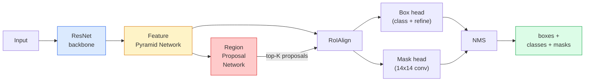

# التقسيم الحالي  قناع R-CNN

> أعطني جهاز رصد R-CNN الأسرع بالإضافة إلى فرع قناع صغير جداً، نحصل على قسم الحالة.

**Type:** Build + Learn
**Languages:** Python
**Prerequisites:** Phase 4 Lesson 06 (YOLO), Phase 4 Lesson 07 (U-Net)
**Time:** ~75 minutes

## 學习目标
- 端到端追踪 قناع R-CNN 架构: العمود الفقري FPN、RPN、RoIAlign、صندوق رأس
- من التحقق من RoIAlign،并 شرح لماذا RoIPool لم يعد يستخدم
- استخدام مشعل رؤية `maskrcnn_resnet50_fpn_v2`النموذج المسبق 生成生产质量 مثالية أقنعة،并正确读取它的输出格式
- 通過 استبدال الصندوق و رؤوس القناع ،并保持 العمود الفقري 结 ، في مجموعة بيانات محددة صغيرة

## 问题
التقسيم الدلالي لكل فئة عطى قناعها. التقسيم اللحظى لكل كائن عطى قناع، حتى لو كان كائنان ينتمون إلى نفس الفئة.

ماسك R-CNN (He et al., 2017) 通过把实例细分重新表述为检测-plus-a-mask来解决这个问题―― هذا التصميم بسيط جدا، حتى التالي خمس سنوات، تقريبا كل من هذه الحالات التقسيم 论文都是 متغيرات من ماسك R-CNN، وتركيز التطبيق حتى الآن هو منتجات مجموعة صغيرة من البيانات الاختيار الاختيار الاختيار الاختيار الاختيار الاختيار الاختيار الاختيار الاختيار الاختيار الاختيار الاختيار الاختيار الاختيار الاختيار الاختيار الاختيار الاختيار الاختيار الاختيار الاختيار الاختيار الاختيار الاختيار الاختيار الاختيار الاختيار الاختيار الاختيار الاختيار الاختيار الاختيار الاختيار الاختيار الاختيار الاختيار الاختيار الاختيار الاختيار الاختيار الاختيار الاختيار الاختيار الاختيار الاختيار الاختيار الاختيار الاختيار الاختيار الاختيار الاختيار الاختيار الاختيار الاختيار الاختيار الاختيار الاختيار الاختيار الاختيار الاختيار الاختيار الاختيار الاختيار الاختيار الاختيار الاختيار الاختيار الاختيار الاختيار الاختيار الاختيار الاختيار الاختيار الاختيار الاختيار الاختيار الاختيار الاختيار الاختيار الاختيار الاختيار الاختيار الاختيار الاختيار الاختيار الاختيار الاختيار الاختيار الاختيار الاختيار الاختيار الاختيار الاختيار الاختيار الاختيار الاختيار الاختيار الاختيار الاختيار الاختيار الاختيار الاختيار الاختيار الاختيار الاختيار الاختيار الاختيار الاختيار الاختيار الاختيار الاختيار ال ال ال ال الاختيار ال ال ال ال ال ال ال ال ال ال ال ال ال ال ال ال ال ال ال ال ال ال ال ال ال ال ال ال ال ال ال ال ال ال ال ال ال ال ال ال ال ال ال ال ال ال ال ال ال ال ال ال ال ال ال ال ال ال ال ال ال ال ال ال ال ال ال ال ال ال ال ال ال ال ال ال ال

مشكلة المهندسية المشكلة هي كيفية قطع منطقة ميزة ثابتة كبيرة من مربع الاقتراح، بينما نقطة الزاوية في هذا الصندوق لا تتوافق مع حدود البيكسل على طول؟

## 概念
### الهندسة المعمارية



يجب أن نفهم خمسة أجزاء:

1. **Backbone** في ImageNet 上 تدريب ResNet-50 أو ResNet-101── توليد خطوة 为 4、8、16、32 خرائط ميزة مستوى ‬‬‬‬‬‬‬‬‬‬‬‬‬‬‬‬‬‬‬‬‬‬‬‬‬‬‬‬‬‬‬‬‬‬‬‬‬‬‬‬‬‬‬‬‬‬‬‬‬‬‬‬‬‬‬‬‬‬‬‬‬‬‬‬‬‬‬‬‬‬‬‬‬‬‬‬‬‬‬‬‬‬‬‬‬‬‬‬‬‬‬‬‬‬‬‬‬‬‬‬‬‬‬‬‬‬‬‬‬‬‬‬‬‬‬‬‬‬‬‬‬‬‬‬‬‬‬‬‬‬‬‬‬‬‬‬‬‬‬‬‬‬‬‬‬‬‬‬‬‬‬‬‬‬‬‬‬‬‬‬‬‬‬‬‬‬‬‬‬‬‬‬‬‬‬‬‬‬‬‬‬‬‬‬‬‬‬‬‬‬‬‬‬‬‬‬‬‬‬‬‬‬‬‬‬‬‬‬‬‬‬‬‬‬‬‬‬‬‬‬‬‬‬‬‬‬‬‬‬‬‬‬‬‬‬‬‬‬‬‬‬‬‬‬‬‬‬‬‬‬‬‬‬‬‬‬‬‬‬‬‬‬‬‬‬‬‬‬‬‬‬‬‬‬‬‬‬‬‬‬‬‬‬‬‬‬‬‬‬‬‬‬‬‬‬‬‬‬‬‬‬‬‬‬‬‬‬‬‬‬‬‬‬‬‬‬‬‬‬‬‬‬‬‬‬‬‬‬‬‬‬‬‬‬‬‬‬‬‬‬‬‬‬‬‬‬‬‬‬‬‬‬‬‬‬‬‬‬‬‬‬‬‬‬‬‬‬‬‬‬‬‬‬‬‬‬‬‬‬‬‬‬‬‬‬‬‬‬‬‬‬‬‬‬‬‬‬‬‬‬‬‬‬‬‬‬‬‬‬‬‬‬‬‬‬‬‬‬‬‬‬‬‬‬‬‬‬‬‬‬‬‬‬‬‬‬‬‬‬‬‬‬‬‬‬‬‬‬‬‬‬‬‬‬‬‬‬‬‬‬‬‬‬‬‬‬‬‬‬‬‬‬‬
2. **FPN (Feature Pyramid Network)** التواصلات الجانبية من الأعلى إلى الأسفل، دع كل مستوى يكون له قنوات C معظمها.
3. **RPN (Region Proposal Network)** رأس مخزن صغير، في كل موقف لنر 上预测 هل يوجد هنا شيء؟以及我该如何精细盒?──每张图像产生大约1000 提案──
4. **RoIAlign** من مستوى FPN أي فوق مربع أي 中采样固定大小(على سبيل المثال 7x7) معطلة ميزة── استخدام العينات المزدوجة،不做量化──
5. **Heads** 两层盒头,用于精细盒 并选择类;再加一个小型卷头,为每一个提案 输出一个 `28x28`قناع ثنائي

### لماذا رويالين وليس رويبول

في البداية، استخدم R-CNN السريع RoIPool، فإنه يقطع مربع الاقتراح إلى شبكة، في كل خلية يأخذ أكبر ميزة، ويقوم بإرسال جميع المواقع حول إلى عدد كامل. هذا التجول سوف يجعل خريطة ميزة مع نقاط تنسيق البيكسل المدخلة، ويحقق قصير في خريطة ميزة كاملة في 224x224 صورة.

```
RoIPool:
  box (34.7, 51.3, 98.2, 142.9)
  round -> (34, 51, 98, 142)
  split grid -> round each cell boundary
  misalignment accumulates at every step

RoIAlign:
  box (34.7, 51.3, 98.2, 142.9)
  sample at exact float coordinates using bilinear interpolation
  no rounding anywhere
```

يمكن أن يستخدم كل جهاز كشف موقع الوضع الآن، بما في ذلك YOLOv7 seg、RT-DETR、Mask2Former。

### الـ RPN في فقرة واحدة

في كل موقع على الخريطة الميزية، وضع K 个 个不同尺寸和形状的 ancor boxes──为每个 ancor 预测一个对象性分数,以及一个回归抵消,用来把 ancor 变成更贴合对象的盒──按分数保留前前约1000 个盒,在 IoU 0.7 下应用 NMS,然后把保留下来的盒子 交给头 RPN 使用自己的迷你损失 训练,它的结构与课6的YOLO损失相似,只是两个类别的对象/没有对象) ──

### رأس القناع

لكل اقتراح، رأس القناع هو واحد صغير جداً، أربعة قوائم ثلاثية ثلاثة، واحد ثاني عشر، واحد واحد واحد واحد، في`28x28`قرار 下生成 `num_classes`قنوات الخروج ∙ فقط الاحتفاظ مع الطبقة المتوقعة على قناة المعاملة ؛ قنوات أخرى سوف يتم تجاهلها ∙

ضع قناع 28 × 28 على العينة إلى المقترح حجم البيكسل الأصلي، تحصل على القناع الثنائي النهائي

### الخسائر

" ماسك " " آر سي إن " لديها أربع فئات من الخسائر "

```
L = L_rpn_cls + L_rpn_box + L_box_cls + L_box_reg + L_mask
```

- `L_rpn_cls`،`L_rpn_box` موضوعية مقترحات RPN + مربع رجعة
- `L_box_cls` تصنيف الرأس 上针对 (C+1) الفئات 包含 background)
- `L_box_reg` صندوق الرأس التطور العليا
- `L_mask` 28 × 28 خروج قناع 上的每像素二进化

كل خسارة لها وزنها المُعتمد؛ تنفيذ رؤية الشعلة سوف يُظهر كحجج بناء.

### تنسيق الناتج

`torchvision.models.detection.maskrcnn_resnet50_fpn_v2`返回一个单词列表,每张图像对应一个单词:

```
{
    "boxes":  (N, 4) in (x1, y1, x2, y2) pixel coordinates,
    "labels": (N,) class IDs, 0 = background so indices are 1-based,
    "scores": (N,) confidence scores,
    "masks":  (N, 1, H, W) float masks in [0, 1] — threshold at 0.5 for binary,
}
```

القناع 已是 كامل قرار الصورة 已在内部完成upsample──


```figure
cv3-roialign-sampling
```

## بناءها
### الخطوة 1: التوصل إلى المملكة من الصفر

هذا المكون من R-CNN، مع رمز فهم أكثر بساطة من مع وصف الكلمات.

```python
import torch
import torch.nn.functional as F

def roi_align_single(feature, box, output_size=7, spatial_scale=1 / 16.0):
    """
    feature: (C, H, W) single-image feature map
    box: (x1, y1, x2, y2) in original image pixel coordinates
    output_size: side of the output grid (7 for box head, 14 for mask head)
    spatial_scale: reciprocal of the feature map stride
    """
    C, H, W = feature.shape
    x1, y1, x2, y2 = [c * spatial_scale - 0.5 for c in box]
    bin_w = (x2 - x1) / output_size
    bin_h = (y2 - y1) / output_size

    grid_y = torch.linspace(y1 + bin_h / 2, y2 - bin_h / 2, output_size)
    grid_x = torch.linspace(x1 + bin_w / 2, x2 - bin_w / 2, output_size)
    yy, xx = torch.meshgrid(grid_y, grid_x, indexing="ij")

    gx = 2 * (xx + 0.5) / W - 1
    gy = 2 * (yy + 0.5) / H - 1
    grid = torch.stack([gx, gy], dim=-1).unsqueeze(0)
    sampled = F.grid_sample(feature.unsqueeze(0), grid, mode="bilinear",
                            align_corners=False)
    return sampled.squeeze(0)
```

كل قيمة من المواقع المعدنية المعدلة على النموذج. لا يوجد تجول، لا يوجد كمية، ولا يوجد تراجع ضائع.

### 步骤 2: مقارنة مع مشعل الرؤية RoIAlign

```python
from torchvision.ops import roi_align

feature = torch.randn(1, 16, 50, 50)
boxes = torch.tensor([[0, 10, 20, 100, 90]], dtype=torch.float32)  # (batch_idx, x1, y1, x2, y2)

ours = roi_align_single(feature[0], boxes[0, 1:].tolist(), output_size=7, spatial_scale=1/4)
theirs = roi_align(feature, boxes, output_size=(7, 7), spatial_scale=1/4, sampling_ratio=1, aligned=True)[0]

print(f"shape ours:   {tuple(ours.shape)}")
print(f"shape theirs: {tuple(theirs.shape)}")
print(f"max|diff|:    {(ours - theirs).abs().max().item():.3e}")
```

في`sampling_ratio=1`و`aligned=True`时,两者能在 `1e-5`"إنه يتناسب"

### الخطوة الثالثة: تحميل قناع R-CNN المسبق تدريبها

```python
import torch
from torchvision.models.detection import maskrcnn_resnet50_fpn_v2, MaskRCNN_ResNet50_FPN_V2_Weights

model = maskrcnn_resnet50_fpn_v2(weights=MaskRCNN_ResNet50_FPN_V2_Weights.DEFAULT)
model.eval()
print(f"params: {sum(p.numel() for p in model.parameters()):,}")
print(f"classes (including background): {len(model.roi_heads.box_predictor.cls_score.out_features * [0])}")
```

46M المعلمات، 91 فئة ((COCO)  الأول الفئة ((id 0) هو الخلفية؛模型实际检测所有内容都从 id 1 开始。

### الخطوة الرابعة: إشغال الاستنتاج

```python
with torch.no_grad():
    x = torch.randn(3, 400, 600)
    predictions = model([x])
p = predictions[0]
print(f"boxes:  {tuple(p['boxes'].shape)}")
print(f"labels: {tuple(p['labels'].shape)}")
print(f"scores: {tuple(p['scores'].shape)}")
print(f"masks:  {tuple(p['masks'].shape)}")
```

شكل مضغوطة القناع هو `(N, 1, H, W)` 0.5 = عتبة، لكل كائن  الحصول على قناع ثنائي:

```python
binary_masks = (p['masks'] > 0.5).squeeze(1)  # (N, H, W) boolean
```

### 步骤 5: تبادل الرؤوس لعدة فئة مخصصة

وصفة التنسيق الدقيق 常见的:复用脊椎、FPN 和 RPN;بدل رؤساء التصنيفين

```python
from torchvision.models.detection.faster_rcnn import FastRCNNPredictor
from torchvision.models.detection.mask_rcnn import MaskRCNNPredictor

def build_custom_maskrcnn(num_classes):
    model = maskrcnn_resnet50_fpn_v2(weights=MaskRCNN_ResNet50_FPN_V2_Weights.DEFAULT)
    in_features = model.roi_heads.box_predictor.cls_score.in_features
    model.roi_heads.box_predictor = FastRCNNPredictor(in_features, num_classes)
    in_features_mask = model.roi_heads.mask_predictor.conv5_mask.in_channels
    hidden_layer = 256
    model.roi_heads.mask_predictor = MaskRCNNPredictor(in_features_mask, hidden_layer, num_classes)
    return model

custom = build_custom_maskrcnn(num_classes=5)
print(f"custom cls_score.out_features: {custom.roi_heads.box_predictor.cls_score.out_features}")
```

`num_classes`يجب أن يحتوي على فئة خلفية ، لذلك يجب استخدام 4 فئات كائن`num_classes=5`.

### الخطوة 6: تجميد ما لا يحتاج إلى تدريب

في مجموعة بيانات صغيرة، 结脊椎 和 FPN── فقط دع RPN الموضوعية + رجعة وذلك الرأس اثنين تعلم‬‬‬‬‬‬‬‬‬‬‬‬‬‬‬‬‬‬‬‬‬‬‬‬‬‬‬‬‬‬‬‬‬‬‬‬‬‬‬‬‬‬‬‬‬‬‬‬‬‬‬‬‬‬‬‬‬‬‬‬‬‬‬‬‬‬‬‬‬‬‬‬‬‬‬‬‬‬‬‬‬‬‬‬‬‬‬‬‬‬‬‬‬‬‬‬‬‬‬‬‬‬‬‬‬‬‬‬‬‬‬‬‬‬‬‬‬‬‬‬‬‬‬‬‬‬‬‬‬‬‬‬‬‬‬‬‬‬‬‬‬‬‬‬‬‬‬‬‬‬‬‬‬‬‬‬‬‬‬‬‬‬‬‬‬‬‬‬‬‬‬‬‬‬‬‬‬‬‬‬‬‬‬‬‬‬‬‬‬‬‬‬‬‬‬‬‬‬‬‬‬‬‬‬‬‬‬‬‬‬‬‬‬‬‬‬‬‬‬‬‬‬‬‬‬‬‬‬‬‬‬‬‬‬‬‬‬‬‬‬‬‬‬‬‬‬‬‬‬‬‬‬‬‬‬‬‬‬‬‬‬‬‬‬‬‬‬‬‬‬‬‬‬‬‬‬‬‬‬‬‬‬‬‬‬‬‬‬‬‬‬‬‬‬‬‬‬‬‬‬‬‬‬‬‬‬‬‬‬‬‬‬‬‬‬‬‬‬‬‬‬‬‬‬‬‬‬‬‬‬‬‬‬‬‬‬‬‬‬‬‬‬‬‬‬‬‬‬‬‬‬‬‬‬‬‬‬‬‬‬‬‬‬‬‬‬‬‬‬‬‬‬‬‬‬‬‬‬‬‬‬‬‬‬‬‬‬‬‬‬‬‬‬‬‬‬‬‬‬‬‬‬‬‬‬‬‬‬‬‬‬‬‬‬‬‬‬‬‬‬‬‬‬‬‬‬‬‬‬‬‬‬‬‬‬‬‬‬‬‬‬‬‬‬‬‬‬‬‬‬‬‬‬‬‬‬‬‬‬‬‬‬‬‬‬‬‬‬‬‬‬‬‬‬‬‬‬‬‬

```python
def freeze_backbone_and_fpn(model):
    # torchvision Mask R-CNN packs the FPN inside `model.backbone` (as
    # `model.backbone.fpn`), so iterating `model.backbone.parameters()` covers
    # both the ResNet feature layers and the FPN lateral/output convs.
    for p in model.backbone.parameters():
        p.requires_grad = False
    return model

custom = freeze_backbone_and_fpn(custom)
trainable = sum(p.numel() for p in custom.parameters() if p.requires_grad)
print(f"trainable after freeze: {trainable:,}")
```

في 500 صورة، هذا هو الفرق بين الإصدار والإصدار.

## استخدمها
المراقبة في ماسك R-CNN كامل حلقة التدريب  فقط 40 行، و بين المهام مختلفة لا يتغير بشكل أساسي: استبدال مجموعات البيانات، ثم البدء في التدريب.

```python
def train_step(model, images, targets, optimizer):
    model.train()
    loss_dict = model(images, targets)
    losses = sum(loss for loss in loss_dict.values())
    optimizer.zero_grad()
    losses.backward()
    optimizer.step()
    return {k: v.item() for k, v in loss_dict.items()}
```

`targets`يجب أن يحتوي القائمة على كل صورة على النص المطلوب،`boxes`.`labels`和 `masks`(كـ `(num_instances, H, W)`النظام الثنائي الاختيارات الثنائية الاختيارات الثنائية الاختيارات الثنائية الاختيارات الثنائية الاختيارات الثنائية الاختيارات الثنائية الاختيارات الثنائية الاختيارات الثنائية الاختيارات الثنائية الاختيارات الثنائية الاختيارات الثنائية الاختيارات الثنائية الاختيارات الثنائية الاختيارات الثنائية الاختيارات الثنائية الاختيارات الثنائية الاختيارات الثنائية الاختيارات الثنائية الاختيارات الثنائية الاختيارات الثنائية الاختيارات الثنائية الاختيارات الثنائية الاختيارات الثنائية الاختيارات الاختيارات الاختيارات الاختيارات الاختيارات الاختيارات الاختيارات الاختيارات الاختيارات الاختيارات`model.training`قررت

`pycocotools`المقيّم 会同時为盒 和面具 生成 mAP@IoU=0.5:0.95; تحتاج إلى رقمين، لكي تقرر فهي في رأس الصندوق أو رأس القناع.

## 交付 it
本课会产出:

- `outputs/prompt-instance-vs-semantic-router.md` واحدة سريعة، سوف يطرح ثلاثة أسئلة،并选择 مثال مقابل تعبير مقابل نظرية، فضلا عن نموذج بدء محدد.
- `outputs/skill-mask-rcnn-head-swapper.md`مهارة جديدة`num_classes`، لمتطلبات النموذج الكشف عن مشعل النظرية 生成用于交换头的10 行代码──

## التدريب
1. **(Easy)**في 100 مربع عشوائية`torchvision.ops.roi_align`验证你的RoIAlign──报告最大绝对差值──同时运行RoIPool(pre-2017 behavior),并显示它在附近边界的盒上会偏离约1-2 个特征地图像──
2. **(Medium)**في مجموعة بيانات مخصصة 50 صورة ((مجموعة من الفئات: البالونات والأسماك والثقب والشعارات) على التنسيق الدقيق`maskrcnn_resnet50_fpn_v2`العظم العمودي، تدريب 20 عصر، تقرير قناع AP@0.5。
3. **(Hard)**سوف نقوم بتغيير رأس قناع R-CNN إلى توقعات 56x56 بدلاً من إصدار 28x28.

## 关键术语
| Term | What people say | What it actually means |
|------|----------------|----------------------|
| Mask R-CNN | “Detection plus masks” | Faster R-CNN + 一个小型 FCN head，为每个 proposal 的每个 class 预测一个 28x28 mask |
| FPN | “Feature pyramid” | top-down + lateral connections，让每个 stride level 都有 C channels 的语义丰富 features |
| RPN | “Region proposer” | 一个小型 conv head，每张图像生成约 1000 个 object/no-object proposals |
| RoIAlign | “No-rounding crop” | 从任意 float-coordinate box 中以 bilinear 方式采样固定大小的 feature grid |
| RoIPool | “Pre-2017 crop” | 与 RoIAlign 用途相同，但会 round box coordinates；已经过时 |
| Mask AP | “Instance mAP” | 使用 mask IoU 而不是 box IoU 计算的 average precision；COCO instance segmentation metric |
| Binary mask head | “Per-class mask” | 为每个 proposal 的每个 class 预测一个 binary mask；只保留 predicted class 的 channel |
| Background class | “Class 0” | 兜底的 “no object” class；真实 classes 的 indices 从 1 开始 |

## 延伸阅读
- [Mask R-CNN (He et al., 2017)](https://arxiv.org/abs/1703.06870) 论文; حول رويالينغ    论文; 关于 رويالينغ   论文; 关于 رويالينغ  论文; 关于 رويالينغ  论文; 关于 رويالينغ  论文; 关于 رويالينغ  论文; 关于 رويالينغ  论文; 关于 رويالينغ  论文; 关于 رويالينغ  论文; 关于 رويالينغ  论文; 关于 رويالينغ  论文; 关于 رويالينغ  论文 关于 رويالينغ  论文 关于 رويالينغ 关于 رويالينغ 关于 رويالينغ 关于 رويالينغ 关于 رويالينغ 关于 رويالينغ 关于 رويالينغ 关于 رويالينغ 关于 رويالينغ 关于 رويالينغ 关于 رويالينغ 关于 رويالينغ 关于 رويالينغ 关于 رويالينغ 关于 رويالينغ 关于 رويال 关于 رويالينغ 关于 رويال 关于 رويالينغ 关于 رويال 关于 关于 关于 关于 关于 关于 关于 关于 关于 关于 关于 关于 关于 关于 关于 关于 关于 关于 关于 关于 关于 关于 关于 关于 关于 关于 关于 关于 关于 关于 关于 关于 关于 关于 关于 关于 关于 关于 关于 关于 关于 关于 关于 关于 关于 关于 关于 关于 关于 关于 关于 关于 关于 关于 关于 关于 关于 关于 关于 关于 关于 关于 关于 关于 关于 关于 关于 关于 关于 关于 关于 关于 关于 关于 关于 关于 关于  关于 关于                                                                        
- [FPN: Feature Pyramid Networks (Lin et al., 2017)](https://arxiv.org/abs/1612.03144) FPN 论文; كل كاشف حديث مدينة تستخدمها
- [torchvision Mask R-CNN tutorial](https://pytorch.org/tutorials/intermediate/torchvision_tutorial.html) حلقة التنسيق الدقيق
- [Detectron2 model zoo](https://github.com/facebookresearch/detectron2/blob/main/MODEL_ZOO.md) تنفيذات درجة الناتج، وتوفير كل الكشف والتقسيم  المتعلمة الوزن
