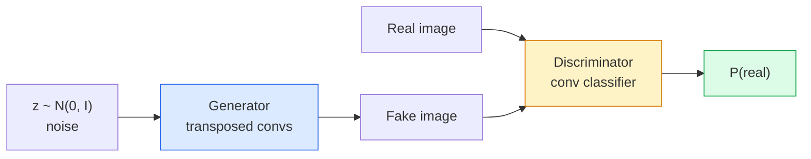
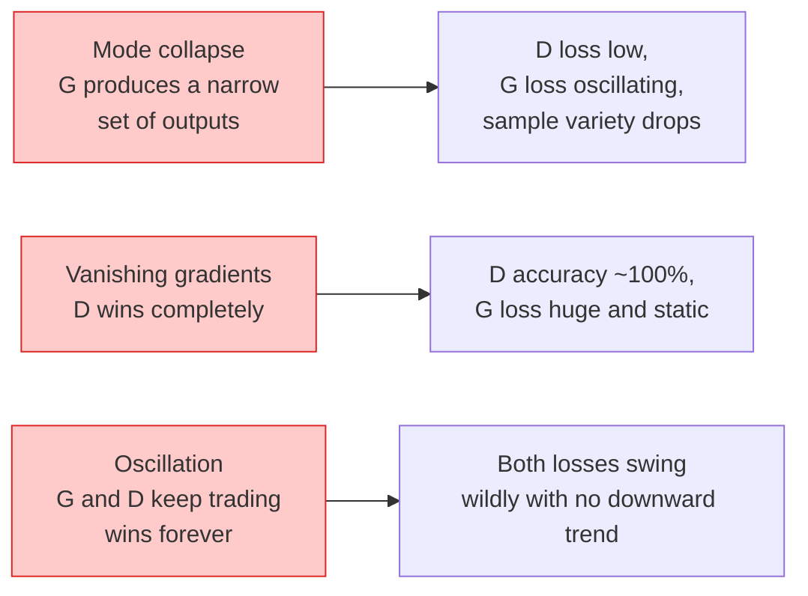

# إنتاج الصور  GANs

> GAN هي شبكة ثابتة بين شبكتين عصبية. واحد مسؤول عن رسم، واحد مسؤول عن تقييم. تصبح كل منهما أفضل معاً حتى يتم خداع المحققين على نتائج رسم.

**Type:** Build
**Languages:** Python
**Prerequisites:** Phase 4 Lesson 03 (CNNs), Phase 3 Lesson 06 (Optimizers), Phase 3 Lesson 07 (Regularization)
**Time:** ~75 分钟

## 學习目标
- تفسير الحد الأدنى بين المولد والتمييز ، وكذلك لماذا يتوافق مع النموذج = البيانات
- في PyTorch تنفيذ DCGAN، وتحقيق ذلك في 60 صفوف لإنتاج 32x32 صورة مركبة متسلسلة
- استخدام三种标准技巧稳定 GAN 训练: فقدان غير ملء
- 读取训练曲线,区分健康收与模式 انهيار、تحركات、تمييز-فوز-كامل

## 问题
تصنيف شبكة الكنيسة ستقوم بتسجيل الصور إلى العلامات. الجيل يُعكس هذه المسألة: الاختبار يبدو وكأنه من نفس التوزيع الصور الجديدة.

标准 Loss Function ((MSE、cross-entropy) لا يمكن قياس هل هذا النموذج يأتي من التوزيع الحقيقي── الحد الأدنى من كل خطأ في الصفحة يسبب نتائج مضحكة في المتوسط، بدلا من النموذج الحقيقي──突破点 lies in learning Loss: training second network, making its task to distinguish real from fake,并 use it to judge to drive generator──

قام GANs (Goodfellow et al., 2014) بتعريف هذا الإطار. حتى عام 2018، تمكن StyleGAN من إنتاج الصور التي يصعب التمييز بينها 1024x1024 وجهة شخص. بعد ذلك، تمت إدارة نماذج التوزيع على النحو الجيد والسيطرة، ولكن جعل التوزيع أصبح عمليًا. كل مهارة تمتدّة اختيار المساحات المتخفية أو فقدان الميزات كانت في وقت مبكر من قبل في GANs.

## 概念
### الشبكات



**generator**G 接收一个噪声 متجه `z`وخرج صورة**discriminator**D 接收一张图像并输出单个标量: احتمالية جعل هذه الصورة حقيقية

### اللعبة

G 希望 D 犯错──D 希望自己判断正确──形式化地说:

```
min_G max_D  E_x[log D(x)] + E_z[log(1 - D(G(z)))]
```

من اليمين إلى اليسار:D`log D(real)`) و المزيفة`log (1 - D(fake))`) دقة الصورة. G هو في الحد الأدنى D في الصورة المزيفة`D(G(z))`مرتفعة جداً

لقد أثبت هذا الحد الأدنى وجود توازن شامل`p_G = p_data`،D في جميع المواقع كل ما يخرج 0.5 ، وتولد التوزيع والتشرد بين التوزيع الحقيقي جينسن-شانون هو صفر.

### الخسارة غير المشبعة

الصيغة العليا غير مستقرة على القيمة العددية.`D(G(z))`لكل مزيف يقترب من الصفر، لذلك`log(1 - D(G(z)))`على غ غ غ غ غ غ غ غ غ غ غ غ غ غ غ غ غ غ غ غ غ غ غ غ غ غ غ غ غ غ غ غ غ غ غ غ غ غ غ غ غ غ غ غ غ غ غ غ غ غ غ غ غ غ غ غ غ غ غ غ غ غ غ غ غ غ غ غ غ غ غ غ غ غ غ غ غ غ غ غ غ غ غ غ غ غ غ غ غ غ غ غ غ غ غ غ غ غ غ غ غ غ غ غ غ غ غ غ غ غ غ غ غ غ غ غ غ غ غ غ غ غ غ غ غ غ غ غ غ غ غ غ غ غ غ غ غ غ غ غ غ غ غ غ غ غ غ غ غ غ غ غ غ غ غ غ غ غ غ غ غ غ غ غ غ غ غ غ غ غ غ غ غ غ غ غ غ غ غ غ غ غ غ غ غ غ غ غ غ غ غ غ غ غ غ غ غ غ غ غ غ غ غ غ غ غ غ غ غ غ غ غ غ غ غ غ غ غ غ غ غ غ غ غ غ غ غ غ غ غ غ غ غ غ غ غ غ غ غ غ غ غ غ غ غ غ غ غ غ غ غ غ غ غ غ غ غ غ غ غ غ غ غ غ غ غ غ غ غ غ غ غ غ غ غ غ غ غ غ غ غ غ غ غ غ غ غ غ غ غ غ غ غ غ غ غ غ غ غ غ غ غ غ غ غ غ غ غ غ غ غ غ غ غ غ غ غ غ غ غ غ غ غ غ غ غ غ غ غ غ غ غ غ غ غ غ غ غ غ غ غ غ غ غ غ غ غ غ غ غ غ غ غ غ غ غ غ غ غ غ غ غ غ غ غ غ غ غ غ غ غ غ غ غ غ غ غ غ غ غ غ غ غ غ غ غ غ غ غ غ غ غ غ غ غ غ غ غ غ غ غ غ غ غ غ غ غ غ غ غ غ غ غ غ غ غ غ غ غ غ غ غ غ غ غ غ غ غ غ غ غ غ غ غ غ غ غ غ غ غ غ غ غ غ غ غ غ غ غ غ غ غ غ غ غ غ غ غ غ غ غ غ غ غ غ غ غ غ غ غ غ غ غ غ غ غ غ غ غ غ غ غ غ غ غ غ غ غ غ غ غ غ غ غ غ غ غ غ غ غ غ غ غ غ غ غ غ غ غ

```
L_D = -E_x[log D(x)] - E_z[log(1 - D(G(z)))]
L_G = -E_z[log D(G(z))]                          # non-saturating
```

الآن الآن`D(G(z))`接近零时,G 的损失 很大,Gradient 也有信息量──每现代GAN都使用这个变体进行训练──

### قواعد معماري DCGAN

رادفورد ميتس تشينتالا (2015) سوف تحويل تجربة فشلت لعدة سنوات إلى قائمة ، مما يجعل تدريب GAN أكثر استقرارًا:

1. استخدام الحوافز المتقدمة بدلاً من التجميع 
2. في المولّد و المُتميّز يستخدم كلّ شخص قاعدة اللحظة، ولكن G's output و D's input استثنائية.
3. في أعماق البناء، تحريك الطبقات المتصلة بالكامل
4. G 在除输出层外所有层使用 ReLU(输出层用 tanh,将输出限制在 [-1, 1])。
5. D 在所有层使用LeakyReLU(negative_slope=0.2)。

كلّ GAN حديث على أساس القواعد (StyleGAN、BigGAN、GigaGAN) ما زال يخرج من هذه القواعد، ولم يبدل جزء منها مرة أخرى.

### أساليب الفشل  وخصائصها



- **Mode collapse**:G 找到一张能骗过D 的图像,然后只生成它──修复:加入迷你批量歧视、光谱规范,或标签条件──
- **Discriminator wins**:D 变强太快,G 的 渐变 消失──修复:减小 D、降低 D 學習率,或对真实标签 应用标签滑滑──
- **Oscillation**: شبكتين تتواصلين في الاستفادة من بعضها البعض، ولكن لا تقترب من التوازن.

### التقييم

لا توجد حقيقة أساسية في (جان) ، كيف تعرف إذا كانت تعمل؟

- **Sample inspection**كل عصر ينتهي مباشرة على 64 نموذج
- **FID (Fréchet Inception Distance)** الفاصل بين التوزيعات الفعلية للمجموعة والتي تمتلكها المجموعة الإبتدائية-v3
- **Inception Score**较旧,也更脆弱; استخدام FID فى المقام الأول
- **Precision/Recall for generative models**分别衡量质量 (دقة) و تغطية (تذكير) 比单独使用 FID 更有信息量──

بالنسبة للبيانات الصناعية الصغيرة، فالتفتيش العينوي يكفي.


```figure
cv-gan-image
```

## بناءها
### الخطوة 1: مولد

مولد DCGAN صغير، يتلقى 64 维 ضجيج ويتولى إنتاج صورة 32x32 图像──

```python
import torch
import torch.nn as nn

class Generator(nn.Module):
    def __init__(self, z_dim=64, img_channels=3, feat=64):
        super().__init__()
        self.net = nn.Sequential(
            nn.ConvTranspose2d(z_dim, feat * 4, kernel_size=4, stride=1, padding=0, bias=False),
            nn.BatchNorm2d(feat * 4),
            nn.ReLU(inplace=True),
            nn.ConvTranspose2d(feat * 4, feat * 2, kernel_size=4, stride=2, padding=1, bias=False),
            nn.BatchNorm2d(feat * 2),
            nn.ReLU(inplace=True),
            nn.ConvTranspose2d(feat * 2, feat, kernel_size=4, stride=2, padding=1, bias=False),
            nn.BatchNorm2d(feat),
            nn.ReLU(inplace=True),
            nn.ConvTranspose2d(feat, img_channels, kernel_size=4, stride=2, padding=1, bias=False),
            nn.Tanh(),
        )

    def forward(self, z):
        return self.net(z.view(z.size(0), -1, 1, 1))
```

أربعة محركات نقل، كل واحد يستخدم`kernel_size=4, stride=2, padding=1`، بحيث يمكنهم أن يصلحوا مساحة الحجم مرتين.

### 步骤 2: التمييز

المخرجات المتحركة للإنتاجات المتحركة

```python
class Discriminator(nn.Module):
    def __init__(self, img_channels=3, feat=64):
        super().__init__()
        self.net = nn.Sequential(
            nn.Conv2d(img_channels, feat, kernel_size=4, stride=2, padding=1),
            nn.LeakyReLU(0.2, inplace=True),
            nn.Conv2d(feat, feat * 2, kernel_size=4, stride=2, padding=1, bias=False),
            nn.BatchNorm2d(feat * 2),
            nn.LeakyReLU(0.2, inplace=True),
            nn.Conv2d(feat * 2, feat * 4, kernel_size=4, stride=2, padding=1, bias=False),
            nn.BatchNorm2d(feat * 4),
            nn.LeakyReLU(0.2, inplace=True),
            nn.Conv2d(feat * 4, 1, kernel_size=4, stride=1, padding=0),
        )

    def forward(self, x):
        return self.net(x).view(-1)
```

آخر مرة`4x4`خريطة الميزات 降到 `1x1`◊输出是每张图像一个标量; فقط في Loss 计算期间应用 sigmoid‬

### الخطوة الثالثة: خطوة التدريب

交替执行: كل دفعة 先更新一次 D,再更新一次 G。

```python
import torch.nn.functional as F

def train_step(G, D, real, z, opt_g, opt_d, device):
    real = real.to(device)
    bs = real.size(0)

    # D step
    opt_d.zero_grad()
    d_real = D(real)
    d_fake = D(G(z).detach())
    loss_d = (F.binary_cross_entropy_with_logits(d_real, torch.ones_like(d_real))
              + F.binary_cross_entropy_with_logits(d_fake, torch.zeros_like(d_fake)))
    loss_d.backward()
    opt_d.step()

    # G step
    opt_g.zero_grad()
    d_fake = D(G(z))
    loss_g = F.binary_cross_entropy_with_logits(d_fake, torch.ones_like(d_fake))
    loss_g.backward()
    opt_g.step()

    return loss_d.item(), loss_g.item()
```

الخطوة الوسطى`G(z).detach()`至关重要: نحن لا نريد أن نُحديث D 时 渐进 G 流入 ‖ نُنسى أنّ هذا هو خطأ المبتدئين الكلاسيكي.

### الخطوة 4: في الأشكال الاصطناعية 上运行 كامل حلقة التدريب

```python
from torch.utils.data import DataLoader, TensorDataset
import numpy as np

def synthetic_images(num=2000, size=32, seed=0):
    rng = np.random.default_rng(seed)
    imgs = np.zeros((num, 3, size, size), dtype=np.float32) - 1.0
    for i in range(num):
        r = rng.uniform(6, 12)
        cx, cy = rng.uniform(r, size - r, size=2)
        yy, xx = np.meshgrid(np.arange(size), np.arange(size), indexing="ij")
        mask = (xx - cx) ** 2 + (yy - cy) ** 2 < r ** 2
        color = rng.uniform(-0.5, 1.0, size=3)
        for c in range(3):
            imgs[i, c][mask] = color[c]
    return torch.from_numpy(imgs)

device = "cuda" if torch.cuda.is_available() else "cpu"
data = synthetic_images()
loader = DataLoader(TensorDataset(data), batch_size=64, shuffle=True)

G = Generator(z_dim=64, img_channels=3, feat=32).to(device)
D = Discriminator(img_channels=3, feat=32).to(device)
opt_g = torch.optim.Adam(G.parameters(), lr=2e-4, betas=(0.5, 0.999))
opt_d = torch.optim.Adam(D.parameters(), lr=2e-4, betas=(0.5, 0.999))

for epoch in range(10):
    for (batch,) in loader:
        z = torch.randn(batch.size(0), 64, device=device)
        ld, lg = train_step(G, D, batch, z, opt_g, opt_d, device)
    print(f"epoch {epoch}  D {ld:.3f}  G {lg:.3f}")
```

`Adam(lr=2e-4, betas=(0.5, 0.999))`هو DCGAN الاختيارية لتحديد النمو في اللعبة المضادة المثابرة

### الخطوة 5: أخذ العينات

```python
@torch.no_grad()
def sample(G, n=16, z_dim=64, device="cpu"):
    G.eval()
    z = torch.randn(n, z_dim, device=device)
    imgs = G(z)
    imgs = (imgs + 1) / 2
    return imgs.clamp(0, 1)
```

采样前始终切换到 eval mode── بالنسبة إلى DCGAN هذا مهم، لأن معايير البطاقة ستستخدم إحصاءات تشغيل، وليس إحصاءات البطاقة الحالية──

### الخطوة 6: التطبيع الطيفي

المتميزة 中 BN 的即插即用替代方案,保证网络是1-Lipschitz──能修复大多数D يفوزون بجدفشل──

```python
from torch.nn.utils import spectral_norm

def build_sn_discriminator(img_channels=3, feat=64):
    return nn.Sequential(
        spectral_norm(nn.Conv2d(img_channels, feat, 4, 2, 1)),
        nn.LeakyReLU(0.2, inplace=True),
        spectral_norm(nn.Conv2d(feat, feat * 2, 4, 2, 1)),
        nn.LeakyReLU(0.2, inplace=True),
        spectral_norm(nn.Conv2d(feat * 2, feat * 4, 4, 2, 1)),
        nn.LeakyReLU(0.2, inplace=True),
        spectral_norm(nn.Conv2d(feat * 4, 1, 4, 1, 0)),
    )
```

ستعمل`Discriminator`替换为 `build_sn_discriminator()`بعد ذلك، لا تحتاج عادة إلى مهارات التنقل التنقل التنقلي.

## استخدمها
بالنسبة للجيل القوي، استخدام الأوزان المسبقة التدريب أو التحول إلى التوزيع.

- `torch_fidelity`يمكنك في مولدك 上 حساب FID / IS، و لا حاجة إلى كتابة تعريف ذاتي 代码 eval
- `pytorch-gan-zoo`(رث) و `StudioGAN`提供经过测试的DCGAN、WGAN-GP、SN-GAN、StyleGAN 和 BigGAN 实现──

حتى عام 2026، GANs  مازالت أفضل خيار لهذه المشهد: حقيقة الوقت تصويري إنتاج: التأخير <10 ms) ‬التحويل النمط ‬مع تحكم محدد في ترجمة الصورة إلى الصورة ‬Pix2Pix‬CycleGAN‬‬‬‬‬‬‬‬‬‬‬‬‬‬‬‬‬‬‬‬‬‬‬‬‬‬‬‬‬‬‬‬‬‬‬‬‬‬‬‬‬‬‬‬‬‬‬‬‬‬‬‬‬‬‬‬‬‬‬‬‬‬‬‬‬‬‬‬‬‬‬‬‬‬‬‬‬‬‬‬‬‬‬‬‬‬‬‬‬‬‬‬‬‬‬‬‬‬‬‬‬‬‬‬‬‬‬‬‬‬‬‬‬‬‬‬‬‬‬‬‬‬‬‬‬‬‬‬‬‬‬‬‬‬‬‬‬‬‬‬‬‬‬‬‬‬‬‬‬‬‬‬‬‬‬‬‬‬‬‬‬‬‬‬‬‬‬‬‬‬‬‬‬‬‬‬‬‬‬‬‬‬‬‬‬‬‬‬‬‬‬‬‬‬‬‬‬‬‬‬‬‬‬‬‬‬‬‬‬‬‬‬‬‬‬‬‬‬‬‬‬‬‬‬‬‬‬‬‬‬‬‬‬‬‬‬‬‬‬‬‬‬‬‬‬‬‬‬‬‬‬‬‬‬‬‬‬‬‬‬‬‬‬‬‬‬‬‬‬‬‬‬‬‬‬‬‬‬‬‬‬‬‬‬‬‬‬‬‬‬‬‬‬‬‬‬‬‬‬‬‬‬‬‬‬‬‬‬‬‬‬‬‬‬‬‬‬‬‬‬‬‬‬‬‬‬‬‬‬‬‬‬‬‬‬‬‬‬‬‬‬‬‬‬‬‬‬‬‬‬‬‬‬‬‬‬‬‬‬‬‬‬‬‬‬‬‬‬‬‬‬‬‬‬‬‬‬‬‬‬‬‬‬‬‬‬‬‬‬‬‬‬‬‬‬‬‬‬‬‬‬‬‬‬‬‬‬‬‬‬‬‬‬‬‬‬‬‬‬‬‬‬‬‬‬‬‬‬‬‬‬‬‬‬‬‬‬‬‬

## 交付 it
本课产出:

- `outputs/prompt-gan-training-triage.md`إحدى المشاريع، للمستخدمين في دراسة التدريب 曲线描述并选择失败模式 ((طريقة انهيار、D-win、oscillation) ،以及单个推修复方案──
- `outputs/skill-dcgan-scaffold.md`مهارة، يمكن أن حسب`z_dim`الهدف`image_size`和 `num_channels`编写DCGAN منصة، بما في ذلك حلقة التدريب ومدفوع العينات

## التدريب
1. **(Easy)**في مجموعة بيانات الدورات الاصطناعية على تدريب على DCGAN ، و في نهاية كل عصر حفظ 16 نموذج من شبكة. إلى أي عصر ، يصبح المنتج واضحاً؟
2. **(Medium)**استخدام القاعدة الطيفية بدل القاعدة البطولية للمتمييز 并排训练两版本 哪个收更快?哪个收更快?哪个在三个种子中上方差更低?
3. **(Hard)**实现 مشروط DCGAN:将类标签 输入 G 和 D(在 G 中将 one-hot拼接到噪声,在 D 中拼接一个类嵌入频道) ⋅ في الدروس 7 من مجموعة بيانات "حلقات مقابل مربعات" الصناعية 上训练,并通过使用指定标签 采样来展示类调节 有效果.

## 关键术语
| Term | What people say | What it actually means |
|------|----------------|----------------------|
| Generator (G) | “负责画东西的网络” | 将 noise 映射到图像；训练目标是骗过 discriminator |
| Discriminator (D) | “评判者” | Binary classifier；训练目标是区分真实图像与生成图像 |
| Minimax | “这个博弈” | 在 adversarial loss 上对 G 取 min、对 D 取 max；均衡是 p_G = p_data |
| Non-saturating loss | “数值上合理的版本” | G 的 Loss 是 -log(D(G(z)))，而不是 log(1 - D(G(z)))，以避免训练早期 Gradient 消失 |
| Mode collapse | “Generator 只生成一种东西” | G 只生成数据分布中的一小部分；用 SN、minibatch discrimination 或更大的 batch 修复 |
| TTUR | “两个 learning rates” | D 比 G 学得更快，通常快 2-4 倍；稳定训练 |
| Spectral norm | “1-Lipschitz layer” | 一种 weight-normalisation，用来限制每层的 Lipschitz constant；防止 D 变得任意陡峭 |
| FID | “Fréchet Inception Distance” | 真实集合与生成集合的 Inception-v3 feature distributions 之间的距离；标准评估指标 |

## 延伸阅读
- [Generative Adversarial Networks (Goodfellow et al., 2014)](https://arxiv.org/abs/1406.2661) افتتاح مقال في هذا الاتجاه
- [DCGAN (Radford, Metz, Chintala, 2015)](https://arxiv.org/abs/1511.06434)جعلي GANs قابل للتدريب قواعد البناء
- [Spectral Normalization for GANs (Miyato et al., 2018)](https://arxiv.org/abs/1802.05957)أهم تقنيات الاستقرار الوحيدة
- [StyleGAN3 (Karras et al., 2021)](https://arxiv.org/abs/2106.12423)SOTA GAN؛ قراءة تبدو مثل هي مجموعة مختارة من كل المهارات في العقد الماضي
