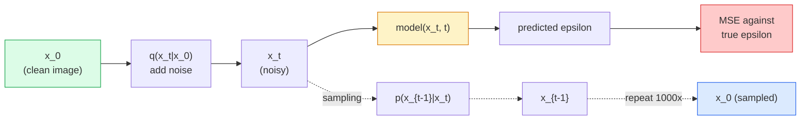

# 图像生成  نماذج التنشر

> نموذج التوزيع تعلم هو التعبير. تدريبها لإزالة جزء صغير من الضجيج من الصورة التي تحتوي على ضجيج.

**Type:** Build
**Languages:** Python
**Prerequisites:** Phase 4 Lesson 07 (U-Net), Phase 1 Lesson 06 (Probability), Phase 3 Lesson 06 (Optimizers)
**Time:** ~75 分钟

## 學习目标

- 推导 عملية الضوضاء المقدمة `x_0 -> x_1 -> ... -> x_T`, لم اُوضح لماذا أغلق`q(x_t | x_0)`على أيّة مدينة
- تحقيق هدف تدريبية في طراز DDPM، لتحقيق عينة من الضوضاء المضافة إلى كل خطوة، والتحقيق من الضوضاء النقية
- إنشاء شبكة U-Net ذات تكييف زمني ((صغر إلى يمكن أن يكون في CPU على تدريب) ، لتنبؤ أي خطوة زمنية من الضوضاء
- شرح الفرق بين أخذ العينات من DDPM و DDIM، وكذلك المشهد الملائم لكل منهما ((درس 23 会深入讲解流量匹配和修正流量)

## 问题

النماذج الاختراقية هي تكوين واحد: الضجيج الدخول المصورة المصورة المصورة المصورة المصورة المصورة المصورة المصورة المصورة المصورة المصورة المصورة المصورة المصورة المصورة المصورة المصورة المصورة المصورة المصورة المصورة المصورة المصورة المصورة المصورة المصورة المصورة المصورة المصورة المصورة المصورة المصورة المصورة المصورة المصورة المصورة المصورة المصورة المصورة المصورة المصورة المصورة المصورة المصورة المصورة المصورة المصورة المصورة المصورة المصورة المصورة المصورة المصورة المصورة المصورة المصورة المصورة المصورة الم المصورة الم الم المصورة الم الم الم المصورة الم الم الم المصورة الم الم الم الم الم المصورة الم الم الم الم المصورة الم الم الم الم الم الم الم المصورة الم الم الم الم الم الم المصورة الم الم الم الم الم الم الم الم الم الم الم الم الم الم الم الم الم الم الم الم الم الم الم الم الم الم الم الم الم الم الم الم الم الم الم الم الم الم الم الم الم الم الم الم الم الم الم الم الم الم الم الم الم الم الم الم الم الم الم الم الم الم الم الم الم الم الم الم الم الم الم الم الم الم الم الم الم الم الم الم الم 

وبالإضافة إلى تدريب الاستقرار، فإن هيكل التشويق يفتح أيضا كل قدرة في إنتاج الصور الحديثة: تكييف النص والتلوين، تحرير الصور، عالية القرار، النمط القيادي. كل خطوة من حلقة العينات هي مدخلات إلى مجموعة جديدة.

هذا الدرس سوف يُبني أدنى DDPM:الضوضاء إلى الأمام ‬التخفيض إلى الخلف ‬حلقة التدريب‬‬‬‬‬‬‬‬‬‬‬‬‬‬‬‬‬‬‬‬‬‬‬‬‬‬‬‬‬‬‬‬‬‬‬‬‬‬‬‬‬‬‬‬‬‬‬‬‬‬‬‬‬‬‬‬‬‬‬‬‬‬‬‬‬‬‬‬‬‬‬‬‬‬‬‬‬‬‬‬‬‬‬‬‬‬‬‬‬‬‬‬‬‬‬‬‬‬‬‬‬‬‬‬‬‬‬‬‬‬‬‬‬‬‬‬‬‬‬‬‬‬‬‬‬‬‬‬‬‬‬‬‬‬‬‬‬‬‬‬‬‬‬‬‬‬‬‬‬‬‬‬‬‬‬‬‬‬‬‬‬‬‬‬‬‬‬‬‬‬‬‬‬‬‬‬‬‬‬‬‬‬‬‬‬‬‬‬‬‬‬‬‬‬‬‬‬‬‬‬‬‬‬‬‬‬‬‬‬‬‬‬‬‬‬‬‬‬‬‬‬‬‬‬‬‬‬‬‬‬‬‬‬‬‬‬‬‬‬‬‬‬‬‬‬‬‬‬‬‬‬‬‬‬‬‬‬‬‬‬‬‬‬‬‬‬‬‬‬‬‬‬‬‬‬‬‬‬‬‬‬‬‬‬‬‬‬‬‬‬‬‬‬‬‬‬‬‬‬‬‬‬‬‬‬‬‬‬‬‬‬‬‬‬‬‬‬‬‬‬‬‬‬‬‬‬‬‬‬‬‬‬‬‬‬‬‬‬‬‬‬‬‬‬‬‬‬‬‬‬‬‬‬‬‬‬‬‬‬‬‬‬‬‬‬‬‬‬‬‬‬‬‬‬‬‬‬‬‬‬‬‬‬‬‬‬‬‬‬‬‬‬‬‬‬‬‬‬‬‬‬‬‬‬‬‬‬‬‬‬‬‬‬‬‬‬‬‬‬‬‬‬‬‬‬‬‬‬‬‬‬‬‬‬‬‬‬‬‬‬‬‬‬‬‬‬‬‬‬‬‬‬‬‬‬‬‬‬‬‬‬‬‬‬‬‬‬‬‬‬‬‬‬

## مفهوم الأساسي

### عملية متقدمة

取一张图像 `x_0`加入少量 غوسيان الضجيج 得到 `x_1`‬‬‬‬‬‬‬‬‬‬‬‬‬‬‬‬‬‬‬‬‬‬‬‬‬‬‬‬‬‬‬‬‬‬‬‬‬‬‬‬‬‬‬‬‬‬‬‬‬‬‬‬‬‬‬‬‬‬‬‬‬‬‬‬‬‬‬‬‬‬‬‬‬‬‬‬‬‬‬‬‬‬‬‬‬‬‬‬‬‬‬‬‬‬‬‬‬‬‬‬‬‬‬‬‬‬‬‬‬‬‬‬‬‬‬‬‬‬‬‬‬‬‬‬‬‬‬‬‬‬‬‬‬‬‬‬‬‬‬‬‬‬‬‬‬‬‬‬‬‬‬‬‬‬‬‬‬‬‬‬‬‬‬‬‬‬‬‬‬‬‬‬‬‬‬‬‬‬‬‬‬‬‬‬‬‬‬‬‬‬‬‬‬‬‬‬‬‬‬‬‬‬‬‬‬‬‬‬‬‬‬‬‬‬‬‬‬‬‬‬‬‬‬‬‬‬‬‬‬‬‬‬‬‬‬‬‬‬‬‬‬‬‬‬‬‬‬‬‬‬‬‬‬‬‬‬‬‬‬‬‬‬‬‬‬‬‬‬‬‬‬‬‬‬‬‬‬‬‬‬‬‬‬‬‬‬‬‬‬‬‬‬‬‬‬‬‬‬‬‬‬‬‬‬‬‬‬‬‬‬‬‬‬‬‬‬‬‬‬‬‬‬‬‬‬‬‬‬‬‬‬‬‬‬‬‬‬‬‬‬‬‬‬‬‬‬‬‬‬‬‬‬‬‬‬‬‬‬‬‬‬‬‬‬‬‬‬‬‬‬‬‬‬‬‬‬‬‬‬‬‬‬‬‬‬‬‬‬‬‬‬‬‬‬‬‬‬‬‬‬‬‬‬‬‬‬‬‬‬‬‬‬‬‬‬‬‬‬‬‬‬‬‬‬‬‬‬‬‬‬‬‬‬‬‬‬‬‬‬‬‬‬‬‬‬‬‬‬‬‬‬‬‬‬‬‬‬‬‬‬‬‬‬‬‬‬‬‬‬‬‬‬‬‬‬‬‬‬‬‬‬‬‬‬‬‬‬‬‬‬‬‬‬‬‬‬‬‬‬‬‬‬‬‬‬‬‬‬‬`x_2`استمر في التدريب حتى`x_T`几乎无法与纯高斯噪声 区分──

```
q(x_t | x_{t-1}) = N(x_t; sqrt(1 - beta_t) * x_{t-1},  beta_t * I)
```

`beta_t`هو جدول متغير أصغر، عادةً في T=1000 خطوة من 0.0001 線性 النمو إلى 0.02 .

### 闭式跳转

"التضمين إلى الضجيج خطوة بخطوة هو سلسلة ماركوف" "لكن يمكن أن تتعكس رياضياً"`x_0`العينة 出 `x_t`.

```
Define alpha_t = 1 - beta_t
Define alpha_bar_t = prod_{s=1..t} alpha_s

Then:
  q(x_t | x_0) = N(x_t; sqrt(alpha_bar_t) * x_0,  (1 - alpha_bar_t) * I)

Equivalently:
  x_t = sqrt(alpha_bar_t) * x_0 + sqrt(1 - alpha_bar_t) * epsilon
  where epsilon ~ N(0, I)
```

هذه الطريقة الوحيدة هي سبب التفرق يمكن أن يكون عملي.`t`, مباشرة من`x_0`العينة 出 `x_t`،并一步完成 التدريب، لا حاجة إلى تقليد كامل سلسلة ماركوف

### عملية عكسية

العملية المقدمة هي ثابتة.`p(x_{t-1} | x_t)`هو شبكة عصبية ◊ تعلم محتوى.`x_{t-1}`؛ أنها تتوقع في الدّين                                    `epsilon`ثم من خلال العدول الرياضية`x_{t-1}`.



### 訓練 الخسارة

 لكل خطوة تدريبية:

1. عينة 一张真实图像 `x_0`.
2. من [1, T] 中均样本 一个时间步骤 `t`.
3. ضجيج العينة`epsilon ~ N(0, I)`.
4. 计算 `x_t = sqrt(alpha_bar_t) * x_0 + sqrt(1 - alpha_bar_t) * epsilon`.
5. استخدام الشبكة 预测 `epsilon_theta(x_t, t)`.
6. أحدث`|| epsilon - epsilon_theta(x_t, t) ||^2`.

هذا هو الحال. "تعلم شبكة العصبية في أي مرحلة زمنية" "توقع الضجيج". "الخسارة هي "المس" "لا لعبة معادلة" "لا انهيار" "لا تذبذب"

### عينة (DDPM)

生成时: من`x_T ~ N(0, I)`بدأوا، خطوة خطوة إلى الوراء

```
for t = T, T-1, ..., 1:
    eps = model(x_t, t)
    x_{t-1} = (1 / sqrt(alpha_t)) * (x_t - (beta_t / sqrt(1 - alpha_bar_t)) * eps) + sqrt(beta_t) * z
    where z ~ N(0, I) if t > 1, else 0
return x_0
```

关键在于, على الرغم من أن الظروف العكسية عموما ليس لديها شكل مغلق معروف, ولكن بالنسبة لهذا العملية الغوسية المقدمة محددة, انها لديها مغلقة.

### لماذا 1000 خطوة

الهدف من اختيار جدول الضوضاء المضي قدما هو جعل كل خطوة تضم ضوضاء كافية، مما يجعل الخطوة العكسية قريبة مثل غوسيان.

### DDIM:快 20 倍的采样

訓練相同,樣本化 改變──DDIM(Song et al., 2020) تحدد عملية عكسية محددة، يمكن أن تتجاوز خطوات الوقت دون إعادة التدريب.

### تكييف الوقت

الشبكة`epsilon_theta(x_t, t)`需要知道它正在指明 哪个时间步骤──现代 Diffusion Models 通过突状时间嵌入 注入 `t`(مثل فكرة التشفير الموضعي في المحولات) ، و في كل مستوى U-Net وضعها على خرائط الميزات فوقها

```
t_embedding = sinusoidal(t)
feature_map += MLP(t_embedding)
```

لا توجد تكييف الوقت، الشبكة يجب أن تخمن مستوى الضوضاء من خلال الصورة نفسها، وهذا يمكن أن يعمل أيضا، ولكن كفاءة العينة سوف تكون أقل بكثير.


```figure
cv-diffusion-image
```

## بناءها

### الخطوة 1: جدول الضوضاء

```python
import torch

def linear_beta_schedule(T=1000, beta_start=1e-4, beta_end=2e-2):
    return torch.linspace(beta_start, beta_end, T)


def precompute_schedule(betas):
    alphas = 1.0 - betas
    alphas_cumprod = torch.cumprod(alphas, dim=0)
    return {
        "betas": betas,
        "alphas": alphas,
        "alphas_cumprod": alphas_cumprod,
        "sqrt_alphas_cumprod": torch.sqrt(alphas_cumprod),
        "sqrt_one_minus_alphas_cumprod": torch.sqrt(1.0 - alphas_cumprod),
        "sqrt_recip_alphas": torch.sqrt(1.0 / alphas),
    }

schedule = precompute_schedule(linear_beta_schedule(T=1000))
```

预计一次,在训练和采样时按指数收集

### 步骤 2: التوزيع الأمامي (q_sample)

```python
def q_sample(x0, t, noise, schedule):
    sqrt_a = schedule["sqrt_alphas_cumprod"][t].view(-1, 1, 1, 1)
    sqrt_one_minus_a = schedule["sqrt_one_minus_alphas_cumprod"][t].view(-1, 1, 1, 1)
    return sqrt_a * x0 + sqrt_one_minus_a * noise
```

أشكال مغلقة`t`إنها مجموعة من الخطوات الزمنية، المجموعة في كل صورة على واحد

### الخطوة الثالثة: شبكة يو-نت صغيرة ذات تكييف زمني

```python
import torch.nn as nn
import torch.nn.functional as F
import math

def timestep_embedding(t, dim=64):
    half = dim // 2
    freqs = torch.exp(-math.log(10000) * torch.arange(half, device=t.device) / half)
    args = t[:, None].float() * freqs[None]
    emb = torch.cat([args.sin(), args.cos()], dim=-1)
    return emb


class TinyUNet(nn.Module):
    def __init__(self, img_channels=3, base=32, t_dim=64):
        super().__init__()
        self.t_mlp = nn.Sequential(
            nn.Linear(t_dim, base * 4),
            nn.SiLU(),
            nn.Linear(base * 4, base * 4),
        )
        self.t_dim = t_dim
        self.enc1 = nn.Conv2d(img_channels, base, 3, padding=1)
        self.enc2 = nn.Conv2d(base, base * 2, 4, stride=2, padding=1)
        self.mid = nn.Conv2d(base * 2, base * 2, 3, padding=1)
        self.dec1 = nn.ConvTranspose2d(base * 2, base, 4, stride=2, padding=1)
        self.dec2 = nn.Conv2d(base * 2, img_channels, 3, padding=1)
        self.time_proj = nn.Linear(base * 4, base * 2)

    def forward(self, x, t):
        t_emb = timestep_embedding(t, self.t_dim)
        t_emb = self.t_mlp(t_emb)
        t_proj = self.time_proj(t_emb)[:, :, None, None]

        h1 = F.silu(self.enc1(x))
        h2 = F.silu(self.enc2(h1)) + t_proj
        h3 = F.silu(self.mid(h2))
        d1 = F.silu(self.dec1(h3))
        d2 = torch.cat([d1, h1], dim=1)
        return self.dec2(d2)
```

两层 U-Net, و داخل عنق الزجاجة دخول التكييف الوقت用于真实图像时,需要扩大深度和宽度

### الخطوة 4: حلقة التدريب

```python
def train_step(model, x0, schedule, optimizer, device, T=1000):
    model.train()
    x0 = x0.to(device)
    bs = x0.size(0)
    t = torch.randint(0, T, (bs,), device=device)
    noise = torch.randn_like(x0)
    x_t = q_sample(x0, t, noise, schedule)
    pred = model(x_t, t)
    loss = F.mse_loss(pred, noise)
    optimizer.zero_grad()
    loss.backward()
    optimizer.step()
    return loss.item()
```

هذا هو حلقة التدريب الكاملة. لا لعبة GAN، لا خسارة خاصة.

### 步骤 5: عينة (DDPM)

```python
@torch.no_grad()
def sample(model, schedule, shape, T=1000, device="cpu"):
    model.eval()
    x = torch.randn(shape, device=device)
    betas = schedule["betas"].to(device)
    sqrt_one_minus_a = schedule["sqrt_one_minus_alphas_cumprod"].to(device)
    sqrt_recip_alphas = schedule["sqrt_recip_alphas"].to(device)

    for t in reversed(range(T)):
        t_batch = torch.full((shape[0],), t, dtype=torch.long, device=device)
        eps = model(x, t_batch)
        coef = betas[t] / sqrt_one_minus_a[t]
        mean = sqrt_recip_alphas[t] * (x - coef * eps)
        if t > 0:
            x = mean + torch.sqrt(betas[t]) * torch.randn_like(x)
        else:
            x = mean
    return x
```

في البرمجة الحقيقية، سوف تحل محلها إلى نموذج DDIM بخطوات 50

### الخطوة 6: عينة DDIM ((تحديد، حوالي 20 倍)

```python
@torch.no_grad()
def sample_ddim(model, schedule, shape, steps=50, T=1000, device="cpu", eta=0.0):
    model.eval()
    x = torch.randn(shape, device=device)
    alphas_cumprod = schedule["alphas_cumprod"].to(device)

    ts = torch.linspace(T - 1, 0, steps + 1).long()
    for i in range(steps):
        t = ts[i]
        t_prev = ts[i + 1]
        t_batch = torch.full((shape[0],), t, dtype=torch.long, device=device)
        eps = model(x, t_batch)
        a_t = alphas_cumprod[t]
        a_prev = alphas_cumprod[t_prev] if t_prev >= 0 else torch.tensor(1.0, device=device)
        x0_pred = (x - torch.sqrt(1 - a_t) * eps) / torch.sqrt(a_t)
        sigma = eta * torch.sqrt((1 - a_prev) / (1 - a_t) * (1 - a_t / a_prev))
        dir_xt = torch.sqrt(1 - a_prev - sigma ** 2) * eps
        noise = sigma * torch.randn_like(x) if eta > 0 else 0
        x = torch.sqrt(a_prev) * x0_pred + dir_xt + noise
    return x
```

`eta=0`هو تماما مؤكدة (( نفس الضجيج 输入总会产生 نفس المخرج)`eta=1`سأستعيد الـ (دي بي أم)

## استخدمها

生产工作中, استخدام `diffusers`:

```python
from diffusers import DDPMScheduler, UNet2DModel

unet = UNet2DModel(sample_size=32, in_channels=3, out_channels=3, layers_per_block=2)
scheduler = DDPMScheduler(num_train_timesteps=1000)
```

هذا المكتب يقدم المخططات الحاليّة ((DDPM、DDIM、DPM-Solver、Euler、Heun)、可配置 U-Nets、text-to-image 和 image-to-image pipelines، فضلاً عن مساعدة تحسين LoRA

في دراسة العمل`k-diffusion`(كاترين كراوسون) هناك أفضل إشارات لتحقيق وأفضل خيارات أخذ العينات

## 交付 it

本课会产出:

- `outputs/prompt-diffusion-sampler-picker.md` إشارة، ستستند إلى أهداف الجودة 延迟预算和条件类型选择 دبي ام / دبي ام / دبي ام - سولفر / أولر
- `outputs/skill-noise-schedule-designer.md` مهارة، سيتم بناء على T 和 هدف مستوى الفساد 生成 خطي、كوسين أو سيغمايد جدول بيتا،并附带信号-to-noise ratio 随时间变化诊断图――

## التدريب

1. **（简单）**可视化前进过程:取一张图像,并绘制 `t in [0, 100, 250, 500, 750, 1000]`时的 `x_t` التحقق`x_1000`يبدو مثل ضجيج غوسيان خالص
2. **（中等）**في مجموعة بيانات الدوائر الاصطناعية 上 тренинг TinyUNet 20 个时代,并样本 16 个圈子──比较DDPM ((1000 步) وDDIM ((50 步) 样本: هل يمكن لهما من نفس بذور الضوضاء 产生相似图像؟
3. **（困难）**实现 cosine noise schedule ((نيكل وداريوال، 2021):`alpha_bar_t = cos^2((t/T + s) / (1 + s) * pi / 2)` استخدام الخطوط والخطوط الجوية التجريبية نفس النموذج،并 عرض الكوسين في عدد من الخطوات المنخفضة يمكن أن تنتج نموذج أفضل‬

## 关键术语

| Term | 人们通常怎么说 | 实际含义 |
|------|----------------|----------------------|
| Forward process | “随时间加入 noise” | 一个固定的 Markov chain，会在 T 步内把图像破坏成 Gaussian noise |
| Reverse process | “一步步 denoise” | 学到的分布，会从 noise 逐步走回图像 |
| Epsilon prediction | “预测 noise” | 训练目标：`epsilon_theta(x_t, t)` 预测在第 t 步加入的 noise |
| Beta schedule | “noise 大小” | T 个小 variance 组成的序列，定义每一步进入多少 noise |
| alpha_bar_t | “累计保留因子” | 到时间 t 为止的 (1 - beta_s) 乘积；t 越大，剩余信号越少 |
| DDPM sampler | “Ancestral，随机” | 从每个 x_{t-1} 的 conditional Gaussian 中 sample；1000 步 |
| DDIM sampler | “确定性，快速” | 将 sampling 重写为确定性 ODE；20-100 步即可得到相似质量 |
| Time conditioning | “告诉 model 当前是哪个 t” | 注入 U-Net 的 t 的 sinusoidal embedding，让它知道 noise level |

## 延伸阅读

- [Denoising Diffusion Probabilistic Models (Ho et al., 2020)](https://arxiv.org/abs/2006.11239) 让 Diffusion 变得实用并 FID 上击败GANs 的论文
- [Improved DDPM (Nichol & Dhariwal, 2021)](https://arxiv.org/abs/2102.09672) جدول الكوسين و v-parameterisation
- [DDIM (Song, Meng, Ermon, 2020)](https://arxiv.org/abs/2010.02502) 让实时推断 成为可能的确定性样本
- [Elucidating the Design Space of Diffusion (Karras et al., 2022)](https://arxiv.org/abs/2206.00364) لكل Diffusion  تصميم اختيار 统一视角; 现在最佳参考
