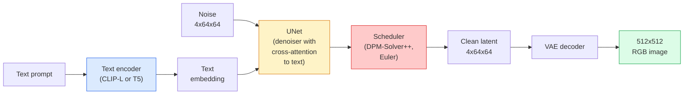

# التنشر المستقر  架构与精细调节

> التوزيع المستقر هو نوع من DDPM ، وهو يعمل في الفضاء الخفيف في VAE ، من خلال الانتباه المتقاطع 以文本为条件 ، باستخدام حلول ODE سريع التأكد 进行采样,并由指导免类器引导。

**Type:** Learn + Use
**Languages:** Python
**Prerequisites:** Phase 4 Lesson 10 (Diffusion), Phase 7 Lesson 02 (Self-Attention)
**Time:** ~75 分钟

## 學习目标
-  تتبع خط الأنابيب التوزيع المستقر الخمسة أجزاء: VAE ‬مؤشر النص ‬U-Net ‬مؤرخ ‬محقق الأمن، ومفهومة ما يفعلونه فعلياً
- شرح التوزيع المتخفي، وكذلك لماذا تدرب في 4x64x64 مساحة متخفية بدلا من تدريب في 3x512x512  الصورة على الصورة) يمكن أن تكون في حالة عدم فقدان الجودة سوف تقلل الحساب 48x
- استخدام `diffusers`生成图像,运行 الصورة إلى الصورة、إبداء والتحكمNet 引导的生成
- في مجموعة بيانات ذاتية التعرف على الصغر باستخدام LoRA تحسين التنظيم انتشار مستقيم ، واكتمال

## 问题
直接在 512x512 RGB 图像上训练 DDPM 成本很高. كل خطوة تدريبية يجب أن تمر عبر شبكة U-Net لإجراء التوزيع الخلفي، بينما هذا U-Net 看到 3x512x512 = 786,432 个输入值;采样也需要通过同一个 U-Net 进行 50+ 次 前进通过.

جعل النص الصور مفتوح الوزن أصبح عملي**latent diffusion**(Rombach et al., CVPR 2022) ―― تدريب VAE، سوف 3x512x512 图像映射到4x64x64  latente tensor 再映射回来,然后在这个 latente space 中做 Diffusion──计算量下降 `(3*512*512)/(4*64*64) = 48x`على نفس الجيبو، وقت الاختبار من بضعة عشرات الثواني إلى اثنين من الثواني

 تقريبا جميع نماذج إنتاج الصور الحديثة SDXL、SD3、FLUX、HunyuanDiT、Wan-Video هي نماذج انتشار غامضة، مجرد في المصفوفات السريعة٬Denoiser(U-Net أو DiT) ومتطلبات المقالة تغيراتها‬‬‬‬‬‬‬‬‬‬‬‬‬‬‬‬‬‬‬‬‬‬‬‬‬‬‬‬‬‬‬‬‬‬‬‬‬‬‬‬‬‬‬‬‬‬‬‬‬‬‬‬‬‬‬‬‬‬‬‬‬‬‬‬‬‬‬‬‬‬‬‬‬‬‬‬‬‬‬‬‬‬‬‬‬‬‬‬‬‬‬‬‬‬‬‬‬‬‬‬‬‬‬‬‬‬‬‬‬‬‬‬‬‬‬‬‬‬‬‬‬‬‬‬‬‬‬‬‬‬‬‬‬‬‬‬‬‬‬‬‬‬‬‬‬‬‬‬‬‬‬‬‬‬‬‬‬‬‬‬‬‬‬‬‬‬‬‬‬‬‬‬‬‬‬‬‬‬‬‬‬‬‬‬‬‬‬‬‬‬‬‬‬‬‬‬‬‬‬‬‬‬‬‬‬‬‬‬‬‬‬‬‬‬‬‬‬‬‬‬‬‬‬‬‬‬‬‬‬‬‬‬‬‬‬‬‬‬‬‬‬‬‬‬‬‬‬‬‬‬‬‬‬‬‬‬‬‬‬‬‬‬‬‬‬‬‬‬‬‬‬‬‬‬‬‬‬‬‬‬‬‬‬‬‬‬‬‬‬‬‬‬‬‬‬‬‬‬‬‬‬‬‬‬‬‬‬‬‬‬‬‬‬‬‬‬‬‬‬‬‬‬‬‬‬‬‬‬‬‬‬‬‬‬‬‬‬‬‬‬‬‬‬‬‬‬‬‬‬‬‬‬‬‬‬‬‬‬‬‬‬‬‬‬‬‬‬‬‬‬‬‬‬‬‬‬‬‬‬‬‬‬‬‬‬‬‬‬‬‬‬‬‬‬‬‬‬‬‬‬‬‬‬‬‬‬‬‬‬‬‬‬‬‬‬‬‬‬‬‬‬‬‬‬‬‬‬‬‬‬‬‬‬

## 概念
### خط الأنابيب



- **VAE** 结的自动编码器──Encoder 将图像转换为隐藏的(用于img2img 和训练)──Decoder 将隐藏的图像转回──
- **Text encoder** رمز نص CLIP ((SD 1.x/2.x)、CLIP-L + CLIP-G(SDXL) أو T5-XXL(SD3/FLUX)。
- **U-Net** denoiser‬‬‬‬‬‬‬‬‬‬‬‬‬‬‬‬‬‬‬‬‬‬‬‬‬‬‬‬‬‬‬‬‬‬‬‬‬‬‬‬‬‬‬‬‬‬‬‬‬‬‬‬‬‬‬‬‬‬‬‬‬‬‬‬‬‬‬‬‬‬‬‬‬‬‬‬‬‬‬‬‬‬‬‬‬‬‬‬‬‬‬‬‬‬‬‬‬‬‬‬‬‬‬‬‬‬‬‬‬‬‬‬‬‬‬‬‬‬‬‬‬‬‬‬‬‬‬‬‬‬‬‬‬‬‬‬‬‬‬‬‬‬‬‬‬‬‬‬‬‬‬‬‬‬‬‬‬‬‬‬‬‬‬‬‬‬‬‬‬‬‬‬‬‬‬‬‬‬‬‬‬‬‬‬‬‬‬‬‬‬‬‬‬‬‬‬‬‬‬‬‬‬‬‬‬‬‬‬‬‬‬‬‬‬‬‬‬‬‬‬‬‬‬‬‬‬‬‬‬‬‬‬‬‬‬‬‬‬‬‬‬‬‬‬‬‬‬‬‬‬‬‬‬‬‬‬‬‬‬‬‬‬‬‬‬‬‬‬‬‬‬‬‬‬‬‬‬‬‬‬‬‬‬‬‬‬‬‬‬‬‬‬‬‬‬‬‬‬‬‬‬‬‬‬‬‬‬‬‬‬‬‬‬‬‬‬‬‬‬‬‬‬‬‬‬‬‬‬‬‬‬‬‬‬‬‬‬‬‬‬‬‬‬‬‬‬‬‬‬‬‬‬‬‬‬‬‬‬‬‬‬‬‬‬‬‬‬‬‬‬‬‬‬‬‬‬‬‬‬‬‬‬‬‬‬‬‬‬‬‬‬‬‬‬‬‬‬‬‬‬‬‬‬‬‬‬‬‬‬‬‬‬‬‬‬‬‬‬‬‬‬‬‬‬‬‬‬‬‬‬‬‬‬‬‬‬‬‬‬‬‬‬‬‬‬‬‬‬‬‬‬‬‬‬‬‬‬‬‬‬‬‬‬‬‬‬‬‬‬‬‬‬‬‬‬‬‬‬‬‬‬‬‬‬‬‬‬‬‬‬‬‬‬‬‬‬‬‬‬‬‬‬‬‬‬
- **Scheduler** 采样算法(DDIM、Euler、DPM-Solver++) ・・・选择 sigmas,并将预测的噪音 混合回 latente──
- **Safety checker**可选的输出图像 NSFW / 非法内容过器──

### الإرشادات الخالية من التصنيف (CFG)

عادةً ما تكون هناك إشارة`c` 学习`epsilon_theta(x_t, t, c)` التدريب على شبكة واحدة، ولكن 10% من الوقت سيتم التخلي عنه `c`(بدلًا من إضافة الفضاء) ، حتى تحصل على نموذج واحد من الضوضاء المشروطة و غير المشروطة

```
eps = eps_uncond + w * (eps_cond - eps_uncond)
```

`w`إنها مقياس توجيه`w=0`غير مشروط`w=1`هو شروط عادي،`w>1`سوف تتمكن الصادرات من التقدم بسرعة أكبر                                                                                                                                                                                                                                                         `w=7.5`.

CFG هو النص إلى الصورة  يمكن أن تصل إلى جودة الإنتاج  بدونها، السرعة على التحركات المصدرة ضعيفة؛ إذا كان هناك، سوف السرعة تسيطر على 

### هندسة الفضاء المتخفية

لا يعد التشغيل المتخفي لـ 4 قنوات في VAE مجرد صورة بعد الضغط. إنه مجموعة متنوعة من بينها ، حيث يتم تحليل عمليات الحسابات بشكل كبير على نحو كبير.

نتائج:

1. **Img2img**= إعداد رمز الصورة كخفاء، إضافة جزء من الضجيج، تنفيذ الكشف، إعادة تشفير.
2. **Inpainting**= مقارنة مع img2img، ولكن المحدد فقط يجدد قناع 区域; غير قناع 区域保留为已编码的隐藏──

### بنية شبكة الإنترنت

SD U-Net هو النسخة الكبيرة من TinyUNet في الدروس 10، ورفعت إلى ثلاثة نقاط:

- على كلّ حلّ فضائيّ**Transformer blocks**، تتضمن الاهتمام الذاتي + الاهتمام المتبادل لتضمين النص
-                                                                                                                                                                                                                                                                                                                                                                                                                                                                                                                              **Time embedding**.
- المُرمّح والمُمَرّح في التّطابق بين القرارات**Skip connections**.

مجموع العناصر SD 1.5: حوالي 860M。SDXL: حوالي 2.6B。FLUX: حوالي 12B。 الزيادة في العناصر تأتي بشكل رئيسي من طبقة الاهتمام。

### تحديدات الحجم

للإنخفاض المستقر القيام بتحسين كامل  بحاجة إلى 20+ غيغابايت VRAM،并更新 860M 个参数。LoRA(Low-Rank Adaptation) للحفاظ على النموذج الأساسي 结،并向 Attention 层注入小型 رتبة-انهيار المصفوفات。 تستخدم SD لـ LoRA المعدل عادةً 10-50 MB، في وحدات استهلاك مستوى GPU 上练习 10-60 分钟، و عند الاستنتاج 时作为 drop-in تعديل 加载。

```
Original: W_q : (d_in, d_out)   frozen
LoRA:     W_q + alpha * (A @ B)   where A : (d_in, r), B : (r, d_out)

r is typically 4-32.
```

"لورا" هي طريقة تطور كل المجتمعات المتحركة تقريباً.

### المواعيد التي ستراها

- **DDIM** 确定性, حوالي 50 خطوة,简单――
- **Euler ancestral** 随机性,30-50 خطوة، نمط قليلا أكثر ابتكارا.
- **DPM-Solver++ 2M Karras** 确定性,20-30 خطوة,生产默认选择──
- **LCM / TCD / Turbo** نماذج التواصل و المتغيرات المقطوعة: 1-4 خطوات، ولكن سوف تضحي بالجزء من الجودة

في`diffusers`في بعض الأحيان لا تحتاج إلى أي إعادة تدريب


```figure
cv3-latent-compression
```

## بناءها
本课端到端使用 `diffusers`، بدلا من إعادة بناء التوزيع المستقر.

### الخطوة 1: النص إلى الصورة

```python
import torch
from diffusers import StableDiffusionPipeline

pipe = StableDiffusionPipeline.from_pretrained(
    "runwayml/stable-diffusion-v1-5",
    torch_dtype=torch.float16,
).to("cuda")

image = pipe(
    prompt="a dog riding a skateboard in tokyo, studio ghibli style",
    guidance_scale=7.5,
    num_inference_steps=25,
    generator=torch.Generator("cuda").manual_seed(42),
).images[0]
image.save("dog.png")
```

`float16`في حالة عدم وجود خسارة في الجودة، سيتم تقليل VRAM إلى النصف.`num_inference_steps=25`تأثيرات متساوية للاستخدام DDIM 时 `num_inference_steps=50`.

### 步骤 2: تغيير المجدول

```python
from diffusers import DPMSolverMultistepScheduler, EulerAncestralDiscreteScheduler

pipe.scheduler = DPMSolverMultistepScheduler.from_config(pipe.scheduler.config)
pipe.scheduler = EulerAncestralDiscreteScheduler.from_config(pipe.scheduler.config)
```

حالة المخطط مع أوزان U-Net 解── يمكنك في DDPM 上 التدريب، ثم باستخدام أي المخطط 采样──

### 步骤 3: صورة إلى صورة

```python
from diffusers import StableDiffusionImg2ImgPipeline
from PIL import Image

img2img = StableDiffusionImg2ImgPipeline.from_pretrained(
    "runwayml/stable-diffusion-v1-5",
    torch_dtype=torch.float16,
).to("cuda")

init_image = Image.open("dog.png").convert("RGB").resize((512, 512))
out = img2img(
    prompt="a dog riding a skateboard, oil painting",
    image=init_image,
    strength=0.6,
    guidance_scale=7.5,
).images[0]
```

`strength`تعبر عن عدد الضوضاء التي يجب أن تضمها قبل التنفيذ.

### 步骤 4: التلوين

```python
from diffusers import StableDiffusionInpaintPipeline

inpaint = StableDiffusionInpaintPipeline.from_pretrained(
    "runwayml/stable-diffusion-inpainting",
    torch_dtype=torch.float16,
).to("cuda")

image = Image.open("dog.png").convert("RGB").resize((512, 512))
mask = Image.open("dog_mask.png").convert("L").resize((512, 512))

out = inpaint(
    prompt="a cat",
    image=image,
    mask_image=mask,
    guidance_scale=7.5,
).images[0]
```

الصور البيضاء في الداخل من القناع هي منطقة يجب إعادة إنتاجها.

### الخطوة 5: تحميل الحمولة

```python
pipe.load_lora_weights("sayakpaul/sd-lora-ghibli")
pipe.fuse_lora(lora_scale=0.8)

image = pipe(prompt="a village square in ghibli style").images[0]
```

`lora_scale`控制强度;0.0 = 无效,1.0 = 完整效果──`fuse_lora`سوف يرفع السرعة من خلال المعدل إلى الأوزان، ولكن سوف يمنع التغيير.`pipe.unfuse_lora()`.

### 步骤 6: تدريب (خطوط)

تدريب حقيقي لـ " لورا "`peft`أو`diffusers.training`中──大纲如下:

```python
# Pseudocode
for step, batch in enumerate(dataloader):
    images, prompts = batch
    latents = vae.encode(images).latent_dist.sample() * 0.18215

    t = torch.randint(0, num_train_timesteps, (batch_size,))
    noise = torch.randn_like(latents)
    noisy_latents = scheduler.add_noise(latents, noise, t)

    text_emb = text_encoder(tokenizer(prompts))

    pred_noise = unet(noisy_latents, t, text_emb)  # LoRA weights injected here

    loss = F.mse_loss(pred_noise, noise)
    loss.backward()
    optimizer.step()
```

只有 ماتريصات LoRA 会接收 Gradient;base U-Net、VAE 和 نص رمز تم تصميمها 结── استخدام حجم البطاقة 为 1 和 عند تحديد نقاط التراجع ، وهذا يمكن أن يناسب 8 جيجابايت VRAM──

## استخدمها
في الإنتاج، تحتاج فعلياً إلى اتخاذ قرارات هي:

- **Model family**:SD 1.5 تستخدم في المصدر المفتوح  مجتمع المزج ،SDXL تستخدم في أعلى ولاء ،SD3 / FLUX تستخدم في حالة الفن 和 صارمة الطلبات الترخيصية.
- **Scheduler**:20-30 خطوات استخدام DPM-Solver++ 2M Karras؛ عندما التأخير 低于 1s 时使用 LCM-LoRA。
- **Precision**0480/4090 上 استخدام `float16`,A100 及更新设备上使用 `bfloat16`,VRAM 紧张时使用 `int8`(مرافقة `bitsandbytes`أو`compel`(‬)
- **Conditioning**:普通文本可用; إذا كان هناك حاجة إلى المزيد من التحكم، في خط الأنابيب الأساسي 之上加入ControlNet(canny、depth、pose)

لإنتاج الكمية`AUTO1111`- لا ، لا`ComfyUI`هو أدوات مجتمعية ؛ لإنتاج API, استخدام `diffusers`+ `accelerate`, أو استخدام مع TensorRT تجميع `optimum-nvidia`.

## 交付 it
本课产出:

- `outputs/prompt-sd-pipeline-planner.md` إرسال سريع، وفقا لحدد الميزانية المتأخرة ‧ هدف الوفاء ومقيد الترخيص  اختيار SD 1.5 / SDXL / SD3 / FLUX، فضلا عن المخطط والدقة‬
- `outputs/skill-lora-training-setup.md` مهارة، تستخدم لتحديد مجموعة بياناتها الخاصة لصياغة إعدادات تدريبية كاملة لـ LoRA، بما في ذلك العناوين العلوية، والرتب، وحجم المجموعة، وتيرة التعلم.

## التدريب
1. **(Easy)**استخدام `[1, 3, 5, 7.5, 10, 15]`وسط`guidance_scale`生成同一个提示──描述图像如何变化──在哪个指导价值开始出现文物?
2. **(Medium)**اختر أي صور حقيقية`[0.2, 0.4, 0.6, 0.8, 1.0]``strength`     `StableDiffusionImg2ImgPipeline`运行―― أي قوة يمكن أن تحتفظ في تغيير النمط في نفس الوقت؟ لماذا 1.0 سوف تتجاهل تماما الإدخال؟
3. **(Hard)**استخدام موضوع واحد ((物、logo、角色) من 10-20 张 الصورة تدريب لورا، وتوليد يحتوي على المشهد الجديد للموضوع.

## 关键术语
| Term | What people say | What it actually means |
|------|----------------|----------------------|
| Latent diffusion | “在 latents 中 diffuse” | 在 VAE latent space（4x64x64）而不是 pixel space（3x512x512）中运行整个 DDPM；节省 48x 计算量 |
| VAE scale factor | “0.18215” | 将 VAE 的原始 latent 重新缩放到大致 unit variance 的常数；硬编码在每个 SD pipeline 中 |
| Classifier-free guidance | “CFG” | 混合 conditional 和 unconditional noise predictions；影响最大的 inference knob |
| Scheduler | “Sampler” | 将 noise + model predictions 转换为 denoised latent trajectory 的算法 |
| LoRA | “Low-rank adapter” | 小型 rank-decomposition matrices，可在不触碰 base weights 的情况下 fine-tune Attention 层 |
| Cross-attention | “Text-image attention” | 从 latent tokens 到 text tokens 的 Attention；在每个 U-Net 层级注入 prompt 信息 |
| ControlNet | “Structure conditioning” | 一个单独训练的 adapter，用额外输入（canny、depth、pose、segmentation）引导 SD |
| DPM-Solver++ | “默认 scheduler” | 二阶确定性 ODE solver；在低 step counts（20-30）下拥有最佳质量（2026 年） |

## 延伸阅读
- [High-Resolution Image Synthesis with Latent Diffusion (Rombach et al., 2022)](https://arxiv.org/abs/2112.10752) انتشار مستقر 论文; يتضمن دليل على أن كل إزالة من التصميم معقولة
- [Classifier-Free Diffusion Guidance (Ho & Salimans, 2022)](https://arxiv.org/abs/2207.12598) CFG 论文
- [LoRA: Low-Rank Adaptation of Large Language Models (Hu et al., 2021)](https://arxiv.org/abs/2106.09685) LoRA في البداية تستخدم في NLP؛ فإنه تقريبا لا حاجة إلى تعديل عند انتقالها إلى SD
- [diffusers documentation](https://huggingface.co/docs/diffusers) كل خط أنابيب SD / SDXL / SD3 / FLUX
