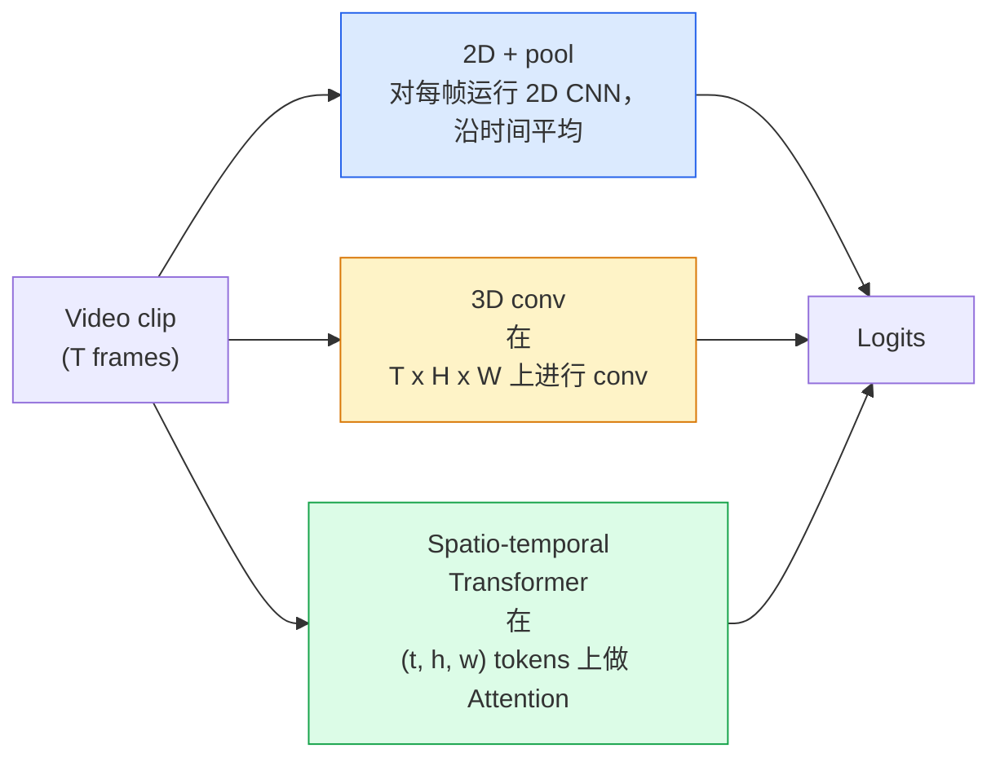

# الفيديو الفهم  时间建模

> 视频 هو سلسلة من الصور، بالإضافة إلى تشكيلها للقوانين الفيزيائية التي تنطوي عليها. كل نموذج فيديو يجب أن ينظر إلى الوقت كمحور إضافي.

**类型：**学习 + 构建
**语言：**بايثون
**先修要求：**المرحلة 4 الدروس 03(CNNs) ،المرحلة 4 الدروس 04(تصنيف الصورة)
**时间：**45 دقيقة

## 學习目标

- 区分三种主要视频建模方法(2D+pool、3D conv、空间-temporal Transformer) ، و توقع انخفاضها على التكلفة والحدد
- في PyTorch تنفيذ عينة الإطار والتجميع الزمني، فضلا عن تصنيف خط أساسي 2D + المجم
- 解释为什么 I3D 的膨胀3D内核 能很好从 ImageNet 重量 迁移,以及分数化 (2+1)D conv 的不同之处
- فهم مجموعة بيانات المعيارية للتعرف على الإجراءات مع المعايير:Kinetics-400/600、UCF101、Something-Something V2; مستوى المقطع والفيديو

## 问题

فيديو واحد 30 ثانية 、30 فص في الثانية يحتوي على 900 صورة ٬ ببساطة ، تصنيف الفيديو هو أن تنفذ تصنيف الصور 900 مرة ، ثم تقوم بعمل مجموعة من نوعها٬ عندما تكون هذه الحركة فعالة تقريبا في كل مرة ، فإن هذه الطريقة فعالة ٬

السؤال الأساسي لكل بنية فيديو هو:هيكل زمني في أي وقت أو في أي طريقة يتم بناؤه؟ والجواب يحدد كل شيء آخر، بما في ذلك حساب التكاليف والتدريب الاستراتيجيات، ما إذا كان من الممكن إعادة استخدام أوزان ImageNet، وكذلك ما هي الموديل التي سيتم تدريبها على مجموعات البيانات.

هذا المرحلة قصيرة من المرحلة الصورة الحالي.

## مفهوم الأساسي

### ثلاث فئة



### 2D + حوض السباحة

取一个2D CNN(ResNet、EfficientNet、ViT) 在每个采样上独立运行它──对每的嵌入做平均(或最大pool,或注意pool)──将聚向量输入分类器──

优点:
- يمكن أن يُتحرك الموقع مباشرة
- 实现最简单――
- 便宜:T  * 单张图像 الاستنتاج تكلفة

缺点:
- 无法建模运动──عمل = جمع المظاهر──
- التجميع المؤقت غير حساس للترتيبات، الباب المفتوح والباب المغلق يبدو متشابها.

适用场景: لظهور كمهمة رئيسية 小视频数据集上的转移学习、初始基线――

### التحولات الثلاثية الأبعاد

لنقوم بتبديل أجزاء 2D (H, W) إلى أجزاء 3D (T, H, W) 网络同时在空间和时间进行 conv──早期家族包括:C3D、I3D、SlowFast──

I3D 技巧: خذ نموذج ImageNet 2D مسبقًا ، وسوف يقوم كل جوهر 2D 沿新时间轴复制, తద్لا 膨胀──a 3x3 2D conv 变成 3x3x3 3D conv──这让 3D model 拥有强大的预训练重量,而不是从零开始训练──

优点:
- 直接建模 تحرك
- التضخم الثالث الأبعاد  تزويد بالتعلم المجانى للتحويل

缺点:
- 比对应的2D模型多 T/8的FLOPs ((مقصدة النواة الزمنية 为 3、堆叠 3 次的情况) ]]
- النواة الزمنية 很小;长程 motion 需要 الهرم أو طريقة التيار المزدوج ◊

适用场景:التحرك هو التعرف على الإشارة للعمل ((شيء-شيء V2、 يحتوي على الكثير من الفئات الحركية الثقيلة)

### 时空 محولات

将视频 Tokenize 成空间-time patches 网格, و بين جميع اللقطات 做 Attention──TimeSformer、ViViT、Video Swin、VideoMAE──

أشكال الاهتمام المهمة:
- **Joint**في (ت، ه، و) 上做一次大注意──对 `T*H*W`تعقيد ثاني مرتين
- **Divided**كل بلاك إصطناع اثنين من الاهتمام: مرة على طول الوقت، مرة على طول الفضاء.
- **Factorised**الاهتمام بالوقت والهواء يتبادلان بين الكتل

优点:
- في جميع المعايير الرئيسية، يصل إلى دقة SOTA.
- 通過 إصلاح التضخم من الصورة Transformers(ViT)迁移。
- 通過 الاهتمام النادر  دعم الفيديو طويل السياق

缺点:
- 计算需求高──
- يجب أن تختار بعناية نمط الاهتمام، وإلا فترة تشغيل سوف تتضخم

适用场景:大数据集、高保真 الفيديو فهم、مجموعة متنوعة من المهام الفيديو+نصية。

### أخذ عينات الإطار

في كليف 10 ثواني ٬ 30 في الثانية يوجد 300  ؛ قم بإدخال كل 300  إلى أي نموذج فهي ضائعة للغاية٬

- **Uniform sampling** 在片中均选取 T ──2D+pool 的默认选择──
- **Dense sampling** 随机连续 T-frame window──3D convs 中常见,因为 motion 需要相邻──
- **Multi-clip** من نفس الفيديو تمتلك العديد من نوافذ الإطار التي،分分类، ومختبرات توقعات متوسط

عادة تصل إلى 8、16、32 أو 64。 T أعلى = 更多 إشارة زمنية، ويعني أيضا المزيد من الحسابات‬‬‬‬‬‬‬‬‬‬‬‬‬‬‬‬‬‬‬‬‬‬‬‬‬‬‬‬‬‬‬‬‬‬‬‬‬‬‬‬‬‬‬‬‬‬‬‬‬‬‬‬‬‬‬‬‬‬‬‬‬‬‬‬‬‬‬‬‬‬‬‬‬‬‬‬‬‬‬‬‬‬‬‬‬‬‬‬‬‬‬‬‬‬‬‬‬‬‬‬‬‬‬‬‬‬‬‬‬‬‬‬‬‬‬‬‬‬‬‬‬‬‬‬‬‬‬‬‬‬‬‬‬‬‬‬‬‬‬‬‬‬‬‬‬‬‬‬‬‬‬‬‬‬‬‬‬‬‬‬‬‬‬‬‬‬‬‬‬‬‬‬‬‬‬‬‬‬‬‬‬‬‬‬‬‬‬‬‬‬‬‬‬‬‬‬‬‬‬‬‬‬‬‬‬‬‬‬‬‬‬‬‬‬‬‬‬‬‬‬‬‬‬‬‬‬‬‬‬‬‬‬‬‬‬‬‬‬‬‬‬‬‬‬‬‬‬‬‬‬‬‬‬‬‬‬‬‬‬‬‬‬‬‬‬‬‬‬‬‬‬‬‬‬‬‬‬‬‬‬‬‬‬‬‬‬‬‬‬‬‬‬‬‬‬‬‬‬‬‬‬‬‬‬‬‬‬‬‬‬‬‬‬‬‬‬‬‬‬‬‬‬‬‬‬‬‬‬‬‬‬‬‬‬‬‬‬‬‬‬‬‬‬‬‬‬‬‬‬‬‬‬‬‬‬‬‬‬‬‬‬‬‬‬‬‬‬‬‬‬‬‬‬‬‬‬‬‬‬‬‬‬‬‬‬‬‬‬‬‬‬‬‬‬‬‬‬‬‬‬‬‬‬‬‬‬‬‬‬‬‬‬‬‬‬‬‬‬‬‬‬‬‬‬‬‬‬‬‬‬‬‬‬‬‬‬‬‬‬‬‬‬‬‬‬‬‬‬‬‬‬‬‬‬‬‬‬‬‬‬‬‬‬‬‬‬‬‬‬‬‬‬‬‬‬‬

### التقييم

درجة:
- **Clip-level accuracy** 模型看到一个T-frame clip, تقرير top-k。
- **Video-level accuracy** توقعات مستوى المقاطع لكل مقطع فيديو  متوسط؛ أعلى وأكثر استقرارا ً

始终报告两者──一个得分为78%剪辑 / 82%视频模型高度依赖测试时间平均;一个得分为80% / 81%模型在每剪辑上更强──

### المجموعة التي ستقابلها

- **Kinetics-400 / 600 / 700** مجموعة بيانات العمل通用──400K مقاطع؛ عناوين URL YouTube(很多现在已失效)──
- **Something-Something V2** بواسطة الحركة 定义的行动(تحريك X من اليسار إلى اليمين)
- **UCF-101**.**HMDB-51** 更老、更小, ولكن لا يزال يتم الإبلاغ عنها
- **AVA** في الفضاء والزمان العمل *الوطنيات*;من الصعب تصنيفها


```figure
v4-video-temporal
```

## بناءها

### 步骤 1: عينة الإطار

适用于表列表或视频器) 和 密样剂的均和样本

```python
import numpy as np

def sample_uniform(num_frames_total, T):
    if num_frames_total <= T:
        return list(range(num_frames_total)) + [num_frames_total - 1] * (T - num_frames_total)
    step = num_frames_total / T
    return [int(i * step) for i in range(T)]


def sample_dense(num_frames_total, T, rng=None):
    rng = rng or np.random.default_rng()
    if num_frames_total <= T:
        return list(range(num_frames_total)) + [num_frames_total - 1] * (T - num_frames_total)
    start = int(rng.integers(0, num_frames_total - T + 1))
    return list(range(start, start + T))
```

وكلنا نعود`T`مؤشرات، تستخدم لقطع الفيديو التنسور

### الخطوة 2: خط أساس 2D + حوض

في كل يوم من خلال 2D ResNet-18، ميزات المجموعة المتوسطة، ثم فصيلة

```python
import torch
import torch.nn as nn
from torchvision.models import resnet18, ResNet18_Weights

class FramePool(nn.Module):
    def __init__(self, num_classes=400, pretrained=True):
        super().__init__()
        weights = ResNet18_Weights.IMAGENET1K_V1 if pretrained else None
        backbone = resnet18(weights=weights)
        self.features = nn.Sequential(*(list(backbone.children())[:-1]))  # global avg pool kept
        self.head = nn.Linear(512, num_classes)

    def forward(self, x):
        # x: (N, T, 3, H, W)
        N, T = x.shape[:2]
        x = x.view(N * T, *x.shape[2:])
        feats = self.features(x).view(N, T, -1)
        pooled = feats.mean(dim=1)
        return self.head(pooled)

model = FramePool(num_classes=10)
x = torch.randn(2, 8, 3, 224, 224)
print(f"output: {model(x).shape}")
print(f"params: {sum(p.numel() for p in model.parameters()):,}")
```

في المهام التي تبدو ثقيلة، هذا القاعدة عادة ما تكون أقل من 5 إلى 10 نقاط من النماذج الثلاثية الأبعاد الحقيقية، وأحيانا أفضل، لأنه يستعمل العمود الفقري الصلبة الصلبة الصلبة الصلبة الصناعية.

### 步骤 3: ملفات 3D المضخمة على الطراز I3D

通過 طول الوقت الجديد محور重复 الوزن، سوف واحد 2D ملفات  تحويل إلى 3D ملفات 

```python
def inflate_2d_to_3d(conv2d, time_kernel=3):
    out_c, in_c, kh, kw = conv2d.weight.shape
    weight_3d = conv2d.weight.data.unsqueeze(2)  # (out, in, 1, kh, kw)
    weight_3d = weight_3d.repeat(1, 1, time_kernel, 1, 1) / time_kernel
    conv3d = nn.Conv3d(in_c, out_c, kernel_size=(time_kernel, kh, kw),
                        padding=(time_kernel // 2, conv2d.padding[0], conv2d.padding[1]),
                        stride=(1, conv2d.stride[0], conv2d.stride[1]),
                        bias=False)
    conv3d.weight.data = weight_3d
    return conv3d

conv2d = nn.Conv2d(3, 64, kernel_size=3, padding=1, bias=False)
conv3d = inflate_2d_to_3d(conv2d, time_kernel=3)
print(f"2D weight shape:  {tuple(conv2d.weight.shape)}")
print(f"3D weight shape:  {tuple(conv3d.weight.shape)}")
x = torch.randn(1, 3, 8, 56, 56)
print(f"3D output shape:  {tuple(conv3d(x).shape)}")
```

إضافة إلى`time_kernel`سوف يجعل حجم التفعيل كبير الاحتفاظ بالبقاء غير متغير ، وهذا مهم جدا لا تدمير أول إحصاءات النظام المشترك في الانتشار الاولى

### 步骤 4:معدل (2+1)

لتحويل المجموعة الثلاثية الأبعاد إلى 2D ((مكونة فضائية) و 1D ((مكونة زمنية))

```python
class Conv2Plus1D(nn.Module):
    def __init__(self, in_c, out_c, kernel_size=3):
        super().__init__()
        mid_c = (in_c * out_c * kernel_size * kernel_size * kernel_size) \
                // (in_c * kernel_size * kernel_size + out_c * kernel_size)
        self.spatial = nn.Conv3d(in_c, mid_c, kernel_size=(1, kernel_size, kernel_size),
                                 padding=(0, kernel_size // 2, kernel_size // 2), bias=False)
        self.bn = nn.BatchNorm3d(mid_c)
        self.act = nn.ReLU(inplace=True)
        self.temporal = nn.Conv3d(mid_c, out_c, kernel_size=(kernel_size, 1, 1),
                                  padding=(kernel_size // 2, 0, 0), bias=False)

    def forward(self, x):
        return self.temporal(self.act(self.bn(self.spatial(x))))

c = Conv2Plus1D(3, 64)
x = torch.randn(1, 3, 8, 56, 56)
print(f"(2+1)D output: {tuple(c(x).shape)}")
```

شبكة R2+1D كاملة مثل شبكة ResNet-18 فقط قم بتبديل كل 3x3`Conv2Plus1D`.

## استخدمها

两个库覆盖生产级视频工作:

- `torchvision.models.video` R(2+1) D、MViT、Swin3D، مع معدات كيناتيكية مسبقة تدريبها.
- `pytorchvideo`(Meta)  نموذج الحيوانات 、 تستخدم كيناتيكس / SSv2 / AVA تحميل البيانات 、 تحويلات المعايير ‬

对于视觉语言视频模型(تصريحات الفيديو`transformers`(`VideoMAE`.`VideoLLaMA`.`InternVideo`(‬)

## 交付 it

本课会产出:

- `outputs/prompt-video-architecture-picker.md` إشارة واحدة، على أساس المظهر مقابل الحركة، حجم مجموعة البيانات و ميزانية الحسابات  اختيار 2D+بول / I3D / (2+1)D / محولها‬
- `outputs/skill-frame-sampler-auditor.md` مهارة، تستخدم للتحقق من عينات أنابيب الفيديو،并标记常见错误:`num_frames < T`时采样 不均、缺少 aspect-preserving crop 等──

## التدريب

1. **（简单）**计算 FramePool 在 T=8 时的FLOPs(近似值),并与 T=8 的 I3D-style 3D ResNet对比──说明为什么 2D+pool 便宜 3-5 倍──
2. **（中等）**生成合成视频数据集:随机小球朝随机方向移动,并按运动方向标注(左到右、右到左、斜向上)  在上面训练 FramePool──展示它的准确率接近随机水平,从而证明仅靠外观不足以完成运动任务──
3. **（困难）**通過將ResNet-18 中的每個 Conv2d 替换为 `Conv2Plus1D`، بناء R(2+1) D-18── باستخدام ImageNet-pretrained ResNet-18 نفخة الأول من مجموعات الوزن── في التدريب 2 مجموعة بيانات الحركة 上 тренинг,并超过 FramePool──

## 关键术语

| Term | 人们常说 | 实际含义 |
|------|----------------|----------------------|
| 2D + pool | “Per-frame classifier” | 在每个采样帧上运行 2D CNN，跨时间 average-pool features，然后分类 |
| 3D convolution | “Spatio-temporal kernel” | 在 (T, H, W) 上进行 conv 的 kernel；可以原生建模 motion |
| Inflation | “Lift 2D weights to 3D” | 通过沿新的时间轴重复 2D conv 的 weights 来初始化 3D conv weights，然后除以 kernel_T 以保持 activation scale |
| (2+1)D | “Factorised conv” | 将 3D 拆成 2D spatial + 1D temporal；参数更少，中间多一个非线性 |
| Divided attention | “Time then space” | 每层有两次 Attention 的 Transformer block：一次在同一帧的 tokens 上，一次在同一位置的 tokens 上 |
| Clip | “T-frame window” | T 帧的采样子序列；video model 消费的单位 |
| Clip vs video accuracy | “Two eval settings” | Clip = 每个视频一个 sample，video = 对多个 sampled clips 取平均 |
| Kinetics | “The ImageNet of video” | 400-700 个 action classes，300k+ YouTube clips，标准 video pretraining corpus |

## 延伸阅读

- [I3D: Quo Vadis, Action Recognition (Carreira & Zisserman, 2017)](https://arxiv.org/abs/1705.07750)  طرحت التضخم و مجموعة بيانات السرعة
- [R(2+1)D: A Closer Look at Spatiotemporal Convolutions (Tran et al., 2018)](https://arxiv.org/abs/1711.11248) المجموعات المفصلة، حتى الآن لا تزال قائمة قوية
- [TimeSformer: Is Space-Time Attention All You Need? (Bertasius et al., 2021)](https://arxiv.org/abs/2102.05095) أول مُحول فيديو قوي
- [VideoMAE (Tong et al., 2022)](https://arxiv.org/abs/2203.12602) باستخدام فيديو من قبل التدريب على التشغيل الآلي المُغطاة؛ وصفة التدريب المُباشر الحالية
