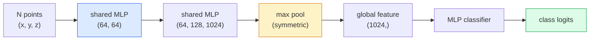

# رؤية ثلاثية الأبعاد  غيول نقطة & NeRFs

> رؤية ثلاثية الأبعاد لها شكلين. السحابة النقطية هي المخرج الأصلي للشاشة.

**类型：**تعلم + بناء
**语言：**بايثون
**先修：**المرحلة 4 دروس 03 (CNNs) ، المرحلة 1 دروس 12 (عمليات التنسور)
**时间：**45 دقيقة

## 學习目标
- 区分显式(قطة سحابة、شبكة、صوت) و隐式(المجال المسافة الموقعة、NeRF) 3D التمثيلات، ومفهوم المشهد الملائم لها
- فهم وظيفة نقطة النت: كيف يجعل شبكة العصبية لقطات غير مرتبة لديها نوعية غير متغيرة
-  تتبع نيفر إلى الأمام: إلقاء الأشعة  التصوير الحجمي  تشفير الموقف  كثافة MLP + رأس اللون
- استخدام `nerfstudio`أو`instant-ngp`بناء على صورة صغيرة تحمل وضعية إجراء إعادة بناء ثلاثي الأبعاد

## 问题
الكاميرا  توليد صورة ثنائية الأبعاد。LIDAR  توليد مجموعة من نقاط ثلاثية الأبعاد دون ترتيب。هيكل من خط الأنابيب الحركة  توليد نقطة مفتاح ثلاثية الأبعاد النادرة سحابة。NeRF يمكن من عدد قليل من الصور التي تحمل وضع إعادة بناء مشهد ثلاثي الأبعاد كامل。 كل هذه تنتمي إلى vision، ولكن لا تشبه سي إن إن ‬ ‬ ‬ ‬ ‬ ‬ ‬ ‬ ‬ ‬ ‬ ‬ ‬ ‬ ‬ ‬ ‬ ‬ ‬ ‬ ‬ ‬ ‬ ‬ ‬ ‬ ‬ ‬ ‬ ‬ ‬ ‬ ‬ ‬ ‬ ‬ ‬ ‬ ‬ ‬ ‬ ‬ ‬ ‬ ‬ ‬ ‬ ‬ ‬ ‬ ‬ ‬ ‬ ‬ ‬ ‬ ‬ ‬ ‬ ‬ ‬ ‬ ‬ ‬ ‬ ‬ ‬ ‬ ‬ ‬ ‬ ‬ ‬ ‬ ‬ ‬ ‬ ‬ ‬ ‬ ‬ ‬ ‬ ‬ ‬ ‬ ‬ ‬ ‬ ‬ ‬ ‬ ‬ ‬ ‬ ‬ ‬ ‬ ‬ ‬ ‬ ‬ ‬ ‬ ‬ ‬ ‬ ‬ ‬ ‬ ‬ ‬ ‬ ‬ ‬ ‬ ‬ ‬ ‬ ‬ ‬ ‬ ‬ ‬ ‬ ‬ ‬ ‬ ‬ ‬ ‬ ‬ ‬ ‬ ‬ ‬ ‬ ‬ ‬ ‬ ‬ ‬ ‬ ‬ ‬ ‬ ‬ ‬ ‬ ‬ ‬ ‬ ‬ ‬ ‬ ‬ ‬ ‬ ‬ ‬ ‬ ‬ ‬ ‬ ‬ ‬ ‬ ‬ ‬ ‬ ‬ ‬ ‬ ‬ ‬ ‬ ‬ ‬ ‬ ‬ ‬ ‬ ‬ ‬ ‬ ‬ ‬ ‬ ‬ ‬ ‬ ‬ ‬ ‬ ‬ ‬ ‬ ‬ ‬ ‬ ‬ ‬ ‬ ‬ 

رؤية 3D مهمة جداً ، لأن جميع مهام الروبوتات ذات القيمة العالية تقريباً تعمل في 3D: التقاط ، تجنب العقبات ، الملاحة ، حجب AR ، التقاط محتوى 3D.

هذه النوعين من التمثيلات لأسباب مختلفة. تساهم في استنتاج السحابة النقطية. هي مستشعر 免费给你东西.

## 概念
### غيول نقطة

سحابة النقاط هي مجموعة غير مرتبة من R^3 中 N 个点, كل نقطة يمكن اختياره لها ميزات ((ألوان  كثافة  طبيعية) 

```
cloud = [
  (x1, y1, z1, r1, g1, b1),
  (x2, y2, z2, r2, g2, b2),
  ...
  (xN, yN, zN, rN, gN, bN),
]
```

لا شبكة، لا اتصال.

- **Permutation invariance** 输出不能依赖点的顺序──
- **Variable N** نموذج واحد 必须能够处理不同大小的云──

نقطة النقطة (Qi et al., 2017) باستخدام فكرة واحدة حل اثنين: على كل نقطة تطبيق مشترك MLP، ثم باستخدام وظيفة متساوية ((ماكس بوليد) جمعها.

```
f(P) = max_{p in P} MLP(p)
```

هذا هو الجوهر بأكمله من نقطة النت.

### بنية نقطة الشبكة



مشاركة MLP تعني نفس MLP 独立地运行在每个点上──为了效率,通常实现为沿点维度的1x1 conv──

### حقل الإشعاع العصبي (Neural Radiance Fields)

نيرف (ميلدنهول وآخرون، 2020) طرحوا السؤال:  هل يمكننا من N 张照片 إعادة بناء مشهد ثلاثي الأبعاد؟ جوابها هو: باستخدام شبكة عصبية نفسها هي مشهد.`(x, y, z, viewing_direction)`映射到 `(density, colour)`染新视角就是 حلقة إلقاء الأشعة حول الشبكة

```
NeRF MLP:  (x, y, z, theta, phi) -> (sigma, r, g, b)

To render a pixel (u, v) of a new view:
  1. Cast a ray from the camera through pixel (u, v)
  2. Sample points along the ray at distances t_1, t_2, ..., t_N
  3. Query the MLP at each point
  4. Composite the colours weighted by (1 - exp(-sigma * dt))
  5. The sum is the rendered pixel colour
```

سوف يُـتَصَوّرُ الصورة المُـخَسَّرَة بـ "الـ"بـ"بـ"بـ"ب"ب"ب"ب"ب"ب"ب"ب"ب"ب"ب"ب"ب"ب"ب"ب"ب"ب"ب"ب"ب"ب"ب"ب"ب"ب"ب"ب"ب"ب"ب"ب"ب"ب"ب"ب"ب"ب"ب"ب"ب"ب"ب"ب"ب"ب"ب"ب"ب"ب"ب"ب"ب"ب"ب"ب"ب"ب"ب"ب"ب"ب"ب"ب"ب"ب"ب"ب"ب"ب"ب"ب"ب"ب"ب"ب"ب"ب"ب"ب"ب"ب"ب"ب"ب"ب"ب"ب"ب"ب"ب"ب"ب"ب"ب"ب"ب"ب"ب"ب"ب"ب"ب"ب"ب"ب"ب"ب"ب"ب"ب"ب"ب"ب"ب"ب"ب"ب"ب"ب"ب"ب"ب"ب"ب"ب"ب"ب"ب"ب"ب"ب"ب"ب"ب"ب"ب"ب"ب"ب"ب"ب"ب"ب"ب"ب"ب"ب"ب"ب"ب"ب"ب"ب"ب"ب"ب"ب"ب"ب"ب"ب"ب"ب"ب"ب"ب"ب"ب"ب"ب "ب"ب"ب "ب"ب"ب"ب "ب"ب"ب "ب"ب "ب"ب"ب "ب"ب "ب"ب "ب "ب "ب"ب "ب"ب "ب "ب "ب"ب"ب "ب "ب "ب "ب"ب"ب "ب "ب "ب "ب "ب "ب" ب "ب "ب "ب "ب "ب "ب "ب "ب "ب "ب" ب "ب "ب "ب "ب "ب "ب "ب "ب "ب "ب "ب

### التشفير الموضعي في NeRF

作用在 `(x, y, z)`الملفات المعدنية المعدنية المعدنية المعدنية المعدنية المعدنية المعدنية المعدنية المعدنية المعدنية المعدنية المعدنية المعدنية المعدنية المعدنية المعدنية المعدنية المعدنية المعدنية المعدنية المعدنية المعدنية المعدنية المعدنية المعدنية المعدنية المعدنية المعدنية المعدنية المعدنية المعدنية المعدنية المعدنية المعدنية المعدنية المعدنية المعدنية المعدنية المعدنية المعدنية المعدنية المعدنية المعدنية المعدنية المعدنية المعدنية المعدنية المعدنية المعدنية المعدنية المعدنية المعدنية المعدنية المعدنية المعدنية المعدنية المعدنية المعدنية المعدنية المعدنية المعدنية المعدنية المعدنية المعدنية المعدنية المعدنية المعدنية المعدنية المعدنية المعدنية المعدنية المعدنية المعدنية المعدنية المعدنية المعدنية المعدنية المعدنية المعدنية المعدنية المعدنية المعدنية المعدنية المعدنية المعدنية المعدنية المعدنية المعدنية المعدنية المعدنية المعدنية المعدنية المعدنية المعدنية المعدنية المعدنية المعدنية المعدنية المعدنية المعدنية المعدنية المعدنية المعدنية المعدنية المعدنية المعدنية المعدنية المعدنية المعدنية المعدنية المعدنية المعدنية المعدنية المعدنية المعدنية المعدنية المعدنية المعدنية المعدنية المعدنية المعدنية المعدنية المعدنية المعدنية المعدنية المعدنية المعدنية المعدنية المعدنية المعدنية المعدنية المعدنية المعدنية المعدنية المعدنية المعدنية المعدنية المعدنية المعدنية المعدنية المعدنية المعدنية المعدنية المعدنية المعدنية المعدنية المعدنية المعدنية المعدنية المعدنية المعدنية المعدنية

```
gamma(p) = (sin(2^0 pi p), cos(2^0 pi p), sin(2^1 pi p), cos(2^1 pi p), ...)
```

أعلى إلى L=10 مستويات تردد. هذا هو نفس المهارات التي تستخدمها المحولات في المواقع. سوف تظهر مرة أخرى في تكييف وقت الانتشار.

### التسجيل الكمي

```
C(r) = sum_i T_i * (1 - exp(-sigma_i * delta_i)) * c_i

T_i  = exp(- sum_{j<i} sigma_j * delta_j)
delta_i = t_{i+1} - t_i
```

`T_i`هو الإرسال، وذلك يعني كمية الضوء يمكن أن تصل إلى نقطة`(1 - exp(-sigma_i * delta_i))`هو نقطة في الغموض`c_i`هو لونها. والبيكسل النهائي هو على طول شعاعها.

### ما الذي استبدل NRFs

純 NeRFs 訓練慢(数小时), 染也慢(每张图数秒)

- **Instant-NGP**(2022)  تشفير شبكة الهاش بدل مدخلات الموقف MLP؛数秒内完成训练──
- **Mip-NeRF 360** 处理 لا حدود لها مشاهد 和 مضادة للتحالف
- **3D Gaussian Splatting**(2023)  باستخدام ملايين من غوسيانات 3D بدل الحقل الكمي ؛ 數分钟训练,实时染──当前生产环境的默认选择──

2026 سنة تقريبا كل منتج حقيقي من NeRF  في الواقع هو 3D غوسيانة البثات ♡

### مجموعات البيانات ومعايير الموازنة

- **ShapeNet** وضع نماذج CAD ثلاثية الأبعاد  كمغاليات نقطة  إجراء التصنيف و التقسيم
- **ScanNet** باستخدام الفحص الحقيقي للقطعات
- **KITTI** تستخدم في السيارات ذاتية القيادة خارج أجهزة LIDAR نقطة السحب
- **NeRF Synthetic**- لا ، لا**Blended MVS** باستخدام مجموعات بيانات الصور الموضحة لتركيب الرؤية
- **Mip-NeRF 360**مجموعة بيانات  مشاهد حقيقية غير محدودة‬


```figure
nerf-rays
```

## بناءها
### الخطوة 1: تصنيف PointNet

```python
import torch
import torch.nn as nn

class PointNet(nn.Module):
    def __init__(self, num_classes=10):
        super().__init__()
        self.mlp1 = nn.Sequential(
            nn.Conv1d(3, 64, 1),    nn.BatchNorm1d(64),   nn.ReLU(inplace=True),
            nn.Conv1d(64, 64, 1),   nn.BatchNorm1d(64),   nn.ReLU(inplace=True),
        )
        self.mlp2 = nn.Sequential(
            nn.Conv1d(64, 128, 1),  nn.BatchNorm1d(128),  nn.ReLU(inplace=True),
            nn.Conv1d(128, 1024, 1), nn.BatchNorm1d(1024), nn.ReLU(inplace=True),
        )
        self.head = nn.Sequential(
            nn.Linear(1024, 512),   nn.BatchNorm1d(512),  nn.ReLU(inplace=True),
            nn.Dropout(0.3),
            nn.Linear(512, 256),    nn.BatchNorm1d(256),  nn.ReLU(inplace=True),
            nn.Dropout(0.3),
            nn.Linear(256, num_classes),
        )

    def forward(self, x):
        # x: (N, 3, num_points) — transposed for Conv1d
        x = self.mlp1(x)
        x = self.mlp2(x)
        x = torch.max(x, dim=-1)[0]       # (N, 1024)
        return self.head(x)

pts = torch.randn(4, 3, 1024)
net = PointNet(num_classes=10)
print(f"output: {net(pts).shape}")
print(f"params: {sum(p.numel() for p in net.parameters()):,}")
```

حوالي 1.6 مليون مبرمجها. كل سحابة تعمل على 1,024 نقطة.

### 步骤 2: تشفير المواقع

```python
def positional_encoding(x, L=10):
    """
    x: (..., D) -> (..., D * 2 * L)
    """
    freqs = 2.0 ** torch.arange(L, dtype=x.dtype, device=x.device)
    args = x.unsqueeze(-1) * freqs * 3.141592653589793
    sinc = torch.cat([args.sin(), args.cos()], dim=-1)
    return sinc.reshape(*x.shape[:-1], -1)

x = torch.randn(5, 3)
y = positional_encoding(x, L=10)
print(f"input:  {x.shape}")
print(f"encoded: {y.shape}     # (5, 60)")
```

乘以 `2^l * pi`سوف تحصل على ترددات أعلى تدريجياً

### الخطوة الثالثة: نيرف صغير

```python
class TinyNeRF(nn.Module):
    def __init__(self, L_pos=10, L_dir=4, hidden=128):
        super().__init__()
        self.L_pos = L_pos
        self.L_dir = L_dir
        pos_dim = 3 * 2 * L_pos
        dir_dim = 3 * 2 * L_dir
        self.trunk = nn.Sequential(
            nn.Linear(pos_dim, hidden), nn.ReLU(inplace=True),
            nn.Linear(hidden, hidden),  nn.ReLU(inplace=True),
            nn.Linear(hidden, hidden),  nn.ReLU(inplace=True),
            nn.Linear(hidden, hidden),  nn.ReLU(inplace=True),
        )
        self.sigma = nn.Linear(hidden, 1)
        self.color = nn.Sequential(
            nn.Linear(hidden + dir_dim, hidden // 2), nn.ReLU(inplace=True),
            nn.Linear(hidden // 2, 3), nn.Sigmoid(),
        )

    def forward(self, x, d):
        x_enc = positional_encoding(x, self.L_pos)
        d_enc = positional_encoding(d, self.L_dir)
        h = self.trunk(x_enc)
        sigma = torch.relu(self.sigma(h)).squeeze(-1)
        rgb = self.color(torch.cat([h, d_enc], dim=-1))
        return sigma, rgb

nerf = TinyNeRF()
x = torch.randn(128, 3)
d = torch.randn(128, 3)
s, c = nerf(x, d)
print(f"sigma: {s.shape}   rgb: {c.shape}")
```

مقارنة مع النفط النووي الأصلي ((( يوجد 2 个深度为 8 من جذوع MLP)

### 步骤 4: التسجيل الكمي على طول شعاع

```python
def volumetric_render(sigma, rgb, t_vals):
    """
    sigma: (..., N_samples)
    rgb:   (..., N_samples, 3)
    t_vals: (N_samples,) distances along the ray
    """
    delta = torch.cat([t_vals[1:] - t_vals[:-1], torch.full_like(t_vals[:1], 1e10)])
    alpha = 1.0 - torch.exp(-sigma * delta)
    trans = torch.cumprod(torch.cat([torch.ones_like(alpha[..., :1]), 1.0 - alpha + 1e-10], dim=-1), dim=-1)[..., :-1]
    weights = alpha * trans
    rendered = (weights.unsqueeze(-1) * rgb).sum(dim=-2)
    depth = (weights * t_vals).sum(dim=-1)
    return rendered, depth, weights


N = 64
t_vals = torch.linspace(2.0, 6.0, N)
sigma = torch.rand(N) * 0.5
rgb = torch.rand(N, 3)
rendered, depth, weights = volumetric_render(sigma, rgb, t_vals)
print(f"rendered colour: {rendered.tolist()}")
print(f"depth:           {depth.item():.2f}")
```

واحد شعاع، 64 عينة، مع تصبح pixel RGB و عمق واحد

## استخدمها
تستخدم في العمل الحقيقي:

- `nerfstudio`(Tancik et al.)  当前用于 NeRF / Instant-NGP / Gaussian Splatting 的参考图书馆──命令行加网观看者──
- `pytorch3d`(ميتا)  تقديم التفريق  خدمات السحابة البدنية  عمليات الشبكة
- `open3d` معالجة السحابة النقطية ‬التسجيل‬التصور‬‬‬‬‬‬‬‬‬‬‬‬‬‬‬‬‬‬‬‬‬‬‬‬‬‬‬‬‬‬‬‬‬‬‬‬‬‬‬‬‬‬‬‬‬‬‬‬‬‬‬‬‬‬‬‬‬‬‬‬‬‬‬‬‬‬‬‬‬‬‬‬‬‬‬‬‬‬‬‬‬‬‬‬‬‬‬‬‬‬‬‬‬‬‬‬‬‬‬‬‬‬‬‬‬‬‬‬‬‬‬‬‬‬‬‬‬‬‬‬‬‬‬‬‬‬‬‬‬‬‬‬‬‬‬‬‬‬‬‬‬‬‬‬‬‬‬‬‬‬‬‬‬‬‬‬‬‬‬‬‬‬‬‬‬‬‬‬‬‬‬‬‬‬‬‬‬‬‬‬‬‬‬‬‬‬‬‬‬‬‬‬‬‬‬‬‬‬‬‬‬‬‬‬‬‬‬‬‬‬‬‬‬‬‬‬‬‬‬‬‬‬‬‬‬‬‬‬‬‬‬‬‬‬‬‬‬‬‬‬‬‬‬‬‬‬‬‬‬‬‬‬‬‬‬‬‬‬‬‬‬‬‬‬‬‬‬‬‬‬‬‬‬‬‬‬‬‬‬‬‬‬‬‬‬‬‬‬‬‬‬‬‬‬‬‬‬‬‬‬‬‬‬‬‬‬‬‬‬‬‬‬‬‬‬‬‬‬‬‬‬‬‬‬‬‬‬‬‬‬‬‬‬‬‬‬‬‬‬‬‬‬‬‬‬‬‬‬‬‬‬‬‬‬‬‬‬‬‬‬‬‬‬‬‬‬‬‬‬‬‬‬‬‬‬‬‬‬‬‬‬‬‬‬‬‬‬‬‬‬‬‬‬‬‬‬‬‬‬‬‬‬‬‬‬‬‬‬‬‬‬‬‬‬‬‬‬‬‬‬‬‬‬‬‬‬‬‬‬‬‬‬‬‬‬‬‬‬‬‬‬‬‬‬‬‬‬‬‬‬‬‬‬‬‬‬‬‬‬‬‬‬‬‬‬‬‬‬‬‬‬‬‬‬‬‬‬‬‬‬‬‬‬‬‬‬‬‬‬‬‬

تم استبدال البث الثلاثي الأبعاد الغاسية بشكل أساسي لـ NeRFs النقي ، لأنه يتنشر بسرعة 100 倍.

## 交付 it
本课产出:

- `outputs/prompt-3d-task-router.md` عرض، سيتم بناء على المهمة و بيانات المدخلة 路由到合适的3D تمثيل  نقطة سحابة شبكة  فوكسل  NeRF  غوسيان splat)
- `outputs/skill-point-cloud-loader.md`مهارة، لتحرير بيتورش`Dataset`,حمّل .ply / .pcd / .xyz 文件,并 إجراء طبيعة صحيحة, مركز و عينات النقاط

## التدريب
1. **（Easy）**证明PointNet is permutation-invariant:将同一个云 运行两次,一次保持原顺序,一次打乱点――验证输出除了浮点噪声 之外完全相同──
2. **（Medium）**实现一个最小射线生成函数:给定摄像机内在和姿势,为 H x W الصورة كل بيكسل 生成射线起源和方向──
3. **（Hard）**في المجموعة المقدمة من البيانات الصناعية التدريب على TinyNeRF ((يمكن من خلال التعبير المميز أو البصمة البسيطة العرض التتبع 生成)

## 关键术语
| Term | 人们常说 | 实际含义 |
|------|----------------|----------------------|
| Point cloud | “来自 LIDAR 的 3D points” | 无序的 (x, y, z) 集合 + 每个点可选的 features |
| PointNet | “第一个用于 point clouds 的 neural net” | 每个点一个 shared MLP + symmetric (max) pool；结构上天然 permutation-invariant |
| NeRF | “本身就是 scene 的 MLP” | 将 (x, y, z, dir) 映射到 (density, colour) 的 network；通过 ray casting 渲染 |
| Positional encoding | “Fourier features” | 将每个 coordinate 编码为多个 frequencies 下的 sin/cos，以克服 MLP 的低频偏置 |
| Volumetric rendering | “Ray integration” | 使用 transmittance 和 alpha 将 ray 上的 samples 合成为单个 pixel |
| Instant-NGP | “Hash-grid NeRF” | 用 multi-resolution hash grid 替换 NeRF 的 coordinate MLP；快 100-1000 倍 |
| 3D Gaussian splatting | “数百万个 Gaussians” | Scene = 3D Gaussians 的集合；实时渲染，数分钟训练 |
| SDF | “Signed distance field” | 返回到最近 surface 的 signed distance 的 function；另一种 implicit representation |

## 延伸阅读
- [PointNet (Qi et al., 2017)](https://arxiv.org/abs/1612.00593) تصنيف لغيرات التغيير
- [NeRF (Mildenhall et al., 2020)](https://arxiv.org/abs/2003.08934) 让从照片进行3D重建 成为神经网络问题 的论文
- [Instant-NGP (Müller et al., 2022)](https://arxiv.org/abs/2201.05989)شبكات الهاشش، 1000 倍加速
- [3D Gaussian Splatting (Kerbl et al., 2023)](https://arxiv.org/abs/2308.04079) في الإنتاج استبدال معمارة NeRFs
