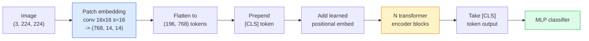

# تحويلات الرؤية (ViT)

> "أقطع الصورة إلى ملصقات، ووضع كل ملصقة في كلمة واحدة، ونشغل المعيار المحول"."لا تتراجع للنظر"".

**类型：**الإنشاء
**语言：**بايثون
**前置要求：**المرحلة 7 الدروس 02 (الاهتمام الذاتي) ، المرحلة 4 الدروس 04 (تصنيف الصورة)
**时间：**45 دقيقة

## 學习目标

- من التطبيق التشغيلي التشغيلي التشغيلي التشغيلي التشغيلي التشغيلي التشغيلي التشغيلي التشغيلي التشغيلي التشغيلي التشغيلي
- ‬ ‬ ‬ ‬ ‬ ‬ ‬ ‬ ‬ ‬ ‬ ‬ ‬ ‬ ‬ ‬ ‬ ‬ ‬ ‬ ‬ ‬ ‬ ‬ ‬ ‬ ‬ ‬ ‬ ‬ ‬ ‬ ‬ ‬ ‬ ‬ ‬ ‬ ‬ ‬ ‬ ‬ ‬ ‬ ‬ ‬ ‬ ‬ ‬ ‬ ‬ ‬ ‬ ‬ ‬ ‬ ‬ ‬ ‬ ‬ ‬ ‬ ‬ ‬ ‬ ‬ ‬ ‬ ‬ ‬ ‬ ‬ ‬ ‬ ‬ ‬ ‬ ‬ ‬ ‬ ‬ ‬ ‬ ‬ ‬ ‬ ‬ ‬ ‬ ‬ ‬ ‬ ‬ ‬ ‬ ‬ ‬ ‬ ‬ ‬ ‬ ‬ ‬ ‬ ‬ ‬ ‬ ‬ ‬ ‬ ‬ ‬ ‬ ‬ ‬ ‬ ‬ ‬ ‬ ‬ ‬ ‬ ‬ ‬ ‬ ‬ ‬ ‬ ‬ ‬ ‬ ‬ ‬ ‬ ‬ ‬ ‬ ‬ ‬ ‬ ‬ ‬ ‬ ‬ ‬ ‬ ‬ ‬ ‬ ‬ ‬ ‬ ‬ ‬ ‬ ‬ ‬ ‬ ‬ ‬ ‬ ‬ ‬ ‬ ‬ ‬ ‬ ‬ ‬ ‬ ‬ ‬ ‬ ‬ ‬ ‬ ‬ ‬ ‬ ‬ ‬ ‬ ‬ ‬ ‬ ‬ ‬ ‬ ‬ ‬ ‬ ‬ ‬ ‬ ‬ ‬ ‬ ‬ ‬ ‬ ‬ ‬ ‬ ‬ ‬ ‬ ‬ ‬ ‬ ‬ ‬ ‬ ‬ ‬ ‬ ‬ ‬ ‬ ‬ ‬ ‬ ‬ ‬ ‬ ‬ ‬ ‬ ‬ ‬ ‬ ‬ ‬ ‬ ‬ ‬ ‬ ‬ ‬ ‬ ‬ ‬ ‬ ‬ ‬ ‬ ‬ ‬ ‬ ‬ ‬ ‬ ‬ ‬ ‬ ‬
- من المنظورات التجارية التجارية التجارية التجارية التجارية التجارية التجارية التجارية التجارية التجارية التجارية التجارية التجارية التجارية التجارية التجارية التجارية التجارية التجارية التجارية التجارية التجارية التجارية التجارية التجارية التجارية التجارية التجارية التجارية التجارية التجارية التجارية التجارية التجارية التجارية التجارية التجارية التجارية التجارية التجارية التجارية التجارية التجارية التجارية التجارية التجارية التجارية التجارية التجارية التجارية التجارية التجارية التجارية التجارية التجارية التجارية التجارية التجارية التجارية التجارية التجارية التجارية التجارية التجارية التجارية التجارية التجارية التجارية التجارية التجارية التجارية التجارية التجارية التجارية التجارية التجارية
- استخدام `timm`和标准 خطية-سؤال / تحديد دقيقة 流程,在小数据集上 تحديد دقيقة 预训练 ViT

## 问题

على مدى عشر سنوات، التحول 几乎就是同义词计算机视觉──CNN 具有强大的 التحيزات التحديدية، بما في ذلك المحلية、تسويق التساوي، لا أحد يعتقد أنك يمكن أن تحل محلها──随后 Dosovitskiy et al. (2020) 证明, a directly applied to showplane image patches of ordinary transformer, completely without using convolutional 机制, also can in scale sufficiently large enough to match even over the best CNN──

關鍵在於規模足夠大──在 ImageNet-1k 上,ViT 输给ResNet──先在 ImageNet-21k 或 JFT-300M 上预训练,再在 ImageNet-1k 上细调的 ViT 则超过它──当时的结论是:

حتى عام 2026، لا تزال هناك منافسة على جهازات الحافة على CNN خالصة.

## مفهوم الأساسي

### 流程



七个步骤──补丁 -> رموز -> الاهتمام -> تصنيف── كل变体(DeiT、Swin、ConvNeXt、MAE قبل التدريب)都只改变这七步中的一个两个,其余保持不变──

### إضافة المفاتيح

الأول من المكونات هو المفتاح. الكورينال الحجم 16، الخطوة 16، لذلك واحد 224x224 图像会变成 14x14 网格,由 16x16 اللقطات 组成, كل اللقطة تم إلقاء الصورة على 768-dim embedding.

```
Input:  (3, 224, 224)
Conv (3 -> 768, k=16, s=16, no padding):
Output: (768, 14, 14)
Flatten spatial: (196, 768)
```

196 معدل = 196 رمزا ً. . . . . . . . . . . . . . . . . . . . . . . . . . . . . . . . . . . . . . . . . . . . . . . . . . . . . . . . . . . . . . . . . . . . . . . . . . . . . . . . . . . . . . . . . . . . . . . . . . . . . . . . . . . . . . . . . . . . . . . . . . . . . . . . . . . . . . . . . . . . . . . . . . . . . . . . . . . . . . . . . . . . . . . . . . . . . . . . . . . . . . . . . . . . . . . . . . . . . . . . . . . . . . . . . . . . . . . . . . . . . . . . . . . . . . . . . . . . . . . . . . . . . . . . . . . . . . . . . . . . . . . . . . . . . . . . . . . . . . . . . . . . . . . . . . . . . . . . . . . . . . . . . . . . . . . . . . . . . . . . . . . . . . . . . . . . . . . . . . . . . . . . . . . . . . . . . . . . . . . . . . . . . . . . . . . . . . . . . . . . . . . . . . . . . . . . . . . . . . . . . . . . . . . . . . . . . . . . . . . . . . . . . . . . . . . . . . . . . . . . . . . . . . . . . . . . . . . . . . . . . . . . . . . . . . . . . . . . . . . . . . . . . . . . . . . . . . . . . . . . . .

### رمز الفئة

في المرتبة الأولى إضافة إلى متجه تعلم:

```
tokens = [CLS; patch_1; patch_2; ...; patch_196]   shape (197, 768)
```

بعد أن تمر بـ "بلوك" محول`[CLS]`الناتج هو كل صورة المظهر.

### إضافة موضعية

المحولات 没有内置的空间位置概念──为每一个代币加上一个学习向量:

```
tokens = tokens + learned_pos_embedding   (also shape (197, 768))
```

هذا التثبيت هو أحد المعلمات للموديل؛ تدريبات بناء على التدرج سوف تجعله يتلاءم مع 2D  الصورة الهيكل.

### حجر مُشفّر المحول

标准结构──تلبية الذات متعددة الرؤوس、MLP、الارتباطات المتبقية、الطبقة السابقة‬

```
x = x + MSA(LN(x))
x = x + MLP(LN(x))

MLP is two-layer with GELU: Linear(d -> 4d) -> GELU -> Linear(4d -> d)
```

في تي-بي 16  تراكم 12 كتلة من هذا القبيل، كل كتلة لديها 12 رأس الانتباه، إجمالي 86M المعلمات

### لماذا تستخدم قبل LN

早期 transformers 使用 بعد LN(`x = LN(x + sublayer(x))`في حالة عدم وجود تدفئة، فإن التدريب يتجاوز 6-8 مستويات يصعب جدا.`x = x + sublayer(LN(x))`يمكن أن تستمر في تدريب شبكات أعمق دون الحرارة.

### حجم اللصقة 权衡

- 16 × 16 ملصقات -> 196 رمزا، معيار تعيين
- 32x32 اللقطات -> 49 رموز، أسرع ولكن القرار أقل
- 8×8 المفاتيح -> 784 رموز، أكثر تحديدا، ولكن O(n^2) التكلفة الاهتمام 扩展性很差──

أكثر مساحات أكبر = أقل رموز = أسرع ولكن التفاصيل الفضائية أقل。SwinV2 تستخدم في النوافذ الهيرواركية معطيات 4x4。

### DeiT في ImageNet-1k 上 тренинг ViT

始 ViT 需要 JFT-300M 才能超过 CNN──DeiT(Touvron et al., 2020) فقط باستخدام ImageNet-1k،就通过四项改动把 ViT-B 训练到81.8% top-1:

1. زيادة ثقيلة: زيادة عشوائية、خلاط、قطع الميشان、حذف عشوائية‬
2. عمق استوكاستيكي ((التدريب)
3. التكثيف المتكرر ((المثل الصورة في كل دفعة 中采样 3 次)
4. من معلم سي أن ان  إجراء التطهير 可选,会进一步提升精度)

كلّ تكوينات تدريبية حديثة من "ديت".

### سوين مقابل كونفنيكس

- **Swin**(Liu et al., 2021)   على أساس الاهتمام النافذة  كل بلاك فقط في النافذة المحلية لإجراء الاهتمام ؛ تبادل الكتل 会移动 window ، حتى عبر النوافذ 混合信息‬ ‬ في الوقت نفسه الاحتفاظ بالاهتمام عامل ، إعادة إدخال مثل موقع CNN ‬
- **ConvNeXt**(Liu et al., 2022)  重新设计的CNN,匹配 Swin 的架构选择(عمقًا convs、LayerNorm、GELU、عقد الزجاجة المعاكسة) 

في عام 2026، كونفنيكست-V2 و سوين-V2 都是生产级选择;正确选择取决于你的推理堆(كونفنيكست 更适合边缘 编译) وهيئة التدريب المسبق。

### التدريب المسبق

المُخترع الآلي المُغطّس (He et al., 2022):随机 mask 75% من المُصَلَحات، تمرّد المُخترع فقط معالجة 25% من المُبدو، إعادة التدريب على المُخترع الصغير، وفقاً لمخرج المُخترع 重建被 mask 的 المُصَلَحات.

MAE 让 ViT فقط باستخدام ImageNet-1k يمكن تدريبها ، لتحقيق SOTA ، و هو حالياً默认的自我监督配方.


```figure
batchnorm-inference
```

## بناءها

### الخطوة 1: إضافة الملفات

```python
import torch
import torch.nn as nn

class PatchEmbedding(nn.Module):
    def __init__(self, in_channels=3, patch_size=16, dim=192, image_size=64):
        super().__init__()
        assert image_size % patch_size == 0
        self.proj = nn.Conv2d(in_channels, dim, kernel_size=patch_size, stride=patch_size)
        num_patches = (image_size // patch_size) ** 2
        self.num_patches = num_patches

    def forward(self, x):
        x = self.proj(x)
        return x.flatten(2).transpose(1, 2)
```

واحد مُتَحَلّف، واحد مسطح، واحد نقل. هذا هو الصورة الكاملة إلى الرموز.

### 步骤 2: كتلة المحول

الاهتمام الذاتي المتعدد الرأس من قبل LN 带 GELU MLP  اتصالات بقية

```python
class Block(nn.Module):
    def __init__(self, dim, num_heads, mlp_ratio=4, dropout=0.0):
        super().__init__()
        self.ln1 = nn.LayerNorm(dim)
        self.attn = nn.MultiheadAttention(dim, num_heads, dropout=dropout, batch_first=True)
        self.ln2 = nn.LayerNorm(dim)
        self.mlp = nn.Sequential(
            nn.Linear(dim, dim * mlp_ratio),
            nn.GELU(),
            nn.Dropout(dropout),
            nn.Linear(dim * mlp_ratio, dim),
            nn.Dropout(dropout),
        )

    def forward(self, x):
        a, _ = self.attn(self.ln1(x), self.ln1(x), self.ln1(x), need_weights=False)
        x = x + a
        x = x + self.mlp(self.ln2(x))
        return x
```

`nn.MultiheadAttention`负责拆分头, 规模点产品和输出投影――`batch_first=True`، لذلك الأشكال هي `(N, seq, dim)`.

### 步骤 3: في

```python
class ViT(nn.Module):
    def __init__(self, image_size=64, patch_size=16, in_channels=3,
                 num_classes=10, dim=192, depth=6, num_heads=3, mlp_ratio=4):
        super().__init__()
        self.patch = PatchEmbedding(in_channels, patch_size, dim, image_size)
        num_patches = self.patch.num_patches
        self.cls_token = nn.Parameter(torch.zeros(1, 1, dim))
        self.pos_embed = nn.Parameter(torch.zeros(1, num_patches + 1, dim))
        self.blocks = nn.ModuleList([
            Block(dim, num_heads, mlp_ratio) for _ in range(depth)
        ])
        self.ln = nn.LayerNorm(dim)
        self.head = nn.Linear(dim, num_classes)
        nn.init.trunc_normal_(self.pos_embed, std=0.02)
        nn.init.trunc_normal_(self.cls_token, std=0.02)

    def forward(self, x):
        x = self.patch(x)
        cls = self.cls_token.expand(x.size(0), -1, -1)
        x = torch.cat([cls, x], dim=1)
        x = x + self.pos_embed
        for blk in self.blocks:
            x = blk(x)
        x = self.ln(x[:, 0])
        return self.head(x)

vit = ViT(image_size=64, patch_size=16, num_classes=10, dim=192, depth=6, num_heads=3)
x = torch.randn(2, 3, 64, 64)
print(f"output: {vit(x).shape}")
print(f"params: {sum(p.numel() for p in vit.parameters()):,}")
```

حوالي 2.8M المعلمات، يمكن معالجتها في CPU فوق صغيرة ViT.`dim=768, depth=12, num_heads=12`.

### الخطوة 4: التحقق من الصحة العقلية

```python
logits = vit(torch.randn(1, 3, 64, 64))
print(f"logits: {logits}")
print(f"probs:  {logits.softmax(-1)}")
```

应该能无错运行──احتمالات 总和为 1──

## استخدمها

`timm`提供了所有 ViT 变体及其 ImageNet المميزة المسبقة.

```python
import timm

model = timm.create_model("vit_base_patch16_224", pretrained=True, num_classes=10)
```

`timm`هو 2026 عام من تحويلات الرؤية إنتاج الاختيار المخصص. انها في نفس API أسفل دعم ViT、DeiT、Swin、Swin-V2、ConvNeXt、ConvNeXt-V2、MaxViT、MViT、EfficientFormer و العشرات من النماذج الأخرى.

对于多模式 工作(صورة + نص)`transformers`提供 CLIP、SigLIP、BLIP-2、LLaVA── كل من ملفات تصويري هذه النماذج هي نوع من التغيرات في التلفزيون.

## 交付 it

本课会产出:

- `outputs/prompt-vit-vs-cnn-picker.md` إشارة، وفقاً لـ حجم مجموعة البيانات ‬حساب و كومبيوتر الإستنتاجات، في فيت‬ConvNeXt أو Swin ‬‬‬‬‬‬‬‬‬‬‬‬‬‬‬‬‬‬‬‬‬‬‬‬‬‬‬‬‬‬‬‬‬‬‬‬‬‬‬‬‬‬‬‬‬‬‬‬‬‬‬‬‬‬‬‬‬‬‬‬‬‬‬‬‬‬‬‬‬‬‬‬‬‬‬‬‬‬‬‬‬‬‬‬‬‬‬‬‬‬‬‬‬‬‬‬‬‬‬‬‬‬‬‬‬‬‬‬‬‬‬‬‬‬‬‬‬‬‬‬‬‬‬‬‬‬‬‬‬‬‬‬‬‬‬‬‬‬‬‬‬‬‬‬‬‬‬‬‬‬‬‬‬‬‬‬‬‬‬‬‬‬‬‬‬‬‬‬‬‬‬‬‬‬‬‬‬‬‬‬‬‬‬‬‬‬‬‬‬‬‬‬‬‬‬‬‬‬‬‬‬‬‬‬‬‬‬‬‬‬‬‬‬‬‬‬‬‬‬‬‬‬‬‬‬‬‬‬‬‬‬‬‬‬‬‬‬‬‬‬‬‬‬‬‬‬‬‬‬‬‬‬‬‬‬‬‬‬‬‬‬‬‬‬‬‬‬‬‬‬‬‬‬‬‬‬‬‬‬‬‬‬‬‬‬‬‬‬‬‬‬‬‬‬‬‬‬‬‬‬‬‬‬‬‬‬‬‬‬‬‬‬‬‬‬‬‬‬‬‬‬‬‬‬‬‬‬‬‬‬‬‬‬‬‬‬‬‬‬‬‬‬‬‬‬‬‬‬‬‬‬‬‬‬‬‬‬‬‬‬‬‬‬‬‬‬‬‬‬‬‬‬‬‬‬‬‬‬‬‬‬‬‬‬‬‬‬‬‬‬‬‬‬‬‬‬‬‬‬‬‬‬‬‬‬‬‬‬‬‬‬‬‬‬‬‬‬‬‬‬‬‬‬‬‬‬‬‬‬‬‬‬‬‬‬‬‬‬‬‬‬‬‬‬‬‬‬‬‬‬‬‬‬‬‬‬‬‬‬‬‬‬‬‬‬‬‬
- `outputs/skill-vit-patch-and-pos-embed-inspector.md` مهارة، لتحقق من إدراج اللمسات في التلفزيونات و أشكال إدراج المواقع يتناسب مع طول تسلسل ما يتوقع النموذج، والقبض على أكثر الأخطاء شيوعا في عملية النقل

## التدريب

1. **（Easy）**打印上小型 ViT 中一次 前进传的每一个中间子形――确认:input `(N, 3, 64, 64)`-> المزقات`(N, 16, 192)`-> مع CLS `(N, 17, 192)`-> إدخال المصنف `(N, 192)`-> الخروج `(N, num_classes)`.
2. **（Medium）**في الدروس الرابعة من المادة الإصطناعية-CIFAR إحصائيات على تحسينات دقيقة تدريب`timm`• التأقلم على شبكة ResNet-18 على نفس البيانات
3. **（Hard）**لـ ViT 实现 MAE قبل التدريب: 75% من المفاتيح القناع، تدريب المشفير + واحد decoder لتعديل بناء المفاتيح القناع.

## 关键术语

| Term | 人们常说 | 实际含义 |
|------|----------------|----------------------|
| Patch embedding | “第一个 conv” | kernel size = stride = patch size 的 conv；将图像转换为 token embeddings 的网格 |
| Class token | “[CLS]” | 加在 token sequence 前面的 learned vector；它的最终 output 是全局图像表示 |
| Positional embedding | “Learned pos” | 添加到每个 token 上的 learned vector，让 transformer 知道每个 patch 来自哪里 |
| Pre-LN | “LayerNorm before sublayer” | 稳定的 transformer 变体：使用 `x + sublayer(LN(x))`，而不是 `LN(x + sublayer(x))` |
| Multi-head attention | “Parallel attention” | 标准 transformer attention，被拆分为 num_heads 个独立子空间，之后再 concatenated |
| ViT-B/16 | “Base, patch 16” | 规范尺寸：dim=768、depth=12、heads=12、patch_size=16、image=224；约 86M params |
| DeiT | “Data-efficient ViT” | 只用 ImageNet-1k 并配合强 augmentation 训练的 ViT；证明大型 pretraining datasets 并非绝对必要 |
| MAE | “Masked autoencoder” | Self-supervised pretraining：mask 75% 的 patches 并重建；主流 ViT pretraining 配方 |

## 延伸阅读

- [An Image is Worth 16x16 Words (Dosovitskiy et al., 2020)](https://arxiv.org/abs/2010.11929) ViT 论文
- [DeiT: Data-efficient Image Transformers (Touvron et al., 2020)](https://arxiv.org/abs/2012.12877)كيفية استخدام ImageNet-1k لتدريب ViT
- [Masked Autoencoders are Scalable Vision Learners (He et al., 2022)](https://arxiv.org/abs/2111.06377) MAE 预训练
- [timm documentation](https://huggingface.co/docs/timm) المستندات المرجعية لكل محول الرؤية المستخدمة في الإنتاج
