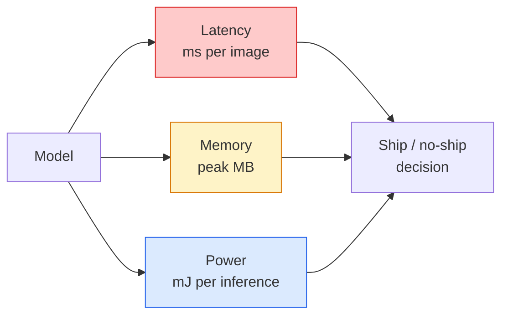

# رؤية في الوقت الحقيقي  边缘部署

> استنتاج الحافة هو جعل نموذج دقة 90 على جهاز ذو RAM 2 جيجابايت فقط يعمل على 30 فبكس.

**Type:** Learn + Build
**Languages:** Python
**Prerequisites:** Phase 4 Lesson 04 (Image Classification), Phase 10 Lesson 11 (Quantization)
**Time:** ~75 minutes

## 學习目标
- 测量任意 PyTorch model 的推理延迟、峰值 ذاكرة 和 throughput,并读懂 FLOPs / Params / latency 之间的权衡
- استخدام PyTorch's بعد تدريب الكمية سوف النموذج الرؤية قياس إلى INT8،并验证 فقدان الدقة < 1%
- 导出到ONNX,并使用ONNX Runtime或TensorRT 编译;说出三种最常见的导出失败原因及其修复方式
- 解释在边缘 约束下何时选择 MobileNetV3、EfficientNet-Lite、ConvNeXt-Tiny أو MobileViT

## 问题
نموذج الرؤية في مرحلة التدريب عادةً ما يكون نقطة عائمة 巨兽──100M المعلمات٬ كل مرّة إلى الأمام 10 GFLOPs、2 GB VRAM── كلّها لا يمكن أن يتمّ تحميلها في الهاتف المحمول٬ وحدة المعلومات والترفيه في السيارات٬ وحدة الصناعة أو الطائرة بدون طيار٬ وتسليم نظام الرؤية، مما يعني وضع نفس القدرة التنبؤية في ميزانية صغيرة بنسبة 100 مرة.

عمل من ثلاثة حلقات: اختيار النموذج (استخدام نفس الوصفة من بنية أصغر) √ كمية (استخدام INT8 بدل FP32) وموجب الوقت الدوران (ONNX Runtime √ TensorRT、Core ML、TFLite) √

في هذا الدراسة، يجب أن يكون هناك تأديب قياس (القياس غير ممكن، لا يمكن تحسينه) ، ثم يجب أن يكون هناك تفسير للثلاثة حلقات.

## 概念
### ثلاثة ميزانيات



- **Latency**:p50、p95、p99── فقط انظر p50  متوسط القيمة سوف تغطي أنظمة الوقت الحقيقي 
- **Peak memory**: أهم قيمة أجهزة قد رأيتها من قبل، وليس متوسط حالة ثابتة.
- **Power / energy**: الميلليوجولات من الإستنتاجات في كل مرة على جهاز إمدادات الكهرباء الكهربائية.

الحافة  قرار يعتمد على واحد (النموذج، التأخير، الذاكرة، الدقة) 表── كل واحد من الجهاز يجب أن يكون على جهاز الهدف 上测量, وليس على محطة العمل 上──

### تأديب القياس

كل مرة على ملف الحافة يجب أن تتبع ثلاثة قواعد:

1. في قياس قبل استخدام 5-10 مرات الدمومية المقدمة**Warm up**النموذج::::::::::::::::::::::::::::::::::::::::::::::::::::::::::::::::::::::::::::::::::::::::::::::::::::::::::::::::::::::::::::::::::::::::::::::::::::::::::::::::::::::::::::::::::::::::::::::::::::::::::::::::::::::::::::::::::::::::::::::::::::::::::::::::::::::::::::::::::::::::::::::::::::::::::::::::::::::::::::::::::::::::::::::::::::::::::::::::::::::::::::::::::::::::::::::::::::::::::::::::::::::::::::::::::::::::::::::::::::::::::::::::::::::::::::::::::::::::::::::::::::::::::::::::::::::::::
2. في المقطع التوقيتية 前后用 `torch.cuda.synchronize()` **Synchronise**عبء عمل GPU──否则你测到是核发射,而不是核执行──
3. ستقوم بحجم المدخلات**Fix**إلى قرار الإنتاج ∙ 224 × 224 العمرة العليا ليس 512 × 512 العمرة العليا ∙

### FLOPs  كوكيل

فلوبز (بالإنجليزية: FLOPs) هو نوع من عمليات النقاط المتحركة للتخمينات غير المرتبطة بالجهاز. إنها مناسبة لمقارنة مع الهندسة المعمارية، ولكن كجوار الحائط الحالي سوف يحدث خطأ.

规则: استخدام FLOPs القيام باحث الهندسة المعمارية، استخدام التأخير على الجهاز اتخاذ قرارات النشر.

### الكمية 一段话说明

استخدام INT8 بدل فب32 الوزن 和 التفعيلات。 حجم النموذج قل 4x، عرض النطاق التذاكر قل 4x، في الحساب على الأجهزة التي تحتوي على أجزاء من أوراق INT8 قل 2-4x(جميع أجهزة SoC الحديثة٬所有带 Tensor Cores 的 NVIDIA GPU)  المهام الرؤية فقدان دقة العلوي عادة 0.1-1 个百分点، باستخدام بعد التدريب الكميات ثابتة 即可达到──

类型:

- **Dynamic**                                                                                                                                                                                                                                                              
- **Static (post-training)** 量化 weights, ووضع مجموعة تحديدات صغيرة 上校准 تفعيل المراحل──比 ديناميكي 快得多──
- **Quantisation-aware training (QAT)** في أثناء التدريب، تمثيل الكمية، دع النموذج تعلم التكيف معها.

بالنسبة للرؤية، فإنّ الاستفادة من الكميات الدقيقة بعد التدريب باستخدام 5% من حجم العمل تحصل على 95% من المكاسب.

### الحصص والتحلية

- **Pruning** 移除不重要重量 (→ مقياس الكبيرة) أو القنوات (→ بنية)  للنموذجات المفرطة من المعايير 很有效; للهياكل التي أصبحت ضيقة جدا استخدامها مقارنة مع الصغرى.
- **Distillation** 訓練一個小學生 去模仿大師的logits──通常能恢复缩小模型 后损失的大部分精度──生产边缘模型的标准做法──

### أوقات تشغيل الإستثمار

- **PyTorch eager** 慢,不适合部署── فقط للتطوير──
- **TorchScript** إرثها‬‬已被`torch.compile`و ONNX تصدير 取代
- **ONNX Runtime** 中立运行时间──CPU、CUDA、CoreML、TensorRT、OpenVINO 都有 ONNX مزودي──从这里开始──
- **TensorRT** محفز NVIDIA.‬‬‬‬‬‬‬‬‬‬‬‬‬‬‬‬‬‬‬‬‬‬‬‬‬‬‬‬‬‬‬‬‬‬‬‬‬‬‬‬‬‬‬‬‬‬‬‬‬‬‬‬‬‬‬‬‬‬‬‬‬‬‬‬‬‬‬‬‬‬‬‬‬‬‬‬‬‬‬‬‬‬‬‬‬‬‬‬‬‬‬‬‬‬‬‬‬‬‬‬‬‬‬‬‬‬‬‬‬‬‬‬‬‬‬‬‬‬‬‬‬‬‬‬‬‬‬‬‬‬‬‬‬‬‬‬‬‬‬‬‬‬‬‬‬‬‬‬‬‬‬‬‬‬‬‬‬‬‬‬‬‬‬‬‬‬‬‬‬‬‬‬‬‬‬‬‬‬‬‬‬‬‬‬‬‬‬‬‬‬‬‬‬‬‬‬‬‬‬‬‬‬‬‬‬‬‬‬‬‬‬‬‬‬‬‬‬‬‬‬‬‬‬‬‬‬‬‬‬‬‬‬‬‬‬‬‬‬‬‬‬‬‬‬‬‬‬‬‬‬‬‬‬‬‬‬‬‬‬‬‬‬‬‬‬‬‬‬‬‬‬‬‬‬‬‬‬‬‬‬‬‬‬‬‬‬‬‬‬‬‬‬‬‬‬‬‬‬‬‬‬‬‬‬‬‬‬‬‬‬‬‬‬‬‬‬‬‬‬‬‬‬‬‬‬‬‬‬‬‬‬‬‬‬‬‬‬‬‬‬‬‬‬‬‬‬‬‬‬‬‬‬‬‬‬‬‬‬‬‬‬‬‬‬‬‬‬‬‬‬‬‬‬‬‬‬‬‬‬‬‬‬‬‬‬‬‬‬‬‬‬‬‬‬‬‬‬‬‬‬‬‬‬‬‬‬‬‬‬‬‬‬‬‬‬‬‬‬‬‬‬‬‬‬‬‬‬‬‬‬‬‬‬‬‬‬‬‬‬‬‬‬‬‬‬‬‬‬‬‬‬‬‬‬‬‬‬‬‬‬‬‬‬‬‬‬‬‬‬‬‬‬‬‬‬‬‬‬‬‬‬‬‬‬‬‬‬‬‬‬‬‬‬‬‬‬‬‬‬‬‬
- **Core ML** وقت تشغيل أوبل iOS / macOS ∙`.mlmodel`أو`.mlpackage`.
- **TFLite** وقت تشغيل جوجل للاندرويد / أرم.`.tflite`.
- **OpenVINO** وقت تشغيل CPU / VPU من Intel.`.xml`+ `.bin`.

实践中:export PyTorch -> ONNX -> 为 هدف 选择 runtime。ONNX 是 lingua franca。

### محركات تحديد المعماريات

| Budget | Model | Why |
|--------|-------|-----|
| < 3M params | MobileNetV3-Small | 到处都能编译，是很好的 baseline |
| 3-10M | EfficientNet-Lite-B0 | TFLite 上每 param 的 accuracy 最好 |
| 10-20M | ConvNeXt-Tiny | accuracy-per-param 最好，且 CPU-friendly |
| 20-30M | MobileViT-S or EfficientViT | 具备 ImageNet accuracy 的 Transformer |
| 30-80M | Swin-V2-Tiny | 如果 stack 支持 window attention |

ما لم يكن هناك سبب واضح لعدم القيام بذلك، وإلا قم بتقييم كل هذه المواد إلى INT8


```figure
cnn-param-count
```

## بناءها
### الخطوة 1: صحيح قياس التأخير

```python
import time
import torch

def measure_latency(model, input_shape, device="cpu", warmup=10, iters=50):
    model = model.to(device).eval()
    x = torch.randn(input_shape, device=device)
    with torch.no_grad():
        for _ in range(warmup):
            model(x)
        if device == "cuda":
            torch.cuda.synchronize()
        times = []
        for _ in range(iters):
            if device == "cuda":
                torch.cuda.synchronize()
            t0 = time.perf_counter()
            model(x)
            if device == "cuda":
                torch.cuda.synchronize()
            times.append((time.perf_counter() - t0) * 1000)
    times.sort()
    return {
        "p50_ms": times[len(times) // 2],
        "p95_ms": times[int(len(times) * 0.95)],
        "p99_ms": times[int(len(times) * 0.99)],
        "mean_ms": sum(times) / len(times),
    }
```

إثارة، التزامن، استخدام `time.perf_counter()` تقرير الفئات، وليس مجرد معنى‬

### الخطوة 2: معدل و FLOP حسابات

```python
def parameter_count(model):
    return sum(p.numel() for p in model.parameters())

def flops_estimate(model, input_shape):
    """
    Rough FLOP count for a conv/linear-only model. For production use `fvcore` or `ptflops`.
    """
    total = 0
    def conv_hook(m, inp, out):
        nonlocal total
        c_out, c_in, kh, kw = m.weight.shape
        h, w = out.shape[-2:]
        total += 2 * c_in * c_out * kh * kw * h * w
    def linear_hook(m, inp, out):
        nonlocal total
        total += 2 * m.in_features * m.out_features
    hooks = []
    for m in model.modules():
        if isinstance(m, torch.nn.Conv2d):
            hooks.append(m.register_forward_hook(conv_hook))
        elif isinstance(m, torch.nn.Linear):
            hooks.append(m.register_forward_hook(linear_hook))
    model.eval()
    with torch.no_grad():
        model(torch.randn(input_shape))
    for h in hooks:
        h.remove()
    return total
```

 真实项目中使用`fvcore.nn.FlopCountAnalysis`أو`ptflops`؛ يمكنها بشكل صحيح معالجة كل نوع من وحدات

### الخطوة الثالثة: تعريف مستقر بعد التدريب

```python
def quantise_ptq(model, calibration_loader, backend="x86"):
    import torch.ao.quantization as tq
    model = model.eval().cpu()
    model.qconfig = tq.get_default_qconfig(backend)
    tq.prepare(model, inplace=True)
    with torch.no_grad():
        for x, _ in calibration_loader:
            model(x)
    tq.convert(model, inplace=True)
    return model
```

ثلاث مراحل:تهيئة ‬استعداد ‬استدراج المراقبين ‬استعمال مقياس البيانات الحقيقية ‬تحويل ‬الاندماج + الكمية‬‬‬‬‬‬‬‬‬‬‬‬‬‬‬‬‬‬‬‬‬‬‬‬‬‬‬‬‬‬‬‬‬‬‬‬‬‬‬‬‬‬‬‬‬‬‬‬‬‬‬‬‬‬‬‬‬‬‬‬‬‬‬‬‬‬‬‬‬‬‬‬‬‬‬‬‬‬‬‬‬‬‬‬‬‬‬‬‬‬‬‬‬‬‬‬‬‬‬‬‬‬‬‬‬‬‬‬‬‬‬‬‬‬‬‬‬‬‬‬‬‬‬‬‬‬‬‬‬‬‬‬‬‬‬‬‬‬‬‬‬‬‬‬‬‬‬‬‬‬‬‬‬‬‬‬‬‬‬‬‬‬‬‬‬‬‬‬‬‬‬‬‬‬‬‬‬‬‬‬‬‬‬‬‬‬‬‬‬‬‬‬‬‬‬‬‬‬‬‬‬‬‬‬‬‬‬‬‬‬‬‬‬‬‬‬‬‬‬‬‬‬‬‬‬‬‬‬‬‬‬‬‬‬‬‬‬‬‬‬‬‬‬‬‬‬‬‬‬‬‬‬‬‬‬‬‬‬‬‬‬‬‬‬‬‬‬‬‬‬‬‬‬‬‬‬‬‬‬‬‬‬‬‬‬‬‬‬‬‬‬‬‬‬‬‬‬‬‬‬‬‬‬‬‬‬‬‬‬‬‬‬‬‬‬‬‬‬‬‬‬‬‬‬‬‬‬‬‬‬‬‬‬‬‬‬‬‬‬‬‬‬‬‬‬‬‬‬‬‬‬‬‬‬‬‬‬‬‬‬‬‬‬‬‬‬‬‬‬‬‬‬‬‬‬‬‬‬‬‬‬‬‬‬‬‬‬‬‬‬‬‬‬‬‬‬‬‬‬‬‬‬‬‬‬‬‬‬‬‬‬‬‬‬‬‬‬‬‬‬‬‬‬‬‬‬‬‬‬‬‬‬‬‬‬‬‬‬‬‬‬‬‬‬‬‬‬‬‬‬‬‬‬‬‬‬‬‬‬‬‬‬‬‬‬‬`Conv -> BN -> ReLU`-> `ConvBnReLU`),可由 `torch.ao.quantization.fuse_modules`处理‬

### الخطوة 4: 导出到ONNX

```python
def export_onnx(model, sample_input, path="model.onnx"):
    model = model.eval()
    torch.onnx.export(
        model,
        sample_input,
        path,
        input_names=["input"],
        output_names=["output"],
        dynamic_axes={"input": {0: "batch"}, "output": {0: "batch"}},
        opset_version=17,
    )
    return path
```

`opset_version=17`هو 2026 سنة الأمن المُعتمدة.`dynamic_axes`让你可以使用任意批量大小 运行ONNX模型──

### الخطوة 5: مقياس ومقارنة الأنظمة المختلفة

```python
import torch.nn as nn
from torchvision.models import mobilenet_v3_small

def compare_regimes():
    model = mobilenet_v3_small(weights=None, num_classes=10)
    params = parameter_count(model)
    flops = flops_estimate(model, (1, 3, 224, 224))
    lat_fp32 = measure_latency(model, (1, 3, 224, 224), device="cpu")
    print(f"FP32 MobileNetV3-Small: {params:,} params  {flops/1e9:.2f} GFLOPs  "
          f"p50={lat_fp32['p50_ms']:.2f}ms  p95={lat_fp32['p95_ms']:.2f}ms")
```

على`resnet50`.`efficientnet_v2_s`和 `convnext_tiny`运行同一个函数,你就能得到部署决策所需的比较表──

## استخدمها
عادة ما يتم الحصول على ثلاث طريقات:

- **Web / serverless**:PyTorch -> ONNX -> ONNX Runtime(CPU أو مزود CUDA)
- **NVIDIA edge (Jetson, GPU server)**:PyTorch -> ONNX -> TensorRT──تأخير 最佳, مهندسية الجهد أقصى──
- **Mobile**:PyTorch -> ONNX -> Core ML (iOS) أو TFLite (Android)

测量方面،`torch-tb-profiler`.`nvprof`- لا ، لا`nsys`ويمكن أن يعطي إصدارات من أدوات macOS على شكل طبقة بعد طبقة`benchmark_app`(OpenVINO) 和 `trtexec`(تنسور ريت) يمكن أن تعطى مستقلة CLI عدد الأرقام

## 交付 it
本课会产出:

- `outputs/prompt-edge-deployment-planner.md` إشارة، سوف تبعاً لوجهة الهدف و SLA التأخير  اختيار العمود الفقري  استراتيجية الكميات و وقت التشغيل
- `outputs/skill-latency-profiler.md` مهارة، لتكتيب كاملة من التخفيف-المعيارات النص، وتتضمن التدفئة والتزامن والرسومات وتتبع الذاكرة

## التدريب
1. **(Easy)**في CPU على 224x224  قياس `resnet18`.`mobilenet_v3_small`.`efficientnet_v2_s`和 `convnext_tiny`تأخير p50 ⋅ تقرير表格,并指出哪个架构的精度-per-ms 最好──
2. **(Medium)**على`mobilenet_v3_small` تطبيق بعد التدريب الكمية ثابتة‬‬‬‬‬‬‬‬‬‬‬‬‬‬‬‬‬‬‬‬‬‬‬‬‬‬‬‬‬‬‬‬‬‬‬‬‬‬‬‬‬‬‬‬‬‬‬‬‬‬‬‬‬‬‬‬‬‬‬‬‬‬‬‬‬‬‬‬‬‬‬‬‬‬‬‬‬‬‬‬‬‬‬‬‬‬‬‬‬‬‬‬‬‬‬‬‬‬‬‬‬‬‬‬‬‬‬‬‬‬‬‬‬‬‬‬‬‬‬‬‬‬‬‬‬‬‬‬‬‬‬‬‬‬‬‬‬‬‬‬‬‬‬‬‬‬‬‬‬‬‬‬‬‬‬‬‬‬‬‬‬‬‬‬‬‬‬‬‬‬‬‬‬‬‬‬‬‬‬‬‬‬‬‬‬‬‬‬‬‬‬‬‬‬‬‬‬‬‬‬‬‬‬‬‬‬‬‬‬‬‬‬‬‬‬‬‬‬‬‬‬‬‬‬‬‬‬‬‬‬‬‬‬‬‬‬‬‬‬‬‬‬‬‬‬‬‬‬‬‬‬‬‬‬‬‬‬‬‬‬‬‬‬‬‬‬‬‬‬‬‬‬‬‬‬‬‬‬‬‬‬‬‬‬‬‬‬‬‬‬‬‬‬‬‬‬‬‬‬‬‬‬‬‬‬‬‬‬‬‬‬‬‬‬‬‬‬‬‬‬‬‬‬‬‬‬‬‬‬‬‬‬‬‬‬‬‬‬‬‬‬‬‬‬‬‬‬‬‬‬‬‬‬‬‬‬‬‬‬‬‬‬‬‬‬‬‬‬‬‬‬‬‬‬‬‬‬‬‬‬‬‬‬‬‬‬‬‬‬‬‬‬‬‬‬‬‬‬‬‬‬‬‬‬‬‬‬‬‬‬‬‬‬‬‬‬‬‬‬‬‬‬‬‬‬‬‬‬‬‬‬‬‬‬‬‬‬‬‬‬‬‬‬‬‬‬‬‬‬‬‬‬‬‬‬‬‬‬‬‬‬‬‬‬‬‬‬‬‬‬‬‬‬‬‬‬‬‬‬‬‬‬‬‬‬‬‬‬‬‬‬‬‬‬‬‬‬
3. **(Hard)**ستعمل`convnext_tiny`导出到ONNX,用 `CPUExecutionProvider` من خلال `onnxruntime`运行,并将延迟与 PyTorch eager baseline 比较──找出ONNX Runtime 第一个更快的层,并解释原因──

## 关键术语
| Term | What people say | What it actually means |
|------|----------------|----------------------|
| Latency | “有多快” | 从 input 到 output 的时间；看 p50/p95/p99 percentiles，而不是 mean |
| FLOPs | “Model size” | 每次 forward pass 的 floating-point ops；compute cost 的粗略 proxy |
| INT8 quantisation | “8-bit” | 用 8-bit integers 替代 FP32 weights/activations；体积约小 4x，速度快 2-4x |
| PTQ | “Post-training quantisation” | 在不 retraining 的情况下量化 trained model；简单，通常足够 |
| QAT | “Quantisation-aware training” | 训练期间模拟 quantisation；accuracy 最好，需要 labelled data |
| ONNX | “中立格式” | 每个主流 inference runtime 都支持的 model exchange format |
| TensorRT | “NVIDIA compiler” | 将 ONNX 编译为面向 NVIDIA GPUs 的 optimised engine |
| Distillation | “Teacher -> student” | 训练 small model 去模仿 big model 的 logits；恢复大部分损失的 accuracy |

## 延伸阅读
- [EfficientNet (Tan & Le, 2019)](https://arxiv.org/abs/1905.11946) تعديل المركبات في المباني المكافئة
- [MobileNetV3 (Howard et al., 2019)](https://arxiv.org/abs/1905.02244) الهاتف المحمول أولاً الهندسة المعمارية، تتضمن h-swish و squeeze-excite
- [A Practical Guide to TensorRT Optimization (NVIDIA)](https://developer.nvidia.com/blog/accelerating-model-inference-with-tensorrt-tips-and-best-practices-for-pytorch-users/) 如何真正拿到论文中的吞吐量数字
- [ONNX Runtime docs](https://onnxruntime.ai/docs/) كمية تحسين الرسم البياني اختيار الموردين
