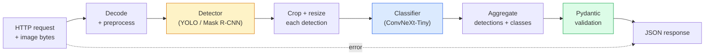

# 构建完整视管道  كابستون

> نظام رؤية مستوى الإنتاج هو سلسلة من النماذج والقواعد، ومن خلال عقد البيانات 串联起来──كونات هذه المرحلة جاهزة؛ هذا الحجر النهائي سوف يضعها من نهايتها إلى نهايتها متصلة.

**Type:** Build
**Languages:** Python
**Prerequisites:** Phase 4 Lessons 01-15
**Time:** ~120 minutes

## 學习目标
- تصميم خط أنابيب رؤية من مستوى الإنتاج، لتحقيق الأشياء، وتصنيفها، وإصدار JSON المهيكلة، مع معالجة جميع الطرق الفاشلة
- سوف يكون الكشف ((ماسك R-CNN أو YOLO) ‬صنف ((ConvNeXt-Tiny) و العقد البيانات ((Pydantic) ‬
- على خط الأنابيب من نهاية إلى نهاية  إجراء مقياس،并识别第一瓶頸(عادة أولاً عملية التحضير المسبق، ثم الكشف)
-  إصدار خدمة FastAPI الحد الأدنى، قبول تحميل الصور، تشغيل خط الأنابيب، ومع عودة مع تصنيف الكشف  نتائج

## 问题
单个视觉模型 很有用;视觉产品是由它们组成的链条──零售货架审计是检测仪 加产品分类器 再加价格-OCR管道──自动驾驶是2D检测仪 加3D检测仪加段机加跟踪仪加规划仪──医疗预查是分类器加地区分类器加临床师 UI──

وضع هذه الشبكات على طول، هو التمييز بين النموذج الأول من ML و الجزء الرئيسي من المنتج. كل واجهة بين النماذج هي مصدر حذف جديد. كل تحويل منسجم، كل قياس، كل قياس حجم القناع، قد يصبح نقطة فشل صامتة.

هذه الحجر النهائي إنشاء أدنى خط أنابيب قابل للاستخدام: الكشف + التصنيف + الخروج المهيكلي + طبقة الخدمة。 المرحلة 4 من المحتويات الأخرى يمكن إدخالها في هذا الهيكل:把 Mask R-CNN 换成 YOLOv8,添加 OCR head,添加 segmentation branch,添加 tracker。

## 概念
### خط الأنابيب



七个阶段──两个 نموذج مرحلة 开销很大;另五个阶段则是错误 最常见的出现的地方──

### استخدام Pydantic 定义 عقد البيانات

كل حد نموذجي يصبح كائن من نوعه. وهذا سيجعل فشل الصمت يفشل بشكل واضح.

```
Detection(
    box: tuple[float, float, float, float],   # (x1, y1, x2, y2), absolute pixels
    score: float,                              # [0, 1]
    class_id: int,                             # from detector's label map
    mask: Optional[list[list[int]]],           # RLE-encoded if present
)

PipelineResult(
    image_id: str,
    detections: list[Detection],
    classifications: list[Classification],
    inference_ms: float,
)
```

عندما يعود الكاشف هو`(cx, cy, w, h)`بدلاً من ذلك`(x1, y1, x2, y2)`عندما تفشل التحقق من البيانتيك في الحدود، ستجد مشكلة على الفور، بدلاً من الذهاب إلى محاولة محاصيل النزول، فإنه فقط يعود بهدوء إلى المنطقة الفارغة.

### 延迟花在哪里

تقريبا كل خط رؤيا تمتع بالثلاثة حقائق:

1. **Preprocessing 通常是最大的单个模块。**解码 JPEG 转换颜色空间 尺寸, كل هذا مرتبط بالسي بي يو, وسهل الابتكار
2. **Detector 主导 GPU 时间。**70-90% من GPU  الوقت المخصص في الكشف إلى الأمام
3. **Postprocessing（NMS、RLE encode/decode）在 GPU 上便宜，在 CPU 上昂贵。**فالتأكيد يجب أن تستخدم محيط هدف حقيقي

فهم التوزيع، لتحويل التكيف إلى تصفية ذات الأولوية.

### أساليب الفشل

- **Empty detections** 返回空列表, لا تنهار ──记录 log──
- **Out-of-bounds boxes** قطع قبل المقبض إلى حجم الصورة
- **Tiny crops** إلى الصفحة الصغيرة للصنف 跳过分类──
- **Corrupt upload** 返回带有具体错误代码 的 400 رد، وليس 500 ‬
- **Model load failure** في بدء الخدمة  فشل، بدلا من في طلب الأول 时失败。

خط أنابيب الناتج سوف يعالج كل حالة، بدلا من كتابة واحدة عامة.`try/except`ضع الفشل مخفيًا على كل فشل لديه رمز ورد

### التجميع

خدمة مستوى الإنتاج 会服务多个客户──跨请求对检测和分类 进行批量可成倍提升吞吐量──代价是: انتظار المجموعة 填满会带来额外延迟──典型设置:最多收集 20ms 请求,合并成批量,处理,再分发回应──`torchserve`和 `triton`أساسا دعم هذا النقطة؛ تحميل قابل للتنبؤ الخدمة الصغيرة عادة ما تنفيذ نفسها الميكرو-باتشر.


```figure
v4-vision-pipeline
```

## بناءها
### الخطوة 1: عقود البيانات

```python
from pydantic import BaseModel, Field
from typing import List, Optional, Tuple

class Detection(BaseModel):
    box: Tuple[float, float, float, float]
    score: float = Field(ge=0, le=1)
    class_id: int = Field(ge=0)
    mask_rle: Optional[str] = None


class Classification(BaseModel):
    detection_index: int
    class_id: int
    class_name: str
    score: float = Field(ge=0, le=1)


class PipelineResult(BaseModel):
    image_id: str
    detections: List[Detection]
    classifications: List[Classification]
    inference_ms: float
```

كود خمس ثوانٍ، يمكن أن يُفقد أيّ وقتٍ في أيّ خط أنابيبٍ صارم

### الخطوة الثانية: واحد أقل خط أنابيب

```python
import time
import numpy as np
import torch
from PIL import Image

class VisionPipeline:
    def __init__(self, detector, classifier, class_names,
                 device="cpu", min_crop=32):
        self.detector = detector.to(device).eval()
        self.classifier = classifier.to(device).eval()
        self.class_names = class_names
        self.device = device
        self.min_crop = min_crop

    def preprocess(self, image):
        """
        image: PIL.Image or np.ndarray (H, W, 3) uint8
        returns: CHW float tensor on device
        """
        if isinstance(image, Image.Image):
            image = np.asarray(image.convert("RGB"))
        tensor = torch.from_numpy(image).permute(2, 0, 1).float() / 255.0
        return tensor.to(self.device)

    @torch.no_grad()
    def detect(self, image_tensor):
        return self.detector([image_tensor])[0]

    @torch.no_grad()
    def classify(self, crops):
        if len(crops) == 0:
            return []
        batch = torch.stack(crops).to(self.device)
        logits = self.classifier(batch)
        probs = logits.softmax(-1)
        scores, cls = probs.max(-1)
        return list(zip(cls.tolist(), scores.tolist()))

    def run(self, image, image_id="anonymous"):
        t0 = time.perf_counter()
        tensor = self.preprocess(image)
        det = self.detect(tensor)

        crops = []
        detections = []
        valid_indices = []
        for i, (box, score, cls) in enumerate(zip(det["boxes"], det["scores"], det["labels"])):
            x1, y1, x2, y2 = [max(0, int(b)) for b in box.tolist()]
            x2 = min(x2, tensor.shape[-1])
            y2 = min(y2, tensor.shape[-2])
            detections.append(Detection(
                box=(x1, y1, x2, y2),
                score=float(score),
                class_id=int(cls),
            ))
            if (x2 - x1) < self.min_crop or (y2 - y1) < self.min_crop:
                continue
            crop = tensor[:, y1:y2, x1:x2]
            crop = torch.nn.functional.interpolate(
                crop.unsqueeze(0),
                size=(224, 224),
                mode="bilinear",
                align_corners=False,
            )[0]
            crops.append(crop)
            valid_indices.append(i)

        class_preds = self.classify(crops)

        classifications = []
        for valid_idx, (cls_id, cls_score) in zip(valid_indices, class_preds):
            classifications.append(Classification(
                detection_index=valid_idx,
                class_id=int(cls_id),
                class_name=self.class_names[cls_id],
                score=float(cls_score),
            ))

        return PipelineResult(
            image_id=image_id,
            detections=detections,
            classifications=classifications,
            inference_ms=(time.perf_counter() - t0) * 1000,
        )
```

كل واجهة من نوعها. كل طريق فشل له قرارات معالجة واضحة.

### الخطوة 3: ربط جهاز كشف ومرسوم

```python
from torchvision.models.detection import maskrcnn_resnet50_fpn_v2
from torchvision.models import convnext_tiny

# Use ImageNet-pretrained weights for a realistic pipeline without training
detector = maskrcnn_resnet50_fpn_v2(weights="DEFAULT")
classifier = convnext_tiny(weights="DEFAULT")
class_names = [f"imagenet_class_{i}" for i in range(1000)]

pipe = VisionPipeline(detector, classifier, class_names)

# Smoke test with a synthetic image
test_image = (np.random.rand(400, 600, 3) * 255).astype(np.uint8)
result = pipe.run(test_image, image_id="demo")
print(result.model_dump_json(indent=2)[:500])
```

### الخطوة 4: خدمة FastAPI

```python
from fastapi import FastAPI, UploadFile, HTTPException
from io import BytesIO

app = FastAPI()
pipe = None  # initialised on startup

@app.on_event("startup")
def load():
    global pipe
    detector = maskrcnn_resnet50_fpn_v2(weights="DEFAULT").eval()
    classifier = convnext_tiny(weights="DEFAULT").eval()
    pipe = VisionPipeline(detector, classifier, class_names=[f"c{i}" for i in range(1000)])

@app.post("/detect")
async def detect_endpoint(file: UploadFile):
    if file.content_type not in {"image/jpeg", "image/png", "image/webp"}:
        raise HTTPException(status_code=400, detail="unsupported image type")
    data = await file.read()
    try:
        img = Image.open(BytesIO(data)).convert("RGB")
    except Exception:
        raise HTTPException(status_code=400, detail="cannot decode image")
    result = pipe.run(img, image_id=file.filename or "upload")
    return result.model_dump()
```

استخدام `uvicorn main:app --host 0.0.0.0 --port 8000`运行。 استخدام `curl -F 'file=@dog.jpg' http://localhost:8000/detect`测试。

### الخطوة 5: المراقبة هذا النبوب

```python
import time

def benchmark(pipe, num_runs=20, image_size=(400, 600)):
    img = (np.random.rand(*image_size, 3) * 255).astype(np.uint8)
    pipe.run(img)  # warm up

    stages = {"preprocess": [], "detect": [], "classify": [], "total": []}
    for _ in range(num_runs):
        t0 = time.perf_counter()
        tensor = pipe.preprocess(img)
        t1 = time.perf_counter()
        det = pipe.detect(tensor)
        t2 = time.perf_counter()
        crops = []
        for box in det["boxes"]:
            x1, y1, x2, y2 = [max(0, int(b)) for b in box.tolist()]
            x2 = min(x2, tensor.shape[-1])
            y2 = min(y2, tensor.shape[-2])
            if (x2 - x1) >= pipe.min_crop and (y2 - y1) >= pipe.min_crop:
                crop = tensor[:, y1:y2, x1:x2]
                crop = torch.nn.functional.interpolate(
                    crop.unsqueeze(0), size=(224, 224), mode="bilinear", align_corners=False
                )[0]
                crops.append(crop)
        pipe.classify(crops)
        t3 = time.perf_counter()
        stages["preprocess"].append((t1 - t0) * 1000)
        stages["detect"].append((t2 - t1) * 1000)
        stages["classify"].append((t3 - t2) * 1000)
        stages["total"].append((t3 - t0) * 1000)

    for stage, times in stages.items():
        times.sort()
        print(f"{stage:12s}  p50={times[len(times)//2]:7.1f} ms  p95={times[int(len(times)*0.95)]:7.1f} ms")
```

الناتج النموذجي للسي بي يو فوق:الاعمال المسبقة ~3 ms،الاكتشاف 300-500 ms،التصنيف 20-40 ms،الملء 350-550 ms.

## استخدمها
المنتج الموضعي في النهاية سوف يتم الحصول على نفس الهيكل، إضافة:

- **Model versioning** 始终在回应 中记录 模型名 和 权重 哈希──
- **Per-request trace IDs** 记录 كل طلب من كل مرحلة التوقيت، حتى تتمكن من وضع رد البطيء ومرحلة 关联起来──
- **Fallback path** إذا كان المصفوف وقت، عودة لا تحمل اكتشاف التصنيف، بدلا من جعل الطلب كله 失败。
- **Safety filters** تصفية NSFW / PII 在分类 之后、响应 离开服务 之前运行。
- **Batch endpoint**واحد`/detect_batch`, قبول عنوان الصورة 列表 للمعالجة الجماعية

لإنتاج الخدمة`torchserve`.`Triton Inference Server`和 `BentoML`开箱即可处理批发,版本, قياسات, والتحقق الصحي`FastAPI`适合原型 和小规模产品──

## 交付 it
本课会产出:

- `outputs/prompt-vision-service-shape-reviewer.md` إشارة سريعة، لتحقيق خدمة الرؤية 代码中的合同/رد على شكل 违规,并指出第一个破裂 bug──
- `outputs/skill-pipeline-budget-planner.md` مهارة، وذلك مع تحديد الهدف من التأخير والإنتاج، لكل مرحلة من خط الأنابيب، وتوزيع ميزانية الوقت، وتعيين المرحلة التي سوف تكون أول ما يتجاوز الميزانية.

## التدريب
1. **(Easy)**في مجموعة بيانات مفتوحة عشرة صور على خط الأنابيب.
2. **(Medium)**أعطني`Detection`添加面具输出字段,并将其编码为 RLE──验证 حتى لو كانت صورة 10 كائنات, JSON أيضا يبقى في 1MB 以下──
3. **(Hard)**في المصفوف قبل إضافة ميكرو-باتشير: جمع أكبر عدد من 10 ms من المحاصيل ، باستخدام مكالمة واحدة من GPU لتصنيفها كلها ، ثم على الطلب عودة النتيجة.

## 关键术语
| Term | What people say | What it actually means |
|------|----------------|----------------------|
| Pipeline | “系统” | 由 preprocessing、inference 和 postprocessing step 组成的有序链条，每一对 step 之间都有类型化 interface |
| Data contract | “schema” | 每个 stage 的 input 和 output 都必须符合的 Pydantic / dataclass 定义；在边界处捕获 integration bug |
| Preprocessing | “model 之前” | 解码、颜色转换、resizing、normalising；通常是最大的 CPU 时间消耗点 |
| Postprocessing | “model 之后” | NMS、mask resize、threshold、RLE encode；在 GPU 上便宜，在 CPU 上昂贵 |
| Microbatcher | “先收集再 forward” | 在固定窗口内等待多个 request，然后运行一次 batched forward pass 的 aggregator |
| Trace ID | “Request id” | 每个 request 的标识符，会在每个 stage 记录，因此 slow request 可以端到端追踪 |
| Failure code | “命名错误” | 每类 failure 都有具体 error code，而不是泛化的 500；支持 client retry logic |
| Health check | “Readiness probe” | 一个低成本 endpoint，用于报告 service 是否可以响应；loadbalancer 依赖它 |

## 延伸阅读
- [Full Stack Deep Learning — Deploying Models](https://fullstackdeeplearning.com/course/2022/lecture-5-deployment/) النشر المعتمد على المجال المنتج
- [BentoML docs](https://docs.bentoml.com) 支持批发,版本和尺度的服务框架
- [torchserve docs](https://pytorch.org/serve/) PyTorch 官方 مكتبة الخدمة
- [NVIDIA Triton Inference Server](https://developer.nvidia.com/triton-inference-server) 支持批发 和多型的高吞吐量服务
