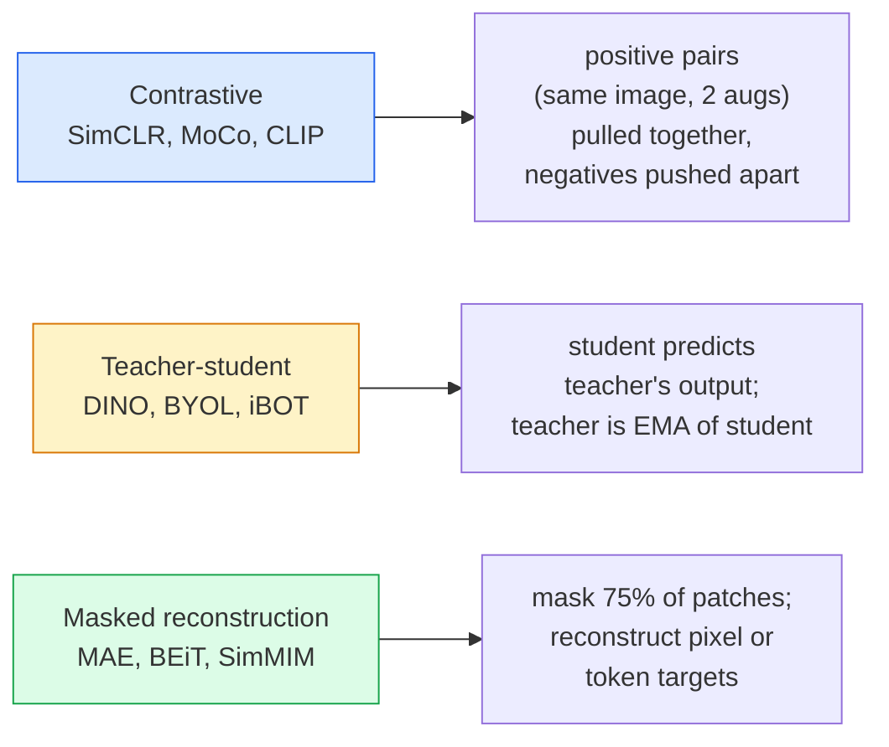

# رؤية ذاتية الإشراف  SimCLR، DINO، MAE

> العلامات هي علبة رؤية مرئية. التدريب المسبق للرقابة الذاتية .

**类型：**学习 + 构建
**语言：**بايثون
**先修要求：**المرحلة 4 الدروس 04(تصنيف الصورة)
**时间：**حوالي 75 دقيقة

## 學习目标

- 理三大自我监督家族  متناقضة SimCLR) 、 معلم الطالب DINO) 、 نقاب إعادة الإعمار MAE)  并说明每种在优化什么
- من التحقق من خسارة InfoNCE،并 تفسير لماذا حجم المجموعة هو 512 قابل للذهاب، بينما حجم المجموعة هو 32 سوف يفشل
-  شرح لماذا 75% من معدل الاختفاء من MAE ليس محدداً، وكذلك 15٪ من المستندات BERT
- استخدام نقاط تفتيش DINOv2 أو MAE ImageNet  إجراء مسح خطي و استرداد الصور الصفرية

## 问题

تحت إشراف ImageNet ، هناك 1.3 مليون صورة مع علامات ، وفقًا لتقديرات التسجيل تكلفة 10 مليون دولار. المجموعة الدراسية والصناعية من البيانات هي أصغر ، وتكلفة التسجيل هي أيضا أعلى.

التعلم المراقب الذاتي هو الجواب. التعلم المراقب الذاتي هو الجواب. التعلم المراقب الذاتي هو الجواب. التعلم الذاتي الذي يتم تدريبه على الجهاز الذاتي هو التعلم الذاتي الذي يتم تدريبه على الجهاز الذاتي.

التحول المفاهيمي هو: مهمة المخطط  الموديل تم تدريبه للانتهاء من المهمة  لا بد من مهمة متدفقة. المفتاح يكمن في ما إذا كان يضطر إلى تعلم النموذج من خصائص مفيدة.

## 概念

### ثلاث عائلة



### التعلم المقابل ((SimCLR)

取一张图像,应用两次随机增强,得到两次见解──将二者送进同一个编码加投影头──最小化一个损失,含义是 应该接近,并且 这个嵌入应该远离批量中的所有其他图像的嵌入──

```
Loss for positive pair (z_i, z_j) among 2N views per batch:

   L_ij = -log( exp(sim(z_i, z_j) / tau) / sum_k in batch \ {i} exp(sim(z_i, z_k) / tau) )

sim = cosine similarity
tau = temperature (0.1 standard)
```

هذا هو InfoNCE الخسارة. انها تتطلب كل إيجابية هناك العديد من السلبيات، لذلك حجم المجموعة  مهم  SimCLR 需要 512-8192。 موكو 引入了一个由过去的批量 构成的动力队列,将负数与批量 解──

### المعلم الطالب ((DINO)

شبكتين متشابهتان: الطالب والمعلم. المعلم هو الطالب 权重的指数动平均(EMA)。二者都看到同一图像的增强视图── الطالب من输出被训练为匹配的老师的输出  没有明显的负面──

```
loss = CE( student_output(view_1),  teacher_output(view_2) )
     + CE( student_output(view_2),  teacher_output(view_1) )

teacher_weights = m * teacher_weights + (1 - m) * student_weights   (m ≈ 0.996)
```

لماذا لن تنهار 成预测一个常量:تتمركز الناتج من المعلمين  (تقل عن متوسط قيمة كل درجة) 并敏化(除以较小温度) 

DINO هو أساس DINOv2  الحجم، DINOv2 في 142M 张 صور منتشرة 上训练── دخول خصائص هي حالية الصفر الصور البصرية والتنبؤ الكثيف SOTA──

### إعادة بناء مخفي

كشف 75٪ من المفاتيح في ViT 输入中──只会见 25% 送入编码──一个小解码器 接收编码器 输出以及位于面具位置的面具代币,并被训练重建面具补丁的像素──

```
Encoder:  visible 25% of patches -> features
Decoder:  features + mask tokens at masked positions -> reconstructed pixels
Loss:     MSE between reconstructed and original pixels on masked patches only
```

让MAE 有效的关键设计选择:

- **75% mask ratio** 很高──迫使编码学习语义特征; 重建 25% 会接近便宜(相邻像素的相关性太强,到底CNN都能轻松完成)。
- **Asymmetric encoder/decoder** كبير نوع ViT مرموز فقط رؤية البقع;                                                                                                                                                                                                                                                        
- **Pixel-space reconstruction target** أكثر سهولة من هدف التوجيهي من BET ، ويكون أفضل في ViT 上效果

بعد التدريب، تركت المُعدّل.

### لماذا 75% وليس 15%

كشفتة بيرت 15% من الوهمات. كشفتة ماي 75%.

- اللغة الطبيعية كل رمز 很高──预测 15% من الرموز 仍然很难, لأن كل موقف مخفي لديهم العديد من الإكمالات المثيرة للصدق──
- عادة ما يكون بإمكان مجتمع غير مسموم أن يحدد بيكسلات اللصص المغطاة.

75% 高足够高, يجعل مجرد الفضاء خارج التشغيل غير قابلة لحل المهمة; المُصَنِّف يجب أن يُظهر محتوى الصورة‬

### تقييم المسحات الخطية

بعد التدريب، فإن المعيار التقييم هو**linear probe**:结 مُرمّع، على أساس علامات ImageNet على ذلك 訓練一個单层线性分类器──報告 top-1 دقة──

- SimCLR ResNet-50: حوالي 71%(2020)
- دينو فيت-س/16: حوالي 77% ((2021)
- MAE ViT-L/16: حوالي 76% ((2022)
- DINOv2 ViT-g/14: حوالي 86% ((2023)

المسح الخطي هو مقياس خالص للجودة الخاصة بالخصائص؛ التنسيق الدقيق عادة ما يزيد من 2-5 نقاط، ولكن أيضاً يخلط في تأثير إعادة تدريب الرأس.


```figure
data-augmentation
```

## بناءها

### الخطوة الأولى: خط أنابيب إضافة المشاهد الثنائية

```python
import torch
import torchvision.transforms as T

two_view_train = lambda: T.Compose([
    T.RandomResizedCrop(96, scale=(0.2, 1.0)),
    T.RandomHorizontalFlip(),
    T.ColorJitter(0.4, 0.4, 0.4, 0.1),
    T.RandomGrayscale(p=0.2),
    T.ToTensor(),
])


class TwoViewDataset(torch.utils.data.Dataset):
    def __init__(self, base):
        self.base = base
        self.aug = two_view_train()

    def __len__(self):
        return len(self.base)

    def __getitem__(self, i):
        img, _ = self.base[i]
        v1 = self.aug(img)
        v2 = self.aug(img)
        return v1, v2
```

كل واحد__getitem__عودة إلى نفس الصورة مشاهد إضافيتين؛ لا حاجة إلى علامات‬

### 步骤 2: فقدان المعلومات

```python
import torch.nn.functional as F

def info_nce(z1, z2, tau=0.1):
    """
    z1, z2: (N, D) L2-normalised embeddings of paired views
    """
    N, D = z1.shape
    z = torch.cat([z1, z2], dim=0)  # (2N, D)
    sim = z @ z.T / tau              # (2N, 2N)

    mask = torch.eye(2 * N, dtype=torch.bool, device=z.device)
    sim = sim.masked_fill(mask, float("-inf"))

    targets = torch.cat([torch.arange(N, 2 * N), torch.arange(0, N)]).to(z.device)
    return F.cross_entropy(sim, targets)
```

调用前先对  إجراء L2 التطبيعية`tau=0.1`هو SimCLR 默认值; أسفل من القيمة سوف تجعل الخسارة أكثر شديدة,并 تحتاج إلى المزيد من السلبيات.

### 步骤 3: فحص الصحة InfoNCE

```python
z1 = F.normalize(torch.randn(16, 32), dim=-1)
z2 = z1.clone()
loss_same = info_nce(z1, z2, tau=0.1).item()
z2_random = F.normalize(torch.randn(16, 32), dim=-1)
loss_random = info_nce(z1, z2_random, tau=0.1).item()
print(f"InfoNCE with identical pairs:  {loss_same:.3f}")
print(f"InfoNCE with random pairs:     {loss_random:.3f}")
```

相同對 应得到较低损失(大批 和低温度下接近 0) ・・・随机对 应得到 log(2N-1) = ~log(31) = ~3.4,针对16 زوجات

### 步骤 4: تقشير في نمط MAE

```python
def random_mask_indices(num_patches, mask_ratio=0.75, seed=0):
    g = torch.Generator().manual_seed(seed)
    n_keep = int(num_patches * (1 - mask_ratio))
    perm = torch.randperm(num_patches, generator=g)
    visible = perm[:n_keep]
    masked = perm[n_keep:]
    return visible.sort().values, masked.sort().values


num_patches = 196
visible, masked = random_mask_indices(num_patches, mask_ratio=0.75)
print(f"visible: {len(visible)} / {num_patches}")
print(f"masked:  {len(masked)} / {num_patches}")
```

简单、快速, وبالنسبة إلى البذور المحددة هي تحديدات.

## استخدمها

DINOv2 هو معيار الإنتاج لعام 2026:

```python
import torch
from transformers import AutoImageProcessor, AutoModel

processor = AutoImageProcessor.from_pretrained("facebook/dinov2-base")
model = AutoModel.from_pretrained("facebook/dinov2-base")
model.eval()

# Per-image embeddings for zero-shot retrieval
with torch.no_grad():
    inputs = processor(images=[pil_image], return_tensors="pt")
    outputs = model(**inputs)
    embedding = outputs.last_hidden_state[:, 0]  # CLS token
```

المشكلة 768-dim Embedding هو الحديث استرداد الصور والتواصل الكثيف وقطة صفر نقل خطوط الأنابيب.

对于图像文本嵌入,SigLIP或OpenCLIP 是对应方案;对于MAE-style fine tuning,`timm`لقد تم توفير جميع نقاط التفتيش الخاصة بالمكتب

## 交付 it

本课会产出:

- `outputs/prompt-ssl-pretraining-picker.md` إرسال عرض، وفقاً لجمعة مجموعة البيانات 、حساب 和 مهمة أسفل التيار 选择 SimCLR / MAE / DINOv2。
- `outputs/skill-linear-probe-runner.md`                                                             

## التدريب

1. **（Easy）**验证: بالنسبة للمكثفات الجيدة، فإن خفض درجة الحرارة سوف يؤدي إلى خسارة InfoNCE، وذلك لأجل المكثفات السرية، فإن خفض درجة الحرارة سوف يؤدي إلى خسارة ارتفاع.`tau in [0.05, 0.1, 0.2, 0.5]`مقابل الخسارة
2. **（Medium）**تطبيق مركز مركزي على النمط DINO، وإذا لم يكن هناك مركز، فإن الطالب سوف يتعرض لبعض الفترات، في الانهيار لـ "مجموعة متجهة"
3. **（Hard）**استخدام الدروس 10 في الصفحة الثانية من الصفحة الثانية من الصفحة الثانية من الصفحة الثانية من الصفحة الثانية من الصفحة الثانية من الصفحة الثانية من الصفحة الثانية من الصفحة الثانية من الصفحة الثانية من الصفحة الثانية من الصفحة الثانية من الصفحة الثانية من الصفحة الثانية من الصفحة الثانية من الصفحة الثانية من الصفحة الثانية من الصفحة الثانية من الصفحة الثانية من الصفحة الثانية من الصفحة الثانية من الصفحة الثانية من الصفحة الثانية من الصفحة الثانية من الصفحة الثانية من الصفحة الثانية من الصفحة الثانية من الصفحة الثانية من الصفحة الثانية من الصفحة الثانية من الصفحة الثانية من الصفحة الثانية من الصفحة الثانية من الصفحة الثانية من الصفحة الثانية من الصفحة الثانية من الصفحة الثانية من الصفحة الثانية من الصفحة الثانية من الصفحة الثانية من الصفحة الثانية من الصفحة الثانية من الصفحة الثانية من الصفحة الثانية من الصفحة الثانية من الصفحة الثانية من الصفحة الثانية من الصفحة الثانية من الصفحة الثانية من الصفحة الثانية من الصفحة الثانية من الصفحة الثانية من الصفحة الثانية من الصفحة الثانية.

## 关键术语

| Term | 人们的说法 | 实际含义 |
|------|----------------|----------------------|
| Self-supervised | “Label-free” | 一种 pretext task，用于从无标注数据中产生有用 representations |
| Pretext task | “假任务” | SSL 期间使用的 objective（reconstruct patches、match views）；pretraining 后会被丢弃 |
| Linear probe | “Frozen encoder + linear head” | 标准 SSL 评估：只在 frozen features 之上训练一个 linear classifier |
| InfoNCE | “Contrastive loss” | 对 cosine similarities 做 softmax；positive pair 是目标类别，所有其他项都是 negatives |
| EMA teacher | “Moving-average teacher” | 权重是 student 的 exponential moving average 的 teacher；BYOL、MoCo、DINO 使用它 |
| Mask ratio | “隐藏的 patches 百分比” | MAE 期间被 mask 的 patches 比例；vision 为 75%，text 为 15% |
| Representation collapse | “Constant output” | SSL 失败模式：encoder 对所有输入输出一个常量 Vector；通过 centring、sharpening 或 negatives 防止 |
| DINOv2 | “生产级 SSL backbone” | Meta 2023 年的 self-supervised ViT；2026 年最强的通用 image features |

## 延伸阅读

- [SimCLR (Chen et al., 2020)](https://arxiv.org/abs/2002.05709) التعلم المُتناقض 参考
- [DINO (Caron et al., 2021)](https://arxiv.org/abs/2104.14294) 带动力、中心、حشد المعلم الطالب
- [MAE (He et al., 2022)](https://arxiv.org/abs/2111.06377) 面向 ViT                                                                                                                                                                                                                                                                                                                                                                                                                                                                                                                       
- [DINOv2 (Oquab et al., 2023)](https://arxiv.org/abs/2304.07193) سيتم توسيع التنمية النفسية المراقبة إلى صفات الإنتاج
