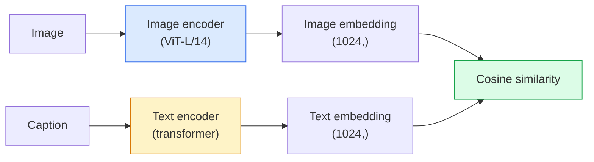

# رؤية المفردات المفتوحة  CLIP

> وضع مُرمّد الصورة و مُرمّد نص، التدريب، جعل مُتَطابق (الصورة، العنوان) على نفس النقطة في الفضاء المشترك.

**Type:** Build + Use
**Languages:** Python
**Prerequisites:** Phase 4 Lesson 14 (ViT), Phase 4 Lesson 17 (Self-Supervised)
**Time:** ~45 分钟

## 學习目标

-  شرح CLIP من معمارية برجين و هدف التدريب المقابل
- استخدام CLIP ((أو SigLIP) المسبق للتدريب على التصنيف الصفر، دون الحاجة إلى أي تدريب محدد للمهمة
- من صفر تحقيق التصنيف الصفر:مطلبات فئة التشفير
- 区分 CLIP、SigLIP、OpenCLIP و LLaVA/LLaMA-موديل الرؤية

## 问题

传统分类器是封闭词汇:一个1000类 ImageNet模型只能预测1000个标签──每个新类别都需要标签数据 和重新训练的头──

كليب ((رادفورد وغيرهم، OpenAI 2021) أظهرت، في 400 مليون زوج من الويب 抓取 (صورة، عنوان) على التدريب، يمكن الحصول على نموذج، فإنه يمكن أن يستنتج 时分类 إلى أي من مجموعات الفئات، والفئات تحتاج فقط إلى استخدام اللغة الطبيعية وصف.

هذه القدرةصفر-التحويل就是 كل نظام رؤية حديثة 都從 CLIP-عائلة نقطة التفتيش 开始的原因──检测(Grounding DINO、OWL-ViT) ‧分割(CLIPSeg、SAM) ‧الانتعاش、اعتدال المحتوى、VLMs 和 نص إلى الصورة توليد تم بناء على التوابل المشتركة على النمط CLIP 之上──

## 概念

### برجين



两个 مرموز 最后都会通过线性投影到相同的嵌入维度 ((CLIP-B/32 为 512,CLIP-L/14 为 1024)  إجراء L2-تطبيعية 并计算宇宙相似性──

###  هدف

给定一个包含 N 个 (صورة، عنوان) أزواج من المجموعة، بنية مصفوفة شبيهة NxN── تدريب اثنين من المرموزات، جعل المقطعيات (((أزواج مطابقة) مع شبيهة عالية، والخارج المقاطع ((غير مطابقة) مع شبيهة منخفضة──

```
sim_matrix = image_embeddings @ text_embeddings.T / tau

loss_i2t = cross_entropy(sim_matrix,       targets=arange(N))
loss_t2i = cross_entropy(sim_matrix.T,     targets=arange(N))
loss = (loss_i2t + loss_t2i) / 2
```

هذا هو التناظر، لأن الصورة إلى النص والنص إلى الصورة استرداد يجب أن تكون قابلة للاستخدام.`tau`(الدرجة الحرارة) عادةً كبرامتر تراكمي، تعتبر 0.07

### أفضل خسارة

SigLIP ((Zhai et al., 2023) باستخدام sigmoid لكل زوج بدل softmax:

```
loss = mean over pairs of log(1 + exp(-y_ij * sim_ij))
y_ij = +1 if matching, -1 otherwise
```

فقدان لكل زوج تحويل القياسية المستوى المشتركة المطلوبة من CLIP  SigLIP في الحجم الصغير من الحزم  تدريب أفضل، و تتناسب أو تتجاوز CLIP 

### تصنيف الصفر

أعطني تدريب جيد

1. لكل فئة، مجموعة واحدة: صورة من {الفئة} "
2. استخدام رمز النص ترمز جميع طلبات الفئة -> `T`الشكل (C, d)
3. صورة اختبار إكود -> `I`الشكل (1, د)
4. التشابه = `I @ T.T`الشكل (1, ج)
5. Argmax -> فئة متوقعة

الهندسة السريعة 很重要──OpenAI 为 ImageNet 发布 80 个提示模板(" صورة من {}"、" صورة مبهمة من {}"、"رسمة من {}"、...)── على كل فئة من التوابل التوابل 取平均,可以额外提升 1-3% top-1 دقة──

### 2026 سنة استخدام النماذج على طراز CLIP

- **Zero-shot classification**直接使用──
- **Image retrieval**一次性 رمز جميع الصور، في الاستنتاج 时 إضافة استفسار
- **Text-conditioned detection**إرسال DINO 、OWL-ViT سوف تتميز بـ CLIP برج نص 包装在探测器 周围──
- **Text-conditioned segmentation**CLIPSeg;SAM 通過 CLIP استخدام إدخالات النص-فوري
- **VLMs**LLaVA、Qwen-VL、InternVL سوف تشفر رؤية CLIP-عائلة 接入 LLM‬
- **Text-to-image gen**التنشر المستقر DALL-E 3 以 CLIP إدخال النص 为条件──

بمجرد أن يكون لديك مساحة تشاركية، كل مهمة رؤية+لغة ستصبح مسافة حساباً.


```figure
clip-contrastive
```

## بناءها

### الخطوة 1: نموذج صغير جداً من برجين

إن CLIP الحقيقي هو محول ViT +. في هذه الدورة، فإن الأبراج تعتمد على ميزات التحكم المسبق في المواقع الصغيرة، لذلك يمكن رؤية إشارات التدريب في CPU.

```python
import torch
import torch.nn as nn
import torch.nn.functional as F


class TwoTower(nn.Module):
    def __init__(self, img_in=128, txt_in=64, emb=64):
        super().__init__()
        self.image_proj = nn.Sequential(nn.Linear(img_in, 128), nn.ReLU(), nn.Linear(128, emb))
        self.text_proj = nn.Sequential(nn.Linear(txt_in, 128), nn.ReLU(), nn.Linear(128, emb))
        self.logit_scale = nn.Parameter(torch.ones([]) * 2.6592)  # ln(1/0.07)

    def forward(self, img_feats, txt_feats):
        i = F.normalize(self.image_proj(img_feats), dim=-1)
        t = F.normalize(self.text_proj(txt_feats), dim=-1)
        return i, t, self.logit_scale.exp()
```

--تقديم مشهد --تقديم مشهد --تقديم مشهد --تقديم مشهد --تقديم مشهد --تقديم مشهد --تقديم مشهد --تقديم مشهد --تقديم مشهد --تقديم مشهد --تقديم مشهد --تقديم مشهد --تقديم مشهد --تقديم مشهد --تقديم مشهد --تقديم مشهد --تقديم مشهد --تقديم مشهد --تقديم مشهد --تقديم مشهد --تقديم مشهد --تقديم مشهد --تقديم مشهد --تقديم مشهد --تقديم --تقديم مشهد --تقديم --تقديم مشهد --تقديم --تقديم --تقديم --تقديم --تقديم --تقديم --تقديم --تقديم --تقديم --تقديم --تقديم --تقديم --تقديم --تقديم --تقديم --تقديم --تقديم --تقديم --تقديم ------------------------------------------------------------------------------------------------------------------------------------------------------------------------------------------------------------------------------------------------------------------------------------------------------------------------------------------------------------------------------------------------------------------------------------------------------------------------------------------------------------------------------------------------------------

### 步骤 2: الخسارة المقابلة

```python
def clip_loss(image_emb, text_emb, logit_scale):
    N = image_emb.size(0)
    sim = logit_scale * image_emb @ text_emb.T
    targets = torch.arange(N, device=sim.device)
    l_i = F.cross_entropy(sim, targets)
    l_t = F.cross_entropy(sim.T, targets)
    return (l_i + l_t) / 2
```

التناظر. . . . . . . . . . . . . . . . . . . . . . . . . . . . . . . . . . . . . . . . . . . . . . . . . . . . . . . . . . . . . . . . . . . . . . . . . . . . . . . . . . . . . . . . . . . . . . . . . . . . . . . . . . . . . . . . . . . . . . . . . . . . . . . . . . . . . . . . . . . . . . . . . . . . . . . . . . . . . . . . . . . . . . . . . . . . . . . . . . . . . . . . . . . . . . . . . . . . . . . . . . . . . . . . . . . . . . . . . . . . . . . . . . . . . . . . . . . . . . . . . . . . . . . . . . . . . . . . . . . . . . . . . . . . . . . . . . . . . . . . . . . . . . . . . . . . . . . . . . . . . . . . . . . . . . . . . . . . . . . . . . . . . . . . . . . . . . . . . . . . . . . . . . . . . . . . . . . . . . . . . . . . . . . . . . . . . . . . . . . . . . . . . . . . . . . . . . . . . . . . . . . . . . . . . . . . . . . . . . . . . . . . . . . . . . . . . . . . . . . . . . . . . . . . . . . . . . . . . . . . . . . . . . . . . . . . . . . . . . . . . . . . . . . . . . . . . . . . . . . . . . . . . . .

### 步骤 3: تصنيف الصفر

```python
@torch.no_grad()
def zero_shot_classify(model, image_feats, class_text_feats, class_names):
    """
    image_feats:      (N, img_in)
    class_text_feats: (C, txt_in)   one averaged embedding per class
    """
    i = F.normalize(model.image_proj(image_feats), dim=-1)
    t = F.normalize(model.text_proj(class_text_feats), dim=-1)
    sim = i @ t.T
    pred = sim.argmax(dim=-1)
    return [class_names[p] for p in pred.tolist()]
```

كل خطوة واحدة. هذا هو إجراءات الصفر المحددة المستخدمة في نقطة التفتيش CLIP الإنتاج.

### الخطوة 4: التحقق من الصحة

```python
torch.manual_seed(0)
model = TwoTower()

img = torch.randn(8, 128)
txt = torch.randn(8, 64)
i, t, scale = model(img, txt)
loss = clip_loss(i, t, scale)
print(f"batch size: {i.size(0)}   loss: {loss.item():.3f}")
```

بالنسبة لنموذج التشغيل المحتمل، يجب أن يقترب الخسارة`log(N) = log(8) = 2.08`هذا لا يزال لم يتعلم حتى الآن الهدف المتناظر للاندروبيات المتقاطعة في البنية

## استخدمها

OpenCLIP هو عام 2026 المجتمع المُختبر:

```python
import open_clip
import torch
from PIL import Image

model, _, preprocess = open_clip.create_model_and_transforms("ViT-B-32", pretrained="laion2b_s34b_b79k")
tokenizer = open_clip.get_tokenizer("ViT-B-32")

image = preprocess(Image.open("dog.jpg")).unsqueeze(0)
text = tokenizer(["a photo of a dog", "a photo of a cat", "a photo of a car"])

with torch.no_grad():
    image_features = model.encode_image(image)
    text_features = model.encode_text(text)
    image_features = image_features / image_features.norm(dim=-1, keepdim=True)
    text_features = text_features / text_features.norm(dim=-1, keepdim=True)
    probs = (100.0 * image_features @ text_features.T).softmax(dim=-1)

print(probs)
```

إعادة التدريب على الحجم الصغير، تدريب أفضل، وأفضل تكييف للعمل الجديد:`google/siglip-base-patch16-224`"تحتضن الوجه مع بعضها البعض"

## 交付 it

本课会产出:

- `outputs/prompt-zero-shot-class-picker.md`إشارة، تستخدم في فئات محددة 列表和域 时، للصفر الصور CLIP 设计类模板。
- `outputs/skill-image-text-retriever.md`مهارة، باستخدام أي نقطة تفتيش CLIP إنشاء مؤشر إضافة الصورة، دعم استفسار بالنص و استفسار بالصورة

## التدريب

1. **（Easy）**استخدام OpenCLIP المتدربة مسبقا ViT-B/32، و استخدام CIFAR-10 上80 نموذج مجموعة مفاجأة صنع تصنيف صفر-طلق-
2. **（Medium）**في نفس مهمة CIFAR-10 上比较单模板("صورة {}") مع 80 نموذج متوسط التوابل──量化差距并解释为什么
3. **（Hard）**构建一条零shot图像检索索引: باستخدام CLIP إدمج 1000 张图像,构建 FAISS索引, باستخدام自然语言描述进行查询.

## 关键术语

| Term | 人们怎么说 | 它实际意味着什么 |
|------|----------------|----------------------|
| Two-tower | "Dual encoder" | 独立的 image 和 text encoders，末端是 shared-dim projection head |
| Zero-shot | "No task-specific training" | 在 inference 时分类到仅由文本描述的 classes；不接触 labels |
| Temperature / logit_scale | "tau" | 在 softmax 前缩放 similarity matrix 的 learned scalar |
| Prompt template | "A photo of a {}" | 包裹 class names 的自然语言包装器；平均多个 templates 会提升 zero-shot accuracy |
| CLIP | "Image+text model" | 2021 年的 OpenAI model；2026 年该领域的通用语汇 |
| SigLIP | "Sigmoid CLIP" | 将 softmax 替换为 per-pair sigmoid；在小 batch 下训练更好 |
| OpenCLIP | "Open reproduction" | 社区在 LAION 上训练的 CLIP variants；open-source pipelines 的 production default |
| VLM | "Vision-language model" | CLIP-family encoder 加上 LLM，训练用来回答关于 images 的问题 |

## 延伸阅读

- [CLIP：从自然语言监督中学习可迁移视觉模型（Radford et al., 2021）](https://arxiv.org/abs/2103.00020)
- [SigLIP：用于 Language-Image Pre-Training 的 Sigmoid Loss（Zhai et al., 2023）](https://arxiv.org/abs/2303.15343)
- [OpenCLIP](https://github.com/mlfoundations/open_clip)قاعدة شفرة المجتمع
- [DINOv2 vs CLIP vs MAE：features comparison](https://huggingface.co/blog/dinov2)包含并排 حالات الاستخدام
