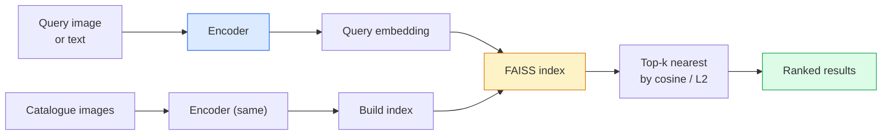

# استرداد الصور والتعلم الميتر

> نظام الاسترداد سيتم حسب مساحة إدراج المسافة إلى الترتيبات المرشحة. تعلم الميترات هو علم تشكيل هذا الفضاء، مما يجعل المسافة تعبر عن ما تريد أن تعنيه.

**Type:** Build
**Languages:** Python
**Prerequisites:** Phase 4 Lesson 14 (ViT), Phase 4 Lesson 18 (CLIP)
**Time:** ~45 minutes

## 學习目标
- 解释 ثلاثية التناقضات و خسائر التعلم الميتركي القائمة على النظام،并为给定数据集选择合适的方法
- 正确实现 L2 التطبيع و التشابه الكويسين،并审计 "المادة نفسها" و "المجموعة نفسها" استرداد فرق
- إنشاء مؤشر FAISS، باستخدام النصوص والصور استفسارها،并为
- سوف يستخدمون DINOv2、CLIP 和 SigLIP باستخدام وضع العظام الفقرية خارج الرف، ومعرفة كيفية الفوز

## 问题
الاسترداد في نظام الإنتاج المشاهد موجودة: اكتشاف المزدوج ‬البحث العكسي عن الصورة ‬البحث المرئي ‬"العثور على منتجات مماثلة")‬التعرف على الوجه ‬المستخدم في مراقبة شخصية إعادة التعرف‬المستخدم في التجارة الإلكترونية‬المطابقة على مستوى الحالة‬‬‬المشكلة المنتج دائما نفسها:"عطيت هذه الصورة المطلوبة، على كتالوجي 排序‬‬".

两个 تصميمات تحدد النظام بأكمله.  الإدمج،也就是由什么模型产生 Vector.  المؤشر،也就是如何在规模化场景中找到近邻.  到 2026 年,都已商品化 DINOv2 用于嵌入,FAISS 用于索引),这提高了门:难点在定义你的应用中*什么算相似*,然后塑造嵌入空间,让距离与这个定义匹配

هذا النوع من التكوين هو التعلم الميتركي.

## 概念
### إعادة في نظرة واحدة



### الأسر الأربعة التي خسرت

| Loss | Requires | Pros | Cons |
|------|----------|------|------|
| **Contrastive** | (anchor, positive) + negatives | 简单，可用于任何 pair label | 没有大量 negatives 时收敛较慢 |
| **Triplet** | (anchor, positive, negative) | 直观；可直接控制 margin | Hard-triplet mining 成本高 |
| **NT-Xent / InfoNCE** | Pairs + batch-mined negatives | 可扩展到大 batch | 需要大 batch 或 momentum queue |
| **Proxy-based (ProxyNCA)** | 仅 class labels | 快速、稳定、无需 mining | 在小数据集上可能 overfit 到 proxies |

على معظم الحالات الإنتاجية، أولاً من العمود الفقري المسبق للتدريب  البدء؛ فقط عندما تكون التوابل غير المستخدمة في مجموعتك التجريبية غير فعالة، إعادة إضافة المقاييس التعلم المحددة.

### خسارة ثلاثية رسميا

```
L = max(0, ||f(a) - f(p)||^2 - ||f(a) - f(n)||^2 + margin)
```

ضع المُركب`a`拉近 إيجابية `p`, أجعله سلبي`n`,并使用 `margin`确保间隔──三图结构可以泛化到任何相似度排序──

التعدين  很重要: ثلاثية سهلة`n`لقد خرجت`a`很远) 贡献零 خسارة; فقط ثلاثية صعبة 才能教会模型──العدول شبه صعبة`n`بي بي`p`أكثر من ذلك، ولكن لا يزال في الهامش داخل) هو خطة في 2016 فيس نت، ومازال يسيطر على ذلك حتى الآن.

### تشابه كوزين مقابل L2

两种指标,两套约定:

- **Cosine**: المتجهات 之间的角── تحتاج إلى L2 المعتاد التوابل‬‬‬‬‬‬‬‬‬‬‬‬‬‬‬‬‬‬‬‬‬‬‬‬‬‬‬‬‬‬‬‬‬‬‬‬‬‬‬‬‬‬‬‬‬‬‬‬‬‬‬‬‬‬‬‬‬‬‬‬‬‬‬‬‬‬‬‬‬‬‬‬‬‬‬‬‬‬‬‬‬‬‬‬‬‬‬‬‬‬‬‬‬‬‬‬‬‬‬‬‬‬‬‬‬‬‬‬‬‬‬‬‬‬‬‬‬‬‬‬‬‬‬‬‬‬‬‬‬‬‬‬‬‬‬‬‬‬‬‬‬‬‬‬‬‬‬‬‬‬‬‬‬‬‬‬‬‬‬‬‬‬‬‬‬‬‬‬‬‬‬‬‬‬‬‬‬‬‬‬‬‬‬‬‬‬‬‬‬‬‬‬‬‬‬‬‬‬‬‬‬‬‬‬‬‬‬‬‬‬‬‬‬‬‬‬‬‬‬‬‬‬‬‬‬‬‬‬‬‬‬‬‬‬‬‬‬‬‬‬‬‬‬‬‬‬‬‬‬‬‬‬‬‬‬‬‬‬‬‬‬‬‬‬‬‬‬‬‬‬‬‬‬‬‬‬‬‬‬‬‬‬‬‬‬‬‬‬‬‬‬‬‬‬‬‬‬‬‬‬‬‬‬‬‬‬‬‬‬‬‬‬‬‬‬‬‬‬‬‬‬‬‬‬‬‬‬‬‬‬‬‬‬‬‬‬‬‬‬‬‬‬‬‬‬‬‬‬‬‬‬‬‬‬‬‬‬‬‬‬‬‬‬‬‬‬‬‬‬‬‬‬‬‬‬‬‬‬‬‬‬‬‬‬‬‬‬‬‬‬‬‬‬‬‬‬‬‬‬‬‬‬‬‬‬‬‬‬‬‬‬‬‬‬‬‬‬‬‬‬‬‬‬‬‬‬‬‬‬‬‬‬‬‬‬‬‬‬‬‬‬‬‬‬‬‬‬‬‬‬‬‬‬‬‬‬‬‬‬‬‬‬‬‬‬‬‬‬‬‬‬‬‬‬‬‬‬‬‬‬‬‬‬‬‬‬‬‬‬‬‬
- **L2**: المسافة اليوكليدية‬‬‬‬‬‬‬‬‬‬‬‬‬‬‬‬‬‬‬‬‬‬‬‬‬‬‬‬‬‬‬‬‬‬‬‬‬‬‬‬‬‬‬‬‬‬‬‬‬‬‬‬‬‬‬‬‬‬‬‬‬‬‬‬‬‬‬‬‬‬‬‬‬‬‬‬‬‬‬‬‬‬‬‬‬‬‬‬‬‬‬‬‬‬‬‬‬‬‬‬‬‬‬‬‬‬‬‬‬‬‬‬‬‬‬‬‬‬‬‬‬‬‬‬‬‬‬‬‬‬‬‬‬‬‬‬‬‬‬‬‬‬‬‬‬‬‬‬‬‬‬‬‬‬‬‬‬‬‬‬‬‬‬‬‬‬‬‬‬‬‬‬‬‬‬‬‬‬‬‬‬‬‬‬‬‬‬‬‬‬‬‬‬‬‬‬‬‬‬‬‬‬‬‬‬‬‬‬‬‬‬‬‬‬‬‬‬‬‬‬‬‬‬‬‬‬‬‬‬‬‬‬‬‬‬‬‬‬‬‬‬‬‬‬‬‬‬‬‬‬‬‬‬‬‬‬‬‬‬‬‬‬‬‬‬‬‬‬‬‬‬‬‬‬‬‬‬‬‬‬‬‬‬‬‬‬‬‬‬‬‬‬‬‬‬‬‬‬‬‬‬‬‬‬‬‬‬‬‬‬‬‬‬‬‬‬‬‬‬‬‬‬‬‬‬‬‬‬‬‬‬‬‬‬‬‬‬‬‬‬‬‬‬‬‬‬‬‬‬‬‬‬‬‬‬‬‬‬‬‬‬‬‬‬‬‬‬‬‬‬‬‬‬‬‬‬‬‬‬‬‬‬‬‬‬‬‬‬‬‬‬‬‬‬‬‬‬‬‬‬‬‬‬‬‬‬‬‬‬‬‬‬‬‬‬‬‬‬‬‬‬‬‬‬‬‬‬‬‬‬‬‬‬‬‬‬‬‬‬‬‬‬‬‬‬‬‬‬‬‬‬‬‬‬‬‬‬‬‬‬‬‬‬‬‬‬‬‬‬‬‬‬‬‬‬‬‬‬‬‬‬‬‬‬‬‬‬‬‬‬‬‬‬‬‬‬‬‬‬‬‬‬

بالنسبة لمعظم الشبكات الحديثة، فإن الثنائيين هما متساوين:`||a|| = ||b|| = 1`时،`||a - b||^2 = 2 - 2 cos(a, b)`△选择与你的嵌入 训练一致的约定;混用会改变 "الاقرب" 的含义──

### تذكر

标准 استعادة المقاييس:

```
recall@K = fraction of queries where at least one correct match is in the top K results
```

وفقًا لتقرير التذكرة، يمكن تجربة أفضل من التلوينات الدقيقة أو إعادة ترتيب الخطوات.

بالنسبة للكشف عن المكرر، الدقة@K أكثر أهمية، لأن كل إيجابية خاطئة كانت خطأ مرئية للمستخدم. بالنسبة للبحث البصري، تذكر@K هي إشارة المنتج.

### فيس في فقرة واحدة

بحث على شبيهات الفيسبوك AI.

- `IndexFlatIP`- لا ، لا`IndexFlatL2` قوة قاسية 精确 无需训练 可用到大约1M متجهات 
- `IndexIVFFlat` 划分为K 个细胞, 搜索最近少数细胞──近似、快速、需要训练数据──
- `IndexHNSW` على أساس الرسم البياني، على أهمية أكبر من كل استفسارات، حجم المؤشر  أكبر

بالنسبة ل 100k المتجهات، قد تفكر في تشابه الكويسين 上使用 `IndexFlatIP` لـ 10 م, استخدام `IndexIVFFlat` لـ 100 م+،结合 كمية المنتج`IndexIVFPQ`(‬)

### استرداد مستوى الحالة مقابل مستوى الفئة

نفس الاسم ولكن مشكلة مختلفة جدا:

- **Category-level** " في كتالوجي 中找 القطط ".. تشابه شروط الفئة؛ خارج الرف CLIP / DINOv2 إدمجات 效果很好。
- **Instance-level** "في كتالوجي 中找* هذا المنتج*──" 需要在同一类内视觉相似对象之间做细粒度区分;off-the-shelf Embeddings表现不足;使用指标学习细调很重要────

قبل أن تختار النموذج، دائماً تسأل أولاً أن تكون واضحاً ما هو حلّك.


```figure
metric-embedding
```

## بناءها
### الخطوة 1: خسارة الثلاثة

```python
import torch
import torch.nn.functional as F

def triplet_loss(anchor, positive, negative, margin=0.2):
    d_ap = F.pairwise_distance(anchor, positive, p=2)
    d_an = F.pairwise_distance(anchor, negative, p=2)
    return F.relu(d_ap - d_an + margin).mean()
```

一行── تطبق على L2 المعيار أو الخام التوابل‬

### 步骤 2: التعدين شبه الصعب

أعطينا مجموعة من التوابل والملفات، لكل مرسومة أسوأ ما يمكن العثور عليه من سلبي نصف صلب.

```python
def semi_hard_negatives(emb, labels, margin=0.2):
    dist = torch.cdist(emb, emb)
    same_class = labels[:, None] == labels[None, :]
    diff_class = ~same_class
    N = emb.size(0)

    positives = dist.clone()
    positives[~same_class] = float("-inf")
    positives.fill_diagonal_(float("-inf"))
    pos_idx = positives.argmax(dim=1)

    semi_hard = dist.clone()
    semi_hard[same_class] = float("inf")
    d_ap = dist[torch.arange(N), pos_idx].unsqueeze(1)
    semi_hard[dist <= d_ap] = float("inf")
    neg_idx = semi_hard.argmin(dim=1)

    fallback_mask = semi_hard[torch.arange(N), neg_idx] == float("inf")
    if fallback_mask.any():
        hardest = dist.clone()
        hardest[same_class] = float("inf")
        neg_idx = torch.where(fallback_mask, hardest.argmin(dim=1), neg_idx)
    return pos_idx, neg_idx
```

كل مقعد يحصل على الجانب الإيجابي الصعب في الفئة، فضلا عن السلبي الأقوى من الجانب الإيجابي، ولكن في الحافة.

### الخطوة الثالثة:

```python
def recall_at_k(query_emb, gallery_emb, query_labels, gallery_labels, k=1):
    sim = query_emb @ gallery_emb.T
    _, top_k = sim.topk(k, dim=-1)
    matches = (gallery_labels[top_k] == query_labels[:, None]).any(dim=-1)
    return matches.float().mean().item()
```

في L2 المعتاد إدخالات 上按 الداخلي المنتج 取 top-k، يساوي على حسب كوسين 取 top-k.

### الخطوة الرابعة: وضعها معا

```python
import torch
import torch.nn as nn
from torch.optim import Adam

class Encoder(nn.Module):
    def __init__(self, in_dim=128, emb_dim=64):
        super().__init__()
        self.net = nn.Sequential(
            nn.Linear(in_dim, 128), nn.ReLU(),
            nn.Linear(128, emb_dim),
        )

    def forward(self, x):
        return F.normalize(self.net(x), dim=-1)

torch.manual_seed(0)
num_classes = 6
protos = F.normalize(torch.randn(num_classes, 128), dim=-1)

def sample_batch(bs=32):
    labels = torch.randint(0, num_classes, (bs,))
    x = protos[labels] + 0.15 * torch.randn(bs, 128)
    return x, labels

enc = Encoder()
opt = Adam(enc.parameters(), lr=3e-3)

for step in range(200):
    x, y = sample_batch(32)
    emb = enc(x)
    pos_idx, neg_idx = semi_hard_negatives(emb, y)
    loss = triplet_loss(emb, emb[pos_idx], emb[neg_idx])
    opt.zero_grad(); loss.backward(); opt.step()
```

بعد بضعة مئات من الخطوات، ستشكّل مجموعات الإدمج كل فئة مجموعة واحدة.

## استخدمها
إنتاج عام 2026:

- **DINOv2 + FAISS**通用 بصري الاستعراض──可 خارج المستودع استخدام──
- **CLIP + FAISS** عندما استفسار هو文本时。
- **Fine-tuned DINOv2 + FAISS** استرداد مستوى الحالة ‬ إعادة التعرف على الوجه ‬الزياء ‬التجارة الإلكترونية‬
- **Milvus / Weaviate / Qdrant** حول الملفات المدارة للنقل DB في FAISS أو HNSW

对于SOTA instance retrieval,配方是:DINOv2 spine,添加 Embedding head,在实例标签对上用三小单或InfoNCE Loss 细调,并在 FAISS建立索引──

## 交付 it
本课产出:

- `outputs/prompt-retrieval-loss-picker.md` إشارة، تستخدم لإعادة تحديد المعلومات  مشكلة اختيار الثلاثة / InfoNCE / ProxyNCA。
- `outputs/skill-recall-at-k-runner.md` مهارة، لتكتيب干净的回忆@K تقييم الحبل، يتضمن القطار/ال/مجموعة المثليات 和正确的数据契约──

## التدريب
1. **(Easy)**运行 فوق مثال لعبة  باستخدام PCA رسم التدريب                                                                                                                                                                                                                                                       
2. **(Medium)**添加 ProxyNCA فقدان 实现: كل فئة واحد تعلم "وكس" ، في التشابه الكوسينوي 上做标准交叉 ентропия── مقارنة مع خسارة ثلاثية في بيانات اللعبة 上的收速度──
3. **(Hard)**取 1,000 张 ImageNet تصويب الصور، من خلال HuggingFace باستخدام DINOv2 生成 Embeddings، تشكيل FAISS مؤشر مسطح،并报告以同一批图像为查询 时的回忆@{1, 5, 10}(应为 1.0),以及以持久的分裂 和 ImageNet 作为 ground truth 时的结果──

## 关键术语
| Term | What people say | What it actually means |
|------|----------------|----------------------|
| Metric learning | "Shape the space" | 训练一个 encoder，使其输出空间中的距离反映目标相似度 |
| Triplet loss | "Pull and push" | L = max(0, d(a, p) - d(a, n) + margin)；经典的 metric-learning Loss |
| Semi-hard mining | "Useful negatives" | 比 positive 更远但仍在 margin 内的 negatives；经验上信息量最大 |
| Proxy-based loss | "Class prototypes" | 每个 class 一个 learned proxy；对 similarity-to-proxies 做 cross-entropy；无需 pair mining |
| Recall@K | "Top-K hit rate" | top K 中至少有一个正确结果的查询比例 |
| Instance retrieval | "Find this exact thing" | 细粒度匹配；off-the-shelf features 通常表现不足 |
| FAISS | "The NN library" | Facebook 的 nearest-neighbour 库；支持精确和近似 indexes |
| HNSW | "Graph index" | Hierarchical navigable small world；内存开销小的快速近似 NN |

## 延伸阅读
- [FaceNet: A Unified Embedding for Face Recognition (Schroff et al., 2015)](https://arxiv.org/abs/1503.03832) خسارة ثلاثية / التعدين شبه الصعب 论文
- [In Defense of the Triplet Loss for Person Re-Identification (Hermans et al., 2017)](https://arxiv.org/abs/1703.07737) تحسين ثلاثية التناسب 实践指南
- [FAISS documentation](https://github.com/facebookresearch/faiss/wiki) كل مؤشر  كل تغيير
- [SMoT: Metric Learning Taxonomy (Kim et al., 2021)](https://arxiv.org/abs/2010.06927) 现代 الخسائر  وارتباطها
