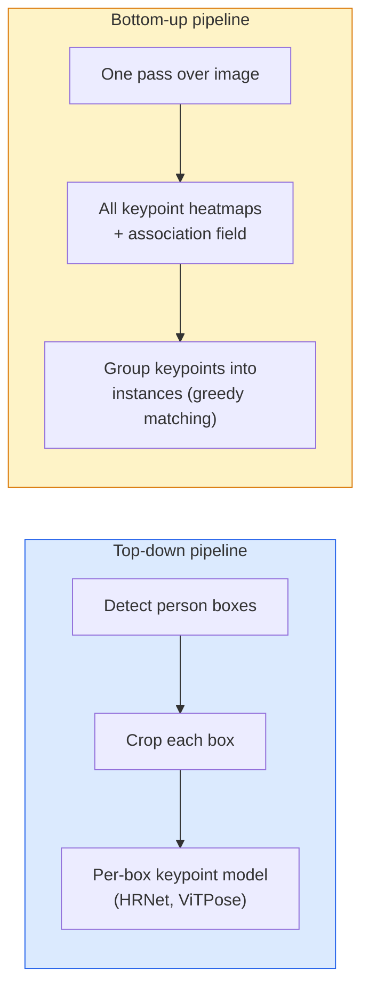

# الكشف عن النقاط الرئيسية وتقدير الموقف

> واحد وضع هو مجموعة من نقاط المفاتيح. واحد كيبونيت كيبونيت كيبونيت كيبونيت كيبونيت كيبونيت كيبونيت كيبونيت كيبونيت كيبونيت كيبونيت كيبونيت كيبونيت كيبونيت كيبونيت كيبونيت كيبونيت كيبونيت كيبونيت كيبونيت كيبونيت كيبونيت كيبونيت كيبونيت كيبونيت كيبونيت كيبونيت كيبونيت كيبونيت كيبونيت كيبونيت كيبونيت كيبونيت كيبونيت كيبونيت كيبونيت كيبونيت كيبونيت كيبونيت كيبونيت كيبونيت كيبونيت كيبونيت كيبونيت كيبونيت كيبونيت كيبونيت كيبونيت كيبونيت كيبونيت كيبونيت

**Type:** Build
**Languages:** Python
**Prerequisites:** Phase 4 Lesson 06 (Detection), Phase 4 Lesson 07 (U-Net)
**Time:** ~45 分钟

## 學习目标
- 区分 أعلى إلى أسفل و التقديرات على وضع أعلى إلى أسفل،并说明各自何时使用
- استخدام غوسيان-للمفتاح نقطة هدف ل K 个 نقاط مفتاح خرائط الحرارة التراجعة، واستنتاج 时提取 نقاط مفتاح
-  شرح جزء حقل التواصل (PAFs) ، وكذلك خطوط الأنابيب من أسفل إلى أعلى  كيفية وضع نقاط رئيسية 关联成 حالات
- استخدام MediaPipe Pose أو MMPose لقيام تقديرات نقطة رئيسية في مستوى الإنتاج ، ومعرفة نمط إصدارها

## 问题
مهام المهام الرئيسية هناك العديد من الاسماء: المظهر البشري ((17 مفصل الجسم) 、الملامح الرائعة ((68 أو 478 个点) 、اليد ((21 个点) 、الموقف الحيواني٬الموضع الروبوتي للشئ الرائد٬الملامح الرائعة للشخصيات الطبية── كلها تشارك مع نفس الهيكل:

تقدير الموقف هو التقاط الحركة٬ تطبيقات اللياقة البدنية٬ تحليل الرياضة٬ التحكم في الإيماءات٬ الحركة٬ التنفس٬ تجربة الذكاء العصري و التقاط الروبوتات٬ الأساس

مشكلة المهنية في الحجم. 单图、单人 Pose 是一个20ms 问题. 的人群中的多人 Pose 要在30fps 下运行,则是一个结构完全不同的问题.

## 概念
### من أعلى إلى أسفل مقابل أسفل إلى الأعلى



- **Top-down** قبل الاختبار الناس، مرة أخرى على كل محصول 运行 لكل شخص نموذج نقطة رئيسية 
- **Bottom-up**                                                                                                                                                                                                                                                              

أعلى إلى أسفل ((HRNet، ViTPose) هو بالضبط المخطط المُتَقَدِّم؛ أسفل إلى الأعلى ((OpenPose، HigherHRNet) هو المشهد المزدحمة وسط الانخراط المُتَقَدِّم.

### تراجع خريطة الحرارة

لا تتراجع مباشرة`(x, y)`و لكن لكل نقطة رئيسية`H x W`خريطة الحرارة، في وسط الموقع الحقيقي هناك نقطة غوسية

```
target[k, y, x] = exp(-((x - cx_k)^2 + (y - cy_k)^2) / (2 sigma^2))
```

في الاستنتاج، كل خريطة حرارة argmax هو المكان المفتاح للتنبؤ.

لماذا خرائط الحرارة أفضل من التراجع المباشر: هيكل الفضاء للشبكة (conv خريطة ميزة) الطبيعي على المجال المنتج.

### تحديد موقع الفرعية للبيكسل

argmax  اعطاء عدد كامل坐标. من أجل الحصول على دقة من النقاط الفرعية، يمكن أن تكون على argmax  ومعها المجال الملائم الموازاة، أو استخدام تعويضات عادية `(dx, dy) = 0.25 * (heatmap[y, x+1] - heatmap[y, x-1], ...)`الاتجاه

### حقل التواصل الجزئي (PAFs)

OpenPose باستخدام مهارات الربط من أسفل إلى الأعلى. بالنسبة لكل نقطة رئيسية للاتصال (مثل الكتف الأيسر إلى الكتف الأيسر) ، تحديد حقل قناة 2، والترميز من نقطة واحدة إلى نقطة أخرى. يجب أن يرتبط الكتف مع الكتف الآخر، على طول الاتصال مع زوجات المرشحين.

```
For each connection (limb):
  PAF channels: 2 (unit vector x, y)
  Line integral: sum over sample points of (PAF . line_direction)
  Higher integral = stronger match
```

هذه الطريقة رائعة، ولا تحتاج إلى محاصيل لكل شخص، يمكن أن تتوسع إلى أي حجم الجمهور.

### نقاط المفاتيح COCO

标准的体姿数据集:每个人 17 个关键点,使用PCK(百分比正确关键点) 和OKS(对象关键点相似性) كمقاييس.

### 2D مقابل 3D

- **2D pose** نقاط تصوير؛ لقد تم تحقيقه
- **3D pose** العالم / أهمية الكاميرا; ما زالت نشطة في دراسة الاتجاهات.
  - باستخدام MLP صغير سوف يرفع التنبؤات 2D إلى 3D
  - مباشرة من الصورة القيام بالعودة ثلاثية الأبعاد ((PyMAF، MHFormer)
  - إعدادات متعددة الرؤية (CMU Panoptic) تستخدم الحقيقة الأرضية


```figure
cv3-pose-heatmap
```

## بناءها
### الخطوة 1: هدف خريطة الحرارة غوسية

```python
import numpy as np
import torch

def gaussian_heatmap(size, cx, cy, sigma=2.0):
    yy, xx = np.meshgrid(np.arange(size), np.arange(size), indexing="ij")
    return np.exp(-((xx - cx) ** 2 + (yy - cy) ** 2) / (2 * sigma ** 2)).astype(np.float32)

hm = gaussian_heatmap(64, 32, 32, sigma=2.0)
print(f"peak: {hm.max():.3f} at ({hm.argmax() % 64}, {hm.argmax() // 64})")
```

على طول محور القناة  تراكم خرائط حرارة لكل نقطة مفتاحية، نحصل على كامل الجهد المستهدف

### الخطوة 2: رأس المفتاح الصغير

نموذج على شكل شبكة يو، وتخرج قنوات خريطة الحرارة K 个

```python
import torch.nn as nn
import torch.nn.functional as F

class TinyKeypointNet(nn.Module):
    def __init__(self, num_keypoints=4, base=16):
        super().__init__()
        self.down1 = nn.Sequential(nn.Conv2d(3, base, 3, 2, 1), nn.ReLU(inplace=True))
        self.down2 = nn.Sequential(nn.Conv2d(base, base * 2, 3, 2, 1), nn.ReLU(inplace=True))
        self.mid = nn.Sequential(nn.Conv2d(base * 2, base * 2, 3, 1, 1), nn.ReLU(inplace=True))
        self.up1 = nn.ConvTranspose2d(base * 2, base, 2, 2)
        self.up2 = nn.ConvTranspose2d(base, num_keypoints, 2, 2)

    def forward(self, x):
        h1 = self.down1(x)
        h2 = self.down2(h1)
        h3 = self.mid(h2)
        u1 = self.up1(h3)
        return self.up2(u1)
```

输入 `(N, 3, H, W)`, الخروج`(N, K, H, W)`فقدان هو في الهدف الغوسسي من كل بيكسل من MSE

### 步骤 3: إيجاز  استخراج نقاط المفتاح

```python
def heatmap_to_coords(heatmaps):
    """
    heatmaps: (N, K, H, W)
    returns:  (N, K, 2) float coordinates in image pixels
    """
    N, K, H, W = heatmaps.shape
    hm = heatmaps.reshape(N, K, -1)
    idx = hm.argmax(dim=-1)
    ys = (idx // W).float()
    xs = (idx % W).float()
    return torch.stack([xs, ys], dim=-1)

coords = heatmap_to_coords(torch.randn(2, 4, 32, 32))
print(f"coords: {coords.shape}")  # (2, 4, 2)
```

الإستدلال 时只需一行── بالنسبة لتحسين البيكسلات الفرعية، في argmax 周围插值──

### 步骤 4: مجموعة بيانات نقطة مفتاحية اصطناعية

很简单: على اللوحة البيضاء 上画四个点,并学习预测它们──

```python
def make_synthetic_sample(size=64):
    img = np.ones((3, size, size), dtype=np.float32)
    rng = np.random.default_rng()
    kps = rng.integers(8, size - 8, size=(4, 2))
    for cx, cy in kps:
        img[:, cy - 2:cy + 2, cx - 2:cx + 2] = 0.0
    hms = np.stack([gaussian_heatmap(size, cx, cy) for cx, cy in kps])
    return img, hms, kps
```

هذه المهمة بسيطة جداً، النموذج الصغير في دقيقة واحدة

### الخطوة 5: التدريب

```python
model = TinyKeypointNet(num_keypoints=4)
opt = torch.optim.Adam(model.parameters(), lr=3e-3)

for step in range(200):
    batch = [make_synthetic_sample() for _ in range(16)]
    imgs = torch.from_numpy(np.stack([b[0] for b in batch]))
    hms = torch.from_numpy(np.stack([b[1] for b in batch]))
    pred = model(imgs)
    # Upsample pred to full resolution
    pred = F.interpolate(pred, size=hms.shape[-2:], mode="bilinear", align_corners=False)
    loss = F.mse_loss(pred, hms)
    opt.zero_grad(); loss.backward(); opt.step()
```

## استخدمها
- **MediaPipe Pose** تقدير وضع مستوى الإنتاج من جوجل؛ يوفر WebGL + وقت تشغيل الهاتف المحمول، التأخير أقل من 10ms‬
- **MMPose**(OpenMMLab)  全面的研究代码库;包含每种SOTA架构 及预训练的权重──
- **YOLOv8-pose** 最快的实时多人姿势,使用单次前进通行――
- **transformers HumanDPT / PoseAnything** باستخدام وضع لغة مفتوحة ((أي شيء أو مجموعة من نقاط مفتاحة) مقارنة مع نهج لغة الرؤية الجديدة

## 交付 it
本课产出:

- `outputs/prompt-pose-stack-picker.md` إشارة سريعة، يمكن أن تتم حسب التأخير ‬حجم الحشد، وكذلك 2D مقابل 3D 需求选择 MediaPipe / YOLOv8-pose / HRNet / ViTPose‬
- `outputs/skill-heatmap-to-coords.md` مهارة، لتكوين كل نموذج وضع الإنتاج مدينة تستخدم حتى خريطة حرارة لتنسيق الروتين الفرعية البيكسل

## التدريب
1. **(Easy)**في مجموعة بيانات اصطناعية من 4 نقاط 上训练小型 نموذج نقطة مفتاحة― تقرير 200 خطوة 后预测与真键点 之间的平均 L2错误―
2. **(Medium)**إضافة التحسين الفرعي للبيكسل: إعطاء موقع argmax محدد، على طول x 和 y 方向 باستخدام البيكسلات القريبة 拟合1D الموازاة。 تقرير مقارنة مع عدد argmax الدقة المزدهرة。
3. **(Hard)**إنشاء مجموعة بيانات اصطناعية من شخصين ، من بينها كل صورة  تظهر اثنين من الحالات نمط 4 نقاط مفتاحة ‬‬‬‬‬‬‬‬‬‬‬‬‬‬‬‬‬‬‬‬‬‬‬‬‬‬‬‬‬‬‬‬‬‬‬‬‬‬‬‬‬‬‬‬‬‬‬‬‬‬‬‬‬‬‬‬‬‬‬‬‬‬‬‬‬‬‬‬‬‬‬‬‬‬‬‬‬‬‬‬‬‬‬‬‬‬‬‬‬‬‬‬‬‬‬‬‬‬‬‬‬‬‬‬‬‬‬‬‬‬‬‬‬‬‬‬‬‬‬‬‬‬‬‬‬‬‬‬‬‬‬‬‬‬‬‬‬‬‬‬‬‬‬‬‬‬‬‬‬‬‬‬‬‬‬‬‬‬‬‬‬‬‬‬‬‬‬‬‬‬‬‬‬‬‬‬‬‬‬‬‬‬‬‬‬‬‬‬‬‬‬‬‬‬‬‬‬‬‬‬‬‬‬‬‬‬‬‬‬‬‬‬‬‬‬‬‬‬‬‬‬‬‬‬‬‬‬‬‬‬‬‬‬‬‬‬‬‬‬‬‬‬‬‬‬‬‬‬‬‬‬‬‬‬‬‬‬‬‬‬‬‬‬‬‬‬‬‬‬‬‬‬‬‬‬‬‬‬‬‬‬‬‬‬‬‬‬‬‬‬‬‬‬‬‬‬‬‬‬‬‬‬‬‬‬‬‬‬‬‬‬‬‬‬‬‬‬‬‬‬‬‬‬‬‬‬‬‬‬‬‬‬‬‬‬‬‬‬‬‬‬‬‬‬‬‬‬‬‬‬‬‬‬‬‬‬‬‬‬‬‬‬‬‬‬‬‬‬‬‬‬‬‬‬‬‬‬‬‬‬‬‬‬‬‬‬‬‬‬‬‬‬‬‬‬‬‬‬‬‬‬‬‬‬‬‬‬‬‬‬‬‬‬‬‬‬‬‬‬‬‬‬‬‬‬‬‬‬‬‬‬‬‬‬‬‬‬‬‬‬‬‬‬‬‬‬‬‬‬‬‬‬‬‬‬‬‬‬‬‬‬‬‬‬‬‬‬‬‬‬‬‬‬‬‬‬

## 关键术语
| Term | 人们怎么说 | 它实际是什么意思 |
|------|----------------|----------------------|
| Keypoint | "一个 landmark" | object 上的一个特定有序点（joint、corner、feature） |
| Pose | "skeleton" | 属于一个 instance 的一组有序 keypoints |
| Top-down | "先 detect，再 pose" | Two-stage pipeline：person detector + per-crop keypoint model；准确率最高 |
| Bottom-up | "先 pose，后 group" | Single-pass all-keypoint prediction + grouping；在 crowd size 上耗时恒定 |
| Heatmap | "Gaussian target" | 每个 keypoint 一个 H x W tensor，峰值位于真实位置；首选的 Regression target |
| PAF | "Part Affinity Field" | 编码 limb directions 的 2-channel unit vector field；用于把 keypoints 分组为 instances |
| OKS | "Keypoint IoU" | Object Keypoint Similarity；COCO 的 pose metric |
| HRNet | "High-Resolution Net" | 主流 top-down keypoint architecture；全程保留 high-res features |

## 延伸阅读
- [OpenPose (Cao et al., 2017)](https://arxiv.org/abs/1812.08008) استخدام PAFs من أسفل إلى الأعلى؛ لا يزال أفضل مادة تشرح هذه الطريقة
- [HRNet (Sun et al., 2019)](https://arxiv.org/abs/1902.09212) من أعلى إلى أسفل 参考架构
- [ViTPose (Xu et al., 2022)](https://arxiv.org/abs/2204.12484)استخدام بسيط في تي كعظم الظهر المظهر في العديد من المعايير 上是当前 SOTA
- [MediaPipe Pose](https://developers.google.com/mediapipe/solutions/vision/pose_landmarker) وضع في الوقت الحقيقي في مستوى الإنتاج؛2026 سال部署最快的堆
