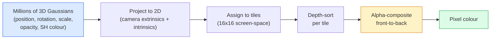

# من التحقق من 3D غوسيان Splatting

> المشهد هو مجموعة من الملايين من غوسيان 3D  المكونة من السحاب ٬ كل غوسيان لديها موقف٬ توجيه٬ مقياس٬ عكسية، فضلا عن اعتمادا على اتجاه المشاهدة من اللون٬٬ على أن يتم تشكيلها ، من خلال تشكيلها ، القيام بعمل التوجه الخلفي ، على الانتهاء٬٬

**类型：**الإنشاء
**语言：**بايثون
**先修要求：**المرحلة 4 الدروس 13 (3D Vision & NeRF)
**时间：**حوالي 90 دقيقة

## 學习目标

-  شرح لماذا حتى 2026 عام، 3D غوسيان Splatting  قد تم استبدال NeRF، لتصبح خطة قياسية لإنشاء 3D تصوير الواقعية
- يقولون عن كل غوسيانة ستة فئة من العناصر ((موقف ‬التناوب الرباعي ‬المقياس ‬الغموض ‬الآرمونيكات الكرة ‬الميزة الاختيارية) ، وكذلك كل فئة من المشاركات كمية العائمة
- من التحقق من استخدام`alpha`تصميم 2D غوسيان splating rasterizer، ثم تشرح 3D كيفية وضع الصور إلى نفس الدورة
- استخدام `nerfstudio`.`gsplat`أو`SuperSplat`من 20-50 张照片 إعادة بناء منظر،并导出为 `KHR_gaussian_splatting`إضافة GTF أو OpenUSD 26.03 `UsdVolParticleField3DGaussianSplat`النظام

## 问题

سوف تخزن NeRF المشهد على وزن واحد من MLP. كل بكسل من المشهد المخرج يحتاج إلى امتداد شعاع واحد. إجراء مئات المرات من المشهد الملموس. التدريب يحتاج إلى ساعات قليلة، التدريب يحتاج إلى بضع ثوان، والوزن لا يمكن تحديده. إذا كنت تريد تحريك كرسيه في المشهد، يجب عليك إعادة التدريب.

تم استبدال كل هذا. تمثل المشهد مجموعة من المواقع 3D Gaussian ‬‬‬‬‬‬‬‬‬‬‬‬‬‬‬‬‬‬‬‬‬‬‬‬‬‬‬‬‬‬‬‬‬‬‬‬‬‬‬‬‬‬‬‬‬‬‬‬‬‬‬‬‬‬‬‬‬‬‬‬‬‬‬‬‬‬‬‬‬‬‬‬‬‬‬‬‬‬‬‬‬‬‬‬‬‬‬‬‬‬‬‬‬‬‬‬‬‬‬‬‬‬‬‬‬‬‬‬‬‬‬‬‬‬‬‬‬‬‬‬‬‬‬‬‬‬‬‬‬‬‬‬‬‬‬‬‬‬‬‬‬‬‬‬‬‬‬‬‬‬‬‬‬‬‬‬‬‬‬‬‬‬‬‬‬‬‬‬‬‬‬‬‬‬‬‬‬‬‬‬‬‬‬‬‬‬‬‬‬‬‬‬‬‬‬‬‬‬‬‬‬‬‬‬‬‬‬‬‬‬‬‬‬‬‬‬‬‬‬‬‬‬‬‬‬‬‬‬‬‬‬‬‬‬‬‬‬‬‬‬‬‬‬‬‬‬‬‬‬‬‬‬‬‬‬‬‬‬‬‬‬‬‬‬‬‬‬‬‬‬‬‬‬‬‬‬‬‬‬‬‬‬‬‬‬‬‬‬‬‬‬‬‬‬‬‬‬‬‬‬‬‬‬‬‬‬‬‬‬‬‬‬‬‬‬‬‬‬‬‬‬‬‬‬‬‬‬‬‬‬‬‬‬‬‬‬‬‬‬‬‬‬‬‬‬‬‬‬‬‬‬‬‬‬‬‬‬‬‬‬‬‬‬‬‬‬‬‬‬‬‬‬‬‬‬‬‬‬‬‬‬‬‬‬‬‬‬‬‬‬‬‬‬‬‬‬‬‬‬‬‬‬‬‬‬‬‬‬‬‬‬‬‬‬‬‬‬‬‬‬‬‬‬‬‬‬‬‬‬‬‬‬‬‬‬‬‬‬‬‬‬‬‬‬‬‬‬‬‬‬‬‬‬‬‬‬‬‬‬‬‬‬‬‬‬‬‬‬‬‬‬‬‬‬‬‬‬‬‬‬‬‬‬‬‬‬‬‬

النموذج هو بسيط جدا، ولكن هناك ما يكفي من عناصر النشاط الرياضية، بحيث أن معظم المنتجات سوف تبدأ من الراستريزة، ثم تقفز من خلال الإشارة والهرمونيات الكرة.

## مفهوم الأساسي

### غوسيان يحمل ماذا

غوسيان ثلاثي الأبعاد هو فجأة معادلة في الفضاء، مع هذه الصفات:

```
position         mu         (3,)    centre in world coordinates
rotation         q          (4,)    unit quaternion encoding orientation
scale            s          (3,)    log-scales per axis (exponentiated at render time)
opacity          alpha      (1,)    post-sigmoid opacity [0, 1]
SH coefficients  c_lm       (3 * (L+1)^2,)   view-dependent colour
```

الدوران + النطاق 会构建一个3x3 تغلبة:`Sigma = R S S^T R^T`هذا هو شكل غوسيان في 3D. الموجات المكافحة للون: السماح لونك بتحرك الرؤية بتغيير: الاكتشافات المميزة، والنضارة الصغيرة، والنضار المعتمد على الرؤية، ولا تحتاج إلى تخزين النسق لكل عرض.

في المشهد واحد عادة ما يكون هناك 1-5 مليون غوسيان. في كل حالة تخزين 60 نطاقاً.

### هو التشويش، ليس المشي الشعاعي



五个步骤,全都对 GPU友好──没有每个像素的 MLP查询──一张RTX 3080 Ti 可以以147fps染6000000个位置──

### التنبؤ 步骤

 في الموقف العالمي `mu`、 لديها تغطية ثلاثية الأبعاد `Sigma`3D Gaussian، سوف تنظر إلى وضع الشاشة`mu'`、 لديها تغطية ثنائية الأبعاد `Sigma'`من غوسيان 2D:

```
mu' = project(mu)
Sigma' = J W Sigma W^T J^T          (2 x 2)

W = viewing transform (rotation + translation of camera)
J = Jacobian of the perspective projection at mu'
```

بصمة غوسيان الثانية الأبعاد هي كيسة،`Sigma'`الجهاز المتحكم في الجهاز نفسه. كل بكسل داخل هذا التمثال يتلقى مساهمة غوسيان هذه.`exp(-0.5 * (p - mu')^T Sigma'^-1 (p - mu'))`.

### الاصطلاح الفائقي 规则

بالنسبة لبرمجة واحدة، غاوسيون غاوسيونها سوف يقومون بتحديد التوجه التاخذي 排序((أو等价地، باستخدام عكس التوجه المادية حسب التوجه التاخذي 排序)

```
C_pixel = sum_i alpha_i * T_i * c_i

T_i = prod_{j < i} (1 - alpha_j)       transmittance up to i
alpha_i = opacity_i * exp(-0.5 * d^T Sigma'^-1 d)   local contribution
c_i = eval_SH(SH_i, view_direction)    view-dependent colour
```

هذا مع**NeRF 的 volumetric render 是同一个方程**، إلا أن هنا في مجموعة من غوسيانات نادرة واضحة محاسبة ، وليس في عينات كثيفة فوق الأشعة محاسبة.

### لماذا هو قابل للتفريق

كل خطوة: الإشارة، تعيين الطائل، تأليف الألفا، تقييم SH،都 مقارنة مع غوسيان 参数是可分的──给定一张 ground-truth image,计算 rendered pixel Loss,通过 rasteriser 进行 backprop, باستخدام Gradient Descent 更新所有`(mu, q, s, alpha, c_lm)`بعد 30 ألف مرة من التكرار، سوف تجد الغوسيان الموقع الصحيح، والقياس واللون

### التثبيت والقَصْر

عدد ثابت من الغوسيان 无法覆盖复杂场景── التدريب يحتوي على آليات تطابق نفسها:

- **Clone**عندما يكون غوسياناً من حجم الدرجة عالياً جداً ولكن على نطاق واسع جداً، في الموقع الحالي، يتم بناء غوسياناً.
- **Split**: عندما يكون غوسيان كبير على نطاق واسع 很高时, سوف تفكيكه إلى غوسيان أصغر .
- **Prune**: حذف التضليل 低于值的高西ans──它们没有贡献──

التكثيف كل مرة N مرة التكرار 运行一次──场景 عادة ما يكون من حوالي 100k 个初始高西ans(من خلال نقاط SfM初始化) النمو إلى نهاية التدريب 1-5M──

### 用一段话 فهم الهارمونيكات الكرة

اللون يعتمد على النظر هو وظيفة على سطح الوحدة`c(direction)`هارمونيكاً كرويّةً هي أساس فوريه على سطح الكرة`L`كل قناة ستحصل`(L+1)^2`个基因函数──为一个新视角评估颜色,就是将学到的SH系数与在观看方向上求值的基础做点产品──度 0 = 一个系数 = 恒定颜色──度 3 = 16 个系数 = 足以捕捉拉伯特的阴影、特殊和轻微反射──3D Gaussian Splating 论文默认使用度 3──

### 2026 سنة التكنولوجيا الإنتاجية

```
1. Capture         smartphone / DJI drone / handheld scanner
2. SfM / MVS       COLMAP or GLOMAP derives camera poses + sparse points
3. Train 3DGS      nerfstudio / gsplat / inria official / PostShot (~10-30 min on RTX 4090)
4. Edit            SuperSplat / SplatForge (clean floaters, segment)
5. Export          .ply -> glTF KHR_gaussian_splatting or .usd (OpenUSD 26.03)
6. View            Cesium / Unreal / Babylon.js / Three.js / Vision Pro
```

### 4D مع التحولات التوليدية

- **4D Gaussian Splatting**: غوسيانز هي وظيفة الوقت؛ تستخدم في الفيديو الحجمي ((سوبرمان 2026, A$AP روكي "الروحية") ").
- **Generative splats**النماذج من النص إلى الفضاء ((الماربور العالمي) ، يمكن أن تلهو خارج المشهد كاملة
- **3D Gaussian Unscented Transform**:NVIDIA NuRec تستخدم في محاكاة القيادة الذاتية


```figure
cv3-gaussian-splat
```

## بناءها

### الخطوة 1: 2D غوسيان

أولاً بناء مسطح 2D.

```python
import torch
import torch.nn as nn
import torch.nn.functional as F


def eval_2d_gaussian(means, covs, points):
    """
    means:  (G, 2)      centres
    covs:   (G, 2, 2)   covariance matrices
    points: (H, W, 2)   pixel coordinates
    returns: (G, H, W)  density at every pixel for every Gaussian
    """
    G = means.size(0)
    H, W, _ = points.shape
    flat = points.view(-1, 2)
    inv = torch.linalg.inv(covs)
    diff = flat[None, :, :] - means[:, None, :]
    d = torch.einsum("gpi,gij,gpj->gp", diff, inv, diff)
    density = torch.exp(-0.5 * d)
    return density.view(G, H, W)
```

`einsum`会对每个 (غوسيان، بيكسل) زوج  حساب الشكل التربيعي `diff^T Sigma^-1 diff`.

### 步骤 2:2D شقق الدرع

التركيب الفائي من الأمام إلى الوراء. في العمق في 2D ليس هناك أي معنى لذلك نستخدم مقياس غوسياني تعلم من أجل إظهار النظام.

```python
def rasterise_2d(means, covs, colours, opacities, depths, image_size):
    """
    means:     (G, 2)
    covs:      (G, 2, 2)
    colours:   (G, 3)
    opacities: (G,)     in [0, 1]
    depths:    (G,)     per-Gaussian scalar used for ordering
    image_size: (H, W)
    returns:   (H, W, 3) rendered image
    """
    H, W = image_size
    yy, xx = torch.meshgrid(
        torch.arange(H, dtype=torch.float32, device=means.device),
        torch.arange(W, dtype=torch.float32, device=means.device),
        indexing="ij",
    )
    points = torch.stack([xx, yy], dim=-1)

    densities = eval_2d_gaussian(means, covs, points)
    alphas = opacities[:, None, None] * densities
    alphas = alphas.clamp(0.0, 0.99)

    order = torch.argsort(depths)
    alphas = alphas[order]
    colours_sorted = colours[order]

    T = torch.ones(H, W, device=means.device)
    out = torch.zeros(H, W, 3, device=means.device)
    for i in range(means.size(0)):
        a = alphas[i]
        out += (T * a)[..., None] * colours_sorted[i][None, None, :]
        T = T * (1.0 - a)
    return out
```

انها ليست سريعة، حقا تنفيذ استخدام الأجزاء CUDA القائمة على البلاط، ولكن الرياضيات صحيحة تماما، ويمكن التمييز تماما.

### الخطوة 3: مشهد 2D المزق يمكن تدريب

```python
class Splats2D(nn.Module):
    def __init__(self, num_splats=128, image_size=64, seed=0):
        super().__init__()
        g = torch.Generator().manual_seed(seed)
        H, W = image_size, image_size
        self.means = nn.Parameter(torch.rand(num_splats, 2, generator=g) * torch.tensor([W, H]))
        self.log_scale = nn.Parameter(torch.ones(num_splats, 2) * math.log(2.0))
        self.rot = nn.Parameter(torch.zeros(num_splats))  # single angle in 2D
        self.colour_logits = nn.Parameter(torch.randn(num_splats, 3, generator=g) * 0.5)
        self.opacity_logit = nn.Parameter(torch.zeros(num_splats))
        self.depth = nn.Parameter(torch.rand(num_splats, generator=g))

    def covs(self):
        s = torch.exp(self.log_scale)
        c, si = torch.cos(self.rot), torch.sin(self.rot)
        R = torch.stack([
            torch.stack([c, -si], dim=-1),
            torch.stack([si, c], dim=-1),
        ], dim=-2)
        S = torch.diag_embed(s ** 2)
        return R @ S @ R.transpose(-1, -2)

    def forward(self, image_size):
        covs = self.covs()
        colours = torch.sigmoid(self.colour_logits)
        opacities = torch.sigmoid(self.opacity_logit)
        return rasterise_2d(self.means, covs, colours, opacities, self.depth, image_size)
```

`log_scale`.`opacity_logit`和 `colour_logits`                                                                                                                                                                                                                                                              

### الخطوة 4: سوف 2D غوسيانات 拟合到目标图像

```python
import math
import numpy as np

def make_target(size=64):
    yy, xx = np.meshgrid(np.arange(size), np.arange(size), indexing="ij")
    img = np.zeros((size, size, 3), dtype=np.float32)
    # Red circle
    mask = (xx - 20) ** 2 + (yy - 20) ** 2 < 10 ** 2
    img[mask] = [1.0, 0.2, 0.2]
    # Blue square
    mask = (np.abs(xx - 45) < 8) & (np.abs(yy - 40) < 8)
    img[mask] = [0.2, 0.3, 1.0]
    return torch.from_numpy(img)


target = make_target(64)
model = Splats2D(num_splats=64, image_size=64)
opt = torch.optim.Adam(model.parameters(), lr=0.05)

for step in range(200):
    pred = model((64, 64))
    loss = F.mse_loss(pred, target)
    opt.zero_grad(); loss.backward(); opt.step()
    if step % 40 == 0:
        print(f"step {step:3d}  mse {loss.item():.4f}")
```

عبر 200 خطوة، 64 غوسيان سوف تحصل على هذه الصيغين. هذا هو كل فكرة: في البدائيات العريضة

### الخطوة 5: من 2D إلى 3D

3D  توسيع الحفاظ على نفس الدورة.

1. كل دورة غوسية هي الرباعية، وليس زاوية واحدة.
2. التباين هو`R S S^T R^T`، من بينهم`R`بواسطة Quaternion`S = diag(exp(log_scale))`.
3. التنبؤ`(mu, Sigma) -> (mu', Sigma')`استخدام كاميرات خارجية، فضلاً عن`mu`处的视角投影 جاكوبيان。
4. اللون يُصبح توسعًا في التناغم الكروي؛ في اتجاه المشاهدة 上评估它──
5. نوع العمق يأتي من الفضاء الفضائي الحقيقي من الكاميرا، بدلا من التعلم القياسية

كل إنتاج تحقق`gsplat`.`inria/gaussian-splatting`.`nerfstudio`) كل ما نفعله في الجيبو باستخدام أجزاء CUDA القائمة على البلاط هو هذا

### الخطوة 6: تقييم الأرمنيات الكهروموسيفية

أعلى مستوى 3 من قاعدة SH لكل قناة 16 نقطة.

```python
def eval_sh_degree_3(sh_coeffs, dirs):
    """
    sh_coeffs: (..., 16, 3)   last dim is RGB channels
    dirs:      (..., 3)       unit vectors
    returns:   (..., 3)
    """
    C0 = 0.282094791773878
    C1 = 0.488602511902920
    C2 = [1.092548430592079, 1.092548430592079,
          0.315391565252520, 1.092548430592079,
          0.546274215296039]
    x, y, z = dirs[..., 0], dirs[..., 1], dirs[..., 2]
    x2, y2, z2 = x * x, y * y, z * z
    xy, yz, xz = x * y, y * z, x * z

    result = C0 * sh_coeffs[..., 0, :]
    result = result - C1 * y[..., None] * sh_coeffs[..., 1, :]
    result = result + C1 * z[..., None] * sh_coeffs[..., 2, :]
    result = result - C1 * x[..., None] * sh_coeffs[..., 3, :]

    result = result + C2[0] * xy[..., None] * sh_coeffs[..., 4, :]
    result = result + C2[1] * yz[..., None] * sh_coeffs[..., 5, :]
    result = result + C2[2] * (2.0 * z2 - x2 - y2)[..., None] * sh_coeffs[..., 6, :]
    result = result + C2[3] * xz[..., None] * sh_coeffs[..., 7, :]
    result = result + C2[4] * (x2 - y2)[..., None] * sh_coeffs[..., 8, :]

    # degree 3 terms omitted here for brevity; full 16-coefficient version in the code file
    return result
```

تعلمت`sh_coeffs`存储该高斯的在每个方向上的颜色──在转载时间,将其与当前视图方向 求值,得到一个3向向 RGB──

## استخدمها

3DGS الحقيقي 工作请使用 `gsplat`(ميتا) أو `nerfstudio`:

```bash
pip install nerfstudio gsplat
ns-download-data example
ns-train splatfacto --data path/to/data
```

`splatfacto`هو مدرب 3DGS في استوديو العصبية. بالنسبة للمشهد النموذجي، في RTX 4090،

2026 سنة تستحق الاهتمام

- `.ply`:原始 غوسسي سحابة ((可移植,文件最大) 』
- `.splat`:PlayCanvas / SuperSplat كمية 格式。
- غالف`KHR_gaussian_splatting`:Khronos 标准,可在观众 间移植(2026 年 2 月 RC) 』
- أوفن دولس`UsdVolParticleField3DGaussianSplat`:USD-أصلي، يستخدم في خطوط أنابيب NVIDIA Omniverse و Vision Pro

بالنسبة للمشاهد 4D / ديناميكية،`4DGS`和 `Deformable-3DGS`استخدام المتغيرات في الوقت مع عدم وضوحات  توسيع نفس المكونات

## 交付 it

本课会产出:

- `outputs/prompt-3dgs-capture-planner.md`: عرض، يستخدم لموقف محدد نوع التخطيط لالتقاط جلسة ((عدد الصور
- `outputs/skill-3dgs-export-router.md`: مهارة، تستخدم حسب المشاهد أو المحرك 选择合适的出口格式(`.ply`- لا ، لا`.splat`/ glTF / USD)

## التدريب

1. **（简单）**في صورة اصطناعية أخرى على متن مدربة 2D`num_splats`في`[16, 64, 256]`في كل حالة، رسم مكس مقابل خطوة.
2. **（中等）**扩展2D rasteriser,使其支持每-غوسيان RGB الألوان, هذه الألوان 通过 درجة-2 هرمونية يعتمد على حجم view angle──在一组目标图像对上训练,并验证模型能重建二者──
3. **（困难）**النسخة`nerfstudio`، باستخدام 20 صورة من المشهد الخاص بك أيّة صورة`splatfacto` إصدار إلى GTF `KHR_gaussian_splatting`, وفي المشاهد ((Three.js `GaussianSplats3D`、SuperSplat、Babylon.js V9) 中打开──報告訓練時間、Gaussians 数量和染 fps──

## 关键术语

| Term | 人们通常怎么说 | 它实际意味着什么 |
|------|----------------|----------------------|
| 3DGS | "Gaussian splats" | 将场景显式表示为数百万个 3D Gaussians，每个 Gaussian 带有 position、rotation、scale、opacity、SH colour |
| Covariance | "Shape of the Gaussian" | `Sigma = R S S^T R^T`；一个 Gaussian 的 orientation 与 anisotropic scale |
| Alpha compositing | "Back-to-front blend" | 与 NeRF 的 volumetric render 相同的方程，但现在作用在显式稀疏集合上 |
| Densification | "Clone and split" | 在 reconstruction under-fit 的位置自适应添加新 Gaussians |
| Pruning | "Delete low-opacity" | 移除训练过程中 opacity 已塌缩到接近零的 Gaussians |
| Spherical harmonics | "View-dependent colour" | 球面上的 Fourier basis；将 colour 存储为 viewing direction 的函数 |
| Splatfacto | "nerfstudio's 3DGS" | 2026 年训练 3DGS 最简单的路径 |
| `KHR_gaussian_splatting` | "glTF standard" | Khronos 2026 extension，使 3DGS 能在 viewers 和 engines 之间移植 |

## 延伸阅读

- [3D Gaussian Splatting for Real-Time Radiance Field Rendering (Kerbl et al., SIGGRAPH 2023)](https://repo-sam.inria.fr/fungraph/3d-gaussian-splatting/) 原始论文
- [gsplat (Meta/nerfstudio)](https://github.com/nerfstudio-project/gsplat) 生产级 CUDA راستريزر
- [nerfstudio Splatfacto](https://docs.nerf.studio/nerfology/methods/splat.html) 参考 تدريبات
- [Khronos KHR_gaussian_splatting extension](https://github.com/KhronosGroup/glTF/blob/main/extensions/2.0/Khronos/KHR_gaussian_splatting/README.md) 2026 سنة
- [OpenUSD 26.03 release notes](https://openusd.org/release/) `UsdVolParticleField3DGaussianSplat`النظام
- [THE FUTURE 3D State of Gaussian Splatting 2026](https://www.thefuture3d.com/blog-0/2026/4/4/state-of-gaussian-splatting-2026) 行业概览
