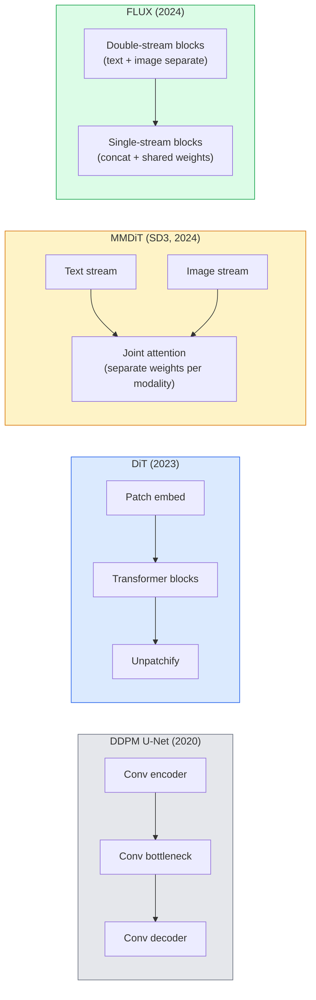

# محولات التفريق وتدفق المصلح

> إنّ شبكة الإنترنت ليست سرّ التوزيع. إذا قمت بإستبدالها بـ Transformer، وبدلت جدول الضوضاء إلى تدفق طريق مباشر، فجأة حصلت على SD3، و فلوكس، وكل نموذج نص إلى صورة عام 2026.

**类型：**学习 + 构建
**语言：**بايثون
**前置要求：**المرحلة 4 الدروس 10 (التفريق DDPM) ، المرحلة 4 الدروس 14 (ViT) ، المرحلة 7 الدروس 02 (الاهتمام الذاتي)
**时间：**حوالي 75 دقيقة

## 學习目标

-  تتبع من U-Net DDPM ((المرحلة 10) إلى محول التوزيع (DiT) 、MMDiT (SD3) ، وكذلك التطورات من واحد + مضاعفة التيار DiT (FLUX)
-  شرح التدفق المصلح: لماذا الصوت والبيانات  خطوط مستقيم يمكن أن يجعل النموذج تستخدم 20 خطوة بدلا من 1000 خطوة لإكمال الاستخدام
- تطبيق حلقة تدريبية صغيرة ومدورة تدريبية معقّلة، كلتا منها تحت السيطرة على 100 صف
-  حسب الهندسة المعمارية、عدد المعلمات 和 الترخيص 区分 النموذج المتغيرات(SD3、FLUX.1-dev、FLUX.1-schnell、Z-Image、Qwen-Image)

## 问题

الدرس 10 باستخدام U-Net denoiser  بني DDPM ‬ هذا التكوين استحوذ على 2020-2023 ‬: U-Net + جدول بيتا + فقدان التنبؤ بالضوضاء ‬‬‬‬‬‬‬‬‬‬‬‬‬‬‬‬‬‬‬‬‬‬‬‬‬‬‬‬‬‬‬‬‬‬‬‬‬‬‬‬‬‬‬‬‬‬‬‬‬‬‬‬‬‬‬‬‬‬‬‬‬‬‬‬‬‬‬‬‬‬‬‬‬‬‬‬‬‬‬‬‬‬‬‬‬‬‬‬‬‬‬‬‬‬‬‬‬‬‬‬‬‬‬‬‬‬‬‬‬‬‬‬‬‬‬‬‬‬‬‬‬‬‬‬‬‬‬‬‬‬‬‬‬‬‬‬‬‬‬‬‬‬‬‬‬‬‬‬‬‬‬‬‬‬‬‬‬‬‬‬‬‬‬‬‬‬‬‬‬‬‬‬‬‬‬‬‬‬‬‬‬‬‬‬‬‬‬‬‬‬‬‬‬‬‬‬‬‬‬‬‬‬‬‬‬‬‬‬‬‬‬‬‬‬‬‬‬‬‬‬‬‬‬‬‬‬‬‬‬‬‬‬‬‬‬‬‬‬‬‬‬‬‬‬‬‬‬‬‬‬‬‬‬‬‬‬‬‬‬‬‬‬‬‬‬‬‬‬‬‬‬‬‬‬‬‬‬‬‬‬‬‬‬‬‬‬‬‬‬‬‬‬‬‬‬‬‬‬‬‬‬‬‬‬‬‬‬‬‬‬‬‬‬‬‬‬‬‬‬‬‬‬‬‬‬‬‬‬‬‬‬‬‬‬‬‬‬‬‬‬‬‬‬‬‬‬‬‬‬‬‬‬‬‬‬‬‬‬‬‬‬‬‬‬‬‬‬‬‬‬‬‬‬‬‬‬‬‬‬‬‬‬‬‬‬‬‬‬‬‬‬‬‬‬‬‬‬‬‬‬‬‬‬‬‬‬‬‬‬‬‬‬‬‬‬‬‬‬‬‬‬‬‬‬‬‬‬‬‬‬‬‬‬‬‬‬‬‬‬‬‬‬‬‬‬‬‬‬‬‬‬‬‬‬‬‬‬‬‬‬

كل نموذج من أقدم النص إلى الصورة في عام 2026 قد تجاوزها. تارك ثابتا 3、FLUX、SD4、Z-Image、Qwen-Image、Hunyuan-Image لا يوجد واحد يستخدم U-Net.

هذا التحول مهم ، لأنه هو بالفعل التوليد الصوري القائم على التوزيع  أصبح قابل التحكم ‬سريع الدقة ‬SD3/SD4  حل النص 染) و كافياً بسرعة لبدء الإنتاج‬‬‬‬‬‬‬‬‬‬‬‬‬‬‬‬‬‬‬‬‬‬‬‬‬‬‬‬‬‬‬‬‬‬‬‬‬‬‬‬‬‬‬‬‬‬‬‬‬‬‬‬‬‬‬‬‬‬‬‬‬‬‬‬‬‬‬‬‬‬‬‬‬‬‬‬‬‬‬‬‬‬‬‬‬‬‬‬‬‬‬‬‬‬‬‬‬‬‬‬‬‬‬‬‬‬‬‬‬‬‬‬‬‬‬‬‬‬‬‬‬‬‬‬‬‬‬‬‬‬‬‬‬‬‬‬‬‬‬‬‬‬‬‬‬‬‬‬‬‬‬‬‬‬‬‬‬‬‬‬‬‬‬‬‬‬‬‬‬‬‬‬‬‬‬‬‬‬‬‬‬‬‬‬‬‬‬‬‬‬‬‬‬‬‬‬‬‬‬‬‬‬‬‬‬‬‬‬‬‬‬‬‬‬‬‬‬‬‬‬‬‬‬‬‬‬‬‬‬‬‬‬‬‬‬‬‬‬‬‬‬‬‬‬‬‬‬‬‬‬‬‬‬‬‬‬‬‬‬‬‬‬‬‬‬‬‬‬‬‬‬‬‬‬‬‬‬‬‬‬‬‬‬‬‬‬‬‬‬‬‬‬‬‬‬‬‬‬‬‬‬‬‬‬‬‬‬‬‬‬‬‬‬‬‬‬‬‬‬‬‬‬‬‬‬‬‬‬‬‬‬‬‬‬‬‬‬‬‬‬‬‬‬‬‬‬‬‬‬‬‬‬‬‬‬‬‬‬‬‬‬‬‬‬‬‬‬‬‬‬‬‬‬‬‬‬‬‬‬‬‬‬‬‬‬‬‬‬‬‬‬‬‬‬‬‬‬‬‬‬‬‬‬‬‬‬‬‬‬‬‬‬‬‬‬‬‬‬‬‬‬‬‬‬‬‬‬‬‬‬‬‬‬‬‬‬‬‬‬‬‬‬‬‬‬‬‬‬‬‬‬‬‬‬

## مفهوم الأساسي

### من شبكة الإنترنت إلى المحول



- **DiT**(بيبلز و شي ، 2023)  باستخدام محول مشابه لـ ViT بدل U-Net ، في المكالمات الخفية 上运行── عبر معيار الطبقة التكيفية (AdaLN)  إجراء التشريط──
- **MMDiT**(SD3 ، Esser et al. ، 2024) 为 نص الوهام ووهام الصورة استخدام اثنين من امتلاك الوزن المستقلة،并共享一个共同关注──
- **FLUX**(مختبرات الغابة السوداء، 2024) 前 N 个块 像 SD3 一样采用双流,后续块将代币连锁并共享重量(单流),以提高更深层结构的效率──
- **Z-Image**(2025)  إدارة التكنولوجيا المشتركة ذات الكفاءة العالية لمعايير 6B، تحديت  بضعة أشهر من التكلفة لتوسيع حجم التكنولوجيا.

### 用一段话解释 تدفق معدل

سيُحدد DDPM عملية المضي قدماً على أنه SDE ضجيج ، من بينها`x_t`يتم تدمير التعلم بالتدريج.

تدفق المصلح  حدد بين البيانات النظيفة والضوضاء النظيفة **直线**插值:

```
x_t = (1 - t) * x_0 + t * epsilon,     t in [0, 1]
```

تدريب شبكة لتنبؤ السرعة`v_theta(x_t, t) = epsilon - x_0`也就是 على طول الاتجاه الأمامي من البيانات النظيفة إلى الضوضاء`dx_t/dt`)¬ عندما تتحرك إلى الوراء، تتحرك بسرعة من الضوضاء إلى البيانات¬ عندما تصل إلى ODE أقرب إلى الخط المباشر، لذا فإن خطوات التكامل اللازمة للطريقة تحتاج إلى أقل قدرًا.¬

SD3 ستسمى**Rectified Flow Matching**FLUX、Z-Image 和 معظم نموذج 2026 سنة استخدام نفس الهدف‬‬‬‬‬‬‬‬‬‬‬‬‬‬‬‬‬‬‬‬‬‬‬‬‬‬‬‬‬‬‬‬‬‬‬‬‬‬‬‬‬‬‬‬‬‬‬‬‬‬‬‬‬‬‬‬‬‬‬‬‬‬‬‬‬‬‬‬‬‬‬‬‬‬‬‬‬‬‬‬‬‬‬‬‬‬‬‬‬‬‬‬‬‬‬‬‬‬‬‬‬‬‬‬‬‬‬‬‬‬‬‬‬‬‬‬‬‬‬‬‬‬‬‬‬‬‬‬‬‬‬‬‬‬‬‬‬‬‬‬‬‬‬‬‬‬‬‬‬‬‬‬‬‬‬‬‬‬‬‬‬‬‬‬‬‬‬‬‬‬‬‬‬‬‬‬‬‬‬‬‬‬‬‬‬‬‬‬‬‬‬‬‬‬‬‬‬‬‬‬‬‬‬‬‬‬‬‬‬‬‬‬‬‬‬‬‬‬‬‬‬‬‬‬‬‬‬‬‬‬‬‬‬‬‬‬‬‬‬‬‬‬‬‬‬‬‬‬‬‬‬‬‬‬‬‬‬‬‬‬‬‬‬‬‬‬‬‬‬‬‬‬‬‬‬‬‬‬‬‬‬‬‬‬‬‬‬‬‬‬‬‬‬‬‬‬‬‬‬‬‬‬‬‬‬‬‬‬‬‬‬‬‬‬‬‬‬‬‬‬‬‬‬‬‬‬‬‬‬‬‬‬‬‬‬‬‬‬‬‬‬‬‬‬‬‬‬‬‬‬‬‬‬‬‬‬‬‬‬‬‬‬‬‬‬‬‬‬‬‬‬‬‬‬‬‬‬‬‬‬‬‬‬‬‬‬‬‬‬‬‬‬‬‬‬‬‬‬‬‬‬‬‬‬‬‬‬‬‬‬‬‬‬‬‬‬‬‬‬‬‬‬‬‬‬‬‬‬‬‬‬‬‬‬‬‬‬‬‬‬‬‬‬‬‬‬‬‬‬‬‬‬‬‬‬‬‬‬‬‬‬‬‬‬‬‬‬‬‬‬‬‬‬‬‬‬‬‬‬‬‬‬‬‬‬‬‬

### تكييف الـ AdaLN

التنظيمات**adaptive layer norm**في خطوة زمنية 和 الطبقة / النص 上做 تكييف: من تكييف متجه 中预测 `scale`和 `shift`و بعد ذلك تطبيقها. هذا هو أكثر نقاهة من تعديل في نمط FiLM في U-Nets، وهو أيضا الممارسة الراسخة في كل يوم.

```
cond -> MLP -> (scale, shift, gate)
norm(x) * (1 + scale) + shift, then residual add * gate
```

### مُرمّع النص في SD3 و FLUX

- **SD3**استخدام ثلاثة مُرمّع نص: نموذجين CLIP + T5-XXL──التركيبات يتم تشبيكها بعد ذلك كإعداد نصي 送入 الصورة سلسلة──
- **FLUX**استخدم CLIP-L + T5-XXL
- **Qwen-Image / Z-Image**تغيرات استخدامها مع أساس LLM لجميع مُرمّع النص الذاتيّة المُطوّرة.

رمز النص هو SD3/FLUX 之所以比 SD1.5 更能理解提示的重要原因──单独T5-XXL 就有4.7B参数──

### الإرشادات الخالية من التصنيف 仍然成立

التدفق المصالح  التغيير هو العينات ، وليس التشريع. التوجيهات الخالية من التصنيف                                                                                                                                                                                                                                                

### التماسك توربو شنيل LCM

أربع اسم يشير إلى نفس الفكرة:把一个慢速多步模型蒸成一个快速几步模型──

- **LCM (Latent Consistency Model)**تدريب الطالب، جعله قادر على أي متوسطة`x_t`一步预测最终 `x_0`.
- **SDXL Turbo / FLUX schnell** استخدام النماذج المختلفة للتنبعية المضادة 訓練的 1-4 步模型──
- **SD Turbo**将 OpenAI-style Models Consistency 适配到潜散──

خدمة إنتاج أي نموذج جديد عادة ما يتم إصدار نقطة تفتيش كاملة للجودة وإختلافات توربو / سريع.

### نموذج المناظر الطبيعية لعام 2026

| Model | Size | Architecture | License |
|-------|------|--------------|---------|
| Stable Diffusion 3 Medium | 2B | MMDiT | SAI Community |
| Stable Diffusion 3.5 Large | 8B | MMDiT | SAI Community |
| FLUX.1-dev | 12B | Double + Single Stream DiT | non-commercial |
| FLUX.1-schnell | 12B | same, distilled | Apache 2.0 |
| FLUX.2 | — | iterated FLUX.1 | mixed |
| Z-Image | 6B | S3-DiT (Scalable Single-Stream) | permissive |
| Qwen-Image | ~20B | DiT + Qwen text tower | Apache 2.0 |
| Hunyuan-Image-3.0 | ~80B | DiT | research |
| SD4 Turbo | 3B | DiT + distillation | SAI Commercial |

فلوكس.1-شينل هو 2026 سنة مفتوحة المصدر 默认选择──Z-Image هو الرائد في كفاءة──فلوكس.2 و SD4 هي النموذج الحالي الأكثر اعتمادًا على الجودة──

### لماذا هذا التحول المرحلي مهم

DDPM + U-Net 能工作──DiT + تدفق مصحح 工作得**更好、更快，并且扩展得更干净** هذا التحويل يشبه النمط النووي في التحويل من RNNs إلى المحولات: اثنين من الهندسة المعمارية  حلها نفس المشكلة، ولكن المحولات 更能扩展, و الآن يحتل المجال المهيمن  كل من 2026 عام حول الصورة  الفيديو أو 3D التوليد من مقالات يستخدمون دينوسير على شكل ديت، و عادة يستخدمون هدف تدفق تصحيح  U-Net DDPM الآن يستخدم بشكل رئيسي للتدريس  الدروس 10) 


```figure
cv3-rectified-flow
```

## بناءها

### الخطوة 1: إضافة إطار إضافة إضافة إضافة إضافة إضافة إضافة إضافة إضافة إضافة إضافة إضافة إضافة إضافة إضافة إضافة إضافة إضافة إضافة إضافة إضافة إضافة إضافة إضافة إضافة إضافة إضافة إضافة إضافة إضافة إضافة إضافة إضافة إضافة إضافة إضافة إضافة إضافة إضافة إضافة إضافة إضافة إضافة إضافة إضافة إضافة إضافة إضافة إضافة إضافة إضافة إضافة إضافة إضافة إضافة إضافة إضافة إضافة إضافة إضافة إضافة إضافة إضافة إضافة إضافة إضافة إضافة إضافة إضافة إضافة إضافة إضافة إضافة إضافة إضافة إضافة إضافة إضافة إضافة إضافة إضافة إضافة إضافة إضافة إضافة إضافة إضافة إضافة إضافة إضافة إضافة إضافة إضافة إضافة إضافة إضافة إضافة إضافة إضافة إضافة إضافة إضافة إضافة إضافة إضافة إضافة إضافة إضافة إضافة إضافة إضافة إضافة إضافة إضافة إضافة إضافة إضافة إضافة إضافة إضافة إضافة إضافة إضافة إضافة إضافة إضافة إضافة إضافة إضافة إضافة إضافة إضافة إضافة إضافة إضافة إضافة إضافة إضافة إضافة إضافة إضافة إضافة إضافة إضافة إضافة إضافة إضافة إضافة إضافة إضافة إضافة إضافة إضافة

```python
import torch
import torch.nn as nn


class AdaLNZero(nn.Module):
    """
    Adaptive LayerNorm with a gate. Predicts (scale, shift, gate) from the conditioning.
    Init such that the whole block starts as identity ("zero init").
    """

    def __init__(self, dim, cond_dim):
        super().__init__()
        self.norm = nn.LayerNorm(dim, elementwise_affine=False)
        self.mlp = nn.Linear(cond_dim, dim * 3)
        nn.init.zeros_(self.mlp.weight)
        nn.init.zeros_(self.mlp.bias)

    def forward(self, x, cond):
        scale, shift, gate = self.mlp(cond).chunk(3, dim=-1)
        h = self.norm(x) * (1 + scale.unsqueeze(1)) + shift.unsqueeze(1)
        return h, gate.unsqueeze(1)


class DiTBlock(nn.Module):
    def __init__(self, dim=192, heads=3, mlp_ratio=4, cond_dim=192):
        super().__init__()
        self.adaln1 = AdaLNZero(dim, cond_dim)
        self.attn = nn.MultiheadAttention(dim, heads, batch_first=True)
        self.adaln2 = AdaLNZero(dim, cond_dim)
        self.mlp = nn.Sequential(
            nn.Linear(dim, dim * mlp_ratio),
            nn.GELU(),
            nn.Linear(dim * mlp_ratio, dim),
        )

    def forward(self, x, cond):
        h, gate1 = self.adaln1(x, cond)
        a, _ = self.attn(h, h, h, need_weights=False)
        x = x + gate1 * a
        h, gate2 = self.adaln2(x, cond)
        x = x + gate2 * self.mlp(h)
        return x
```

`AdaLNZero`بدأ هو خريطة الهوية، لأن أوزانها MLP تم إطلاقها إلى صفر.

### الخطوة الثانية:

```python
def timestep_embedding(t, dim):
    import math
    half = dim // 2
    freqs = torch.exp(-math.log(10000) * torch.arange(half, device=t.device) / half)
    args = t[:, None].float() * freqs[None]
    return torch.cat([args.sin(), args.cos()], dim=-1)


class TinyDiT(nn.Module):
    def __init__(self, image_size=16, patch_size=2, in_channels=3, dim=96, depth=4, heads=3):
        super().__init__()
        self.patch_size = patch_size
        self.num_patches = (image_size // patch_size) ** 2
        self.patch = nn.Conv2d(in_channels, dim, kernel_size=patch_size, stride=patch_size)
        self.pos = nn.Parameter(torch.zeros(1, self.num_patches, dim))
        self.time_mlp = nn.Sequential(
            nn.Linear(dim, dim * 2),
            nn.SiLU(),
            nn.Linear(dim * 2, dim),
        )
        self.blocks = nn.ModuleList([DiTBlock(dim, heads, cond_dim=dim) for _ in range(depth)])
        self.norm_out = nn.LayerNorm(dim, elementwise_affine=False)
        self.head = nn.Linear(dim, patch_size * patch_size * in_channels)

    def forward(self, x, t):
        n = x.size(0)
        x = self.patch(x)
        x = x.flatten(2).transpose(1, 2) + self.pos
        t_emb = self.time_mlp(timestep_embedding(t, self.pos.size(-1)))
        for blk in self.blocks:
            x = blk(x, t_emb)
        x = self.norm_out(x)
        x = self.head(x)
        return self._unpatchify(x, n)

    def _unpatchify(self, x, n):
        p = self.patch_size
        h = w = int(self.num_patches ** 0.5)
        x = x.view(n, h, w, p, p, -1).permute(0, 5, 1, 3, 2, 4).reshape(n, -1, h * p, w * p)
        return x
```

### الخطوة 3: تدريب تدفق معدل

```python
import torch.nn.functional as F

def rectified_flow_train_step(model, x0, optimizer, device):
    model.train()
    x0 = x0.to(device)
    n = x0.size(0)
    t = torch.rand(n, device=device)
    epsilon = torch.randn_like(x0)
    x_t = (1 - t[:, None, None, None]) * x0 + t[:, None, None, None] * epsilon

    target_velocity = epsilon - x0
    pred_velocity = model(x_t, t)

    loss = F.mse_loss(pred_velocity, target_velocity)
    optimizer.zero_grad()
    loss.backward()
    optimizer.step()
    return loss.item()
```

مع DDPM -- الخسارة في التنبؤ بالضوضاء -- الدروس 10)相比: هيكل واحد، هدف مختلف.`epsilon`، بل أنّه**velocity** `epsilon - x_0`، فإنه يتواصل على طول خط إدخال القيمة من البيانات إلى الضجيج

### 步骤 4: عينة أولر

تدفق المصلح هو ODE. طريقة Euler هي الطريقة الأسهل، وبالنسبة لنموذج تدريب جيد للتدفق المصلح، في 20 + خطوة  تقريبا مع حلول النظام العالي.

```python
@torch.no_grad()
def rectified_flow_sample(model, shape, steps=20, device="cpu"):
    model.eval()
    x = torch.randn(shape, device=device)
    dt = 1.0 / steps
    t = torch.ones(shape[0], device=device)
    for _ in range(steps):
        v = model(x, t)
        x = x - dt * v
        t = t - dt
    return x
```

20 خطوة. في نموذج جيد للتدريب، هذا سوف تنتج قابلة للمقارنة مع 1000 خطوة DDPM عينات.

### الخطوة 5: اختبار الدخان

```python
import numpy as np

def synthetic_blobs(num=200, size=16, seed=0):
    rng = np.random.default_rng(seed)
    out = np.zeros((num, 3, size, size), dtype=np.float32)
    yy, xx = np.meshgrid(np.arange(size), np.arange(size), indexing="ij")
    for i in range(num):
        cx, cy = rng.uniform(4, size - 4, size=2)
        r = rng.uniform(2, 4)
        mask = (xx - cx) ** 2 + (yy - cy) ** 2 < r ** 2
        colour = rng.uniform(-1, 1, size=3)
        for c in range(3):
            out[i, c][mask] = colour[c]
    return torch.from_numpy(out)
```

باستخدام تدفق معدل في هذه المجموعة التدريبية`TinyDiT`بعد 500 خطوة، يجب أن تبدو النتائج المختارة مثل البقع اللونية الباردة

## استخدمها

对于使用FLUX / SD3 / Z-Image 的真实图像生成,`diffusers`لكل نموذج  تزويد API:

```python
from diffusers import FluxPipeline, StableDiffusion3Pipeline
import torch

pipe = FluxPipeline.from_pretrained(
    "black-forest-labs/FLUX.1-schnell",
    torch_dtype=torch.bfloat16,
).to("cuda")

out = pipe(
    prompt="a golden retriever surfing a tsunami, hyperrealistic, studio lighting",
    guidance_scale=0.0,           # schnell was trained without CFG
    num_inference_steps=4,
    max_sequence_length=256,
).images[0]
out.save("surf.png")
```

ثلاثة`FLUX.1-schnell`أربعة مراحل الانتهاء.`black-forest-labs/FLUX.1-dev`يمكن أن تكون أكثر جودة بعد 20 أو 30 خطوة من CFG

 بالنسبة لـ SD3:

```python
pipe = StableDiffusion3Pipeline.from_pretrained(
    "stabilityai/stable-diffusion-3.5-large",
    torch_dtype=torch.bfloat16,
).to("cuda")
out = pipe(prompt, guidance_scale=3.5, num_inference_steps=28).images[0]
```

## 交付 it

本课会产出:

- `outputs/prompt-dit-model-picker.md` في إعطاء الجودة 、 تاخير و ترخيص 约束时, في SD3、FLUX.1-dev、FLUX.1-schnell、Z-Image、SD4 Turbo ‬ ‬ ‬ ‬ ‬ ‬
- `outputs/skill-rectified-flow-trainer.md` إعداد حلقة تدريبية كاملة للتدفق المصلح، بما في ذلك عينة AdaLN DiT و Euler

## التدريب

1. **（简单）**في مجموعة بيانات البقع الاصطناعية 上 тренинг فوق TinyDiT 500 خطوات。 مقارنة باستخدام 10、20 و 50 خطوات أولر  النماذج الناتجة‬‬‬‬‬‬‬‬‬‬‬‬‬‬‬‬‬‬‬‬‬‬‬‬‬‬‬‬‬‬‬‬‬‬‬‬‬‬‬‬‬‬‬‬‬‬‬‬‬‬‬‬‬‬‬‬‬‬‬‬‬‬‬‬‬‬‬‬‬‬‬‬‬‬‬‬‬‬‬‬‬‬‬‬‬‬‬‬‬‬‬‬‬‬‬‬‬‬‬‬‬‬‬‬‬‬‬‬‬‬‬‬‬‬‬‬‬‬‬‬‬‬‬‬‬‬‬‬‬‬‬‬‬‬‬‬‬‬‬‬‬‬‬‬‬‬‬‬‬‬‬‬‬‬‬‬‬‬‬‬‬‬‬‬‬‬‬‬‬‬‬‬‬‬‬‬‬‬‬‬‬‬‬‬‬‬‬‬‬‬‬‬‬‬‬‬‬‬‬‬‬‬‬‬‬‬‬‬‬‬‬‬‬‬‬‬‬‬‬‬‬‬‬‬‬‬‬‬‬‬‬‬‬‬‬‬‬‬‬‬‬‬‬‬‬‬‬‬‬‬‬‬‬‬‬‬‬‬‬‬‬‬‬‬‬‬‬‬‬‬‬‬‬‬‬‬‬‬‬‬‬‬‬‬‬‬‬‬‬‬‬‬‬‬‬‬‬‬‬‬‬‬‬‬‬‬‬‬‬‬‬‬‬‬‬‬‬‬‬‬‬‬‬‬‬‬‬‬‬‬‬‬‬‬‬‬‬‬‬‬‬‬‬‬‬‬‬‬‬‬‬‬‬‬‬‬‬‬‬‬‬‬‬‬‬‬‬‬‬‬‬‬‬‬‬‬‬‬‬‬‬‬‬‬‬‬‬‬‬‬‬‬‬‬‬‬‬‬‬‬‬‬‬‬‬‬‬‬‬‬‬‬‬‬‬‬‬‬‬‬‬‬‬‬‬‬‬‬‬‬‬‬‬‬‬‬‬‬‬‬‬‬‬‬‬‬‬‬‬‬‬‬‬‬‬‬‬‬‬‬‬‬‬‬‬‬
2. **（中等）**通過把一個學習班嵌入 拼接到時間嵌上,加入文字調節(按颜色划分的10个斑点 类) ──分别用类0、5 和 9 采样,并验证颜色匹配──
3. **（困难）**计算在同样大小的网络、同样数据、同样训练步数下,صلاح-流与DDPM 版本生成样本 之间的 Fréchet distance(FID proxy) ⋅报告哪一个收更快──

## 关键术语

| Term | 人们常说 | 实际含义 |
|------|----------------|----------------------|
| DiT | “Diffusion transformer” | 替代 U-Net 作为 diffusion denoiser 的 Transformer；在 patchified latents 上运行 |
| AdaLN | “Adaptive layer norm” | 通过学习到的 scale、shift、gate 进行 timestep/text conditioning，并在 LayerNorm 之后应用；每个现代 DiT 的标准做法 |
| MMDiT | “Multi-modal DiT (SD3)” | 为 text tokens 和 image tokens 使用独立 weight streams，并共享一个 joint self-attention |
| Single-stream / double-stream | “FLUX trick” | 前 N 个 blocks 为 double-stream（每种 modality 使用独立 weights），后续 blocks 为 single-stream（concat + shared weights），以提升效率 |
| Rectified flow | “Straight-line noise-to-data” | data 与 noise 之间的线性插值；网络预测 velocity；inference 所需 ODE steps 更少 |
| Velocity target | “epsilon - x_0” | rectified flow 中的 Regression target；从 clean data 指向 noise |
| CFG guidance | “classifier-free guidance” | 混合 conditional 与 unconditional predictions；rectified-flow models 中仍然使用 |
| Schnell / turbo / LCM | “1-4 step distillation” | 从 full-quality models distill 得到的小步数 variants；用于生产实时场景 |

## 延伸阅读

- [Scalable Diffusion Models with Transformers (Peebles & Xie, 2023)](https://arxiv.org/abs/2212.09748)DiT 论文
- [Scaling Rectified Flow Transformers (Esser et al., SD3 paper)](https://arxiv.org/abs/2403.03206)MMDiT واسعة الحجم و التدفق المصالح
- [FLUX.1 model card and technical report (Black Forest Labs)](https://huggingface.co/black-forest-labs/FLUX.1-dev)مضاعفة + تدفق واحد 细节
- [Z-Image: Efficient Image Generation Foundation Model (2025)](https://arxiv.org/html/2511.22699v1)6B ديت واحد التدفق
- [Elucidating the Design Space of Diffusion (Karras et al., 2022)](https://arxiv.org/abs/2206.00364) كل انتشار  تصميم التداول
- [Latent Consistency Models (Luo et al., 2023)](https://arxiv.org/abs/2310.04378)LCM-LoRA  كيفية تحقيق استنتاج 4 خطوات
