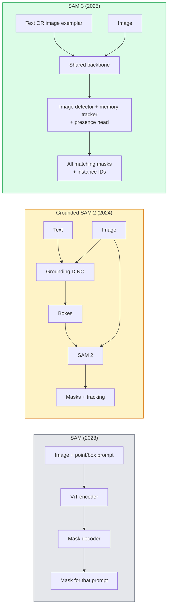

# SAM 3 مع التقسيم المفتوح للمفردات

> أعط نموذج عرض نصي و صورة، يمكنك الحصول على كل كائن يتناسب أقنعة.

**类型：**استخدام + 构建
**语言：**بايثون
**先修要求：**المرحلة 4 الدروس 07 (U-Net) ، المرحلة 4 الدروس 08 (Mask R-CNN) ، المرحلة 4 الدروس 18 (CLIP)
**时间：**~ 60 دقيقة

## 學习目标

- 区分 SAM(صرف طلبات بصرية)、موقع SAM / SAM 2(الاكتشاف + SAM) و SAM 3(من خلال التقسيم المفاهيم المفروضة 原生支持文本提示)
- 解释 SAM 3 架构:شارك العمود الفقري + كاشف الصورة + متابعة الفيديو القائمة على الذاكرة + رأس الوجود + تصميم الكاشف-متابعة منفصل
- استخدام معنى الوجه المُقبض`transformers`SAM 3 集成 إجراء الكشف عن النص المطلوب ‧ التقسيم و تتبع الفيديو
- 根据延迟、概念复杂性和部署目标, بين SAM 3、Grounded SAM 2、YOLO-World 和 SAM-MI 做做选择

## 问题

عام 2023 SAM هو نموذج يدعم فقط النقاط المرئية: أنت نقر نقطة أو رسم مربع، فإنه يعود إلى قناع.

SAM 3(Meta,2025 年 11 月,ICLR 2026) ضغط على هذا الصف.**Promptable Concept Segmentation (PCS)**◊结合 2026 年 3 月的对象多复制更新(SAM 3.1),它可以高效地跟踪在视频中同一概念的多个实例──

ويتعلق هذا الدروس بالتحول الهيكلي الذي يمثلها. 2D seg ̊ deteksi 和 text-image grounding 已合并到一个模型里. لم تعد مشكلة الإنتاج هي  أريد أن أضع أي خط أنابيب 串起来، بل  أي نموذج سريع يمكن أن يتعامل مع قضيتي الاستخدامة.

## 概念

### 三代模型



### قابل للتسجيل من الفكرة التقسيم

concept prompt 是一个简短的名词短语`"yellow school bus"`.`"striped red umbrella"`.`"hand holding a mug"`) أو نموذج الصورة. النموذج سوف يعود إلى مثال كل مثال يطابق مع المفهوم في الصورة.

هذا يختلف عن SAM بصري كلاسيكي لديه ثلاث نقاط:

1. لا تحتاج إلى مثال على حدة قدم استئناف: استئناف نصي  عودة جميع الموافقة.
2. المفاهيم المفتوحة يمكن أن تكون أي محتوى يمكن أن يستخدم لغة طبيعية لتوصيفها.
3. مرة واحدة عودة العديد من الحالات، بدلا من كل طلب عودة قناع واحد.

### 关键架构组件

- **Shared backbone**: a ViT 处理图片──الجهاز الكشف الرأس 和 الذاكرة القائمة على متابعة 都從中读取信息──
- **Presence head**: التنبؤ مفهوم هل يوجد في الصورة.
- **Decoupled detector-tracker**:تحديد مستوى الصورة ومتابعة مستوى الفيديو استخدام رؤوس مستقلة، لتجنب التأثيرات المتبادلة
- **Memory bank**: عبر الإطارات  تخزين ميزات كل حالة، لمتابعة الفيديو(مع SAM 2 استخدام الجهاز نفسه)

### تدريبات كبيرة

SAM 3 في **400 万个 unique concepts**على تدريب، هذه المفاهيم من قبل محرك بيانات.**SA-CO benchmark**يحتوي على 270 ألف مفهوم فريد، مقارنة مع المعايير السابقة 50 مرة.

### SAM 3.1 كائن متعدد

2026 年 3 月更新:**Object Multiplex**引入了一种 shared-memory 机制,用于同时联合跟踪同一概念的多种实例──此前,跟踪 N 个实例意味着需要 N 个独立的内存银行──Multiplex 将其压缩为一个共享内存,并使用每实例查询──结果是在不牺牲准确性前提下,显著加速多对象跟踪──

### 2026 سنة SAM الأرضية  لا يزال مهما المشهد

- عندما تحتاج إلى استبدال جهاز كشف لغة مفتوحة محدد
- عندما ترخيص SAM 3 ((HF 上 مغلق) يصبح مانع
- عندما تحتاج إلى المزيد من التحكم في عتبة الكشف عن المرض
- يستخدم في أبحاث / عمل التخلص من مكون الكشف

خطوط الأنابيب المودولية  مازالت لها قيمة ‬ بالنسبة لمعظم عمليات الإنتاج، فإن SAM 3 هو الإجابة الأسهل ‬‬‬‬‬‬‬‬‬‬‬‬‬‬‬‬‬‬‬‬‬‬‬‬‬‬‬‬‬‬‬‬‬‬‬‬‬‬‬‬‬‬‬‬‬‬‬‬‬‬‬‬‬‬‬‬‬‬‬‬‬‬‬‬‬‬‬‬‬‬‬‬‬‬‬‬‬‬‬‬‬‬‬‬‬‬‬‬‬‬‬‬‬‬‬‬‬‬‬‬‬‬‬‬‬‬‬‬‬‬‬‬‬‬‬‬‬‬‬‬‬‬‬‬‬‬‬‬‬‬‬‬‬‬‬‬‬‬‬‬‬‬‬‬‬‬‬‬‬‬‬‬‬‬‬‬‬‬‬‬‬‬‬‬‬‬‬‬‬‬‬‬‬‬‬‬‬‬‬‬‬‬‬‬‬‬‬‬‬‬‬‬‬‬‬‬‬‬‬‬‬‬‬‬‬‬‬‬‬‬‬‬‬‬‬‬‬‬‬‬‬‬‬‬‬‬‬‬‬‬‬‬‬‬‬‬‬‬‬‬‬‬‬‬‬‬‬‬‬‬‬‬‬‬‬‬‬‬‬‬‬‬‬‬‬‬‬‬‬‬‬‬‬‬‬‬‬‬‬‬‬‬‬‬‬‬‬‬‬‬‬‬‬‬‬‬‬‬‬‬‬‬‬‬‬‬‬‬‬‬‬‬‬‬‬‬‬‬‬‬‬‬‬‬‬‬‬‬‬‬‬‬‬‬‬‬‬‬‬‬‬‬‬‬‬‬‬‬‬‬‬‬‬‬‬‬‬‬‬‬‬‬‬‬‬‬‬‬‬‬‬‬‬‬‬‬‬‬‬‬‬‬‬‬‬‬‬‬‬‬‬‬‬‬‬‬‬‬‬‬‬‬‬‬‬‬‬‬‬‬‬‬‬‬‬‬‬‬‬‬‬‬‬‬‬‬‬‬‬‬‬‬‬‬‬‬‬‬‬‬‬‬‬‬‬‬‬‬‬‬‬‬‬‬‬‬‬‬‬‬‬‬‬‬‬‬‬‬‬‬‬‬‬‬

### يوولو-لد مقابل سام 3

- **YOLO-World**: فقط كشف الكلمات المفتوحة ((بدون أقنعة) ―― في الوقت الحقيقي── عندما تحتاج إلى مربعات عالية المعدات الفبية 时最合适──
- **SAM 3**: التقسيم الكامل + التتبع.

生产场景划分:YOLO-World 适合快速检测-only管道(الروبوتات التنقل、المؤشرات السريعة),SAM 3 适合任何需要面具或跟踪的场景──

### SAM-MI 效率

SAM-MI(2025-2026) حل عقدة عرق المعدل المعدل SAM.

- **Sparse point prompting**: استخدام القليل من النقاط精心选择的, بدلا من طلبات كثيفة; سوف يقلل مكالمات المفكّر 减少 96%。
- **Shallow mask aggregation**:将粗略面具预测 合并成一个更清晰的面具──
- **Decoupled mask injection**:decoder 接收预计算的面具功能,而不是重新运行──

结果: في مقارنات المفردات المفتوحة 相比 Grounded-SAM 有1.6× speedup

### ثلاث نموذجات أسلوب الخروج

它们都回归相同的一般结构(盒 + 标签 + 分分 + 面具 + 身份证), هذا مفيد جدا: لا حاجة إلى أن تقوم بتشغيل النمط الخاص بك


```figure
cv3-open-vocab
```

## الإنشاء

### الخطوة الأولى: الإعداد الفوري

构建一个助手,将用户句转换为 SAM 3概念提示列表──这是用户输入的内容和模型消费的内容之间的边界──

```python
def split_concepts(sentence):
    """
    Heuristic splitter for multi-concept prompts.
    Returns list of short noun phrases.
    """
    for sep in [",", ";", "and", "or", "&"]:
        if sep in sentence:
            parts = [p.strip() for p in sentence.replace("and ", ",").split(",")]
            return [p for p in parts if p]
    return [sentence.strip()]

print(split_concepts("cats, dogs and balloons"))
```

SAM 3 كل مرة تقدم قبول مفهوم ؛ بالنسبة لمسائل متعددة المفاهيم ، دورة أو تجميع معالجتها.

### 步骤 2:مساعدون في التعامل بعد المعالجة

لتحويل المخرجات الخام من SAM 3 إلى قائمة الكشفات المباشرة لتتناسب مع عقد خط الأنابيب في المرحلة 4 من الدروس 16

```python
from dataclasses import dataclass
from typing import List

@dataclass
class ConceptDetection:
    concept: str
    instance_id: int
    box: tuple          # (x1, y1, x2, y2)
    score: float
    mask_rle: str       # run-length encoded


def rle_encode(binary_mask):
    flat = binary_mask.flatten().astype("uint8")
    runs = []
    prev, count = flat[0], 0
    for v in flat:
        if v == prev:
            count += 1
        else:
            runs.append((int(prev), count))
            prev, count = v, 1
    runs.append((int(prev), count))
    return ";".join(f"{v}x{c}" for v, c in runs)
```

حتى لو كان هناك العديد من أقنعة عالية الوضوح، RLE يمكن أن يجعل الحملات الفائدة الاستجابة 保持较小── نفس النموذج ينطبق على SAM 2、SAM 3、Grounded SAM 2──

### الخطوة 3: الاتحادية مفتوحة الكلمات واجهة التقسيم

سوف تمتلك أي خلفية ((SAM 3 √ SAM 2 √ YOLO-World + SAM 2) تغطية في طريقة موحدة بعد ذلك.

```python
from abc import ABC, abstractmethod
import numpy as np

class OpenVocabSeg(ABC):
    @abstractmethod
    def detect(self, image: np.ndarray, concept: str) -> List[ConceptDetection]:
        ...


class StubOpenVocabSeg(OpenVocabSeg):
    """
    Deterministic stub used for pipeline testing when real models are not loaded.
    """
    def detect(self, image, concept):
        h, w = image.shape[:2]
        return [
            ConceptDetection(
                concept=concept,
                instance_id=0,
                box=(w * 0.2, h * 0.3, w * 0.5, h * 0.8),
                score=0.89,
                mask_rle="0x100;1x50;0x200",
            ),
            ConceptDetection(
                concept=concept,
                instance_id=1,
                box=(w * 0.55, h * 0.25, w * 0.85, h * 0.75),
                score=0.74,
                mask_rle="0x80;1x40;0x220",
            ),
        ]
```

حقيقية`SAM3OpenVocabSeg`الفرعية 会封装 `transformers.Sam3Model`和 `Sam3Processor`.

### 步骤 4: الاحضن في الوجه SAM 3 用法(参考)

模型实际的 `transformers`集成:

```python
from transformers import Sam3Processor, Sam3Model
import torch

processor = Sam3Processor.from_pretrained("facebook/sam3")
model = Sam3Model.from_pretrained("facebook/sam3").eval()

inputs = processor(images=pil_image, return_tensors="pt")
inputs = processor.set_text_prompt(inputs, "yellow school bus")

with torch.no_grad():
    outputs = model(**inputs)

masks = processor.post_process_masks(
    outputs.masks, inputs.original_sizes, inputs.reshaped_input_sizes
)
boxes = outputs.boxes
scores = outputs.scores
```

إرسال إرسال إرسال إرسال إرسال إرسال إرسال إرسال إرسال إرسال إرسال إرسال إرسال إرسال إرسال إرسال إرسال إرسال إرسال إرسال إرسال إرسال إرسال إرسال إرسال إرسال إرسال إرسال إرسال إرسال إرسال إرسال إرسال إرسال إرسال إرسال إرسال إرسال إرسال إرسال إرسال إرسال إرسال إرسال إرسال إرسال إرسال إرسال إرسال إرسال إرسال إرسال إرسال إرسال إرسال إرسال إرسال إرسال إرسال إرسال إرسال إرسال إرسال إرسال إرسال إرسال إرسال إرسال إرسال إرسال إرسال إرسال إرسال إرسال إرسال إرسال إرسال إرسال إرسال إرسال إرسال إرسال إرسال إرسال إرسال إرسال إرسال إرسال إرسال إرسال إرسال إرسال إرسال إرسال إرسال إرسال إرسال إرسال إرسال إرسال إرسال إرسال إرسال إرسال إرسال إرسال إرسال إرسال إرسال إرسال إرسال إرسال إرسال إرسال إرسال إرسال إرسال إرسال إرسال إرسال إرسال إرسال إرسال إرسال إرسال إرسال إرسال إرسال إرسال إرسال إرسال إرسال إرسال إرسال إرسال إرسال إرسال إرسال إرسال إرسال إرسال إرسال إرسال إرسال إرسال إرسال إرسال إرسال إرسال إرسال إرسال إرسال إرسال إرسال إرسال إرسال إرسال إرسال إرسال إرسال إرسال إرسال إرسال إرسال إرسال إرسال إرسال إرسال إرسال إرسال

### الخطوة 5: قياس SAM 2 المأوى

مقياس حقيقي: ماذا سيحدث في خط الأنابيب الحقيقي في وسط SAM 3

- التأخير:SAM 3 省掉一次前行 (((ليس هناك كاشف مستقل) ، ولكن النموذج نفسه أكثر ثقلًا ؛ عادةً يكون总体持平或略有速度up。
- دقة:SAM 3 في مفاهيم نادرة أو تركيبية`"striped red umbrella"`) على واضح أفضل.
- المرونة: SAM 2 المأرضية سمح لك بتبديل الكشفات ((DINO-X、فلورنسا-2、DINO 1.5) المأرضية  SAM 3 هو واحد الحجم‬

结论:SAM 3 هو اختيار متضمن لـ 2026 سنة من قسم الكلمات المفتوحة. عندما تحتاج إلى مرونة الكشف أو شروط رخصة مختلفة، SAM 2 المأساسية لا تزال صحيحة.

## استخدام

النظام:

- **Real-time annotation**:SAM 3 + CVAT ‬المعلامة كمسجلة-فكرة الميزة‬‬‬‬‬‬‬‬‬‬‬‬‬‬‬‬‬‬‬‬‬‬‬‬‬‬‬‬‬‬‬‬‬‬‬‬‬‬‬‬‬‬‬‬‬‬‬‬‬‬‬‬‬‬‬‬‬‬‬‬‬‬‬‬‬‬‬‬‬‬‬‬‬‬‬‬‬‬‬‬‬‬‬‬‬‬‬‬‬‬‬‬‬‬‬‬‬‬‬‬‬‬‬‬‬‬‬‬‬‬‬‬‬‬‬‬‬‬‬‬‬‬‬‬‬‬‬‬‬‬‬‬‬‬‬‬‬‬‬‬‬‬‬‬‬‬‬‬‬‬‬‬‬‬‬‬‬‬‬‬‬‬‬‬‬‬‬‬‬‬‬‬‬‬‬‬‬‬‬‬‬‬‬‬‬‬‬‬‬‬‬‬‬‬‬‬‬‬‬‬‬‬‬‬‬‬‬‬‬‬‬‬‬‬‬‬‬‬‬‬‬‬‬‬‬‬‬‬‬‬‬‬‬‬‬‬‬‬‬‬‬‬‬‬‬‬‬‬‬‬‬‬‬‬‬‬‬‬‬‬‬‬‬‬‬‬‬‬‬‬‬‬‬‬‬‬‬‬‬‬‬‬‬‬‬‬‬‬‬‬‬‬‬‬‬‬‬‬‬‬‬‬‬‬‬‬‬‬‬‬‬‬‬‬‬‬‬‬‬‬‬‬‬‬‬‬‬‬‬‬‬‬‬‬‬‬‬‬‬‬‬‬‬‬‬‬‬‬‬‬‬‬‬‬‬‬‬‬‬‬‬‬‬‬‬‬‬‬‬‬‬‬‬‬‬‬‬‬‬‬‬‬‬‬‬‬‬‬‬‬‬‬‬‬‬‬‬‬‬‬‬‬‬‬‬‬‬‬‬‬‬‬‬‬‬‬‬‬‬‬‬‬‬‬‬‬‬‬‬‬‬‬‬‬‬‬‬‬‬‬‬‬‬‬‬‬‬‬‬‬‬‬‬‬‬‬‬‬‬‬‬‬‬‬‬‬‬‬‬‬‬‬‬‬‬‬‬‬‬‬‬‬‬‬‬‬‬
- **Video analytics**:SAM 3.1 Object Multiplex يستخدم لتتبع متعددة الأجسام؛将框架 输入 ذاكرة القائمة على متابعة‬‬‬‬‬‬‬‬‬‬‬‬‬‬‬‬‬‬‬‬‬‬‬‬‬‬‬‬‬‬‬‬‬‬‬‬‬‬‬‬‬‬‬‬‬‬‬‬‬‬‬‬‬‬‬‬‬‬‬‬‬‬‬‬‬‬‬‬‬‬‬‬‬‬‬‬‬‬‬‬‬‬‬‬‬‬‬‬‬‬‬‬‬‬‬‬‬‬‬‬‬‬‬‬‬‬‬‬‬‬‬‬‬‬‬‬‬‬‬‬‬‬‬‬‬‬‬‬‬‬‬‬‬‬‬‬‬‬‬‬‬‬‬‬‬‬‬‬‬‬‬‬‬‬‬‬‬‬‬‬‬‬‬‬‬‬‬‬‬‬‬‬‬‬‬‬‬‬‬‬‬‬‬‬‬‬‬‬‬‬‬‬‬‬‬‬‬‬‬‬‬‬‬‬‬‬‬‬‬‬‬‬‬‬‬‬‬‬‬‬‬‬‬‬‬‬‬‬‬‬‬‬‬‬‬‬‬‬‬‬‬‬‬‬‬‬‬‬‬‬‬‬‬‬‬‬‬‬‬‬‬‬‬‬‬‬‬‬‬‬‬‬‬‬‬‬‬‬‬‬‬‬‬‬‬‬‬‬‬‬‬‬‬‬‬‬‬‬‬‬‬‬‬‬‬‬‬‬‬‬‬‬‬‬‬‬‬‬‬‬‬‬‬‬‬‬‬‬‬‬‬‬‬‬‬‬‬‬‬‬‬‬‬‬‬‬‬‬‬‬‬‬‬‬‬‬‬‬‬‬‬‬‬‬‬‬‬‬‬‬‬‬‬‬‬‬‬‬‬‬‬‬‬‬‬‬‬‬‬‬‬‬‬‬‬‬‬‬‬‬‬‬‬‬‬‬‬‬‬‬‬‬‬‬‬‬‬‬‬‬‬‬‬‬‬‬‬‬‬‬‬‬‬‬‬‬‬‬‬‬‬‬‬‬‬‬‬‬‬‬‬‬‬‬‬‬‬‬‬‬‬‬‬‬‬‬‬‬‬‬‬‬‬‬‬‬
- **Robotics**:SAM 3 用于开口语操纵(拾起红杯);作为规划原始运行──
- **Medical imaging**: في المفاهيم الطبية 上 محسنة SAM 3; تحتاج إلى الحصول على الوصول في HF 上

الـ "أولتراليتيكس" في حزمة "بايتون" المحمولة في "سام 3"

```python
from ultralytics import SAM

model = SAM("sam3.pt")
results = model(image_path, prompts="yellow school bus")
```

مع YOLO 和 SAM 2 استخدام نفس الواجهة

## 交付

本课会产出:

- `outputs/prompt-open-vocab-stack-picker.md`: واحد حسب التأخير  تعقيد المفهوم و الترخيص  اختيار SAM 3 / SAM 2 / YOLO-World / SAM-MI
- `outputs/skill-concept-prompt-designer.md`: a将用户话语转换为格式良好的 SAM 3 مفهوم طلبات مهارة(تقسم、تشويش、خفض الاعتبار)

## التدريب

1. **（Easy）**في 10 صور 张 上运行 SAM 3،并使用你自己选择的概念提示──与同一批图像 上的 SAM 2 + Grounding DINO 1.5 对比──报告每模型错过了哪些概念──
2. **（Medium）**في SAM 3 之上构建一个 点击-to-include / click-to-exclude UI: text prompt 返回候选实例; user点击保留哪些算作 positive──将最终概念集合 输出为 JSON──
3. **（Hard）**في مجموعة مفهومات ذاتية التعريف (مثل 5 مكونات إلكترونية) على تحسين SAM 3، لكل نوع 20 张 مصطلحات الصور.

## 关键术语

| Term | 人们通常怎么说 | 实际含义 |
|------|----------------|----------------------|
| Open-vocabulary segmentation | “Segment by text” | 为自然语言描述的 objects 生成 masks，而不是使用固定 label set |
| PCS | “Promptable Concept Segmentation” | SAM 3 的核心任务：给定一个 noun-phrase 或 image exemplar，segment 所有匹配 instances |
| Concept prompt | “The text input” | 简短名词短语或 image exemplar；不是完整句子 |
| Presence head | “Is it here?” | SAM 3 中的模块，用于在 localisation 之前判断 concept 是否存在于 image 中 |
| SA-CO | “SAM 3 benchmark” | 包含 270K concepts 的 open-vocabulary segmentation benchmark；比以往 open-vocab benchmarks 大 50 倍 |
| Object Multiplex | “SAM 3.1 update” | Shared-memory multi-object tracking；快速联合跟踪多个 instances |
| Grounded SAM 2 | “Modular pipeline” | Detector + SAM 2 级联；当 detector 替换很重要时仍然相关 |
| SAM-MI | “Efficient SAM variant” | Mask Injection，相比 Grounded-SAM 实现 1.6x speedup |

## 延伸阅读

- [SAM 3: Segment Anything with Concepts (arXiv 2511.16719)](https://arxiv.org/abs/2511.16719)
- [SAM 3.1 Object Multiplex (Meta AI, March 2026)](https://ai.meta.com/blog/segment-anything-model-3/)
- [SAM 3 model page on Hugging Face](https://huggingface.co/facebook/sam3)
- [Grounded SAM 2 tutorial (PyImageSearch)](https://pyimagesearch.com/2026/01/19/grounded-sam-2-from-open-set-detection-to-segmentation-and-tracking/)
- [Ultralytics SAM 3 docs](https://docs.ultralytics.com/models/sam-3/)
- [SAM3-I: Instruction-aware SAM (arXiv 2512.04585)](https://arxiv.org/abs/2512.04585)
