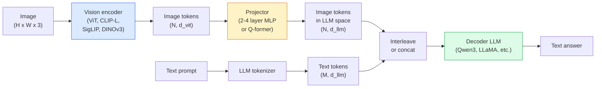

# نماذج اللغة الرؤية  ViT-MLP-LLM 模式

> سيُحول مُرمّد الرؤية الصور إلى رموز. سيُمثل مُرَاكِب MLP هذه الرموز. سيُخطي إلى مساحة إدمج LLM.

**类型：**学习 + استخدام
**语言：**بايثون
**前置要求：**المرحلة 4 الدروس 14 (ViT) ، المرحلة 4 الدروس 18 (CLIP) ، المرحلة 7 الدروس 02 (الاهتمام الذاتي)
**时间：**75 دقيقة

## 學习目标

- يقولون أن التشكيلات التجارية المختلفة
- من المعايير  طول السياق و أداء مقارنة  من منظور Qwen3-VL InternVL3.5  LLaVA-Next 和 GLM-4.6V
-  شرح DeepStack: لماذا ميزات ViT متعددة المستويات أكثر من ميزة واحدة في آخر المستوى أكثر قدرة على تحديد اللغة الرؤية
- في بيئة الإنتاج تستخدم معدل الخطأ المتقاطع (CMER) لقياس الهلوسة في VLM ، و على أساس هذه الإشارة اتخاذ إجراءات

## 问题

CLIP (المرحلة 4 الدروس 18) لتوفير صورة ومستندات مجال تشارك إدراج، وهذا يكفي لدعم التصنيف الصفر الصور والالتقاط.

نماذج اللغة الرؤية (VLMs)  Qwen3-VL、InternVL3.5、LLaVA-Next、GLM-4.6V  سوف ترسم رمز الصورة CLIP-family 接到一个完整语言模型 上。模型看一张图像加一个问题,然后生成答案──到2026年, open source VLMs 在多元ية المعايير (MMMU, MMBench, DocVQA, ChartQA, MathVista, OSWorld) 上已经可以比肩甚至超过 GPT-5 和 Gemini-2.5-Pro──

هذا المجموعة ثلاثة أدوات: (ViT、projector、LLM) هو الهيكل القياسي. الفرق بين النماذج يتوقف على استخدام أي ViT、 أي برنامج، والتي LLM、 التدريب البيانات وصفة التنظيم.

## 概念

### ViT-MLP-LLM 架构



1. **Vision encoder** 预训练 ViT(CLIP-L/14、SigLIP、DINOv3، أو المتغيرات المعدلة)
2. **Projector** 一个小模块(2-4 层 MLP، أو Q-former),将视证 映射到LLM的嵌入维度──大多数细调 发生在这里──
3. **LLM** نموذج لغة المقرر فقط ((Qwen3、Llama、Mistral、GLM、InternLM) ・・・按序读取视觉 + نصي رموز،并生成文本。

في الممارسة العملية، وحدة تحديد الرؤية و LLM، والكثير يبقى مجمد، فقط تدريب المشاريع، بحيث يمكن تحمل بضعة مليارات من الإشارات على نطاق الحدود منخفضة التكلفة.

### " ديب ستاك "

الاستنتاج العادي فقط باستخدام الطبقة الأخيرة من ViT الطبقة. DeepStack ((Qwen3-VL) سوف تستخدم من العديد من ViT عمق الاختبار الميزات و سوف تقوم بتجميعها.

### ثلاث مراحل تدريبية

现代 VLMs 分阶段训练:

1. **Alignment** تجميد ViT 和 LLM── فقط في أزواج صورة-تسمية 上訓練投影器──教会投影器 将视空间 映射到语言空间──
2. **Pre-training** 解所有部分──大规模交错图像文本数据(500M+ زوج) 上训练──构建模型的视觉知识──
3. **Instruction tuning** 在精选的(图像,问题,答案) 三元组上细调──教会对话行为 和任务格式──这一步把视觉意识的LM变成可用的助手──

معظم المجموعات المختلفة من المواد المختلفة من المواد المختلفة من المواد المختلفة من المواد المختلفة من المواد المختلفة من المواد المختلفة من المواد المختلفة من المواد المختلفة من المواد المختلفة من المواد المختلفة من المواد المختلفة من المواد المختلفة من المواد المختلفة من المواد المختلفة من المواد المختلفة من المواد المختلفة من المواد المختلفة من المواد المختلفة من المواد المختلفة من المواد المختلفة من المواد المختلفة من المواد المختلفة من المواد المختلفة من المواد المختلفة من المواد المختلفة من المواد المختلفة من المواد المختلفة من المواد المختلفة من المواد المختلفة.

### 模型家族比较(2026 年初)

| Model | Params | Vision encoder | LLM | Context | Strengths |
|-------|--------|----------------|-----|---------|-----------|
| Qwen3-VL-235B-A22B (MoE) | 235B (22B active) | custom ViT + DeepStack | Qwen3 | 256K | 综合 SOTA，GUI agent |
| Qwen3-VL-30B-A3B (MoE) | 30B (3B active) | custom ViT + DeepStack | Qwen3 | 256K | 更小的 MoE 替代方案 |
| Qwen3-VL-8B (dense) | 8B | custom ViT | Qwen3 | 128K | 生产环境 dense 默认选择 |
| InternVL3.5-38B | 38B | InternViT-6B | Qwen3 + GPT-OSS | 128K | MMBench / MMVet 表现强 |
| InternVL3.5-241B-A28B | 241B (28B active) | InternViT-6B | Qwen3 | 128K | 可与 GPT-4o 竞争 |
| LLaVA-Next 72B | 72B | SigLIP | Llama-3 | 32K | 开放，易于 fine-tune |
| GLM-4.6V | ~70B | custom | GLM | 64K | Open-source，OCR 强 |
| MiniCPM-V-2.6 | 8B | SigLIP | MiniCPM | 32K | 适合边缘部署 |

### العوامل البصرية

Qwen3-VL-235B في OSWorld على الوصول إلى أعلى أداء عالمي، OSWorld هو في الاتجاه**visual agents**المقياس، لتحديد المستخدمين المستخدمين في مجال المواقع، والتي يمكن استخدامها في مجال المعلومات، والتي يمكن استخدامها في مجال المعلومات، والتي يمكن استخدامها في مجال المعلومات، والتي يمكن استخدامها في مجال المعلومات، والتي يمكن استخدامها في مجال المعلومات، والتي يمكن استخدامها في مجال المعلومات، والتي يمكن استخدامها في مجال المعلومات، والتي يمكن استخدامها في مجال المعلومات، والتي يمكن استخدامها في مجال المعلومات، والتي يمكن استخدامها في مجال المعلومات، والتي يمكن استخدامها في مجال المعلومات، والتي يمكن استخدامها في مجال المعلومات، والتي يمكن استخدامها في مجال المعلومات، والتي يمكن استخدامها في مجال المعلومات، والتي يمكن استخدامها في مجال المعلومات، والتي يمكن استخدامها في مجال المعلومات، والتي يمكن استخدامها في مجال المعلومات، والتي يمكن استخدامها في مجال المعلومات، والتي يمكن استخدامها في مجال المعلومات، والتي يمكن استخدامها في مجال المعلومات.

### الوكيل 能力 + روبي 变体

المشاهدين يحتاجون إلى معرفة ما يحدث في الفيديو**什么时候**◊ Qwen3-VL من T-RoPE ((موقع دوران مؤقتة)**基于文本的时间 alignment**,也就是將显式时间印花文本代币与视频框架 交错――模型看`<timestamp 00:32>`الإطار، السرعة، على أن نفكر في العلاقة الزمنية

### التنظيم 问题

爬取数据集 12% من أزواج الصور والنص 包含并未完全由图像支的描述── باستخدام هذا التدريب على البيانات، فإن VLM 会学会 الهلوسة، أي تصميم الأشياء、 خطأ القراءة الرقمية、 علاقة وهمية── في بيئة الإنتاج، هذا هو النظام الأكثر فاشلة──

سكي ورك.اي  إدخال **Cross-Modal Error Rate (CMER)**لتتبعها:

```
CMER = fraction of outputs where the text confidence is high but the image-text similarity (via a CLIP-family checker) is low
```

تعني CMER عالية أن النموذج يقول بثقة أنه لا يتم تمويل محتويات الصورة. مراقبة CMER، واعتبارها كبي كيميائي الإنتاج، في نشرهم سوف يقلل معدل الهلوسة حوالي 35٪.

### استخدام LoRA / QLoRA  إجراء ضبط دقيقة

على 70B VLM القيام بتحسين كامل 超出 معظم طاقم طاقة المجموعة  استخدام LoRA على طبقات الاهتمام + المشارع  استخدام 16-64 ، أو استخدام 4 بيت أساسية الوزن QLoRA ، يمكن أن يتم تركيبها في واحد张 A100 / H100‬‬  تكلفة: 5,000-50,000 个样本 ،$100-$5000  حساب تكلفة، 2-10 ساعات تدريب الوقت

### التفكير الفضائي  مازال ضعيف

عندما تكون في حالة استخدامك تعتمد على أي جسم على جسم آخر، يجب أن تكون هناك الكثير من التحققات، أداء VLM العام أقل من البشر. بالنسبة لمهمات الفضاء البحتة، أفضل حلول بديلة من VLM تشمل: نقطة مفتاحية خاصة / مقياس الموقف، نموذج عمق، أو نموذج الكشف بالإضافة إلى هندسة الصناديق.


```figure
v4-vlm-projector
```

## بناءها

### الخطوة 1: المضرب

هذا هو الجزء من تدريبك المعتاد

```python
import torch
import torch.nn as nn


class Projector(nn.Module):
    def __init__(self, vit_dim=768, llm_dim=4096, hidden=4096):
        super().__init__()
        self.net = nn.Sequential(
            nn.Linear(vit_dim, hidden),
            nn.GELU(),
            nn.Linear(hidden, llm_dim),
        )

    def forward(self, x):
        return self.net(x)
```

输入 واحد `(N_patches, d_vit)`الـ "تينسر" الإشارة`(N_patches, d_llm)`سوف نضع كل خط خارج كل خط كرمز آخر

### الخطوة الثانية: 端到端组装 ViT-MLP-LLM

أسفل هي الحد الأدنى من VLM الممرات المقدمة`transformers`هنا يظهر مفهوم البناء

```python
class MinimalVLM(nn.Module):
    def __init__(self, vit, projector, llm, image_token_id):
        super().__init__()
        self.vit = vit
        self.projector = projector
        self.llm = llm
        self.image_token_id = image_token_id  # placeholder token in text prompt

    def forward(self, image, input_ids, attention_mask):
        # 1. vision features
        vision_tokens = self.vit(image)                     # (B, N_patches, d_vit)
        vision_embeds = self.projector(vision_tokens)       # (B, N_patches, d_llm)

        # 2. text embeddings
        text_embeds = self.llm.get_input_embeddings()(input_ids)  # (B, M, d_llm)

        # 3. replace image placeholder tokens with vision embeds
        merged = self._merge(text_embeds, vision_embeds, input_ids)

        # 4. run LLM
        return self.llm(inputs_embeds=merged, attention_mask=attention_mask)

    def _merge(self, text_embeds, vision_embeds, input_ids):
        out = text_embeds.clone()
        expected = vision_embeds.size(1)
        for b in range(input_ids.size(0)):
            positions = (input_ids[b] == self.image_token_id).nonzero(as_tuple=True)[0]
            if len(positions) != expected:
                raise ValueError(
                    f"batch item {b} has {len(positions)} image tokens but vision_embeds has {expected} patches."
                    " Every sample in the batch must be pre-padded to the same number of image placeholder tokens.")
            out[b, positions] = vision_embeds[b]
        return out
```

文本中 `<image>`سيتم استبدال رمز الحامل في صورة حقيقية ، LLaVA、Qwen-VL و InternVL استخدامها كلها نفس النموذج

### الخطوة الثالثة: CMER  حساب

-إنه من السهل أن يُفحص

```python
import torch.nn.functional as F


def cross_modal_error_rate(image_emb, text_emb, text_confidence, sim_threshold=0.25, conf_threshold=0.8):
    """
    image_emb, text_emb: embeddings of image and generated text (normalised internally)
    text_confidence:     mean per-token probability in [0, 1]
    Returns:             fraction of high-confidence outputs with low image-text alignment
    """
    image_emb = F.normalize(image_emb, dim=-1)
    text_emb = F.normalize(text_emb, dim=-1)
    sim = (image_emb * text_emb).sum(dim=-1)        # cosine similarity
    high_conf_low_sim = (text_confidence > conf_threshold) & (sim < sim_threshold)
    return high_conf_low_sim.float().mean().item()
```

أن تكون CMER كبي كبي الإنتاج. حسب النوع النهائي. العميل يتحكم في ذلك.

### 步骤 4: تصنيف VLM للعبة

عرض المضرب هو يمكن تدريبها.

```python
class ToyVLM(nn.Module):
    def __init__(self, vit_dim=32, llm_dim=64, num_classes=5):
        super().__init__()
        self.projector = Projector(vit_dim, llm_dim, hidden=64)
        self.head = nn.Linear(llm_dim, num_classes)

    def forward(self, vision_tokens):
        projected = self.projector(vision_tokens)
        pooled = projected.mean(dim=1)
        return self.head(pooled)
```

يمكنك استخدام 200 خطوة لتصميمها، وهذا يكفي لتوضيح أن نمط المضرب هو فعال.

## استخدمها

ثلاث طرق لـ 2026 سنة للإنتاج للقوات المسلحة:

- **Hosted API** OpenAI Vision、Anthropic Claude Vision、Google Gemini Vision──零 بنية تحتية، هناك خطر للموردين──
- **Open-source self-host**                                                                                                                                                                                                                                                                                                                                                                                                                                                                                                                            `transformers`和 `vllm`استخدام Qwen3-VL أو InternVL3.5── كامل التحكم،
- **在领域数据上 fine-tune** 加载 Qwen2.5 -VL-7B أو LLaVA-1.6 -7B، في 5k-50k 自定义样本上做LoRA,用 `vllm`أو`TGI`خدمة

```python
from transformers import AutoProcessor, AutoModelForVision2Seq
import torch
from PIL import Image

model_id = "Qwen/Qwen3-VL-8B-Instruct"
processor = AutoProcessor.from_pretrained(model_id)
model = AutoModelForVision2Seq.from_pretrained(model_id, torch_dtype=torch.bfloat16, device_map="auto")

messages = [{
    "role": "user",
    "content": [
        {"type": "image", "image": Image.open("plot.png")},
        {"type": "text", "text": "What does this chart show?"},
    ],
}]
inputs = processor.apply_chat_template(messages, add_generation_prompt=True, tokenize=True, return_dict=True, return_tensors="pt").to("cuda")
generated = model.generate(**inputs, max_new_tokens=256)
answer = processor.decode(generated[0][inputs["input_ids"].shape[1]:], skip_special_tokens=True)
```

`apply_chat_template`مخبأ`<image>`إضافة الوضع؛模型会在内部处理 merge

## 交付 it

本课会产出:

- `outputs/prompt-vlm-selector.md` في حالة تحديد الدقة والتأخير وطول السياق وميزانية، اختر Qwen3-VL / InternVL3.5 / LLaVA-Next / API。
- `outputs/skill-cmer-monitor.md` 生成代码، باستخدام معدل الخطأ المتبادل للإنتاج من طراز VLM نقطة نهاية إضافة إلى الأدوات 、 حسب لوحة التحكم للنقطة النهائية، فضلا عن عتبة التحذير

## التدريب

1. **（简单）**في 5张图像上, باستخدام أي فتح VLM 跑三个提示(what is this?、count the objects、describe the scene)
2. **（中等）**في مجال الهدف 500 张带 أسعار التدوين 图像上, باستخدام LoRA(مركز 16) دقيقة المزج Qwen2.5-VL-3B أو LLaVA-1.6-7B── مقارنة صفر-مدفع ومزج دقيقة من المعدل المعدل المعدل المعدل المعدل المعدل المعدل المعدل المعدل المعدل المعدل المعدل المعدل المعدل المعدل المعدل المعدل المعدل المعدل المعدل المعدل المعدل المعدل المعدل المعدل المعدل المعدل المعدل المعدل المعدل المعدل المعدل المعدل المعدل المعدل المعدل المعدل المعدل المعدل المعدل المعدل المعدل المعدل المعدل المعدل المعدل المعدل المعدل المعدل المعدل المعدل المعدل المعدل المعدل المعدل المعدل المعدل المعدل المعدل المعدل المعدل المعدل المعدل المعدل المعدل المعدل المعدل المعدل المعدل المعدل المعدل المعدل المعدل المعدل المعدل المعدل المعدل المعدل المعدل المعدل المعدل المعدل المعدل المعدل المعدل المعدل المعدل المعدل المعدل المعدل المعدل المعدل المعدل المعدل المعدل المعدل المعدل المعدل المعدل المعدل المعدل المعدل المعدل المعدل المعدل المعدل المعدل المعدل المعدل المعدل
3. **（困难）**أن يكون مرموز الصورة لـ VLM من المتبني SigLIP/CLIP بدلاً من DINOv3── فقط إعادة تدريب المشاريع ((مجمدة LLM + جمدة DINOv3)── قياس مهام التنبؤ الكثيف ((حساب、التفكير الفضائي)

## 关键术语

| Term | 人们常说 | 实际含义 |
|------|----------------|----------------------|
| ViT-MLP-LLM | “VLM pattern” | Vision encoder + projector + language model；每个 2026 年 VLM 都如此 |
| Projector | “桥梁” | 2-4 层 MLP（或 Q-former），将 vision tokens 映射到 LLM embedding space |
| DeepStack | “Qwen3-VL feature trick” | stack 多层级 ViT features，而不是只使用最后一层 |
| Image token | “<image> placeholder” | text stream 中的 special token，会被 projected vision embeddings 替换 |
| CMER | “Hallucination KPI” | Cross-Modal Error Rate；当 text confidence 高但 image-text similarity 低时，该值较高 |
| Visual agent | “会点击的 VLM” | 通过 tool calls 操作 GUI（OSWorld、mobile、web）的 VLM |
| Q-former | “固定数量的 token bridge” | BLIP-2 风格的 projector，产出固定数量的 visual query tokens |
| Alignment / pre-training / instruction tuning | “三个阶段” | 标准 VLM 训练 pipeline |

## 延伸阅读

- [Qwen3-VL Technical Report (arXiv 2511.21631)](https://arxiv.org/abs/2511.21631)
- [InternVL3.5 Advancing Open-Source Multimodal Models (arXiv 2508.18265)](https://arxiv.org/html/2508.18265v1)
- [LLaVA-Next series](https://llava-vl.github.io/blog/2024-05-10-llava-next-stronger-llms/)
- [BentoML: Best Open-Source VLMs 2026](https://www.bentoml.com/blog/multimodal-ai-a-guide-to-open-source-vision-language-models)
- [MMMU: Multi-discipline Multimodal Understanding benchmark](https://mmmu-benchmark.github.io/)
- [VLMs in manufacturing (Robotics Tomorrow, March 2026)](https://www.roboticstomorrow.com/story/2026/03/when-machines-learn-to-see-like-experts-the-rise-of-vision-language-models-in-manufacturing/26335/)
