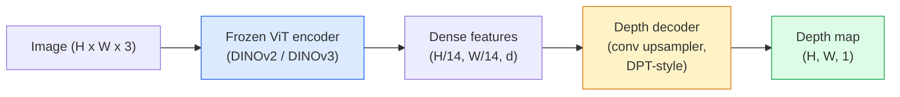

# عمق واحد مع تقدير الهندسة

> خريطة عمق هي صورة واحدة من خلال طريق واحد، وتظهر كل بكسل لمسافة الكاميرا. في الماضي، إذا لم يكن هناك سtereo أو LiDAR، فقط من RGB  التنبؤ أنها تعتبر مستحيلة.

**类型：**构建 + 使用
**语言：**بايثون
**前置要求：**المرحلة 4 الدروس 14 (ViT) ، المرحلة 4 الدروس 17 (رؤية ذاتية الإشراف) ، المرحلة 4 الدروس 07 (U-Net)
**时间：**حوالي 60 دقيقة

## 學习目标

- 区分 نسبي عمق و عمق المتريكي،并说明每个生产级模型 ((MiDaS، مارجولد، عمق أي شيء V3, ZoeDepth) حل هو أي نوع
- استخدام عمق أي شيء V3(DINOv2 العمود الفقري) في حالة عدم الحاجة إلى التصفية، للحد من واحد张图像预测 عمق
- 解释为什么深度单张图像中成立 (أشارات منظورية، تراجعات النسيج، سابقات تعلمت) ،以及它不能恢复什么 (القياس المطلق، هندسة محظورة)
- استخدام خريطة عمق و كاميرات ثقب الحفرة الاصطناعية ستقوم بتحديد الكشف الثنائي الأبعاد

## 问题

العمق هو رؤية الحاسوب المتنامية في 2D. معينة RGB، تعرف مكان الأشياء في مستوى الصورة. ولكن لا تعرف كم يقعها.

تقدير العميقة الموحدة ، أي من إطار RGB واحد  توقعات عميقة ، الماضي دائما تظهر模糊且不可靠的输出── بحلول عام 2026 ، قام مُرمّحون مُسبقًا كبار بتغيير هذا النقطة: عميقة أي شيء V3 استخدام结 من DINOv2 العميقة الفقري ،并生成能够泛化 إلى خرائط عميقة داخل 、خارج 、 الطبية وقطاعي الأقمار الصناعية── مارجولد سوف يعيد إظهار عميقة للنشر المشروط 问题──زويديفث إلى المسافات الميترية الحقيقية──

العمق هو أيضاً الجسر بين الكشف عن الأبعاد الثانية والفهم الثلاثية الأبعاد: سيتم اكتشاف بكسلات الصندوق بمقدار العمق، ويمكنك تحسين كائن ثنائي الأبعاد إلى سحابة نقطة ثلاثية الأبعاد.

## 概念

### العمق النسبي مقابل العمق الميتر

- **Relative depth** 没有真世界单位的序列 `z`القيم: بيكسل A أقرب من بيكسل B، ولكن نسبة المسافة لم تصل إلى الميترات
- **Metric depth** من الكاميرا                                                                                                                                                                                                                                                            

MiDaS 和 عمق أي شيء V3 生成 عمق نسبي.

### رمز التشفير-مصطلحات التشفير 模式



عمق أي شيء V3 结 مرموز، فقط تدريب DPT نمط مرموز. مرموز قدم ميزات غنية. مرموز سوف هذه الميزات 插值回图像分辨率,并回归深度.

### لماذا الصورة الوحيدة يمكن أن تنتج عمق

1张 2D  الصورة تحتوي على العديد من الإشارات المتوحدة المتعلقة بالعمق:

- **Perspective** 3D وسط平行线在 2D وسط收藏──
- **Texture gradient**                                                                                                                                                                                                                                                              
- **Occlusion order**الأشياء القريبة ستظل تغطي الأشياء البعيدة
- **Size constancy** 已知物体(سيارات、إنسان) تقدم مقياسًا مقربًا
- **Atmospheric perspective**في المشاهد الخارجية، الأشياء بعيدة تبدو أفضل

في المليارات من الصور التي تم تدريبها على التلفزيون، سيتم دمج هذه الإشارات.

### عمق واحد لا يمكن أن تفعل أي شيء

- لا يوجد شيء معروف في المشهد أو في المشهد لا يمكن الحصول عليه**absolute metric scale**يمكن أن تتوقع مسافة الكوب إلى اللعبا بضع مرات ولكن لا أعرف إذا كانت الكوب 1 متر أو 10 متر
- **Occluded geometry**خلف الكرسي لا يمكن رؤيته ولا يمكن التأكد منه
- **真正无 texture / reflective surfaces** المرآة  الزجاج  الجدران الموحدة ‬شبكة ‬ ‬ ‬ ‬ ‬ ‬ ‬ ‬ ‬ ‬ ‬ ‬ ‬ ‬ ‬ ‬ ‬ ‬ ‬ ‬ ‬ ‬ ‬ ‬ ‬ ‬ ‬ ‬ ‬ ‬ ‬ ‬ ‬ ‬ ‬ ‬ ‬ ‬ ‬ ‬ ‬ ‬ ‬ ‬ ‬ ‬ ‬ ‬ ‬ ‬ ‬ ‬ ‬ ‬ ‬ ‬ ‬ ‬ ‬ ‬ ‬ ‬ ‬ ‬ ‬ ‬ ‬ ‬ ‬ ‬ ‬ ‬ ‬ ‬ ‬ ‬ ‬ ‬ ‬ ‬ ‬ ‬ ‬ ‬ ‬ ‬ ‬ ‬ ‬ ‬ ‬ ‬ ‬ ‬ ‬ ‬ ‬ ‬ ‬ ‬ ‬ ‬ ‬ ‬ ‬ ‬ ‬ ‬ ‬ ‬ ‬ ‬ ‬ ‬ ‬ ‬ ‬ ‬ ‬ ‬ ‬ ‬ ‬ ‬ ‬ ‬ ‬ ‬ ‬ ‬ ‬ ‬ ‬ ‬ ‬ ‬ ‬ ‬ ‬ ‬ ‬ ‬ ‬ ‬ ‬ ‬ ‬ ‬ ‬ ‬ ‬ ‬ ‬ ‬ ‬ ‬ ‬ ‬ ‬ ‬ ‬ ‬ ‬ ‬ ‬ ‬ ‬ ‬ ‬ ‬ ‬ ‬ ‬ ‬ ‬ ‬ ‬ ‬ ‬ ‬ ‬ ‬ ‬ ‬ ‬ ‬ ‬ ‬ ‬ ‬ ‬ ‬ ‬ ‬ ‬ ‬ ‬ ‬ ‬ ‬ ‬ ‬ ‬ ‬ ‬ ‬ ‬ ‬ ‬ ‬ ‬ ‬ ‬ ‬ ‬ ‬ ‬ ‬ ‬ ‬ ‬ ‬ ‬ ‬ ‬ ‬ ‬ ‬ ‬ ‬ ‬ ‬ ‬ ‬ ‬ ‬ ‬ ‬ ‬ ‬ ‬ ‬ ‬ ‬ 

### عمق 2026 سنة أي شيء V3

- استخدام原生 DINOv2 ViT-L/14 作为编码器(结)
- مُشفّر DPT
- في أزواج الصور الموضحة من مصادر مختلفة
- قادر على**任意数量的 visual inputs 中预测空间一致的 geometry，无论是否已知 camera poses**.
- في عمق واحد، هندسة أي وجهة نظر، التصوير المرئي، تقدير وضع الكاميرا،

هذا هو 2026 سنة تحتاج إلى عمق

### مارجولد  باستخدام انتشار العميقة

مارجولد ((Ke et al., CVPR 2024)) سوف تقدير العمق 重新表述为 مشروط تصويب الصورة إلى الصورة توزيعها──تأهيئة:RGB──الهدف:خريطة عمق──استعمال مخططات مستقرة تدريبة مسبقًا 2 U-Net 作为脊椎──输出深度地图 在对象边界 处格外清晰──权衡:inference比 feed-forward models 更慢(10-50 个 个 个 个 个 个 个 步骤) 

### الكاميرا ذاتية وآثار

يجب أن يكون عميق`d``(u, v)`提升为相机坐标 中的3D点 `(X, Y, Z)`:

```
fx, fy, cx, cy = camera intrinsics
X = (u - cx) * d / fx
Y = (v - cy) * d / fy
Z = d
```

البيانات الداخلية من بيانات الميتاديا EXIF٬ نمط التصفية، أو مقياسات الدخول الداخلية الوحيدة ((حقول المنظور٬ عمق واحد)  لا يوجد معلومات داخلية ، يمكنك أن تمر من خلال افتراض 60-70 ° FOV 和 متوسط نقاط التوصل إلى نقطة التصفية من السحابة، وهذا يناسب التصور، ولكن لا يناسب القياس‬

### التقييم

المقاييس المحددة:

- **AbsRel**(خطأ نسبي مطلقاً):`mean(|d_pred - d_gt| / d_gt)` 越低越好‬ ‫أزياء فئة الإنتاج عادة ما تكون 0.05-0.1‬‬‬‬‬‬‬‬‬‬‬‬‬‬‬‬‬‬‬‬‬‬‬‬‬‬‬‬‬‬‬‬‬‬‬‬‬‬‬‬‬‬‬‬‬‬‬‬‬‬‬‬‬‬‬‬‬‬‬‬‬‬‬‬‬‬‬‬‬‬‬‬‬‬‬‬‬‬‬‬‬‬‬‬‬‬‬‬‬‬‬‬‬‬‬‬‬‬‬‬‬‬‬‬‬‬‬‬‬‬‬‬‬‬‬‬‬‬‬‬‬‬‬‬‬‬‬‬‬‬‬‬‬‬‬‬‬‬‬‬‬‬‬‬‬‬‬‬‬‬‬‬‬‬‬‬‬‬‬‬‬‬‬‬‬‬‬‬‬‬‬‬‬‬‬‬‬‬‬‬‬‬‬‬‬‬‬‬‬‬‬‬‬‬‬‬‬‬‬‬‬‬‬‬‬‬‬‬‬‬‬‬‬‬‬‬‬‬‬‬‬‬‬‬‬‬‬‬‬‬‬‬‬‬‬‬‬‬‬‬‬‬‬‬‬‬‬‬‬‬‬‬‬‬‬‬‬‬‬‬‬‬‬‬‬‬‬‬‬‬‬‬‬‬‬‬‬‬‬‬‬‬‬‬‬‬‬‬‬‬‬‬‬‬‬‬‬‬‬‬‬‬‬‬‬‬‬‬‬‬‬‬‬‬‬‬‬‬‬‬‬‬‬‬‬‬‬‬‬‬‬‬‬‬‬‬‬‬‬‬‬‬‬‬‬‬‬‬‬‬‬‬‬‬‬‬‬‬‬‬‬‬‬‬‬‬‬‬‬‬‬‬‬‬‬‬‬‬‬‬‬‬‬‬‬‬‬‬‬‬‬‬‬‬‬‬‬‬‬‬‬‬‬‬‬‬‬‬‬‬‬‬‬‬‬‬‬‬‬‬‬‬‬‬‬‬‬‬‬‬‬‬‬‬‬‬‬‬‬‬‬‬‬‬‬‬‬‬‬‬‬‬‬‬‬‬‬‬‬‬‬‬‬‬‬‬‬‬‬‬‬‬‬‬‬‬‬‬‬‬‬‬‬‬‬
- **delta < 1.25**(دقة العدالة):满足 `max(d_pred/d_gt, d_gt/d_pred) < 1.25`نسبة البكسلات 占比──越高越好──SOTA عادة 0.9+──

بالنسبة للعمق النسبي ((عمق أي شيء V3、MiDaS) ، التقييم باستخدام هذه المقاييسين


```figure
depth-sweep
```

## الإنشاء

### الخطوة 1: مقاييس العمق

```python
import torch

def abs_rel_error(pred, target, mask=None):
    if mask is not None:
        pred = pred[mask]
        target = target[mask]
    return (torch.abs(pred - target) / target.clamp(min=1e-6)).mean().item()


def delta_accuracy(pred, target, threshold=1.25, mask=None):
    if mask is not None:
        pred = pred[mask]
        target = target[mask]
    ratio = torch.maximum(pred / target.clamp(min=1e-6), target / pred.clamp(min=1e-6))
    return (ratio < threshold).float().mean().item()
```

في التقييم 前,始终 无效的深度像素 ((صفر、NaN、飽和) 。

### 步骤 2:تصفيق النطاق والتحرك

بالنسبة للنموذج العمق النسبي، في المقاييس الحسابية، فإن التنبؤات ستكون على حق الأساس.`a * pred + b = target`أن تكون أقل مربعات مناسبة:

```python
def align_scale_shift(pred, target, mask=None):
    if mask is not None:
        p = pred[mask]
        t = target[mask]
    else:
        p = pred.flatten()
        t = target.flatten()
    A = torch.stack([p, torch.ones_like(p)], dim=1)
    coeffs, *_ = torch.linalg.lstsq(A, t.unsqueeze(-1))
    a, b = coeffs[:2, 0]
    return a * pred + b
```

في تقييم MiDaS / عمق أي شيء 时,先运行 `align_scale_shift`,再运行`abs_rel_error`.

### الخطوة الثالثة: تحسين عمق السحابة

```python
import numpy as np

def depth_to_point_cloud(depth, intrinsics):
    H, W = depth.shape
    fx, fy, cx, cy = intrinsics
    v, u = np.meshgrid(np.arange(H), np.arange(W), indexing="ij")
    z = depth
    x = (u - cx) * z / fx
    y = (v - cy) * z / fy
    return np.stack([x, y, z], axis=-1)


depth = np.random.uniform(0.5, 4.0, (240, 320))
intr = (320.0, 320.0, 160.0, 120.0)
pc = depth_to_point_cloud(depth, intr)
print(f"point cloud shape: {pc.shape}  (H, W, 3)")
```

وظيفة، تطبق على جميع التطبيقات 3D-رفعها.`.ply`وفتحها في MeshLab أو CloudCompare

### الخطوة الرابعة: استخدم مشهد عمق اصطناعي

```python
def synthetic_depth(size=96):
    yy, xx = np.meshgrid(np.arange(size), np.arange(size), indexing="ij")
    # Floor: linear gradient from near (top) to far (bottom)
    depth = 1.0 + (yy / size) * 4.0
    # Box in the middle: closer
    mask = (np.abs(xx - size / 2) < size / 6) & (np.abs(yy - size * 0.6) < size / 6)
    depth[mask] = 2.0
    return depth.astype(np.float32)


gt = torch.from_numpy(synthetic_depth(96))
pred = gt + 0.3 * torch.randn_like(gt)  # simulated prediction
aligned = align_scale_shift(pred, gt)
print(f"before align  absRel = {abs_rel_error(pred, gt):.3f}")
print(f"after align   absRel = {abs_rel_error(aligned, gt):.3f}")
```

### 步骤 5: عمق أي شيء V3 使用方式(إشارة)

```python
import torch
from transformers import pipeline
from PIL import Image

pipe = pipeline(task="depth-estimation", model="LiheYoung/depth-anything-v2-large")

image = Image.open("street.jpg").convert("RGB")
out = pipe(image)
depth_np = np.array(out["depth"])
```

ثلاثة`out["depth"]`هو PIL مقياس الرمادي; تحول إلى numpy 后用于数学计算──对于 Depth Anything V3,发布后替换模型 id 即可;API 保持不变──

## استخدام

- **Depth Anything V3**(Meta AI / ByteDance, 2024-2026)  عمق نسبي ‬默认选择‬‬‬‬‬‬‬‬‬‬‬‬‬‬‬‬‬‬‬‬‬‬‬‬‬‬‬‬‬‬‬‬‬‬‬‬‬‬‬‬‬‬‬‬‬‬‬‬‬‬‬‬‬‬‬‬‬‬‬‬‬‬‬‬‬‬‬‬‬‬‬‬‬‬‬‬‬‬‬‬‬‬‬‬‬‬‬‬‬‬‬‬‬‬‬‬‬‬‬‬‬‬‬‬‬‬‬‬‬‬‬‬‬‬‬‬‬‬‬‬‬‬‬‬‬‬‬‬‬‬‬‬‬‬‬‬‬‬‬‬‬‬‬‬‬‬‬‬‬‬‬‬‬‬‬‬‬‬‬‬‬‬‬‬‬‬‬‬‬‬‬‬‬‬‬‬‬‬‬‬‬‬‬‬‬‬‬‬‬‬‬‬‬‬‬‬‬‬‬‬‬‬‬‬‬‬‬‬‬‬‬‬‬‬‬‬‬‬‬‬‬‬‬‬‬‬‬‬‬‬‬‬‬‬‬‬‬‬‬‬‬‬‬‬‬‬‬‬‬‬‬‬‬‬‬‬‬‬‬‬‬‬‬‬‬‬‬‬‬‬‬‬‬‬‬‬‬‬‬‬‬‬‬‬‬‬‬‬‬‬‬‬‬‬‬‬‬‬‬‬‬‬‬‬‬‬‬‬‬‬‬‬‬‬‬‬‬‬‬‬‬‬‬‬‬‬‬‬‬‬‬‬‬‬‬‬‬‬‬‬‬‬‬‬‬‬‬‬‬‬‬‬‬‬‬‬‬‬‬‬‬‬‬‬‬‬‬‬‬‬‬‬‬‬‬‬‬‬‬‬‬‬‬‬‬‬‬‬‬‬‬‬‬‬‬‬‬‬‬‬‬‬‬‬‬‬‬‬‬‬‬‬‬‬‬‬‬‬‬‬‬‬‬‬‬‬‬‬‬‬‬‬‬‬‬‬‬‬‬‬‬‬‬‬‬‬‬‬‬‬‬‬‬‬‬‬‬‬‬‬‬‬‬‬‬‬‬‬‬‬‬‬‬‬‬‬‬‬‬‬‬‬‬‬‬
- **Marigold**(ETH, 2024)  أعلى جودة بصرية، التأثير 慢。
- **UniDepth**(ETH, 2024)  عمق متري،并带 كاميرات التقديرات الجوهرية
- **ZoeDepth**(Intel, 2023)  عمق متري؛ أكثر قداسة، ولكن لا تزال قابلة للتأمين
- **MiDaS v3.1** إرث ولكن استقرار؛适合作为比较基线──

نمط التكامل النموذجي:

1. إطار RGB وصل
2. نموذج عمق 生成 خريطة عمق
3. الكشفات منتجة
4. 通過 العمق ستقوم بتحسين مركبات الصندوق إلى 3D؛ إذا كان هناك سحابة نقطة، فإنها تتوافق مع
5. أسفل: إغلاق المعلومات المتعلقة بالتشغيل، تخطيط المسار، تقدير حجم الكائن، استبدال الأقوال الصغرية.

对于实时使用,Deepth Anything V2 Small ((INT8 كمية) في المستهلك GPU على ارتفاع 518x518 يمكن أن تصل إلى حوالي 30 fps.

## 交付

本课会生成:

- `outputs/prompt-depth-model-picker.md`                                                                                                                                                                                                                                                              
- `outputs/skill-depth-to-pointcloud.md`خرائط عمق مهارة بناء السحب النقطية، صحيح معالجة الجوهرية و غير المباشرة إلى`.ply`.

## التدريب

1. **（Easy）**في جدولك أي 10 张图像上运行 عمق أي شيء V2──将深度 保存为灰度 PNGs并检查──找出一个预测深度看起来错误的对象,并解释为什么单极线索 失败──
2. **（Medium）**给定 عمق أي شيء V2 RGB + عمق ، وسوف تحسينها إلى سحابة نقطة وليس استخدام `open3d`染──比较两个场景(室内 /室外),并记录哪个看起来更可信──
3. **（Hard）**拍摄五对图像,每对只改变已知物体位置 (على سبيل المثال، الزجاجة إلى القرب تحرك 30 سم) ⋅ استخدام UniDepth 在两张图像上预测米尺深度──报告预测距离德尔塔与真实30 سم的差异──

## 关键术语

| Term | 人们常说 | 实际含义 |
|------|----------------|----------------------|
| Monocular depth | "Single-image depth" | 从一帧 RGB 进行 depth estimation，不使用 stereo 或 LiDAR |
| Relative depth | "Ordered depth" | 没有真实世界单位的有序 z-values |
| Metric depth | "Absolute distance" | 以 metres 表示的 depth；需要 calibration 或使用 metric supervision 训练的 model |
| AbsRel | "Absolute relative error" | |d_pred - d_gt| / d_gt 的平均值；标准 depth metric |
| Delta accuracy | "delta < 1.25" | prediction 位于 ground truth 25% 以内的 pixels 占比 |
| Pinhole camera | "fx, fy, cx, cy" | 用于将 (u, v, d) 提升到 (X, Y, Z) 的 camera model |
| DPT | "Dense Prediction Transformer" | 位于冻结 ViT encoders 之上的 conv-based decoder，用于 depth |
| DINOv2 backbone | "The reason it works" | 无需 depth labels 即可跨 domains 泛化的 self-supervised features |

## 延伸阅读

- [Depth Anything V3 paper page](https://depth-anything.github.io/) استخدام DINOv2 مُشفّر من SOTA عمق واحد
- [Marigold (Ke et al., CVPR 2024)](https://marigoldmonodepth.github.io/)  تقييم عمق على أساس الانتشار
- [UniDepth (Piccinelli et al., 2024)](https://arxiv.org/abs/2403.18913)عمق الميترات من الـ  带 intrinsics
- [MiDaS v3.1 (Intel ISL)](https://github.com/isl-org/MiDaS) خط أساسي للعمق النسبي القنوني
- [DINOv3 blog post (Meta)](https://ai.meta.com/blog/dinov3-self-supervised-vision-model/) 提升 دقة عمق عائلة المشفير
