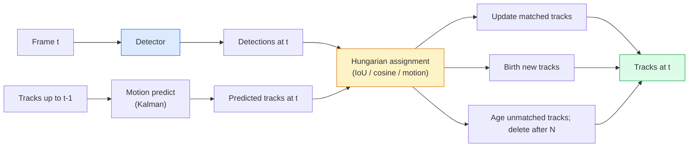

# تتبع متعددة الأجسام وذاكرة الفيديو

> تتبع هو الكشف 加 ارتباط.检测每一── حسب الهوية سيتم مطابق الكشفات الحالية إلى آثار العلوية.

**Type:** Build
**Languages:** Python
**Prerequisites:** Phase 4 Lesson 06 (YOLO Detection), Phase 4 Lesson 08 (Mask R-CNN), Phase 4 Lesson 24 (SAM 3)
**Time:** ~60 分钟

## 學习目标

- 区分 تتبع-ب-اكتشاف 与 استفسار القائم على تتبع,并说出算法家族名称(SORT, DeepSORT, ByteTrack, BoT-SORT, SAM 2 متابعة الذاكرة, SAM 3.1 Object Multiplex)
- من التحقق من IoU + المهام المجرية، للاستخدام التقليدي التتبع-الاكتشاف
- تفسير بنك الذاكرة SAM 2 ، ولماذا هو أكثر قادرة على معالجة الإغلاق مقارنة على إستخدام الـ IoU
- 读懂三种跟踪指标(MOTA، IDF1, HOTA) ،并为给定用例 选择最重要的一项

## 问题

الكشف سيخبرك بالأشياء التي في الداخل في أي مكان.`t`أيّة أثر مع الإطار`t-1`و لكن بدون هذا النقطة لا يمكنك حساب عدد الأشياء التي تمر عبر خط، لا يمكنك أن تتبع الكرة في الغلق، ولا يمكنك أن تعرف أن السيارة رقم 4 قد توقفت في الطريق لمدة 8 ثوان

تتبع لكل منتج يتجه إلى الفيديو هي أمر بالغ الأهمية: تحليل الرياضة، المراقبة، القيادة الذاتية، تحليل الفيديو الطبي، مراقبة الحياة البرية، حساب العلامات الكلمة.

عام 2026 يُحدث نوعين من النماذج الجديدة:**SAM 2 memory-based tracking**(بالذكرى المميزة بدل رابطة النموذج الحركي) و **SAM 3.1 Object Multiplex**(لعدة حالات من نفس المفهوم مشاركة الذاكرة)

## مفهوم الأساسي

### التتبع عن طريق الكشف



كل متابعة ستقابلها في عام 2026، هي تغيرات في هذه الدورة

- **SORT**(2016): فلتر كالمين + IoU مجري‬‬简单、快速, بدون نموذج مظهر‬‬
- **DeepSORT**(2017): SORT + كل رقة واحد على أساس CNN ميزة مظهر ((ReID Embedding)
- **ByteTrack**(2021): إعادة الكشف عن الوقاية منخفضة الوقاية  كمرحلة ثانية لإجراء علاقة؛ لا تحتاج إلى ميزات المظهر، ولكن في MOT17 上表现领先──
- **BoT-SORT**(2022): بايت + تعويض حركة الكاميرا + ReID。
- **StrongSORT / OC-SORT** طريقة بايت تراك اللاحقة، مع تحرك أفضل ومظهر أفضل

### 一段话 تفهم كالمان filter

فلتر كالمين لكل مسار  الحفاظ على حالة من التغيرات`(x, y, w, h, dx, dy, dw, dh)`في كل مرة، فإنه يستخدم نموذج السرعة المستمرة أولا**predict**حالة، ثم باستخدام التعرف على مطابقة**update** عدم اليقين المتوقع  أعلى  تحديث 会更信任 اكتشاف‬‬‬‬‬‬‬‬‬‬‬‬‬‬‬‬‬‬‬‬‬‬‬‬‬‬‬‬‬‬‬‬‬‬‬‬‬‬‬‬‬‬‬‬‬‬‬‬‬‬‬‬‬‬‬‬‬‬‬‬‬‬‬‬‬‬‬‬‬‬‬‬‬‬‬‬‬‬‬‬‬‬‬‬‬‬‬‬‬‬‬‬‬‬‬‬‬‬‬‬‬‬‬‬‬‬‬‬‬‬‬‬‬‬‬‬‬‬‬‬‬‬‬‬‬‬‬‬‬‬‬‬‬‬‬‬‬‬‬‬‬‬‬‬‬‬‬‬‬‬‬‬‬‬‬‬‬‬‬‬‬‬‬‬‬‬‬‬‬‬‬‬‬‬‬‬‬‬‬‬‬‬‬‬‬‬‬‬‬‬‬‬‬‬‬‬‬‬‬‬‬‬‬‬‬‬‬‬‬‬‬‬‬‬‬‬‬‬‬‬‬‬‬‬‬‬‬‬‬‬‬‬‬‬‬‬‬‬‬‬‬‬‬‬‬‬‬‬‬‬‬‬‬‬‬‬‬‬‬‬‬‬‬‬‬‬‬‬‬‬‬‬‬‬‬‬‬‬‬‬‬‬‬‬‬‬‬‬‬‬‬‬‬‬‬‬‬‬‬‬‬‬‬‬‬‬‬‬‬‬‬‬‬‬‬‬‬‬‬‬‬‬‬‬‬‬‬‬‬‬‬‬‬‬‬‬‬‬‬‬‬‬‬‬‬‬‬‬‬‬‬‬‬‬‬‬‬‬‬‬‬‬‬‬‬‬‬‬‬‬‬‬‬‬‬‬‬‬‬‬‬‬‬‬‬‬‬‬‬‬‬‬‬‬‬‬‬‬‬‬‬‬‬‬‬‬‬‬‬‬‬‬‬‬‬‬‬‬‬‬‬‬‬‬‬‬‬‬‬‬‬‬‬‬‬‬‬‬‬‬‬‬‬‬‬‬‬‬‬‬‬‬‬‬‬‬‬‬‬‬‬‬‬‬‬‬‬‬‬‬‬‬‬‬‬‬‬‬‬‬‬‬‬‬‬‬‬

كل متابعة كلاسيكية في خطوة التنبؤ بالحركة باستخدام مرشح كالمين

### الخوارزمية المجرية

أعطني واحدة`M x N`المصفوفة التكلفة ((مسارات x الكشف) ، بحث لتحقيق التكلفة الإجمالية`1 - IoU(track_bbox, detection_bbox)`أو الميزات المظهر من السلبية تشابه الكوسين. الوقت التشغيلي هو O(((M+N) ^3); عندما M、N أعلى حوالي 1000 时, 通过`scipy.optimize.linear_sum_assignment`فى بايثون فايفايفايفايفايفايفايفايفايفايفايفايفايفايفايفايفايفايفايفايفايفايفايفايفايفايفايفايفايفايفايفايفايفايفايفايفايفايفايفايفايفايفايفايفايفايفايفايفايفايفايفايفايفايفايفايفايفايفايفايفايفايفايفايفايفايفايفايفايفايفايفايفايفايفايفايفايفايفايفايفايفايفايفايفايفايفايفايفايفايفايفايفايفايفايفايفايفايفايفايفايفايفايفايفايفايفايفايفايفايفايفايفايفايفايفايفايفايفايفايفايفايفايفايفايفايفايفايفايفايفايفايفايفايفايفايفايفايفايفايفايفايفايفايفايفايفايفايفايفايفايفايفايفايفايفايفايفايفايفايفايفايفايفايفايفايفايفايفايفايفايفايفايفايفايفايفايفايفايفايفايفايفايفايفايفايفايفايفايفايفايفايفايفايفايفايفايفايفايفايفايفايفايفايفايفايفايفايفايفايفايفايفايفايفايفايفايفايفايفايفايفايفايفايفايفايفايفايفايفايفايفايفايفايفايفايفايفايفايفايفايفايفايفايفايفايفايفايفايفايفايفايفاي

### فكرة الرئيسية

ستاندرد تراقيرز سوف تخسر الاكتشافات القليلة التوقعات ((< 0.5)。ByteTrack سوف تحتفظ بها ك**second-stage candidates**أولاً، سوف تتمكن المسارات من تكييفها مع الكشف عن الثقة العالية، ثم دعم المسارات غير المتكافئة تستخدم عتبة IoU متخففة قليلاً، حاول تكييف الكشف عن الثقة المنخفضة، وبالتالي يمكنك استعادة الاحتفالات المختلفة، وتقليل المفاتيح التعرفية القريبة من مجموعة الأشخاص.

### SAM 2 تتبع القائم على الذاكرة

SAM 2  من خلال الحفاظ على الميزات الفضائية-الوقتية لكل حالة **memory bank**لتعامل الفيديو. تم تحديد المشاركة على الموقع. بعد ذلك، سوف تقوم بتعديل المثال إلى الذاكرة. في المرحلة التالية، سوف تقوم بتعديل الاهتمام المتبادل مع الميزات الجديدة.

没有 Kalman filter,也没有匈牙利任务── 关联 隐含在记忆-注意中──

优点:
- على نطاق واسع الاحتيال 鲁棒(ذاكرة 会跨多携带实例身份)
- مع SAM 3 من طلبات النص 结合时支持开放词库──
- 无需单独的运动模型──

缺点:
- بالنسبة لتتبع العديد من الأشياء، بل أسرع من ByteTrack.
- بنك الذاكرة 会增长; نافذة السياق 受限──

### SAM 3.1 كائن متعدد

سيتم تعقب SAM 2 / SAM 3 في كل حالة حافظ على بنك ذاكرة مستقل. 50 كائن.**per-instance query tokens**ذاكرة مشتركة: تكلفة: نمو الحالات

المجموعة المتعددة هي 2026 سنة تعقب الحشد

###  بحاجة إلى معرفة ثلاث أشكال

- **MOTA (Multi-Object Tracking Accuracy)** 1 - (FN + FP + ID المفتاحات) / GT。 حسب نوع الخطأ 加权؛ هذا واحد سوف الكشف و فشل الربط 混合 معا الميتر واحد。
- **IDF1 (ID F1)** دقة الهوية مع المتوسط الهارموني للذكرى.
- **HOTA (Higher Order Tracking Accuracy)** 分解为 تحديد دقة (DetA) و دقة الرابط (AssA) ―― منذ عام 2020 已以来的社区标准;最全面──

对于监控(من هو من): 报告 IDF1──对于体育分析(عد البطاقات):HOTA──对于一般学术比较:HOTA──


```figure
cv3-track-assoc
```

## بناءها

### الخطوة 1: مبنية على المصفوفة التكلفة

```python
import numpy as np


def bbox_iou(a, b):
    """
    a, b: [x1, y1, x2, y2] 的 (N, 4) arrays。
    返回 (N_a, N_b) IoU matrix。
    """
    ax1, ay1, ax2, ay2 = a[:, 0], a[:, 1], a[:, 2], a[:, 3]
    bx1, by1, bx2, by2 = b[:, 0], b[:, 1], b[:, 2], b[:, 3]
    inter_x1 = np.maximum(ax1[:, None], bx1[None, :])
    inter_y1 = np.maximum(ay1[:, None], by1[None, :])
    inter_x2 = np.minimum(ax2[:, None], bx2[None, :])
    inter_y2 = np.minimum(ay2[:, None], by2[None, :])
    inter = np.clip(inter_x2 - inter_x1, 0, None) * np.clip(inter_y2 - inter_y1, 0, None)
    area_a = (ax2 - ax1) * (ay2 - ay1)
    area_b = (bx2 - bx1) * (by2 - by1)
    union = area_a[:, None] + area_b[None, :] - inter
    return inter / np.clip(union, 1e-8, None)
```

### الخطوة 2: أحدث نوع من الاختيارات

لـ "الصفحة البسيطة" ،省略 ثابت السرعة الكالمان؛ هنا استخدام ارتباط IoU بسيط؛ في بيئة الإنتاج، كالمان التنبؤ هو أمر ضروري.`sort`حزمة Python 提供完整版本──

```python
from scipy.optimize import linear_sum_assignment


class Track:
    def __init__(self, tid, bbox, frame):
        self.id = tid
        self.bbox = bbox
        self.last_frame = frame
        self.hits = 1

    def update(self, bbox, frame):
        self.bbox = bbox
        self.last_frame = frame
        self.hits += 1


class SimpleTracker:
    def __init__(self, iou_threshold=0.3, max_age=5):
        self.tracks = []
        self.next_id = 1
        self.iou_threshold = iou_threshold
        self.max_age = max_age

    def step(self, detections, frame):
        if not self.tracks:
            for d in detections:
                self.tracks.append(Track(self.next_id, d, frame))
                self.next_id += 1
            return [(t.id, t.bbox) for t in self.tracks]

        track_boxes = np.array([t.bbox for t in self.tracks])
        det_boxes = np.array(detections) if len(detections) else np.empty((0, 4))

        iou = bbox_iou(track_boxes, det_boxes) if len(det_boxes) else np.zeros((len(track_boxes), 0))
        cost = 1 - iou
        cost[iou < self.iou_threshold] = 1e6

        matched_track = set()
        matched_det = set()
        if cost.size > 0:
            row, col = linear_sum_assignment(cost)
            for r, c in zip(row, col):
                if cost[r, c] < 1.0:
                    self.tracks[r].update(det_boxes[c], frame)
                    matched_track.add(r); matched_det.add(c)

        for i, d in enumerate(det_boxes):
            if i not in matched_det:
                self.tracks.append(Track(self.next_id, d, frame))
                self.next_id += 1

        self.tracks = [t for t in self.tracks if frame - t.last_frame <= self.max_age]
        return [(t.id, t.bbox) for t in self.tracks]
```

60 行── استلام الكشف عن الإطار، وعودة إعلانات المسار لكل الإطار──真实系统也会加入Kalman التنبؤ、ByteTrack المرحلة الثانية إعادة مطابقة، فضلا عن ميزات المظهر──

### الخطوة الثالثة: اختبار المسار الاصطناعي

```python
def synthetic_frames(num_frames=20, num_objects=3, H=240, W=320, seed=0):
    rng = np.random.default_rng(seed)
    starts = rng.uniform(20, 200, size=(num_objects, 2))
    velocities = rng.uniform(-5, 5, size=(num_objects, 2))
    frames = []
    for f in range(num_frames):
        dets = []
        for i in range(num_objects):
            cx, cy = starts[i] + f * velocities[i]
            dets.append([cx - 10, cy - 10, cx + 10, cy + 10])
        frames.append(dets)
    return frames


tracker = SimpleTracker()
for f, dets in enumerate(synthetic_frames()):
    tracks = tracker.step(dets, f)
```

ثلاثة أشياء تقع في حركة مستقيمة يجب أن تكون قادرة على الحفاظ على هوية خاصة بها في جميع 20 

### 步骤 4: مقياس تحويل الهوية

```python
def count_id_switches(tracks_per_frame, gt_per_frame):
    """
    tracks_per_frame:  list of list of (track_id, bbox)
    gt_per_frame:      list of list of (gt_id, bbox)
    返回 ID switches 的数量。
    """
    prev_assignment = {}
    switches = 0
    for tracks, gts in zip(tracks_per_frame, gt_per_frame):
        if not tracks or not gts:
            continue
        t_boxes = np.array([b for _, b in tracks])
        g_boxes = np.array([b for _, b in gts])
        iou = bbox_iou(g_boxes, t_boxes)
        for g_idx, (gt_id, _) in enumerate(gts):
            j = iou[g_idx].argmax()
            if iou[g_idx, j] > 0.5:
                t_id = tracks[j][0]
                if gt_id in prev_assignment and prev_assignment[gt_id] != t_id:
                    switches += 1
                prev_assignment[gt_id] = t_id
    return switches
```

هذا هو مدى تقارب IDF1:统计一个地面真相对象更换其分配预测轨道ID的次数――真实的MOTA / IDF1 / HOTA 工具位于`py-motmetrics`和 `TrackEval`في الوسط

## استخدمها

متابعة درجة الإنتاج لعام 2026:

- `ultralytics` YOLOv8 + 内置 بايت تراك / بوت-SORT`results = model.track(source, tracker="bytetrack.yaml")`✿默认选择✿
- `supervision`(روبوتات)  غلفات بايت تراك بالإضافة إلى خدمات التعليقات
- SAM 2 / SAM 3.1  通過 `processor.track()`قيام بتتبع القائم على الذاكرة‬
- كومة مخصصة: الكشف (YOLOv8 / RT-DETR) + `sort-tracker`- لا ، لا`OC-SORT`- لا ، لا`StrongSORT`.

选择方式:

- 30+ fps أسفل المشاة / السيارات / الصناديق:**ByteTrack with ultralytics**.
- هناك الكثير من الحالات:**SAM 3.1 Object Multiplex**.
- مع ظهور واضح ، الاحتياجات الثقيلة:**DeepSORT / StrongSORT**(ميزات إعادة التأمين)
- الرياضة / التفاعلات المعقدة:**BoT-SORT**أو متابعة تعلم ((MOTRv3)

## 交付 it

本课会产出:

- `outputs/prompt-tracker-picker.md`   حسب نوع المشهد、أنماط الإغلاق و ميزانية التأخير 选择 SORT / ByteTrack / BoT-SORT / SAM 2 / SAM 3.1。
- `outputs/skill-mot-evaluator.md` 编写一个完整的评估带,用于针对地面真相轨迹 评估MOTA / IDF1 / HOTA。

## التدريب

1. **(Easy)**استخدم متابعة صناعية أعلاه على حدة 3、10 و 30 كائن ‬‬‬‬‬‬‬‬‬‬‬‬‬‬‬‬‬‬‬‬‬‬‬‬‬‬‬‬‬‬‬‬‬‬‬‬‬‬‬‬‬‬‬‬‬‬‬‬‬‬‬‬‬‬‬‬‬‬‬‬‬‬‬‬‬‬‬‬‬‬‬‬‬‬‬‬‬‬‬‬‬‬‬‬‬‬‬‬‬‬‬‬‬‬‬‬‬‬‬‬‬‬‬‬‬‬‬‬‬‬‬‬‬‬‬‬‬‬‬‬‬‬‬‬‬‬‬‬‬‬‬‬‬‬‬‬‬‬‬‬‬‬‬‬‬‬‬‬‬‬‬‬‬‬‬‬‬‬‬‬‬‬‬‬‬‬‬‬‬‬‬‬‬‬‬‬‬‬‬‬‬‬‬‬‬‬‬‬‬‬‬‬‬‬‬‬‬‬‬‬‬‬‬‬‬‬‬‬‬‬‬‬‬‬‬‬‬‬‬‬‬‬‬‬‬‬‬‬‬‬‬‬‬‬‬‬‬‬‬‬‬‬‬‬‬‬‬‬‬‬‬‬‬‬‬‬‬‬‬‬‬‬‬‬‬‬‬‬‬‬‬‬‬‬‬‬‬‬‬‬‬‬‬‬‬‬‬‬‬‬‬‬‬‬‬‬‬‬‬‬‬‬‬‬‬‬‬‬‬‬‬‬‬‬‬‬‬‬‬‬‬‬‬‬‬‬‬‬‬‬‬‬‬‬‬‬‬‬‬‬‬‬‬‬‬‬‬‬‬‬‬‬‬‬‬‬‬‬‬‬‬‬‬‬‬‬‬‬‬‬‬‬‬‬‬‬‬‬‬‬‬‬‬‬‬‬‬‬‬‬‬‬‬‬‬‬‬‬‬‬‬‬‬‬‬‬‬‬‬‬‬‬‬‬‬‬‬‬‬‬‬‬‬‬‬‬‬‬‬‬‬‬‬‬‬‬‬‬‬‬‬‬‬‬‬‬‬‬‬‬‬‬‬‬‬‬‬‬‬‬‬‬‬‬‬‬‬‬‬‬‬‬‬‬‬‬‬‬‬‬‬‬‬‬‬‬‬‬‬
2. **(Medium)**في رابطة 之前加入 ثابت السرعة تقدير كالمان خطوة──展示短暂(2-3 ) الإقصاءات 不再导致 ID Switches──
3. **(Hard)**集成 SAM 2                                                                                                                                                                                                                                                                                                                                                                                                                                                                                                                         `transformers`) كخلفية بديلة للمتعقب.

## 关键术语

| Term | 常见说法 | 实际含义 |
|------|----------------|----------------------|
| Tracking-by-detection | “先 detect 再 associate” | Per-frame detector + 基于 IoU / appearance 的 Hungarian assignment |
| Kalman filter | “Motion predict” | Linear dynamics + covariance，用于平滑 track predictions 和处理 occlusion |
| Hungarian algorithm | “Optimal assignment” | 求解 minimum-cost bipartite matching 问题；`scipy.optimize.linear_sum_assignment` |
| ByteTrack | “低置信度 second pass” | 将未匹配 tracks 重新匹配到低置信度 detections，以恢复短暂 occlusions |
| DeepSORT | “SORT + appearance” | 添加 ReID feature 用于跨帧匹配；更利于保持 ID |
| Memory bank | “SAM 2 trick” | 跨帧存储的 per-instance spatio-temporal features；cross-attention 替代显式 association |
| Object Multiplex | “SAM 3.1 shared memory” | 使用带 per-instance queries 的单一 shared memory，实现快速 many-object tracking |
| HOTA | “现代 tracking metric” | 分解为 detection 和 association accuracy；社区标准 |

## 延伸阅读

- [SORT (Bewley et al., 2016)](https://arxiv.org/abs/1602.00763) 最小 تتبع-من خلال الكشف 论文
- [DeepSORT (Wojke et al., 2017)](https://arxiv.org/abs/1703.07402) 添加 ميزة المظهر
- [ByteTrack (Zhang et al., 2022)](https://arxiv.org/abs/2110.06864) 低置信度 مرّة ثانية
- [BoT-SORT (Aharon et al., 2022)](https://arxiv.org/abs/2206.14651) تعويضات حركة الكاميرا
- [HOTA (Luiten et al., 2020)](https://arxiv.org/abs/2009.07736) 分解式 تعقب الميتر
- [SAM 2 video segmentation (Meta, 2024)](https://ai.meta.com/sam2/) متابعة القائمة على الذاكرة
- [SAM 3.1 Object Multiplex (Meta, March 2026)](https://ai.meta.com/blog/segment-anything-model-3/)
