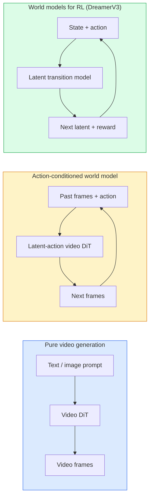

# النماذج العالمية وتوزيع الفيديو

> نموذج فيديو قادر على التنبؤ بالمشهد في المستقبل، هو جهاز محاكاة العالم.

**Type:** Learn + Build
**Languages:** Python
**Prerequisites:** Phase 4 Lesson 10 (Diffusion), Phase 4 Lesson 12 (Video Understanding), Phase 4 Lesson 23 (DiT + Rectified Flow)
**Time:** ~75 分钟

## 學习目标
- 解释纯视频生成模型(سورا 2) والفرق بين النموذج العالمي المتحرك ((جنين 3 ، DreamerV3)
- وصف الفيديو DiT:مساحات الفضاء-الوقت  تشفير الموقف ثلاثي الأبعاد `(T, H, W)`الاهتمام المشترك
- 追踪 World Model 如何接入机器人:VLM 规划 → نموذج الفيديو 模拟 → ديناميكا معاكسة 输出动作
- 针对给定用例 ((فيديو إبداعي ]] سم التفاعلي ]] مختلطة القيادة الذاتية) 在 Sora 2 、Genie 3 、Runway GWM-1 Worlds、Wan-Video 和 HunyuanVideo 之间做选择

## 问题
视频生成和世界模型在2026年走向融合──一个能够生成连贯一分钟视频的模型,在某种意义上已经学到了世界如何运动:对象永久性,重力,因果性,风格──如果你 تضع هذه التنبؤة في حالة حركة (((向左走、开门), فإن نموذج الفيديو سوف يصبح محاكاة قابلة للتعلم, يمكن استبدال محرك اللعبة, محاكاة القيادة أو بيئة الروبوتات──

تأثيرها محدد جدا ً. الجينيه 3 يمكن أن تتم من مجرد صور تصميمات لتوليد بيئة قابلة للعب. . . . . . . . . . . . . . . . . . . . . . . . . . . . . . . . . . . . . . . . . . . . . . . . . . . . . . . . . . . . . . . . . . . . . . . . . . . . . . . . . . . . . . . . . . . . . . . . . . . . . . . . . . . . . . . . . . . . . . . . . . . . . . . . . . . . . . . . . . . . . . . . . . . . . . . . . . . . . . . . . . . . . . . . . . . . . . . . . . . . . . . . . . . . . . . . . . . . . . . . . . . . . . . . . . . . . . . . . . . . . . . . . . . . . . . . . . . . . . . . . . . . . . . . . . . . . . . . . . . . . . . . . . . . . . . . . . . . . . . . . . . . . . . . . . . . . . . . . . . . . . . . . . . . . . . . . . . . . . . . . . . . . . . . . . . . . . . . . . . . . . . . . . . . . . . . . . . . . . . . . . . . . . . . . . . . . . . . . . . . . . . . . . . . . . . . . . . . . . . . . . . . . . . . . . . . . . . . . . . . . . . . . . . . . . . . . . . . . . . . . . . . . . . . . . . . . . . . . . . . . . . . . . . . . . . . . . . . . . .

هذا الدرس هو الدرس في المرحلة 4 من الـ                                                                                                                                                                                                                                                        

## 概念
### النموذج العالمي



- **Sora 2**يَبْنُ إشاراتَ  تَصْدِيرَ المُشْتَرَطَاتِ الصَفَحَةِ  بدونَ حَرْفَةِ المُواصلةِ ‬ لا يمكنكَ التحكمَ فيهِ في طريقِ التَصْدِيرِ ‬
- **Genie 3**.**GWM-1 Worlds**.**Mirage / Magica**هي نماذج عالمية مشروطة بالعمل. فهي تنطوي على إجراءات خفية من خلال مشاهدة الفيديو، ثم تنطوي على مستقبل.
- **DreamerV3**和经典 RL World Model 家族 إجراء التنبؤ في الفضاء الخفي،并带有显式行动定制, على أساس إشارة مكافأة 训练――视觉性较弱; ولكن بالنسبة إلى RL نموذجية أكثر فائدة

### معمارة الفيديو

```
Video latent:          (C, T, H, W)
Patchify (spatial):    grid of P_h x P_w patches per frame
Patchify (temporal):   group P_t frames into a temporal patch
Resulting tokens:      (T / P_t) * (H / P_h) * (W / P_w) tokens
```

التشفير الموضعي هو 3D : على كل `(t, h, w)`坐标使用 دوران أو تعلم إدراجها.

- **Full joint** جميع الرموز الحاضرة إلى جميع الرموز.
- **Divided** 交替执行 temporal attention  نفس الموقف الفضائي 跨时间:`(H*W) * T^2`) و الاهتمام الفضائي ((( نفس الوقت`T * (H*W)^2`(■■ TimeSformer و معظم المشاهدين الفيديو يستخدمون هذا النوع من الوسائط
- **Window** في `(t, h, w)`中使用局部窗户──Video Swin 使用这种方式──

كل 2026 سنة فيديو Diffusion 模型都将使用这三种模式之一,再加 AdaLN 调节 (درس 23) والتيج المحسّن.

### 基于动作的 تكييف: نماذج عمل مشبوهة

جيني 通過判別式地预测一对连续之间的动作,为每一学习一个 **latent action** ثم يقوم الموديل بتشخيص الحركة الخفية التي يتم اقتراحها، بدلاً من الضغط على المفتاح. في الإستنتاج، يمكن للمستخدم تحديد عمل خفية (أو من نموذج جديد من قبل) ، ويتم إنشاء الموديل مع هذا التحرك.

سورا  قفز تماما عن التفاعل التنفيذي ‬ ‫معدل تعريفه من رموز الزمن الفضائي الماضي ‬ ‫توقيع رموز الزمن الفضائي القادم‬ ‫‬ ‫فقط تحطم النقطة ؛ في طريق التوليد لا يوجد شيء يمكن التحكم به‬‬

### الموافقة الجسدية

صوتا 2 عام 2026 إصدار واضحة**physical plausibility**: الوزن والتوازن ثباتاً للأشياء والسبب والنتيجة. تم قياس درجات المثقلة من خلال تقييمات اصطناعية للطاقم.

المثبات  مازالت النموذج الفاشل الرئيسي  عامي 2024-2025 يظهر الناس تناول القطع اليدوية أو شرب الماء من كوب الزجاج مشكلة عدم وجود تمثيل كائن دائم  عامي 2026 نموذج  سورة 2  الجيل التابع 5  فيديو هونيوان) تقلل من هذه المشاكل ، ولكن لم يتم القضاء عليها 

### نموذج العالم الذاتي القيادة

نموذجات العالم القيادة سوف تنتج على أساس المسارات أو صناديق التقاط أو خرائط الملاحة

- **Cosmos-Drive-Dreams**(NVIDIA)  لدرجة تدريب RL 生成数分钟驾驶视频。
- **Gaia-2**(المتفاجئة)  يستخدم لتقييم السياسة من خلال تركيب المشهد المحدد للمسيرات
- **DrivingWorld**(تيسلا)  模拟多样气,时间和交通条件──
- **Vista**(بايت دانس)  响应式驾驶场景合成──

لقد استبدلت هذه المعلومات من جمع بيانات العالم الحقيقي الثمينة، لتمكن من تغطية حالات الزاوية، مثل: "مشي ليلي" يمر عبر الطريق، "مشي في الجليد"، "مشهد نادر"؛ وإلا فإن هذه الحالات تتطلب ملايين الأميال من القيادة لجمعها.

### 机器人技术:VLM + نموذج الفيديو + ديناميكا عكسية

هناك ثلاثة عناصر في حلقة الروبوتات:

1. **VLM**解析目标 ((拿起红色杯子),规划高水平行动序列──
2. **Video generation model**模拟执行每个动作会是什么样子,预测未来 N  مشاهدات
3. **Inverse dynamics model**提取会产生 هذه الملاحظات من أوامر المحركات المحددة

هذا استبدل تشكيل المكافأة و RL ثقيلة العينة. نموذج العالم  مسئول التفكير. الديناميكيات العكسية في التنفيذ على مستوى الحلقة المغلقة.

### التقييم

- **Visual quality** FVD (Fréchet Video Distance) 、研究用户──
- **Prompt alignment** كل تقييم على النمط CLIPScore、VQA
- **Physical plausibility** في مجموعة مقياسات 上人工评分(المقياس الداخلي Sora 2 、VBench)
- **Controllability**(توجّه إلى نماذج عالم تفاعلية)  العمل → التواصل الملاحظي; هل يمكنك العودة إلى الحالة السابقة؟

### 2026 سنة

| Model | Use | Parameters | Output | License |
|-------|-----|------------|--------|---------|
| Sora 2 | text-to-video, audio | — | 1-min 1080p + audio | API only |
| Runway Gen-5 | text/image-to-video | — | 10s clips | API |
| Runway GWM-1 Worlds | interactive world | — | infinite 3D rollout | API |
| Genie 3 | interactive world from image | 11B+ | playable frames | research preview |
| Wan-Video 2.1 | open text-to-video | 14B | high-quality clips | non-commercial |
| HunyuanVideo | open text-to-video | 13B | 10s clips | permissive |
| Cosmos / Cosmos-Drive | autonomous driving sim | 7-14B | driving scenes | NVIDIA open |
| Magica / Mirage 2 | AI-native game engine | — | modifiable worlds | product |


```figure
v4-world-rollout
```

## بناءها
### الخطوة 1: تصفيف الفيديو 3D

```python
import torch
import torch.nn as nn


class VideoPatch3D(nn.Module):
    def __init__(self, in_channels=4, dim=64, patch_t=2, patch_h=2, patch_w=2):
        super().__init__()
        self.proj = nn.Conv3d(
            in_channels, dim,
            kernel_size=(patch_t, patch_h, patch_w),
            stride=(patch_t, patch_h, patch_w),
        )
        self.patch_t = patch_t
        self.patch_h = patch_h
        self.patch_w = patch_w

    def forward(self, x):
        # x: (N, C, T, H, W)
        x = self.proj(x)
        n, c, t, h, w = x.shape
        tokens = x.reshape(n, c, t * h * w).transpose(1, 2)
        return tokens, (t, h, w)
```

خطوة واحدة مثل محور 3D في النواة سوف تكون معطفاً فضائياً وقتاً`(T, H, W) -> (T/2, H/2, W/2)`من الرموز

### 步骤 2: 3D وضع التدوير التشفير

إرسال الموقف المتحرك (RoPE) 分别沿 `t`.`h`.`w`轴应用:

```python
def rope_3d(tokens, t_dim, h_dim, w_dim, grid):
    """
    tokens: (N, T*H*W, D)
    grid: (T, H, W) sizes
    t_dim + h_dim + w_dim == D
    """
    T, H, W = grid
    n, seq, d = tokens.shape
    if t_dim + h_dim + w_dim != d:
        raise ValueError(f"t_dim+h_dim+w_dim ({t_dim}+{h_dim}+{w_dim}) must equal D={d}")
    assert seq == T * H * W
    t_idx = torch.arange(T, device=tokens.device).repeat_interleave(H * W)
    h_idx = torch.arange(H, device=tokens.device).repeat_interleave(W).repeat(T)
    w_idx = torch.arange(W, device=tokens.device).repeat(T * H)
    # Simplified: just scale channels by frequencies. Real RoPE rotates pairs.
    freqs_t = torch.exp(-torch.log(torch.tensor(10000.0)) * torch.arange(t_dim // 2, device=tokens.device) / (t_dim // 2))
    freqs_h = torch.exp(-torch.log(torch.tensor(10000.0)) * torch.arange(h_dim // 2, device=tokens.device) / (h_dim // 2))
    freqs_w = torch.exp(-torch.log(torch.tensor(10000.0)) * torch.arange(w_dim // 2, device=tokens.device) / (w_dim // 2))
    emb_t = torch.cat([torch.sin(t_idx[:, None] * freqs_t), torch.cos(t_idx[:, None] * freqs_t)], dim=-1)
    emb_h = torch.cat([torch.sin(h_idx[:, None] * freqs_h), torch.cos(h_idx[:, None] * freqs_h)], dim=-1)
    emb_w = torch.cat([torch.sin(w_idx[:, None] * freqs_w), torch.cos(w_idx[:, None] * freqs_w)], dim=-1)
    return tokens + torch.cat([emb_t, emb_h, emb_w], dim=-1)
```

هذا هو شكل إضافي بسيط.

### 步骤 3: حظر الانتباه المقسم

```python
class DividedAttentionBlock(nn.Module):
    def __init__(self, dim=64, heads=2):
        super().__init__()
        self.time_attn = nn.MultiheadAttention(dim, heads, batch_first=True)
        self.space_attn = nn.MultiheadAttention(dim, heads, batch_first=True)
        self.ln1 = nn.LayerNorm(dim)
        self.ln2 = nn.LayerNorm(dim)
        self.ln3 = nn.LayerNorm(dim)
        self.mlp = nn.Sequential(nn.Linear(dim, 4 * dim), nn.GELU(), nn.Linear(4 * dim, dim))

    def forward(self, x, grid):
        T, H, W = grid
        n, seq, d = x.shape
        # time attention: same (h, w), across t
        xt = x.view(n, T, H * W, d).permute(0, 2, 1, 3).reshape(n * H * W, T, d)
        a, _ = self.time_attn(self.ln1(xt), self.ln1(xt), self.ln1(xt), need_weights=False)
        xt = (xt + a).reshape(n, H * W, T, d).permute(0, 2, 1, 3).reshape(n, seq, d)
        # space attention: same t, across (h, w)
        xs = xt.view(n, T, H * W, d).reshape(n * T, H * W, d)
        a, _ = self.space_attn(self.ln2(xs), self.ln2(xs), self.ln2(xs), need_weights=False)
        xs = (xs + a).reshape(n, T, H * W, d).reshape(n, seq, d)
        xs = xs + self.mlp(self.ln3(xs))
        return xs
```

الاهتمام بالوقت في كل موقف فضائي 内跨时间 attend;; space attention 在每一内跨位置 attend;; باستخدام اثنين O(T^2 + (HW) ^2) 操作,بدل واحد O((THW) ^2) 操作;;

### الخطوة 4: 组合一个小视频 DiT

```python
class TinyVideoDiT(nn.Module):
    def __init__(self, in_channels=4, dim=64, depth=2, heads=2):
        super().__init__()
        self.patch = VideoPatch3D(in_channels=in_channels, dim=dim, patch_t=2, patch_h=2, patch_w=2)
        self.blocks = nn.ModuleList([DividedAttentionBlock(dim, heads) for _ in range(depth)])
        self.out = nn.Linear(dim, in_channels * 2 * 2 * 2)

    def forward(self, x):
        tokens, grid = self.patch(x)
        for blk in self.blocks:
            tokens = blk(tokens, grid)
        return self.out(tokens), grid
```

هذا ليس مولد فيديو يعمل؛ إنه عرض هيكلي، يثبت أن شكل كل جزء صحيح.

### 步骤 5: 检查形状

```python
vid = torch.randn(1, 4, 8, 16, 16)  # (N, C, T, H, W)
model = TinyVideoDiT()
out, grid = model(vid)
print(f"input  {tuple(vid.shape)}")
print(f"tokens grid {grid}")
print(f"output {tuple(out.shape)}")
```

الإصلاح  بعد预期 `grid = (4, 8, 8)`و`out = (1, 256, 32)`الرأس بعد ذلك الإلقاء على كل رمز لتعامل مع المفاتيح الفضائية-الوقتية، جاهزة لتحديد المفاتيح

## استخدمها
نموذج الإنتاج لعام 2026:

- **Sora 2 API**(OpenAI)  نص إلى الفيديو 同步音频── أسعار المكافأة
- **Runway Gen-5 / GWM-1**(الرحلة)  الصورة إلى الفيديو ‬العالم التفاعلي‬
- **Wan-Video 2.1 / HunyuanVideo**  开源自托管。
- **Cosmos / Cosmos-Drive**(نفيديا)  قيادة محاكاة الوزن المفتوحة
- **Genie 3** عرض بحثي، تحتاج إلى طلب زيارة

构建互动世界模型演示:从 Wan-Video 开始以获得质量,再叠加一个隐藏动作适配器来实现交互性──对于自动驾驶模拟:Cosmos-Drive是2026年开放参考──

现实中的 روبوتيات:

1. هدف اللغة -> VLM (Qwen3-VL) -> خطة رفيعة المستوى
2. خطة -> نموذج فيديو العمل الخفي -> التنفيذ المتخيل
3. الإطلاق -> نموذج الديناميكية المعاكسة -> إجراءات منخفضة المستوى。
4. 执行 Actions -> ملاحظة تم إعادة إدخالها إلى الخطوة 1。

## 交付 it
本课产出:

- `outputs/prompt-video-model-picker.md`    根据任务、许可 和延迟,在 Sora 2 / 跑道 / Wan / HunyuanVideo / Cosmos 之间做选择──
- `outputs/skill-physical-plausibility-checks.md` تحديد المهارة للتفتيش الآلي ((مستمرة كائن جدية استمرارية) ، تستخدم في عملية التفتيش قبل التسليم أي إنتاج فيديو..

## التدريب
1. **(Easy)**计算一个 5 秒 360p 视频在补丁-t=2、补丁-h=8、补丁-w=8 时的代币数――推理这个规模下关注的内存需求――
2. **(Medium)**ضع كتلة الاهتمام المقسمة فوقها بدلاً من كتلة الاهتمام المشتركة الكاملة,并测量形和参数数── شرح لماذا نماذج الفيديو الحقيقية 必须 استخدام الاهتمام المقسم──
3. **(Hard)**构建一个最小潜动视频模型:使用 `(frame_t, action_t, frame_{t+1})`ثلاثية 数据集(任意简单 2D game), تدريب على عمل مبني على التوابل  شرطية فيديو صغير DiT,并展示不同动作会产生不同下一──

## 关键术语
| Term | What people say | What it actually means |
|------|----------------|----------------------|
| World model | “Learned simulator” | 一个在给定 state 和 action 时预测未来 observations 的模型 |
| Video DiT | “Spacetime transformer” | 使用 3D patchification 和 divided attention 的 Diffusion transformer |
| Latent action | “Inferred control” | 从帧对中推断出的离散或连续 action latent；用于条件化 next-frame generation |
| Divided attention | “Time then space” | 每个 block 中的两个 attention 操作：先跨时间，再跨空间，用来让 O(N^2) 保持可控 |
| Object permanence | “Things stay real” | video models 必须学会的场景属性；在食物、玻璃器皿上的经典失败模式 |
| FVD | “Fréchet Video Distance” | FID 的视频等价物；主要 visual quality metric |
| Inverse dynamics model | “Observations to actions” | 给定 `(state, next state)`，输出连接二者的 action；闭合 robotics loop |
| Cosmos-Drive | “NVIDIA driving sim” | 用于 RL 和 evaluation 的 open-weights autonomous-driving world model |

## 延伸阅读
- [Sora technical report (OpenAI)](https://openai.com/index/video-generation-models-as-world-simulators/)
- [Genie: Generative Interactive Environments (Bruce et al., 2024)](https://arxiv.org/abs/2402.15391) نماذج عالم العمل الخفية
- [TimeSformer (Bertasius et al., 2021)](https://arxiv.org/abs/2102.05095) استخدام تحويلات الفيديو من الانتباه المقسم
- [DreamerV3 (Hafner et al., 2023)](https://arxiv.org/abs/2301.04104) باستخدام نماذج العالم RL
- [Cosmos-Drive-Dreams (NVIDIA, 2025)](https://research.nvidia.com/labs/toronto-ai/cosmos-drive-dreams/) نموذج العالم للقيادة
- [Top 10 Video Generation Models 2026 (DataCamp)](https://www.datacamp.com/blog/top-video-generation-models)
- [From Video Generation to World Model — survey repo](https://github.com/ziqihuangg/Awesome-From-Video-Generation-to-World-Model/)
