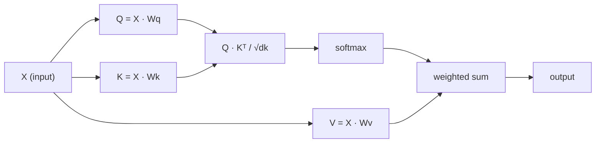

# من التحقق من الاهتمام الذاتي

> الانتباه هو جدول استفسارات، كل كلمة منها تسأل:

**类型：**الإنشاء
**语言：**بايثون
**先修要求：**المرحلة 3 (العمق في التعلم) ، المرحلة 5 الدروس 10 (الترتيب إلى التسلسل)
**时间：**90 دقيقة

## 學习目标

- 仅使用 NumPy 从零实现 规模点-产品自注意,包括查询/关键/价值 投影和软max 加权求和
- 构建多头注意层,用于拆分头、计算并行注意,并拼接结果
-  تتبع المصفوفة الاهتمام  كيفية التقاط الوهم  علاقة,并解释为什么除以 sqrt(d_k) يمكن منع softmax 和
-  تطبيق التخفيض العامل،将 توجيهيه الاهتمام 转换为 autoregressive(decoder-style) الاهتمام

## 问题

تم ضغط معلومات الـ RNNs مرة واحدة معالجة رمز واحد. عندما تصل إلى 50 رمزًا، تم ضغط معلومات الـ Token 1 50 مرة.

بحث عن كيفية معرفة الاهتمام في Bahdanau عام 2014: دع المُفكّر يرجع إلى كلّ مرمّز  موقع، وتحكم على أيّ مواقع للخطوات الحالية مهمة. ولكنّه لا يزال مرفقاً في RNN.

الاهتمام الذاتي  جعل كل مكان في الترتيب يمكن أن يشارك في كل مكان آخر في خطوة متوافقة واحدة ‬هذا هو السبب في أن المحولات ‬سريعة ‬يمكن توسيعها واحتلال المرتبة المهيمنة‬‬‬‬‬‬‬‬‬‬‬‬‬‬‬‬‬‬‬‬‬‬‬‬‬‬‬‬‬‬‬‬‬‬‬‬‬‬‬‬‬‬‬‬‬‬‬‬‬‬‬‬‬‬‬‬‬‬‬‬‬‬‬‬‬‬‬‬‬‬‬‬‬‬‬‬‬‬‬‬‬‬‬‬‬‬‬‬‬‬‬‬‬‬‬‬‬‬‬‬‬‬‬‬‬‬‬‬‬‬‬‬‬‬‬‬‬‬‬‬‬‬‬‬‬‬‬‬‬‬‬‬‬‬‬‬‬‬‬‬‬‬‬‬‬‬‬‬‬‬‬‬‬‬‬‬‬‬‬‬‬‬‬‬‬‬‬‬‬‬‬‬‬‬‬‬‬‬‬‬‬‬‬‬‬‬‬‬‬‬‬‬‬‬‬‬‬‬‬‬‬‬‬‬‬‬‬‬‬‬‬‬‬‬‬‬‬‬‬‬‬‬‬‬‬‬‬‬‬‬‬‬‬‬‬‬‬‬‬‬‬‬‬‬‬‬‬‬‬‬‬‬‬‬‬‬‬‬‬‬‬‬‬‬‬‬‬‬‬‬‬‬‬‬‬‬‬‬‬‬‬‬‬‬‬‬‬‬‬‬‬‬‬‬‬‬‬‬‬‬‬‬‬‬‬‬‬‬‬‬‬‬‬‬‬‬‬‬‬‬‬‬‬‬‬‬‬‬‬‬‬‬‬‬‬‬‬‬‬‬‬‬‬‬‬‬‬‬‬‬‬‬‬‬‬‬‬‬‬‬‬‬‬‬‬‬‬‬‬‬‬‬‬‬‬‬‬‬‬‬‬‬‬‬‬‬‬‬‬‬‬‬‬‬‬‬‬‬‬‬‬‬‬‬‬‬‬‬‬‬‬‬‬‬‬‬‬‬‬‬‬‬‬‬‬‬‬‬‬‬‬‬‬‬‬‬‬‬‬‬‬‬‬‬‬‬‬‬‬‬

## 概念

### نوع استفسار المستندات

ضع الانتباه في صورة استفسار قاعدة بيانات ميسرة:

```
Traditional database:
  Query: "capital of France"  -->  exact match  -->  "Paris"

Attention:
  Query: "capital of France"  -->  similarity to ALL keys  -->  weighted blend of ALL values
```

كل رمز سوف تولد ثلاث متجهات:
- **Query (Q)**:  أنا في البحث عن ماذا؟
- **Key (K)**ماذا يوجد في هذا؟
- **Value (V)**إذا تم اختياره، ما المعلومات التي سوف أقدمها؟

سأل مع كل مفاتيح النقطة المنتج سوف تحصل على نقاط الاهتمام.

### Q、K、V 计算

كل رمز يدمج عبر ثلاث ماتريص الوزن التي يتم تعلمها

```
Input embeddings (sequence of n tokens, each d-dimensional):

  X = [x1, x2, x3, ..., xn]       shape: (n, d)

Three weight matrices:

  Wq  shape: (d, dk)
  Wk  shape: (d, dk)
  Wv  shape: (d, dv)

Projections:

  Q = X @ Wq    shape: (n, dk)      each token's query
  K = X @ Wk    shape: (n, dk)      each token's key
  V = X @ Wv    shape: (n, dv)      each token's value
```

من الناحية البصرية، بالنسبة لوكينة:

```
             Wq
  x_i ------[*]------> q_i    "What am I looking for?"
       |
       |     Wk
       +----[*]------> k_i    "What do I contain?"
       |
       |     Wv
       +----[*]------> v_i    "What do I offer?"
```

### المصفوفة الاهتمام

بمجرد أن تحصل على جميع الوهم Q K V، الاهتمام نقاط سوف تشكل المصفوفة:

```
Scores = Q @ K^T    shape: (n, n)

              k1    k2    k3    k4    k5
        +-----+-----+-----+-----+-----+
   q1   | 2.1 | 0.3 | 0.1 | 0.8 | 0.2 |   <- how much q1 attends to each key
        +-----+-----+-----+-----+-----+
   q2   | 0.4 | 1.9 | 0.7 | 0.1 | 0.3 |
        +-----+-----+-----+-----+-----+
   q3   | 0.2 | 0.6 | 2.3 | 0.5 | 0.1 |
        +-----+-----+-----+-----+-----+
   q4   | 0.9 | 0.1 | 0.4 | 1.7 | 0.6 |
        +-----+-----+-----+-----+-----+
   q5   | 0.1 | 0.3 | 0.2 | 0.5 | 2.0 |
        +-----+-----+-----+-----+-----+

Each row: one token's attention over the entire sequence
```

1- نظرة على سؤال كيفية مسح جميع المفاتيح: كل صف يقدم لكل رمز 打分,softmax وضع النقاط  إلى الوزن, و المتجه السياق هو قيمة الاضافه الاختلاط

```figure
attention-matrix
```

### لماذا يجب أن تكون ضيقة؟

إن كان dk = 64، فإن منتجات dk قد تصل إلى عدة عشرات، فيمكنك إدخال softmax إلى منطقة غياب الدرجة.

```
Scaled scores = (Q @ K^T) / sqrt(dk)
```

هذا سوف يبقي القيمة العددية في نطاق من المواد المفيدة يمكن أن تنتج

### سوف يغير Softmax النتائج إلى الوزن

سوف سوف سوف تحويل النتائج الأصلية إلى توزيع احتمال على كل سطر:

```
Raw scores for q1:   [2.1, 0.3, 0.1, 0.8, 0.2]
                            |
                         softmax
                            |
Attention weights:   [0.52, 0.09, 0.07, 0.14, 0.08]   (sums to ~1.0)
```

الآن، كل رمز يحتوي على مجموعة من الوزن، مما يعني أنه يجب أن يشارك إلى حد كبير في كل رمز آخر.

### القيم

كل رمز هو الناتج النهائي لجميع المتجهات القيمة

```
output_i = sum( attention_weight[i][j] * v_j  for all j )

For token 1:
  output_1 = 0.52 * v1 + 0.09 * v2 + 0.07 * v3 + 0.14 * v4 + 0.08 * v5
```

### 完整流程



واحد:

```
Attention(Q, K, V) = softmax( Q @ K^T / sqrt(dk) ) @ V
```

```figure
softmax-attention-scaling
```

## بناءها

### الخطوة الأولى: من الصفر تحقيق Softmax

سوف سوف سوف سوف سوف سوف تحويل اللوجات الأصلية إلى احتمالية.

```python
import numpy as np

def softmax(x):
    shifted = x - np.max(x, axis=-1, keepdims=True)
    exp_x = np.exp(shifted)
    return exp_x / np.sum(exp_x, axis=-1, keepdims=True)

logits = np.array([2.0, 1.0, 0.1])
print(f"logits:  {logits}")
print(f"softmax: {softmax(logits)}")
print(f"sum:     {softmax(logits).sum():.4f}")
```

### الخطوة الثانية: الاهتمام المتوسط للنتج

核心函数──接收 Q、K、V المصفوفات،并返回注意输出 和 وزن المصفوفة──

```python
def scaled_dot_product_attention(Q, K, V):
    dk = Q.shape[-1]
    scores = Q @ K.T / np.sqrt(dk)
    weights = softmax(scores)
    output = weights @ V
    return output, weights
```

### الخطوة الثالثة: معالجة الصورة

واحد كاملة من وحدات الاهتمام الذاتي، تتضمن استخدام كاسبير مثل مقياس Wq、Wk、Wv المصفوفات الوزن ابتدائية

```python
class SelfAttention:
    def __init__(self, d_model, dk, dv, seed=42):
        rng = np.random.default_rng(seed)
        scale = np.sqrt(2.0 / (d_model + dk))
        self.Wq = rng.normal(0, scale, (d_model, dk))
        self.Wk = rng.normal(0, scale, (d_model, dk))
        scale_v = np.sqrt(2.0 / (d_model + dv))
        self.Wv = rng.normal(0, scale_v, (d_model, dv))
        self.dk = dk

    def forward(self, X):
        Q = X @ self.Wq
        K = X @ self.Wk
        V = X @ self.Wv
        output, weights = scaled_dot_product_attention(Q, K, V)
        return output, weights
```

### الخطوة الرابعة:

لأجل جملة إنشاء إضافة مزيفة،并观察 الاعتبار وزرات

```python
sentence = ["The", "cat", "sat", "on", "the", "mat"]
n_tokens = len(sentence)
d_model = 8
dk = 4
dv = 4

rng = np.random.default_rng(42)
X = rng.normal(0, 1, (n_tokens, d_model))

attn = SelfAttention(d_model, dk, dv, seed=42)
output, weights = attn.forward(X)

print("Attention weights (each row: where that token looks):\n")
print(f"{'':>6}", end="")
for token in sentence:
    print(f"{token:>6}", end="")
print()

for i, token in enumerate(sentence):
    print(f"{token:>6}", end="")
    for j in range(n_tokens):
        w = weights[i][j]
        print(f"{w:6.3f}", end="")
    print()
```

### الخطوة 5: استخدام خريطة حرارة ASCII 可視化 انتباه

映射为字符,快速获得视觉结果──

```python
def ascii_heatmap(weights, tokens, chars=" ░▒▓█"):
    n = len(tokens)
    print(f"\n{'':>6}", end="")
    for t in tokens:
        print(f"{t:>6}", end="")
    print()

    for i in range(n):
        print(f"{tokens[i]:>6}", end="")
        for j in range(n):
            level = int(weights[i][j] * (len(chars) - 1) / weights.max())
            level = min(level, len(chars) - 1)
            print(f"{'  ' + chars[level] + '   '}", end="")
        print()

ascii_heatmap(weights, sentence)
```

## استخدمها

بيتورش `nn.MultiheadAttention`ما نفعله هو شيء نقوم ببناءه، بالإضافة إلى ذلك تشمل التقسيم متعدد الرؤوس و التنبؤات المخرجة:

```python
import torch
import torch.nn as nn

d_model = 8
n_heads = 2
seq_len = 6

mha = nn.MultiheadAttention(embed_dim=d_model, num_heads=n_heads, batch_first=True)

X_torch = torch.randn(1, seq_len, d_model)

output, attn_weights = mha(X_torch, X_torch, X_torch)

print(f"Input shape:            {X_torch.shape}")
print(f"Output shape:           {output.shape}")
print(f"Attention weight shape: {attn_weights.shape}")
print(f"\nAttn weights (averaged over heads):")
print(attn_weights[0].detach().numpy().round(3))
```

关键区别: الاهتمام متعدد الرؤوس 会并行运行多 وظائف الاهتمام، كل منها لديه توقعات Q、K、V الخاصة به،大小为 dk = d_model / n_heads، ثم拼接结果──这让模型 能够同时 attend到不同类型的关系──

## 交付 it

本课会产出:
- `outputs/prompt-attention-explainer.md`- من خلال قاعدة البيانات استفسار الفئة لتفسير الانتباه

## التدريب

1. 修改 `scaled_dot_product_attention`، جعله يتقبل مصفوفة قناع خيارية ، قبل softmax  سوف يتم تعيين بعض المواقع للخسارة لا نهاية لها ((هذا هو طريقة عمل قناع السبب / المفكّر)
2. من التحقق من الاهتمام متعدد الرؤوس:将 Q、K、V 拆分为 `n_heads`个块,在每个块上运行注意,拼接,并通过最终重量矩阵 Wo 投影
3. خذ جملتين متباينة ذات طول واحد، ادخلها في نفس مثال الاهتمام الذاتي، ومقارنة أنماط الاهتمام الخاصة بها.

## 关键术语

| Term | 人们常说 | 实际含义 |
|------|----------------|----------------------|
| Query (Q) | “问题 Vector” | 输入的一个学习投影，表示这个 Token 正在寻找什么信息 |
| Key (K) | “标签 Vector” | 一个学习投影，表示这个 Token 包含什么信息，并会与 queries 进行匹配 |
| Value (V) | “内容 Vector” | 一个学习投影，携带会基于 attention scores 被聚合的实际信息 |
| Scaled dot-product attention | “Attention 公式” | softmax(QK^T / sqrt(dk)) @ V - 缩放可以防止高维中的 softmax 饱和 |
| Self-attention | “Token 看自己和其他 Token” | Q、K、V 都来自同一序列的 Attention，让每个位置都能 attend 到其他每个位置 |
| Attention weights | “关注程度” | 位置上的概率分布，由 scaled dot products 上的 softmax 产生 |
| Multi-head attention | “并行 Attention” | 使用不同 projections 运行多个 attention functions，然后拼接结果，以获得更丰富的 representations |

## 延伸阅读

- [Attention Is All You Need (Vaswani et al., 2017)](https://arxiv.org/abs/1706.03762)- مصمم محول
- [The Illustrated Transformer (Jay Alammar)](https://jalammar.github.io/illustrated-transformer/)- أفضل تفسير مرئي لهيكل كامل
- [The Annotated Transformer (Harvard NLP)](https://nlp.seas.harvard.edu/annotated-transformer/)- 带解释的逐行 PyTorch 实现
