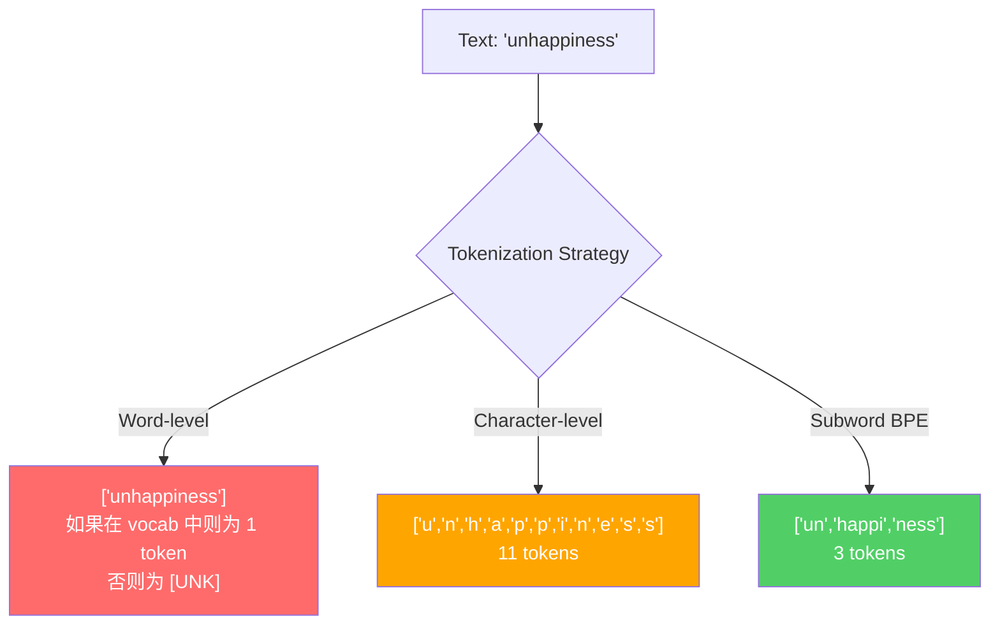
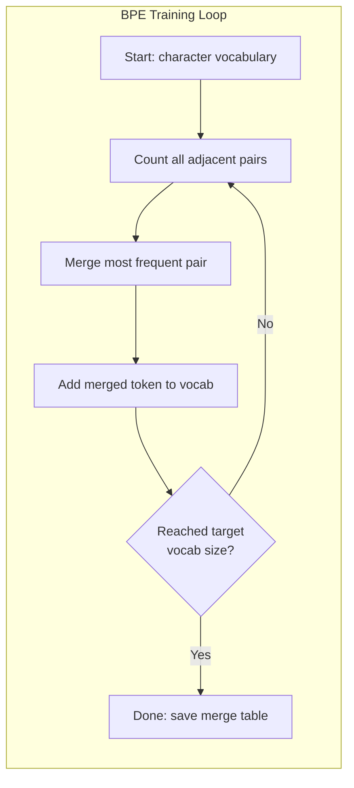
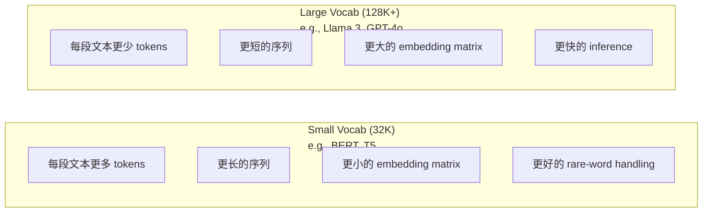

# الـ "BPE" و "WordPiece" و "SentencePiece"

> لا يزال هذا هو السبب في أن الـ "توكينيزر" يقرر أن هذه العدد الكاملة تحمل معنى أو ضائعة.

**Type:** Build
**Languages:** Python
**Prerequisites:** Phase 05 (NLP Foundations)
**Time:** ~90 minutes

## 學习目标
- من التنفيذ من صفر BPE、WordPiece و Unigram خوارزميات التكنولوجيا، ومقارنة استراتيجيات دمجها
-  شرح حجم المفردات  كيف يؤثر على كفاءة النموذج: 过小会产生长序列, 过大会浪费嵌入参数
- 分析不同语言和代码中的代码化文物,识别特定代码化者 在哪里失效
- استخدام تيكتونات و مكتبات جملة للنصوص لتكون رمزية ، ومراجعة IDs رمزية التي تم إنشاؤها

## 问题
بلغاتك لا تتلقى إنجليزية.

من "مرحباً، العالم!" إلى [15496, 11, 995, 0] ، الفرق بين هذا هو Tokenizer. كل كلمة، كل فجوة، كل رمز علامة، يجب أن يتم تحويلها إلى عدد كامل، يجب أن يتم تحويلها إلى نموذج للتعامل معها.

إذا كان هنا خطأ، فإن النموذج سوف يضيع القدرة، باستخدام العديد من الوهم لت编码常见词──"لسوء الحظ" سوف تتحول إلى أربعة الوهم، وليس واحد── بالنسبة إلى متن كثيف بكلمات متعددة الصوت، نافذة السياق الخاصة بك 128K  في الواقع刚刚缩رت 75%──

كل مكالمة API التي تقوم بها GPT-4 أو Claude ، هي حسب Token 定价── كل Token التي تم إنشاؤها نموذجها ستستهلك الحسابات── تعبر عن إصدار مطلوب من Tokens 越少,端到端 الاستنتاج 就越快── التوكينيزة ليست عملية التحضير المسبق── إنها معمارة──

## 概念
### ثلاث طرق للفشل و طريقة للنجاح)

تحويل النص إلى رقم، هناك ثلاثة طرق واضحة.

**Word-level tokenization**按空格和标点切分──"قطة جلست" 会变成 ["The", "cat", "sat"]──很简单──但"tokenization" 怎么办?"GPT-4o" 呢?或像"Geschwindigkeitsbegrenzung" 这样德语复合词呢?`[UNK]`رمز -- هذا هو النموذج في قول 我完全不知道这是什么── فقط الإنجليزية لديها أكثر من مليون نوع من شكل الكلمات── إضافة إلى كودات، URLs، علوم حسابات، و 100 لغة أخرى، تحتاج إلى مخزون كبير لا حدود لها──

**Character-level tokenization**走向另一个方向──"مرحباً" سوف تتحول إلى ["h", "e", "l", "l", "l", "o"]── المفردات 很小(几百个字符)──永远不会有未知的令牌──但序列会变得极长──一个本来是10个字面级令牌的句子,会变成50个字符级令牌──模型必须学会"t"、"h"、"e" 放在一起表示"the" -- 把注意力消耗在一个人类三岁就能学会的东西上──

**Subword tokenization**找到了平衡点──常见词保持完整:"the" 是一个代币──罕见词会分解成有意义的片段:"不快乐" 变成 ["un", "happy", "ness"]──词汇保持可控(30K到128K رموز)──序列保持较短──未知 رموز 基本消失,因为任何词都可以由子词的碎片构建出来──

كل ماجستير في مجال التعليمات العليا الحديثة يستخدمون رمزية الكلمات الفرعية.



### BPE: تشفير زوج البايت

BPE هو خوارزمية ضغط الجهاز، ثم تم إعادة استخدامها للتوكينات.

من مجرد حرف يبدأ. كل زوج مجاور في المواد. يُدمج الزوج الأكثر ترددًا في ظهوره إلى رمز جديد.

أسفل في مجموعة صغيرة جدا من BPE التي تعمل، منها "أدنى"

```
Corpus（带 word frequencies）:
  "lower"  x5
  "lowest" x2
  "newest" x6

Step 0 -- 从字符开始:
  l o w e r       (x5)
  l o w e s t     (x2)
  n e w e s t     (x6)

Step 1 -- 统计相邻 pairs:
  (e,s): 8    (s,t): 8    (l,o): 7    (o,w): 7
  (w,e): 13   (e,r): 5    (n,e): 6    ...

Step 2 -- Merge 最高频 pair (w,e) -> "we":
  l o we r        (x5)
  l o we s t      (x2)
  n e we s t      (x6)

Step 3 -- 重新统计并 merge (e,s) -> "es":
  l o we r        (x5)
  l o we s t      (x2)    <- 'es' 只由 'e'+'s' 形成，不是 'we'+'s'
  n e we s t      (x6)    <- 等等，'we' 前面有 'e'，'we' 后面有 's'

实际精确跟踪如下:
  在 "we" merge 之后，剩余 pairs:
  (l,o): 7   (o,we): 7   (we,r): 5   (we,s): 8
  (s,t): 8   (n,e): 6    (e,we): 6

Step 3 -- Merge (we,s) -> "wes" 或 (s,t) -> "st"（同为 8，选第一个）:
  Merge (we,s) -> "wes":
  l o we r        (x5)
  l o wes t       (x2)
  n e wes t       (x6)

Step 4 -- Merge (wes,t) -> "west":
  l o we r        (x5)
  l o west        (x2)
  n e west        (x6)

...继续，直到达到目标 vocab size。
```

جدول الاندماج هو Tokenizer. يجب أن ترمز النص الجديد، بناء على التدريب على التدريب على الاندماج.



### مستوى البايت BPE (GPT-2، GPT-3، GPT-4)

标准 BPE 在 یونیكود الأحرف 上运行──BPE على مستوى البايت في البايتات الأصلية(0-255) 上运行── هذا سيعطيك مفردة أساسية جيدة بنسبة 256، قادرة على معالجة أي لغة أو ترميز، ولن تنتج أبدا رمز مجهول──

أدى GPT-2 إلى إدخال هذه الطريقة. قاموس الأساسية تغطي كل نوع من البايتات المحتملة. دمج BPE على هذا النحو. تم بناء مكتبة التكوكين OpenAI لتحقيق BPE على مستوى البايتات، واستخدام هذه أحجام المفردات:

- GPT-2: 50257 رمزا
- GPT-3.5/GPT-4: ~100،256 رمز (تشفير cl100k_base)
- GPT-4o: 200،019 رمز (o200k_base encoding)

### ورودبيس (BERT)

يبدو WordPiece يشبه BPE ، ولكن طريقة اختيار الاندماج مختلفة.

```
BPE merge criterion:      count(A, B)
WordPiece merge criterion: count(AB) / (count(A) * count(B))
```

السؤال هو: أيه من الأزواج الأكثر تكرارًا؟ سؤال هو: أيه من الأزواج الأكثر تكرارًا؟ هذا التباين الصغير يخلق مفردات مختلفة.

WordPiece أيضا استخدام "##" المقبلات لإظهار المتابعة الكلمات الفرعية:

```
"unhappiness" -> ["un", "##happi", "##ness"]
"embedding"   -> ["em", "##bed", "##ding"]
```

المقبل "##"  أخبرك هذا القطعة 延续前一个 Token──BERT استخدام WordPiece، المفردات 为 30,522 رموز── كل متغير BERT -- DistilBERT، روبرتا من Tokenizer  في الواقع هو BPE، ولكن BERT هو WordPiece──

### جملة (لاما، T5)

جملةPiece ضع输入视为原始 یونیكود حروف 流، منها:空白符. لا يوجد خطوة من قبل التوكن. لا يوجد قواعد لغوية محددة للحدود. هذا يجعلها حقيقية.

جملة:
- **BPE mode**: منطقة الاندماج مماثلة مع المعيار BPE ، تُستخدم في سلسلة الخط الأصلي
- **Unigram mode**: من المفردات الكبيرة بدء، ثم 代移除 على احتمال الكامل أثر على أقل رموز .

Llama 2 استخدام SentencePiece BPE, المفردات 为 32,000 رموز──T5 استخدام SentencePiece Unigram, المفردات 为 32,000 رموز──لاحظة: Llama 3 切换到了基于TikToken بايت مستوى BPE Tokenizer,包含 128,256 رموز──

### حجم الكلمات التجارة

هذا قرار هندسي حقيقي، وله نتائج قابلة لقياسها.



具体数字── بالنسبة لمجموعة مفردة 128K 和 4,096 维嵌入, مجرد مدخلة ماتريكس هي 128,000 × 4,096 = 5.24 مليار ملامح── بالنسبة لمجموعة مفردة 32K,则是 1.31 مليار ملامح── فقط لأن Tokenizer 选择不同,就会产生 400M اختلافات في الملامح──

ولكن المفردات الأكبر سوف تكون أكثر تحفيزاً في المقالة المضغوطة. في نفس المقطع، مع مفردة 32K قد تحتاج إلى 100 رموز، مع مفردة 128K قد تحتاج إلى 70 رمزا فقط. وهذا يعني أن التجديدات في الفترة الزمنية قد تقلل بنسبة 30٪.

趋势很明确: حجم المفردات 正在增长──GPT-2 使用 50,257──GPT-4 使用 ~100K──Llama 3 使用 128K──GPT-4o 使用 200K──

| Model | Vocab Size | Tokenizer Type | Avg Tokens per English Word |
|-------|-----------|----------------|---------------------------|
| BERT | 30,522 | WordPiece | ~1.4 |
| GPT-2 | 50,257 | Byte-level BPE | ~1.3 |
| Llama 2 | 32,000 | SentencePiece BPE | ~1.4 |
| GPT-4 | ~100,256 | Byte-level BPE | ~1.2 |
| Llama 3 | 128,256 | Byte-level BPE (tiktoken) | ~1.1 |
| GPT-4o | 200,019 | Byte-level BPE | ~1.0 |

### الضريبة المتعددة اللغات

يتطلب كل كلمة في Tokenizer GPT-2 ما يقرب من 2-3 رموز. وهذا يعني نافذة السياق لمستخدمة لغة كوريا الجنوبية. في الواقع، نصف المستخدمين في لغة كوريا الجنوبية فقط يدفعون نفس السعر، ولكنهم يحصلون على كثافة معلومات أقل.

هذا هو سبب توسيع المفردات من 32K إلى 128K.


```figure
tokenizer-bpe
```

```figure
tokenizer-tradeoff
```

## بناءها
### الخطوة 1: Tokenizer على مستوى الشخصيات

من البداية إلى الأساس. Tokenizer على مستوى الشخصيات سوف تقوم بتسجيل كل حرف إلى نقطة رمز يونيكودها.

```python
class CharTokenizer:
    def encode(self, text):
        return [ord(c) for c in text]

    def decode(self, tokens):
        return "".join(chr(t) for t in tokens)
```

"مرحباً" سوف تصبح [104, 101, 108, 108, 111].

### 步骤 2: BPE Tokenizer من الصفر

حقيقة التنفيذ. نحن في البايتات الأصلية 上 тренинг(مثل GPT-2 一样) ، زوجات الإحصاء، دمج أحدث زوجات،并按顺序记录每一次 دمج.

```python
from collections import Counter

class BPETokenizer:
    def __init__(self):
        self.merges = {}
        self.vocab = {}

    def _get_pairs(self, tokens):
        pairs = Counter()
        for i in range(len(tokens) - 1):
            pairs[(tokens[i], tokens[i + 1])] += 1
        return pairs

    def _merge_pair(self, tokens, pair, new_token):
        merged = []
        i = 0
        while i < len(tokens):
            if i < len(tokens) - 1 and tokens[i] == pair[0] and tokens[i + 1] == pair[1]:
                merged.append(new_token)
                i += 2
            else:
                merged.append(tokens[i])
                i += 1
        return merged

    def train(self, text, num_merges):
        tokens = list(text.encode("utf-8"))
        self.vocab = {i: bytes([i]) for i in range(256)}

        for i in range(num_merges):
            pairs = self._get_pairs(tokens)
            if not pairs:
                break
            best_pair = max(pairs, key=pairs.get)
            new_token = 256 + i
            tokens = self._merge_pair(tokens, best_pair, new_token)
            self.merges[best_pair] = new_token
            self.vocab[new_token] = self.vocab[best_pair[0]] + self.vocab[best_pair[1]]

        return self

    def encode(self, text):
        tokens = list(text.encode("utf-8"))
        for pair, new_token in self.merges.items():
            tokens = self._merge_pair(tokens, pair, new_token)
        return tokens

    def decode(self, tokens):
        byte_sequence = b"".join(self.vocab[t] for t in tokens)
        return byte_sequence.decode("utf-8", errors="replace")
```

حلقة التدريب هي جوهر BPE: Statistical pairs,merge 胜出的 pair,重复──每次 merge 都会减少总代币计量──经过`num_merges`بعد ذلك، قاموس المفردات من 256 بايت قاعدة) ينمو إلى 256 + عدد_مدمجها

التشفير سوف يتفق مع تعلم إلى حد ما التطبيقات المدمجة. هذا أمر مهم. إذا تم إنشاء 1 ة، والانضمام 5 ة، والانضمام 5 ة، ثم التشفير يجب أولا تطبيق الاندماج 1، بحيث "ال" 才能在 merge 5 من خلال "ث" + "e" 形成──

التشفير هو عملية عكسية: في المفردات 中查找 كل رمز معرف، اتصال البايتز، ثم فك رمزة UTF-8。

### 步骤 3: إشعار و فك الرمز جولة

```python
corpus = (
    "The cat sat on the mat. The cat ate the rat. "
    "The dog sat on the log. The dog ate the frog. "
    "Natural language processing is the study of how computers "
    "understand and generate human language. "
    "Tokenization is the first step in any NLP pipeline."
)

tokenizer = BPETokenizer()
tokenizer.train(corpus, num_merges=40)

test_sentences = [
    "The cat sat on the mat.",
    "Natural language processing",
    "tokenization pipeline",
    "unhappiness",
]

for sentence in test_sentences:
    encoded = tokenizer.encode(sentence)
    decoded = tokenizer.decode(encoded)
    raw_bytes = len(sentence.encode("utf-8"))
    ratio = len(encoded) / raw_bytes
    print(f"'{sentence}'")
    print(f"  Tokens: {len(encoded)} (from {raw_bytes} bytes) -- ratio: {ratio:.2f}")
    print(f"  Roundtrip: {'PASS' if decoded == sentence else 'FAIL'}")
```

نسبة الضغط  أخبرك Tokenizer لديه الكثير فعالا ً. نسبة 为 0.50 表示 Tokenizer 将文本压缩到原始字节 一半量的 Tokens──越低越好── 在训练 corpus 上, نسبة 会很好── 在"不快乐" 这种不分布式文本上, 没有出现在 corpus 中), نسبة 会更差 -- Tokenizer 会对未见的模式 回归字符级编码──

### 步骤 4: مقارنة مع تيكتون

```python
import tiktoken

enc = tiktoken.get_encoding("cl100k_base")

texts = [
    "The cat sat on the mat.",
    "unhappiness",
    "Hello, world!",
    "def fibonacci(n): return n if n < 2 else fibonacci(n-1) + fibonacci(n-2)",
    "Geschwindigkeitsbegrenzung",
]

for text in texts:
    our_tokens = tokenizer.encode(text)
    tiktoken_tokens = enc.encode(text)
    tiktoken_pieces = [enc.decode([t]) for t in tiktoken_tokens]
    print(f"'{text}'")
    print(f"  Our BPE:   {len(our_tokens)} tokens")
    print(f"  tiktoken:  {len(tiktoken_tokens)} tokens -> {tiktoken_pieces}")
```

تيكتون يستخدم خوارزمية متشابهة تماما، ولكن هو مدرب على مئات جيجا غابايت 文本,并包含 100,000 合并. ال خوارزمية هي نفسها. الاختلاف في تدريب البيانات والدمج.

### الخطوة 5: تحليل الكلمات

```python
def analyze_vocabulary(tokenizer, test_texts):
    total_tokens = 0
    total_chars = 0
    token_usage = Counter()

    for text in test_texts:
        encoded = tokenizer.encode(text)
        total_tokens += len(encoded)
        total_chars += len(text)
        for t in encoded:
            token_usage[t] += 1

    print(f"Vocabulary size: {len(tokenizer.vocab)}")
    print(f"Total tokens across all texts: {total_tokens}")
    print(f"Total characters: {total_chars}")
    print(f"Avg tokens per character: {total_tokens / total_chars:.2f}")

    print(f"\nMost used tokens:")
    for token_id, count in token_usage.most_common(10):
        token_bytes = tokenizer.vocab[token_id]
        display = token_bytes.decode("utf-8", errors="replace")
        print(f"  Token {token_id:4d}: '{display}' (used {count} times)")

    unused = [t for t in tokenizer.vocab if t not in token_usage]
    print(f"\nUnused tokens: {len(unused)} out of {len(tokenizer.vocab)}")
```

هذا سيظهر توزيع زيف في المفردات الخاصة بك. عدد قليل من الرموز.

## استخدمها
إنّكِ تُحاولين إصلاحها الآن، انظروا كيف تبدو أدوات الإنتاج

### تيكتون (OpenAI)

```python
import tiktoken

enc = tiktoken.get_encoding("cl100k_base")

text = "Tokenizers convert text to integers"
tokens = enc.encode(text)
print(f"Tokens: {tokens}")
print(f"Pieces: {[enc.decode([t]) for t in tokens]}")
print(f"Roundtrip: {enc.decode(tokens)}")
```

تيكتون باستخدام Rust 编写,并提供 Python bindings──它每秒可以编码数百万代币──同样 BPE算法,工业级实现──

### أجهزة إشارة للوجه

```python
from tokenizers import Tokenizer
from tokenizers.models import BPE
from tokenizers.trainers import BpeTrainer
from tokenizers.pre_tokenizers import ByteLevel

tokenizer = Tokenizer(BPE())
tokenizer.pre_tokenizer = ByteLevel()

trainer = BpeTrainer(vocab_size=1000, special_tokens=["<pad>", "<eos>", "<unk>"])
tokenizer.train(["corpus.txt"], trainer)

output = tokenizer.encode("The cat sat on the mat.")
print(f"Tokens: {output.tokens}")
print(f"IDs: {output.ids}")
```

تعاطف الملفات المتحركة المكتبة الدرجة السفلية هي نفسها Rust. يمكن أن تستخدم في ثوانٍ قليلة على أساس GB  درجة corpora  تدريب BPE.

### تحميل Tokenizer للاما

```python
from transformers import AutoTokenizer

tokenizer = AutoTokenizer.from_pretrained("meta-llama/Llama-3.1-8B")

text = "Tokenizers are the unsung heroes of LLMs"
tokens = tokenizer.encode(text)
print(f"Token IDs: {tokens}")
print(f"Tokens: {tokenizer.convert_ids_to_tokens(tokens)}")
print(f"Vocab size: {tokenizer.vocab_size}")

multilingual = ["Hello world", "Hola mundo", "Bonjour le monde"]
for text in multilingual:
    ids = tokenizer.encode(text)
    print(f"'{text}' -> {len(ids)} tokens")
```

المفردات 128K للاما 3 على ضغط المستندات غير الإنجليزية أفضل بشكل واضح من المفردات 50K ل GPT-2. يمكنك التحقق من هذا بنفسك - باستخدام العديد من اللغات ترميز مع جملة واحدة، ثم统计 Tokens。

## 交付 it
本课会产出 `outputs/prompt-tokenizer-analyzer.md`-- عرض قابل للنقل، لتحليل كفاءة التكنولوجيا من أي نص ومجموعة من النماذج.

## التدريب
1. 修改 BPE Tokenizer,让它在每个 merge step 打印词汇──观察 "t" + "h" 如何变成 "th",然后 "th" + "e" 如何变成 "the"──跟踪常见英文词如何一步组装出来──

2. 向 BPE Tokenizer 添加 رموز خاصة(`<pad>`.`<eos>`.`<unk>`)── أعطهم تعريفات تعريف 0、1、2،并相应地移动所有其他 Tokens── تحقق خطوة ما قبل التوكن، قبل أن يتم تشغيل BPE ‬ 切分‬

3. 实现 WordPiece merge criterion ((استخدام نسبة الاحتمال وليس التردد)  في نفس الجسم، باستخدام نفس التجمع عدد تدريب BPE و WordPiece‬‬ تقارن المفردات التي تولد -- ‬‬‬‬‬‬‬‬‬‬‬‬‬‬‬‬‬‬‬‬‬‬‬‬‬‬‬‬‬‬‬‬‬‬‬‬‬‬‬‬‬‬‬‬‬‬‬‬‬‬‬‬‬‬‬‬‬‬‬‬‬‬‬‬‬‬‬‬‬‬‬‬‬‬‬‬‬‬‬‬‬‬‬‬‬‬‬‬‬‬‬‬‬‬‬‬‬‬‬‬‬‬‬‬‬‬‬‬‬‬‬‬‬‬‬‬‬‬‬‬‬‬‬‬‬‬‬‬‬‬‬‬‬‬‬‬‬‬‬‬‬‬‬‬‬‬‬‬‬‬‬‬‬‬‬‬‬‬‬‬‬‬‬‬‬‬‬‬‬‬‬‬‬‬‬‬‬‬‬‬‬‬‬‬‬‬‬‬‬‬‬‬‬‬‬‬‬‬‬‬‬‬‬‬‬‬‬‬‬‬‬‬‬‬‬‬‬‬‬‬‬‬‬‬‬‬‬‬‬‬‬‬‬‬‬‬‬‬‬‬‬‬‬‬‬‬‬‬‬‬‬‬‬‬‬‬‬‬‬‬‬‬‬‬‬‬‬‬‬‬‬‬‬‬‬‬‬‬‬‬‬‬‬‬‬‬‬‬‬‬‬‬‬‬‬‬‬‬‬‬‬‬‬‬‬‬‬‬‬‬‬‬‬‬‬‬‬‬‬‬‬‬‬‬‬‬‬‬‬‬‬‬‬‬‬‬‬‬‬‬‬‬‬‬‬‬‬‬‬‬‬‬‬‬‬‬‬‬‬‬‬‬‬‬‬‬‬‬‬‬‬‬‬‬‬‬‬‬‬‬‬‬‬‬‬‬‬‬‬‬‬‬‬‬‬‬‬‬‬‬‬‬‬‬‬‬‬‬‬‬‬‬‬‬‬‬‬‬‬‬‬‬‬‬‬‬‬‬‬‬‬‬‬‬‬‬‬‬‬‬‬‬‬‬‬‬‬‬‬‬‬‬‬

4. 构建一个多语言 Tokenizer效率基准──选取英语、西班牙语、中文、韩语和阿拉伯语各 10 个句子──使用tiktoken(cl100k_base) 对每个句子进行代币,并测量平均每字符 Tokens──量化每种语言的"多语言税"──

5. في أكبر جسم 上訓練你的 BPE Tokenizer(下载一篇 文章) ――调整 merge 数量,使其在同一文本上的压缩比 达到 tiktoken 的 10% 以内──这会迫使你理解关系之间的体积、结合数和压缩质量──

## 关键术语
| Term | What people say | What it actually means |
|------|----------------|----------------------|
| Token | “一个词” | 模型 vocabulary 中的一个单元 -- 可以是字符、subword、word，或 multi-word chunk |
| BPE | “某种压缩东西” | Byte Pair Encoding -- 迭代 merge 出现最频繁的相邻 token pair，直到达到目标 vocabulary size |
| WordPiece | “BERT 的 Tokenizer” | 类似 BPE，但 merges 最大化 likelihood ratio count(AB)/(count(A)*count(B))，而不是原始 frequency |
| SentencePiece | “一个 Tokenizer library” | 一种 language-agnostic Tokenizer，在没有 pre-tokenization 的情况下直接处理原始 Unicode，并支持 BPE 和 Unigram algorithms |
| Vocabulary size | “它知道多少词” | 唯一 Tokens 的总数：GPT-2 有 50,257，BERT 有 30,522，Llama 3 有 128,256 |
| Fertility | “不是 Tokenizer 术语” | 每个词的平均 Tokens 数 -- 衡量 Tokenizer 在不同语言上的效率（1.0 是理想值，3.0 表示模型要多工作三倍） |
| Byte-level BPE | “GPT 的 Tokenizer” | 在原始 bytes（0-255）而不是 Unicode characters 上运行的 BPE，保证任何输入都不会产生 unknown tokens |
| Merge table | “Tokenizer 文件” | 训练期间学习到的有序 pair merges 列表 -- 这就是 Tokenizer 本身，而且顺序很重要 |
| Pre-tokenization | “按空格切分” | 在 subword tokenization 之前应用的规则：whitespace splitting、digit separation、punctuation handling |
| Compression ratio | “Tokenizer 有多高效” | 生成的 Tokens 数除以输入 bytes 数 -- 越低表示压缩越好，inference 越快 |

## 延伸阅读
- [Sennrich et al., 2016 -- "Neural Machine Translation of Rare Words with Subword Units"](https://arxiv.org/abs/1508.07909)-- هذه الورقة ستدخل BPE إلى NLP ، وتحول خوارزمية الضغط من عام 1994 إلى أساس التكنولوجيا الحديثة
- [Kudo & Richardson, 2018 -- "SentencePiece: A simple and language independent subword tokenizer"](https://arxiv.org/abs/1808.06226)-- التكنولوجيا اللغوية-المتخلفة، جعل النماذج متعددة اللغات  أصبح عملي
- [OpenAI tiktoken repository](https://github.com/openai/tiktoken)-- 用 Rust 编写并带有Python 绑定的生产级 BPE 实现, بواسطة GPT-3.5/4/4o استخدام
- [Hugging Face Tokenizers documentation](https://huggingface.co/docs/tokenizers)-- 具備ة لتدريبات التوكينيزر في درجة الإنتاج
