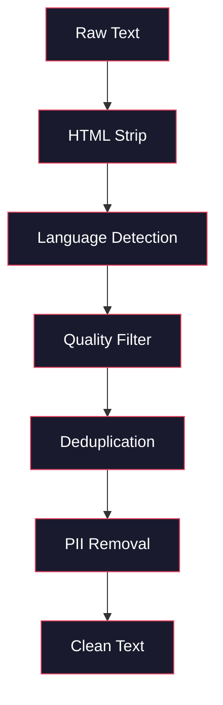
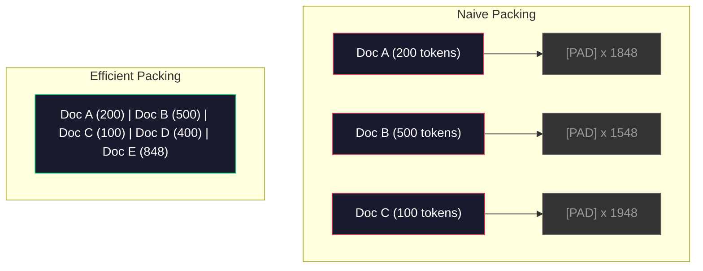

# خطوط البيانات التي تمتد قبل التدريب

> النموذج هو مرآة، فإنه يعكس أي بيانات تعطيه، وإعطائه القمامة، فإنه يعكس القمامة بشكل كامل.

**Type:** Build
**Languages:** Python
**Prerequisites:** Phase 10, Lessons 01-02 (Tokenizers, Building a Tokenizer)
**Time:** ~90 minutes

## 學习目标

- بناء خط أنابيب البيانات المتدفقة، في حالة عدم تحميل كل البيانات إلى الاحتفاظ بها، إجراء توكيينات، قطع، تشغيل، وبطاقة
- 实现真实预训管道 中使用的数据质量过器(تخصيص اللغة
- 创建固定长度训练序列,并正确处理注意力面具 和文档边界
- إنتاج خط الأنابيب الموضعي، تأكد من أن محمول البيانات 能跟上 GPU 训练速度

## 问题

لديك بالفعل Tokenizer. الآن تحتاج إلى بيانات.

ليس مجموعة بيانات، وليس ملف CSV، ولكن: TB 级文本:经过清洗,脱复,质量过,Tokenization 成固定长度序列,并以足够快的速度作为随机批量提供,确保你的8GPU 集群永远不会等待下一批量.

اعتقد معظم الناس أن محور تدريب ماجستير في التكنولوجيا العلمية هو بنية النموذج. لم يكن. استخدم لاما 3 15.6 تريليون توكن. استخدم GPT-3 300 مليار. استخدم DeepSeek-V2 8.1 تريليون.

ورقة Chinchilla من DeepMind  وضحت هذا الأمر بوضوح. بالنسبة لحدد الميزانية الحسابية، هناك نسبة ممتازة بين عدد المعايير والمعايير التدريبية. تشينشيلا تشير إلى أن معظم النماذج في عام 2022 كانت ناقصة بشكل كبير: مقارنة مع حجم البيانات التي ترىها، فإن معاييرها كبيرة جدا.

أنبوب بياناتك يقرر ما يتعلم نموذجك هو اللغة أم الضوضاء

## مفهوم الأساسي

### من أين تأتي البيانات

كل نموذج لغوي كبير يتدرب على بيانات مختلطة من مصادر متعددة. بالنسبة لمعظم المختبرات، فإن تركيبات البيانات المحددة هي سرية للغاية، ولكننا نعرف ما يكفي من ذلك، يمكننا فهم هذه الفئات.

| Source | Size | Quality | Used By |
|--------|------|---------|---------|
| Common Crawl | ~250 TB raw | 低（需要大量过滤） | GPT-3, Llama, most open models |
| Wikipedia | ~20 GB | 高 | Every major LLM |
| GitHub code | ~1 TB+ | 中等（大量重复、废弃代码） | StarCoder, CodeLlama, DeepSeek-Coder |
| Books (BookCorpus, Pile) | ~100 GB | 高 | GPT-2, GPT-3, early models |
| Academic papers (arXiv, S2ORC) | ~100 GB | STEM 领域质量高 | Llama, Galactica |
| StackOverflow, Reddit | ~100 GB | 中等 | Llama, Falcon |
| Curated web (C4, RefinedWeb) | ~5 TB | 中高（已预过滤） | T5, Falcon |

أعلنت لامة 3 عن نسبة مختلطة من البيانات: حوالي 50% من بيانات الويب ∙ 25% من الشفرة ∙ 13% من الكتب والمقالات الأكاديمية ∙ 8% من بيانات الرياضيات ، فضلا عن 4% من بيانات الويب متعددة اللغات ∙ مجموع الكمية هو 15.6 تريليون توكن ، من أكثر من 5 طبيليات من المصادر الأصلية الأصلية ∙

مثال ومجموعة مهمة أيضا. البيانات على شبكة الإنترنت 太多, النموذج سوف تصبح Reddit 复读机机. 代码 太少, انها لا تستطيع البرمجة 數學 太少, انها سوف تفشل في التفكير.

### رقم التنظيف

البيانات الالكترونية الأصلية 很脏── 典型 Common Crawl dump 包含:

- علامات HTML و JavaScript
- 模板化 عناوين  أقدام  قائمة التنقل
- 重复页面(完全重复和近似重复)
- 机器生成的垃圾邮件
- معلومات شخصية (PII)
- 低质量文本(关键词列表、SEO spam)
- إصدارات المعلومات

طهير ليس خيارا ً. إنه يحدد ما إذا كان النموذج هو إنتاج المقطع المتسلسل أو إصدار علامات HTML مختلطة في قائمة المنتجات.



كل خطوة ستزيل نوع من الضوضاء

**HTML stripping:**移除所有标记──只保留可见文本内容──像 `trafilatura`أو`readability`هذا النوع من المكتبات سوف تستخرج محتوى المقال، في حين تترك الإرشاد والإعلانات والملفات المحتوى.

**Language detection:**استخدام fastText 语言识别模型 (lid.176.bin) لتنظيم كل مستند إلى لغتك المستهدفة.

**Quality filtering:**هنا بدأ يصبح مشغولا. ((WEB)) يستخدم المصفحات القائمة على الارتباك: أولاً على ويكيبيديا تعليم نموذج لغة صغيرة ، ثم إعطاء كل وثيقة ضربات.

**Deduplication:**单个最有影响力的清洗步骤――Common Crawl 包含海量重复页面:法律免责声明、cookie notifications、服务条款──在重复数据上训练会浪费计算,并可能导致模型记忆并逐字吐出特定段落──

**PII removal:**姓名、电子邮件地址、电话号码、社会安全号码── على PII المكوّن استخدام الاختبار القائم على regex، على الأسماء المذكورة في الصفحة التالية استخدام نماذج NER──

### استخدام MinHash القيام بتخفيض النسخة

精确排版 很容易: لجميع المستندات القيام بالهاشة، إزالة المواد الثلاثة. ولكن المشكلة الحقيقية هي تقارب المواد الثلاثة.

يمكن أن يصلح هذا المشكلة بشكل فعال.


فكرت:

1. **Shingling:**سوف تحويل كل وثائق إلى n-gram 集合(مثلاً كلمة أو字符的 5gram)。"الرأس البني السريع"

2. **MinHash:**لكل مجموعة من المستندات، قم بحساب قيمة الهاش. كل قيمة الهاش هي وظيفة الهاش مختلفة.

3. **LSH:**根据 MinHash's signature band,把文档分组到桶中──同一个桶中文档就是候选近似重复项──这样可以避免对对对文档的比较:你只需要比较候选项──

4. **Verify:**لكل زوج من المرشحين، قم بحساب تشابه جاكارد المحدد. إذا تجاوزت الشبيهة قيمة 0.8 عادة، فيمكن إزالة واحد من النسخة.

وبحسب تقرير لاما، قاموا بتحويل حوالي 38٪ من بيانات الويب من خلال التخفيضات. هذا ليس رقم صغير.

### إعداد التسلسل

تمتلك نموذجًا متوقعًا لتحديد طول تسلسل الإدخال. طول الملفات الخاص بك يمكن تغييرها.

简单做法:把每个文档pad到最大序列长度──这将在学习无贡献的填充标记上浪费大量计算──

أفضل ممارسة: ضع مجموعة من الملفات إلى صف واحد، لا تستخدم رمز نهاية السلسلة منفصلة.



قناع الاهتمام 必须正确设置──同一个包装序列 中,Document A 的标志 不应关注 Document B 的标志──这需要一个区块斜角的注意口罩──

长文档会在序列边界处被切断或拆分成碎片──分分点很重要:在句子中分会迫使模型看到不完整的思路──有些管道会尽可能把分分分对齐到段落或句子边界──

### قانون تشينشيلا في الحجم

 بالنسبة لـ (C                                                                                                                                                                                                                                                                                                                                                                                                                                                                                                                        

```
N_opt ~ C^0.5
D_opt ~ C^0.5
```

في الممارسة العملية، هذا يعني أنه يجب أن تكون تقريباً على نسبة كبيرة من نموذج التوسع والكثير من المجموعة البيانية.

| Model | Parameters | Training Tokens | Chinchilla-Optimal? |
|-------|-----------|----------------|-------------------|
| GPT-3 | 175B | 300B | 否（undertrained 3-4x） |
| Chinchilla | 70B | 1.4T | 是（按设计） |
| Llama 2 | 70B | 2T | Overtrained（有意为之） |
| Llama 3 | 70B | 15T | 严重 overtrained |

إلاما 3 عمداً خرق قانون تشينشيلا. وجدت الميثا أن التدريب الزائد على المزيد من البيانات ، والنسبة المثلى من الحساب ، سوف تولد نموذج أكثر ملاءمة للإستنتاجات. تكلفة التدريب الإضافي يتم دفعها مرة واحدة فقط ، ولكن تكلفة النموذج الأصغر في الخدمة طويلة الأجل أقل.


```figure
l5-data-pipeline
```

## بناءها

### الخطوة 1: تنظيف النص

剥离 HTML、规范化 white space、移除文本内容──我们将使用公共领域文本(项目古登堡) كمجموعة صغيرة──

```python
import re

def clean_text(text):
    text = re.sub(r"<[^>]+>", "", text)
    text = re.sub(r"http\S+", "", text)
    text = re.sub(r"[^\x20-\x7E\n]", "", text)
    text = re.sub(r"\n{3,}", "\n\n", text)
    text = re.sub(r" {2,}", " ", text)
    return text.strip()

def quality_filter(text, min_words=50, max_ratio_caps=0.3, max_ratio_special=0.1):
    words = text.split()
    if len(words) < min_words:
        return False
    caps_ratio = sum(1 for w in words if w.isupper()) / len(words)
    if caps_ratio > max_ratio_caps:
        return False
    special_chars = sum(1 for c in text if not c.isalnum() and not c.isspace())
    if special_chars / max(len(text), 1) > max_ratio_special:
        return False
    return True
```

هذا المرشح الجودي سوف يلتقط الرسائل غير المرغوب فيها في الويب (كافة الكابس) ✓ الآلات التي تولد الضجيج (ارتفاع نسبة الكتب الخاصة) ✓ الصفحات المقطوعة (قليل) ✓ فقط هذه الاختبارات الثلاثة، سوف يتمكن من نقل كمية كبيرة من القمامة من خلال التصفحات على شبكة الإنترنت ✓

### 步骤 2: من هاش تخفيض

من التنفيذ من الهاش.`hashlib`.

```python
import hashlib
from collections import defaultdict

def get_shingles(text, k=5):
    words = text.lower().split()
    if len(words) < k:
        return set()
    return {" ".join(words[i:i+k]) for i in range(len(words) - k + 1)}

def minhash_signature(shingles, num_hashes=128):
    signature = []
    for i in range(num_hashes):
        min_hash = float("inf")
        for shingle in shingles:
            h = int(hashlib.sha256(f"{i}:{shingle}".encode()).hexdigest(), 16)
            min_hash = min(min_hash, h)
        signature.append(min_hash)
    return signature

def lsh_buckets(signature, bands=16):
    rows_per_band = len(signature) // bands
    buckets = []
    for b in range(bands):
        start = b * rows_per_band
        band_data = tuple(signature[start:start + rows_per_band])
        bucket_hash = hashlib.md5(str(band_data).encode()).hexdigest()
        buckets.append((b, bucket_hash))
    return buckets

def deduplicate(documents, threshold=0.8, num_hashes=128, bands=16):
    signatures = []
    shingle_sets = []
    for doc in documents:
        shingles = get_shingles(doc)
        shingle_sets.append(shingles)
        signatures.append(minhash_signature(shingles, num_hashes))

    bucket_map = defaultdict(list)
    for doc_idx, sig in enumerate(signatures):
        for band_id, bucket_hash in lsh_buckets(sig, bands):
            bucket_map[(band_id, bucket_hash)].append(doc_idx)

    duplicate_pairs = set()
    for bucket_docs in bucket_map.values():
        if len(bucket_docs) < 2:
            continue
        for i in range(len(bucket_docs)):
            for j in range(i + 1, len(bucket_docs)):
                duplicate_pairs.add((bucket_docs[i], bucket_docs[j]))

    removed = set()
    for i, j in duplicate_pairs:
        if i in removed or j in removed:
            continue
        s1, s2 = shingle_sets[i], shingle_sets[j]
        if not s1 or not s2:
            continue
        jaccard = len(s1 & s2) / len(s1 | s2)
        if jaccard >= threshold:
            removed.add(j)

    return [doc for idx, doc in enumerate(documents) if idx not in removed], len(removed)
```

`num_hashes=128`和 `bands=16`参数控制精度回忆交易――更多哈希会给出更准确的相似性 估计――更多频段会提高回忆(捕捉更多重复项),代价是更多虚假积极――这些值对典型的网页文本 效果很好――

### الخطوة 3: إضفاء الرمز على صفوف المجموعة

الحصول على مقال واضح ومتكرر ، والقيام بتكنولوجيا له ، ووضع في حزمة لتدريب سلسلة طول ثابتة.

```python
def tokenize_corpus(documents, tokenizer):
    all_tokens = []
    for doc in documents:
        tokens = tokenizer.encode(doc)
        all_tokens.extend(tokens)
        all_tokens.append(tokenizer.eos_id)
    return all_tokens

def pack_sequences(token_ids, seq_length, pad_id=0):
    sequences = []
    attention_masks = []
    for i in range(0, len(token_ids), seq_length):
        seq = token_ids[i:i + seq_length]
        mask = [1] * len(seq)
        if len(seq) < seq_length:
            pad_count = seq_length - len(seq)
            seq = seq + [pad_id] * pad_count
            mask = mask + [0] * pad_count
        sequences.append(seq)
        attention_masks.append(mask)
    return sequences, attention_masks
```

### الخطوة 4: استخدم DataLoader للتدريب

產出包裝序列的随机批量──这就是训练循环 消费的内容──

```python
import random

class PreTrainingDataLoader:
    def __init__(self, sequences, attention_masks, batch_size, shuffle=True):
        self.sequences = sequences
        self.attention_masks = attention_masks
        self.batch_size = batch_size
        self.shuffle = shuffle

    def __len__(self):
        return (len(self.sequences) + self.batch_size - 1) // self.batch_size

    def __iter__(self):
        indices = list(range(len(self.sequences)))
        if self.shuffle:
            random.shuffle(indices)
        for start in range(0, len(indices), self.batch_size):
            batch_idx = indices[start:start + self.batch_size]
            batch_seqs = [self.sequences[i] for i in batch_idx]
            batch_masks = [self.attention_masks[i] for i in batch_idx]
            yield batch_seqs, batch_masks
```

### الخطوة 5: إحصاءات مجموعة البيانات

计算重要数字:总 Token 数、唯一 Token 数、压缩比、文档长度分布──

```python
from collections import Counter

def compute_statistics(documents, token_ids, sequences, tokenizer_vocab_size):
    total_chars = sum(len(d) for d in documents)
    total_tokens = len(token_ids)
    unique_tokens = len(set(token_ids))
    compression_ratio = total_chars / total_tokens

    doc_lengths = [len(d.split()) for d in documents]
    avg_doc_length = sum(doc_lengths) / max(len(doc_lengths), 1)
    max_doc_length = max(doc_lengths) if doc_lengths else 0
    min_doc_length = min(doc_lengths) if doc_lengths else 0

    token_counts = Counter(token_ids)
    top_tokens = token_counts.most_common(10)

    non_pad_tokens = sum(sum(1 for t in seq if t != 0) for seq in sequences)
    total_positions = sum(len(seq) for seq in sequences)
    utilization = non_pad_tokens / max(total_positions, 1)

    stats = {
        "total_documents": len(documents),
        "total_characters": total_chars,
        "total_tokens": total_tokens,
        "unique_tokens": unique_tokens,
        "vocab_utilization": unique_tokens / tokenizer_vocab_size,
        "compression_ratio": compression_ratio,
        "avg_doc_length_words": avg_doc_length,
        "max_doc_length_words": max_doc_length,
        "min_doc_length_words": min_doc_length,
        "num_sequences": len(sequences),
        "sequence_utilization": utilization,
        "top_10_tokens": top_tokens,
    }
    return stats
```

نسبة الضغط  أخبرك Tokenizer في هذا الجسم على عدة عالية الفعالية‬‬‬‬‬‬‬‬‬‬‬‬‬‬‬‬‬‬‬‬‬‬‬‬‬‬‬‬‬‬‬‬‬‬‬‬‬‬‬‬‬‬‬‬‬‬‬‬‬‬‬‬‬‬‬‬‬‬‬‬‬‬‬‬‬‬‬‬‬‬‬‬‬‬‬‬‬‬‬‬‬‬‬‬‬‬‬‬‬‬‬‬‬‬‬‬‬‬‬‬‬‬‬‬‬‬‬‬‬‬‬‬‬‬‬‬‬‬‬‬‬‬‬‬‬‬‬‬‬‬‬‬‬‬‬‬‬‬‬‬‬‬‬‬‬‬‬‬‬‬‬‬‬‬‬‬‬‬‬‬‬‬‬‬‬‬‬‬‬‬‬‬‬‬‬‬‬‬‬‬‬‬‬‬‬‬‬‬‬‬‬‬‬‬‬‬‬‬‬‬‬‬‬‬‬‬‬‬‬‬‬‬‬‬‬‬‬‬‬‬‬‬‬‬‬‬‬‬‬‬‬‬‬‬‬‬‬‬‬‬‬‬‬‬‬‬‬‬‬‬‬‬‬‬‬‬‬‬‬‬‬‬‬‬‬‬‬‬‬‬‬‬‬‬‬‬‬‬‬‬‬‬‬‬‬‬‬‬‬‬‬‬‬‬‬‬‬‬‬‬‬‬‬‬‬‬‬‬‬‬‬‬‬‬‬‬‬‬‬‬‬‬‬‬‬‬‬‬‬‬‬‬‬‬‬‬‬‬‬‬‬‬‬‬‬‬‬‬‬‬‬‬‬‬‬‬‬‬‬‬‬‬‬‬‬‬‬‬‬‬‬‬‬‬‬‬‬‬‬‬‬‬‬‬‬‬‬‬‬‬‬‬‬‬‬‬‬‬‬‬‬‬‬‬‬‬‬‬‬‬‬‬‬‬‬‬‬‬‬‬‬‬‬‬‬‬‬‬‬‬‬‬‬‬‬‬‬‬‬‬‬‬‬‬‬‬‬‬‬‬‬‬‬‬‬‬‬‬‬‬‬‬‬‬‬‬‬‬‬‬‬‬‬‬‬‬‬‬‬‬‬‬‬‬‬‬‬‬

استخدام التسلسل  أخبرك أن هناك الكثير من التسلسلات المعبأة هو بيانات حقيقية، وليس التعبئة.  أقل من 90٪ يعني التعبئة الخاصة بك   كفاءة منخفضة: أنت تتلقى حسابات ضائع في التعبئة.

## استخدمها

### مقارنة مع مجموعة بيانات HuggingFace

通過 HuggingFace المجموعات البيانية مكتبة 加载同一个 corpus,并比较管道 速度──

```python
from datasets import load_dataset
from transformers import AutoTokenizer

ds = load_dataset("wikitext", "wikitext-2-raw-v1", split="train")
tokenizer = AutoTokenizer.from_pretrained("meta-llama/Meta-Llama-3-8B")

import time

start = time.time()
tokenized = ds.map(
    lambda x: tokenizer(x["text"], truncation=True, max_length=2048),
    batched=True,
    num_proc=4,
)
hf_time = time.time() - start
total_tokens = sum(len(t) for t in tokenized["input_ids"])
print(f"HuggingFace: {total_tokens:,} tokens in {hf_time:.2f}s ({total_tokens/hf_time:,.0f} tokens/sec)")
```

تحضير وجه أنابيب في الطابق السفلي باستخدام الرست توكيينرز، و تقوم على 4 أساسات على إنجازات التشغيل.

## 交付 it

هذا المقال يُنتج عن محاولة سريعة، لتحقيق وتحقيق أنبوب تدريب الـ LLM `outputs/prompt-data-quality-checker.md`.

## التدريب

1. **Easy:**استخدام طريقة بسيطة للانطلاق ({{sfn:{{sfn:{{sfn:{{sfn:{{sfn:{{sfn:{{sfn:{{sfn:{{sfn:{{sfn:{{sfn:{{sfn:{{sfn:{{sfn:{{sfn:{{sfn:{{sfn:{{sfn:{{sfn:{{sfn:{{sfn:{{sfn:{{sfn:{{sfn:{{sfn:{{sfn:{{sfn:{{sfn:{{sfn:{{sfn:{{sfn:{{sfn:{{sfn:{{sfn:{{sfn:{{sfn:{{sfn:{{sfn:{{sfn:{{sfn:{{sfn:{{sfn:{{sfn:{{sfn:{{sfn:{{sfn:}}}}}}}}) }}) }}) }} إلى خط الأنابيب التنظيف ‬ ‬إضافة كشف اللغة‬‬‬‬‬‬‬‬‬‬‬‬‬‬‬‬‬‬‬‬‬‬‬‬‬‬‬‬‬‬‬‬‬‬‬‬‬‬‬‬‬‬‬‬‬‬‬‬‬‬‬‬‬‬‬‬‬‬‬‬‬‬‬‬‬‬‬‬‬‬‬‬‬‬‬‬‬‬‬‬‬‬‬‬‬‬‬‬‬‬‬‬‬‬‬‬‬‬‬‬‬‬‬‬‬‬‬‬‬‬‬‬‬‬‬‬‬‬‬‬‬‬‬‬‬‬‬‬‬‬‬‬‬‬‬‬‬‬‬‬‬‬‬‬‬‬‬‬‬‬‬‬‬‬‬‬‬‬‬‬‬‬‬‬‬‬‬‬‬‬‬‬‬‬‬‬‬‬‬‬‬‬‬‬‬‬‬‬‬‬‬‬‬‬‬‬‬‬‬‬‬‬‬‬‬‬‬‬‬‬‬‬‬‬‬‬‬‬‬‬‬‬‬‬‬‬‬‬‬‬‬‬‬‬‬‬‬‬‬‬‬‬‬‬‬‬‬‬‬‬‬‬‬‬‬‬‬‬‬‬‬‬‬‬‬‬‬‬‬‬‬‬‬‬‬‬‬‬‬‬‬‬‬‬‬‬
2. **Medium:**في مائن هاش القريب من التخفيض ، باستخدام SHA-256 hashs  تحقيق التخفيض الدقيق ‬‬‬‬‬‬‬‬‬‬‬‬‬‬‬‬‬‬‬‬‬‬‬‬‬‬‬‬‬‬‬‬‬‬‬‬‬‬‬‬‬‬‬‬‬‬‬‬‬‬‬‬‬‬‬‬‬‬‬‬‬‬‬‬‬‬‬‬‬‬‬‬‬‬‬‬‬‬‬‬‬‬‬‬‬‬‬‬‬‬‬‬‬‬‬‬‬‬‬‬‬‬‬‬‬‬‬‬‬‬‬‬‬‬‬‬‬‬‬‬‬‬‬‬‬‬‬‬‬‬‬‬‬‬‬‬‬‬‬‬‬‬‬‬‬‬‬‬‬‬‬‬‬‬‬‬‬‬‬‬‬‬‬‬‬‬‬‬‬‬‬‬‬‬‬‬‬‬‬‬‬‬‬‬‬‬‬‬‬‬‬‬‬‬‬‬‬‬‬‬‬‬‬‬‬‬‬‬‬‬‬‬‬‬‬‬‬‬‬‬‬‬‬‬‬‬‬‬‬‬‬‬‬‬‬‬‬‬‬‬‬‬‬‬‬‬‬‬‬‬‬‬‬‬‬‬‬‬‬‬‬‬‬‬‬‬‬‬‬‬‬‬‬‬‬‬‬‬‬‬‬‬‬‬‬‬‬‬‬‬‬‬‬‬‬‬‬‬‬‬‬‬‬‬‬‬‬‬‬‬‬‬‬‬‬‬‬‬‬‬‬‬‬‬‬‬‬‬‬‬‬‬‬‬‬‬‬‬‬‬‬‬‬‬‬‬‬‬‬‬‬‬‬‬‬‬‬‬‬‬‬‬‬‬‬‬‬‬‬‬‬‬‬‬‬‬‬‬‬‬‬‬‬‬‬‬‬‬‬‬‬‬‬‬‬‬‬‬‬‬‬‬‬‬‬‬‬‬‬‬‬‬‬‬‬‬‬‬‬‬‬‬‬‬‬‬‬‬‬‬‬‬‬‬‬‬‬‬‬‬‬‬‬‬‬‬‬‬‬‬‬‬‬‬‬‬‬‬‬‬‬‬‬‬‬‬‬‬‬‬‬‬‬‬‬‬‬‬‬
3. **Hard:**构建基于复杂性的质量过──在维基百科文本上训练一个小型大法语模型,根据复杂性给每个文档打分,并移除底部20%──比较在过和未过数据上训练时的模型输出质量──

## 关键术语

| Term | 人们通常怎么说 | 它真正的含义 |
|------|----------------|----------------------|
| Common Crawl | “互联网” | 一个每月抓取 web 的非营利组织：约 250TB 原始数据，是大多数 LLM 训练数据的起点 |
| MinHash | “某种 hashing trick” | 一种使用固定大小 signature 来估计集合间 Jaccard similarity 的技术：支持大规模 near-duplicate detection |
| LSH | “Locality-Sensitive Hashing” | 一种把相似项分到同一 bucket 的方法：将 pairwise comparisons 从 O(n^2) 降到接近线性 |
| Sequence packing | “拼接文档” | 用正确的 attention masks 把多个文档放入固定长度序列：消除 padding 浪费 |
| Chinchilla scaling | “在更多数据上训练” | 对于固定计算预算，最优性能要求模型大小和训练 Token 数大致等比例扩展 |
| Fertility | “Tokens per word” | 每个词平均对应的 Token 数：GPT-4 中英文约为 1.3，非拉丁文字系统更高 |
| Data mixing | “选择训练数据” | code、text、math、multilingual data 之间的比例：没有公式，需要实验 |
| Perplexity filter | “质量打分” | 使用小型语言模型给文档打分：高 perplexity 意味着文本不像干净的 reference data |
| Deduplication | “移除副本” | 消除完全重复和近似重复文档：通常会移除 30-40% 的原始 web data |
| Attention mask | “要看哪些 Token” | 一种 binary mask，用于阻止 packed sequences 中跨文档边界的 Attention |

## 延伸阅读

- [Hoffmann et al., 2022 -- Training Compute-Optimal Large Language Models (Chinchilla)](https://arxiv.org/abs/2203.15556)--  تغيير فهمنا لنظام حجم البيانات
- [Penedo et al., 2023 -- The RefinedWeb Dataset for Falcon LLM](https://arxiv.org/abs/2306.01116)-- كيفية تحويل الملاحة المشتركة إلى بيانات عالية الجودة
- [Touvron et al., 2023 -- Llama 2: Open Foundation and Fine-Tuned Chat Models](https://arxiv.org/abs/2307.09288)-- خط أنابيب بيانات للاما 2 细节
- [Lee et al., 2022 -- Deduplicating Training Data Makes Language Models Better](https://arxiv.org/abs/2107.06499)- لماذا الاختراق أكثر أهمية مما تتخيل
- [Broder, 1997 -- On the Resemblance and Containment of Documents](https://ieeexplore.ieee.org/document/666900)-- ورقة MinHash الأصلية
- [Meta, 2024 -- Llama 3 Technical Report](https://arxiv.org/abs/2407.21783)-- 15.6T إشارات √ نسبة خليط البيانات √ نطاق تصفية
