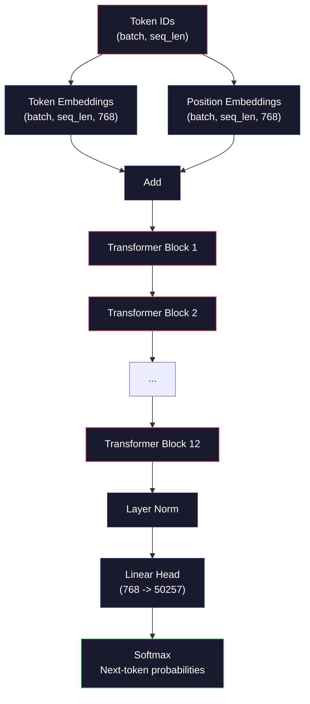
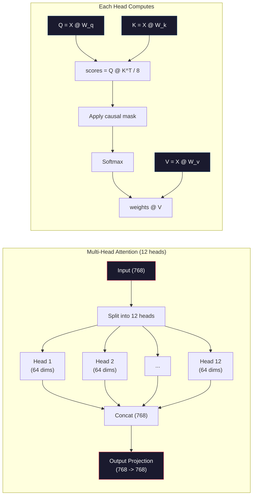
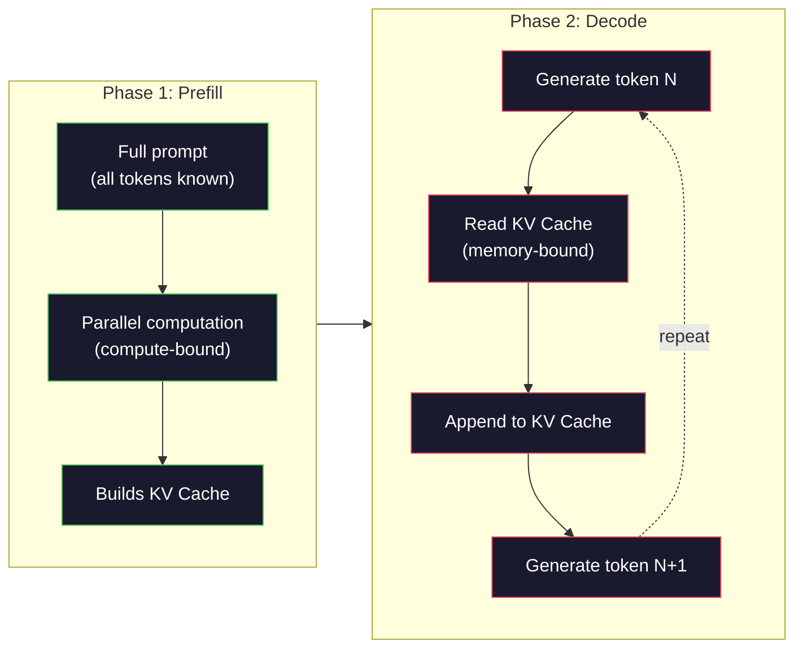

# من صفر قبل التدريب واحد GPT ميني ((124M 参数)

> GPT-2 Small لديه 1.24 مليار عنصر. هذا هو 12 طبقة من المحولات. 12 رأس الاهتمام، فضلا عن 768 维 إدمج. يمكنك استخدامها في عدد قليل من الساعات على GPU واحد من الصفر لتدريبها. معظم الناس لن يفعل ذلك أبدا.

**类型：**بناء
**语言：**(بايثون)
**前置要求：**المرحلة 10المدرسة 01-03 ((توكينازيرز
**时间：**~ 120 دقيقة

## 學习目标
- من صفر تحقيق كامل GPT-2 架构(124M 参数):إدخالات الجهازات التكنولوجية
- استخدام التنبؤ التوقيت التالي و الخسارة المتقاطعة الإنتروبي، في دراسة لغة
- 实现带 درجة الحرارة العينات مع الفلترات من أعلى-ك/أعلى-ب
- راقب منحنى فقدان التدريب،并验证模型学到了连贯的语言模式

## 问题
تعرف أن المتحول هو ما هو. لقد رأيت تلك الصور. يمكنك أن ترسم الاهتمام على اللوحة البيضاء.

هذا لا يعني أنك تفهم ما حدث عندما تم إنشاء النموذج

GPT-2 Small ((مع ربط الوزن) لديه 124,438,272 个参数── كل参数 هو من خلال حلقة تدريبية 设置出来的:前行通过、计算输失、后行通过、更新权重──12 个变压器块──每个块 12 个注意头──一个 768 维的嵌入空间──一个包含 50,257 个收取代币的词汇──每当模型生成一个代币时,全部 1.24 亿个参数都会参与一条矩阵乘数链:它接一串代币 ID,并输出下一个代币的概率分布──

إذا لم تكن قد بنيت كل هذا بنفسك من قبل، أنت على وشك استخدام صندوق أسود. يمكنك استخدام API. يمكنك ضبطها بشكل جيد. ولكن عندما تظهر مشكلة عندما النموذج يوحش، يكرر نفسه، يرفض اتباع التعليمات.

هذا الدروس سوف يكون من الصفر بناء GPT-2 Small── ليس باستخدام PyTorch── باستخدام numpy── كل مرة مضاعفة المصفوفة هم قابلون للنظر── كل درجة هم من قبل رمزك الحساب── سوف تحصل على معرفة كيفية عمل 1.24 مليار رقم معا لتنبؤ كلمة التالية──

## 概念
### معمارة GPT

GPT هو نموذج لغة autoregressive. Autoregressive.  تعني أنه يولد رمزًا واحدًا مرة واحدة ، كل رمز يستند إلى جميع الـ Token.

و يحتوي هذا على الرسم البياني الكامل لحسابات من رمز التوكن إلى احتمالات التوكن التالية:

1. رمز الوهم 输入。شكل: (حجم البطاقة، seq_len)。
2. رمز إدراج البحث. كل هوية 映射到一个 768 维 vekt.
3. وضع إضافة البحث── كل موقع ((0, 1, 2, ...)映射到一个 768 维 vektor──Shape 相同──
4. 将 رمزات التوابل + وضع التوابل 相加。
5. من خلال 12 كتل محولة
6. آخر طبقة طبيعية
7. التنبيه الخطى إلى حجم المفردات.شكل: (حجم المجموعة، seq_len، vocab_size)
8. المعدل المُساعد

هذا هو النموذج بأكمله. لا توجد إلتقاطات. لا تكرار.



### كتلة التحويل

12 个区 中的每个都遵循同样模式──Pre-norm 架构(GPT-2 使用 pre-norm,而不是 المحول الأصلي 那样的 post-norm):

1. الطبقة النظامية
2. الاهتمام الذاتي متعدد الرؤوس
3. اتصال بقايا ((把 المدخل 加回来)
4. الطبقة النظامية
5. شبكة إرسال المواد المغذية
6. اتصال بقايا ((把 المدخل 加回来)

العلاقات البقية 至关重要──没有它们,在后扩散过程中,Gradient到达区块 1 时会消失──有它们,Gradient可以通过 skip路从 Loss 直接流向任意层──这就是为什么你可以堆叠12、32,甚至96块(GPT-4传闻使用120个)──

### الاهتمام: الهيئة الأساسية

الاهتمام الذاتي 让每个代币 查看前面所有代币,并决定应该关注每个代币 多少──下面是数学形式──

لكل موقع رمز، من المدخل  حساب ثلاثة متجهات:
- **Query (Q)**ماذا أبحث عن؟
- **Key (K)**ماذا يوجد في هذا؟
- **Value (V)**ما المعلومات التي أحملها؟

```
Q = input @ W_q    (768 -> 768)
K = input @ W_k    (768 -> 768)
V = input @ W_v    (768 -> 768)

attention_scores = Q @ K^T / sqrt(d_k)
attention_scores = mask(attention_scores)   # causal mask: -inf for future positions
attention_weights = softmax(attention_scores)
output = attention_weights @ V
```

القناع السببية هو جعل GPT  مع وجود آلية خاصية ذات التراجعة الذاتية. الموقف 5 يمكن حضور المواقع 0-5, ولكن لا يمكن حضور 6、7、8، وفقا لهذا النوع من التوصيات. هذا سيمنع النموذج في التدريب خلال مشاهدة مستقبل الوهم 来作弊。

**Multi-head attention**سوف تتم تقسيم 768 维空间 إلى 12 رأسًا ، كل رأس 64 维── كل رأس تعلم نمط مختلف من الاهتمام.



خارج في مربع d_k) sqrt(64) = 8 هو مقياسها. بدونها، سوف يصبح منتج النقاط عالية الارتفاع في المتجه كبير جدا، ضع softmax 推到 Gradient 几乎为零的区域──这是原始 

### كيه فاي: 推理为什么快

訓練時,你會一次處理整个序列──Inference 时,你會一次生成 Token──如果沒有優化,生成 Token N 需要为前面所有N-1 个 Token 重新计算 注意──对于每個生成 Token,这是 O(N),对于长度为 N 的序列,总体是 O(N^2) 关注分数 计算,并且还会重复执行大量输入侧矩阵乘量──

KV Cache  حل هذه المشكلة.‬‬‬‬‬‬‬‬‬‬‬‬‬‬‬‬‬‬‬‬‬‬‬‬‬‬‬‬‬‬‬‬‬‬‬‬‬‬‬‬‬‬‬‬‬‬‬‬‬‬‬‬‬‬‬‬‬‬‬‬‬‬‬‬‬‬‬‬‬‬‬‬‬‬‬‬‬‬‬‬‬‬‬‬‬‬‬‬‬‬‬‬‬‬‬‬‬‬‬‬‬‬‬‬‬‬‬‬‬‬‬‬‬‬‬‬‬‬‬‬‬‬‬‬‬‬‬‬‬‬‬‬‬‬‬‬‬‬‬‬‬‬‬‬‬‬‬‬‬‬‬‬‬‬‬‬‬‬‬‬‬‬‬‬‬‬‬‬‬‬‬‬‬‬‬‬‬‬‬‬‬‬‬‬‬‬‬‬‬‬‬‬‬‬‬‬‬‬‬‬‬‬‬‬‬‬‬‬‬‬‬‬‬‬‬‬‬‬‬‬‬‬‬‬‬‬‬‬‬‬‬‬‬‬‬‬‬‬‬‬‬‬‬‬‬‬‬‬‬‬‬‬‬‬‬‬‬‬‬‬‬‬‬‬‬‬‬‬‬‬‬‬‬‬‬‬‬‬‬‬‬‬‬‬‬‬‬‬‬‬‬‬‬‬‬‬‬‬‬‬‬‬‬‬‬‬‬‬‬‬‬‬‬‬‬‬‬‬‬‬‬‬‬‬‬‬‬‬‬‬‬‬‬‬‬‬‬‬‬‬‬‬‬‬‬‬‬‬‬‬‬‬‬‬‬‬‬‬‬‬‬‬‬‬‬‬‬‬‬‬‬‬‬‬‬‬‬‬‬‬‬‬‬‬‬‬‬‬‬‬‬‬‬‬‬‬‬‬‬‬‬‬‬‬‬‬‬‬‬‬‬‬‬‬‬‬‬‬‬‬‬‬‬‬‬‬‬‬‬‬‬‬‬‬‬‬‬‬‬‬‬‬‬‬‬‬‬‬‬‬‬‬‬‬‬‬‬‬‬‬‬‬‬‬‬‬‬‬‬‬‬‬‬‬‬‬‬‬‬‬‬‬‬‬‬‬‬‬‬‬‬‬‬‬‬‬‬‬‬‬

对于包含12 طبقة و12 رأس GPT-2,KV cache 会为每个代币 存储 2(K + V) x 12 طبقة x 12 رأس x 64 dims = 18,432 个值。对于1024-Token تسلسل،这在FP32 下大约是75MB。对于拥有128 طبقة Llama 3 405B,单个序列的KV cache 可能超过10GB。这就是为什么长文本推断受记忆约束──

### المكملات المسبقة مقابل المكشف:

عندما تُرسل إلى ماجستير في إدارة الأعمال، سيتم تقسيم المُؤثرات إلى مرحلتين مختلفتين.

**Prefill**سوف تتعامل مع كل عرضك. جميع الوهمات معروفة، لذلك يمكن أن يحسب النموذج في نفس الوقت جميع المواقف.

**Decode**سوف تولد رمز واحد مرة واحدة. كل رمز جديد يعتمد على كل رمز سابق. هذه المرحلة هي ضغينة الزجاج المرتبطة بالذاكرة من ذاكرة GPU 读取模型权重和KV cache ، وليس من حسابات Matrix math 本身── GPU.

هذا التفريق بالنسبة لنظام الإنتاج مهم للغاية. . . . . . . . . . . . . . . . . . . . . . . . . . . . . . . . . . . . . . . . . . . . . . . . . . . . . . . . . . . . . . . . . . . . . . . . . . . . . . . . . . . . . . . . . . . . . . . . . . . . . . . . . . . . . . . . . . . . . . . . . . . . . . . . . . . . . . . . . . . . . . . . . . . . . . . . . . . . . . . . . . . . . . . . . . . . . . . . . . . . . . . . . . . . . . . . . . . . . . . . . . . . . . . . . . . . . . . . . . . . . . . . . . . . . . . . . . . . . . . . . . . . . . . . . . . . . . . . . . . . . . . . . . . . . . . . . . . . . . . . . . . . . . . . . . . . . . . . . . . . . . . . . . . . . . . . . . . . . . . . . . . . . . . . . . . . . . . . . . . . . . . . . . . . . . . . . . . . . . . . . . . . . . . . . . . . . . . . . . . . . . . . . . . . . . . . . . . . . . . . . . . . . . . . . . . . . . . . . . . . . . . . . . . . . . . . . . . . . . . . . . . . . . . . . . . . . . . . . . . . . . . . . . . . . . . . . . . . . . . . . . . . . . . . . . . . . . . . . . .



### حلقة التدريب

訓練 LLM 就是 التنبؤ بالتوقيت التالي──给定 Token [0, 1, 2, ..., N-1],预测 Token [1, 2, 3, ..., N]── فقدان وظيفة 是模型预测概率分布与真实 next Token 之间的交叉──

خطوة تدريبية:

1. **Forward pass**: دع البطاقة 通過全部 12 个块── get logits of each position(مواجهة النمو النقي
2. **Compute loss**:اللوجيتس و الوهم المستهدف
3. **Backward pass**: استخدام التنشر الخلفي 为全部 124M 参数计算 Gradient。
4. **Optimizer step**استخدام معدل التعلم التدفئة و التدهور الكوسيني

جدول معدل التعلم أكثر أهمية بكثير. في الخطوات الـ 2000 الأولى، من 0 إلى ارتفاع معدل التعلم، ثم تحرك على منحنى الكوسين  انحطاط. من ارتفاع معدل التعلم  بدأ يؤدي إلى اختلاف النموذج.

### GPT-2 صغير: الأرقام

| Component | Shape | Parameters |
|-----------|-------|------------|
| Token embeddings | (50257, 768) | 38,597,376 |
| Position embeddings | (1024, 768) | 786,432 |
| Per-block attention (W_q, W_k, W_v, W_out) | 4 x (768, 768) | 2,359,296 |
| Per-block FFN (up + down) | (768, 3072) + (3072, 768) | 4,718,592 |
| Per-block LayerNorms (2x) | 2 x 768 x 2 | 3,072 |
| Final LayerNorm | 768 x 2 | 1,536 |
| **Total per block** | | **7,080,960** |
| **Total (12 blocks)** | | **85,054,464 + 39,383,808 = 124,438,272** |

توقيع الخروج ((رأس اللوجيتس) مع معالم إضافة الوهمات 共享权重──这叫重量绑它减少38M 参数,并提升性能,因为它迫使模型对 input和 output 使用同一个表示空间──


```figure
sampling-decoder
```

## بناءها
### الخطوة 1: إدراج الطبقة

إضافة الوضع إضافة حول كل رمز في تسلسل الموقع المعلومات.

```python
import numpy as np

class Embedding:
    def __init__(self, vocab_size, embed_dim, max_seq_len):
        self.token_embed = np.random.randn(vocab_size, embed_dim) * 0.02
        self.pos_embed = np.random.randn(max_seq_len, embed_dim) * 0.02

    def forward(self, token_ids):
        seq_len = token_ids.shape[-1]
        tok_emb = self.token_embed[token_ids]
        pos_emb = self.pos_embed[:seq_len]
        return tok_emb + pos_emb
```

ابتدأت استخدام انحراف معيار 0.02، من ورقة GPT-2。 جداً، ابتدأت المخططات الأمامية 会产生极端值,破坏训练稳定性。 جداً، ابتدأت المخرجات على جميع المدخلات 几乎相同,让早期渐态信号 失去作用。

### الخطوة الثانية: الاهتمام الذاتي مع القناع السببية

أولا تحقيق الاهتمام ذو الرأس الواحد. القناع العاملة 会在软max 之前把未来位置 设置为负无限, ضمان كل موقف فقط يمكن الاهتمام لنفسه و更早的位置.

```python
def attention(Q, K, V, mask=None):
    d_k = Q.shape[-1]
    scores = Q @ K.transpose(0, -1, -2 if Q.ndim == 4 else 1) / np.sqrt(d_k)
    if mask is not None:
        scores = scores + mask
    weights = np.exp(scores - scores.max(axis=-1, keepdims=True))
    weights = weights / weights.sum(axis=-1, keepdims=True)
    return weights @ V
```

سوف تتجاوز الغالبية العالية من القيمة المحددة. هذا هو تقنية ثابتة في العدد العادي.

### الخطوة الثالثة: الاهتمام متعدد الرؤوس

سوف تُقسم 768 维 إدخال إلى 12 رأسًا ، كل رأس 64 维── كل رأس 独立计算 Attention──将结果连锁,并项目 回 768 维──

```python
class MultiHeadAttention:
    def __init__(self, embed_dim, num_heads):
        self.num_heads = num_heads
        self.head_dim = embed_dim // num_heads
        self.W_q = np.random.randn(embed_dim, embed_dim) * 0.02
        self.W_k = np.random.randn(embed_dim, embed_dim) * 0.02
        self.W_v = np.random.randn(embed_dim, embed_dim) * 0.02
        self.W_out = np.random.randn(embed_dim, embed_dim) * 0.02

    def forward(self, x, mask=None):
        batch, seq_len, d = x.shape
        Q = (x @ self.W_q).reshape(batch, seq_len, self.num_heads, self.head_dim).transpose(0, 2, 1, 3)
        K = (x @ self.W_k).reshape(batch, seq_len, self.num_heads, self.head_dim).transpose(0, 2, 1, 3)
        V = (x @ self.W_v).reshape(batch, seq_len, self.num_heads, self.head_dim).transpose(0, 2, 1, 3)

        scores = Q @ K.transpose(0, 1, 3, 2) / np.sqrt(self.head_dim)
        if mask is not None:
            scores = scores + mask
        weights = np.exp(scores - scores.max(axis=-1, keepdims=True))
        weights = weights / weights.sum(axis=-1, keepdims=True)
        attn_out = weights @ V

        attn_out = attn_out.transpose(0, 2, 1, 3).reshape(batch, seq_len, d)
        return attn_out @ self.W_out
```

إعادة تشكيل-تحويل-إعادة تشكيل هذا المجموعة من العمليات هي الاهتمام متعدد الرؤوس 中最容易让人困惑的部分──发生的是:形状为 (بارتش, seq_len, 768) 的变 (بارتش, seq_len, 12, 64),再变成 (بارتش, 12, seq_len, 64)──现在 12 个头中的每个有自己的 (بارتش, seq_len, 64) ماتريك 来运行 Attention──Attention 结束后,我们反向执行这个过程:((بارتش, 12, seq_len, 64) 变成 (بارتش, seq_len, 12, 64),再变成 (بارتش, seq_len, 768)──

### 步骤 4: كتلة المحول

واحد كاملة كتلة المحول:LayerNorm 带 بقايا الاهتمام متعدد الرؤوس  LayerNorm 带 بقايا المغذية المقدمة

```python
class LayerNorm:
    def __init__(self, dim, eps=1e-5):
        self.gamma = np.ones(dim)
        self.beta = np.zeros(dim)
        self.eps = eps

    def forward(self, x):
        mean = x.mean(axis=-1, keepdims=True)
        var = x.var(axis=-1, keepdims=True)
        return self.gamma * (x - mean) / np.sqrt(var + self.eps) + self.beta


class FeedForward:
    def __init__(self, embed_dim, ff_dim):
        self.W1 = np.random.randn(embed_dim, ff_dim) * 0.02
        self.b1 = np.zeros(ff_dim)
        self.W2 = np.random.randn(ff_dim, embed_dim) * 0.02
        self.b2 = np.zeros(embed_dim)

    def forward(self, x):
        h = x @ self.W1 + self.b1
        h = np.maximum(0, h)  # GELU approximation: ReLU for simplicity
        return h @ self.W2 + self.b2


class TransformerBlock:
    def __init__(self, embed_dim, num_heads, ff_dim):
        self.ln1 = LayerNorm(embed_dim)
        self.attn = MultiHeadAttention(embed_dim, num_heads)
        self.ln2 = LayerNorm(embed_dim)
        self.ffn = FeedForward(embed_dim, ff_dim)

    def forward(self, x, mask=None):
        x = x + self.attn.forward(self.ln1.forward(x), mask)
        x = x + self.ffn.forward(self.ln2.forward(x))
        return x
```

شبكة تغذية سوف 768 维 مدخل  توسع إلى 3,072 维(4x) ، تطبيق عدم خطية ، ثم مشروع 回 768 维。 هذا النمط التوسع-التناقص 让模型在每个位置上有一个更宽的内部表示可以使用──GPT-2 使用 GELU激活,但这里为了简单使用 ReLU对理解架构来说差别不大──

### الخطوة 5: نموذج GPT كامل

堆叠 12 个 بلاكات المحولات.

```python
class MiniGPT:
    def __init__(self, vocab_size=50257, embed_dim=768, num_heads=12,
                 num_layers=12, max_seq_len=1024, ff_dim=3072):
        self.embedding = Embedding(vocab_size, embed_dim, max_seq_len)
        self.blocks = [
            TransformerBlock(embed_dim, num_heads, ff_dim)
            for _ in range(num_layers)
        ]
        self.ln_f = LayerNorm(embed_dim)
        self.vocab_size = vocab_size
        self.embed_dim = embed_dim

    def forward(self, token_ids):
        seq_len = token_ids.shape[-1]
        mask = np.triu(np.full((seq_len, seq_len), -1e9), k=1)

        x = self.embedding.forward(token_ids)
        for block in self.blocks:
            x = block.forward(x, mask)
        x = self.ln_f.forward(x)

        logits = x @ self.embedding.token_embed.T
        return logits

    def count_parameters(self):
        total = 0
        total += self.embedding.token_embed.size
        total += self.embedding.pos_embed.size
        for block in self.blocks:
            total += block.attn.W_q.size + block.attn.W_k.size
            total += block.attn.W_v.size + block.attn.W_out.size
            total += block.ffn.W1.size + block.ffn.b1.size
            total += block.ffn.W2.size + block.ffn.b2.size
            total += block.ln1.gamma.size + block.ln1.beta.size
            total += block.ln2.gamma.size + block.ln2.beta.size
        total += self.ln_f.gamma.size + self.ln_f.beta.size
        return total
```

انتبه إلى الوزن:`logits = x @ self.embedding.token_embed.T`◊ الإخراج التوقيت 复用 Token Embedding Matrix(转置) ・・・ هذا ليس مجرد حركة لتنظيم العناصر.

### الخطوة 6: حلقة التدريب

لتحقيق تدريب 124M الحقيقي، تحتاج إلى GPU و PyTorch. هذه الحلقة التدريبية في آلية عرض صغيرة يمكن استخدامها باستخدام النمبيات النمطية.

```python
def cross_entropy_loss(logits, targets):
    batch, seq_len, vocab_size = logits.shape
    logits_flat = logits.reshape(-1, vocab_size)
    targets_flat = targets.reshape(-1)

    max_logits = logits_flat.max(axis=-1, keepdims=True)
    log_softmax = logits_flat - max_logits - np.log(
        np.exp(logits_flat - max_logits).sum(axis=-1, keepdims=True)
    )

    loss = -log_softmax[np.arange(len(targets_flat)), targets_flat].mean()
    return loss


def train_mini_gpt(text, vocab_size=256, embed_dim=128, num_heads=4,
                   num_layers=4, seq_len=64, num_steps=200, lr=3e-4):
    tokens = np.array(list(text.encode("utf-8")[:2048]))
    model = MiniGPT(
        vocab_size=vocab_size, embed_dim=embed_dim, num_heads=num_heads,
        num_layers=num_layers, max_seq_len=seq_len, ff_dim=embed_dim * 4
    )

    print(f"Model parameters: {model.count_parameters():,}")
    print(f"Training tokens: {len(tokens):,}")
    print(f"Config: {num_layers} layers, {num_heads} heads, {embed_dim} dims")
    print()

    for step in range(num_steps):
        start_idx = np.random.randint(0, max(1, len(tokens) - seq_len - 1))
        batch_tokens = tokens[start_idx:start_idx + seq_len + 1]

        input_ids = batch_tokens[:-1].reshape(1, -1)
        target_ids = batch_tokens[1:].reshape(1, -1)

        logits = model.forward(input_ids)
        loss = cross_entropy_loss(logits, target_ids)

        if step % 20 == 0:
            print(f"Step {step:4d} | Loss: {loss:.4f}")

    return model
```

الخسارة الأولى بدأت تقترب من ln(تجميل الكلمات)  بالنسبة لـ 256-Token بكلمات مستوى البايت،也就是 ln(256) = 5.55。随机模型会给每个 token 分配相等概率──随着训练推进,Loss 会下降,因为模型学会预测常见模式:如 t 后面的 th、句号后的空格,等等──

في الإنتاج، سوف تستخدم أدم أوتيميزر، معالجة تراكم تدريجي ٬ تسخين معدل التعلم 和 تراجع تدريجي ٬ حلقة التقدم-المرور-الخسارة-العودة-الاستحديث هو نفس الشيء٬٬ مجرد أوتيميزر 更复杂٬

### الخطوة 7: توليد النص

الجيل استخدام تدريب جيد النموذج مرة واحدة توقعات Token.

```python
def generate(model, prompt_tokens, max_new_tokens=100, temperature=0.8):
    tokens = list(prompt_tokens)
    seq_len = model.embedding.pos_embed.shape[0]

    for _ in range(max_new_tokens):
        context = np.array(tokens[-seq_len:]).reshape(1, -1)
        logits = model.forward(context)
        next_logits = logits[0, -1, :]

        next_logits = next_logits / temperature
        probs = np.exp(next_logits - next_logits.max())
        probs = probs / probs.sum()

        next_token = np.random.choice(len(probs), p=probs)
        tokens.append(next_token)

    return tokens
```

درجة الحرارة  التحكم随机性──درجة الحرارة 1.0 使用原始分布──درجة الحرارة 0.5 会让分布更尖(更确定模型更经常选择顶级选择)──درجة الحرارة 1.5 会让分布更平坦(更随机低概率代币 获得更大的机会)──درجة الحرارة 0.0 هي فك تشفير طموحة(总是选择最高概率代币)──

`tokens[-seq_len:]`هذه النافذة ضرورية لأن النموذج لديه أكبر طول السياق ((GPT-2 为 1024)  بمجرد تجاوزها، يجب أن نترك أقدم رمز.

## استخدمها
### التدريب الكامل و التجربة

```python
corpus = """The transformer architecture has revolutionized natural language processing.
Attention mechanisms allow the model to focus on relevant parts of the input.
Self-attention computes relationships between all pairs of positions in a sequence.
Multi-head attention splits the representation into multiple subspaces.
Each attention head can learn different types of relationships.
The feedforward network provides nonlinear transformations at each position.
Residual connections enable gradient flow through deep networks.
Layer normalization stabilizes training by normalizing activations.
Position embeddings give the model information about token ordering.
The causal mask ensures autoregressive generation during training.
Pre-training on large text corpora teaches the model general language understanding.
Fine-tuning adapts the pre-trained model to specific downstream tasks."""

model = train_mini_gpt(corpus, num_steps=200)

prompt = list("The transformer".encode("utf-8"))
output_tokens = generate(model, prompt, max_new_tokens=100, temperature=0.8)
generated_text = bytes(output_tokens).decode("utf-8", errors="replace")
print(f"\nGenerated: {generated_text}")
```

في الموديلات الصغيرة واللغة الصغيرة، فإن توليد النص الأكثر قدرة على حساب نصف تسلسل. فإنه سوف يتعلم من النص التدريب إلى بعض النمط على مستوى البايت، ولكن لا يمكن أن تستخدم مثل GPT-2 ذلك الاستفادة من 40GB التدريب البيانات والإمارات 124M كاملة لتجميعها.

## 交付 it
本课会产出 `outputs/prompt-gpt-architecture-analyzer.md` أحد المستخدمين في تحليل أي نموذج على النمط GPT 架构选择的提示──把模型卡或技术报告 交给它,它会解解参数分配、注意设计和规模决策──

## التدريب
1. سوف تغير النموذج لاستخدام 24 طبقة و 16 رأس بدلا من 12/12.

2. 实现 GELU تفعيل وظيفة(GELU(x) = x * 0.5 * (1 + erf(x / sqrt(2)))),并替换  中的 ReLU──分别使用两种激活 训练500步,并比较最终 Loss──

3. 给生成函数 添加KV缓存──在第一次前传后,存储每层的K和V,并后续使用它们──测量加快:分别在有缓存和没有缓存的情况下生成200个令牌,并比较墙钟时间──

4. 实现 top-k sampling( فقط النظر في احتمالية أعلى من k 个 Token) و top-p sampling(النواة العينات: النظر في احتمالية累计 تجاوز p من أدنى Token 集合)  في درجة حرارة 0.8 下比较 top-k=50 مع top-p=0.95 的输出质量──

5. 构建一个训练损失曲线图案设计者──训练模型1000步骤,并绘制损失 vs step──识别三个阶段:快速初始下降(学习常见字节)、较慢的中间阶段(学习字节模式) 以及平板块(在小语料上过)──无论你训练的是128-dimen模型 还是GPT-4,这条曲线的形状都是一样的──

## 关键术语
| Term | What people say | What it actually means |
|------|----------------|----------------------|
| Autoregressive | “它一次生成一个词” | 每个输出 Token 都基于所有之前的 Token——模型预测 P(token_n \| token_0, ..., token_{n-1}) |
| Causal mask | “它看不到未来” | 一个由 -infinity 值组成的 upper-triangular Matrix，用于在训练期间阻止 Attention 指向未来 position |
| Multi-head attention | “多种 Attention pattern” | 将 Q、K、V 拆成并行 heads（例如 GPT-2 中 12 个 head，每个 64 dims），让每个 head 学习不同的关系类型 |
| KV Cache | “用于提速的缓存” | 存储来自之前 Token 的已计算 Key 和 Value tensors，以避免 autoregressive generation 期间的冗余计算 |
| Prefill | “处理 prompt” | 第一个 inference 阶段，所有 prompt Token 并行处理——在 GPU FLOPS 上 compute-bound |
| Decode | “生成 Token” | 第二个 inference 阶段，Token 一次生成一个——在 GPU bandwidth 上 memory-bound |
| Weight tying | “共享 embeddings” | 对 input Token embeddings 和 output projection head 使用同一个 Matrix——在 GPT-2 中节省 38M 参数 |
| Residual connection | “Skip connection” | 将 input 直接加到 sublayer 的 output 上（x + sublayer(x)）——支持 deep networks 中的 Gradient flow |
| Layer normalization | “规范化 activations” | 沿 feature dimension 规范化到 mean 0 和 variance 1，并带有可学习的 scale 与 bias 参数 |
| Cross-entropy loss | “预测错得有多离谱” | -log(分配给正确 next Token 的概率)，在所有 position 上取平均——标准 LLM 训练目标 |

## 延伸阅读
- [Radford et al., 2019 -- "Language Models are Unsupervised Multitask Learners" (GPT-2)](https://cdn.openai.com/better-language-models/language_models_are_unsupervised_multitask_learners.pdf)-- 介绍 124M إلى 1.5B 参数家族的GPT-2 ورقة
- [Vaswani et al., 2017 -- "Attention Is All You Need"](https://arxiv.org/abs/1706.03762)--  طرحت على نطاق واسع نقطة منتج الاهتمام و الاهتمام متعدد الرأس
- [Llama 3 Technical Report](https://arxiv.org/abs/2407.21783)-- Meta  كيفية استخدام 16K GPUs تحويل بنية GPT  توسيع إلى 405B 参数
- [Pope et al., 2022 -- "Efficiently Scaling Transformer Inference"](https://arxiv.org/abs/2211.05102)-- سوف تملأ مقابل فك الرمز مع تحليل كاش كيف  ورقة رسمية
