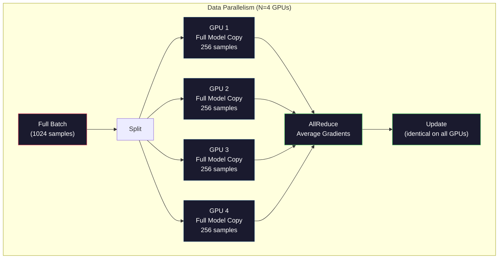
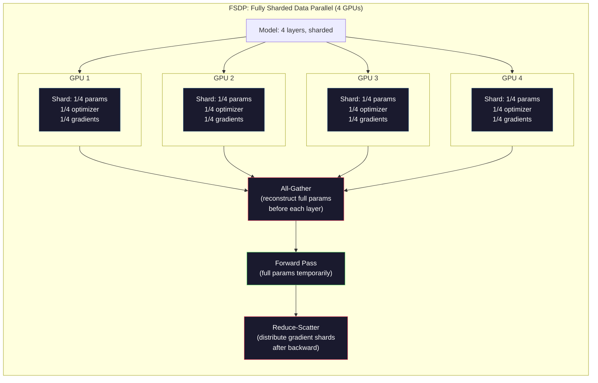
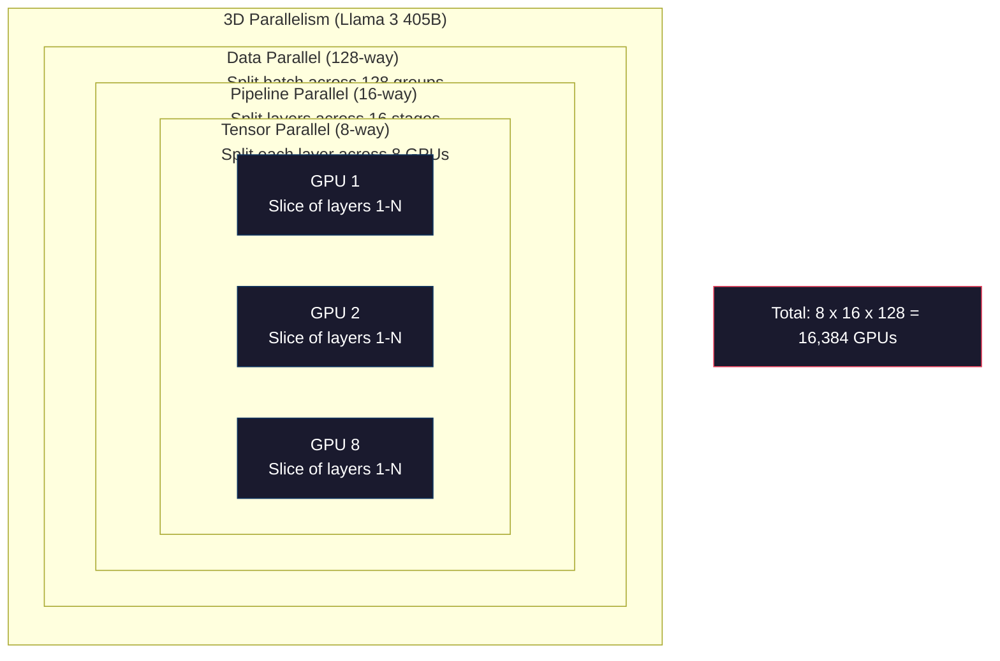

# التوسع:التدريب الموزع

> تمت تدريب 124M الخاص بك على كتلة من الجيبو. الآن تم تجربته على 70 مليار عنصر.

**Type:** Build
**Languages:** Python
**Prerequisites:** Phase 10, Lesson 04 (Pre-Training a Mini GPT)
**Time:** ~120 minutes

## 學习目标
- 解释三种平行性 (Data、Tensor、Pipeline) ، وكذلك الحكم على حجم النموذج وحجم المجموعة متى تحتاج إلى استخدامها
- استخدام PyTorch DDP 实现 Data التدريب متوازي، وتحقيق التوافق بين GPUs
-  حساب إلى حجم نموذج محدد من ميزانية الحفاظ على الأجهزة
- تكوين FSDP أو DeepSpeed ZeRO مراحل، سوف تمزق حالة النموذج إلى العديد من وحدات GPU، بحيث تتحمل أكثر من نموذج واحد

## 问题
عندما تستخدم نموذج 7B 参数 FP16 时, فقط الوزن يحتاج إلى 14GB──أدم المتحسن سوف يحتاج إلى اثنين من النسخة المعدلة للخزنة المعدلة لكل参数 ((اللحظة الأولى والحظة الثانية التقديرات)──هذا أيضا يحتاج إلى 28GB──بالتعميم ‬

واحد من NVIDIA A100 مع 80 جيجابايت

80GB في المنتصف قد استنزف 56GB. يبقى 24GB فقط للحصول على التفعيلات، وذلك هو القيمة الوسطى التي تم تحديدها خلال مرور التقدم، يجب أن يتم الاحتفاظ بها حتى التوزيع الخلفي.

现在试试 70B 参数──仅重:FP16 下 140GB──单块GPU 放不下──你至少需要2块A100(2 x 80GB = 160GB)才能只放下重量──加上优化状态和梯度,需要的GPU 远不止这些:最低3+块,实际通常取决于碎片化策略,需要8-16块──

Llama 3 405B استخدام 16,384 بلاك NVIDIA H100 GPUs  تدريب. . . . . . . . . . . . . . . . . . . . . . . . . . . . . . . . . . . . . . . . . . . . . . . . . . . . . . . . . . . . . . . . . . . . . . . . . . . . . . . . . . . . . . . . . . . . . . . . . . . . . . . . . . . . . . . . . . . . . . . . . . . . . . . . . . . . . . . . . . . . . . . . . . . . . . . . . . . . . . . . . . . . . . . . . . . . . . . . . . . . . . . . . . . . . . . . . . . . . . . . . . . . . . . . . . . . . . . . . . . . . . . . . . . . . . . . . . . . . . . . . . . . . . . . . . . . . . . . . . . . . . . . . . . . . . . . . . . . . . . . . . . . . . . . . . . . . . . . . . . . . . . . . . . . . . . . . . . . . . . . . . . . . . . . . . . . . . . . . . . . . . . . . . . . . . . . . . . . . . . . . . . . . . . . . . . . . . . . . . . . . . . . . . . . . . . . . . . . . . . . . . . . . . . . . . . . . . . . . . . . . . . . . . . . . . . . . . . . . . . . . . . . . . . . . . . . . . . . . . . . . . . . . . . . . . . . . . . . . . . . . . . . . . . .

هذا الدور تعرض جعل التدريب على نطاق واسع ممكنا من أربعة استراتيجيات: الموازية البيانات، الموازية التنسورية، الموازية خط الأنابيب، وموازية البيانات الممزقة بالكامل. سوف تستخدم أولاً Python المميزة لتشكل كل استراتيجية، وفهم آلية، ثم التواصل مرة أخرى مع إطار التدريب الموزع.

## 概念
### لماذا تحتاج إلى توزيع

أسفل هي حسابات الحفاظ على الحفاظ على الحفاظ على الحفاظ على الحفاظ على الحفاظ على الحفاظ على الحفاظ على الحفاظ على الحفاظ على الحفاظ على الحفاظ على الحفاظ على الحفاظ على الحفاظ على الحفاظ على الحفاظ على الحفاظ على الحفاظ على الحفاظ على الحفاظ على الحفاظ على الحفاظ على الحفاظ على الحفاظ على الحفاظ على الحفاظ على الحفاظ على الحفاظ على الحفاظ على الحفاظ على الحفاظ على الحفاظ على الحفاظ على الحفاظ على الحفاظ على الحفاظ على الحفاظ على الحفاظ على الحفاظ على الحفاظ على الحفاظ على الحفاظ على الحفاظ على الحفاظ على الحفاظ على الحفاظ على الحفاظ على الحفاظ على الحفاظ على الحفاظ على الحفاظ على الحفاظ على الحفاظ على الحفاظ على الحفاظ على الحفاظ على الحفاظ على الحفاظ على الحفاظ على الحفاظ على الحفاظ على الحفاظ على الحفاظ على الحفاظ على الحفاظ على الحفاظ على الحفاظ على الحفاظ على الحفاظ على الحفاظ على الحفاظ على الحفاظ على الحفاظ على الحفاظ على الحفاظ على الحفاظ على الحفاظ على الحفاظ على الحفاظ على الحفاظ على الحفاظ على الحفاظ على الحفاظ على الحفاظ على الحفاظ على الحفاظ على الحفاظ على الحفاظ على.

| Model | Params | Weights (FP16) | Adam States | Gradients (FP16) | Total (no activations) |
|-------|--------|----------------|-------------|------------------|----------------------|
| GPT-2 Small | 124M | 248 MB | 992 MB | 248 MB | 1.5 GB |
| Llama 3 8B | 8B | 16 GB | 64 GB | 16 GB | 96 GB |
| Llama 3 70B | 70B | 140 GB | 560 GB | 140 GB | 840 GB |
| Llama 3 405B | 405B | 810 GB | 3,240 GB | 810 GB | 4,860 GB |

أدام الولايات 这一列才是真正的显存杀手──亚当会为每个参数存储运行平均 (m) 和运行变量 (v),两者都是FP32──对于70B 模型,这就是70B x 4 bytes x 2 = 560GB──只有优化器就需要七块A100──

单块H100 有 80GB──Llama 3 405B 至少需要 61块H100 才能容纳权重、优化和梯度──加上激活, 數量也将继续增加──Meta 使用 16,384块GPU ليس لأنهم يعتقدون ذلك, ولكن لأنهم يجب أن يفعلوا ذلك──

### التوازي بين البيانات

أسهل استراتيجية توزيعية. ضع النموذج الكامل على N 块 GPU. ضع كل مجموعة تدريبية 拆 into N 个相等部分. كل قطعة GPU في شظيفة البيانات الخاصة بها 上运行向前和回路. بعد مرور إلى الوراء.

**优点：**الانتقال 近似线性扩展──N 块 GPU كل خطوة 处理 N 倍数据──通信 仅限于梯度平均,并且可以与计算重叠──

**缺点：**كل بلوك من الجيبو تمتلك نموذجًا كاملًا ‬الوضع المثالي والتحريفات‬‬بالنسبة إلى 70B ‬الموديل، كل بلوك من الجيبو يحتوي على 840 جيجابايت‬‬‬‬‬‬‬‬‬‬‬‬‬‬‬‬‬‬‬‬‬‬‬‬‬‬‬‬‬‬‬‬‬‬‬‬‬‬‬‬‬‬‬‬‬‬‬‬‬‬‬‬‬‬‬‬‬‬‬‬‬‬‬‬‬‬‬‬‬‬‬‬‬‬‬‬‬‬‬‬‬‬‬‬‬‬‬‬‬‬‬‬‬‬‬‬‬‬‬‬‬‬‬‬‬‬‬‬‬‬‬‬‬‬‬‬‬‬‬‬‬‬‬‬‬‬‬‬‬‬‬‬‬‬‬‬‬‬‬‬‬‬‬‬‬‬‬‬‬‬‬‬‬‬‬‬‬‬‬‬‬‬‬‬‬‬‬‬‬‬‬‬‬‬‬‬‬‬‬‬‬‬‬‬‬‬‬‬‬‬‬‬‬‬‬‬‬‬‬‬‬‬‬‬‬‬‬‬‬‬‬‬‬‬‬‬‬‬‬‬‬‬‬‬‬‬‬‬‬‬‬‬‬‬‬‬‬‬‬‬‬‬‬‬‬‬‬‬‬‬‬‬‬‬‬‬‬‬‬‬‬‬‬‬‬‬‬‬‬‬‬‬‬‬‬‬‬‬‬‬‬‬‬‬‬‬‬‬‬‬‬‬‬‬‬‬‬‬‬‬‬‬‬‬‬‬‬‬‬‬‬‬‬‬‬‬‬‬‬‬‬‬‬‬‬‬‬‬‬‬‬‬‬‬‬‬‬‬‬‬‬‬‬‬‬‬‬‬‬‬‬‬‬‬‬‬‬‬‬‬‬‬‬‬‬‬‬‬‬‬‬‬‬‬‬‬‬‬‬‬‬‬‬‬‬‬‬‬‬‬‬‬‬‬‬‬‬‬‬‬‬‬‬‬‬‬‬‬‬‬‬‬‬‬‬‬‬‬‬‬‬‬‬‬‬‬‬‬‬‬‬‬‬‬‬‬‬‬‬‬‬‬‬‬‬‬‬‬‬‬

**计算：**حجم اللحظة الفعالة = لكل_gpu_lotch_size x N。 بالنسبة ل N=64 块 GPU 且 لكل اللحظة GPU 为 16, اللحظة الفعالة 为 1,024。Llama 3 استخدام حجم اللحظة الفعالة هو لكل خطوة 16000000 توكن‬‬‬‬‬‬‬‬‬‬‬‬‬‬‬‬‬‬‬‬‬‬‬‬‬‬‬‬‬‬‬‬‬‬‬‬‬‬‬‬‬‬‬‬‬‬‬‬‬‬‬‬‬‬‬‬‬‬‬‬‬‬‬‬‬‬‬‬‬‬‬‬‬‬‬‬‬‬‬‬‬‬‬‬‬‬‬‬‬‬‬‬‬‬‬‬‬‬‬‬‬‬‬‬‬‬‬‬‬‬‬‬‬‬‬‬‬‬‬‬‬‬‬‬‬‬‬‬‬‬‬‬‬‬‬‬‬‬‬‬‬‬‬‬‬‬‬‬‬‬‬‬‬‬‬‬‬‬‬‬‬‬‬‬‬‬‬‬‬‬‬‬‬‬‬‬‬‬‬‬‬‬‬‬‬‬‬‬‬‬‬‬‬‬‬‬‬‬‬‬‬‬‬‬‬‬‬‬‬‬‬‬‬‬‬‬‬‬‬‬‬‬‬‬‬‬‬‬‬‬‬‬‬‬‬‬‬‬‬‬‬‬‬‬‬‬‬‬‬‬‬‬‬‬‬‬‬‬‬‬‬‬‬‬‬‬‬‬‬‬‬‬‬‬‬‬‬‬‬‬‬‬‬‬‬‬‬‬‬‬‬‬‬‬‬‬‬‬‬‬‬‬‬‬‬‬‬‬‬‬‬‬‬‬‬‬‬‬‬‬‬‬‬‬‬‬‬‬‬‬‬‬‬‬‬‬‬‬‬‬‬‬‬‬‬‬‬‬‬‬‬‬‬‬‬‬‬‬‬‬‬‬‬‬‬‬‬‬‬‬‬‬‬‬‬‬‬‬‬‬‬‬‬‬‬‬‬‬‬‬‬‬‬‬‬‬‬‬‬‬‬‬‬‬‬‬‬‬‬‬‬‬‬‬‬‬‬‬‬‬‬‬‬‬‬‬‬‬‬‬‬‬‬‬‬‬‬‬‬‬‬‬‬



### التوازي التنسوري

وضع طبقة واحدة  فصل إلى العديد من الجيبو 上―― مرة واحدة مضاعفة المصفوفة يتم تقسيمها إلى العديد من الجيبو، كل قطعة من الجيبو  جزء من النتيجة الحسابية‬‬‬‬‬‬‬‬‬‬‬‬‬‬‬‬‬‬‬‬‬‬‬‬‬‬‬‬‬‬‬‬‬‬‬‬‬‬‬‬‬‬‬‬‬‬‬‬‬‬‬‬‬‬‬‬‬‬‬‬‬‬‬‬‬‬‬‬‬‬‬‬‬‬‬‬‬‬‬‬‬‬‬‬‬‬‬‬‬‬‬‬‬‬‬‬‬‬‬‬‬‬‬‬‬‬‬‬‬‬‬‬‬‬‬‬‬‬‬‬‬‬‬‬‬‬‬‬‬‬‬‬‬‬‬‬‬‬‬‬‬‬‬‬‬‬‬‬‬‬‬‬‬‬‬‬‬‬‬‬‬‬‬‬‬‬‬‬‬‬‬‬‬‬‬‬‬‬‬‬‬‬‬‬‬‬‬‬‬‬‬‬‬‬‬‬‬‬‬‬‬‬‬‬‬‬‬‬‬‬‬‬‬‬‬‬‬‬‬‬‬‬‬‬‬‬‬‬‬‬‬‬‬‬‬‬‬‬‬‬‬‬‬‬‬‬‬‬‬‬‬‬‬‬‬‬‬‬‬‬‬‬‬‬‬‬‬‬‬‬‬‬‬‬‬‬‬‬‬‬‬‬‬‬‬‬‬‬‬‬‬‬‬‬‬‬‬‬‬‬‬‬‬‬‬‬‬‬‬‬‬‬‬‬‬‬‬‬‬‬‬‬‬‬‬‬‬‬‬‬‬‬‬‬‬‬‬‬‬‬‬‬‬‬‬‬‬‬‬‬‬‬‬‬‬‬‬‬‬‬‬‬‬‬‬‬‬‬‬‬‬‬‬‬‬‬‬‬‬‬‬‬‬‬‬‬‬‬‬‬‬‬‬‬‬‬‬‬‬‬‬‬‬‬‬‬‬‬‬‬‬‬‬‬‬‬‬‬‬‬‬‬‬‬‬‬‬‬‬‬‬‬‬‬‬‬‬‬‬‬‬‬‬‬‬‬‬‬‬‬‬‬‬‬‬‬‬‬‬

考虑 feedforward layer 中一个形 为 (8192, 8192) المصفوفة الوزن  باستخدام التوازي الجهاز الـ 4 时, كل قطعة من GPU 持有一个 (8192, 2048) شكل  باستخدام كل قطعة من GPU باستخدام输入乘以自己的 شكل,产生 جزئي نتيجة نتائج جزئية سيتم جمعها  通过全减或全集合)生成完整输出

**优点：**降低每块GPU 上的模型重量 显存占用──70B 模型拆分到8块GPU 上, يعني أن كل بلوكGPU 持有8.75B 参数规模的重量──

**缺点：**كل طبقة بعد كل مستوى تحتاج إلى GPU عالية السرعة 间通信。 كل مرة بعد كل مرة 后的全减少会增加延迟。 هذا في NVLink((ال GPU 间 900 GB/s في نفس القطعة) على النحو الجيد، ولكن في خلال InfiniBand(400 Gb/s، حوالي 50 GB/s) من خلال نقاط الاتصال بين النقاط التأثيرات تتباين‬‬‬‬‬‬‬‬‬‬‬‬‬‬‬‬‬‬‬‬‬‬‬‬‬‬‬‬‬‬‬‬‬‬‬‬‬‬‬‬‬‬‬‬‬‬‬‬‬‬‬‬‬‬‬‬‬‬‬‬‬‬‬‬‬‬‬‬‬‬‬‬‬‬‬‬‬‬‬‬‬‬‬‬‬‬‬‬‬‬‬‬‬‬‬‬‬‬‬‬‬‬‬‬‬‬‬‬‬‬‬‬‬‬‬‬‬‬‬‬‬‬‬‬‬‬‬‬‬‬‬‬‬‬‬‬‬‬‬‬‬‬‬‬‬‬‬‬‬‬‬‬‬‬‬‬‬‬‬‬‬‬‬‬‬‬‬‬‬‬‬‬‬‬‬‬‬‬‬‬‬‬‬‬‬‬‬‬‬‬‬‬‬‬‬‬‬‬‬‬‬‬‬‬‬‬‬‬‬‬‬‬‬‬‬‬‬‬‬‬‬‬‬‬‬‬‬‬‬‬‬‬‬‬‬‬‬‬‬‬‬‬‬‬‬‬‬‬‬‬‬‬‬‬‬‬‬‬‬‬‬‬‬‬‬‬‬‬‬‬‬‬‬‬‬‬‬‬‬‬‬‬‬‬‬‬‬‬‬‬‬‬‬‬‬‬‬‬‬‬‬‬‬‬‬‬‬‬‬‬‬‬‬‬‬‬‬‬‬‬‬‬‬‬‬‬‬‬‬‬‬‬‬‬‬‬‬‬‬‬‬‬‬‬‬‬‬‬‬‬‬‬‬‬‬‬‬‬‬‬‬‬‬‬‬‬‬‬‬‬‬‬‬‬‬‬‬‬‬‬‬‬‬‬‬‬‬‬‬‬‬‬‬‬‬‬‬‬‬‬‬‬‬‬‬‬‬‬‬‬‬‬‬‬‬‬

**真实用法：**Megatron-LM  افتتاح التوازي التنسوري ∙ لامة 3 405B في كل نقطة استخدام التوازي التنسوري 8-الطريق ∙

### التوازي مع خطوط الأنابيب

按层 拆分模型──GPU 1 运行层 1-8──GPU 2 运行层 9-16──GPU 3 运行层 17-24──GPU 4 运行层 25-32──数据流经管道:GPU 1 计算自己的层并把激活 发送给 GPU 2,GPU 2 计算自己的层 后发送给 GPU 3,依此类推──

**优点：**معدل التواصل بين الجيوبوتين هو أقل، ويمكن أن يتمكن من العمل عبر القطاعات،

**缺点：**فقاعات الأنابيب  عندما يقوم GPU 4 بحساب المخططات الأمامية لـ 1 مجموعة صغيرة ، GPU 1、2、3 都处于空状态(لقد أكملت مرحلة التقدم الخاصة بها 部分) ・المرحلة الماضية ،模式反过来── استخدام المخططات البديلة 时,N 个管道阶段 استخدام GPU 只有 1/N。

**GPipe and PipeDream**通過把批量 拆成微批量 来解決泡泡 问题──GPU 1 一完成微批量 1 的前进,就开始处理微批量 2──这让不同的管道阶段的计算发生重叠──使用M 个微批量 和 N 个阶段时,泡泡分数 降为 (N-1) /M──N=4阶段、M=16 微批量时,泡泡为 3/16 = 18.75% 空时间──

### FSDP: المعلومات المزدوجة بالكامل

FSDP يجمع بين التوسع والإنتاجية الكبيرة للتقسيم للموازيات البيانية. كل قطعة من GPU لم تعد تحتفظ بنسخة كاملة من النموذج، بل تحتفظ فقط بمعايير 1/N أو درجات وتحديدات المحسنات.

في طبقة ما من المضي قدما قبل، سوف FSDP**all-gather**، وضع جميع المعلمات الكاملة من GPU فوق  جمع إلى كل قطعة من GPU في الاحتفاظ ظهري ‬ بعد مرور إلى الأمام ‬ ، كل قطعة من GPU ‬ تخلى عن المعلمات غير المحلية‬ ‬ خلال الظهر ‬ ، كل شيء يجمع مرة أخرى ، ليعيد بناءها لتحليل التراجع‬ ‬ بعد مرور إلى الوراء ‬**reduce-scatter**تمزق شرائح التدرج، دع كل قطعة من GPU تخزن فقط 1/N من التدرج.

**70B 模型在 8 块 GPU 上的计算：**

| Component | Without FSDP | With FSDP |
|-----------|-------------|-----------|
| Weights (FP16) | 140 GB per GPU | 17.5 GB per GPU |
| Adam States (FP32) | 560 GB per GPU | 70 GB per GPU |
| Gradients (FP16) | 140 GB per GPU | 17.5 GB per GPU |
| **Total** | **840 GB per GPU** | **105 GB per GPU** |

 بدون FSDP 时,你不能把70B 模型放进单块80GB GPU. 后使用8块 GPU的FSDP,每块 GPU 使用105GB,等等,这仍然放不下. 你需要至少16块 GPU 才能让每块 GPU 低于80GB,或者把FSDP与激活检查点结合使用(后期重新计算激活,而不是存储它们) 

تكلفة الاتصالات أعلى من التوازي البيانات الفانيليا، لأن كل طبقة قبل كل شيء يحتاج إلى جمعها.



### ديبسيبيد زرو

زيرو (Zero Redundancy Optimizer) في المفهوم مشابهة لFSDP، ولكن تم تطويرها بشكل مستقل من قبل مايكروسوفت.

| Stage | Shards | Memory Savings | Communication |
|-------|--------|---------------|---------------|
| ZeRO-1 | 仅 Optimizer states | ~4x reduction | 与 data parallel 相同 |
| ZeRO-2 | + Gradients | ~8x reduction | 略多 |
| ZeRO-3 | + Parameters | ~Nx reduction (N GPUs) | 每层 All-gather |

زيرو-3 等价于 FSDP──命名不同,机制相同──DeepSpeed 证明这个概念后,PyTorch 添加了FSDP 作为原生实现──

تمت إدخال DeepSpeed أيضًا ZeRO-Offload (تغيير الحجم الضوئي) ؛ وضع المحفزات على إطلاق الحملة إلى RAM CPU، RAM CPU أكثر سهولة وأكثر قدرة على الإمكانات) و ZeRO-Infinity (إطلاق الحملة إلى SSDs NVMe) 

### تدريبات دقيقة مختلطة

现代训练会同时使用多种浮点格式:

- **Forward pass**:FP16 أو BF16(16-bit)。 وضوح الاحتفاظ هو نصف FP32── المواد في نواة الانسداد فوق سرعتها سريعة 2 倍──
- **Master weights**:FP32(32 بت) ―― بواسطة المحافظ 维护، تستخدم في تحديثات الوزن 期间保持数值精度。
- **Loss scaling**: في المضي إلى الوراء 前将损失 乘以一个大常数,以防止FP16 تراجعات 下溢为零──优化步 前再除以相同常数──

BF16(فلوات الدماغ 16) لديها نطاق مستعرض مماثل لـ FP32 ((8 بتات مستعرض) ، ولكن الدقة أقل ((7 بتات mantissa ، بينما FP32 هو 23)。 فإنه يحتاج إلى تخسير القليل من النطاق ، لأنه يمكن أن يعبر عن نفس النطاق من القيمة。FP16 لديه 5 بتات مستعرض و 10 بتات mantissa ، يمكن أن يعبر عن قيمة أكثر تحديدًا ، ولكن في درجة الحد الأقصى يتجاوز/تجاوز تدفقها。

تطبيقات جوجل هي التي تستخدم في الأصل A100 و H100 من NVIDIA و FP16 و BF16.

**7B 模型的显存对比：**

| Precision | Weights | Optimizer | Gradients | Total |
|-----------|---------|-----------|-----------|-------|
| FP32 everywhere | 28 GB | 56 GB | 28 GB | 112 GB |
| Mixed (BF16 + FP32 master) | 14 GB | 56 GB | 14 GB | 84 GB |

في هذا النموذج، الحفاظ على دقة مختلطة 28 جيجابايت.

### الميجاترون-إم مع التوازي ثلاثي الأبعاد

التدريبات الكبيرة الحقيقية تتضمن ثلاثة مواقيع:

- **Data parallelism**跨节点组(扩展 حجم اللحظة)
- **Tensor parallelism**في الحلقة (تقوم بتحويل الطبقات إلى 8 وحدات GPU)
- **Pipeline parallelism**跨节点 ((把 طبقات مجموعات 拆到多台机器)

إلاما 3 405B في 16 384 块 H100 上:
- في كل نقطة 8 طريق التنسور الموازية
- 跨节点 16 طريق خط أنابيب التوازي ((16 مراحل خط أنابيب)
- 余余维度上 128-الجهة الموازية البيانات ((16,384 / 8 / 16 = 128)

هذا التفكك ثلاثي الأبعاد ((8 × 16 × 128 = 16,384) هو طريقة توسيع إلى آلاف الكتل من GPU.

استخدم DeepSeek V3 طرق مختلفة. تعتمد معمارات الخبراء على كل رمز على تنشيط 671B فقط من العناصر 37B. وهذا يعني أن كل بلوك من GPU فقط يحتاج إلى الحساب.




```figure
paged-kv-cache
```

## بناءها
### الخطوة 1: محاكاة الموازية البيانات

وضع مجموعة 拆到模拟的GPU 上──每块GPU 在自己的碎片 上计算前进传──平均gradients((这里我们把损失值 模拟为梯度)。

```python
import numpy as np

def simulate_data_parallelism(data, num_gpus, model_fn):
    batch_size = len(data)
    shard_size = batch_size // num_gpus
    remainder = batch_size % num_gpus

    gpu_losses = []
    gpu_gradients = []

    offset = 0
    for gpu_id in range(num_gpus):
        extra = 1 if gpu_id < remainder else 0
        shard = data[offset:offset + shard_size + extra]
        offset += shard_size + extra

        loss, grad = model_fn(shard)
        gpu_losses.append(loss)
        gpu_gradients.append(grad)

    avg_loss = np.mean(gpu_losses)
    avg_gradient = np.mean(gpu_gradients, axis=0)

    return avg_loss, avg_gradient
```

عملية تخفيض جميع التنحيلات (التي تتمثل في تخفيض جميع التنحيلات) هي التواصل الوحيد بين مواصلات البيانات. في الممارسة العملية، تستخدم NVIDIA GPU 上会 NCCL مكتبة، حيث تحقق حلقة تخفيض جميع التنحيلات: كل قطعة من GPU وضع 1/N من التنحيلات الخاصة بها إلى GPU المجاورة، من جانب آخر المجاورة من GPU 接收 1/N، عبر N-1 步后, كل قطعة من GPU 都拥有 كامل المتوسط.

### الخطوة 2: محاكاة التوازي التنسري

وضع المصفوفة الوزن 拆到多块GPU 上。 كل قطعةGPU 计算部分 ماتريكس ضرب──组合结果──

```python
def simulate_tensor_parallelism(input_data, weight_matrix, num_gpus):
    d_in, d_out = weight_matrix.shape
    assert d_out % num_gpus == 0, f"d_out {d_out} not divisible by num_gpus {num_gpus}"
    shard_size = d_out // num_gpus

    partial_results = []
    for gpu_id in range(num_gpus):
        start = gpu_id * shard_size
        end = start + shard_size
        weight_shard = weight_matrix[:, start:end]

        partial = input_data @ weight_shard
        partial_results.append(partial)

    full_output = np.concatenate(partial_results, axis=-1)

    direct_output = input_data @ weight_matrix
    error = np.abs(full_output - direct_output).max()

    return full_output, error
```

خطأ 应该严格为零(或机器epsilon) ―― التوازي المضغوط في الرياضيات هو دقيقة، فإنه ينشأ نتيجة مع في بلوك من GPU 上计算完整的 matmul 相同──切分沿输出维度 进行, لذلك كل بلوك من GPU 生成不同列片,concatenation 会重建完整的结果──

对于列-平行线性层面(切分输出维度),你执行协连化――对于列-平行切分输入维度),你执行 sum―― 在变压器FFN 中,第一个线性扩展) 使用列-平行,第二个线性合同) 使用列-平行──这样可以避免一次全减少两层之间──

### الخطوة 3: محاكاة التوازي للخطوط الأنابيبية

وضع طبقات النموذج 拆到虚拟 GPU 上── عرض مشكلة الفقاعة: المراحل المبكرة 会在后续阶段 计算时处于空──

```python
def simulate_pipeline_parallelism(num_layers, num_stages, num_microbatches):
    layers_per_stage = num_layers // num_stages

    timeline = {}
    clock = 0

    for mb in range(num_microbatches):
        for stage in range(num_stages):
            start_time = max(
                timeline.get((stage, mb - 1, "fwd"), (0, 0))[1] if mb > 0 else 0,
                timeline.get((stage - 1, mb, "fwd"), (0, 0))[1] if stage > 0 else 0,
            )
            end_time = start_time + layers_per_stage
            timeline[(stage, mb, "fwd")] = (start_time, end_time)

    last_fwd_end = max(v[1] for v in timeline.values())

    for mb in range(num_microbatches - 1, -1, -1):
        for stage in range(num_stages - 1, -1, -1):
            deps = [last_fwd_end]
            if mb < num_microbatches - 1 and (stage, mb + 1, "bwd") in timeline:
                deps.append(timeline[(stage, mb + 1, "bwd")][1])
            if stage < num_stages - 1 and (stage + 1, mb, "bwd") in timeline:
                deps.append(timeline[(stage + 1, mb, "bwd")][1])
            start_time = max(deps)
            end_time = start_time + layers_per_stage
            timeline[(stage, mb, "bwd")] = (start_time, end_time)

    total_time = max(v[1] for v in timeline.values())
    compute_time = num_microbatches * num_stages * layers_per_stage * 2
    bubble_fraction = 1.0 - compute_time / (total_time * num_stages)

    return timeline, total_time, bubble_fraction
```

استخدام 4 مراحل و 1 حزمة صغيرة  , جزء الفقاعة هو 75% , ويعني في أي وقت هناك ثلاثة قطاعات فارغة في GPU أربعة قطاعات ;; استخدام 16 حزمة صغيرة  , فإنه سوف ينخفض إلى حوالي 19%;; تكلفة إزالة الفقاعات هو واضح: يجب عليك في نفس الوقت تخزين جميع تفعيلات الحزمة الصغيرة في الطيران;;

### 步骤 4: محاسبة الذاكرة

الحسابات المحددة الحاجة إلى الحفاظ على الحفاظ على الحفاظ على الحفاظ على الحفاظ على الحفاظ على الحفاظ على الحفاظ على الحفاظ على الحفاظ على الحفاظ على الحفاظ على الحفاظ على الحفاظ على الحفاظ على الحفاظ على الحفاظ على الحفاظ على الحفاظ على الحفاظ على الحفاظ على الحفاظ على الحفاظ على الحفاظ على الحفاظ على الحفاظ على الحفاظ على الحفاظ على الحفاظ على الحفاظ على الحفاظ على الحفاظ على الحفاظ على الحفاظ على الحفاظ على الحفاظ على الحفاظ على الحفاظ على الحفاظ على الحفاظ على الحفاظ على الحفاظ على الحفاظ على الحفاظ على الحفاظ على الحفاظ على الحفاظ على الحفاظ على الحفاظ على الحفاظ على الحفاظ على الحفاظ على الحفاظ على الحفاظ على الحفاظ على الحفاظ على الحفاظ على الحفاظ على الحفاظ على الحفاظ على الحفاظ على الحفاظ على الحفاظ على الحفاظ على الحفاظ على الحفاظ على الحفاظ على الحفاظ على الحفاظ على الحفاظ على الحفاظ على الحظظظظظ على الحظظظظظظ على الحظظظظظظظ على الحظظظظظظظظظظ على الحظظظظظظظظظظظ على الحظظظظظظظظظظظ على الحظظظظظظظظظظظظ على

```python
def memory_calculator(
    params_billions,
    precision_bytes=2,
    optimizer="adam",
    num_gpus=1,
    sharding="none",
    sequence_length=2048,
    batch_size_per_gpu=1,
    hidden_dim=None,
    num_layers=None,
):
    params = params_billions * 1e9

    weight_memory = params * precision_bytes

    if optimizer == "adam":
        optimizer_memory = params * 4 * 2
    elif optimizer == "sgd":
        optimizer_memory = params * 4
    else:
        optimizer_memory = 0

    gradient_memory = params * precision_bytes

    total_no_activation = weight_memory + optimizer_memory + gradient_memory

    if hidden_dim and num_layers:
        activation_per_layer = (
            sequence_length * batch_size_per_gpu * hidden_dim * precision_bytes * 4
        )
        activation_memory = activation_per_layer * num_layers
    else:
        activation_memory = params * precision_bytes * 0.5

    if sharding == "fsdp" or sharding == "zero3":
        weight_memory /= num_gpus
        optimizer_memory /= num_gpus
        gradient_memory /= num_gpus
    elif sharding == "zero2":
        optimizer_memory /= num_gpus
        gradient_memory /= num_gpus
    elif sharding == "zero1":
        optimizer_memory /= num_gpus

    per_gpu_total = weight_memory + optimizer_memory + gradient_memory + activation_memory

    return {
        "params_billions": params_billions,
        "weights_gb": weight_memory / 1e9,
        "optimizer_gb": optimizer_memory / 1e9,
        "gradients_gb": gradient_memory / 1e9,
        "activations_gb": activation_memory / 1e9,
        "per_gpu_total_gb": per_gpu_total / 1e9,
        "total_across_gpus_gb": per_gpu_total * num_gpus / 1e9,
        "fits_on_80gb": per_gpu_total / 1e9 <= 80,
        "num_gpus": num_gpus,
        "sharding": sharding,
    }
```

هذا الحاسبة  أجاب على كل مهندس ML سؤال:  أحتاج إلى كم قطعة من GPU؟  إدخال حجم النموذج، انظر ما إذا كان قد تم إدخالها إلى أسفل.

### الخطوة 5: محاكاة الدقة المختلطة

مقارنة استخدام FP32、FP16 وممارسة تدريبات دقيقة مختلطة

```python
def mixed_precision_comparison(params_billions):
    params = params_billions * 1e9

    fp32_weights = params * 4
    fp32_optimizer = params * 4 * 2
    fp32_gradients = params * 4
    fp32_total = fp32_weights + fp32_optimizer + fp32_gradients

    fp16_weights = params * 2
    fp16_master = params * 4
    fp16_optimizer = params * 4 * 2
    fp16_gradients = params * 2
    fp16_total = fp16_weights + fp16_master + fp16_optimizer + fp16_gradients

    mixed_weights = params * 2
    mixed_optimizer = params * 4 * 2
    mixed_gradients = params * 2
    mixed_total = mixed_weights + mixed_optimizer + mixed_gradients

    return {
        "fp32_total_gb": fp32_total / 1e9,
        "fp16_with_master_gb": fp16_total / 1e9,
        "mixed_bf16_gb": mixed_total / 1e9,
        "savings_vs_fp32": 1 - mixed_total / fp32_total,
    }
```

بالنسبة لمعظم الناس، أكبر ما لا يصدق هو: الدقة المختلطة لا تؤدي إلى خفض النمو إلى النصف.

## استخدمها
### إشغال جميع المحاكاة

```python
def run_all_demos():
    print("=" * 70)
    print("DATA PARALLELISM SIMULATION")
    print("=" * 70)

    np.random.seed(42)
    data = np.random.randn(64, 32)
    weight = np.random.randn(32, 16)

    def model_fn(batch):
        output = batch @ weight
        loss = np.mean(output ** 2)
        grad = 2 * batch.T @ (batch @ weight) / len(batch)
        return loss, grad

    for n_gpus in [1, 2, 4, 8]:
        loss, grad = simulate_data_parallelism(data, n_gpus, model_fn)
        print(f"  {n_gpus} GPUs: loss={loss:.4f}, grad_norm={np.linalg.norm(grad):.4f}")

    print()
    print("=" * 70)
    print("TENSOR PARALLELISM SIMULATION")
    print("=" * 70)

    x = np.random.randn(4, 8192)
    W = np.random.randn(8192, 8192)

    for n_gpus in [1, 2, 4, 8]:
        output, error = simulate_tensor_parallelism(x, W, n_gpus)
        print(f"  {n_gpus} GPUs: output_shape={output.shape}, max_error={error:.2e}")

    print()
    print("=" * 70)
    print("PIPELINE PARALLELISM SIMULATION")
    print("=" * 70)

    for n_mb in [1, 4, 8, 16, 32]:
        _, total_t, bubble = simulate_pipeline_parallelism(32, 4, n_mb)
        print(f"  {n_mb:2d} micro-batches: total_time={total_t:4d}, bubble={bubble:.1%}")

    print()
    print("=" * 70)
    print("MEMORY CALCULATOR")
    print("=" * 70)

    configs = [
        (7, "none", 1),
        (7, "fsdp", 8),
        (70, "none", 1),
        (70, "fsdp", 8),
        (70, "fsdp", 16),
        (405, "fsdp", 64),
        (405, "fsdp", 128),
    ]

    print(f"  {'Model':>8} {'Sharding':>8} {'GPUs':>5} {'Per-GPU':>10} {'Fits 80GB':>10}")
    print("  " + "-" * 50)
    for params, shard, gpus in configs:
        result = memory_calculator(params, num_gpus=gpus, sharding=shard)
        fits = "Yes" if result["fits_on_80gb"] else "No"
        print(f"  {params:>6}B {shard:>8} {gpus:>5} {result['per_gpu_total_gb']:>8.1f}GB {fits:>10}")

    print()
    print("=" * 70)
    print("MIXED PRECISION COMPARISON")
    print("=" * 70)

    for params_b in [7, 13, 70, 405]:
        result = mixed_precision_comparison(params_b)
        print(f"  {params_b}B: FP32={result['fp32_total_gb']:.0f}GB, "
              f"Mixed BF16={result['mixed_bf16_gb']:.0f}GB, "
              f"Savings={result['savings_vs_fp32']:.0%}")
```

## 交付 it
本课会产出 `outputs/prompt-distributed-training-planner.md`: واحدة سريعة، فإنها تستقبل حجم النموذج ومعدات المتاحة، ثم تنتج خطة تدريب مُوزعة كاملة: إستراتيجية التوازي

## التدريب
1. 修改 محاسبة الذاكرة,加入 تفعيل التفتيش. 时使用检查, 时只在每第 K 层存储激活中. 典型 K=1,表示全部重算) 展示记忆计算交易off:检查能节省多少显存,以及会让训练变慢多少?

2. 扩展管道平行模拟,实现 PipeDream 使用的 1F1B(واحد للأمام,واحد للخلف) الجدول المخطط.‬‬‬‬‬‬‬‬‬‬‬‬‬‬‬‬‬‬‬‬‬‬‬‬‬‬‬‬‬‬‬‬‬‬‬‬‬‬‬‬‬‬‬‬‬‬‬‬‬‬‬‬‬‬‬‬‬‬‬‬‬‬‬‬‬‬‬‬‬‬‬‬‬‬‬‬‬‬‬‬‬‬‬‬‬‬‬‬‬‬‬‬‬‬‬‬‬‬‬‬‬‬‬‬‬‬‬‬‬‬‬‬‬‬‬‬‬‬‬‬‬‬‬‬‬‬‬‬‬‬‬‬‬‬‬‬‬‬‬‬‬‬‬‬‬‬‬‬‬‬‬‬‬‬‬‬‬‬‬‬‬‬‬‬‬‬‬‬‬‬‬‬‬‬‬‬‬‬‬‬‬‬‬‬‬‬‬‬‬‬‬‬‬‬‬‬‬‬‬‬‬‬‬‬‬‬‬‬‬‬‬‬‬‬‬‬‬‬‬‬‬‬‬‬‬‬‬‬‬‬‬‬‬‬‬‬‬‬‬‬‬‬‬‬‬‬‬‬‬‬‬‬‬‬‬‬‬‬‬‬‬‬‬‬‬‬‬‬‬‬‬‬‬‬‬‬‬‬‬‬‬‬‬‬‬‬‬‬‬‬‬‬‬‬‬‬‬‬‬‬‬‬‬‬‬‬‬‬‬‬‬‬‬‬‬‬‬‬‬‬‬‬‬‬‬‬‬‬‬‬‬‬‬‬‬‬‬‬‬‬‬‬‬‬‬‬‬‬‬‬‬‬‬‬‬‬‬‬‬‬‬‬‬‬‬‬‬‬‬‬‬‬‬‬‬‬‬‬‬‬‬‬‬‬‬‬‬‬‬‬‬‬‬‬‬‬‬‬‬‬‬‬‬‬‬‬‬‬‬‬‬‬‬‬‬‬‬‬‬‬‬‬‬‬‬‬‬‬‬‬‬‬‬‬‬‬‬‬‬‬‬‬‬‬‬‬‬‬‬‬‬‬‬‬‬‬‬‬‬‬‬‬‬‬‬‬‬‬‬

3.  تطبيق محاكاة تراكم التدفقات  لا تخفض كل شيء في كل مجموعة صغيرة ، ولكن في محلية تراكم التدفقات K 步, ثم تخفض كل شيء 

4. بناء تقدير التكلفة‬‬‬‬‬‬‬‬‬‬‬‬‬‬‬‬‬‬‬‬‬‬‬‬‬‬‬‬‬‬‬‬‬‬‬‬‬‬‬‬‬‬‬‬‬‬‬‬‬‬‬‬‬‬‬‬‬‬‬‬‬‬‬‬‬‬‬‬‬‬‬‬‬‬‬‬‬‬‬‬‬‬‬‬‬‬‬‬‬‬‬‬‬‬‬‬‬‬‬‬‬‬‬‬‬‬‬‬‬‬‬‬‬‬‬‬‬‬‬‬‬‬‬‬‬‬‬‬‬‬‬‬‬‬‬‬‬‬‬‬‬‬‬‬‬‬‬‬‬‬‬‬‬‬‬‬‬‬‬‬‬‬‬‬‬‬‬‬‬‬‬‬‬‬‬‬‬‬‬‬‬‬‬‬‬‬‬‬‬‬‬‬‬‬‬‬‬‬‬‬‬‬‬‬‬‬‬‬‬‬‬‬‬‬‬‬‬‬‬‬‬‬‬‬‬‬‬‬‬‬‬‬‬‬‬‬‬‬‬‬‬‬‬‬‬‬‬‬‬‬‬‬‬‬‬‬‬‬‬‬‬‬‬‬‬‬‬‬‬‬‬‬‬‬‬‬‬‬‬‬‬‬‬‬‬‬‬‬‬‬‬‬‬‬‬‬‬‬‬‬‬‬‬‬‬‬‬‬‬‬‬‬‬‬‬‬‬‬‬‬‬‬‬‬‬‬‬‬‬‬‬‬‬‬‬‬‬‬‬‬‬‬‬‬‬‬‬‬‬‬‬‬‬‬‬‬‬‬‬‬‬‬‬‬‬‬‬‬‬‬‬‬‬‬‬‬‬‬‬‬‬‬‬‬‬‬‬‬‬‬‬‬‬‬‬‬‬‬‬‬‬‬‬‬‬‬‬‬‬‬‬‬‬‬‬‬‬‬‬‬‬‬‬‬‬‬‬‬‬‬‬‬‬‬‬‬‬‬‬‬‬‬‬‬‬‬‬‬‬‬‬‬‬‬‬‬‬‬‬‬‬‬‬‬‬‬‬‬‬‬‬‬‬‬‬‬‬‬‬‬‬‬‬‬‬‬‬‬‬‬‬‬‬‬‬‬‬‬‬‬$2/hr，H100 at $3.50/ساعة) و استراتيجية التوازي، تقدير إجمالي تكاليف التدريب (USD)$100M，DeepSeek V3 成本约 $5.6 م

5. في محاسبة الذاكرة، إضافة ZeRO-Offload. افترض كل جزء لديه 512GB من ذاكرة الوصول المركزي و 2TB NVMe. عرض وضع المحفزات خارج الحمولة إلى بعد CPU. كيفية جعل 70B  النموذج من حاجة 16 بلوك GPU  إلى قابلة للتدريب في 4 بلوك GPU.

## 关键术语
| Term | What people say | What it actually means |
|------|----------------|----------------------|
| Data parallelism | “把模型复制到每块 GPU” | 每块 GPU 处理不同的 data shard；每一步之后通过 all-reduce 平均 gradients |
| Tensor parallelism | “把一层拆到多块 GPU 上” | 切分 weight matrices，让每块 GPU 计算 matmul 的一部分；需要高速 NVLink interconnect |
| Pipeline parallelism | “把 layers 拆到多块 GPU 上” | 每块 GPU 运行不同的一组 layers；数据通过 pipeline 流动，并使用 micro-batches 减少 bubbles |
| FSDP | “Shard everything” | Fully Sharded Data Parallel：每块 GPU 持有 1/N 的 weights、gradients 和 optimizer states；计算前执行 all-gather |
| ZeRO | “DeepSpeed 版本的 FSDP” | Zero Redundancy Optimizer，包含 3 个 stages：shard optimizer（Stage 1）、+ gradients（Stage 2）、+ parameters（Stage 3） |
| All-reduce | “在 GPU 之间求平均” | collective operation，让每块 GPU 最终都拥有所有 GPU 输入的 sum（或 average），通常实现为 ring all-reduce |
| All-gather | “从所有 GPU 收集” | collective operation，让每块 GPU 最终都拥有所有 GPU 数据的 concatenation；FSDP 中用于重建完整 parameters |
| Reduce-scatter | “求和并分发” | collective operation，对数据进行 reduce（sum）并把不同 chunks scatter 到不同 GPU；FSDP 中用于 gradient sharding |
| Mixed precision | “用 half precision 训练” | forward/backward 使用 FP16/BF16，optimizer states 使用 FP32；节省约 25% 显存，而不是 50%，因为 optimizer 占主导 |
| Pipeline bubble | “pipeline 中的 idle time” | GPU 等待上一 stage 数据时处于空闲的时间比例；可通过使用更多 micro-batches 降低 |

## 延伸阅读
- [Rajbhandari et al., 2020 -- "ZeRO: Memory Optimizations Toward Training Trillion Parameter Models"](https://arxiv.org/abs/1910.02054)-- 定义三个 مراحل شظاف DeepSpeed ZeRO ورق
- [Shoeybi et al., 2020 -- "Megatron-LM: Training Multi-Billion Parameter Language Models Using Model Parallelism"](https://arxiv.org/abs/1909.08053)-- NVIDIA 面向变压器 的 tensor parallelism
- [Narayanan et al., 2021 -- "Efficient Large-Scale Language Model Training on GPU Clusters Using Megatron-LM"](https://arxiv.org/abs/2104.04473)-- 结合数据、ensor 和管道的3D平行性
- [Zhao et al., 2023 -- "PyTorch FSDP: Experiences on Scaling Fully Sharded Data Parallel"](https://arxiv.org/abs/2304.11277)-- تحقيق FSDP الأصلي لـ PyTorch
- [Llama 3 Technical Report](https://arxiv.org/abs/2407.21783)-- 16,384 تدريب GPU 3D التوازي 细节
- [DeepSeek-V3 Technical Report](https://arxiv.org/abs/2412.19437)-- معمارة الـ "مو إي"  كيف ستقلل تكاليف التدريب من مستوى الكمية
