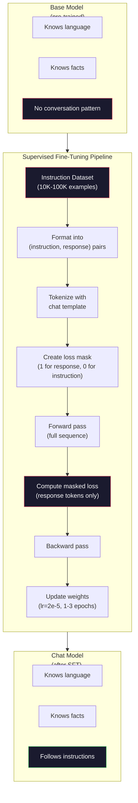

# التنسيق التعليمات (SFT)

> النموذج الأساسي 会预测下一个 Token──仅此而已── لن تتبع التعليمات、 لا تجيب على الأسئلة، ولا ترفض الطلبات الضارة──SFT هو برج بين النيازك 预测器和有用助手── كل نموذج سبق أن تحدثت معه -- كلود、GPT、Llama Chat -- 都经历过这个步骤──

**类型：**بناء
**语言：**بايثون (مع نومبي)
**前置要求：**المرحلة 10، الدروس 04 (التدريب المسبق لـ GPT الصغيرة)
**时间：**90 دقيقة

## 學习目标

- 实现 supervised fine-tuning (SFT) ،将基语言模型 转换为遵循指令的助手
- استخدام تتضمن نظام 、المستخدم و ‬المساعد ‬المصفحات الدردشة ‬التشكيل ‬التدريبات ‬المعلومات، ومع غير المساعد الـ Token ‬التحميل ‬الخسارة
- شرح لماذا SFT ضروري: النماذج الأساسية سوف تستمر في النص، بدلا من الإجابة على الأسئلة
- 通過 في الحفاظ على مجموعة التعليمات                                                                                                                                                                                                                                                          

## 问题

أنت في الدروس 04 تدرب على نموذج. أعطى سلسلة، يمكن أن تتوقع التوقيت التالي. إلى إدخال "بنية المعمار المحول"، فإنه قد يتابع إدخال "قامت بتغيير معالجة اللغة الطبيعية". بالنسبة لموقع التوقيت التالي، هذا قوي جدا.

现在试试这个:向它输入 "ما هي عاصمة فرنسا؟" النموذج الأساسي لن يجيب على "باريس". سوف يستمر هذا النموذج.

هذا هو الفرق بين نموذج GPT-3 ((مبدئي) ، 2020 سنة يونيو تموز) و ChatGPT ((معدل التعليمات، 2022 سنة 11 تموز) ، الهندسة المعمارية نفسها، والتموز المسبق لها، والفرق بين 20،000 إلى 100،000 个精心构建的 (تعليمات، ردود فعل) ، فهي تعلمت النموذج 遵循对话模式──

ستانفورد ألباكا ثبت أنك لا تحتاج إلى ملايين الأمثلة. في 3 مارس 2023، قاموا فقط باستخدام GPT-3.5 生成 52,000 إرشادات-رد على Llama 7B  إجراء ضبط جيد. التكلفة الإجمالية: 600 دولار.

في مرحلة SFT الاولى ، استخدم Meta Llama 2 Chat فقط حوالي 27،000 مثال عالية الجودة.

## 概念

### أيف تي  في الواقع فعل ماذا

تمت إشراف التنسيق الجيد 延续 نفس دورة التدريب في التدريب المسبق - المضي قدما مرور ‬خسارة الحساب ‬المرور الخلفي ‬وزن تحديث -- ولكن باستخدام نوع آخر من البيانات‬

```json
{
  "system": "You are a helpful assistant.",
  "user": "What is the capital of France?",
  "assistant": "The capital of France is Paris."
}
```

النموذج 已知道巴黎是法国的首都──它在维基百科、教材和网页上预训中学到了这一点──SFT ليس تعليم النموذج 新事实──它教学模型 一种新的*行为*: عندما ترى مشكلة، تولد إجابة── عندما ترى تعليمات، تولد إضافة── عندما ترى طلبات ضارة، تولد رفض──

يمكن فهم ذلك.

### أشكال البيانات

في الصناعة هناك ثلاثة أشكال رئيسية. كل أشكال ترميز نفس المعلومات.

**Alpaca Format**(ستانفورد، مارس 2023):

```json
{
  "instruction": "Summarize the following article in 3 sentences.",
  "input": "The European Central Bank raised interest rates...",
  "output": "The ECB increased rates by 25 basis points..."
}
```

简单且被广泛使用──`input`字段是可选的-- 许多指令不需要额外上下文── ستانفورد 发布了52,000 个这样的格式的例子,由GPT-3.5 以 600 美元成本生成──这开启了开源指令调节运动──

**ShareGPT Format**(المجتمع، 2023):

```json
{
  "conversations": [
    {"from": "system", "value": "You are a helpful assistant."},
    {"from": "human", "value": "What causes tides?"},
    {"from": "gpt", "value": "Tides are caused by the gravitational pull of the Moon..."},
    {"from": "human", "value": "How often do they occur?"},
    {"from": "gpt", "value": "Most coastal areas experience two high tides and two low tides per day..."}
  ]
}
```

支持多轮对话── حسب الممارسات، "من" 字段使用"人类" 和 "gpt",不管实际模型是什么──Vicuna 使用从用户共享的ChatGPT抄录中抓取的70,000条 ShareGPT 对话进行训练──

**ChatML Format**(OpenAI، يستخدمها العديد من نماذج المصدر المفتوح):

```
<|im_start|>system
You are a helpful assistant.<|im_end|>
<|im_start|>user
What is the capital of France?<|im_end|>
<|im_start|>assistant
The capital of France is Paris.<|im_end|>
```

استخدام خاصة رمز`<|im_start|>`.`<|im_end|>`(→ مقالات مختلفة)

ثلاث أنماط تحقق نفس الشيء: فهي تخبر النموذج  هي التعليم، هذا الرد، تعلم هذا النموذج‬‬‬‬‬‬‬‬‬‬‬‬‬‬‬‬‬‬‬‬‬‬‬‬‬‬‬‬‬‬‬‬‬‬‬‬‬‬‬‬‬‬‬‬‬‬‬‬‬‬‬‬‬‬‬‬‬‬‬‬‬‬‬‬‬‬‬‬‬‬‬‬‬‬‬‬‬‬‬‬‬‬‬‬‬‬‬‬‬‬‬‬‬‬‬‬‬‬‬‬‬‬‬‬‬‬‬‬‬‬‬‬‬‬‬‬‬‬‬‬‬‬‬‬‬‬‬‬‬‬‬‬‬‬‬‬‬‬‬‬‬‬‬‬‬‬‬‬‬‬‬‬‬‬‬‬‬‬‬‬‬‬‬‬‬‬‬‬‬‬‬‬‬‬‬‬‬‬‬‬‬‬‬‬‬‬‬‬‬‬‬‬‬‬‬‬‬‬‬‬‬‬‬‬‬‬‬‬‬‬‬‬‬‬‬‬‬‬‬‬‬‬‬‬‬‬‬‬‬‬‬‬‬‬‬‬‬‬‬‬‬‬‬‬‬‬‬‬‬‬‬‬‬‬‬‬‬‬‬‬‬‬‬‬‬‬‬‬‬‬‬‬‬‬‬‬‬‬‬‬‬‬‬‬‬‬‬‬‬‬‬‬‬‬‬‬‬‬‬‬‬‬‬‬‬‬‬‬‬‬‬‬‬‬‬‬‬‬‬‬‬‬‬‬‬‬‬‬‬‬‬‬‬‬‬‬‬‬‬‬‬‬‬‬‬‬‬‬‬‬‬‬‬‬‬‬‬‬‬‬‬‬‬‬‬‬‬‬‬‬‬‬‬‬‬‬‬‬‬‬‬‬‬‬‬‬‬‬‬‬‬‬‬‬‬‬‬‬‬‬‬‬‬‬‬‬‬‬‬‬‬‬‬‬‬‬‬‬‬‬‬‬‬‬‬‬‬‬‬‬‬‬‬‬‬‬‬‬‬‬‬‬‬‬‬‬‬‬‬‬‬‬‬‬‬‬‬‬‬‬‬‬‬‬‬‬‬‬‬‬‬‬‬‬‬‬‬‬‬

### لماذا هو فعال

النموذج 已从预训练中学会了语言──它见了数十亿问题后跟答案、命令后跟补,以及示例人与人对话──这些模式已编码在重中──

سوف تقوم SFT بتركيز هذه القدرة المحتملة. سوف تتعلم: عندما ترى علامة دور مساعد، سوف تولد ردود فعل مفيدة.

هذا هو السبب في أن 27000 مثال كافٍ. أنت لست في تعليم نموذج اللغة الإنجليزية. أنت لست في تعليمها حقيقة حول العالم. أنت تدريسها طريقة بسيطة:

### الخسارة المغطاة

هذا هو أهم التفاصيل التقنية في SFT، ومعظم التعليمات سوف تتجاوزها.

خلال فترة التدريب المسبق، سوف تتعامل مع كل رمز  حساب الخسارة. في فترة التدريب المسبق، سوف تتعامل مع كل رمز التوقيت التالي في فترة التدريب المسبق. في فترة التدريب المسبق، سوف تتعامل مع كل رمز التوقيت التوقيت التالي فقط.

لماذا؟ لأنك لا تريد أن تكون نموذجية 学会*生成*指令──你希望它学会*响应*指令── إذا كنت تتعامل مع التعليمات Token 计算 Loss، فأنت في نموذج التدريب 预测 "ما هي عاصمة فرنسا؟"، كأنّها فقط هي المسئولة── هذا سيضيع إشارة تدريجيّة،并可能让模型产生混‬‬‬‬‬‬‬‬‬‬‬‬‬‬‬‬‬‬‬‬‬‬‬‬‬‬‬‬‬‬‬‬‬‬‬‬‬‬‬‬‬‬‬‬‬‬‬‬‬‬‬‬‬‬‬‬‬‬‬‬‬‬‬‬‬‬‬‬‬‬‬‬‬‬‬‬‬‬‬‬‬‬‬‬‬‬‬‬‬‬‬‬‬‬‬‬‬‬‬‬‬‬‬‬‬‬‬‬‬‬‬‬‬‬‬‬‬‬‬‬‬‬‬‬‬‬‬‬‬‬‬‬‬‬‬‬‬‬‬‬‬‬‬‬‬‬‬‬‬‬‬‬‬‬‬‬‬‬‬‬‬‬‬‬‬‬‬‬‬‬‬‬‬‬‬‬‬‬‬‬‬‬‬‬‬‬‬‬‬‬‬‬‬‬‬‬‬‬‬‬‬‬‬‬‬‬‬‬‬‬‬‬‬‬‬‬‬‬‬‬‬‬‬‬‬‬‬‬‬‬‬‬‬‬‬‬‬‬‬‬‬‬‬‬‬‬‬‬‬‬‬‬‬‬‬‬‬‬‬‬‬‬‬‬‬‬‬‬‬‬‬‬‬‬‬‬‬‬‬‬‬‬‬‬‬‬‬‬‬‬‬‬‬‬‬‬‬‬‬‬‬‬‬‬‬‬‬‬‬‬‬‬‬‬‬‬‬‬‬‬‬‬‬‬‬‬‬‬‬‬‬‬‬‬‬‬‬‬‬‬‬‬‬‬‬‬‬‬‬‬‬‬‬‬‬‬‬‬‬‬‬‬‬‬‬‬‬‬‬‬‬‬‬‬‬‬‬‬‬‬‬‬‬‬‬‬‬‬‬‬‬‬‬‬‬‬‬‬‬‬‬‬‬‬‬‬‬‬‬‬‬

في الممارسة، سوف تقوم بإنشاء قناع الخسارة: رمز الإجابة = 1, رمز التعليمات = 0 ∼ في المعتاد، سوف تخسر كل رمز ∼ ضرب هذا القناع

```
Tokens:    [SYS] You are helpful [USER] What is the capital? [ASST] Paris is the capital [EOS]
Loss mask:   0    0    0     0      0     0   0  0     0       1     1    1   1     1      1
```

فقط`[ASST]`后后的Token 会贡献 Loss──模型 在前进传递期间将看到完整对话(它需要指令 才能产生正确反应),但只根据它的预测反应的效果来更新重量──

### 訓練 المعلمات

استخدام المعلمات المفرطة في SFT مختلفة تماما عن التدريب المسبق. أنت لست من التدريب. أنت تقوم بتعديل نموذج قادر على العمل.

| Parameter | Pre-Training (Llama 2 7B) | SFT (Llama 2 Chat) |
|-----------|---------------------------|---------------------|
| Learning rate | 3e-4 (peak) | 2e-5 |
| Epochs | 1（单次遍历数据） | 2 |
| Batch size | 4M tokens | 64 examples |
| Warmup steps | 2,000 | 0-100 |
| Weight decay | 0.1 | 0.0-0.1 |
| Data size | 2T tokens | 27,000 examples |

معدل التعلم في SFT 低 15 倍── هذا أمر مهم جدا──عدد التعلم المرتفع خلال التنسيق الجيد  会破坏 المعرفه المسبقة التدريب──نموذج 会忘记所学到的内容,并超适到小型精细调数据集 上──这是灾难性忘记──

فترة ما تعني نموذج سوف ترى كل مثال من التدريب مرتين. في مجموعة بيانات صغيرة أكثر من ثلاث فترات سوف يؤدي إلى التذكر.

### النسيان الكارثي

التنسيق الدقيق قد يضر بالقدرة العامة على التدريب على البيانات في اتباع التعليمات لفترة طويلة جدا، قد يفقد النموذج القدرة على كتابة الكود، أو القيام بالرياضيات أو إنتاج نصات إبداعية.

ثلاث أشكال:

1. **低 learning rate。**1e-5 إلى 5e-5.. ..التحديثات الصغيرة تعني انخفاض في التدمير للميزات المسبقة للتدريب

2. **短训练。**1-3 دورات.

3. **混入 pre-training 数据。**Llama 2 Chat 将一小部分(2-5%) أصل بيانات ما قبل التدريب المشتركة في مجموعة بيانات SFT.

### رقم حقيقي

في 10،000 زوج تعليمات عالية الجودة على تحديد النمط واحد 7B، باستخدام واحد NVIDIA A100 80GB GPU تقريبا تحتاج 1 ساعة.

- 10،000 مثال x 平均 512 رموز = 5.12M رموز
- 2 دور =  إجمالي 10.24M الرموز
- A100 على 7B نموذج التنسيق الدقيق: ~ 3000 رموز / ثانية
- 10.24M / 3000 = ~ 3,400 ثانية = ~ 57 دقيقة

بالنسبة لـ GPT الخاص بنا (4 طبقات، 128 درجة) ، التدريب هو تقريباً فوري.




```figure
loss-masking
```

## الإنشاء

### الخطوة 1: مجموعة بيانات التعليمات

إنشاء مجموعة بيانات تعليمات مركبة. في بيئة الإنتاج، تستخدم شركات مثل AI و Anthropic كعلامات إضافية لتكوين هذه البيانات.

```python
import numpy as np

INSTRUCTION_DATA = [
    {
        "instruction": "What is the capital of France?",
        "response": "The capital of France is Paris."
    },
    {
        "instruction": "Explain gravity in one sentence.",
        "response": "Gravity is the force that attracts objects with mass toward each other."
    },
    {
        "instruction": "Write a haiku about the ocean.",
        "response": "Waves crash on the shore, salt and foam beneath the sun, endless blue expanse."
    },
    {
        "instruction": "What is 15 multiplied by 7?",
        "response": "15 multiplied by 7 is 105."
    },
    {
        "instruction": "Name three programming languages.",
        "response": "Three programming languages are Python, Rust, and TypeScript."
    },
    {
        "instruction": "Summarize photosynthesis.",
        "response": "Photosynthesis converts sunlight, water, and carbon dioxide into glucose and oxygen."
    },
    {
        "instruction": "What year did World War II end?",
        "response": "World War II ended in 1945."
    },
    {
        "instruction": "Define machine learning.",
        "response": "Machine learning is a field where algorithms learn patterns from data to make predictions."
    },
]
```

8 أمثلة قليلة جداً. ستانفورد ألباكا استخدمت 52 ألف. ولكن سواء كان لديك 8 أو 52 ألف، فإن الجهاز هو نفسه:

### 步骤 2: استخدام نموذج الدردشة  إجراء التوجيهية

 إشارة-رد فعل زوج  تحويل إلى مع علامات دور خاصة 序列  هذه العلامات  أخبر النموذج التعليمات في أين تنتهي، الرد من أين يبدأ‬

```python
SPECIAL_TOKENS = {
    "INST_START": 253,
    "INST_END": 254,
    "RESP_START": 255,
}


def tokenize_instruction_pair(instruction, response, vocab_size=256):
    inst_tokens = list(instruction.encode("utf-8"))
    resp_tokens = list(response.encode("utf-8"))

    inst_tokens = [min(t, vocab_size - 4) for t in inst_tokens]
    resp_tokens = [min(t, vocab_size - 4) for t in resp_tokens]

    tokens = (
        [SPECIAL_TOKENS["INST_START"]]
        + inst_tokens
        + [SPECIAL_TOKENS["INST_END"]]
        + [SPECIAL_TOKENS["RESP_START"]]
        + resp_tokens
    )

    return tokens


def create_loss_mask(tokens):
    mask = np.zeros(len(tokens), dtype=np.float32)
    in_response = False

    for i, token in enumerate(tokens):
        if token == SPECIAL_TOKENS["RESP_START"]:
            in_response = True
            continue
        if in_response:
            mask[i] = 1.0

    return mask
```

قناع الخسارة لعلامات التعليمات 全部为零, لعلامات الاستجابة 全部为一。`RESP_START`رمز قناع هو 0 لأنه هو منفصل، وليس جزء من الرد على المحتوى.

### الخطوة الثالثة: فقدان التقاطع المتداخل

標準交叉-entropy, ولكن ضربة خسارة نقابها.

```python
def masked_cross_entropy_loss(logits, targets, loss_mask):
    batch, seq_len, vocab_size = logits.shape
    logits_flat = logits.reshape(-1, vocab_size)
    targets_flat = targets.reshape(-1)
    mask_flat = loss_mask.reshape(-1)

    max_logits = logits_flat.max(axis=-1, keepdims=True)
    log_softmax = logits_flat - max_logits - np.log(
        np.exp(logits_flat - max_logits).sum(axis=-1, keepdims=True)
    )

    per_token_loss = -log_softmax[np.arange(len(targets_flat)), targets_flat]

    masked_loss = per_token_loss * mask_flat
    num_response_tokens = mask_flat.sum()
    if num_response_tokens == 0:
        return 0.0
    loss = masked_loss.sum() / num_response_tokens

    return loss
```

-أجل`num_response_tokens`، ليس`seq_len` إذا تمتزيل طول المسلسل العام، سيتم تقليل التعليمات 信号  إذا تمتزيل عدد رموز الإجابة يمكن أن يضمن أهمية طول التعليمات، أن وزن كل رموز الإجابة هو نفسه.

### الخطوة 4: دورة تدريب SFT

复用 Lesson 04 中的MiniGPT── تدريب دورة تبدو تقريبا مثل ما قبل التدريب، مجرد إضافة لتصميم التعليمات و خسارة مخفية──

```python
import sys
import os
sys.path.insert(0, os.path.join(os.path.dirname(__file__), "..", "..", "04-pre-training-mini-gpt", "code"))
from main import MiniGPT, LayerNorm, FeedForward, MultiHeadAttention, TransformerBlock, Embedding


def sft_train(model, dataset, num_epochs=2, lr=2e-5, seq_len=64):
    formatted_data = []
    for example in dataset:
        tokens = tokenize_instruction_pair(example["instruction"], example["response"])
        mask = create_loss_mask(tokens)
        formatted_data.append((tokens, mask))

    print(f"SFT Training: {len(formatted_data)} examples, {num_epochs} epochs, lr={lr}")
    print(f"Total tokens: {sum(len(t) for t, _ in formatted_data):,}")
    print()

    losses = []

    for epoch in range(num_epochs):
        epoch_loss = 0.0
        num_batches = 0

        indices = np.random.permutation(len(formatted_data))

        for idx in indices:
            tokens, mask = formatted_data[idx]

            if len(tokens) < 3:
                continue
            if len(tokens) > seq_len:
                tokens = tokens[:seq_len]
                mask = mask[:seq_len]

            input_ids = np.array(tokens[:-1]).reshape(1, -1)
            target_ids = np.array(tokens[1:]).reshape(1, -1)
            loss_mask = np.array(mask[1:]).reshape(1, -1)

            logits = model.forward(input_ids)
            loss = masked_cross_entropy_loss(logits, target_ids, loss_mask)

            batch_size, s_len, v_size = logits.shape
            probs = np.exp(logits - logits.max(axis=-1, keepdims=True))
            probs = probs / probs.sum(axis=-1, keepdims=True)
            dlogits = probs.copy()
            dlogits[np.arange(batch_size)[:, None], np.arange(s_len), target_ids] -= 1.0

            mask_expanded = loss_mask[:, :, np.newaxis]
            num_resp = loss_mask.sum()
            if num_resp > 0:
                dlogits = dlogits * mask_expanded / num_resp

            for block in model.blocks:
                block.ffn.W1 -= lr * np.random.randn(*block.ffn.W1.shape) * 0.01
                block.ffn.W2 -= lr * np.random.randn(*block.ffn.W2.shape) * 0.01
                block.ffn.b1 -= lr * np.random.randn(*block.ffn.b1.shape) * 0.01
                block.ffn.b2 -= lr * np.random.randn(*block.ffn.b2.shape) * 0.01

            epoch_loss += loss
            num_batches += 1
            losses.append(loss)

        avg_loss = epoch_loss / max(num_batches, 1)
        print(f"Epoch {epoch + 1}/{num_epochs} | Avg Loss: {avg_loss:.4f}")

    return model, losses
```

معدل التعلم هو 2e-5، مع Llama 2 Chat 匹配──将它与预训中使用的 3e-4 对比 -- 小 15 倍──Gradient 被面具:指令令令令 产生零 Gradient──只有响应令牌 推动权重──

### الخطوة 5: مقارنة النموذج الأساسي مع نموذج SFT

تعتمد معنى SFT على تغير السلوك. نحن من خلال نموذج التحقق كيفية الاستجابة للمدخولات المنسجة حسب التعليمات ومواصلات النص الخام لقياس هذا النقطة.

```python
def generate_response(model, prompt_tokens, max_new_tokens=50, temperature=0.8):
    tokens = list(prompt_tokens)
    seq_len = model.embedding.pos_embed.shape[0]

    for _ in range(max_new_tokens):
        context = np.array(tokens[-seq_len:]).reshape(1, -1)
        logits = model.forward(context)
        next_logits = logits[0, -1, :]

        next_logits = next_logits / max(temperature, 1e-8)
        probs = np.exp(next_logits - next_logits.max())
        probs = probs / probs.sum()
        probs = np.clip(probs, 1e-10, 1.0)
        probs = probs / probs.sum()

        next_token = np.random.choice(len(probs), p=probs)
        tokens.append(int(next_token))

    return tokens


def evaluate_instruction_following(model, instructions):
    print("Evaluating instruction following:")
    print("-" * 50)

    for instruction in instructions:
        tokens = (
            [SPECIAL_TOKENS["INST_START"]]
            + [min(t, 252) for t in list(instruction.encode("utf-8"))]
            + [SPECIAL_TOKENS["INST_END"]]
            + [SPECIAL_TOKENS["RESP_START"]]
        )

        output = generate_response(model, tokens, max_new_tokens=30, temperature=0.6)
        response_start = len(tokens)
        response_tokens = output[response_start:]
        response_bytes = bytes([t for t in response_tokens if t < 128])
        response_text = response_bytes.decode("utf-8", errors="replace")

        print(f"  Q: {instruction}")
        print(f"  A: {response_text[:80]}")
        print()
```

في نموذج صغير من 8 أمثلة فقط، لا يكون للرد على النحو العملي. هذا ما يُتوقع.

### الخطوة 6: قياس النسيان الكارثي

مقارنة SFT النموذج السابق والآخر التنبؤ التوقيت التالي                                                                                                                                                                                                                                                     

```python
def measure_forgetting(model, test_text, seq_len=64):
    tokens = np.array(list(test_text.encode("utf-8")[:512]))

    total_loss = 0.0
    num_windows = 0

    for start in range(0, len(tokens) - seq_len - 1, seq_len):
        input_ids = tokens[start:start + seq_len].reshape(1, -1)
        target_ids = tokens[start + 1:start + seq_len + 1].reshape(1, -1)

        logits = model.forward(input_ids)

        batch, s_len, vocab_size = logits.shape
        logits_flat = logits.reshape(-1, vocab_size)
        targets_flat = target_ids.reshape(-1)

        max_logits = logits_flat.max(axis=-1, keepdims=True)
        log_softmax = logits_flat - max_logits - np.log(
            np.exp(logits_flat - max_logits).sum(axis=-1, keepdims=True)
        )

        loss = -log_softmax[np.arange(len(targets_flat)), targets_flat].mean()
        total_loss += loss
        num_windows += 1

    return total_loss / max(num_windows, 1)
```

في التنسيق الحقيقي، سوف تتبع هذه المقاييس طوال عملية التدريب. إذا كان فقدان النص الخام يزيد عن 10 إلى 15٪، فهذا يعني أن SFT الخاص بك قد تمت تحسينه بشكل كبير.

## استخدام

### 完整 SFT خط أنابيب Demo

```python
if __name__ == "__main__":
    np.random.seed(42)

    test_text = """The transformer architecture processes sequences through self-attention.
Each layer applies multi-head attention followed by a feedforward network.
Residual connections and layer normalization stabilize deep networks.
The model learns to predict the next token given all previous tokens."""

    print("=" * 70)
    print("INSTRUCTION TUNING (SFT) DEMO")
    print("=" * 70)
    print()

    model = MiniGPT(
        vocab_size=256, embed_dim=128, num_heads=4,
        num_layers=4, max_seq_len=128, ff_dim=512
    )
    print(f"Model: {model.count_parameters():,} parameters")
    print(f"Config: 4 layers, 4 heads, 128 dims (mini GPT from Lesson 04)")
    print()

    print("PRE-SFT: Measuring base model loss on raw text")
    base_loss = measure_forgetting(model, test_text)
    print(f"  Base model loss: {base_loss:.4f}")
    print()

    print("=" * 70)
    print("SFT TRAINING")
    print("=" * 70)

    model, losses = sft_train(
        model, INSTRUCTION_DATA, num_epochs=3, lr=2e-5, seq_len=128
    )

    print()
    print("POST-SFT: Measuring fine-tuned model loss on raw text")
    sft_loss = measure_forgetting(model, test_text)
    print(f"  SFT model loss: {sft_loss:.4f}")
    print(f"  Change: {((sft_loss - base_loss) / base_loss * 100):+.1f}%")
    if abs(sft_loss - base_loss) / base_loss < 0.15:
        print("  Minimal forgetting (< 15% change)")
    else:
        print("  Significant forgetting detected")
    print()

    print("=" * 70)
    print("INSTRUCTION FOLLOWING EVALUATION")
    print("=" * 70)
    print()

    test_instructions = [
        "What is the capital of France?",
        "Name a programming language.",
        "Define gravity.",
    ]
    evaluate_instruction_following(model, test_instructions)

    print("=" * 70)
    print("DATA FORMAT EXAMPLES")
    print("=" * 70)
    print()

    for i, example in enumerate(INSTRUCTION_DATA[:3]):
        tokens = tokenize_instruction_pair(example["instruction"], example["response"])
        mask = create_loss_mask(tokens)
        resp_count = int(mask.sum())
        total_count = len(tokens)
        print(f"  Example {i + 1}: {total_count} tokens, {resp_count} response tokens ({resp_count/total_count:.0%} of sequence)")
        print(f"    Instruction: {example['instruction']}")
        print(f"    Response: {example['response']}")
        print()

    print("=" * 70)
    print("TRAINING LOSS CURVE")
    print("=" * 70)
    print()

    if losses:
        window = max(1, len(losses) // 5)
        for i in range(0, len(losses), window):
            chunk = losses[i:i + window]
            avg = sum(chunk) / len(chunk)
            print(f"  Steps {i:3d}-{i + len(chunk) - 1:3d}: avg loss = {avg:.4f}")
```

## 交付

本课会产出 `outputs/prompt-sft-data-curator.md`-- عرض، لمساعدتك على تصميم وتخطيط مجموعة بيانات تعليمات SFT.

## التدريب

1. إضافة نظام على الفور 支持──修改 `tokenize_instruction_pair`، فاعمل على قبول رسالة النظام،并将其放置 تعليمات 之前──创建 5 个带有不同系统提示("أنت شاعر"、"أنت معلم رياضيات") مثال،并验证模型 在训练期间会看到不同的系统提示──

2. 实现 data mixing──创建一个函数,接收一个SFT数据集 和一个原文体,然后生成训练批量,其中5% من الأمثلة هي النص الخام((无掩饰),95% هي زوجات التعليمات(掩饰)──运行 3 个时代,并将忘记指标与纯SFT训练 进行比较──

3. 构建数据质量评分器──对每个命令-响应对,计算:((a) طول الاستجابة في الرموز،(ب) نسبة التعليم إلى الاستجابة،(ج) تنوع المفردات(رموز فريدة / رموز إجمالية)──过掉响应长度 < 10 رموز أو تنوع < 0.3 ‬‬‬‬‬‬‬‬‬‬‬‬‬‬‬‬‬‬‬‬‬‬‬‬‬‬‬‬‬‬‬‬‬‬‬‬‬‬‬‬‬‬‬‬‬‬‬‬‬‬‬‬‬‬‬‬‬‬‬‬‬‬‬‬‬‬‬‬‬‬‬‬‬‬‬‬‬‬‬‬‬‬‬‬‬‬‬‬‬‬‬‬‬‬‬‬‬‬‬‬‬‬‬‬‬‬‬‬‬‬‬‬‬‬‬‬‬‬‬‬‬‬‬‬‬‬‬‬‬‬‬‬‬‬‬‬‬‬‬‬‬‬‬‬‬‬‬‬‬‬‬‬‬‬‬‬‬‬‬‬‬‬‬‬‬‬‬‬‬‬‬‬‬‬‬‬‬‬‬‬‬‬‬‬‬‬‬‬‬‬‬‬‬‬‬‬‬‬‬‬‬‬‬‬‬‬‬‬‬‬‬‬‬‬‬‬‬‬‬‬‬‬‬‬‬‬‬‬‬‬‬‬‬‬‬‬‬‬‬‬‬‬‬‬‬‬‬‬‬‬‬‬‬‬‬‬‬‬‬‬‬‬‬‬‬‬‬‬‬‬‬‬‬‬‬‬‬‬‬‬‬‬‬‬‬‬‬‬‬‬‬‬‬‬‬‬‬‬‬‬‬‬‬‬‬‬‬‬‬‬‬‬‬‬‬‬‬‬‬‬‬‬‬‬‬‬‬‬‬‬‬‬‬‬‬‬‬‬‬‬‬‬‬‬‬‬‬‬‬‬‬‬‬‬‬‬‬‬‬‬‬‬‬‬‬‬‬‬‬‬‬‬‬‬‬‬‬‬‬‬‬‬‬‬‬‬‬‬‬‬‬‬‬‬‬‬‬‬‬‬‬‬‬‬‬‬‬‬‬‬‬‬‬‬‬‬‬‬‬‬‬‬‬‬‬‬

4. 实现多轮对话培训──扩展代码化,使其处理3轮对话(用户助理-用户助理-用户助理)──损失面具 应覆盖全部三个助理转──通过打印一个示例的代码面具配合 来验证面具 是否正确──

5. مقارنة معدلات التعلم── باستخدام lr=1e-4、lr=2e-5 和 lr=1e-6 分別訓練同一模型 三次── رسم منحنى الخسارة──1e-4 运行应显示快速初始下降但最终 Loss 更高(overfitting)──1e-6 运行应几乎没有变化──2e-5 运行应是最佳点──

## 关键术语

| Term | 常见说法 | 实际含义 |
|------|----------------|----------------------|
| SFT | “在对话上 fine-tuning” | Supervised Fine-Tuning：在 (instruction, response) pairs 上继续训练，并且只对 response Token 计算 Loss |
| Instruction tuning | “教 model 遵循指令” | 在显式 instruction-response pairs 上训练，使 base model 学会对话模式，而不是新知识 |
| Loss masking | “忽略 prompt” | 将 instruction Token 的 Loss 设为零，使 Gradient 只来自 response Token 预测 |
| ChatML | “Chat Markup Language” | 一种 Token 格式，使用 `<\|im_start\|>` 和 `<\|im_end\|>` 分隔符标记 conversation data 中的说话者角色 |
| Alpaca format | “Stanford 的格式” | 一种包含 instruction/input/output 字段的 JSON 格式，用于 52K 个由 GPT-3.5 生成、成本为 600 美元的示例 |
| Catastrophic forgetting | “model 变笨了” | Fine-tuning 会破坏 pre-trained capabilities，因为 Gradient 更新会用 task-specific patterns 覆盖 general knowledge |
| Weight tying | “共享 Embeddings” | 对 input Token Embeddings 和 output prediction head 使用同一个 Matrix，从而节省参数并提升一致性 |
| Chat template | “prompt 的格式化方式” | 用于为 model 结构化对话的特定 Token 序列（role markers、delimiters） |

## 延伸阅读

- [Ouyang et al., 2022 -- "Training language models to follow instructions with human feedback" (InstructGPT)](https://arxiv.org/abs/2203.02155)-- 在 OpenAI 引入 التعليمات ضبط + RLHF 的论文
- [Taori et al., 2023 -- "Stanford Alpaca: An Instruction-following LLaMA Model"](https://github.com/tatsu-lab/stanford_alpaca)-- باستخدام 600 美元 المنتجة 52K أمثلة التعليمات، إثبات SFT في مجموعة بيانات صغيرة أيضا فعالة
- [Touvron et al., 2023 -- "Llama 2: Open Foundation and Fine-Tuned Chat Models"](https://arxiv.org/abs/2307.09288)-- Meta استخدام 27K نموذج عالي الجودة SFT + RLHF خط الأنابيب
- [Chiang et al., 2023 -- "Vicuna: An Open-Source Chatbot Impressing GPT-4"](https://lmsys.org/blog/2023-03-30-vicuna/)-- في 70K ShareGPT محادثات على التدريب
- [Zhou et al., 2023 -- "LIMA: Less Is More for Alignment"](https://arxiv.org/abs/2305.11206)-- ثبت أن 1000 مثال من التخطيط الدقيق يمكن أن يتناسب مع SFT على مجموعة بيانات أكبر
