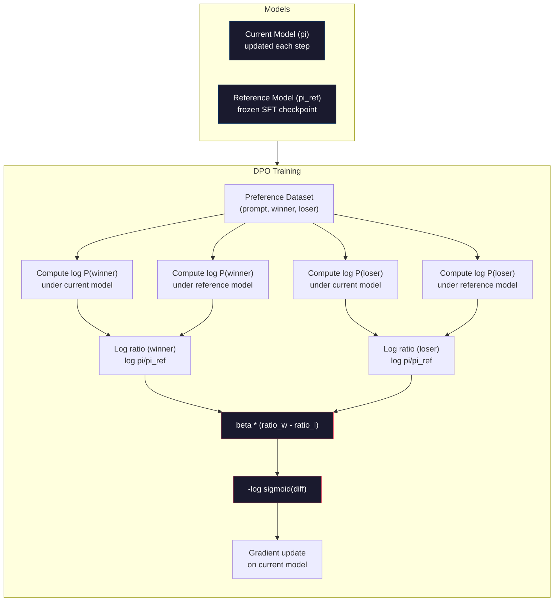

# DPO: تحسين التفضيلات المباشرة

> RLHF 有效──但它也需要训练三个模型(SFT、奖励模型、政策),管理 PPO 的不稳定性,并调节 KL penalty──DPO 会问: إذا كنت تستطيع القفز على كل هذا呢?DPO 直接在偏好对上优化语言模型──不需要奖励模型──不需要 PPO──一个训练循环──相同的结果──

**Type:** Build
**Languages:** Python (with numpy)
**Prerequisites:** Phase 10, Lesson 07 (RLHF)
**Time:** ~90 分钟

## 學习目标
- 实现 DPO التدريب، مباشرة في أزواج الاختيارات 上优化语言模型، دون استخدام نموذج مكافأة منفصل
- 推导 DPO خسارة وظيفة،并解释 كيفية تمريرها من خلال سياسة من السجل من احتمالات 隐式表示奖励模型
- من زاوية التدريب الاستقرار، وتكلفة الحساب والكثير من النماذج المطلوبة مقارنة DPO مع RLHF
- 调节 بيتا 参数,控制训练后的政策 偏离参考模型的程度

## 问题
أنت في الدروس 07 بناء خط أنابيب RLHF. ♫ ثلاث مراحل ♫ ثلاثة نماذج. ♫ نموذج SFT. ♫ نموذج مكافأة. ♫ وذلك باستخدام نموذج سياسة تحسين PPO. ♫ نموذج مكافأة فقط يحتاج إلى آلاف الأزواج من الفردات و حلقة تدريبية منفصلة. ♫PPO. ♫ يحتاج إلى تحديد معدل KL. ♫ معدل التعلم. ♫ نسبة المقاطع. ♫ عدد العصور. ♫

في الممارسة العملية، تدريب الـPPO 以不稳定著称──很小的超参数 变化就可能导致 تدريب انتشار──模式奖励是人类偏好的不完美代理,而政策会找到利用其弱点的方式──KL عقوبة 有帮助,但它本身也需要调节:

هذا التعقيد يفسر لماذا في السنوات القليلة التي سبقت إصدار InstructGPT ، كان معظم نماذج المصدر المفتوح صعباً في استخدام RLHF.

2023 年 5 月، رافائيل رافائيلوف ‬أرشيت شرما ‬ وزملاء نشرت تحسين التفضيلات المباشرة: نموذج لغتك هو سرا نموذج مكافأة‬‬‬‬‬‬‬‬‬‬‬‬‬‬‬‬‬‬‬‬‬‬‬‬‬‬‬‬‬‬‬‬‬‬‬‬‬‬‬‬‬‬‬‬‬‬‬‬‬‬‬‬‬‬‬‬‬‬‬‬‬‬‬‬‬‬‬‬‬‬‬‬‬‬‬‬‬‬‬‬‬‬‬‬‬‬‬‬‬‬‬‬‬‬‬‬‬‬‬‬‬‬‬‬‬‬‬‬‬‬‬‬‬‬‬‬‬‬‬‬‬‬‬‬‬‬‬‬‬‬‬‬‬‬‬‬‬‬‬‬‬‬‬‬‬‬‬‬‬‬‬‬‬‬‬‬‬‬‬‬‬‬‬‬‬‬‬‬‬‬‬‬‬‬‬‬‬‬‬‬‬‬‬‬‬‬‬‬‬‬‬‬‬‬‬‬‬‬‬‬‬‬‬‬‬‬‬‬‬‬‬‬‬‬‬‬‬‬‬‬‬‬‬‬‬‬‬‬‬‬‬‬‬‬‬‬‬‬‬‬‬‬‬‬‬‬‬‬‬‬‬‬‬‬‬‬‬‬‬‬‬‬‬‬‬‬‬‬‬‬‬‬‬‬‬‬‬‬‬‬‬‬‬‬‬‬‬‬‬‬‬‬‬‬‬‬‬‬‬‬‬‬‬‬‬‬‬‬‬‬‬‬‬‬‬‬‬‬‬‬‬‬‬‬‬‬‬‬‬‬‬‬‬‬‬‬‬‬‬‬‬‬‬‬‬‬‬‬‬‬‬‬‬‬‬‬‬‬‬‬‬‬‬‬‬‬‬‬‬‬‬‬‬‬‬‬‬‬‬‬‬‬‬‬‬‬‬‬‬‬‬‬‬‬‬‬‬‬‬‬‬‬‬‬‬‬‬‬‬‬‬‬‬‬‬‬‬‬‬‬‬‬‬‬‬‬‬‬‬‬‬‬‬‬‬‬‬‬‬‬‬‬‬‬‬‬‬‬‬‬‬‬‬‬‬

DPO سوف يسهل RLHF إلى خطوة تعلم مرئية 步骤――模型――a Loss Function――a Training loop―― بدون تعزيز التعلم──Zephyr-7B هو واحد من أوائل نماذج DPO التي تستخدم على نطاق واسع ، في العديد من المعايير المرجعية 追平 أو تجاوزت مع كامل RLHF 训练模型──Meta في خط الأنابيب التوجه للاما 3 استخدم DPO──Anthropic أيضا في أبحاث التوجه ذكر في أكثر من DPO 风格──

## 概念
### البصيرة الرئيسية

RLHF 优化 هذا الهدف:

```
maximize: E[R(x, y)] - beta * KL(pi || pi_ref)
```

ومن بينها R هو نموذج الجائزة، pi هو السياسة، pi_ref هو نموذج المرجع، beta هو معدل KL。

ورقة DPO  اثبات، هذا الهدف وجود مغلقة أفضل حل.

```
pi*(y | x) = pi_ref(y | x) * exp(R(x, y) / beta) / Z(x)
```

من بينها Z(x) هو إعادة التكوين العادي.

```
R(x, y) = beta * log(pi*(y | x) / pi_ref(y | x)) + beta * log Z(x)
```

هذا هو نقطة فصيلة. المكافأة تظهر بشكل كامل باستخدام نموذج السياسة والاحتمالات نموذج المرجح.

استبدالها في نموذج تفضيل برادلي تيري:

```
P(y_w > y_l | x) = sigmoid(R(x, y_w) - R(x, y_l))
                  = sigmoid(beta * (log pi(y_w|x)/pi_ref(y_w|x) - log pi(y_l|x)/pi_ref(y_l|x)))
```

Z(x) 项会抵消, لأن الردان هما في نفس اللمسة x 为条件――剩下的只是 النموذج السياسي و النموذج المرجعي في الردان المفضل والرفض أعلى من وظيفة الاحتمالات السجلية――

### خسارة الـ DPO

```
L_DPO = -log(sigmoid(beta * (log pi(y_w|x)/pi_ref(y_w|x) - log pi(y_l|x)/pi_ref(y_l|x))))
```

نحن نُفكّر كل جزء:

- **y_w**= الرد المفضل
- **y_l**= رد
- **x**= سريع
- **pi**= 当前模型(正在训练)
- **pi_ref**= نموذج مرجع ((结 من نقطة تفتيش SFT)
- **beta**= 控制偏离 度温 参数(عادة ما تكون 0.1 إلى 0.5)

比值 `log pi(y|x) / pi_ref(y|x)`هو نسبة الاحتمالات السجلية. عندما يكون هذا النسبة صحيحاً، فإن احتمالية إعطاء النموذج الحالي للرد على y أعلى من الإشارة.

DPO Loss سوف يحفز النموذج لزيادة نسبة احتمالية السجل للردود المفضلة،并 يقلل نسبة احتمالية السجل للردود المرفوضة.



### لماذا DPO أبسط

| Aspect | RLHF (PPO) | DPO |
|--------|-----------|-----|
| 需要训练的模型 | 3（SFT + reward + policy） | 1（仅 policy） |
| Training loops | 3（SFT、RM training、PPO） | 2（SFT、DPO） |
| Hyperparameters | lr、KL coeff、clip ratio、RM lr、epochs x3 | lr、beta、epochs |
| Reward model | 必需（单独训练） | 隐式存在于模型概率中 |
| RL algorithm | PPO（复杂、不稳定） | Supervised learning（稳定） |
| GPU memory | PPO 期间内存中有 3-4 个模型 | 2 个模型（current + reference） |
| 训练稳定性 | 对 hyperparameters 敏感 | 稳健，类似 SFT |

تحتاج تدريب DPO إلى وضع نموذجين في الذاكرة: النموذج الحالي والإشارة.

### عندما يضرب الـ DPO RLHF

**小数据集。**في حجم 5,000-20,000 زوج تفضيل، عادة ما يمكن أن تتساوى أو تتجاوز نموذج مكافأة RLHF.

**计算资源有限。**DPO فقط تحتاج إلى كامل RLHF 大约三分之一的计算量(حلقة تدريبية واحدة ، وليس ثلاثة) 

**快速迭代。**想尝试 10 مجموعات بيانات تفضيل مختلفة، انظروا من يمكن أن تنتج أفضل نموذج؟

### عندما يضرب RLHF DPO

**大规模训练。**على نطاق GPT-4 أو Claude، يمكن أن يستوعب نموذج مكافأة فردية RLHF إشارات تفضيل أكثر تفاصيلًا.

**复杂 reward signals。**عندما يتعلق الأمر بـ+أكثر من بُعد أبعاد (المساعدة،العدم الضرر،الصدق) ، يمكن تعلم نموذج الجوائز مثل هذا الوزن المتعدد الأهداف.

**迭代式 alignment。**يمكن أن تستخدم خطوط أنابيب RLHF السياسة الحالية لتوليد استجابات جديدة ، والقيام بقياسات البشر ، ثم إعادة تدريب نموذج مكافأة في دورة عبر الإنترنت.

### دبو  خارج: كتو، أوربو، سيمبو

بدأ دبي سلسلة من أساليب التوجه المبسطة

**KTO (Kahneman-Tversky Optimization, 2024)：**أنت حتى لا تحتاج إلى أن تكون على البيانات. استخدام KTO لا يصل إلى النضال: فقط تحتاج إلى وضع علامة على كل رد فعل على  جيد أو  سيء، و لا حاجة إلى مقارنته مع شيء بديل آخر. هذا يسهل بشكل كبير جمع البيانات. ليس إلى المشاركين عرض اثنين من الردود و تسأل  أفضل؟، ولكن عرض رد و تسأل  هذا جيد؟ الخسارة وظيفة  تطبيق في نظرية المواجهة المقبلة فقدان العنف: ردود سيئة تعرض للعقاب أكبر من ردود جيدة  الحصول على مكافأة.

**ORPO (Odds Ratio Preference Optimization, 2024)：**لن يقوم SFT و التوجه إلى خطوة تدريبية. ORPO ليس أولاً بفعل SFT و إعادة بذل DPO، بل يقوم بتعديل SFT Loss، مما يضمن إشارة تفضيل.

**SimPO (Simple Preference Optimization, 2024)：**完全 إزالة نموذج المرجعية. ‬‬‬‬‬‬‬‬‬‬‬‬‬‬‬‬‬‬‬‬‬‬‬‬‬‬‬‬‬‬‬‬‬‬‬‬‬‬‬‬‬‬‬‬‬‬‬‬‬‬‬‬‬‬‬‬‬‬‬‬‬‬‬‬‬‬‬‬‬‬‬‬‬‬‬‬‬‬‬‬‬‬‬‬‬‬‬‬‬‬‬‬‬‬‬‬‬‬‬‬‬‬‬‬‬‬‬‬‬‬‬‬‬‬‬‬‬‬‬‬‬‬‬‬‬‬‬‬‬‬‬‬‬‬‬‬‬‬‬‬‬‬‬‬‬‬‬‬‬‬‬‬‬‬‬‬‬‬‬‬‬‬‬‬‬‬‬‬‬‬‬‬‬‬‬‬‬‬‬‬‬‬‬‬‬‬‬‬‬‬‬‬‬‬‬‬‬‬‬‬‬‬‬‬‬‬‬‬‬‬‬‬‬‬‬‬‬‬‬‬‬‬‬‬‬‬‬‬‬‬‬‬‬‬‬‬‬‬‬‬‬‬‬‬‬‬‬‬‬‬‬‬‬‬‬‬‬‬‬‬‬‬‬‬‬‬‬‬‬‬‬‬‬‬‬‬‬‬‬‬‬‬‬‬‬‬‬‬‬‬‬‬‬‬‬‬‬‬‬‬‬‬‬‬‬‬‬‬‬‬‬‬‬‬‬‬‬‬‬‬‬‬‬‬‬‬‬‬‬‬‬‬‬‬‬‬‬‬‬‬‬‬‬‬‬‬‬‬‬‬‬‬‬‬‬‬‬‬‬‬‬‬‬‬‬‬‬‬‬‬‬‬‬‬‬‬‬‬‬‬‬‬‬‬‬‬‬‬‬‬‬‬‬‬‬‬‬‬‬‬‬‬‬‬‬‬‬‬‬‬‬‬‬‬‬‬‬‬‬‬‬‬‬‬‬‬‬‬‬‬‬‬‬‬‬‬‬‬‬‬‬‬‬‬‬‬‬‬‬‬‬‬‬‬‬‬‬‬‬‬‬‬‬‬‬‬‬‬‬‬‬‬‬‬‬‬‬‬‬‬‬‬‬‬‬‬‬‬‬‬‬‬‬‬‬‬‬

| Method | Year | Models in Memory | Needs Pairs? | Needs Reference? | Training Loops |
|--------|------|-----------------|-------------|-----------------|----------------|
| RLHF | 2022 | 3-4 | Yes（用于 RM） | Yes | 3 |
| DPO | 2023 | 2 | Yes | Yes | 2 |
| KTO | 2024 | 2 | No（未配对） | Yes | 2 |
| ORPO | 2024 | 1 | Yes | No | 1 |
| SimPO | 2024 | 1 | Yes | No | 1 |

التوجه واضح جدا: كل طريقة تخلص من جزء من التعقيدات. . . . . . . . . . . . . . . . . . . . . . . . . . . . . . . . . . . . . . . . . . . . . . . . . . . . . . . . . . . . . . . . . . . . . . . . . . . . . . . . . . . . . . . . . . . . . . . . . . . . . . . . . . . . . . . . . . . . . . . . . . . . . . . . . . . . . . . . . . . . . . . . . . . . . . . . . . . . . . . . . . . . . . . . . . . . . . . . . . . . . . . . . . . . . . . . . . . . . . . . . . . . . . . . . . . . . . . . . . . . . . . . . . . . . . . . . . . . . . . . . . . . . . . . . . . . . . . . . . . . . . . . . . . . . . . . . . . . . . . . . . . . . . . . . . . . . . . . . . . . . . . . . . . . . . . . . . . . . . . . . . . . . . . . . . . . . . . . . . . . . . . . . . . . . . . . . . . . . . . . . . . . . . . . . . . . . . . . . . . . . . . . . . . . . . . . . . . . . . . . . . . . . . . . . . . . . . . . . . . . . . . . . . . . . . . . . . . . . . . . . . . . . . . . . . . . . . . . . . . . . . . . . . . . . . . . . . . . . . . . . . . . . . . . . . . . .

### عمليات تنفيذ الجهاز

**Zephyr-7B (HuggingFace, October 2023)：**على أساس Mistral 7B على أساس، على UltraChat ((200K مثالات) القيام SFT، ثم على UltraFeedback ((60K زوجات تفضيل) على القيام DPO. على MT-Bench على النتيجة 6.47, هو أعلى عند ذلك الحين 7B  نموذج.

**Llama 3 (Meta, April 2024)：**في مرحلة RLHF الاولى بعد استخدام DPO. هذا المكون يظهر DPO و RLHF يمكن أن يضاف: RLHF يستخدم للتحديد الواسع، DPO يستخدم للتحسين المستهدف.

**Neural Magic / nm-chat (2024)：**ويتم تطبيق DPO على العديد من نماذج مفتوحة المصدر، ويتم إظهارها بشكل ثابت على مقارنة فقط مع خط الأساس SFT في معايير التوجه فوق 5-15% من التحسن.


```figure
dpo-loss
```

## بناءها
### الخطوة 1: مجموعة بيانات تفضيل

مع RLHF استخدام نفس النموذج: ((مسرع، يفضل، يرفض) 三元组──DPO 直接消费这些数据,不需要中间的奖励模型──

```python
import numpy as np
import sys
import os
sys.path.insert(0, os.path.join(os.path.dirname(__file__), "..", "..", "04-pre-training-mini-gpt", "code"))
from main import MiniGPT, LayerNorm, Embedding, TransformerBlock

PREFERENCE_DATA = [
    {
        "prompt": "What is the capital of France?",
        "preferred": "The capital of France is Paris.",
        "rejected": "France is a country in Europe. It has many cities. The capital is Paris. Paris is known for the Eiffel Tower.",
    },
    {
        "prompt": "Explain gravity in one sentence.",
        "preferred": "Gravity is the force that attracts objects with mass toward each other.",
        "rejected": "Gravity is something that makes things fall down when you drop them.",
    },
    {
        "prompt": "What is 15 times 7?",
        "preferred": "15 times 7 is 105.",
        "rejected": "Let me think about this. 15 times 7. Well, 10 times 7 is 70, and 5 times 7 is 35, so the answer might be around 105.",
    },
    {
        "prompt": "Name three programming languages.",
        "preferred": "Python, Rust, and TypeScript.",
        "rejected": "There are many programming languages. Some popular ones include various languages like Python and others.",
    },
    {
        "prompt": "What year did World War II end?",
        "preferred": "World War II ended in 1945.",
        "rejected": "World War II was a major global conflict. It involved many countries. The war ended in the mid-1940s, specifically in 1945.",
    },
    {
        "prompt": "Define machine learning.",
        "preferred": "Machine learning is a field where algorithms learn patterns from data to make predictions without being explicitly programmed.",
        "rejected": "Machine learning is a type of AI. AI stands for artificial intelligence. Machine learning uses data to learn.",
    },
]
```

### 步骤 2: سجل التسلسل احتمالية

خسارة DPO 需要计算给定提示 时某个响应的总日记概率──这意味着要在完整的(快速 +响应)序列上运行模型,并对每个响应代币的日记概率 求和──

```python
def tokenize_sequence(text, vocab_size=256):
    return [min(t, vocab_size - 1) for t in list(text.encode("utf-8"))]


def compute_sequence_log_prob(model, prompt_tokens, response_tokens, max_seq_len=128):
    full_sequence = prompt_tokens + response_tokens
    if len(full_sequence) > max_seq_len:
        full_sequence = full_sequence[:max_seq_len]

    if len(full_sequence) < 2:
        return 0.0

    input_ids = np.array(full_sequence[:-1]).reshape(1, -1)
    target_ids = np.array(full_sequence[1:])

    logits = model.forward(input_ids)
    logits = logits[0]

    max_logits = logits.max(axis=-1, keepdims=True)
    log_probs = logits - max_logits - np.log(
        np.exp(logits - max_logits).sum(axis=-1, keepdims=True)
    )

    prompt_len = len(prompt_tokens)
    response_start = max(0, prompt_len - 1)
    response_end = len(target_ids)

    if response_start >= response_end:
        return 0.0

    response_log_probs = log_probs[response_start:response_end, :]
    response_targets = target_ids[response_start:response_end]

    total_log_prob = 0.0
    for i, target in enumerate(response_targets):
        total_log_prob += response_log_probs[i, target]

    return total_log_prob
```

هذه الوظيفة هي أداة أساسية لـ DPO. مقابل كل زوج تفضيل، فإنها تعمل أربع مرات: النموذج 计算 الرد المفضّل، النموذج 计算 الرد المرفوض، المرجع 计算 الرد المفضّل، المرجع 计算 الرد المرفوض، المرجع 计算 الرد المرفوض.

### الخطوة الثالثة: خسارة الـ DPO

论文核心用代码表示──一函数──一 Loss──不需要奖励模型──

```python
def sigmoid(x):
    return np.where(
        x >= 0,
        1.0 / (1.0 + np.exp(-x)),
        np.exp(x) / (1.0 + np.exp(x))
    )


def dpo_loss(policy_logprob_preferred, policy_logprob_rejected,
             ref_logprob_preferred, ref_logprob_rejected, beta=0.1):
    preferred_ratio = policy_logprob_preferred - ref_logprob_preferred
    rejected_ratio = policy_logprob_rejected - ref_logprob_rejected

    logit = beta * (preferred_ratio - rejected_ratio)

    loss = -np.log(sigmoid(logit) + 1e-8)

    preferred_reward = beta * preferred_ratio
    rejected_reward = beta * rejected_ratio

    return loss, {
        "preferred_ratio": float(preferred_ratio),
        "rejected_ratio": float(rejected_ratio),
        "logit": float(logit),
        "implicit_preferred_reward": float(preferred_reward),
        "implicit_rejected_reward": float(rejected_reward),
        "reward_margin": float(preferred_reward - rejected_reward),
    }
```

`preferred_ratio`和 `rejected_ratio`يـمـنـحـي النـسبة المـحتملة للـسجل في DPO 推导中──当前模型 (قـد يـتـحـدث النـسبة المـحتملة) للرد المفضل 分配更高概率,并 للرد المرفوض 分配更低概率, اللـوجيت 为正,Loss 较低── تدريب الإشارة 正是把模型推向这个方向

`implicit_preferred_reward`和 `implicit_rejected_reward`إضافة إلى ذلك، يمكن استخدام هذه المكافآت لتحقق ما إذا كان التدريب فعالاً: يجب أن يزداد الهرم بين المكافآت المفضلة والمنفضة خلال عملية التدريب.

### الخطوة الرابعة: حلقة تدريب الجهاز

حلقة تدريبية مرئية معايير. لا يوجد نظام تدريبية. لا يوجد نموذج مكافأة.

```python
def copy_model_weights(source, target):
    target.embedding.token_embed = source.embedding.token_embed.copy()
    target.embedding.pos_embed = source.embedding.pos_embed.copy()
    target.ln_f.gamma = source.ln_f.gamma.copy()
    target.ln_f.beta = source.ln_f.beta.copy()
    for s_block, t_block in zip(source.blocks, target.blocks):
        t_block.attn.W_q = s_block.attn.W_q.copy()
        t_block.attn.W_k = s_block.attn.W_k.copy()
        t_block.attn.W_v = s_block.attn.W_v.copy()
        t_block.attn.W_out = s_block.attn.W_out.copy()
        t_block.ffn.W1 = s_block.ffn.W1.copy()
        t_block.ffn.W2 = s_block.ffn.W2.copy()
        t_block.ffn.b1 = s_block.ffn.b1.copy()
        t_block.ffn.b2 = s_block.ffn.b2.copy()
        t_block.ln1.gamma = s_block.ln1.gamma.copy()
        t_block.ln1.beta = s_block.ln1.beta.copy()
        t_block.ln2.gamma = s_block.ln2.gamma.copy()
        t_block.ln2.beta = s_block.ln2.beta.copy()


def dpo_train(policy_model, reference_model, preference_data,
              num_epochs=5, lr=5e-6, beta=0.1, max_seq_len=128):
    print(f"DPO Training: {len(preference_data)} pairs, {num_epochs} epochs, "
          f"lr={lr}, beta={beta}")
    print()

    losses = []
    margins = []

    for epoch in range(num_epochs):
        epoch_loss = 0.0
        epoch_margin = 0.0
        num_examples = 0

        indices = np.random.permutation(len(preference_data))

        for idx in indices:
            pair = preference_data[idx]

            prompt_tokens = tokenize_sequence(pair["prompt"])
            preferred_tokens = tokenize_sequence(pair["preferred"])
            rejected_tokens = tokenize_sequence(pair["rejected"])

            pi_logprob_w = compute_sequence_log_prob(
                policy_model, prompt_tokens, preferred_tokens, max_seq_len
            )
            pi_logprob_l = compute_sequence_log_prob(
                policy_model, prompt_tokens, rejected_tokens, max_seq_len
            )
            ref_logprob_w = compute_sequence_log_prob(
                reference_model, prompt_tokens, preferred_tokens, max_seq_len
            )
            ref_logprob_l = compute_sequence_log_prob(
                reference_model, prompt_tokens, rejected_tokens, max_seq_len
            )

            loss, metrics = dpo_loss(
                pi_logprob_w, pi_logprob_l,
                ref_logprob_w, ref_logprob_l, beta
            )

            update_direction = 1.0 if metrics["logit"] < 0 else -0.1
            for block in policy_model.blocks:
                block.ffn.W1 += lr * update_direction * np.random.randn(*block.ffn.W1.shape) * 0.01
                block.ffn.W2 += lr * update_direction * np.random.randn(*block.ffn.W2.shape) * 0.01

            epoch_loss += loss
            epoch_margin += metrics["reward_margin"]
            num_examples += 1
            losses.append(float(loss))
            margins.append(metrics["reward_margin"])

        avg_loss = epoch_loss / max(num_examples, 1)
        avg_margin = epoch_margin / max(num_examples, 1)

        print(f"  Epoch {epoch + 1}/{num_epochs} | Loss: {avg_loss:.4f} | "
              f"Avg Margin: {avg_margin:.4f}")

    return policy_model, losses, margins
```

مقارنة مع RLHF، هذه الحلقة التدريبية 简洁得令人耳目一新── بالنسبة لكل زوج من الاختيارات: حساب أربعة احتمالات السجلات ((اثنين من النماذج、 ردود فعل) ، سوف تدخلها في خسارة DPO، حساب درجة، تحديث السياسة── لا خطوة توليد── لا استنتاج نموذج مكافأة── لا تقدير ميزة── لا قطع──

### الخطوة 5: مقارنة DPO مقابل RLHF

测量隐式奖励率 和日志概率 Shifts،将DPO مع النموذج RLHF في الدروس 07 进行比较──

```python
def evaluate_preference_accuracy(model, reference_model, preference_data, beta=0.1, max_seq_len=128):
    correct = 0
    total = 0

    for pair in preference_data:
        prompt_tokens = tokenize_sequence(pair["prompt"])
        preferred_tokens = tokenize_sequence(pair["preferred"])
        rejected_tokens = tokenize_sequence(pair["rejected"])

        pi_w = compute_sequence_log_prob(model, prompt_tokens, preferred_tokens, max_seq_len)
        pi_l = compute_sequence_log_prob(model, prompt_tokens, rejected_tokens, max_seq_len)
        ref_w = compute_sequence_log_prob(reference_model, prompt_tokens, preferred_tokens, max_seq_len)
        ref_l = compute_sequence_log_prob(reference_model, prompt_tokens, rejected_tokens, max_seq_len)

        preferred_reward = beta * (pi_w - ref_w)
        rejected_reward = beta * (pi_l - ref_l)

        if preferred_reward > rejected_reward:
            correct += 1
        total += 1

    return correct / max(total, 1)


def analyze_implicit_rewards(model, reference_model, preference_data, beta=0.1, max_seq_len=128):
    print("Implicit Reward Analysis:")
    print("-" * 65)
    print(f"  {'Prompt':<30} {'Pref Reward':>12} {'Rej Reward':>12} {'Margin':>10}")
    print("  " + "-" * 60)

    for pair in preference_data:
        prompt_tokens = tokenize_sequence(pair["prompt"])
        preferred_tokens = tokenize_sequence(pair["preferred"])
        rejected_tokens = tokenize_sequence(pair["rejected"])

        pi_w = compute_sequence_log_prob(model, prompt_tokens, preferred_tokens, max_seq_len)
        pi_l = compute_sequence_log_prob(model, prompt_tokens, rejected_tokens, max_seq_len)
        ref_w = compute_sequence_log_prob(reference_model, prompt_tokens, preferred_tokens, max_seq_len)
        ref_l = compute_sequence_log_prob(reference_model, prompt_tokens, rejected_tokens, max_seq_len)

        pref_reward = beta * (pi_w - ref_w)
        rej_reward = beta * (pi_l - ref_l)
        margin = pref_reward - rej_reward

        truncated = pair["prompt"][:28] + ".." if len(pair["prompt"]) > 30 else pair["prompt"]
        print(f"  {truncated:<30} {pref_reward:>12.4f} {rej_reward:>12.4f} {margin:>10.4f}")

    print()
```

### الخطوة 6: تحليل الحساسية البيتا

بيتا العنصر هو DPO 中对应 RLHF 里 KL معدل العنصر.

```python
def beta_sensitivity_analysis(sft_model, preference_data, betas, max_seq_len=128):
    print("Beta Sensitivity Analysis")
    print("-" * 60)
    print(f"  {'Beta':>8} {'Final Loss':>12} {'Final Margin':>14} {'Accuracy':>10}")
    print("  " + "-" * 55)

    results = []

    for beta in betas:
        policy = MiniGPT(
            vocab_size=256, embed_dim=128, num_heads=4,
            num_layers=4, max_seq_len=max_seq_len, ff_dim=512
        )
        reference = MiniGPT(
            vocab_size=256, embed_dim=128, num_heads=4,
            num_layers=4, max_seq_len=max_seq_len, ff_dim=512
        )
        copy_model_weights(sft_model, policy)
        copy_model_weights(sft_model, reference)

        policy, losses, margins_list = dpo_train(
            policy, reference, preference_data,
            num_epochs=3, lr=5e-6, beta=beta, max_seq_len=max_seq_len
        )

        accuracy = evaluate_preference_accuracy(
            policy, reference, preference_data, beta, max_seq_len
        )

        final_loss = losses[-1] if losses else 0
        final_margin = margins_list[-1] if margins_list else 0

        print(f"  {beta:>8.3f} {final_loss:>12.4f} {final_margin:>14.4f} {accuracy:>10.1%}")
        results.append({
            "beta": beta,
            "final_loss": final_loss,
            "final_margin": final_margin,
            "accuracy": accuracy,
        })

        print()

    return results
```

较小的beta(0.01) يسمح للنموذج الحرية من التوجه إلى المرجعية: تعلم بسرعة سريعة، ولكن هناك تخفيضات في التوجه إلى المرجعية.

## استخدمها
### التجربة الكاملة لخط أنابيب DPO

```python
if __name__ == "__main__":
    np.random.seed(42)

    print("=" * 70)
    print("DPO: DIRECT PREFERENCE OPTIMIZATION")
    print("=" * 70)
    print()

    print("STEP 1: Initialize SFT Model (from Lesson 06)")
    print("-" * 50)
    sft_model = MiniGPT(
        vocab_size=256, embed_dim=128, num_heads=4,
        num_layers=4, max_seq_len=128, ff_dim=512
    )
    print(f"  Parameters: {sft_model.count_parameters():,}")
    print()

    print("STEP 2: DPO Training")
    print("-" * 50)

    policy_model = MiniGPT(
        vocab_size=256, embed_dim=128, num_heads=4,
        num_layers=4, max_seq_len=128, ff_dim=512
    )
    reference_model = MiniGPT(
        vocab_size=256, embed_dim=128, num_heads=4,
        num_layers=4, max_seq_len=128, ff_dim=512
    )
    copy_model_weights(sft_model, policy_model)
    copy_model_weights(sft_model, reference_model)

    policy_model, losses, margins = dpo_train(
        policy_model, reference_model, PREFERENCE_DATA,
        num_epochs=5, lr=5e-6, beta=0.1
    )
    print()

    print("=" * 70)
    print("STEP 3: Evaluate")
    print("=" * 70)
    print()

    pre_accuracy = evaluate_preference_accuracy(
        sft_model, reference_model, PREFERENCE_DATA, beta=0.1
    )
    post_accuracy = evaluate_preference_accuracy(
        policy_model, reference_model, PREFERENCE_DATA, beta=0.1
    )

    print(f"  Preference accuracy (pre-DPO):  {pre_accuracy:.1%}")
    print(f"  Preference accuracy (post-DPO): {post_accuracy:.1%}")
    print()

    analyze_implicit_rewards(policy_model, reference_model, PREFERENCE_DATA, beta=0.1)

    print("=" * 70)
    print("STEP 4: Training Dynamics")
    print("=" * 70)
    print()

    if losses:
        print("  Loss curve:")
        window = max(1, len(losses) // 5)
        for i in range(0, len(losses), window):
            chunk = losses[i:i + window]
            avg = sum(chunk) / len(chunk)
            print(f"    Steps {i:3d}-{i + len(chunk) - 1:3d}: loss = {avg:.4f}")
        print()

    if margins:
        print("  Reward margin curve:")
        window = max(1, len(margins) // 5)
        for i in range(0, len(margins), window):
            chunk = margins[i:i + window]
            avg = sum(chunk) / len(chunk)
            print(f"    Steps {i:3d}-{i + len(chunk) - 1:3d}: margin = {avg:.4f}")
        print()

    print("=" * 70)
    print("STEP 5: Beta Sensitivity")
    print("=" * 70)
    print()

    beta_results = beta_sensitivity_analysis(
        sft_model, PREFERENCE_DATA, betas=[0.01, 0.1, 0.3, 1.0]
    )

    print("=" * 70)
    print("DPO vs RLHF COMPARISON")
    print("=" * 70)
    print()
    print("  DPO advantages:")
    print("    - 1 training loop (vs 3 for RLHF)")
    print("    - 2 models in memory (vs 3-4 for RLHF)")
    print("    - Supervised learning (vs RL, more stable)")
    print("    - No reward model to train or maintain")
    print()
    print("  RLHF advantages:")
    print("    - Separate reward model captures complex preferences")
    print("    - Online learning: generate, rate, retrain")
    print("    - Better for multi-objective alignment")
    print("    - Proven at largest scales (GPT-4, Claude)")
    print()
    print("  Practical guidance:")
    print("    - Start with DPO. It's simpler and often sufficient.")
    print("    - Switch to RLHF if DPO plateaus on your eval metrics.")
    print("    - Many production systems use both: RLHF first, DPO to refine.")
```

## 交付 it
本课会产出 `outputs/prompt-alignment-method-selector.md`: واحد لمساعدتك على استخدام مثال اختيار التنظيم الصحيح  طريقة SFT、RLHF、DPO、KTO、ORPO、SimPO) الإرشاد 

## التدريب
1. 实现 KTO (Kahneman-Tversky Optimization) ―― KTO لا تحتاج إلى التكامل مع البيانات، فقط تحتاج إلى وضع كل رد فعل 标志为好或坏──خسارة رد فعل جيد هو `-log(sigmoid(beta * log_ratio))`, رد فعل سيء من الخسارة هو`-log(1 - sigmoid(beta * log_ratio))`،并对不良反应 损失 使用损失厌恶乘数(عادة تكون 1.5x) ・・・ في نفس المجموعة من البيانات تدريب 分别将优先 当作好、拒绝 当作坏),并与DPO比较精度──

2. 实现 DPO-normalized-length── لا تستخدم إحتمالات السجل الأصلية، بل مقسمة إلى عدد رموز الاستجابة:`normalized_logprob = total_logprob / num_tokens` هذا يمكن منع الاستجابات الموديل المفضلة أو أقصر  تمتلك أعلى إجمالي سجل-مشكلة  مقارنة مع التأثيرات السابقة والخفية الهامشات المكافأة 

3. 构建一个ORPO 风格的组合损失──向DPO Loss 中添加首选响应 上的标准下一个代码预测损失:`L = L_sft(preferred) + alpha * L_dpo` تجربة 0.1、0.5 و 1.0 الفا 值── الخسارة المشتركة  ينبغي أن تنتج نموذج يمكن أن يتبع التوجيهات  من SFT 项) و من المفضل أفضل الاستجابات  من DPO 项) ، بحيث يتخلص من الاحتياجات على SFT 阶段 منفصلة‬‬‬‬‬‬‬‬‬‬‬‬‬‬‬‬‬‬‬‬‬‬‬‬‬‬‬‬‬‬‬‬‬‬‬‬‬‬‬‬‬‬‬‬‬‬‬‬‬‬‬‬‬‬‬‬‬‬‬‬‬‬‬‬‬‬‬‬‬‬‬‬‬‬‬‬‬‬‬‬‬‬‬‬‬‬‬‬‬‬‬‬‬‬‬‬‬‬‬‬‬‬‬‬‬‬‬‬‬‬‬‬‬‬‬‬‬‬‬‬‬‬‬‬‬‬‬‬‬‬‬‬‬‬‬‬‬‬‬‬‬‬‬‬‬‬‬‬‬‬‬‬‬‬‬‬‬‬‬‬‬‬‬‬‬‬‬‬‬‬‬‬‬‬‬‬‬‬‬‬‬‬‬‬‬‬‬‬‬‬‬‬‬‬‬‬‬‬‬‬‬‬‬‬‬‬‬‬‬‬‬‬‬‬‬‬‬‬‬‬‬‬‬‬‬‬‬‬‬‬‬‬‬‬‬‬‬‬‬‬‬‬‬‬‬‬‬‬‬‬‬‬‬‬‬‬‬‬‬‬‬‬‬‬‬‬‬‬‬‬‬‬‬‬‬‬‬‬‬‬‬‬‬‬‬‬‬‬‬‬‬‬‬‬‬‬‬‬‬‬‬‬‬‬‬‬‬‬‬‬‬‬‬‬‬‬‬‬‬‬‬‬‬‬‬‬‬‬‬‬‬‬‬‬‬‬‬‬‬‬‬‬‬‬‬‬‬‬‬‬‬‬‬‬‬‬‬‬‬‬‬‬‬‬‬‬‬‬‬‬‬‬‬‬‬‬‬‬‬‬‬‬‬‬‬‬‬‬‬‬‬‬‬‬‬‬‬‬‬‬‬‬‬‬‬‬‬‬‬‬‬‬‬‬‬‬‬‬‬‬‬‬‬‬‬‬‬

4. 实现 تکراري DPO──运行 DPO 3 个时代, ثم من النموذج التدريب بعد تولد استجابات جديدة, سوف تنسجم مع الردود المفضلة الأصلية 配对为新偏好对, مرة أخرى تنسجم DPO──执行两轮这种自动玩流程──比较第一轮和第二轮后的偏好精度,看看代精炼是否有帮助──

5. مقارنة استخدام نماذج مرجعية مختلفة من DPO── لا تستخدم نقطة تفتيش SFT  كمرجعية، بل تجربة:((أ) النموذج الأساسي(قبل SFT) ،(ب) نقطة تفتيش DPO 第 1 个时代،(ج) المتوسط المتحرك المتعرض لنموذج السياسة── تقرير أي مرجع 产生最高精度 الاختيار 和最稳定的 منحنى التدريب──

## 关键术语
| Term | What people say | What it actually means |
|------|----------------|----------------------|
| DPO | “没有 RL 的 RLHF” | Direct Preference Optimization：一种 supervised learning algorithm，直接在 preference pairs 上优化语言模型，绕过 reward model 和 PPO |
| Implicit reward | “reward 在模型里” | reward function 由 policy 与 reference models 之间的 log-probability ratio 决定，不需要单独的 reward model |
| Beta (DPO) | “temperature” | 控制 policy 可以偏离 reference model 的程度：小 beta 允许大偏离，大 beta 让模型保持接近 |
| Log-probability ratio | “模型变化了多少” | log pi(y\|x) - log pi_ref(y\|x)：正值表示当前模型分配的概率高于 reference |
| Reference model | “冻结的 checkpoint” | SFT model 的一个副本，其 weights 永不改变，用作计算概率比的锚点 |
| KTO | “没有成对数据的 DPO” | Kahneman-Tversky Optimization：使用未配对的“good”或“bad”labels，而不是要求 preference pairs |
| ORPO | “一步 alignment” | Odds Ratio Preference Optimization：通过向 SFT Loss 添加 preference term，将 SFT 和 alignment 合并到单个 training loop |
| SimPO | “不需要 reference” | Simple Preference Optimization：通过使用长度归一化的平均 log-probability 作为隐式 reward，消除 reference model |
| Alignment tax | “让模型安全的成本” | 从 base model 到 aligned model 所需的额外计算、数据和复杂性；DPO 显著降低了这一成本 |

## 延伸阅读
- [Rafailov et al., 2023 -- "Direct Preference Optimization: Your Language Model is Secretly a Reward Model"](https://arxiv.org/abs/2305.18290)-- تحديد الموافقة من RLHF                                                                                                                                                                                                                                                                                                                                                                                                                                                                                                                   
- [Tunstall et al., 2023 -- "Zephyr: Direct Distillation of LM Alignment"](https://arxiv.org/abs/2310.16944)-- زيفير-7ب، عرضت الـ (أولترافيدباك) أعلى من (دي بو) في المؤشرات المرجعية
- [Ethayarajh et al., 2024 -- "KTO: Model Alignment as Prospect Theoretic Optimization"](https://arxiv.org/abs/2402.01306)-- 消除 الاحتياجات على التقدم في التفضيلات
- [Hong et al., 2024 -- "ORPO: Monolithic Preference Optimization without Reference Model"](https://arxiv.org/abs/2403.07691)-- سوف SFT و التوجه 合并为一步
- [Meng et al., 2024 -- "SimPO: Simple Preference Optimization with a Reference-Free Reward"](https://arxiv.org/abs/2405.14734)-- 完全 القضاء على نموذج المرجع
- [Llama 3 Technical Report](https://arxiv.org/abs/2407.21783)-- الميثا 结合 RLHF مع DPO خط الأنابيب التوجه
