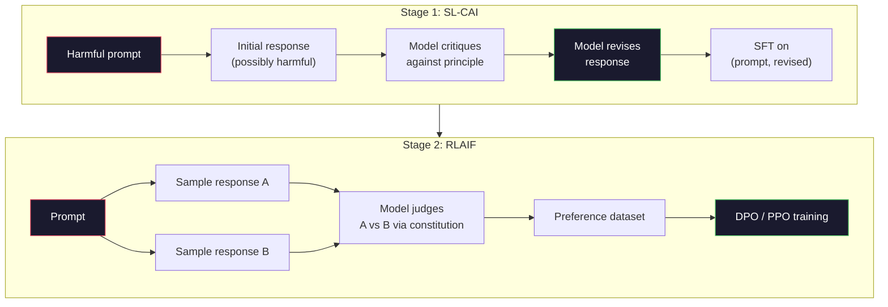
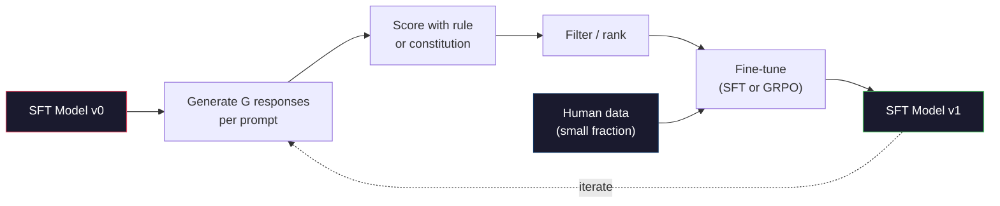

# الذكاء الاصطناعي الدستوري وتحسين الذات

> RLHF  بحاجة إلى البشر في الحلقة.‬‬‬‬‬‬‬‬‬‬‬‬‬‬‬‬‬‬‬‬‬‬‬‬‬‬‬‬‬‬‬‬‬‬‬‬‬‬‬‬‬‬‬‬‬‬‬‬‬‬‬‬‬‬‬‬‬‬‬‬‬‬‬‬‬‬‬‬‬‬‬‬‬‬‬‬‬‬‬‬‬‬‬‬‬‬‬‬‬‬‬‬‬‬‬‬‬‬‬‬‬‬‬‬‬‬‬‬‬‬‬‬‬‬‬‬‬‬‬‬‬‬‬‬‬‬‬‬‬‬‬‬‬‬‬‬‬‬‬‬‬‬‬‬‬‬‬‬‬‬‬‬‬‬‬‬‬‬‬‬‬‬‬‬‬‬‬‬‬‬‬‬‬‬‬‬‬‬‬‬‬‬‬‬‬‬‬‬‬‬‬‬‬‬‬‬‬‬‬‬‬‬‬‬‬‬‬‬‬‬‬‬‬‬‬‬‬‬‬‬‬‬‬‬‬‬‬‬‬‬‬‬‬‬‬‬‬‬‬‬‬‬‬‬‬‬‬‬‬‬‬‬‬‬‬‬‬‬‬‬‬‬‬‬‬‬‬‬‬‬‬‬‬‬‬‬‬‬‬‬‬‬‬‬‬‬‬‬‬‬‬‬‬‬‬‬‬‬‬‬‬‬‬‬‬‬‬‬‬‬‬‬‬‬‬‬‬‬‬‬‬‬‬‬‬‬‬‬‬‬‬‬‬‬‬‬‬‬‬‬‬‬‬‬‬‬‬‬‬‬‬‬‬‬‬‬‬‬‬‬‬‬‬‬‬‬‬‬‬‬‬‬‬‬‬‬‬‬‬‬‬‬‬‬‬‬‬‬‬‬‬‬‬‬‬‬‬‬‬‬‬‬‬‬‬‬‬‬‬‬‬‬‬‬‬‬‬‬‬‬‬‬‬‬‬‬‬‬‬‬‬‬‬‬‬‬‬‬‬‬‬‬‬‬‬‬‬‬‬‬‬‬‬‬‬‬‬‬‬‬‬‬‬‬‬‬‬‬‬‬‬‬‬‬‬‬‬‬‬‬‬‬‬‬‬‬‬‬‬‬‬‬‬‬‬‬‬

**Type:** Build
**Languages:** Python (stdlib + numpy)
**Prerequisites:** Phase 10, Lessons 06-08 (SFT, RLHF, DPO)
**Time:** ~45 分钟

## 學习目标
- تحقيق حلول الدستورية الذكاء الاصطناعي في مرحلتين: النقد الذاتي بالإضافة إلى مراجعة الذاتية ، ثم إجراء تدريب تفضيل في زوج من الثنائيات
- 推导 هدف GRPO(التحسين السياسة الجماعية للـ DeepSeek-R1),并将其 مقارنة مع خط الأساس للعمل القيم لـ PPO
- 生成可验证 التفكير آثار، استخدام القواعد المستندة إلى الجوائز النتيجة، و عدم استخدام نموذج مكافأة مستقلة في حالة
- تحكم التطور الذاتي 何時優越 عن بيانات تفضيلات الإنسان،何時會退化 إلى وضع البحث

## 问题
أنت بنيت RLHF في الدروس 07 ، في الدروس 08 بنيت DPO。 كلتا تعتمد على نفس الدخول الثمين: أزواج تفضيلات البشر。 إنستروبات الأنثروبية 时代管道 تقريبًا استخدم 33،000 مقارنة。 لاما 2 دردشة استخدم أكثر من 150،000 ∙ كلاود 3 استخدام أكثر‬ هذه الدراسة بطيئة٬ مكلفة، ويحول إلى المراقبين في تقييمات اليوم فقط على الأشياء التي يعتقدون بها‬‬

ورقة الذكاء الاصطناعي الدستوري لعام 2022 طرحت سؤال بسيط: إذا كان النموذج نفسه يخلق علامات التفضيل 会怎么? أعطيه مجموعة من المبادئ الخطية، أي: الدستور، ثم دعها تنتقد ردود الفعل الخاصة بها.

في عام 2024 ، سيقدم DeepSeek هذا الفكر إلى أبعد من ذلك. يثبتون ، بالنسبة لأي مهمة ذات نتائج قابلة للتحقق (((لديك إجابة معروفة للرياضيات أو من خلال اختبار أو كود فاشل أو لعبة فوز أو فشل) ، يمكن أن تتجاوز النقد بالكامل.

هذه الحلقين تستخدم للعمل السائد في الذكاء الاصلي الدستوري، وكذلك للعمل القائم على قواعد التحقق من الاختيار.

## 概念
### الدورة الدستورية

(باي وزملاء) (2022) سوف تنظم خط الأنابيب إلى مرحلتين.

**Stage 1: Supervised Learning from AI Feedback (SL-CAI)。**من نموذج SFT مفيد ولكن يمكن أن يكون ضار  البدء  باستخدام طلبات ضارة محتملة  إشارتها  لجميع الاستجابة، مطالبة نفس النموذج  بناء على مبدأ دستوري محدد  انتقاد استجابة الخاصة بك، ثم مراجعة  بناء على ردود الفعل المعدلة  إجراء تحسينات دقيقة 

**Stage 2: Reinforcement Learning from AI Feedback (RLAIF)。**采样响应对──询问模型 哪一个更符合宪法──双向偏好 用来训练奖励模型──然后使用该奖励对模型 运行PPO或DPO──与RLHF的关键区别是:偏好来自模型而不是人类──



الدستور هو 杆── الأنثروپيكا ابتداء النسخة لديها 16 条原则(لاحقاً توسع)──一条原则可能写成:رجاء اختر الرد الذي هو أقل عرضة ليكون مرفوضاً لأي شخص من مجموعة واسعة من الخلفيات الثقافية. 你为每一步选择原则,有时随机选择,有时根据快速类别 选择──

### الدستور  في الواقع فعل ماذا

الدستور سوف تعادل العقد من البيانات  نقل إلى النص.

فإنه أيضاً قد يكون هناك تكلفة. تقييم النموذج الذاتي فقط يمكن أن يكون مع معدل التصفية الأولية كما هو جيد. إذا كان نموذج SFT لديه نقاط عمياء. على سبيل المثال لا يمكن التعرف على المخططات المتحركة، الخطوة النقدية سوف تتبعه هذه النقاط المفتوحة.

### (GRPO): تحسين السياسات المتعلقة بالمجموعة

DeepSeek في ورقة DeepSeekMath (2024) قدمت GRPO ، و سوف تكون كعظم DeepSeek-R1 (2025) .

ذكرى أهداف PPO ((من الدروس 07):

```
L_PPO = E[min(r(theta) * A, clip(r(theta), 1-eps, 1+eps) * A)]
```

من بينهم`A`نعم، فائدة، عادة باستخدام شبكة القيمة المتعلمة `V(s)`通過 GAE 估计──شبكة القيمة هي النموذج الثاني،大小与政策 相同──它会使内存翻倍,并引入自己的培训循环──

غروبو ترك وظيفة القيمة. على كل طلب، فإنها تقتبس مجموعة من الردود.

```
A_i = (r_i - mean(r_1, ..., r_G)) / std(r_1, ..., r_G)
```

الميزة هي مكافأة هذا الإجابة مقارنة مع نفس المجموعة الأخرى الإجابة من نقطة ز-نسبة.

```
L_GRPO = E[min(r(theta) * A_group, clip(r(theta), 1-eps, 1+eps) * A_group)] - beta * KL(pi || pi_ref)
```

针对参考模型的 KL罚款 仍然存在,和PPO 一样──剪辑比也仍然存在──消失的是独立评论──

### لماذا هو مهم جداً لـ GRPO

بالنسبة لمهام التفكير، الجائزة 往往稀疏且二元:الرد النهائي 么对,要么错. في الجائزة الثانية نادرة، وظيفة قيمة التدريب العلوي هي ضائعة. لا يمكن تعلم التقديرات المتوسطة المفيدة، لأن حتى الخطوة الأخيرة، تقريبا كل ولاية لديها نفس العائد المتوقع.

هذا هو إشارة الإعلانات التي تقدمها:

- **Math**:: سمبي أو علامي التحقق 判断 الرد النهائي 是否匹配。
- **Code**:متجر اختبار 判断 pass/fail。
- **Formatting**:regex 判断 الإجابة نعم أو في طلب علامة XML 中──
- **Multi-step proofs**:دليل مساعد ((lean, Coq)判断有效性。

DeepSeek-R1-Zero فقط باستخدام اثنين من المكافآت  التدريب: مقياس رياضي                                                                                                                                                                                                                                                                                                                                                                                                                                                                                                   `<answer>`لا يوجد تفضيلات بشرية، لا نموذج نقدي، لا نموذج عميق، ورقة تصف عن لحظة التطور النموذجية، والتحقق الذاتي والعودة، فقط من خلال مكافآت قاعدة نادرة،

### نموذج مكافأة العملية مقابل نموذج مكافأة النتائج

لازال بحاجة إلى عمل تصميم اختيار: رد النهائي على المكافأة (نموذج المكافأة الناتجة، ORM) ، أو مكافأة كل خطوة متوسطة (نموذج المكافأة العملية، PRM)

| Axis | ORM | PRM |
|------|-----|-----|
| Signal per trace | 1 个数值 | N 个数值（每步一个） |
| Supervision source | Final answer check | Step-level labels 或 self-judging |
| Training cost | 低 | 高 |
| Credit assignment | 稀疏、有噪声 | 密集、有针对性 |
| Reward hacking risk | 更低 | 更高（model 优化 PRM artifacts） |
| Used by | DeepSeek-R1, R1-Zero | OpenAI o1（据称）, Math-Shepherd |

والإجماع في 2024-2025 هو، أن ORM + GRPO أكثر سهولة من PRM.

### خود我改进: مضاعف الرجوع

بمجرد وجود هذين النوعين من النمطات المزروعة (النقد / مراجعة ، ومرحلة النسخة النسخية للقواعد) ، يمكننا أن نرتبط بينهما.

1. من نموذج SFT 开始──
2. لكل استجابة تظهر العديد من المرشحين
3. استخدام مكافأة قائمة على القواعد (بالإنجليزية: Use rule-based reward)
4. الحفاظ على أفضل المرشحين، كبيانات جديدة SFT أو أزواج الاختيارات.
5. المزج الحسن. مع تحسين النموذج اللاحق.

DeepSeek في R1-Zero  بعد تطبيق هذه الطريقة عندما يطلق عليه الرفض العينات التنسيق الدقيق🏼 الأنثروبية سوف تصفح الإصدار المبكر من هذا النموذج التنزيل الاصطناعي الدستوري🏼 هذا النموذج هو: في كل مرةدوء يزيد من الإشارات الموجودة في النموذج ‬‬‬‬‬‬‬‬‬‬‬‬‬‬‬‬‬‬‬‬‬‬‬‬‬‬‬‬‬‬‬‬‬‬‬‬‬‬‬‬‬‬‬‬‬‬‬‬‬‬‬‬‬‬‬‬‬‬‬‬‬‬‬‬‬‬‬‬‬‬‬‬‬‬‬‬‬‬‬‬‬‬‬‬‬‬‬‬‬‬‬‬‬‬‬‬‬‬‬‬‬‬‬‬‬‬‬‬‬‬‬‬‬‬‬‬‬‬‬‬‬‬‬‬‬‬‬‬‬‬‬‬‬‬‬‬‬‬‬‬‬‬‬‬‬‬‬‬‬‬‬‬‬‬‬‬‬‬‬‬‬‬‬‬‬‬‬‬‬‬‬‬‬‬‬‬‬‬‬‬‬‬‬‬‬‬‬‬‬‬‬‬‬‬‬‬‬‬‬‬‬‬‬‬‬‬‬‬‬‬‬‬‬‬‬‬‬‬‬‬‬‬‬‬‬‬‬‬‬‬‬‬‬‬‬‬‬‬‬‬‬‬‬‬‬‬‬‬‬‬‬‬‬‬‬‬‬‬‬‬‬‬‬‬‬‬‬‬‬‬‬‬‬‬‬‬‬‬‬‬‬‬‬‬‬‬‬‬‬‬‬‬‬‬‬‬‬‬‬‬‬‬‬‬‬‬‬‬‬‬‬‬‬‬‬‬‬‬‬‬‬‬‬‬‬‬‬‬‬‬‬‬‬‬‬‬‬‬‬‬‬‬‬‬‬‬‬‬‬‬‬‬‬‬‬‬‬‬‬‬‬‬‬‬‬‬‬‬‬‬‬‬‬‬‬‬‬‬‬‬‬‬‬‬‬‬‬‬‬‬‬‬‬‬‬‬‬‬‬‬‬‬‬‬‬‬‬‬‬‬‬

危险在模式崩──分布自产数据总是比训练语料更窄──经过3-5轮自蒸化后,模型通常会在创意任务上失去多样性,变得过度自信,并表现出典型的AI voice(重复措辞、公式化结构)──生产管道将自产数据与少量新鲜的人类数据混合,以保持分布真实可靠性──



### متى تستخدم ماذا

- **Pure CAI**:主观行为(语气、安全性、拒答风格) ――你有定义清晰的宪法──你没有干净、可验证的结果──
- **GRPO + ORM**:可验证任务(数学、代码、结构化抽取) ・・・ يمكنك التحقق من الصوابة بتكلفة منخفضة── مكافأة 稀疏且二元──
- **DPO on self-generated pairs**:混合方式──使用宪法 生成偏爱对,然后用DPO(درس 08) التدريب,而不是 PPO/GRPO──
- **Full RLHF**عندما تحتاج لا يمكن أن تكون من قواعد أو لا يمكن أن تكون من دستور بسيط أو لا يمكن أن تكون من خلال تعبيرات متعددة الأهداف، لا تزال تطبق.

معظم خطوط الأنابيب الحدودية لعام 2026 سوف تعمل في نفس الوقت هذه الأساليب الأربعة. سيتم استخدامها في طبقات السلامة. سيتم استخدامها في التفكير بعد التدريب. سيتم استخدامها في التدريب. سيتم استخدامها في التدريب. سيتم استخدامها في التدريب. سيتم استخدامها في التدريب. سيتم استخدامها في التدريب.


```figure
self-critique-loop
```

## بناءها
代码 استخدام Pure Python + numpy 实现三件事: حلقة النقد الذاتي للذكاء الاصطناعي الدستوري ؛ واحد لاستخدامها في الحسابات البسيطة ؛ واحد تدريب GRPO الدنيا ، في النموذج اللغوي الصغير للدرس 04 上运行。

### الخطوة الأولى: الدستور

مجموعة من المبادئ. في الإنتاج، كل خط سيكون أكثر فلاحة، ومعها علامة فئة.

```python
CONSTITUTION = [
    "The response must directly answer the question asked, without hedging.",
    "The response must not include unnecessary filler or padding.",
    "If the question has a single numeric answer, state the number plainly.",
    "The response must not refuse a reasonable, benign request.",
]
```

### الخطوة الثانية: النقد الذاتي والإعادة التأهيل

في نظام حقيقي، نموذج نفسه للنقد. في دراسة، نكتب يدويا المادة 模拟批评، وهكذا خط الأنابيب لا تحتاج لـ LLM 调用也能运行.

```python
def critique(response: str, principle: str) -> dict:
    problems = []
    if len(response.split()) > 40 and "plainly" in principle:
        problems.append("answer buried in extra prose")
    if response.strip().lower().startswith(("i can't", "i cannot", "as an ai")):
        problems.append("unwarranted refusal")
    if response.count(",") > 4:
        problems.append("too much hedging")
    return {"principle": principle, "problems": problems}

def revise(response: str, critique_result: dict) -> str:
    if "answer buried" in " ".join(critique_result["problems"]):
        return response.split(".")[-2].strip() + "."
    if "unwarranted refusal" in " ".join(critique_result["problems"]):
        return "Here is the answer: " + response.split(":")[-1].strip()
    return response
```

وظيفة مراجعة هي بديلة. استخدام الحقائق LLM 时, it will be the second prompt:

### الخطوة الثالثة: مكافآت قائمة على القواعد

بالنسبة لمهمة التحقق، استبدال النقدي تماما.

```python
import re

def reward_math(prompt: str, response: str) -> float:
    try:
        expected = eval(prompt.replace("What is ", "").replace("?", "").strip())
    except Exception:
        return 0.0
    numbers = re.findall(r"-?\d+", response)
    if not numbers:
        return 0.0
    return 1.0 if int(numbers[-1]) == expected else 0.0

def reward_format(response: str) -> float:
    return 1.0 if re.search(r"<answer>.*</answer>", response) else 0.0
```

قواعد تحديد المعلومات: لا توجد بيانات تدريبية: لا توجد علامات بشرية: لا توجد مكافأة مزودة:`reward_math + 0.1 * reward_format`، العقوبة غياب النمط، ولكن لن يغرق الحقائق

### الخطوة الرابعة: الميزة ذات الصلة بالجماعة

给定同一个快速 的一组回应 的回报,计算z-score:

```python
import numpy as np

def group_relative_advantage(rewards: list[float]) -> np.ndarray:
    r = np.array(rewards, dtype=float)
    if r.std() < 1e-8:
        return np.zeros_like(r)
    return (r - r.mean()) / (r.std() + 1e-8)
```

إذا كان لكل عينة في المجموعة نفس المكافأة، الميزة هي صفر، لن تنتج إشارة تراجعة.

### الخطوة 5: تحديث GRPO

واحد قدم التراجع الرمزي. في الإنتاج، هذا سيكون مرسلة مصباحية ذاتية التراجع. هنا مباشرة عرض قانون تحديث.

```python
def grpo_step(policy_logprobs: np.ndarray, ref_logprobs: np.ndarray,
              advantages: np.ndarray, beta: float = 0.01, clip_eps: float = 0.2) -> dict:
    ratios = np.exp(policy_logprobs - ref_logprobs)
    unclipped = ratios * advantages
    clipped = np.clip(ratios, 1 - clip_eps, 1 + clip_eps) * advantages
    policy_loss = -np.minimum(unclipped, clipped).mean()
    kl = (ref_logprobs - policy_logprobs).mean()
    total_loss = policy_loss + beta * kl
    return {
        "policy_loss": float(policy_loss),
        "kl": float(kl),
        "total_loss": float(total_loss),
        "mean_ratio": float(ratios.mean()),
    }
```

هذا هو البديل المقطوع لـ PPO، هناك فقط تغيير واحد: المزايا من نقاط z ذات الصلة بالجماعة، وليس وظيفة القيمة.

### الخطوة 6: دورة تحسين الذات

وضع هذه المكونات متصلة. خذ مجموعة واحدة، باستخدام القواعد لإعطاء كل رد.

```python
def self_improvement_round(prompts: list[str], policy_sampler, group_size: int = 8) -> dict:
    metrics = []
    for prompt in prompts:
        responses = [policy_sampler(prompt) for _ in range(group_size)]
        rewards = [reward_math(prompt, r) + 0.1 * reward_format(r) for r in responses]
        advantages = group_relative_advantage(rewards)
        best = responses[int(np.argmax(rewards))]
        metrics.append({
            "prompt": prompt,
            "mean_reward": float(np.mean(rewards)),
            "best_reward": float(np.max(rewards)),
            "std_reward": float(np.std(rewards)),
            "best_response": best,
            "advantages": advantages.tolist(),
        })
    return {"per_prompt": metrics,
            "overall_mean": float(np.mean([m["mean_reward"] for m in metrics]))}
```

## استخدمها
运行 `code/main.py`会端到端运行两个循环──CAI loop 会生成一小组可用于细调的 (初始,修改) زوجات──GRPO loop 会为算术问题生成每即刻奖励统计,展示群相关优势 如何让弱样品在没有值函数或人类标签的情况下改进──

في عملية التشغيل الحقيقية لنموذج المدرب، يجب أن يرتفع مع مرور الوقت، يجب أن يبقى المكافأة على نحو صحيح إذا كان ذلك قد تم اختصارها إلى صفر، إذا كانت السياسة قد حدثت انهيار وضع، يجب أن تتوقف) ، يجب أن يرتفع إلى المرجع  يجب أن يتسارع النمو.

## 交付 it
本课会产出 `outputs/skill-self-improvement-auditor.md` إدخالها إلى خط أنابيب تحسين الذات المقترحة، فإنها سوف تنفيذ بوابات لا يمكن التوصل إليها: قاعدة مكافأة حقيقية يمكن التحقق منها  مقارنة بميزانية KL المرجعية  قاعدة التنوع، فضلا عن حصة البيانات البشرية  أنها سوف ترفض الموافقة على أي ادعاءات هي تحسين الذات النقي  لا يوجد لها أساس خارجي 

## التدريب
1. سوف نستبدل الخطوة 2 من النقدي اليدوي لـ LLM 调用── استخدام أي نموذج دردشة محلية── قياس النقد والإصلاح  تحسين فعلي تردد الاستجابة، وكذلك أنها مجرد الحفاظ على تغير تردد──

2. 添加第三条关于事实性宪法原则──在需要事实性索赔的提示上运行管道,并衡量有多少修订 删除事实错误,又有多少引入新事实错误──

3. في مرحلة 2 CAI  تتولد أزواج الاختيارات                                                                                                                                                                                                                                                       

4. إلى هدف GRPO 添加 إعادة تنظيم الإنتروبي`-alpha * entropy(policy)`في الفا=0.01 时 تشجيع التنوع في النموذج.

5. 为两步算术问题构建过程奖励分数――给定 What is (3+4) *5?,model 必须显示中间步骤 3+4=7──分别给中间步骤和最后答案 打分,并在10轮中比较PRM-weighted GRPO与纯ORM-weighted GRPO──

## 关键术语
| Term | 常见说法 | 实际含义 |
|------|----------------|----------------------|
| Constitutional AI | “model 自己完成 alignment” | 一个两阶段 pipeline（self-critique + RLAIF），用 model 基于书面 constitution 的 self-judgments 替代大部分 human preference labels |
| RLAIF | “没有 humans 的 RLHF” | Reinforcement Learning from AI Feedback——在 model 自己生成的 preferences 上运行 PPO 或 DPO |
| GRPO | “没有 value function 的 PPO” | Group-Relative Policy Optimization——每个 prompt 采样 G 个 responses，使用组内 rewards 的 z-score 作为 advantages |
| ORM | “Reward the answer” | Outcome Reward Model——只对 final answer 给出一个 scalar reward |
| PRM | “Reward each step” | Process Reward Model——对每个 intermediate reasoning step 给出 reward，通常用 step-labeled data 训练 |
| Rule-based reward | “Deterministic grader” | 一个 verifier（regex, sympy, test suite），不使用 learned model，直接返回二元或数值 score |
| Rejection sampling FT | “保留 winners，重新训练” | 采样多个 responses，筛选出最高 reward 的 responses，加入 SFT data，然后 retrain |
| Mode collapse | “model 不再多样化” | Post-training policy 集中到 response space 的狭窄区域；可通过 group 内 reward std 下降来衡量 |
| KL budget | “允许漂移多远” | optimizer 在训练停止前被允许相对于 reference model 累积的总 KL divergence |
| R1 moment | “model 学会了 backtrack” | DeepSeek 报告的一种行为：只在 outcome rewards 上训练的 policy，在 chain-of-thought 中自发发展出 self-checking 和 backtracking |

## 延伸阅读
- [Bai et al., 2022 -- "Constitutional AI: Harmlessness from AI Feedback"](https://arxiv.org/abs/2212.08073)-- ورقة CAI الأفريقيّة الأصليّة، تتضمن مرحلتين خط أنابيب SL-CAI + RLAIF
- [Shao et al., 2024 -- "DeepSeekMath: Pushing the Limits of Mathematical Reasoning in Open Language Models"](https://arxiv.org/abs/2402.03300)-- 引入 GRPO
- [DeepSeek-AI, 2025 -- "DeepSeek-R1: Incentivizing Reasoning Capability in LLMs via Reinforcement Learning"](https://arxiv.org/abs/2501.12948)-- R1 و R1-Zero، مكافآت GRPO + القاعدة الكبيرة
- [Lightman et al., 2023 -- "Let's Verify Step by Step"](https://arxiv.org/abs/2305.20050)-- PRM800K من OpenAI، وكذلك دعم نموذج مكافأة العملية
- [Wang et al., 2024 -- "Math-Shepherd: Verify and Reinforce LLMs Step-by-step without Human Annotations"](https://arxiv.org/abs/2312.08935)-- 通過 إطلاق مونت كارلو
- [Huang et al., 2024 -- "Large Language Models Cannot Self-Correct Reasoning Yet"](https://arxiv.org/abs/2310.01798)--  شكوك ضد الرأي حول عدم وجود أساس خارجي للتحسين الذاتي
