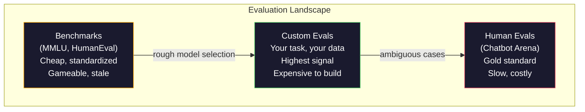
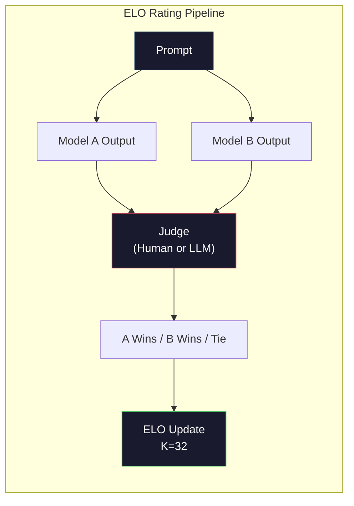

# التقييم:المعايير تقييمات إم

> قانون غودارت: عندما يصبح مؤشرًا هدفًا ، فإنه يتوقف عن أن يكون مؤشرًا جيدًا. كل مختبر حدودي يستهدف المعايير لتحسينها.

**Type:** Build
**Languages:** Python
**前置要求:**المرحلة 10،课程 01-05 (LLMs من الصفر)
**Time:** ~90 minutes

## 學习目标
- إنشاء مجموعة تقييم ذاتية التعريف، تستخدم لمعرفة نموذج اللغة 运行 متعدد الخيارات والمعايير المفتوحة
- 解释为什么标准基准(MMLU、HumanEval) 会和,而且无法区分边界模型
- استخدام المعايير الملائمة لتحقيق التقييمات الخاصة بالمهام:التماثيل الدقيق、F1、BLEU ودرجة الجامعة كقاضي
- تصميم وجهة نظر لك حالة استخدام محددة مجموعة تقييمات ذاتية التعريف ، بدلاً من الاعتماد فقط على لوحات النسب العامة

## 问题
تم إصدار MMLU في عام 2020 ، ويحتوي على 57 个学科的 15,908 道题──三年内, الحدود النماذج 就让它和了──GPT-4 得分 86.4%──Claude 3 Opus 得分 86.8%──Llama 3 405B 得分 88.6%── leadboard تم ضغطها إلى 3 分范围内, والفرق هو مجرد ضجيج إحصائي, وليس الفجوات في القدرة الحقيقية──

في الوقت نفسه ، فإن هذه النماذج سوف تفشل في المهمة التي يمكن أن ينجزها الطفل في سن 10 دون أن يفكر فيها. كلاود 3.5 سونيت في MMLU تسجل 88.7% ، ولكن في البداية لا يمكن حساب عدد الحروف في "الجبيرة" . هذه المهمة لا تتطلب أي معرفة عالمية ، ولا تحتاج إلى التفكير ، تحتاج فقط إلى تكرار مستوى الشخصيات.

الفرق بين أداء المقاييس والموثوقية في العالم الواقعي ، هو مشكلة أساسية لتقييم ماجستير دراسة الأعمال. المقاييس يمكن أن تخبرك فقط كيفية أداء النموذج في المقاييس. فهي لا تستطيع تقريبا أن تخبرك كيفية أداء هذا النموذج في مهمتك المحددة.

تحتاج إلى تقييمات مخصصة. ليس لأن المعايير غير مفيدة، ومعايير اختيار النموذج الخام مفيدة جدا، ولكن لأن التقييم النهائي يجب أن يكون دقيقاً لتطابق ظروف التنفيذ الخاصة بك.

## 概念
### المشهد الإيفالي

تم تقسيم التقييم إلى ثلاث فئات، وتختلف كل فئة من تكاليف ونوعية الإشارة.

**Benchmarks**هو مجموعة اختبارات قياسية. MMLU、HumanEval、SWE-bench、MATH、ARC、HellaSwag。 تسمح للنموذج بالعمل على مقياس، ثم تحصل على عدد واحد. الميزة هي: الجميع يستخدمون نفس الاختبار، لذلك يمكن مقارنة النموذج.

**Custom evals**هو أنت من أجل حالة الاستخدام الخاصة بك بناء مجموعات الاختبار ‬‬‬‬‬‬‬‬‬‬‬‬‬‬‬‬‬‬‬‬‬‬‬‬‬‬‬‬‬‬‬‬‬‬‬‬‬‬‬‬‬‬‬‬‬‬‬‬‬‬‬‬‬‬‬‬‬‬‬‬‬‬‬‬‬‬‬‬‬‬‬‬‬‬‬‬‬‬‬‬‬‬‬‬‬‬‬‬‬‬‬‬‬‬‬‬‬‬‬‬‬‬‬‬‬‬‬‬‬‬‬‬‬‬‬‬‬‬‬‬‬‬‬‬‬‬‬‬‬‬‬‬‬‬‬‬‬‬‬‬‬‬‬‬‬‬‬‬‬‬‬‬‬‬‬‬‬‬‬‬‬‬‬‬‬‬‬‬‬‬‬‬‬‬‬‬‬‬‬‬‬‬‬‬‬‬‬‬‬‬‬‬‬‬‬‬‬‬‬‬‬‬‬‬‬‬‬‬‬‬‬‬‬‬‬‬‬‬‬‬‬‬‬‬‬‬‬‬‬‬‬‬‬‬‬‬‬‬‬‬‬‬‬‬‬‬‬‬‬‬‬‬‬‬‬‬‬‬‬‬‬‬‬‬‬‬‬‬‬‬‬‬‬‬‬‬‬‬‬‬‬‬‬‬‬‬‬‬‬‬‬‬‬‬‬‬‬‬‬‬‬‬‬‬‬‬‬‬‬‬‬‬‬‬‬‬‬‬‬‬‬‬‬‬‬‬‬‬‬‬‬‬‬‬‬‬‬‬‬‬‬‬‬‬‬‬‬‬‬‬‬‬‬‬‬‬‬‬‬‬‬‬‬‬‬‬‬‬‬‬‬‬‬‬‬‬‬‬‬‬‬‬‬‬‬‬‬‬‬‬‬‬‬‬‬‬‬‬‬‬‬‬‬‬‬‬‬‬‬‬‬‬‬‬‬‬‬‬‬‬‬‬‬‬‬‬‬‬‬‬‬‬‬‬‬‬‬‬‬‬‬‬‬‬‬‬‬‬‬‬‬‬‬‬‬‬‬‬‬‬‬‬‬‬‬‬‬‬‬‬‬‬‬‬‬‬‬‬‬‬‬‬‬‬‬‬‬‬‬‬‬

**Human evals**استخدام دفع الملاحظين، على أساس المفيدية، والصوابية، والسريعة والسلامة وغيرها من المعايير المحددة نموذج النتائج.$0.10-$(تصفيق) وسرعة (عدة ساعات إلى عدة أيام)



### لماذا تتحطم المعايير

ثلاثة آليات تؤدي إلى أن النسبة المرجعية لم تعد تعكس القدرة الحقيقية.

**Data contamination。**訓練语料会抓取互联网──ベンچ مارك 问题也在互联网──模型在训练期间看到了答案──这不是传统意义上的骗局,实验室并不是有意含有基准数据──但网页规模的抓取使排除它们几乎不可能──

**Teaching to the test。**المختبرات سوف تستهدف أداء المرجح  تحسين التدريب المختلط البيانات. إذا كان 5% من التدريب المختلط البيانات هو MMLU نمط الاختيار المتعدد، فإن نموذج تبدأ في التعلم هذه النمط والتوزيع الإجابة.

**Saturation。**عندما يتم تحقيق كل نموذج حدودي في مقياس معين، يتوقف هذا المرجع عن التمييز. والباقي من 10 إلى 15٪ من المشاكل قد تكون غامضة أو تطلب معرفة المجال البارد.

### الارتباك: 快速健康检查

الغموض  قياس النموذج على سلسلة من الرموز هناك الكثير من الظروف ‬ على شكل، انها متوسط السلبية علامة احتمالية:

```
PPL = exp(-1/N * sum(log P(token_i | context)))
```

الارتباكات 10 تعبر عن النموذج في المعنى المتوسط، مثل في كل رمز  موقع من 10 个选项均选择一样不确定──越低越好──GPT-2 在 WikiText-103 上的ارتباكات 约为 30──GPT-3 约为 20──Llama 3 8B 约为 7──

الارتباك  بالنسبة لنموذج مقارنة مفيد في مجموعة اختبار واحدة ، ولكن لديه نقطة عمياء. يمكن أن يحصل النموذج من خلال القدرة على التنبؤ في النموذج العادي للحصول على الارتباك المنخفض ، في حين أنه غير جيد جدا في النموذج النادر ولكن المهم.

### ماجستير في الدراسة كقاضي

استخدام نموذج قوي لتقييم 弱模型的输出──想法很简单:让GPT-4o أو كلود سونيت 根据 1-5 分评价反应的正确性、有用性和安全──使用GPT-4o-mini 时,每次判断耗费约0.01 美元,以及与人类判断的相关性出乎意料地高,大多数任务有约80%的同意──

إنّ عرض النقاط أكثر أهمية من النموذج نفسه. إنّ عرض المعلومات "سعر هذا الاستجابة") يُحدث عدد ضجيج.

أساليب الفشل:أماط القضاة ستظهر تحيزًا في الموقف (((في المقارنات المزدوجة 中偏好第一反应) ‧ تحيز اللفظة (((التحيز الأطول من الردود) والفضول الذاتي (((GPT-4 على نتائج GPT-4 评分高于等价的Claude output) ‧缓解方法:随机化顺序、按长度归归一化、使用不同于被评估 模型的评官──

### بناء على مقارنة تصنيفات ELO

هذا هو طريقة أراضي الشاتبوت. إلى نفس الطلب. عرض ردود فعل من مختلف النماذج. البشر. أو قاضي ماجستير في التدريس. اختيار أفضل. من خلال آلاف المرات من مثل هذه المقارنات، لجميع النماذج الحساب ELO تصنيف، وذلك هو نفس المجموعة من النظم المستخدمة في الشطرنج.

ميزة ELO: التصنيف النسبي أكثر من النتائج المطلقة أكثر موثوقية، ويمكن أن يتعامل بشكل جيد مع العلاقات، ويتطلب مقارنات أقل من كل إصدار وبالطبع، حتى أوائل عام 2026، تشاتبوت أيرينا  التصنيف يظهر GPT-4o、Claude 3.5 Sonnet 和 Gemini 1.5 Pro في المرتبة الأولى على حدة 20 نقطة ELO。



### الإطارات المتساوية

**lm-evaluation-harness**(EleutherAI): معيار open-source eval framework── دعم 200+ مقياسات── باستخدام امر واحد即可让任意 Hugging Face 模型跑 MMLU、HellaSwag、ARC 等── Open LLM Leaderboard استخدامها──

**RAGAS**: خصيصاً لاستخدام إطار تقييم خطوط أنابيب RAG。 قياس الوفاءة‬‬‬‬‬‬‬‬‬‬‬‬‬‬‬‬‬‬‬‬‬‬‬‬‬‬‬‬‬‬‬‬‬‬‬‬‬‬‬‬‬‬‬‬‬‬‬‬‬‬‬‬‬‬‬‬‬‬‬‬‬‬‬‬‬‬‬‬‬‬‬‬‬‬‬‬‬‬‬‬‬‬‬‬‬‬‬‬‬‬‬‬‬‬‬‬‬‬‬‬‬‬‬‬‬‬‬‬‬‬‬‬‬‬‬‬‬‬‬‬‬‬‬‬‬‬‬‬‬‬‬‬‬‬‬‬‬‬‬‬‬‬‬‬‬‬‬‬‬‬‬‬‬‬‬‬‬‬‬‬‬‬‬‬‬‬‬‬‬‬‬‬‬‬‬‬‬‬‬‬‬‬‬‬‬‬‬‬‬‬‬‬‬‬‬‬‬‬‬‬‬‬‬‬‬‬‬‬‬‬‬‬‬‬‬‬‬‬‬‬‬‬‬‬‬‬‬‬‬‬‬‬‬‬‬‬‬‬‬‬‬‬‬‬‬‬‬‬‬‬‬‬‬‬‬‬‬‬‬‬‬‬‬‬‬‬‬‬‬‬‬‬‬‬‬‬‬‬‬‬‬‬‬‬‬‬‬‬‬‬‬‬‬‬‬‬‬‬‬‬‬‬‬‬‬‬‬‬‬‬‬‬‬‬‬‬‬‬‬‬‬‬‬‬‬‬‬‬‬‬‬‬‬‬‬‬‬‬‬‬‬‬‬‬‬‬‬‬‬‬‬‬‬‬‬‬‬‬‬‬‬‬‬‬‬‬‬‬‬‬‬‬‬‬‬‬‬‬‬‬‬‬‬‬‬‬‬‬‬‬‬‬‬‬‬‬‬‬‬‬‬‬‬‬‬‬‬‬‬‬‬‬‬‬‬‬‬‬‬‬‬‬‬‬‬‬‬‬‬‬‬‬‬‬‬‬‬‬‬‬‬‬‬‬‬‬‬‬‬‬‬‬‬‬‬‬‬‬‬‬‬‬‬‬‬‬‬‬‬‬‬‬‬‬‬‬‬‬‬‬‬‬‬‬‬

**promptfoo**: للتقييم القيود التشغيلية للتجهيزات السريعة. تعريف حالات الاختبار في YAML، لمزيد من النماذج، الحصول على تقرير مرور / فشل.

### بناء أشكال مخصصة

هذا هو التقييم الوحيد المهم للإنتاج:

1. **Define the task。**模型到底应该做什么?要精确──"إجابة على الأسئلة" 太模糊──"بإعطاء رسالة إلكترونية لشكوى العميل، استخراج اسم المنتج، فئة القضية، والشعور" 才是一个可以评估的任务──

2. **Create test cases。**البروتوتيب يقدر على الأقل 50 个,إنتاج على الأقل 200 个. كل حالة اختبار هي واحدة (إدخال, متوقع_خروج) 对──包含边缘案例:空输入、adversarial inputs、ambiguous inputs、其他语言的 inputs──

3. **Define scoring。**النتائج المهيكلة استخدام المقابلة الدقيقة──文本相似度 استخدام BLEU/ROUGE──جودة مفتوحة استخدام LLM-as-judge──مهام الاستخراج استخدام F1──用权重组合多个指标──

4. **Automate。**كل تقييم يمكن أن يتم باستخدام أمر واحد. لا يوجد خطوة يدوية.

5. **Track over time。**单独一个评分分 没有意义──你需要趋势线──最后一次提示变化 后分数是否提升? 切换模型后是否回归?把评与提示 一起版本──

| Eval Type | 每次 judgment 成本 | 与人类的一致性 | 最适合 |
|-----------|------------------|----------------------|----------|
| Exact match | ~$0 | 100%（适用时） | Structured output、classification |
| BLEU/ROUGE | ~$0 | ~60% | Translation、summarization |
| LLM-as-judge | ~$0.01 | ~80% | Open-ended generation |
| Human eval | $0.10-$2.00 | N/A（即 ground truth） | Ambiguous、high-stakes tasks |


```figure
perplexity-loss
```

## بناءها
### 步骤 1: الحد الأدنى من الإعدادات 框架

تعريف الاختبارات المجردة الأساسية. حالة تقييم لديها إدخال. الخروج المتوقع.

```python
import json
from collections import Counter

class EvalCase:
    def __init__(self, input_text, expected, metadata=None):
        self.input_text = input_text
        self.expected = expected
        self.metadata = metadata or {}

class EvalSuite:
    def __init__(self, name, cases, scorers):
        self.name = name
        self.cases = cases
        self.scorers = scorers

    def run(self, model_fn):
        results = []
        for case in self.cases:
            prediction = model_fn(case.input_text)
            scores = {}
            for scorer_name, scorer_fn in self.scorers.items():
                scores[scorer_name] = scorer_fn(prediction, case.expected)
            results.append({
                "input": case.input_text,
                "expected": case.expected,
                "prediction": prediction,
                "scores": scores,
            })
        return results
```

### الخطوة 2: تسجيل الوظائف

"إبداع مطابقة دقيقة "للمدونات "ف1 و "مثل "محقق القانون كقاضي

```python
def exact_match(prediction, expected):
    return 1.0 if prediction.strip().lower() == expected.strip().lower() else 0.0

def token_f1(prediction, expected):
    pred_tokens = set(prediction.lower().split())
    exp_tokens = set(expected.lower().split())
    if not pred_tokens or not exp_tokens:
        return 0.0
    common = pred_tokens & exp_tokens
    precision = len(common) / len(pred_tokens)
    recall = len(common) / len(exp_tokens)
    if precision + recall == 0:
        return 0.0
    return 2 * (precision * recall) / (precision + recall)

def llm_judge_simulated(prediction, expected):
    pred_words = set(prediction.lower().split())
    exp_words = set(expected.lower().split())
    if not exp_words:
        return 0.0
    overlap = len(pred_words & exp_words) / len(exp_words)
    length_penalty = min(1.0, len(prediction) / max(len(expected), 1))
    return round(overlap * 0.7 + length_penalty * 0.3, 3)
```

### الخطوة الثالثة: نظام التصنيف ELO

استخدام تحديثات ELO  تحقق مقارنات زوجية  هذا هو Chatbot Arena المستخدمة لتحقيق النموذج الترتيب النظام‬

```python
class ELOTracker:
    def __init__(self, k=32, initial_rating=1500):
        self.ratings = {}
        self.k = k
        self.initial_rating = initial_rating
        self.history = []

    def _ensure_player(self, name):
        if name not in self.ratings:
            self.ratings[name] = self.initial_rating

    def expected_score(self, rating_a, rating_b):
        return 1 / (1 + 10 ** ((rating_b - rating_a) / 400))

    def record_match(self, player_a, player_b, outcome):
        self._ensure_player(player_a)
        self._ensure_player(player_b)

        ea = self.expected_score(self.ratings[player_a], self.ratings[player_b])
        eb = 1 - ea

        if outcome == "a":
            sa, sb = 1.0, 0.0
        elif outcome == "b":
            sa, sb = 0.0, 1.0
        else:
            sa, sb = 0.5, 0.5

        self.ratings[player_a] += self.k * (sa - ea)
        self.ratings[player_b] += self.k * (sb - eb)

        self.history.append({
            "a": player_a, "b": player_b,
            "outcome": outcome,
            "rating_a": round(self.ratings[player_a], 1),
            "rating_b": round(self.ratings[player_b], 1),
        })

    def leaderboard(self):
        return sorted(self.ratings.items(), key=lambda x: -x[1])
```

### الخطوة 4: حساب الارتباك

استخدام الاحتمالات الوهمية  حساب الارتباكات ‬ في الممارسة العملية، سوف تحصل على هذه القيم من منطقات النموذج ‬ هنا نستخدم التوزيع الاحتمالي ‬

```python
import numpy as np

def perplexity(log_probs):
    if not log_probs:
        return float("inf")
    avg_neg_log_prob = -np.mean(log_probs)
    return float(np.exp(avg_neg_log_prob))

def token_log_probs_simulated(text, model_quality=0.8):
    np.random.seed(hash(text) % 2**31)
    tokens = text.split()
    log_probs = []
    for i, token in enumerate(tokens):
        base_prob = model_quality
        if len(token) > 8:
            base_prob *= 0.6
        if i == 0:
            base_prob *= 0.7
        prob = np.clip(base_prob + np.random.normal(0, 0.1), 0.01, 0.99)
        log_probs.append(float(np.log(prob)))
    return log_probs
```

### الخطوة 5: النتائج الإجمالية

计算一次 eval run: متوسط  متوسط  حد أسعار الانتقال، فضلا عن الانفصال حسب المقاييس

```python
def summarize_results(results, threshold=0.8):
    all_scores = {}
    for r in results:
        for metric, score in r["scores"].items():
            all_scores.setdefault(metric, []).append(score)

    summary = {}
    for metric, scores in all_scores.items():
        arr = np.array(scores)
        summary[metric] = {
            "mean": round(float(np.mean(arr)), 3),
            "median": round(float(np.median(arr)), 3),
            "std": round(float(np.std(arr)), 3),
            "min": round(float(np.min(arr)), 3),
            "max": round(float(np.max(arr)), 3),
            "pass_rate": round(float(np.mean(arr >= threshold)), 3),
            "n": len(scores),
        }
    return summary

def print_summary(summary, suite_name="Eval"):
    print(f"\n{'=' * 60}")
    print(f"  {suite_name} Summary")
    print(f"{'=' * 60}")
    for metric, stats in summary.items():
        print(f"\n  {metric}:")
        print(f"    Mean:      {stats['mean']:.3f}")
        print(f"    Median:    {stats['median']:.3f}")
        print(f"    Std:       {stats['std']:.3f}")
        print(f"    Range:     [{stats['min']:.3f}, {stats['max']:.3f}]")
        print(f"    Pass rate: {stats['pass_rate']:.1%} (threshold >= 0.8)")
        print(f"    N:         {stats['n']}")
```

### الخطوة 6: تشغيل خط الأنابيب الكامل

وضع كل المحتويات على اتصال. تعريف مهمة، إنشاء حالات اختبار، تمثيل نموذجين، تنفيذ تقييمات، مقارنات من الزوجين.

```python
def demo_model_good(prompt):
    responses = {
        "What is the capital of France?": "Paris",
        "What is 2 + 2?": "4",
        "Who wrote Hamlet?": "William Shakespeare",
        "What language is PyTorch written in?": "Python and C++",
        "What is the boiling point of water?": "100 degrees Celsius",
    }
    return responses.get(prompt, "I don't know")

def demo_model_bad(prompt):
    responses = {
        "What is the capital of France?": "Paris is the capital city of France",
        "What is 2 + 2?": "The answer is four",
        "Who wrote Hamlet?": "Shakespeare",
        "What language is PyTorch written in?": "Python",
        "What is the boiling point of water?": "212 Fahrenheit",
    }
    return responses.get(prompt, "Unknown")

cases = [
    EvalCase("What is the capital of France?", "Paris"),
    EvalCase("What is 2 + 2?", "4"),
    EvalCase("Who wrote Hamlet?", "William Shakespeare"),
    EvalCase("What language is PyTorch written in?", "Python and C++"),
    EvalCase("What is the boiling point of water?", "100 degrees Celsius"),
]

suite = EvalSuite(
    name="General Knowledge",
    cases=cases,
    scorers={
        "exact_match": exact_match,
        "token_f1": token_f1,
        "llm_judge": llm_judge_simulated,
    },
)

results_good = suite.run(demo_model_good)
results_bad = suite.run(demo_model_bad)

print_summary(summarize_results(results_good), "Model A (concise)")
print_summary(summarize_results(results_bad), "Model B (verbose)")
```

نموذج "جيد" 模型 give precise answer──"سيء" 模型 give冗长的表情──المتطابقة الدقيقة 会严重惩罚冗长模型──Token F1 和 LLM-as-judge 更宽容──هذا يوضح لماذا اختيار المقاييس 很重要: نفس النموذج يبدو قويًا أم سيئًا ، يعتمد على كيفية تسجيلك──

### الخطوة 7: بطولة ELO

في عدة جولات من النموذجات

```python
elo = ELOTracker(k=32)

for case in cases:
    pred_a = demo_model_good(case.input_text)
    pred_b = demo_model_bad(case.input_text)

    score_a = token_f1(pred_a, case.expected)
    score_b = token_f1(pred_b, case.expected)

    if score_a > score_b:
        outcome = "a"
    elif score_b > score_a:
        outcome = "b"
    else:
        outcome = "tie"

    elo.record_match("model_a_concise", "model_b_verbose", outcome)

print("\nELO Leaderboard:")
for name, rating in elo.leaderboard():
    print(f"  {name}: {rating:.0f}")
```

### الخطوة 8: مقارنة المثيرة للقلق

معقدة النموذج مقارنة مع مستوى الجودة المختلفة

```python
test_text = "The quick brown fox jumps over the lazy dog in the garden"

for quality, label in [(0.9, "Strong model"), (0.7, "Medium model"), (0.4, "Weak model")]:
    log_probs = token_log_probs_simulated(test_text, model_quality=quality)
    ppl = perplexity(log_probs)
    print(f"  {label} (quality={quality}): perplexity = {ppl:.2f}")
```

## استخدمها
### الـ"م-تقييم" (EleutherAI)

في أي نموذج على النظارات المرجعية.

```python
# pip install lm-eval
# Command line:
# lm_eval --model hf --model_args pretrained=meta-llama/Llama-3.1-8B --tasks mmlu --batch_size 8

# Python API:
# import lm_eval
# results = lm_eval.simple_evaluate(
#     model="hf",
#     model_args="pretrained=meta-llama/Llama-3.1-8B",
#     tasks=["mmlu", "hellaswag", "arc_easy"],
#     batch_size=8,
# )
# print(results["results"])
```

### promptfoo

تستخدم التقييمات القائمة على التكوينات في الهندسة السريعة.

```yaml
# promptfoo.yaml
providers:
  - openai:gpt-4o-mini
  - anthropic:claude-3-haiku

prompts:
  - "Answer in one word: {{question}}"

tests:
  - vars:
      question: "What is the capital of France?"
    assert:
      - type: contains
        value: "Paris"
  - vars:
      question: "What is 2 + 2?"
    assert:
      - type: equals
        value: "4"
```

### المعلومات المقدمة لقيام تقييم المعلومات المقدمة

```python
# pip install ragas
# from ragas import evaluate
# from ragas.metrics import faithfulness, answer_relevancy, context_precision
#
# result = evaluate(
#     dataset,
#     metrics=[faithfulness, answer_relevancy, context_precision],
# )
# print(result)
```

راغاس قياس التقييمات العامة 会遗漏的内容: هل تستند النموذج الإجابة على السياق المسترد، وليس فقط في المعنى الافتراضي ما إذا كان صحيحا──

## 交付 it
本课会产出 `outputs/prompt-eval-designer.md`, هذا أمر قابل للاستعادة ، يستخدم لتصميم مجموعات تقييم مخصصة لأي مهمة. أعطيه وصف مهمة ، فإنه سيولد حالات اختبار ، وظائف تسجيل النتيجة وفرق الإجازة / الفشل.

سوف يخرج`outputs/skill-llm-evaluation.md`، هو إطار قرار، يستخدم وفقا لنوع المهمة الخاصة بك، ميزانية ومتطلبات التأخير  اختيار استراتيجية التقييم مناسبة.

## التدريب
1. إضافة نقطة "التوافق": باستخدام نفس المدخل 让模型运行 5 مرات،并衡量输出 匹配的频率──.

2. 扩展ELO tracker,使它支持多个法官功能 (→ المباراة الدقيقة、F1、LLM-as-judge)并为它们加权──比较当你大幅度提高精确匹配权重与大幅度提高F1权重时,leaderboard 会如何变化──

3. وخلال مهمة محددة، قم ببناء مجموعة تقييم: تصنيف رسائل البريد الإلكتروني إلى 5 فئات. قم بإنشاء 100 حالة اختبارية، تحتوي على العديد من الأمثلة والحوافد.

4. 实现污染检测:给定一组评估问题和一个培训组,检查有多少比例的评估问题(或接近的表述) ظهرت في بيانات التدريب.

5. بناء أداة "مختلفة النموذج"‬‬‬‬‬‬‬‬‬‬‬‬‬‬‬‬‬‬‬‬‬‬‬‬‬‬‬‬‬‬‬‬‬‬‬‬‬‬‬‬‬‬‬‬‬‬‬‬‬‬‬‬‬‬‬‬‬‬‬‬‬‬‬‬‬‬‬‬‬‬‬‬‬‬‬‬‬‬‬‬‬‬‬‬‬‬‬‬‬‬‬‬‬‬‬‬‬‬‬‬‬‬‬‬‬‬‬‬‬‬‬‬‬‬‬‬‬‬‬‬‬‬‬‬‬‬‬‬‬‬‬‬‬‬‬‬‬‬‬‬‬‬‬‬‬‬‬‬‬‬‬‬‬‬‬‬‬‬‬‬‬‬‬‬‬‬‬‬‬‬‬‬‬‬‬‬‬‬‬‬‬‬‬‬‬‬‬‬‬‬‬‬‬‬‬‬‬‬‬‬‬‬‬‬‬‬‬‬‬‬‬‬‬‬‬‬‬‬‬‬‬‬‬‬‬‬‬‬‬‬‬‬‬‬‬‬‬‬‬‬‬‬‬‬‬‬‬‬‬‬‬‬‬‬‬‬‬‬‬‬‬‬‬‬‬‬‬‬‬‬‬‬‬‬‬‬‬‬‬‬‬‬‬‬‬‬‬‬‬‬‬‬‬‬‬‬‬‬‬‬‬‬‬‬‬‬‬‬‬‬‬‬‬‬‬‬‬‬‬‬‬‬‬‬‬‬‬‬‬‬‬‬‬‬‬‬‬‬‬‬‬‬‬‬‬‬‬‬‬‬‬‬‬‬‬‬‬‬‬‬‬‬‬‬‬‬‬‬‬‬‬‬‬‬‬‬‬‬‬‬‬‬‬‬‬‬‬‬‬‬‬‬‬‬‬‬‬‬‬‬‬‬‬‬‬‬‬‬‬‬‬‬‬‬‬‬‬‬‬‬‬‬‬‬‬‬‬‬‬‬‬‬‬‬‬‬‬‬‬‬‬‬‬‬‬‬‬‬‬‬‬‬‬‬‬‬‬‬‬‬‬‬‬‬‬‬‬‬‬‬‬‬‬‬‬‬‬‬‬‬‬‬‬‬‬‬‬‬‬‬‬‬‬‬‬

## 关键术语
| Term | 人们的说法 | 它实际上的含义 |
|------|----------------|----------------------|
| MMLU | "The benchmark" | Massive Multitask Language Understanding，包含 57 个学科的 15,908 道 multiple choice questions，到 2025 年已在 88% 以上饱和 |
| HumanEval | "Code eval" | OpenAI 的 164 个 Python function-completion problems，只测试 isolated function generation |
| SWE-bench | "Real coding eval" | 来自 12 个 Python repos 的 2,294 个 GitHub issues，衡量包括 test generation 在内的 end-to-end bug fixing |
| Perplexity | "How confused the model is" | exp(-avg(log P(token_i given context)))，越低表示模型给实际 tokens 分配的概率越高 |
| ELO rating | "Chess ranking for models" | 根据 pairwise win/loss records 计算的 relative skill rating，Chatbot Arena 用它对 100+ models 排名 |
| LLM-as-judge | "Using AI to grade AI" | 强模型按照 rubric 评价弱模型 outputs，与人类 judges 约 80% agreement，成本约 $0.01/judgment |
| Data contamination | "The model saw the test" | Training data 包含 benchmark questions，在不提升真实 capability 的情况下抬高分数 |
| Eval suite | "A bunch of tests" | 一个 versioned collection，由 (input, expected_output, scorer) triples 组成，用于衡量特定 capability |
| Pass rate | "What percentage it gets right" | Eval cases 中得分超过阈值的比例，比 mean score 更可操作，因为它衡量 reliability |
| Chatbot Arena | "Model ranking website" | LMSYS 平台，拥有 2M+ human preference votes，并通过 ELO ratings 生成最可信的 LLM leaderboard |

## 延伸阅读
- [Hendrycks et al., 2021 -- "Measuring Massive Multitask Language Understanding"](https://arxiv.org/abs/2009.03300)-- ورقة MMLU، على الرغم من أنها قد تم، لا تزال المرجح الأكثر استشهدا LLM
- [Chen et al., 2021 -- "Evaluating Large Language Models Trained on Code"](https://arxiv.org/abs/2107.03374)-- ورقة OpenAI HumanEval، وضعت منهجية تقييم توليد الرمز
- [Zheng et al., 2023 -- "Judging LLM-as-a-Judge"](https://arxiv.org/abs/2306.05685)-- للاستخدام لتحقيق تقييم القانون القانون القانون القانون القانون القانون القانون القانون القانون القانون القانون القانون القانون القانون القانون القانون القانون القانون القانون القانون القانون القانون القانون القانون القانون القانون القانون القانون القانون القانون القانون القانون القانون القانون القانون القانون القانون القانون القانون القانون القانون القانون القانون القانون القانون القانون القانون القانون القانون القانون القانون القانون القانون القانون القانون القانون القانون القانون القانون القانون القانون القانون القانون القانون القانون القانون القانون القانون القانون القانون القانون القانون القانون القانون القانون القانون القانون القانون القانون القانون القانون القانون القانون القانون القانون القانون القانون القانون القانون القانون القانون القانون القانون القانون القانون القانون القانون القانون القانون القانون القانون القانون القانون القانون القانون القانون القانون القانون القانون القانون القانون القانون القانون القانون القانون القانون القانون القانون القانون القانون القانون القانون القانون القانون القانون القانون القانون القانون القانون القانون القانون القانون القانون القانون القانون القانون القانون القانون القانون القانون القانون القانون القانون القانون القانون القانون القانون القانون القانون القانون القانون القانون القانون القانون القانون القانون القانون القانون القانون القانون القانون القانون القانون القانون القانون القانون القانون القانون القانون القانون القانون القانون القانون القانون القانون القانون القانون القانون القانون القانون القانون القانون القانون القانون القانون القانون القانون القانون القانون القانون القانون القانون القانون القانون القانون القانون القانون القانون القانون القانون القانون القانون القانون القانون القانون القانون القانون القانون القانون القانون القانون القانون القانون القانون القانون القانون القانون القانون القانون القانون القانون القانون القانون القانون القانون القانون القانون القانون القانون القانون القانون القانون القانون القانون القانون القانون القانون القانون القانون القانون القانون القانون القانون القانون القانون القانون القانون القانون القانون القانون
- [LMSYS Chatbot Arena](https://chat.lmsys.org/)-- منصة مقارنة النماذج المشتركة، التي تمتلك أصوات 2 مليون +، هي أفضل تصنيف في العالم الحقيقي لدرجة الماجستير في مجال العلوم
