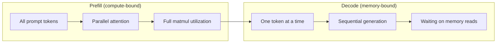
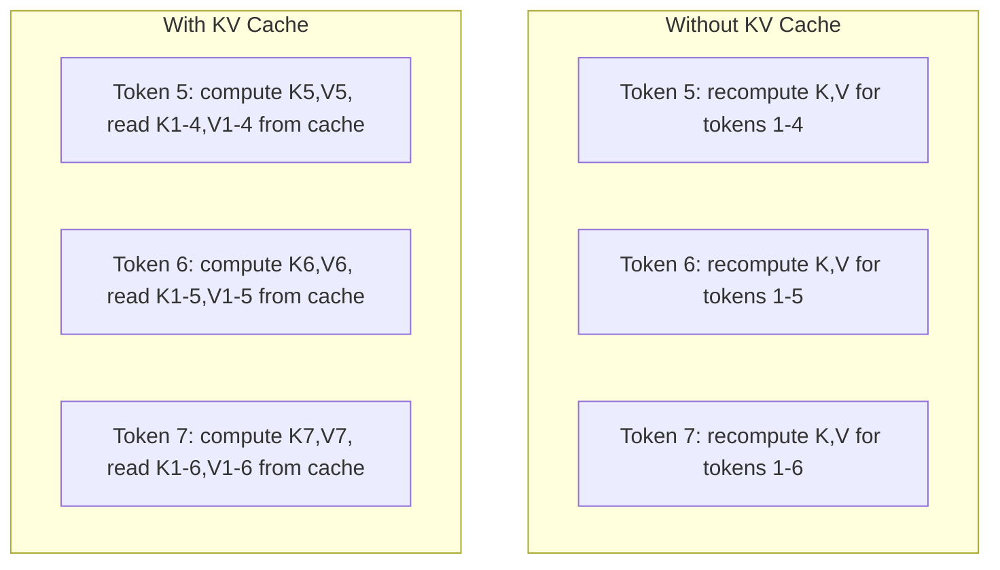
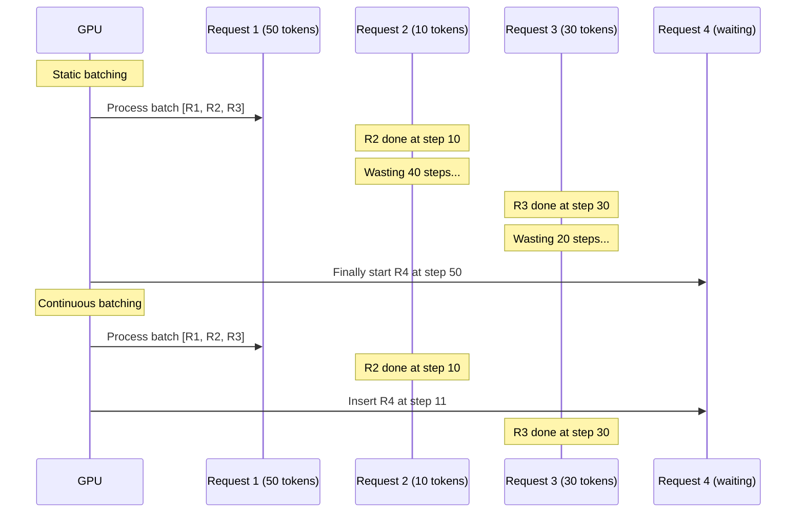
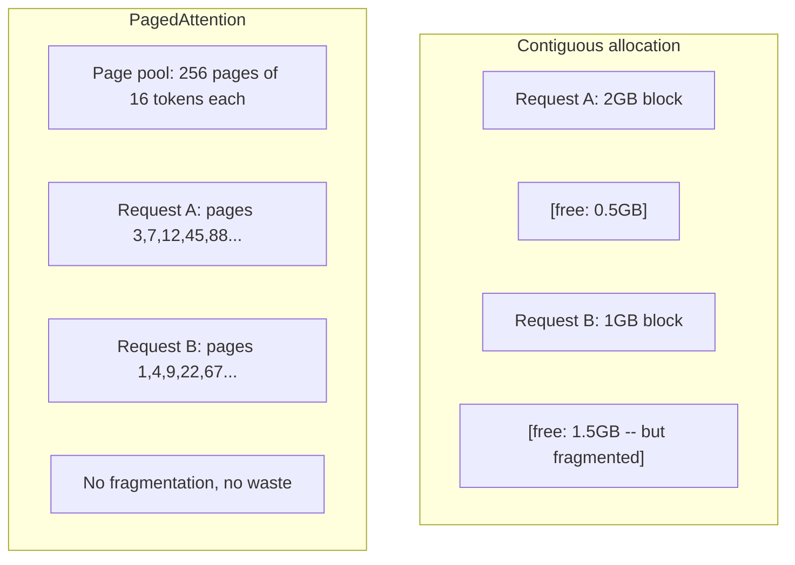
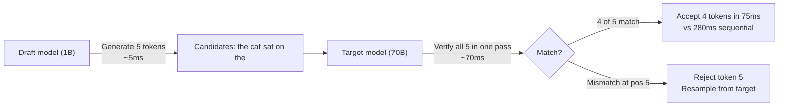

# الإستدلالات 优化

> تم تعريف المرحلتين إستنتاج الجامعة. تمت إعداد المعلومات وتجهيزها على محاسبة. تم تخصيص التشفيرات. تم إنشاء رمز واحد. تم تحديد الذاكرة. تم تحسين كل نوع من المرحلتين.

**Type:** Build
**Languages:** Python
**Prerequisites:** Phase 10, Lessons 01-08 (Transformer architecture, attention)
**Time:** ~120 分钟

## 學习目标

- 实现 KV-cache ، لتحقيق القضاء على إضافة الاختراقات في الجهاز
-  شرح إستنتاج LLM من قبل التملأ والإفصاح 阶段، وكذلك لماذا هناك اختلافات في الاثنين (مرتبطة بالحاسوب مقابل الذاكرة)
- 实现 مستمرة الإجراءات والحصول على الاهتمام المرتبط مع الملفات، لتحقيق أقصى معدل استخدام الجيبو تحت الطلب
- تقارن الاستنتاجات 优化技术(KV-cache  تخطيطات تخمينات  توجهات فلاش) و انتاجها/ التأخير 取舍

## 问题

تمت استخدام 4xA100 GPUs على تعيين Llama 3 70B── مستخدم واحد يمكن الحصول على حوالي 50 رمزا في الثانية── تشعر بسرعة── ثم 100 مستخدم في نفس الوقت يزور نقطة النهاية── من خلال الإنتاج 掉到 3 رمزا / ثانية / مستخدم── تقوم بتقديم 25،000 美元 في الشهر GPU 账单,提供响应速度却比人打字还慢──

النموذج نفسه لا يتغير بين 1 مستخدم و 100 مستخدم. نفس الوزن، نفس الهندسة المعمارية، نفس الرياضيات. يتغير كيفية ضبط العمل. الاستنتاج البسيط سوف تضيع 90% من الحسابات المتاحة لـ GPU. مستخدمي رمز انتظار 47 سوف يستغرقون فتحة البطاقة بأكملها، بينما حافلة ذاكرة GPU في الفضاء بين المجموعة. في الوقت نفسه، يمكن للمستخدم الجديد استخدام طلب 2,000 رمز مع الحساب مفيد.

هذا ليس تحديد النطاقات. هذه هي المشكلة. هذه هي المشكلة. هذه هي التقنية في هذا المرحلة.

vLLM في 4xA100-80GB فوق خدمة Llama 3 70B 时,在低并发下达到大约 50 رموز/ ثانية/ مستخدم,并通过连续批量 和 PagedAttention 在 100 个并发请求下维持 15-25 TPS/user──没有这些优化,同样硬件在该并发下只能提供 5 TPS/user──同样的GPUs、同样的模型,吞吐量提升 4 倍──

## 概念

### الملفات المسبقة مقابل التشريح

كل استنتاج لـ LLM هناك مرحلتين مختلفتين

**Prefill**处理整个输入提示──所有代币都已知,因此 الاهتمام يمكن أن يكون في التسلسل الكامل 上并行计算──这是 ضرب ماتريكس كبير -- GPU cores 会保持忙碌──瓶是计算:你的硬件每秒能提供多少 FLOPS──A100可达到 312 TFLOPS (BF16)──在单张 A100 上,70B 模型对 4,096-代币提示做做预填 约需要400ms──

**Decode**إنتاج رمز خروج واحد. كل رمز جديد يشارك في جميع الرموز السابقة، ولكن كل مرسلة إلى الأمام يُنتج رمز واحد فقط. حجم المصفوفات الوزنية هو نفسه خلال إعادة التعبئة. ولكن يمكنك استخدام متريج واحد وليس مصفوفة واحدة للذهاب إليها.



**ops:byte ratio**(ويقال أيضاً كثافة الحساب) رسم هذا الاختيار.

```
ops:byte ratio = FLOPs per token / bytes read from memory
```

في مجموعة 4,096 رمزا إعداد قبل الوفاء ، في كل تحميل واحد، سوف تقوم بتنفيذ حوالي 4,096 مرة ضرب-تراكم العمليات‬ هذا النسبة 很高 -- أنت محاسبة مقيدة‬ في حجم المجموعة 为 1 لتفكيك، في كل تحميل واحد وزن فقط تنفيذ حوالي 1 مرة العملية‬ هذا النسبة 很低 -- أنت ذاكرة مقيدة‬‬‬‬

核心洞察:*الترابط هو مقيد بالذاكرة، لأن أنت تقرأ النموذج بأكمله فقط لإنتاج رمز واحد*。 كل تحسين من أدناه، أو تقليل محتوى القراءة، أو زيادة كل مرة تقرأ معالجة مجموعة من الرموز، أو تجنب القراءة تماما。

### كيو كيش

في الاهتمام، كل طلب من الرمز سوف يشارك في كل رمز سابق من مفتاح و قيمة المتجهات. بدون تخزين. عندما، توليد الرمز N 需要重新计算前面 N-1 个 رمز الرمز و قيمة التوقعات. عندما تم تنبيه الرمز 1 في توليد الرمز 2، ثم توليد الرمز 3 时又一次، توليد الرمز 4 时又一次.

كيه ف كاش تخزين جميع الرموز السابقة من المفاتيح والقيمة التنبؤات.



**KV cache 的 memory 公式：**

```
KV cache size = 2 * num_layers * num_kv_heads * head_dim * seq_len * bytes_per_param
```

对于Llama 3 70B ((80 طبقة、8 رؤوس KV مع GQA、head_dim=128、BF16):

```
per token: 2 * 80 * 8 * 128 * 2 bytes = 327,680 bytes = 320 KB
at 4,096 tokens: 320 KB * 4,096 = 1.28 GB
at 128K tokens: 320 KB * 131,072 = 40 GB
```

واحد لاما 3 70B من 128K-سياق المحادثة 会消耗 40 GB KV الاحتفاظ -- نصف张 A100 من الذاكرة.

### التجميع المستمر

سيتم انتظار مجموعة من الطلبات إلى أن تصل، ويتم معالجتها معا، ويتم قبول الطلبات الجديدة بعد إتمامها. إذا كان الطلب واحد يحتاج إلى 500 رمز، والآخر يحتاج إلى 10، بعد إتمام الطلب، يجب وضع 490 خطوة لترسيم الرمز.

الإعداد المستمر (بالإنجليزية: Continuous batching) ([1]) سيتم إدخال طلب جديد في المجموعة بعد إتمام الطلبات المختلفة. في كل خطوة من مراحل تشفير المجموعة سيتم إعادة تقييم المجموعة.



يتوقف التشغيل على تغير درجة الطول الإصدار. عندما يتفق الطول، فإن الحزمة المستمرة مع الحزمة الثابتة 相当──长度可变时(常见情况), يمكن أن يوفر الحزمة المستمرة 2-5 مرات أعلى الحزمة، لأن فتحات الجيبو (GPU) لن تكون خالية أبدا.

### الصفحة الاهتمام

كل طلب من كيف كاش هو قطعة متواصلة من الذاكرة. مع طلب وصولها وتركها، تتجزأ الذاكرة -- مثل تجزئة الذاكرة في نظام التشغيل.

PagedAttention ((من vLLM) سوف تستخدم الذاكرة الافتراضية على النمط التنفيذي لـ KV cache。 انها ليست لتوزيع كتلة متواصلة لكل طلب ، بل توزيع "صفحات" ثابتة كبيرة جداً(عادةً في كل صفحة 16 رمزاً)。 الصفحات يمكن أن تقع في أي موقع من ذاكرة GPU الفيزيائية。 جدول الصفحات سوف يضع كل طلب في مواقف تسلسل منطقية 映射 إلى مواقع الصفحة الفيزيائية。



PagedAttention ويدعم المشاركات المشتركة **copy-on-write** إذا 50 طلبا لتشارك نفس النظام على نفس النظام، فإن هذه النظام على نفس النظام على نفس النظام يتم تخزين صفحات KV التخزين مرة واحدة فقط، وتتم استنتاجها على نفس النظام على 50 طلبا.

وذكر تقرير vLLM أنه من خلال PagedAttention يمكن تحقيق ما يقرب من صفر من ضياع الذاكرة ((حوالي 4٪ ، بينما تخصيص البديل حوالي 60-80٪)).

### التشفير المضارب

فك التشفير بطيء لأنه متسلسل -- أنت تولد رمز واحد، وضعه مرة أخرى، وتجدده في التالي. ولكن إذا كنت يمكن أن تخمين على التالي 5 رموز، ثم التحقق منها مرة واحدة؟

تشفير المضاربة استخدام واحد صغير و سريع **draft model**生成 K 个 مرشحات الارقام**target model**بعد ذلك في عملية المرور المقدمة الفردي معالجة جميع المرشحين K 个 (((يبدو مثل الامتثال المسبق -- متوازية、حساب مقيدة、高效)  إذا كان النموذج المستهدف مع توقعات النموذج المشروع، كنت في وقت واحد من المرور المستهدف المقدمة قبول جميع رموز K 个.



التسارع يتوقف**acceptance rate**-- توقعات النموذج المخطط مع المستهدف 匹配的频率── استخدام Llama 3 8B 为 Llama 3 70B عند إعداد المخططات 时,在自然语言上典型接受率为70-85%──这将转化为2-3倍解码速度──

ثلاثة طرق للتشفير المضاربة:

| Method | Draft source | Acceptance rate | Overhead |
|--------|-------------|-----------------|----------|
| Draft-target (Leviathan et al.) | 独立小模型 | 70-85% | Draft model memory |
| EAGLE (Li et al.) | Target 上的轻量 head | 75-90% | ~1% extra parameters |
| N-gram lookup | Token n-gram table | 40-60% | 可忽略 |

**EAGLE**في حالة مخفية النموذج المستهدف 之上训练一个小型 autoregressive head──它使用目标模型 倒数第二层功能来预测下一个代币的嵌入──因为它操作是目标模型 自身的表示(而不是独立模型的),所以能以极少的额外内存 获得更高的接受率──EAGLE-2 增加了动态草稿树,可根据背景调整候选人数量──

**N-gram speculative decoding**维护来自当前文本或预构建 corpus的 n-gram延续表──如果 المسودة 匹配同样的对话中此前出现的内容(重复模式、代码、结构化输出), فإنه سوف يكون مع صفر شبكة عصبية 触发── متوسط معدلات القبول أقل, ولكن تكلفة كل مرة التكهنات هي 0.

التشفير المضارب هو * صحيحة رياضية * -- 输出分布与目标模型的分布完全相同──它不是近似── 验证步骤 确保每个接受的代币都具有目标模型 原本会分配的确切概率──

### الاحتفاظ بالخزينة

许多请求共享相同前──Chatbot system prompt──RAG context block──Few-shot example set──没有前缓存 时,每个请求都会从头重新计算这些共享代币的KV缓存──

الاحتفاظ بالخزنة الاحتفاظ بالخزنة الاحتفاظ بالخزنة الاحتفاظ بالخزنة الاحتفاظ بالخزنة الاحتفاظ بالخزنة الاحتفاظ بالخزنة الاحتفاظ بالخزنة الاحتفاظ بالخزنة الاحتفاظ بالخزنة الاحتفاظ بالخزنة الاحتفاظ بالخزنة الاحتفاظ بالخزنة الاحتفاظ بالخزنة الاحتفاظ بالخزنة الاحتفاظ بالخزنة الاحتفاظ بالخزنة الاحتفاظ بالخزنة الاحتفاظ بالخزنة الاحتفاظ بالخزنة الاحتفاظ بالخزنة الاحتفاظ بالخزنة الاحتفاظ بالخزنة الاحتفاظ بالخزنة الاحتفاظ بالخزنة الاحتفاظ بالخزنة الاحتفاظ بالخزنة الاحتفاظية الاحتفاظية الاحتفاظية الاحتفاظية الاحتفاظية الاحتفاظية الاحتفاظية الاحتفاظية الاحتفاظية الاحتفاظية الاحتفاظية الاحتفاظية الاحتفاظية الاحتفاظية الابتقاء على الاحتفاظية الاحتفاظية الابتقاء الابتقاء

لجميع الطلبات المشتركة من نظام 2,000 رمزية على الفور، سيقوم الاحتفاظ بالتخزين الاحتياطي المسبق بإزالة كل طلب من 400ms من التملأ المسبق. في 100 طلب / ثانية، هذا في كل ثانية توفير 40 ثانية من الحسابات الجيبو -- أكثر من واحد من حجم عمل الجيبو.

استخدام شجرة radix انتباه SGLang  RadixAttention استخدام شجرة radix  trie) لتنفيذ الاحتفاظ بالمقاومة، حسب محتوى الوهم  مؤشرات الاحتفاظ بها  مؤشرات الاحتفاظ بها ‬‬‬‬‬‬‬‬‬‬‬‬‬‬‬‬‬‬‬‬‬‬‬‬‬‬‬‬‬‬‬‬‬‬‬‬‬‬‬‬‬‬‬‬‬‬‬‬‬‬‬‬‬‬‬‬‬‬‬‬‬‬‬‬‬‬‬‬‬‬‬‬‬‬‬‬‬‬‬‬‬‬‬‬‬‬‬‬‬‬‬‬‬‬‬‬‬‬‬‬‬‬‬‬‬‬‬‬‬‬‬‬‬‬‬‬‬‬‬‬‬‬‬‬‬‬‬‬‬‬‬‬‬‬‬‬‬‬‬‬‬‬‬‬‬‬‬‬‬‬‬‬‬‬‬‬‬‬‬‬‬‬‬‬‬‬‬‬‬‬‬‬‬‬‬‬‬‬‬‬‬‬‬‬‬‬‬‬‬‬‬‬‬‬‬‬‬‬‬‬‬‬‬‬‬‬‬‬‬‬‬‬‬‬‬‬‬‬‬‬‬‬‬‬‬‬‬‬‬‬‬‬‬‬‬‬‬‬‬‬‬‬‬‬‬‬‬‬‬‬‬‬‬‬‬‬‬‬‬‬‬‬‬‬‬‬‬‬‬‬‬‬‬‬‬‬‬‬‬‬‬‬‬‬‬‬‬‬‬‬‬‬‬‬‬‬‬‬‬‬‬‬‬‬‬‬‬‬‬‬‬‬‬‬‬‬‬‬‬‬‬‬‬‬‬‬‬‬‬‬‬‬‬‬‬‬‬‬‬‬‬‬‬‬‬‬‬‬‬‬‬‬‬‬‬‬‬‬‬‬‬‬‬‬‬‬‬‬‬‬‬‬‬‬‬‬‬‬‬‬‬‬‬‬‬‬‬‬‬‬‬‬‬‬‬‬‬‬‬‬‬‬‬‬‬‬‬‬‬‬‬‬‬‬‬‬‬‬‬‬‬‬‬‬‬‬‬‬‬‬‬‬‬‬‬‬‬‬‬‬‬‬‬‬‬‬‬

### محركات الإستدلال

ثلاث محركات 主导 إنتاج ماجستير في مجال التدريبات الخدمة:

| Engine | Key innovation | Best for |
|--------|---------------|----------|
| vLLM | PagedAttention、continuous batching | 通用 serving、最高兼容性 |
| SGLang | RadixAttention（prefix caching）、structured generation | Multi-turn chatbots、constrained decoding |
| TensorRT-LLM | NVIDIA kernel fusion、FP8 quantization | NVIDIA hardware 上的最大 single-GPU throughput |

**vLLM**هو من المفترض أن يبدأ النقطة. يدعم أوسع النماذج، يمكن أن تعمل على أي بائع GPU ((NVIDIA、 AMD、Intel) ، و من خلال PagedAttention + مسلسل batching  تحقيق الانتقال القوي.

**SGLang**建立在与vLLM相似的基础之上,但增加了用于前置缓存的RadixAttention,以及用于结构性LLM برامج اللغة المحددة للمنطقة.

**TensorRT-LLM**将模型编译成优化NVIDIA GPU kernels──它融合操作(注意 + خطية + تفعيل في kernel واحد) ، على H100 GPUs 上使用FP8,并与NVIDIA Triton Inference Server 集成进行生产部署──它实现最高单GPU throughput,但设置更多,并且只适用于NVIDIA GPUs──

إلاما 3 70B 的真实世界数字(4xA100-80GB,BF16):

| Metric | vLLM | SGLang | TensorRT-LLM |
|--------|------|--------|---------------|
| Throughput（1 user） | ~50 TPS | ~55 TPS | ~65 TPS |
| Throughput（100 users） | ~2,500 total TPS | ~3,200 total TPS | ~3,000 total TPS |
| Time to first token | ~400ms | ~300ms（prefix hit） | ~350ms |
| Max context | 128K | 128K | 128K |

### أوبس: بايت 框架

لا يمكنك تحسين نفسك دون قياس الأشياء. النسبة البايت ستخبرك أن عبء العمل محمول بالحوسبة أو محمول بالذاكرة، وهذا يحدد ما هي التحسينات المهمة حقا.

```
Compute roof: peak FLOPS of the GPU
Memory roof:  peak bandwidth * ops:byte ratio
```

عندما تكون عمليات:byte 较低时(decode、小 batches), سوف تتعلق بالصفوف على عرض النطاق التذاكر.

عندما تكون العمليات:byte 较高时(prefill、大批量), سوف تتعلق بالسقف الحاسوب.

| Scenario | ops:byte | Bound | Optimize with |
|----------|----------|-------|---------------|
| Prefill, batch=1 | ~4,096 | Compute | Kernel fusion, FP8 |
| Decode, batch=1 | ~1 | Memory | Quantization, KV compression |
| Decode, batch=32 | ~32 | Memory | Larger batch, continuous batching |
| Decode, batch=256 | ~256 | Transitioning | 两者都重要 |
| Decode, batch=1024 | ~1,024 | Compute | Kernel fusion, tensor parallelism |

A100 上的交叉点 大约是 ops:byte = 156(312 TFLOPS / 2 TB/s) ⋅低于 156 时,你是内存绑定的.高于 156 时,你是计算绑定的.


```figure
context-window-slide
```

## بناءها

### الخطوة 1: من الصفر لتحقيق KV مخزن

قمنا ببناء متخزن KV متعدد الرؤوس ، فإنه حسب الطبقة 、 رأس  محفظة مفتاح و توقعات القيمة ، و عرض الذاكرة  نمو نموذج

```python
import numpy as np

class KVCache:
    def __init__(self, num_layers, num_heads, head_dim, max_seq_len, dtype=np.float16):
        self.num_layers = num_layers
        self.num_heads = num_heads
        self.head_dim = head_dim
        self.max_seq_len = max_seq_len
        self.dtype = dtype

        self.k_cache = np.zeros(
            (num_layers, num_heads, max_seq_len, head_dim), dtype=dtype
        )
        self.v_cache = np.zeros(
            (num_layers, num_heads, max_seq_len, head_dim), dtype=dtype
        )
        self.seq_len = 0

    def update(self, layer_idx, new_keys, new_values):
        num_new = new_keys.shape[1]
        end = self.seq_len + num_new
        self.k_cache[layer_idx, :, self.seq_len:end, :] = new_keys
        self.v_cache[layer_idx, :, self.seq_len:end, :] = new_values
        return (
            self.k_cache[layer_idx, :, :end, :],
            self.v_cache[layer_idx, :, :end, :]
        )

    def advance(self, num_tokens):
        self.seq_len += num_tokens

    def memory_bytes(self):
        return self.k_cache.nbytes + self.v_cache.nbytes

    def used_bytes(self):
        per_token = 2 * self.num_layers * self.num_heads * self.head_dim * np.dtype(self.dtype).itemsize
        return per_token * self.seq_len
```

### الخطوة 2: استخدام KV مخزن الاهتمام

واحد من التبسيط الاهتمام متعدد الرؤوس، في خطوات فك الكشف باستخدام cache KV

```python
def scaled_dot_product_attention(query, keys, values):
    head_dim = query.shape[-1]
    scores = np.matmul(query, keys.transpose(0, 1, 3, 2)) / np.sqrt(head_dim)
    seq_len_q = scores.shape[-2]
    seq_len_k = scores.shape[-1]
    if seq_len_q > 1:
        mask = np.triu(np.ones((seq_len_q, seq_len_k), dtype=np.float32), k=seq_len_k - seq_len_q + 1)
        scores = scores + mask * (-1e9)
    max_scores = np.max(scores, axis=-1, keepdims=True)
    exp_scores = np.exp(scores - max_scores)
    attn_weights = exp_scores / np.sum(exp_scores, axis=-1, keepdims=True)
    return np.matmul(attn_weights, values)


class MultiHeadAttention:
    def __init__(self, d_model, num_heads):
        self.num_heads = num_heads
        self.head_dim = d_model // num_heads
        scale = np.sqrt(2.0 / d_model)
        self.W_q = np.random.randn(d_model, d_model).astype(np.float32) * scale
        self.W_k = np.random.randn(d_model, d_model).astype(np.float32) * scale
        self.W_v = np.random.randn(d_model, d_model).astype(np.float32) * scale
        self.W_o = np.random.randn(d_model, d_model).astype(np.float32) * scale

    def forward(self, x, kv_cache=None, layer_idx=0):
        batch, seq_len, d_model = x.shape
        Q = np.matmul(x, self.W_q).reshape(batch, seq_len, self.num_heads, self.head_dim).transpose(0, 2, 1, 3)
        K = np.matmul(x, self.W_k).reshape(batch, seq_len, self.num_heads, self.head_dim).transpose(0, 2, 1, 3)
        V = np.matmul(x, self.W_v).reshape(batch, seq_len, self.num_heads, self.head_dim).transpose(0, 2, 1, 3)

        if kv_cache is not None:
            K_full, V_full = kv_cache.update(layer_idx, K[0], V[0])
            K = K_full[np.newaxis, :, :, :]
            V = V_full[np.newaxis, :, :, :]
            if seq_len == 1:
                kv_cache.advance(1)

        attn_out = scaled_dot_product_attention(Q, K, V)
        attn_out = attn_out.transpose(0, 2, 1, 3).reshape(batch, -1, d_model)
        return np.matmul(attn_out, self.W_o)
```

### 步骤 3: سلسلة مستمرة 模拟器

إنها تشبه الاختلافات بين الاختيارات الثابتة والاختيارات المستمرة

```python
import heapq

class Request:
    def __init__(self, request_id, prompt_tokens, output_tokens, arrival_step):
        self.request_id = request_id
        self.prompt_tokens = prompt_tokens
        self.output_tokens = output_tokens
        self.arrival_step = arrival_step
        self.tokens_generated = 0
        self.start_step = None
        self.end_step = None

    def is_done(self):
        return self.tokens_generated >= self.output_tokens


def simulate_static_batching(requests, batch_size):
    step = 0
    completed = []
    queue = list(requests)
    queue.sort(key=lambda r: r.arrival_step)

    while queue:
        batch = []
        while queue and len(batch) < batch_size:
            r = queue.pop(0)
            r.start_step = max(step, r.arrival_step)
            batch.append(r)

        if batch:
            step = max(step, max(r.start_step for r in batch))
            max_output = max(r.output_tokens for r in batch)
            for r in batch:
                r.tokens_generated = r.output_tokens
                r.end_step = step + max_output
            step += max_output
            completed.extend(batch)

    return completed


def simulate_continuous_batching(requests, batch_size):
    step = 0
    completed = []
    queue = sorted(requests, key=lambda r: r.arrival_step)
    queue_idx = 0
    active = []
    waiting = []

    while queue_idx < len(queue) or active or waiting:
        while queue_idx < len(queue) and queue[queue_idx].arrival_step <= step:
            waiting.append(queue[queue_idx])
            queue_idx += 1

        while waiting and len(active) < batch_size:
            r = waiting.pop(0)
            r.start_step = step
            active.append(r)

        if not active:
            if waiting:
                step += 1
                continue
            elif queue_idx < len(queue):
                step = queue[queue_idx].arrival_step
                continue
            else:
                break

        for r in active:
            r.tokens_generated += 1

        done = [r for r in active if r.is_done()]
        for r in done:
            r.end_step = step + 1
            completed.append(r)
        active = [r for r in active if not r.is_done()]

        step += 1

    return completed


def batching_stats(completed):
    latencies = [r.end_step - r.arrival_step for r in completed]
    total_time = max(r.end_step for r in completed) - min(r.arrival_step for r in completed)
    total_tokens = sum(r.output_tokens for r in completed)
    return {
        "avg_latency": np.mean(latencies),
        "p50_latency": np.median(latencies),
        "p99_latency": np.percentile(latencies, 99),
        "total_time": total_time,
        "throughput": total_tokens / total_time if total_time > 0 else 0,
    }
```

### 步骤 4: مخزن المقبلات

محفظة محاولة تستخدم لتخزين إدخالات KV للمحاور المشتركة

```python
class TrieNode:
    def __init__(self):
        self.children = {}
        self.kv_data = None
        self.hit_count = 0


class PrefixCache:
    def __init__(self, max_entries=1000):
        self.root = TrieNode()
        self.max_entries = max_entries
        self.total_entries = 0
        self.hits = 0
        self.misses = 0

    def _walk(self, token_ids):
        node = self.root
        depth = 0
        for tid in token_ids:
            if tid not in node.children:
                break
            node = node.children[tid]
            depth += 1
        return node, depth

    def lookup(self, token_ids):
        node, depth = self._walk(token_ids)
        if depth > 0:
            self.hits += 1
            current = self.root
            for tid in token_ids[:depth]:
                current = current.children[tid]
                current.hit_count += 1
            kv_entries = []
            current = self.root
            for tid in token_ids[:depth]:
                current = current.children[tid]
                if current.kv_data is not None:
                    kv_entries.append(current.kv_data)
            return depth, kv_entries
        self.misses += 1
        return 0, []

    def insert(self, token_ids, kv_per_token):
        node = self.root
        for i, tid in enumerate(token_ids):
            if tid not in node.children:
                if self.total_entries >= self.max_entries:
                    return i
                node.children[tid] = TrieNode()
                self.total_entries += 1
            node = node.children[tid]
            if i < len(kv_per_token):
                node.kv_data = kv_per_token[i]
        return len(token_ids)

    def hit_rate(self):
        total = self.hits + self.misses
        return self.hits / total if total > 0 else 0.0
```

### الخطوة 5: التشخيص المضارب 模拟器

نستخدم معدلات القبول المحددة لتشخيص المضاربة المضاربة للمسودة

```python
class DraftModel:
    def __init__(self, vocab_size, acceptance_rate=0.8):
        self.vocab_size = vocab_size
        self.acceptance_rate = acceptance_rate

    def generate(self, context, num_tokens):
        tokens = np.random.randint(0, self.vocab_size, size=num_tokens)
        return tokens

    def get_probs(self, context, token):
        probs = np.random.dirichlet(np.ones(self.vocab_size))
        return probs


class TargetModel:
    def __init__(self, vocab_size):
        self.vocab_size = vocab_size

    def get_probs(self, context, tokens=None):
        if tokens is not None:
            return [np.random.dirichlet(np.ones(self.vocab_size)) for _ in tokens]
        return np.random.dirichlet(np.ones(self.vocab_size))


def speculative_decode(draft_model, target_model, context, num_speculative=5,
                       draft_cost=1.0, target_cost=10.0, verify_cost=12.0):
    total_tokens = 0
    total_cost = 0.0
    accepted_counts = []
    context = list(context)

    max_tokens = 100

    while total_tokens < max_tokens:
        draft_tokens = draft_model.generate(context, num_speculative)
        total_cost += draft_cost * num_speculative

        target_probs = target_model.get_probs(context, draft_tokens)
        total_cost += verify_cost

        accepted = 0
        for i, token in enumerate(draft_tokens):
            draft_p = draft_model.get_probs(context + list(draft_tokens[:i]), token)
            target_p = target_probs[i]

            r = np.random.random()
            acceptance_prob = min(1.0, target_p[token] / (draft_p[token] + 1e-10))

            if r < draft_model.acceptance_rate:
                accepted += 1
                context.append(token)
                total_tokens += 1
            else:
                new_token = np.random.choice(draft_model.vocab_size, p=target_p)
                context.append(new_token)
                total_tokens += 1
                break

        accepted_counts.append(accepted)

        if accepted == num_speculative:
            bonus_probs = target_model.get_probs(context)
            bonus_token = np.random.choice(draft_model.vocab_size, p=bonus_probs)
            context.append(bonus_token)
            total_tokens += 1

    sequential_cost = total_tokens * target_cost
    return {
        "total_tokens": total_tokens,
        "speculative_cost": total_cost,
        "sequential_cost": sequential_cost,
        "speedup": sequential_cost / total_cost if total_cost > 0 else 1.0,
        "avg_accepted": np.mean(accepted_counts),
        "acceptance_rate": np.mean(accepted_counts) / num_speculative,
    }


def compare_speculation_strategies(vocab_size=1000, num_trials=20):
    results = {}

    for name, acceptance_rate, spec_tokens in [
        ("Draft-target (8B->70B)", 0.78, 5),
        ("EAGLE", 0.85, 6),
        ("N-gram", 0.50, 4),
        ("No speculation", 0.0, 0),
    ]:
        if spec_tokens == 0:
            results[name] = {
                "speedup": 1.0,
                "acceptance_rate": 0.0,
                "avg_accepted": 0.0,
            }
            continue

        trial_results = []
        for _ in range(num_trials):
            draft = DraftModel(vocab_size, acceptance_rate=acceptance_rate)
            target = TargetModel(vocab_size)
            context = list(np.random.randint(0, vocab_size, size=10))
            result = speculative_decode(draft, target, context, num_speculative=spec_tokens)
            trial_results.append(result)

        results[name] = {
            "speedup": np.mean([r["speedup"] for r in trial_results]),
            "acceptance_rate": np.mean([r["acceptance_rate"] for r in trial_results]),
            "avg_accepted": np.mean([r["avg_accepted"] for r in trial_results]),
        }

    return results
```

### 步骤 6: KV مخزن الذاكرة الموضح

计算真实模型配置的 KV cache ذاكرة متطلبات

```python
MODEL_CONFIGS = {
    "Llama-3-8B": {
        "num_layers": 32, "num_kv_heads": 8, "head_dim": 128,
        "model_params_b": 8, "gqa": True,
    },
    "Llama-3-70B": {
        "num_layers": 80, "num_kv_heads": 8, "head_dim": 128,
        "model_params_b": 70, "gqa": True,
    },
    "Llama-3-405B": {
        "num_layers": 126, "num_kv_heads": 8, "head_dim": 128,
        "model_params_b": 405, "gqa": True,
    },
    "Mistral-7B": {
        "num_layers": 32, "num_kv_heads": 8, "head_dim": 128,
        "model_params_b": 7, "gqa": True,
    },
    "GPT-4-est": {
        "num_layers": 120, "num_kv_heads": 96, "head_dim": 128,
        "model_params_b": 1800, "gqa": False,
    },
}


def kv_cache_memory(config, seq_len, dtype_bytes=2):
    per_token = 2 * config["num_layers"] * config["num_kv_heads"] * config["head_dim"] * dtype_bytes
    total = per_token * seq_len
    return {
        "per_token_bytes": per_token,
        "per_token_kb": per_token / 1024,
        "total_bytes": total,
        "total_mb": total / (1024 ** 2),
        "total_gb": total / (1024 ** 3),
    }


def memory_budget(config, gpu_memory_gb, model_dtype_bytes=2, kv_dtype_bytes=2):
    model_memory_gb = config["model_params_b"] * 1e9 * model_dtype_bytes / (1024 ** 3)
    overhead_gb = gpu_memory_gb * 0.1
    available_for_kv = gpu_memory_gb - model_memory_gb - overhead_gb

    if available_for_kv <= 0:
        return {"error": "Model does not fit in GPU memory", "model_memory_gb": model_memory_gb}

    per_token = 2 * config["num_layers"] * config["num_kv_heads"] * config["head_dim"] * kv_dtype_bytes
    max_tokens = int(available_for_kv * (1024 ** 3) / per_token)

    return {
        "gpu_memory_gb": gpu_memory_gb,
        "model_memory_gb": round(model_memory_gb, 1),
        "overhead_gb": round(overhead_gb, 1),
        "available_for_kv_gb": round(available_for_kv, 1),
        "max_total_tokens": max_tokens,
        "max_users_at_2k": max_tokens // 2048,
        "max_users_at_4k": max_tokens // 4096,
        "max_users_at_32k": max_tokens // 32768,
    }
```

## استخدمها

استخدام vLLM:

```python
from vllm import LLM, SamplingParams

llm = LLM(
    model="meta-llama/Llama-3-70B-Instruct",
    tensor_parallel_size=4,
    enable_prefix_caching=True,
    max_model_len=8192,
    gpu_memory_utilization=0.9,
)

params = SamplingParams(temperature=0.7, max_tokens=256)
outputs = llm.generate(["Explain inference optimization in one paragraph."], params)
```

استخدام SGLang صنع الاحتفاظ بحفظ الاحتفاظ + الخروج المهيكلي:

```python
import sglang as sgl

@sgl.function
def classify(s, text):
    s += sgl.system("You are a classifier. Output JSON only.")
    s += sgl.user(f"Classify this text: {text}")
    s += sgl.assistant(sgl.gen("result", regex=r'\{"label": "(positive|negative|neutral)"\}'))

runtime = sgl.Runtime(model_path="meta-llama/Llama-3-70B-Instruct", tp_size=4)
sgl.set_default_backend(runtime)

results = classify.run_batch([
    {"text": "This product is amazing!"},
    {"text": "Terrible experience."},
    {"text": "It was okay I guess."},
])
```

استخدام TensorRT-LLM:

```python
import tensorrt_llm
from tensorrt_llm.runtime import ModelRunner

runner = ModelRunner.from_dir("./llama-70b-trt-engine/", rank=0)

outputs = runner.generate(
    batch_input_ids=[tokenizer.encode("Explain KV caching.")],
    max_new_tokens=256,
    temperature=0.7,
)
```

## 交付 it

本课产出:
- `outputs/skill-inference-optimization.md`-- مهارة للاستشراف وتحسين استنتاج ماجستير في العلوم

## التدريب

1. 修改 KV cache profile, مقارنة FP16 vs FP8 vs INT4 KV cache quantization。 بالنسبة للسياق 4K 下的Llama 3 70B,计算每种设置在 4xA100-80GB 上的最大并发用户数量──KV quantization 到 INT4 应该大约让用户容量增加4倍──

2. 扩展连续批量 模拟器,以跟踪GPU利用(每步被填满的批量插槽比如) 对静态 和连续批量 分别绘制利用随时间的,其中 50 个请求的输出长度服从帕雷托分布(形=1.5 ,规模=20) ―― 继续批量 应保持>80%利用──

3. 实现 a مجموعة-سؤال الاهتمام ((GQA) نسخة من KV cache، من بينها `num_kv_heads < num_query_heads`◊Llama 3 70B استخدام 64 个查询头, ولكن فقط 8 个 KV头──计算相对于完整多头注意的存储存储(KV缓存大小 减少8倍)。

4. 构建一个使用 LRU排斥的前置缓存──将 max_entries 设置为500,并生成 1,000 个请求,其中60%共享 5 个常见前置缓存之一──测量击率 并与无限缓存比较──使用良好的排斥时,hit rate 应保持在 55% 以上──

5. 扩展投机式解码 模拟器,实现树基投机(EAGLE-2 风格) ―― ليس单条 K 个草案代币的链,而是生成候选人树(例如 في كل 3 层各 2 个分支 = 8 个叶叶候选人) 比较每一个验证轮 接受的全部代币与线性投机的差异──

## 关键术语

| Term | 人们怎么说 | 它实际意味着什么 |
|------|----------------|----------------------|
| Prefill | "Processing the prompt" | 在所有输入 tokens 上并行计算 attention -- compute-bound，因为完整 matrix multiplication 会让 GPU cores 保持忙碌 |
| Decode | "Generating tokens" | 每次 forward pass 产生一个 token，每次都读取完整 model weights -- memory-bound，因为 compute 会在下一批 weights 到达前完成 |
| KV cache | "Caching attention states" | 存储所有 previous tokens 的 key 和 value projections，使它们不会在每个 decode step 被重新计算 -- 用 memory 换 compute |
| Continuous batching | "Dynamic batching" | 在任何请求完成后立即将新请求插入 running batch，每个 decode iteration 都进行评估，而不是等待整个 batch |
| PagedAttention | "Virtual memory for KV cache" | 用固定大小 pages 而不是 contiguous blocks 分配 KV cache，消除 memory fragmentation，并为 shared prefixes 启用 copy-on-write |
| Speculative decoding | "Draft and verify" | 使用快速 draft model 提出多个 tokens，然后在一次 target model forward pass 中全部验证 -- 数学上精确，2-3 倍 speedup |
| EAGLE | "Self-speculative decoding" | 一种 speculative decoding 变体，在 target model 自身的 hidden states 上训练 lightweight head，相比独立 draft model 获得更高 acceptance rates |
| Prefix caching | "Reusing system prompt KV" | 为 common prefixes（system prompts、few-shot examples）存储已计算的 KV cache entries，并跨请求复用它们以跳过冗余 prefill |
| Ops:byte ratio | "Arithmetic intensity" | Compute operations 与读取的 memory bytes 之比 -- 决定 workload 是 compute-bound（高 ratio）还是 memory-bound（低 ratio） |
| Time to first token | "TTFT" | 从接收请求到产生第一个输出 token 的延迟 -- 对于长 prompts，主要由 prefill time 主导 |

## 延伸阅读

- كوان وزملاء، "إدارة ذاكرة فعالة لنموذج اللغة الكبير الخدمة مع الاهتمام المرفوع" (2023) -- تعريف إدارة الكاشة المرفوعة على الصفحة KV vLLM 论文,如今它已成为推理服务的行业标准
- ليفياثان وغيره، "التخفيف السريع من المحولين عبر التشخيص المضاربي" (2023) -- ورقة أساسية، دليل على مشروع التحقق من التكهنات في تحقيق 2-3 مرات السرعة في نفس الوقت، سوف تنتج توزيعات نموذج هدف محددة
- لي وغيره، "إيغل: يستدعي العينات المضاربة إعادة التفكير في عدم اليقين في الميزات" (2024) -- 通过在目标模型 自身特征 上训练头,而不是使用独立草案模型,获得更高接受率
- زينغ وغيره، "SGLang: تنفيذ فعال لمؤسسات نموذج اللغة المهيكلة" (2024) -- تعريف نموذج البرمجة المستخدم في تخزين المواعيد المسبقة RadixAttention، فضلا عن برامج LLM متعددة المكالمات
- ويليامز وغيرهم، "السقف: نموذج أداء بصري متفوق لهياكل معمارية متعددة الأجزاء" (2009) -- ورقة سقف أصلية، شكلت في استخدامها في تقرير الحوسبة مقابل ضغوط الزجاج في الذاكرة
