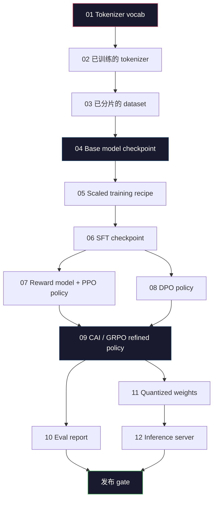
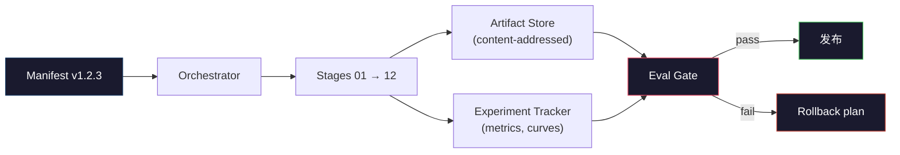

# بناء خط أنابيب كاملة لدرجة الماجستير

> دروس 01 إلى 12 ، كل المحتويات ، هي واحدة من مراحل نفس الأنابيب. هذا هو تحويل هذه المراحل إلى خطة عمل واحدة من نهاية إلى نهاية: التوكينيز ، التوقيت ، التوسع ، المقياس ، التقييم ، الكمبيوتر الكمبيوتر.

**Type:** Build
**Languages:** Python (stdlib)
**Prerequisites:** All Phase 10 lessons 01-12
**Time:** ~120 minutes

## 學习目标
- 将前十一课(tokenizer、data、pre-training、scaling、SFT、RLHF、DPO、CAI、eval、quantization、inference) 组合成 a可复现的管道 spec
- تعريف عقد الأثاث بين كل مراحل: كل مرحلة consume what 產出什么، وكذلك كيفية التحقق من الدخول في المرحلة التالية
- بناء منظمة موسيقية، لمتابعة التجارب، على الأثاث، إجراء الهش، و على أساس عتبة تقييم القرار ما إذا كان من خلال البوابة الإصدارية
- تصميم خطة إعادة التأهيل: أي أثاث سوف تجلب ثمن أقل، والتي ستكون مرتفعة، ومراقبة سيئة

## 问题
السابق كل دورة قادرة على العمل بشكل مستقل. Tokenizer 已训练完成. GPT 已完成预训练. SFT المجموعة البيانات 已组装.

تمارس تدريبات الحدود ليس لوح ذكي. Llama 3 405B تقريباً استغرق 30 مليون ساعة H100، استمر حوالي 54 天. DeepSeek-V3 استخدم حوالي 2.8 مليون ساعة H800. في هذا الوقت، هناك نقطة تفتيش فاسدة، ومرة تلوث البيانات، ومرة تراجع تقييم، ويمكن أن يجعل الفريق يخسر ساعة الجدار ومرة واحدة في الميزانية.

هذا هو الحجر النهائي. لن تقوم بالعمل على جهاز الكمبيوتر المحمول من نهاية إلى آخر. ستقوم بتدوين المنسق المنسق لكل مرحلة. ستقوم بتصريح بيانات عملية التشغيل. ستقوم بتصريح مصادقة البوابة. وستسمح للطرف الثالث بإعادة تشغيل عملك من ملف واحد.

هذا النموذج من 100M إلى 1T المعلمات لا تتغير. نفس الأربعة مكونات - المظهر أو الموسيقي أو البوابة أو المعدات المخزن - 既能运行 Llama 3 ،也能运行 GPT المتبقية.

## 概念
### المراحل الثانية عشر

كل جزء من المرحلة 10  الدروس هي مرحلة واحدة 



阶段 07 和 08 يمكن المضي قدما في عملية التشغيل. جميع المراحل الأخرى هي صعبة الاعتماد.

### الظهور

المخطط هو ملف واحد، ويجب أن يكون وصف عملية واحدة كاملًا ليتم إعادة تشغيله. أي محتوى ينشأ من خط الأنابيب لا ينبغي أن يعتمد على حالة خارج المخطط.

```
pipeline_version: 1.2.3
seed: 42
git_commit: a1b2c3d4
stages:
  01_tokenizer:
    recipe: bpe_32k
    input_hash: sha256:...
    output_hash: sha256:...
    wall_clock_sec: 3600
    cost_usd: 12
```

阶段 N 的输出哈希 就是阶段 N+1 的输入哈希──只要有任何偏差,管道就会停止──这就是你尽早发现数据腐败的方法──这也是不同大陆的队友验证他们的重播是否产生与你相同的艺术品──

في الممارسة العملية، يستخدم الفريق مخطط صغير YAML، بالإضافة إلى فحص إضافي، لتنفيذ التفاوت في عملية النجاح في المرة السابقة. أي شيء يظهر في الوقت الحالي في الحالة المتوقعة.

### تطبيق الأثاث

كل مرحلة من المخرجات هي مصنوعة من النمط. ليس مجرد بلاغ فهرامي، وليس حشرة، ولكن مع نمط معروف من نوع الاسم.

| Stage | Artifact Type | Key Fields |
|-------|--------------|-----------|
| 01-02 | Tokenizer | vocab.json, merges.txt, config.json, hash |
| 03 | Dataset | shards[], row count, token count, dedup stats |
| 04-05 | Checkpoint | weights.safetensors, config.json, optimizer state, step count |
| 06 | SFT Model | checkpoint + SFT recipe + data mix |
| 07 | Reward Model | RM checkpoint + preference data hash |
| 08-09 | Policy | checkpoint + reference hash + beta + KL budget consumed |
| 10 | Eval Report | benchmark scores + regression diffs + eval data hash |
| 11 | Quantized Model | quantized weights + calibration data + accuracy delta vs FP16 |
| 12 | Server Spec | endpoint + model hash + config + observability hooks |

النشر 能防止最常见失败模式:把阶段 08 的输出当成阶段 06 的输入,通过SFT 路径发布一个DPO 训练过的模型──类型的文物和类型的阶段签名将让这些错误变成编译时失败,而不是第五天才发现的失败──

### بوابة إيفال

发布不是培训完成──发布是培训完成 评估门通过── 门 在运行开始前就定义好──

```
gates:
  mmlu:      >= baseline + 0.5   # 无 regression
  humaneval: >= baseline + 1.0
  truthfulqa: >= baseline         # 无下降
  safety_refusal_rate: <= 0.05
  kl_from_reference: <= 25.0
  cost_total_usd: <= 50000
```

كل بوابة هي عددية عتبة. لا يوجد أي إشارة ذاتية. لا يوجد أي علامة. إذا تم عبور جميع البوابات، سيتم وضع علامة على أن البوابة يمكن شحنها.

两个门 能抓住大多数灾难──*الراجعة*البوابة(新模型在核心基准上必须至少和之前一样好) 能抓住培训 bugs──*KL预算*بوابة(تحالف السياسة 偏离参考程度不能超过 X) 能抓住排列 过度加工──每个生产管道都同时拥有这两者──

### الموسيقي

هذا هو الحكم الصغير، وراء إصدار المخططات، وراء مراحل الإرسال، وراء أدوات التتبع، وراء أي خرق عقد، ووقفها.

مهام الموسيقي ضيقة جداً:

1. من المظهر 解析 DAG。
2. لكل مرحلة، تحقق إن كان المنتج المنتظر موجودًا بشكل صحيح
3. 运行该阶段,捕获 stdout/stderr, قياس الساعة الحائط 和 التكلفة
4. 根据下游阶段预期的输入哈希 验证输出哈希──
5. عندما يفشل, الكتابة تحتوي على بيان جزئي للمرحلة الفشل, ومع ذلك في حالة غير صفر

هذا حوالي 200 صف Python. سوف تبدو مثل هذه الصف`code/main.py`文件──底层真实管道 会使用 `torchrun`أو`ray`في المجموعات أعلى تنفيذ كل مرحلة، ولكن الموسيقي نفسه يعمل على الجهاز الواحد.

### التتبع التجريبي و تخزين الأثاث

نظام خارجي يدفع خط الأنابيب

**Experiment tracker (wandb, neptune, mlflow).**按阶段记录损失曲线、eval metrics、system telemetry──当你三周后需要比较运行 A 和运行 B 时,tracker就是你查看的地方──团队几乎总是使用主机追踪器──自我写会浪费本应用于训练时间──

**Artifact store (S3, R2, GCS).**تستخدم نقاط التفتيش، مجموعات البيانات، التوكينزرز، التقارير المختلفة المواد المتخزنة.`latest.pt`هذا الاسم هو بندقية القدم`ckpt-7b-step-20000-sha256:abc123.safetensors`فقط هو العقد

الموسيقي 会同时写入二者──Tracker 面向看图表的人──متجر الأثرية 面向需要查找输入的下一个阶段──

### التكلفة

الحدود تُحدد رقمًا واحدًا

**Pre-run estimate.**من المظهر  حساب المتوقع FLOPs ((مقبل التدريب:6 x سمات x رموز) ‬ ساعات GPU المتوقعة ‬FLOPs / ذروة الإنتشار / الاستخدام) ، وكذلك حسب معدل الإيجار ‬ ‬ ‬ ‬ ‬ ‬ ‬ ‬ ‬ ‬ ‬ ‬ ‬ ‬ ‬ ‬ ‬ ‬ ‬ ‬ ‬ ‬ ‬ ‬ ‬ ‬ ‬ ‬ ‬ ‬ ‬ ‬ ‬ ‬ ‬ ‬ ‬ ‬ ‬ ‬ ‬ ‬ ‬ ‬ ‬ ‬ ‬ ‬ ‬ ‬ ‬ ‬ ‬ ‬ ‬ ‬ ‬ ‬ ‬ ‬ ‬ ‬ ‬ ‬ ‬ ‬ ‬ ‬ ‬ ‬ ‬ ‬ ‬ ‬ ‬ ‬ ‬ ‬ ‬ ‬ ‬ ‬ ‬ ‬ ‬ ‬ ‬ ‬ ‬ ‬ ‬ ‬ ‬ ‬ ‬ ‬ ‬ ‬ ‬ ‬ ‬ ‬ ‬ ‬ ‬ ‬ ‬ ‬ ‬ ‬ ‬ ‬ ‬ ‬ ‬ ‬ ‬ ‬ ‬ ‬ ‬ ‬ ‬ ‬ ‬ ‬ ‬ ‬ ‬ ‬ ‬ ‬ ‬ ‬ ‬ ‬ ‬ ‬ ‬ ‬ ‬ ‬ ‬ ‬ ‬ ‬ ‬ ‬ ‬ ‬ ‬ ‬ ‬ ‬ ‬ ‬ ‬ ‬ ‬ ‬ ‬ ‬ ‬ ‬ ‬ ‬ ‬ ‬ ‬ ‬ ‬ ‬ ‬ ‬ ‬ ‬ ‬ ‬ ‬ ‬ ‬ ‬ ‬ ‬ ‬ ‬ ‬ ‬ ‬ ‬ ‬ ‬ ‬ ‬ ‬ ‬ ‬ ‬ ‬ ‬ ‬ ‬ ‬ ‬ ‬ ‬ ‬ ‬ ‬ ‬ ‬ ‬ ‬ ‬ ‬ ‬ ‬ ‬ ‬ ‬ ‬ ‬ ‬ ‬ ‬ ‬ 

**In-run tracking.**阶段的墙钟 和成本会记录到表. بعد كل مرحلة،都会检查剩余预算. إذا كان مرحلة ما تتجاوز، فان البوابة التالية سوف تستخدم الميزانية المتبقية الجديدة لتقييمها.

تكلفة تقرير Llama 3$61M。DeepSeek-V3 报告 main pre-training run 为 $5.6M. هذا النسبة يأتي بشكل رئيسي من كفاءة الأجهزة بالإضافة إلى مزيج من الخبراء -- ولكن التكلفة المحددة 之所以可见، لأن الفريقين يتبعون على مراحل، وليس فقط على كامل التشغيلات تتبعون.

### إعادة التكاثر مقابل التحديد

ثانياً مختلفة. * قابل للتنظيم* يعني نفس المظهر + نفس الرمز + نفس البنية التحتية، سوف تنتج نقطة تفتيش في المقاييس التدريبية التدريبية العليا.

现代 LLM التدريب هو قابلة للتكرار، ولكن ليس ديمينستية. التدريب الموزع من الحد من النظام ‬الجبيو kernel غير ديمينزمية ((cuBLAS‬ فلاش-attn) وكذلك التدريب المختلط دقة سوف تنشأ بشكل مشترك بين 1e-5  درجات مختلفة المتداولة.



### خطة الرد

في بداية التشغيل، اكتبوا كل مرحلة عندما تفشل ما سيحدث.

- **重新运行成本低**(ساعات): توكينيزر、ال、كوانتيزيشن、خادم الإستعراضات‬‬‬‬‬‬‬‬‬‬‬‬‬‬‬‬‬‬‬‬‬‬‬‬‬‬‬‬‬‬‬‬‬‬‬‬‬‬‬‬‬‬‬‬‬‬‬‬‬‬‬‬‬‬‬‬‬‬‬‬‬‬‬‬‬‬‬‬‬‬‬‬‬‬‬‬‬‬‬‬‬‬‬‬‬‬‬‬‬‬‬‬‬‬‬‬‬‬‬‬‬‬‬‬‬‬‬‬‬‬‬‬‬‬‬‬‬‬‬‬‬‬‬‬‬‬‬‬‬‬‬‬‬‬‬‬‬‬‬‬‬‬‬‬‬‬‬‬‬‬‬‬‬‬‬‬‬‬‬‬‬‬‬‬‬‬‬‬‬‬‬‬‬‬‬‬‬‬‬‬‬‬‬‬‬‬‬‬‬‬‬‬‬‬‬‬‬‬‬‬‬‬‬‬‬‬‬‬‬‬‬‬‬‬‬‬‬‬‬‬‬‬‬‬‬‬‬‬‬‬‬‬‬‬‬‬‬‬‬‬‬‬‬‬‬‬‬‬‬‬‬‬‬‬‬‬‬‬‬‬‬‬‬‬‬‬‬‬‬‬‬‬‬‬‬‬‬‬‬‬‬‬‬‬‬‬‬‬‬‬‬‬‬‬‬‬‬‬‬‬‬‬‬‬‬‬‬‬‬‬‬‬‬‬‬‬‬‬‬‬‬‬‬‬‬‬‬‬‬‬‬‬‬‬‬‬‬‬‬‬‬‬‬‬‬‬‬‬‬‬‬‬‬‬‬‬‬‬‬‬‬‬‬‬‬‬‬‬‬‬‬‬‬‬‬‬‬‬‬‬‬‬‬‬‬‬‬‬‬‬‬‬‬‬‬‬‬‬‬‬‬‬‬‬‬‬‬‬‬‬‬‬‬‬‬‬‬‬‬‬‬‬‬‬‬‬‬‬‬‬‬‬‬‬‬‬‬‬‬‬‬‬‬‬‬‬‬‬‬‬‬‬‬‬‬‬‬‬‬‬‬‬‬‬‬‬‬‬‬‬‬‬‬‬‬‬‬‬‬‬‬‬‬‬‬‬
- **中等成本**(أيام):SFT、DPO、CAI── الحفاظ على النموذج الأساسي؛ فقط إعادة تنفيذ مراحل التنظيم‬
- **成本高**(أسابيع و ملايين دولار): التدريب المسبق. خطة إعادة التدريب في هذا المجال ليست إعادة التدريب.

لأن الاعتمادات على المرحلة هي المخطوطة والمتميزة، يمكن للمؤلف تحديد التداول التدريجي تلقائيا: make failure阶段 وكل ذريةها 失效.阶段 06(SFT) failure will make 06、07、08、09、10、11、12 失效.阶段 11(تقييم) failure will only make 11 和 12 失效.

### 2026 سنة مشاهدة

معظم فرق الحدود حصلت على نفس العظم

- Tokenizer:128k BPE مع تعويض البايتات  على أساس صغير  توازن
- إشارات ما قبل التدريب:10-20T، بشكل رئيسي بواسطة شبكة الإنترنت 加 رمز 加合成 组成──Muon أو AdamW محسن──FSDP2 أو DeepSpeed ZeRO-3── تدقيق التفتيشات Gradential checkpointing──BF16 weights,FP32 master──
- SFT:500k-2M أزواج التعليمات، مختلطة البشر و المختلطة،并严格对评估集做 dedup──
- التوجه: DPO أو CAI + GRPO  فقط في إشارة تفضيل لـ DPO لتنظيم الوقت المختلف لاستخدام RLHF
- Eval:MMLU-Pro、MATH、HumanEval+、GPQA、SWE-Bench Verified、LiveBench،إضافة إلى مجموعة عامة مستقلة خاصة
- الكمية:خدمة استخدام GPTQ أو AWQ 4 بتات؛ دقة النقاط  تقييمات السلامة الهامة استخدام 8- بتات
- خدمة:vLLM、TensorRT-LLM أو في المنزل。إعداد المواصلات‬‬‬‬‬‬‬‬‬‬‬‬‬‬‬‬‬‬‬‬‬‬‬‬‬‬‬‬‬‬‬‬‬‬‬‬‬‬‬‬‬‬‬‬‬‬‬‬‬‬‬‬‬‬‬‬‬‬‬‬‬‬‬‬‬‬‬‬‬‬‬‬‬‬‬‬‬‬‬‬‬‬‬‬‬‬‬‬‬‬‬‬‬‬‬‬‬‬‬‬‬‬‬‬‬‬‬‬‬‬‬‬‬‬‬‬‬‬‬‬‬‬‬‬‬‬‬‬‬‬‬‬‬‬‬‬‬‬‬‬‬‬‬‬‬‬‬‬‬‬‬‬‬‬‬‬‬‬‬‬‬‬‬‬‬‬‬‬‬‬‬‬‬‬‬‬‬‬‬‬‬‬‬‬‬‬‬‬‬‬‬‬‬‬‬‬‬‬‬‬‬‬‬‬‬‬‬‬‬‬‬‬‬‬‬‬‬‬‬‬‬‬‬‬‬‬‬‬‬‬‬‬‬‬‬‬‬‬‬‬‬‬‬‬‬‬‬‬‬‬‬‬‬‬‬‬‬‬‬‬‬‬‬‬‬‬‬‬‬‬‬‬‬‬‬‬‬‬‬‬‬‬‬‬‬‬‬‬‬‬‬‬‬‬‬‬‬‬‬‬‬‬‬‬‬‬‬‬‬‬‬‬‬‬‬‬‬‬‬‬‬‬‬‬‬‬‬‬‬‬‬‬‬‬‬‬‬‬‬‬‬‬‬‬‬‬‬‬‬‬‬‬‬‬‬‬‬‬‬‬‬‬‬‬‬‬‬‬‬‬‬‬‬‬‬‬‬‬‬‬‬‬‬‬‬‬‬‬‬‬‬‬‬‬‬‬‬‬‬‬‬‬‬‬‬‬‬‬‬‬‬‬‬‬‬‬‬‬‬‬‬‬‬‬‬‬‬‬‬‬‬‬‬‬‬‬‬‬‬‬‬‬‬‬‬‬‬‬‬‬‬‬‬‬‬‬‬‬‬‬‬‬‬‬‬‬‬‬‬‬‬‬‬‬‬‬‬‬‬‬‬‬‬‬‬‬‬

الأرقام ستتغير كل ستة أشهر.


```figure
beam-search
```

## بناءها
هذا المفهوم هو الموسيقي و المفتاح المبين، وليس 12 نصوص التدريب. كل مرحلة تستخدم محفظة مكان.

完整实现见 `code/main.py`❖ الجزء الرئيسي:

- `Manifest`فئة البيانات: نسخة الأنابيب 、بذور 、جيت commit 、 مراحل ٬بوابات‬
- `Stage`فئة البيانات:اسم ‬نوع ‬المدخلات ‬الهيشات ‬المخرجات ‬الهيشات ‬الساعة الحائطية ‬التكلفة‬
- `Orchestrator.run()`:解析 DAG、إرسال مراحل、验证 hashes、更新 manifest‬
- `EvalGate.check()`: Read取 عتبة ✓ مع آخر تقرير تقييم 比较、返回通过/فشل‬
- `ArtifactStore`(في الذاكرة): حسب الجهاز التشويقي وضع/حصل،模拟 S3。
- `CostTracker`: في كل مرحلة و التكلفة الإجمالية، فوق الحد الأقصى 时停止──

`main.py`سيتم تشغيل خط الأنابيب المركزي 12 مرحلة من المواقف، وتوليد بيان، وتعرض بوابة تقييم فاشلة، لتظهر شكل تشغيل تمت.

## استخدمها
سير العمل القنوني لديه ثلاثة أوامر

```
python code/main.py plan    # 验证 manifest，计算 cost estimate，打印 DAG
python code/main.py run     # 执行 stages，写入 manifest.out.yaml
python code/main.py gate    # 读取 manifest.out.yaml，应用 eval gates，ship-or-hold
```

كل مرة كلّها تعمل`plan`◊ معظم أخطاء خطوط الأنابيب 会在计划时间 出现 -- 缺失门门、固定的 هشات、超额预算──运行 `plan`هو مجاني.`run`من ثمّة جداً.

`gate`من المخرجات`SHIP`، أو`HOLD: <reason>` تم إنجازها ليس فشلاً؛ إنها نقطة قرارها.

## 交付 it
本课会产出 `outputs/skill-llm-pipeline-reviewer.md` إعطاء إشارة خط أنابيب مقترحة ، فإنها ستفحص جميع العقود: الخطوط المرحلة ، سلسلة الهاش ، البوابات ، خطة العودة ، تقدير التكلفة.

## التدريب
1. 扩展管弦乐器,让它支持阶段 07 和 08 的并行执行──使用 stdlib `concurrent.futures`تم التأكيد على المظهر النهائي  سجل إصدار مرحلتين، و هيش المدخل للمرحلة 09 هو مزيج تحديدي للثانية 

2. 添加一个污染检查门──给定 eval数据集 hash 和训练数据集碎片,计算重叠(الانسجام الدقيق للسلسلة أو 13 جرام)──如果重叠 超过 0.1%,gate 失败──进入一个被污染的训练集,并确认门将保持这次运行──

3. من المبادئ الأولى  تنفيذ تقدير التكلفة  للفترة 04  التدريب المسبق) ، سوف FLOPs  تقدير 6 × پارامز x رموز، افتراض H100 فوق BF16  989 TFLOPs، MFU  استخدام النموذج FLOPs) 40٪، السعر هو 2.50 $/GPU-ساعة  تقرير تقييم نموذج 7B في رموز 2T 上训练  مع علماء Llama 2 数字比较.

4. 构建部分滚倒――模拟阶段 09(CAI) فشل، ثم في حالة الحفاظ على 01-08 محفظة إعادة التشغيل المرحلة 09 إلى 12──Orchestrator 应通过哈ش 检查缓存文物并跳过它们──测量与完整重新运行相比省的墙钟──

5. 添加可观性──发发发 OpenTelemetry span,属性包括参数、代码见、损失 和成本──将 span 管道传到本地收藏器──重点不是仪表板;重点是每个阶段的健康 都能通过单个痕迹ID 追踪──

## 关键术语
| Term | What people say | What it actually means |
|------|----------------|----------------------|
| Manifest | “recipe file” | 描述 pipeline version、seed、per-stage config 和 gate thresholds 的 YAML 或 JSON，足以 replay 一次 run |
| Content-addressed | “按 hash 而不是 name” | Artifacts 按其内容的 SHA-256 存储，因此你永远不会把 version A 和 version B 混淆 |
| Eval gate | “发布标准” | Benchmark metrics 和 safety scores 上的 numeric thresholds，必须通过后 artifact 才会被标记为 shippable |
| KL budget | “alignment drifted 有多远” | 对 alignment stages 上累计 KL(policy || reference) 的 cap，并作为 gate 强制执行 |
| MFU | “你用了多少 GPU” | Model FLOPs Utilization，即 achieved FLOPs 除以 theoretical peak。70B scale 典型值为 40%，7B 为 55% |
| Rollback plan | “出问题时我们做什么” | 每个阶段失败时预先写好的 actions：re-run、fall back、使用修订后的 inputs retrain |
| Orchestrator | “conductor” | 读取 manifest、dispatch stages、验证 hashes，并在任何 contract violation 时停止的 process |
| Artifact store | “用于 weights 的 versioned S3” | Immutable content-addressed object store，是 checkpoints、datasets、eval reports 的 single source of truth |
| Reproducible | “Replay 时 metrics 相同” | Bit-level weights 不同但 downstream metrics 等价，这是 distributed LLM training 的现实目标 |
| Cost gate | “不能超过 X” | Pre-run cost estimate 加 in-run tracker；如果 estimate 超过 budget，pipeline 会拒绝启动 |

## 延伸阅读
- [Dubey et al., 2024 -- "The Llama 3 Herd of Models"](https://arxiv.org/abs/2407.21783)-- على خط الأنابيب الحدودية التفصيلية والفتوحة، وتشمل البيانات والتدريب والتوافق
- [DeepSeek-AI, 2024 -- "DeepSeek-V3 Technical Report"](https://arxiv.org/abs/2412.19437)-- خط الأنابيب الأولوية للافعالية، تكلفة حوالي 1/10 من تدريب فئة Llama 3
- [Kaplan et al., 2020 -- "Scaling Laws for Neural Language Models"](https://arxiv.org/abs/2001.08361)-- أصل الحوسبة-بيانات-الجهازات العلاقة على نطاق واسع
- [Hoffmann et al., 2022 -- "Training Compute-Optimal Large Language Models (Chinchilla)"](https://arxiv.org/abs/2203.15556)-- على تعديل كابلان، إعادة تحديد الميزانيات البيانات الحديثة
- [PyTorch FSDP2 documentation](https://pytorch.org/docs/stable/fsdp.html)-- في PyTorch 2.4+ 中 بديل FSDP1 التدريب الموزع البدائي
- [Weights & Biases LLM Reports](https://wandb.ai/site/llms)-- مفتوح المصدر LLM تشغيل منشورات حقيقية و تجربة التتبع الخروج، يمكن استخدامها كملفات يمكن استعراضها
