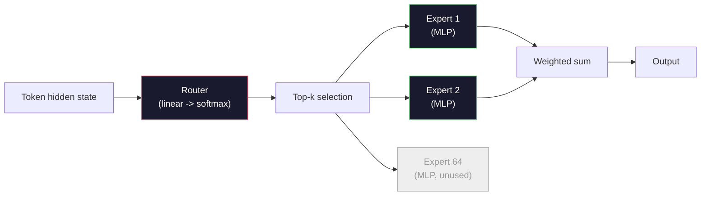

# النماذج المفتوحة: 架构讲解

> أنت في المرحلة الرابعة من الدرجة الثانية من الصفحة التجارية، وبناء نموذج مفتوح على هامش GPT-2 Small。2026 سنة  تنتمي إلى نفس العائلة، فقط هناك خمسة وستة تغييرات محددة。 باستخدام RMSNorm 取代 LayerNorm。 باستخدام SwiGLU 取代 GELU。 باستخدام RoPE 取代 المواقف المتعلمة。 باستخدام GQA أو MLA 取代 MHA كامل。 باستخدام مخلوط الخبراء。 أنت قد اكتسبت تغطية رياضية على نطاق واسع منها 95%。 本会并排阅读 Llama 3、DeepSeek-V3、Mixtral、Qwen 和 Gemma،并指出 كل بنية تحدث اختلافات محددة.

**Type:** Learn
**Languages:** Python (stdlib)
**Prerequisites:** Phase 10, Lessons 04, 05, 12 (Pre-training, Scaling, Inference)
**Time:** ~45 minutes

## 學习目标
- 阅读 Llama 3、Mistral、Mixtral、Gemma 2、Qwen 2.5 和 DeepSeek-V3 的 config.json,并解释每一个字段
- وتحدث عن كل نموذج مقارنة GPT-2 التغييرات المحددة في البنية التي تم القيام بها ، ومع ذلك من المبدأ الأول
- فقط حسب التكوين  حساب أي نموذج مفتوح                                                                                                                                                                                                                                                                                                                                                                                                                                                                                                                 
- في تحديد التخفيف ‬ذاكرة و القدرة ‬ ‬ ‬ ‬ ‬ ‬ ‬ ‬ ‬ ‬ ‬ ‬ ‬ ‬ ‬ ‬ ‬ ‬ ‬ ‬ ‬ ‬ ‬ ‬ ‬ ‬ ‬ ‬ ‬ ‬ ‬ ‬ ‬ ‬ ‬ ‬ ‬ ‬ ‬ ‬ ‬ ‬ ‬ ‬ ‬ ‬ ‬ ‬ ‬ ‬ ‬ ‬ ‬ ‬ ‬ ‬ ‬ ‬ ‬ ‬ ‬ ‬ ‬ ‬ ‬ ‬ ‬ ‬ ‬ ‬ ‬ ‬ ‬ ‬ ‬ ‬ ‬ ‬ ‬ ‬ ‬ ‬ ‬ ‬ ‬ ‬ ‬ ‬ ‬ ‬ ‬ ‬ ‬ ‬ ‬ ‬ ‬ ‬ ‬ ‬ ‬ ‬ ‬ ‬ ‬ ‬ ‬ ‬ ‬ ‬ ‬ ‬ ‬ ‬ ‬ ‬ ‬ ‬ ‬ ‬ ‬ ‬ ‬ ‬ ‬ ‬ ‬ ‬ ‬ ‬ ‬ ‬ ‬ ‬ ‬ ‬ ‬ ‬ ‬ ‬ ‬ ‬ ‬ ‬ ‬ ‬ ‬ ‬ ‬ ‬ ‬ ‬ ‬ ‬ ‬ ‬ ‬ ‬ ‬ ‬ ‬ ‬ ‬ ‬ ‬ ‬ ‬ ‬ ‬ ‬ ‬ ‬ ‬ ‬ ‬ ‬ ‬ ‬ ‬ ‬ ‬ ‬ ‬ ‬ ‬ ‬ ‬ ‬ ‬ ‬ ‬ ‬ ‬ ‬ ‬ ‬ ‬ ‬ ‬ ‬ ‬ ‬ ‬ ‬ ‬ ‬ ‬ ‬ ‬ ‬ ‬ ‬ ‬ ‬ ‬ ‬ ‬ ‬ ‬ ‬ ‬ ‬ ‬ ‬ ‬ ‬ ‬ ‬ ‬ ‬ ‬ ‬ ‬ ‬ ‬ ‬ ‬ ‬ ‬ ‬ ‬ ‬ ‬ ‬ ‬ ‬ ‬ ‬

## 问题
في الدورة الرابعة، كتبت 350 صفحة من النمط، حصلت على نموذج شكل GPT-2. علامة 3 405B لديها تقرير تقني من 200 صفحة.

هذا الدراسة هو اختلاف. بالنسبة لكل نموذج مفتوح رئيسي.

الفائدة الحقيقية هي: عندما يُصدر Meta Llama 5 أو DeepSeek V4 ، لا تحتاج إلى نموذج جديد للذكاء. سوف تلقي نظرة على التكوين ، وترى ما هي المجموعات المعرفية التي تم تحريكها ، ثم تعرف ما هو التأثير التنفيذي.

## 概念
### الجوهر المتغير

جميع النماذج المفتوحة السلطوية المتحركة تمت مشاركتها:

- رمز إضافة المصفوفة ((صوت_حجم x مخفية_الامتداد)
- N 个解码块的堆叠:norm、自我注意、残留、norm、MLP、残留──
- النموذج النهائي 和投影到 vocab_size 的直线头 (عادة ما تكون مرتبطة بالوزن مع التوابع)
- قناع السبب، الخسارة المتقاطعة التجريبية التالية

هذا هو الشكل.

### ستة أزرار تعمل بشكل حقيقي

في جميع النماذج المفتوحة في الفترة من 2024 إلى 2026, ستة خيارات تصميم نفسها تظهر مرة أخرى:

1. **Normalization.**الطبقة النظامية -> RMSNorm。
2. **Positional encoding.**تعلمت المطلقة -> RoPE(加上变体:YaRN、NTK)
3. **Activation.**جيلو -> سويجلو(أو جيلو)
4. **Attention head sharing.**المجلس الوطني للطاقة الذرية -> GQA -> MQA -> MLA。
5. **Dense vs sparse MLP.**كثيفة -> مزيج من الخبراء
6. **Pre-norm placement.**保持 قبل القاعدة.

其他一切(توقيت معدل التعلم ‬مزيج البيانات ‬حجم المجموعة ‬طول السياق) كلها تابعة لتكوين التدريب، وليس البنية‬‬‬‬‬‬‬‬‬‬‬‬‬‬‬‬‬‬‬‬‬‬‬‬‬‬‬‬‬‬‬‬‬‬‬‬‬‬‬‬‬‬‬‬‬‬‬‬‬‬‬‬‬‬‬‬‬‬‬‬‬‬‬‬‬‬‬‬‬‬‬‬‬‬‬‬‬‬‬‬‬‬‬‬‬‬‬‬‬‬‬‬‬‬‬‬‬‬‬‬‬‬‬‬‬‬‬‬‬‬‬‬‬‬‬‬‬‬‬‬‬‬‬‬‬‬‬‬‬‬‬‬‬‬‬‬‬‬‬‬‬‬‬‬‬‬‬‬‬‬‬‬‬‬‬‬‬‬‬‬‬‬‬‬‬‬‬‬‬‬‬‬‬‬‬‬‬‬‬‬‬‬‬‬‬‬‬‬‬‬‬‬‬‬‬‬‬‬‬‬‬‬‬‬‬‬‬‬‬‬‬‬‬‬‬‬‬‬‬‬‬‬‬‬‬‬‬‬‬‬‬‬‬‬‬‬‬‬‬‬‬‬‬‬‬‬‬‬‬‬‬‬‬‬‬‬‬‬‬‬‬‬‬‬‬‬‬‬‬‬‬‬‬‬‬‬‬‬‬‬‬‬‬‬‬‬‬‬‬‬‬‬‬‬‬‬‬‬‬‬‬‬‬‬‬‬‬‬‬‬‬‬‬‬‬‬‬‬‬‬‬‬‬‬‬‬‬‬‬‬‬‬‬‬‬‬‬‬‬‬‬‬‬‬‬‬‬‬‬‬‬‬‬‬‬‬‬‬‬‬‬‬‬‬‬‬‬‬‬‬‬‬‬‬‬‬‬‬‬‬‬‬‬‬‬‬‬‬‬‬‬‬‬‬‬‬‬‬‬‬‬‬‬‬‬‬‬‬‬‬‬‬‬‬‬‬‬‬‬‬‬‬‬‬‬‬‬‬‬‬‬‬‬‬‬‬‬‬‬‬‬‬‬‬‬‬‬‬‬‬‬‬‬‬‬‬‬‬‬‬‬‬‬‬

### القنبلة 1: RMSNorm

LayerNorm 会减去平均值、除以 std、缩放并平移──RMSNorm فقط الاحتفاظ بال缩放:

```
RMSNorm(x) = x / sqrt(mean(x^2) + eps) * gamma
```

没有均值消除──没有偏见──每个代币少一次 matmul── Zhang and Sennrich (2019) 认为它在机器翻译上可以匹配LayerNorm,同时快 10%──所有现代开放模型都使用它──

代价:没有──收益: 微幅吞吐量 提升,代码更简单──

### القنبلة الثانية:

تعلّم المواقع المُثبتة في GPT-2 هو 1024 槽位的查找表── السياق 1025 就超出表的末端──模型不能外推到训练长度之外──

إضافة الموقف الدوار ((روبي، سو وغيرهم 2021) من خلال منتج نقطة الاهتمام  قبل، سوف كل Q و K المتجهة ة ة ة ة ة ة ة ة ة ة ة ة ة ة ة ة ة ة ة ة ة ة ة ة ة ة ة ة ة ة ة ة ة ة ة ة ة ة ة ة ة ة ة ة ة ة ة ة ة ة ة ة ة ة ة ة ة ة ة ة ة ة ة ة ة ة ة ة ة ة ة ة ة ة ة ة ة ة ة ة ة ة ة ة ة ة ة ة ة ة ة ة ة ة ة ة ة ة ة ة ة ة ة ة ة ة ة ة ة ة ة ة ة ة ة ة ة ة ة ة ة ة ة ة ة ة ة ة ة ة ة ة ة ة ة ة ة ة ة ة ة ة ة ة ة ة ة ة ة ة ة ة ة ة ة ة ة ة ة ة ة ة ة ة ة ة ة ة ة ة ة ة ة ة ة ة ة ة ة ة ة ة ة ة ة ة ة ة ة ة ة ة ة ة ة ة ة ة ة ة ة ة ة ة ة ة ة ة ة ة ة ة ة ة ة ة ة ة ة ة ة ة ة ة ة ة ة ة ة ة ة ة ة ة ة ة 

```
q_rotated = rotate(q, angle(pos))
k_rotated = rotate(k, angle(pos))
score = q_rotated . k_rotated
```

كلّ طبقة تستخدم روبي.

### القنبلة الثالثة: SwiGLU

GPT-2 من MLP هو`x -> gelu(xW1 + b1) -> (...)W2 + b2`〔SwiGLU(Shazeer 2020) مع منتج مغلق بدل تفعيل:

```
SwiGLU(x) = (xW1) * sigmoid(xW1) * xV
```

两个并行投射, بدلا من واحد, من قبل تنشيط سويش 进行 gate.实证上,它在每参数困难上更强. Llama 2 采用它,随后大家都跟进.`ff_dim = 4 * hidden`,SwiGLU استخدام `ff_dim = (2/3) * 4 * hidden = 8/3 * hidden`.

### القنبلة الرابعة: مشاركة الرأس

GPT-2 使用 **Multi-Head Attention (MHA)**كل رأس لديه مشهد Q 、K 、V الخاص به

**Multi-Query Attention (MQA, Shazeer 2019)**بين جميع الرؤوس  مشاركة K و V ‬ ‬ ‬ ‬ ‬ ‬ ‬ ‬ ‬ ‬ ‬ ‬ ‬ ‬ ‬ ‬ ‬ ‬ ‬ ‬ ‬ ‬ ‬ ‬ ‬ ‬ ‬ ‬ ‬ ‬ ‬ ‬ ‬ ‬ ‬ ‬ ‬ ‬ ‬ ‬ ‬ ‬ ‬ ‬ ‬ ‬ ‬ ‬ ‬ ‬ ‬ ‬ ‬ ‬ ‬ ‬ ‬ ‬ ‬ ‬ ‬ ‬ ‬ ‬ ‬ ‬ ‬ ‬ ‬ ‬ ‬ ‬ ‬ ‬ ‬ ‬ ‬ ‬ ‬ ‬ ‬ ‬ ‬ ‬ ‬ ‬ ‬ ‬ ‬ ‬ ‬ ‬ ‬ ‬ ‬ ‬ ‬ ‬ ‬ ‬ ‬ ‬ ‬ ‬ ‬ ‬ ‬ ‬ ‬ ‬ ‬ ‬ ‬ ‬ ‬ ‬ ‬ ‬ ‬ ‬ ‬ ‬ ‬ ‬ ‬ ‬ ‬ ‬ ‬ ‬ ‬ ‬ ‬ ‬ ‬ ‬ ‬ ‬ ‬ ‬ ‬ ‬ ‬ ‬ ‬ ‬ ‬ ‬ ‬ ‬ ‬ ‬ ‬ ‬ ‬ ‬ ‬ ‬ ‬ ‬ ‬ ‬ ‬ ‬ ‬ ‬ ‬ ‬ ‬ ‬ ‬ ‬ ‬ ‬ ‬ ‬ ‬ ‬ ‬ ‬ ‬ ‬ ‬ ‬ ‬ ‬ ‬ ‬ ‬ ‬ ‬ ‬ ‬ ‬ ‬ ‬ ‬ ‬ ‬ ‬ ‬ ‬ ‬ ‬ ‬ ‬ ‬ ‬ ‬ ‬ ‬ ‬ ‬ ‬ ‬ ‬ ‬ ‬ ‬ ‬ ‬ ‬ ‬ ‬ ‬ ‬ ‬ ‬ ‬ ‬ ‬ ‬ ‬ ‬ ‬ ‬ ‬ ‬ ‬ ‬ ‬ ‬ ‬ ‬ ‬ ‬ ‬ ‬ ‬ 

**Grouped-Query Attention (GQA, Ainslie et al. 2023)**هو النظام الوسطى: G 组 Q heads 共享一个 K 和一个 V。Llama 3 8B 使用 GQA,包含 32 个 Q heads 和 8 个 KV heads(G=8), لذلك相比较完整 MHA,KV cache 缩小 4x。

**Multi-Head Latent Attention (MLA, DeepSeek 2024)**في المجموعة المشتركة منخفضة الدرجة، إعادة الضغط الرأس 投影回去── يزيد من تقليل الاحتفاظ بالخزنة KV، مع الحفاظ على قدرة كل رأس على التعبير──DeepSeek-V2 و V3 يعتمد على تحقيق أداء السياق الطويل──

| Scheme | KV Heads | KV Cache | Accuracy |
|--------|----------|----------|----------|
| MHA    | num_heads | full | 最好 |
| GQA    | num_groups (G < num_heads) | num_heads / G 缩减 | 接近 MHA |
| MQA    | 1 | num_heads 缩减 | 小幅损失 |
| MLA    | latent, per-head decompression | 小于 MQA | 接近 MHA |

بالنسبة لأي نموذج يتجاوز 13B 参数، GQA أو MLA  في الواقع كلها ضرورية 

### القنبلة 5: خليط من الخبراء

MLP كثيفة سوف تقوم بكل رمز  تنشيط جميع العناصر  MLP MoE في كل كتلة هناك K 个 خبراء، فضلا عن جهاز توجيه، فإنه للكل رمز  اختيار أعلى-k خبراء  عادة ما يكون أعلى-2) 

```
router_logits = xW_r
indices, weights = top_k(router_logits, k=2)
output = sum_i weights[i] * expert[indices[i]](x)
```

الجذب هو: يمكنك أن يكون لديك 64 ٪ من كل 7B كبير الخبراء، ولكن كل رمز فقط 2 ٪ من ذلك ٪ ٪ ٪ ٪ ٪ ٪ ٪ ٪ ٪ ٪ ٪ ٪ ٪ ٪ ٪ ٪ ٪ ٪ ٪ ٪ ٪ ٪ ٪ ٪ ٪ ٪ ٪ ٪ ٪ ٪ ٪ ٪ ٪ ٪ ٪ ٪ ٪ ٪ ٪ ٪ ٪ ٪ ٪ ٪ ٪ ٪ ٪ ٪ ٪ ٪ ٪ ٪ ٪ ٪ ٪ ٪ ٪ ٪ ٪ ٪ ٪ ٪ ٪ ٪ ٪ ٪ ٪ ٪ ٪ ٪ ٪ ٪ ٪ ٪ ٪ ٪ ٪ ٪ ٪ ٪ ٪ ٪ ٪ ٪ ٪ ٪ ٪ ٪ ٪ ٪ ٪ ٪ ٪ ٪ ٪ ٪ ٪ ٪ ٪ ٪ ٪ ٪ ٪ ٪ ٪ ٪ ٪ ٪ ٪ ٪ ٪ ٪ ٪ ٪ ٪ ٪ ٪ ٪ ٪ ٪ ٪ ٪ ٪ ٪ ٪ ٪ ٪ ٪ ٪ ٪ ٪ ٪ ٪ ٪ ٪ ٪ ٪ ٪ ٪ ٪ ٪ ٪ ٪ ٪ ٪ ٪ ٪ ٪ ٪ ٪ ٪ ٪ ٪ ٪ ٪ ٪ ٪ ٪ ٪ ٪ ٪ ٪ ٪ ٪ ٪ ٪ ٪ ٪ ٪ ٪ ٪ ٪ ٪ ٪ ٪ ٪ ٪ ٪ ٪ ٪ ٪ ٪ ٪ ٪ ٪ ٪ ٪ ٪ ٪ ٪ ٪ ٪ ٪ ٪ ٪ ٪ ٪ ٪ ٪ ٪ ٪ ٪ ٪ ٪ ٪ ٪ ٪ ٪ ٪ ٪ ٪ ٪ ٪ ٪ ٪ ٪ ٪ ٪ ٪ ٪ ٪ ٪ ٪ ٪ ٪ ٪ ٪ ٪ ٪ ٪ ٪ ٪ ٪ ٪ ٪ ٪ ٪ ٪ ٪ ٪ 



优点: نفس الحساب 更多参数 更多强容量──缺点:الذاكرة الخبيرة 仍然必须放在某处((所以 خدمة 需要比密集等价模型更多的VRAM) تحقيق التوازن في الحمل للجهاز التوجه 很难,而且在调整期间 调整路由器 本身就是一个研究领域──

### القنبلة 6: البقاء قبل المعايير

المتحول الأول في كل طبقة فرعية  بعد تطبيق الطبقة القياسية  منذ GPT-2، كل نموذج مفتوح وضعها في كل طبقة فرعية * قبل*。 قبل القاعدة في التدريب العميقة صارمة أكثر سهولة ‬ لا يوجد خلاف‬‬‬‬‬‬‬‬‬‬‬‬‬‬‬‬‬‬‬‬‬‬‬‬‬‬‬‬‬‬‬‬‬‬‬‬‬‬‬‬‬‬‬‬‬‬‬‬‬‬‬‬‬‬‬‬‬‬‬‬‬‬‬‬‬‬‬‬‬‬‬‬‬‬‬‬‬‬‬‬‬‬‬‬‬‬‬‬‬‬‬‬‬‬‬‬‬‬‬‬‬‬‬‬‬‬‬‬‬‬‬‬‬‬‬‬‬‬‬‬‬‬‬‬‬‬‬‬‬‬‬‬‬‬‬‬‬‬‬‬‬‬‬‬‬‬‬‬‬‬‬‬‬‬‬‬‬‬‬‬‬‬‬‬‬‬‬‬‬‬‬‬‬‬‬‬‬‬‬‬‬‬‬‬‬‬‬‬‬‬‬‬‬‬‬‬‬‬‬‬‬‬‬‬‬‬‬‬‬‬‬‬‬‬‬‬‬‬‬‬‬‬‬‬‬‬‬‬‬‬‬‬‬‬‬‬‬‬‬‬‬‬‬‬‬‬‬‬‬‬‬‬‬‬‬‬‬‬‬‬‬‬‬‬‬‬‬‬‬‬‬‬‬‬‬‬‬‬‬‬‬‬‬‬‬‬‬‬‬‬‬‬‬‬‬‬‬‬‬‬‬‬‬‬‬‬‬‬‬‬‬‬‬‬‬‬‬‬‬‬‬‬‬‬‬‬‬‬‬‬‬‬‬‬‬‬‬‬‬‬‬‬‬‬‬‬‬‬‬‬‬‬‬‬‬‬‬‬‬‬‬‬‬‬‬‬‬‬‬‬‬‬‬‬‬‬‬‬‬‬‬‬‬‬‬‬‬‬‬‬‬‬‬‬‬‬‬‬‬‬‬‬‬‬‬‬‬‬‬‬‬‬‬‬‬‬‬‬‬‬‬‬‬‬‬‬‬‬‬‬‬‬‬‬‬‬‬‬‬‬‬‬‬‬‬

### فرق النموذج عن النموذج

وذلك في المقالة التالية.

| Model | Year | Total Params | Active Params | Norm | Activation | Position | Attention | MoE | Context |
|-------|------|-------------|---------------|------|-----------|----------|-----------|-----|---------|
| GPT-2 Small | 2019 | 124M | 124M | LayerNorm | GELU | Learned | MHA (12 heads) | no | 1k |
| Llama 3 8B | 2024 | 8B | 8B | RMSNorm | SwiGLU | RoPE | GQA (32/8) | no | 128k |
| Llama 3 70B | 2024 | 70B | 70B | RMSNorm | SwiGLU | RoPE | GQA (64/8) | no | 128k |
| Llama 3 405B | 2024 | 405B | 405B | RMSNorm | SwiGLU | RoPE | GQA (128/16) | no | 128k |
| Mistral 7B | 2023 | 7.2B | 7.2B | RMSNorm | SwiGLU | RoPE | GQA | no | 32k |
| Mixtral 8x7B | 2023 | 47B | 13B | RMSNorm | SwiGLU | RoPE | GQA | yes (8 experts, top-2) | 32k |
| Gemma 2 9B | 2024 | 9B | 9B | RMSNorm (pre+post) | GeGLU | RoPE + sliding | GQA | no | 8k |
| Qwen 2.5 72B | 2024 | 72B | 72B | RMSNorm | SwiGLU | RoPE (YaRN) | GQA (64/8) | no | 128k |
| DeepSeek V2 236B | 2024 | 236B | 21B | RMSNorm | SwiGLU | RoPE | MLA | yes (160 experts, top-6) | 128k |
| DeepSeek V3 | 2024 | 671B | 37B | RMSNorm | SwiGLU | RoPE | MLA | yes (256 experts, top-8) | 128k |

扫描这些列──RMSNorm 是通用──SwiGLU أو GeGLU 近亲是通用──RoPE 是通用──7B 以上 GQA 是通用,除非被MLA 替代──MoE 是最高端模型的差异点──

### قراءة إصدارات

إعداد Llama 3 8B:

```
{
  "hidden_size": 4096,
  "intermediate_size": 14336,
  "num_hidden_layers": 32,
  "num_attention_heads": 32,
  "num_key_value_heads": 8,
  "max_position_embeddings": 131072,
  "rope_theta": 500000.0,
  "rms_norm_eps": 1e-5,
  "vocab_size": 128256
}
```

كلّ جزء يتوافق مع ما تمكنت منه

- `hidden_size`: أبعاد الإضافة
- `intermediate_size`: MLP حجم مخفي ((3.5x مخفي -- SwiGLU 数学) 』
- `num_hidden_layers`: عمق الدرج
- `num_attention_heads`: رؤوس Q
- `num_key_value_heads`: رؤوس الكهرباء
- `max_position_embeddings`: مدة سياق التدريب
- `rope_theta`: تردد قاعدة RoPE. ميتا سوف يعد من مقياس 10k المخصص إلى 500k، لاستخدام الاستخراج في السياق الطويل.
- `rms_norm_eps`: استقرار الرقمية
- `vocab_size`: رموز

فقط مع هذه، يمكنك حساب مجموع المعايير الكمية، كيه و ذاكرة تنشيط القيمة القصوى.`code/main.py`.

### ميزانية ذاكرة التفعيل

بعد أكثر من بضع مليارات عنصر، التنشيطات سوف تسيطر على الذاكرة التدريبية.

```
activation_mem ~ batch_size * seq_len * hidden_size * num_layers * bytes_per_element
```

بالنسبة للاما 3 8B، في المجموعة 1 、 سيك 8192、BF16、32 طبقات、 مخفية 4096 时: فقط التفعيلات 就大约需要 8 GB(استخدام نقطة التفتيش) ، لا تستخدم حوالي 40 GB── هذا هو الانتباه الفلاشي 和 حلقة-انتباه 原因 مهم:

### ميزانية KV Cache

对于最大背景下下的推论:

```
kv_cache = 2 * num_layers * num_kv_heads * head_dim * max_seq_len * bytes_per_element
```

إلاما 3 8B في إطار 128k ب 16 ب 12
`2 * 32 * 8 * 128 * 131072 * 2 = 17.2 GB`كل تسلسل

الوزن 8B في BF16 هو 16 GB. الوزن KV واحد من تسلسل 128k أكبر من الوزن. هذا هو دفع GQA.

### عندما يفوز كل نموذج

- **单张 80GB GPU，无 MoE**لاما 3 8 ب、مسترا 7 ب、جما 2 9 ب。 سهل الخدمة، أدوات واسعة ‬‬‬‬‬‬‬‬‬‬‬‬‬‬‬‬‬‬‬‬‬‬‬‬‬‬‬‬‬‬‬‬‬‬‬‬‬‬‬‬‬‬‬‬‬‬‬‬‬‬‬‬‬‬‬‬‬‬‬‬‬‬‬‬‬‬‬‬‬‬‬‬‬‬‬‬‬‬‬‬‬‬‬‬‬‬‬‬‬‬‬‬‬‬‬‬‬‬‬‬‬‬‬‬‬‬‬‬‬‬‬‬‬‬‬‬‬‬‬‬‬‬‬‬‬‬‬‬‬‬‬‬‬‬‬‬‬‬‬‬‬‬‬‬‬‬‬‬‬‬‬‬‬‬‬‬‬‬‬‬‬‬‬‬‬‬‬‬‬‬‬‬‬‬‬‬‬‬‬‬‬‬‬‬‬‬‬‬‬‬‬‬‬‬‬‬‬‬‬‬‬‬‬‬‬‬‬‬‬‬‬‬‬‬‬‬‬‬‬‬‬‬‬‬‬‬‬‬‬‬‬‬‬‬‬‬‬‬‬‬‬‬‬‬‬‬‬‬‬‬‬‬‬‬‬‬‬‬‬‬‬‬‬‬‬‬‬‬‬‬‬‬‬‬‬‬‬‬‬‬‬‬‬‬‬‬‬‬‬‬‬‬‬‬‬‬‬‬‬‬‬‬‬‬‬‬‬‬‬‬‬‬‬‬‬‬‬‬‬‬‬‬‬‬‬‬‬‬‬‬‬‬‬‬‬‬‬‬‬‬‬‬‬‬‬‬‬‬‬‬‬‬‬‬‬‬‬‬‬‬‬‬‬‬‬‬‬‬‬‬‬‬‬‬‬‬‬‬‬‬‬‬‬‬‬‬‬‬‬‬‬‬‬‬‬‬‬‬‬‬‬‬‬‬‬‬‬‬‬‬‬‬‬‬‬‬‬‬‬‬‬‬‬‬‬‬‬‬‬‬‬‬‬‬‬‬‬‬‬‬‬‬‬‬‬‬‬‬‬‬‬‬‬‬‬‬‬‬‬‬‬‬‬‬‬‬‬‬‬‬‬‬‬‬‬‬‬‬‬‬
- **单节点（8x80GB），大 capacity**:Llama 3 70B、Qwen 2.5 72B── أعلى قدرة مفتوحة كثيفة
- **最大的 open capability，可接受 MoE 复杂度**: DeepSeek V3、Mixtral 8x22B── كل قدرة فعالة FLOP 最佳──
- **Long-context 需求**: لاما 3 ((موجب مقياس روبي  وصول إلى 128k)
- **Low-latency serving**:Gemma 2 9B(فوترة الزحف 降低 حساب السياق الطويل)


```figure
rmsnorm-vs-layernorm
```

## بناءها
كود هذا الدراسة هو جهاز حساب. وقدم إراديًا config.json، فإنه سوف طبع على حدة الجمعيات المقسمة إلى العدد المحدد.

```python
config = {
    "hidden_size": 4096, "intermediate_size": 14336,
    "num_hidden_layers": 32, "num_attention_heads": 32,
    "num_key_value_heads": 8, "vocab_size": 128256,
    "max_position_embeddings": 131072,
}
```

脚本会逐字段遍历架构,计算嵌入、注意(带 GQA 、MLP(带 SwiGLU توسيع)  层规范 和头的参数量──然后它会按给定的背景长度 计算 KV缓存,并打印总结──

实现见 `code/main.py`.

## استخدمها
运行计算器, باستخدام脚本捆绑的Llama 3 8B、Mistral 7B、Mixtral 8x7B 和 DeepSeek V3 التكوينات。 مقارنة الجوانب التفصيل。 انتبه إلى مجموع الجوانب في نماذج MoE بعيدة عن كثافة نماذج، ولكن عدد المعلمات النشطة 往往更小。 انتبه إلى cache KV في DeepSeek V3 虽然总参数更多,但小于Llama 3 405B 的 KV cache -- هذا هو تأثير MLA。

ثم أدخل إعداد أي نموذج محلي، وقرأ الموجة، وقرأ ما إذا كان يناسب GPU الخاص بك.

## 交付 it
本课会生成 `outputs/skill-open-model-picker.md` تحديد هدف نشر (نوع GPU ✓VRAM ✓ طول السياق ✓ ميزانية التأخير) و صورة مهمة ✓ دردشة ✓ رمز ✓ منطق ✓ سياق طويل) ، فإنه يقدم نموذج مفتوح ✓ مخطط كمية في الصف 11 ✓ ، وكذلك كومة استنتاج في الصف 12 ✓ ، و يوضح بوضوح 6 تطورات تدور حولها ✓

## التدريب
1. من HuggingFace 阅读 Qwen 2.5 72B التكوين.

2. DeepSeek V3 استخدام 256 خبير،并采用 أفضل 8 توجيهات، والخبراء المحاسبة المفعمة ونسبة من الخبراء الإجماليين،并 مقارنة مع 8 من أفضل 2 من Mixtral 8x7B.

3. 计算 Llama 3 405B في سياق 128k 下使用 FP8 和 BF16 时的 KV缓存──FP8 هي BF16 数值的一半──在单个8xH100 节点上每张 80GB = 总计 640GB,减重内存),你能服务多几个平行序列?

4. جيمما 2 交替 استخدام كامل الاهتمام 和 سلايز-فندو-دفاع الاهتمام طبقات。当一半 طبقات استخدام 4096-الرمز الزجاج بدلا من السياق الكامل 时,写出 KV cache 的数学公式。在 8k إجمالي السياق 下能节省多少内存?

5. العثور على نموذج مفتوح في المرحلة الأخيرة الذي تم نشره بعد إتمام هذا الدراسة. تعرف أي من هذه الدورات الستة اختارتها، وكذلك ما إذا كان قد أدى إلى إدخال الدور السابع.

## 关键术语
| Term | What people say | What it actually means |
|------|----------------|----------------------|
| RMSNorm | “没有均值的 LayerNorm” | 只按 root mean square 进行 normalize，并使用 learned scale -- 更便宜且可与 LayerNorm 相比 |
| RoPE | “Rotary positions” | 将每个 Q 和 K Vector 按 2D pairs 旋转，角度取决于 position -- 结合 scaling 技巧可外推到训练长度之外 |
| SwiGLU | “新的 MLP activation” | 带 Swish 的 gated linear unit：`(xW1) * sigmoid(xW1) * xV` -- 是每个 2024+ open model 的标准配置 |
| GQA | “中间路线 attention” | Grouped-Query Attention：G 组 Q heads 共享一个 K 和一个 V head -- 在避免 MQA accuracy 损失的同时缩小 KV cache |
| MLA | “DeepSeek 的 attention” | Multi-Head Latent Attention：将 K/V 压缩到共享 low-rank latent，再按 head 解压 -- 大模型中最小的 KV cache |
| MoE | “Sparse experts” | Mixture of Experts：每个 block 有 N 个 MLPs，router 为每个 Token 选择 top-k -- 巨大的 total params，较小的 active params |
| Top-k routing | “每个 Token 选择 k 个 experts” | Router 为每个 expert 计算分数，并激活最高的 k 个 -- 典型 k 从 2（Mixtral）到 8（DeepSeek） |
| YaRN | “拉伸 RoPE” | Yet another RoPE extension -- 通过插值 rotary angles，在 inference 时将 context 从 8k 扩展到 128k+ |
| Sliding-window attention | “不要 attend to everything” | 每个 Token 只 attend 到最近 W 个 Tokens -- 将 attention cost 限制为每 Token O(W)，用于 Gemma 2 和早期 Mistral |
| Active params | “每个 Token 实际运行的部分” | 对于 MoE models，指每个 Token 会经历 forward pass 的参数量（远小于 total params）-- 决定 per-token FLOPs |

## 延伸阅读
- [Dubey et al., 2024 -- "The Llama 3 Herd of Models"](https://arxiv.org/abs/2407.21783)-- كثيفة لاما 3 عائلية
- [DeepSeek-AI, 2024 -- "DeepSeek-V3 Technical Report"](https://arxiv.org/abs/2412.19437)-- MLA 加 مساعدة الخسارة خالية من التوازن الحمولة 加 671B MOE
- [Jiang et al., 2024 -- "Mixtral of Experts"](https://arxiv.org/abs/2401.04088)-- 经典 MoE open model 论文
- [Su et al., 2021 -- "RoFormer: Enhanced Transformer with Rotary Position Embedding"](https://arxiv.org/abs/2104.09864)-- روبي 论文
- [Shazeer, 2020 -- "GLU Variants Improve Transformer"](https://arxiv.org/abs/2002.05202)-- SwiGLU、GeGLU 及相关方法
- [Ainslie et al., 2023 -- "GQA: Training Generalized Multi-Query Transformer Models"](https://arxiv.org/abs/2305.13245)-- GQA 论文
- [Gemma 2 Team, 2024 -- "Gemma 2: Improving Open Language Models at a Practical Size"](https://arxiv.org/abs/2408.00118)-- الهجينة كامل+التحرك الاهتمام
- [Qwen Team, 2024 -- "Qwen 2.5 Technical Report"](https://arxiv.org/abs/2412.15115)-- تمديد السياق الـ YaRN ووصفات تدريبية طويلة السياق
