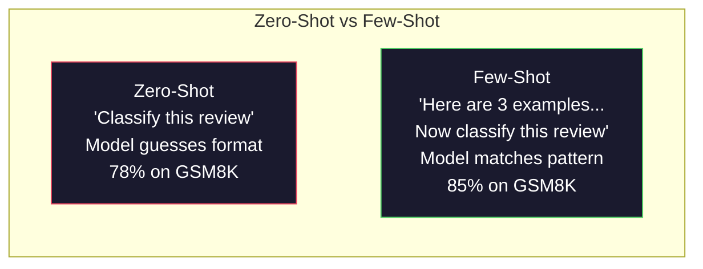
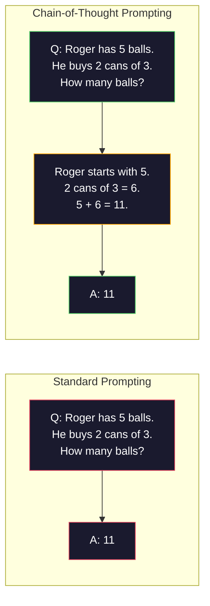
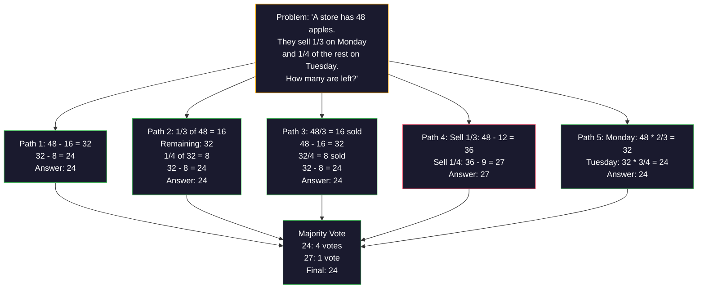
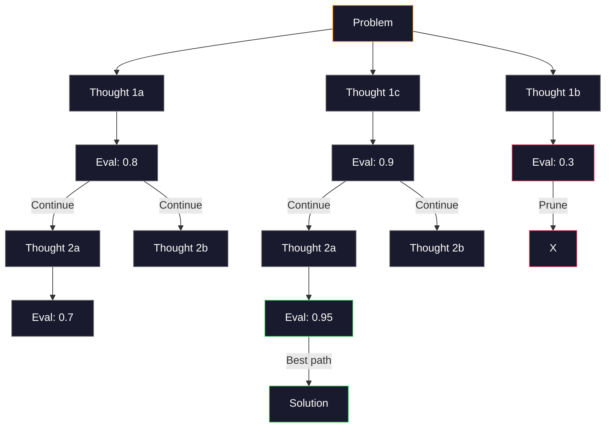

# القليل من الأسلحة السلسلة من الفكر شجرة من الفكر

> أخبر النموذج ما يجب فعله هو التحفيز. أظهر له كيف يفكر الهندسة. نفس النموذج، نفس المهمة، نفس البيانات، الفجوة بين 78٪ إلى 91٪ من معدل الدقة، ليست أفضل النموذج، ولكن أفضل استراتيجية التفكير.

**类型：**الإنشاء
**语言：**بايثون
**先修要求：**الدرس 11.01 (هندسة السرعة)
**时间：**45 دقيقة

## 學习目标

- 通過 اختيار وتقديم نماذج نموذجية لتحقيق محاولة القليل من الألقاب ، وبالتالي تعظيم تحديد المهام
- تطبيق سلسلة التفكير (CoT)  التوصيل، تحسين أسئلة التطبيق الرياضي وغيرها من الخطوات
- بناء شجرة الفكر، استكشاف多条推理路径并选择最佳路径
- في المعيار المرجعي، يُقيّم الصفرة والقليل من الصور مع ارتفاع معدلات التأكد من أنّها قد أدت إلى إصلاحات

## 问题

أنت تقوم ببناء تطبيق تدريس الرياضيات. عرضك يكتب: حل هذه المشكلة الكلمة. في GSM8K هذا المعيار الصغير الرياضيات المرجعي، GPT-5 لديه 94% من الوقت قادر على الإجابة على.

加上五个词دعونا نفكر خطوة بخطوة 准确率 قفز إلى 91%──إضافة عدة أمثلة مع حل كامل، يمكننا أن نصل إلى 95%──同样模型──同样温度──同样 API 成本──الفرق الوحيد هو أنك أعطيت ورقة النموذج المخطط──

هذا ليس هاكاً. هذا هو طريقة العمل في التفكير. البشر لن يخططوا للانتقال في حل مشكلة الخطوات المتعددة.

ولكن فكر خطوة بخطوة 只是开始, وليس النهاية. إذا كنت تأخذ خمس قواعد للتفكير، ثم إجراء غالبية التصويت ماذا؟ إذا جعلت النموذج يبحث عن شجرة احتمالية، تقييم ومقطع فروع؟ كيف إذا وضعت التفكير والوسائل استخدام التشبث؟ هذه ليست فرضية.

## مفهوم الأساسي

### الصفر ضد القليل من الأسلحة: مثال كيف فاز أمر

إطلاق النار الصفر فقط أعط النموذج مهمة واحدة، ما عدا ذلك لا شيء يمنحها.

ويز وآخرون (2022) في 8 مقياسات مقياسية، قاموا بتقييم هذا النقطة. بالنسبة للمهمات البسيطة مثل الجهود العاطفية، والتي لا تصل إلى أي شيء، والتي لا تصل إلى أي شيء، والتي لا تصل إلى أي شيء، فإن الفجوة في أداءها تبلغ 2% من نسبة المهام المعقدة مثل الحسابات والرموزات، والتي لا تصل إلى أي شيء، يمكن أن يزيد من نسبة الجهود المحددة بنسبة 10-25%.

直觉是: النموذج هو إرشاد بعد الضغط. مع وصفه النموذج المخرج، ليس مثل العرض المباشر. مع تفسير عملية التفكير، ليس مثل العرض المباشر.



**few-shot 适合的场景：**المفاهيم الخاصة في مجال المهام الحساسة للشكل، والفئات، والإجراءات المنسيقية، ومع أي مهام تتطلب أن تكون مطابقة للنموذج المحدد.

**zero-shot 适合的场景：**简单事实问题、示例会限制创意任务,以及找到好示例比写好指令更难的任务──

### نموذج اختيار:相似胜过随机

ليس كل المثال هو نفسه. المثال المماثل لخيارات المهام المستهدفة، في فئة المهام، في 5-15% من المهام المميزة.

1. **语义相似性**:选择 Embedding 空间中最接近输入的示例
2. **标签多样性**: مثال يجب تغطية جميع فئات الإصدار
3. **难度匹配**: موازنة مستوى التعقيد في المشكلة

بالنسبة لمعظم المهام، فإن أفضل عدد من الأمثلة هو 3-5 ⋅ أقل من 3 ⋅، النموذج ليس لديه نموذج استيراد إشارة كافٍ.

### سلسلة التفكير: give模型草稿纸

سلسلة التفكير (CoT) التي أطلقتها Google Brain's Wei et al. (2022) 提出── فكرة بسيطة جدا: لا تطلب فقط نموذج للحصول على الإجابة، بل أولاً تطلب من ذلك أن يظهر الخطوات التفكير.



من الآلية، لماذا هذا فعال؟ يتحول كل رمز من أصل النظام إلى التكنولوجيا التالية. بدون أي كوت، يجب أن يضغط النموذج جميع التفكيرات إلى حالة مخفية من المرور إلى الأمام مرة واحدة.

**GSM8K benchmark（小学数学，8.5K 道题）：**

| Model | Zero-Shot | Zero-Shot CoT | Few-Shot CoT |
|-------|-----------|---------------|--------------|
| GPT-4o | 78% | 91% | 95% |
| GPT-5 | 94% | 97% | 98% |
| o4-mini (reasoning) | 97% | — | — |
| Claude Opus 4.7 | 93% | 97% | 98% |
| Gemini 3 Pro | 92% | 96% | 98% |
| Llama 4 70B | 80% | 89% | 94% |
| DeepSeek-V3.1 | 89% | 94% | 96% |

**关于 reasoning models 的说明。**أوبن آي o-سلسلة ((o3、o4-ميني) و DeepSeek-R1 等 النماذج سوف تكون في الخروج و قبل في داخل تشغيل سلسلة من الفكر.

هناك نوعان من الـ "كوت":

**Zero-shot CoT**في وقت لاحق 后追加  دعونا نفكر خطوة بخطوة──不需要示例── كوجيما وآخرون (2022) 表明, أن هذه العبارة يمكن أن تُعزز الحسابات、常识和符号推理任务的准确率──

**Few-shot CoT**: توفير مثال على الخطوات التفكير. انها أكثر فعالية من COT صفر-طلق، لأن النموذج يمكن أن ترى ما تتوقعه بشكل صحيح.

**CoT 会伤害表现的场景**:简单事实回忆(ما هي عاصمة فرنسا؟) 、单步分类、速度比准确率更重要任务──CoT كل استفسار سوف يزيد من 50-200 个推理开销的令牌──对于高吞吐、低复杂性任务,这是浪费成本──

### التماسك الذاتي:多次采样,一次投票

وانغ وزملاء (2023)  طرحوا التماسك الذاتي ∙ رؤى النواحي هي: واحد 条 CoT 路径可能包含推理错误── ولكن إذا كنت تقتنع N 条 条独立推理路径(استخدام درجة حرارة > 0) ،并进行多数投票对最终答案,错误会相互抵消──



في تجربة PaLM 540B الأصلية، سوف يرتفع التوافق الذاتي معدل التوصل الذاتي إلى GSM8K من 56.5% ️️️️️️️️️️️️️️️️️️️️️️️️️️️️️️️️️️️️️️️️️️️️️️️️️️️️️️️️️️️️️️️️️️️️️️️️️️️️️️️️️️️️️️️️️️️️️️️️️️️️️️️️️️️️️️️️️️️️️️️️️️️️️️️️️️️️️️️️️️️️️️️️️️️️️️️️️️️️️️️️️️️️️️️️️️️️️️️️️️️️️️️️️️️️️️️️️️️️️️️️️️️️️️️️️️️️️️️️️️️️️️️️️️️️️️️️️️️️️️

الوزن هو: N 个样本意味着 N 倍 API 成本和延迟―― في الممارسة العملية، N = 5 能获得大部分收益――N = 3 是有意义的投票的最低值――对大多数任务来说,N > 10 收益递减――

### شجرة التفكير:分支式探索

ياو وزملاء (2023) اقترحوا شجرة التفكير (ToT) CoT 沿条线性推理路径前进,而T 会探索多个分支,并继续之前评估哪些分支有最前景──



هناك ثلاثة أجزاء:

1. **Thought generation**: توليد多个候选人
2. **State evaluation**: للجميع المُرشحين打分(يمكن استخدام ماجستير في العلوم القانونية  نفسها كمقياس)
3. **Search algorithm**: من خلال BFS أو DFS  عبر الشجرة،并剪枝低分分支

في لعبة 24 任务中 ((استعمل الحسابات مجموعة 4 个数字得到 24), استخدام المعايير التحفيز GPT-4 解题率为 7.3%──使用CoT为 4.0%──CoT 在这里实际有害,因为搜索空间很宽)──使用ToT 则达到 74%──

كل قطاع من الأشجار يحتاج إلى مرة واحدة لـ LLM 调用 分因子为 3 深度为 3 الأشجار الأكثر حاجة إلى 39 مرة لـ LLM 调用 فقط في مسألة البحث الكبيرة ولكن قابلة للتقييم استخدامها تخطيط 解  带束的创意问题解决

### رد فعل: التفكير + العمل

ياو وآخرون (2022) سوف يضبط التفكير في المسار والتحركات.

```mermaid
graph LR
    Q["Question:\nWhat is the\npopulation of the\ncountry where\nthe Eiffel Tower\nis located?"]
    T1["Thought: I need to\nfind which country\nhas the Eiffel Tower"]
    A1["Action: search\n'Eiffel Tower location'"]
    O1["Observation:\nParis, France"]
    T2["Thought: Now I need\nFrance's population"]
    A2["Action: search\n'France population 2024'"]
    O2["Observation:\n68.4 million"]
    T3["Thought: I have\nthe answer"]
    F["Answer:\n68.4 million"]

    Q --> T1 --> A1 --> O1 --> T2 --> A2 --> O2 --> T3 --> F

    style Q fill:#1a1a2e,stroke:#ffa500,color:#fff
    style T1 fill:#1a1a2e,stroke:#51cf66,color:#fff
    style A1 fill:#1a1a2e,stroke:#e94560,color:#fff
    style O1 fill:#1a1a2e,stroke:#808080,color:#fff
    style T2 fill:#1a1a2e,stroke:#51cf66,color:#fff
    style A2 fill:#1a1a2e,stroke:#e94560,color:#fff
    style O2 fill:#1a1a2e,stroke:#808080,color:#fff
    style T3 fill:#1a1a2e,stroke:#51cf66,color:#fff
    style F fill:#1a1a2e,stroke:#51cf66,color:#fff
```



ReAct في المهام المكثفة المعرفة تفوق CoT النقي ، لأنه يمكن أن يضع التفكير في بيانات حقيقية. في HotpotQA ، باستخدام ReAct GPT-4 يصل إلى 35.1% مطابقة دقيقة ، بينما CoT وحيد هو 29.4%.

ReAct هي أساس وكلاء الذكاء الاصطناعي الحديث. كل إطار وكيل (LangChain, CrewAI, AutoGen) سوف تحقق نوعا من التفكير-العمل-الملاحظة حلقة التغيرات.

### الإتصال المهيكلي: علامات XML

مع الإشارات 变复杂,结构能防止模型混不同部分──三种方法:

**XML tags**(أفضل ما يُطابق كلود، في كل مكان)
```
<context>
You are reviewing a pull request.
The codebase uses TypeScript and React.
</context>

<task>
Review the following diff for bugs, security issues, and style violations.
</task>

<diff>
{diff_content}
</diff>

<output_format>
List each issue with: file, line, severity (critical/warning/info), description.
</output_format>
```

**Markdown headers**(مستخدم):
```
## Role
Senior security engineer at a fintech company.

## Task
Analyze this API endpoint for vulnerabilities.

## Input
{api_code}

## Rules
- Focus on OWASP Top 10
- Rate each finding: critical, high, medium, low
- Include remediation steps
```

**Delimiters**(بسيطة ولكن فعالة):
```
---INPUT---
{user_text}
---END INPUT---

---INSTRUCTIONS---
Summarize the above in 3 bullet points.
---END INSTRUCTIONS---
```

### السلسلة السريعة:顺序分解

بعض المهام على طلب واحد تكون معقدة جدا. سيقوم سلسلة عرضية بتفريقها إلى مراحل متعددة، واحدة من هذه المهام تصبح واحدة من هذه المهام.


السلاسل 优于单 prompt هناك ثلاثة أسباب:

1. **每一步更简单**النموذج يعالج مهمة مركزية بدلاً من أن يضمن كل شيء في نفس الوقت
2. **中间输出可检查**يمكنك بين الخطوات التحقق والتصحيح
3. **不同步骤可以使用不同模型**: مع نموذج رخيصة للقيام باستعمال، مع نموذج مكلفة للقيام بتقرير

### القدرة على الوصول

| Technique | Best For | GSM8K Accuracy (GPT-5) | API Calls | Token Overhead | Complexity |
|-----------|----------|------------------------|-----------|----------------|------------|
| Zero-Shot | 简单任务 | 94% | 1 | 无 | 极低 |
| Few-Shot | 格式匹配 | 96% | 1 | 200-500 tokens | 低 |
| Zero-Shot CoT | 快速推理提升 | 97% | 1 | 50-200 tokens | 极低 |
| Few-Shot CoT | 最高单次调用准确率 | 98% | 1 | 300-600 tokens | 低 |
| Self-Consistency (N=5) | 高风险推理 | 98.5% | 5 | 5x token cost | 中 |
| Reasoning model (o4-mini) | CoT 的直接替代 | 97% | 1 | hidden (2-10x internal) | 极低 |
| Tree-of-Thought | 搜索/规划问题 | N/A (74% on Game of 24) | 10-40+ | 10-40x token cost | 高 |
| ReAct | 基于知识的推理 | N/A (35.1% on HotpotQA) | 3-10+ | 可变 | 高 |
| Prompt Chaining | 复杂多步骤任务 | 96% (pipeline) | 2-5 | 2-5x token cost | 中 |

تقنية الصحة تعتمد على ثلاثة عوامل: طلبات معدل التأكد، والتأخير في الميزانية وتسامح التكاليف.


```figure
few-shot-curve
```

## بناءها

سوف نبني مشاكل رياضية، ونضع القليل من الأسلحة الدعائية، سلسلة من التفكير، التفكير والتصويت المتوافق مع الذات، ونقوم بتجميع خط أنابيب، ثم نضع المشاكل في شجرة التفكير.

 كامل تحقيق `code/advanced_prompting.py`وسطها هي المكونات الرئيسية

### 步骤 1: عدد قليل من الصور مثال مخزن

الأول: إدارة المجموعة القليلة من الأمثلة، ومُعطى المشكلة اختيار المُثَل الأكثر صلة.

```python
GSM8K_EXAMPLES = [
    {
        "question": "Janet's ducks lay 16 eggs per day. She eats three for breakfast every morning and bakes muffins for her friends every day with four. She sells every egg at the farmers' market for $2. How much does she make every day at the farmers' market?",
        "reasoning": "Janet's ducks lay 16 eggs per day. She eats 3 and bakes 4, using 3 + 4 = 7 eggs. So she has 16 - 7 = 9 eggs left. She sells each for $2, so she makes 9 * 2 = $18 per day.",
        "answer": "18"
    },
    ...
]
```

كل مثال يحتوي على ثلاثة أجزاء: المشكلة والتقرير والإجابة النهائية.

### 步骤 2: صانع خطة التفكير

سوف يقوم المُبني المُساعد بتصميم رسالة النظام ٬ مع بعض الأمثلة القليلة على سلسلة التوصيل، فضلاً عن تحديد المشكلة المستهدفة لتكون مُساعدة واحدة٬

```python
def build_cot_prompt(question, examples, num_examples=3):
    system = (
        "You are a math problem solver. "
        "For each problem, show your step-by-step reasoning, "
        "then give the final numerical answer on the last line "
        "in the format: 'The answer is [number]'."
    )

    example_text = ""
    for ex in examples[:num_examples]:
        example_text += f"Q: {ex['question']}\n"
        example_text += f"A: {ex['reasoning']} The answer is {ex['answer']}.\n\n"

    user = f"{example_text}Q: {question}\nA:"
    return system, user
```

格式约束(الرد هو [رقم])至关重要──没有它,自连性就无法跨样本抽取并比较答案──

### الخطوة الثالثة: التصويت المتوافق مع الذات

采样 N 条推理路径,并取多数答案──

```python
def self_consistency_solve(question, examples, client, model, n_samples=5):
    system, user = build_cot_prompt(question, examples)

    answers = []
    reasonings = []
    for _ in range(n_samples):
        response = client.chat.completions.create(
            model=model,
            messages=[
                {"role": "system", "content": system},
                {"role": "user", "content": user}
            ],
            temperature=0.7
        )
        text = response.choices[0].message.content
        reasonings.append(text)
        answer = extract_answer(text)
        if answer is not None:
            answers.append(answer)

    vote_counts = Counter(answers)
    best_answer = vote_counts.most_common(1)[0][0] if vote_counts else None
    confidence = vote_counts[best_answer] / len(answers) if best_answer else 0

    return best_answer, confidence, reasonings, vote_counts
```

درجة الحرارة 0.7  مهمة جدا ً. عند درجة الحرارة 0.0 ٬ كل النماذج N ٬ ستكون متشابهة، وبالتالي ستفقد المعنى ً. تحتاج إلى الكثير من الاختيارات لتكون هناك العديد من الطرق للتفكير، ولكن لا يمكنك الاختيارات لتكون النموذج يخرج من الحوارات.

### 步骤 4: محلل الشجرة

بالنسبة لمشكلة الفشل في التفكير السري، سوف أبحث عن العديد من الطرق، وأقدر أي اتجاهات لديها أفضل إمكانات.

```python
def tree_of_thought_solve(question, client, model, breadth=3, depth=3):
    thoughts = generate_initial_thoughts(question, client, model, breadth)
    scored = [(t, evaluate_thought(t, question, client, model)) for t in thoughts]
    scored.sort(key=lambda x: x[1], reverse=True)

    for current_depth in range(1, depth):
        next_thoughts = []
        for thought, score in scored[:2]:
            extensions = extend_thought(thought, question, client, model, breadth)
            for ext in extensions:
                ext_score = evaluate_thought(ext, question, client, model)
                next_thoughts.append((ext, ext_score))
        scored = sorted(next_thoughts, key=lambda x: x[1], reverse=True)

    best_thought = scored[0][0] if scored else ""
    return extract_answer(best_thought), best_thought
```

评估器本身也是一次 LLM 调用──你问模型:على مقياس من 0.0 إلى 1.0, ما مدى وعداً لهذا المسار من التفكير لحل المشكلة؟

### الخطوة 5: كامل خط الأنابيب

خط الأنابيب 通過升级策略组合所有技术──

```python
def solve_with_escalation(question, examples, client, model):
    system, user = build_cot_prompt(question, examples)
    single_response = call_llm(client, model, system, user, temperature=0.0)
    single_answer = extract_answer(single_response)

    sc_answer, confidence, _, _ = self_consistency_solve(
        question, examples, client, model, n_samples=5
    )

    if confidence >= 0.8:
        return sc_answer, "self_consistency", confidence

    tot_answer, _ = tree_of_thought_solve(question, client, model)
    return tot_answer, "tree_of_thought", None
```

升级逻辑:先尝试便宜方案(单次 CoT) ・・・ إذا كان ثقة التوافق الذاتي 低于0.8(5 样本中少于4 个一致),则升级到T──这样能平衡成本和准确率大多数问题便宜地解决,难题获得更多计算──

## استخدمها

### مع لانج تشين

لانغ تشين لتسجيل القوالب والتحليلات المخرجة قدم دعم داخلي، يمكن تبسيط القليل من الأشرطة و أنماط CoT:

```python
from langchain_core.prompts import FewShotPromptTemplate, PromptTemplate
from langchain_openai import ChatOpenAI

example_prompt = PromptTemplate(
    input_variables=["question", "reasoning", "answer"],
    template="Q: {question}\nA: {reasoning} The answer is {answer}."
)

few_shot_prompt = FewShotPromptTemplate(
    examples=examples,
    example_prompt=example_prompt,
    suffix="Q: {input}\nA: Let's think step by step.",
    input_variables=["input"]
)

llm = ChatOpenAI(model="gpt-4o", temperature=0.7)
chain = few_shot_prompt | llm
result = chain.invoke({"input": "If a train travels 120 km in 2 hours..."})
```

لا يزال هناك أيضاً للاستخدام في التشكيلات`ExampleSelector`الفئات:

```python
from langchain_core.example_selectors import SemanticSimilarityExampleSelector
from langchain_openai import OpenAIEmbeddings

selector = SemanticSimilarityExampleSelector.from_examples(
    examples,
    OpenAIEmbeddings(),
    k=3
)
```

### مع DSPy

سوف DSPy تحفيز الاستراتيجيات 视为可优化模块──你无需手写CT提示,而是定义一个签名,然后让 DSPy 优化提示:

```python
import dspy

dspy.configure(lm=dspy.LM("openai/gpt-4o", temperature=0.7))

class MathSolver(dspy.Module):
    def __init__(self):
        self.solve = dspy.ChainOfThought("question -> answer")

    def forward(self, question):
        return self.solve(question=question)

solver = MathSolver()
result = solver(question="Janet's ducks lay 16 eggs per day...")
```

ديسبي `ChainOfThought`سأضيفها تلقائيًا إلى المسار`dspy.majority`تحقيق التناغم الذاتي:

```python
result = dspy.majority(
    [solver(question=q) for _ in range(5)],
    field="answer"
)
```

### مقابل:من الخردة مقابل الإطار

| Feature | From-Scratch (this lesson) | LangChain | DSPy |
|---------|--------------------------|-----------|------|
| 对 prompt format 的控制 | 完全控制 | 基于 template | 自动 |
| Self-consistency | 手动投票 | 手动 | 内置（`dspy.majority`） |
| Example selection | 自定义逻辑 | `ExampleSelector` | `dspy.BootstrapFewShot` |
| Tree-of-Thought | 自定义 tree search | Community chains | 未内置 |
| Prompt optimization | 手动迭代 | 手动 | 自动编译 |
| 最适合 | 学习、自定义 pipelines | 标准 workflows | 研究、优化 |

## 交付 it

هذا المقال يظهر اثنين من الأثاث

**1. Reasoning Chain Prompt**(`outputs/prompt-reasoning-chain.md`): نموذج عرض مستعدا للإنتاج، المستخدمة مع التوافق الذاتي القليل من اللقطات CoT── متصلة مثالك ومجال المشكلة即可使用──

**2. CoT Pattern Selection Skill**(`outputs/skill-cot-patterns.md`): إطار قرار، يستخدم على أساس نوع المهام ‬متطلبات معدل التأكد وتكلفة الحجم اختيار تقنية التفكير المناسبة‬

## التدريب

1. **衡量差距**: خذ 10 طرق GSM8K 题──分别 باستخدام صفر إطلاق                                                                                                                                                                                                                                                      

2. **示例选择实验**: للمسألة نفسها 10 طرق، مقارنة اختيار المثالية مع اختيار اليدوية مثل المثالية.

3. **Self-consistency 成本曲线**: على 20 طريق GSM8K على مسألة استخدام N=1、3、5、7、10 运行 التوافق الذاتي‬‬‬‬‬‬‬‬‬‬‬‬‬‬‬‬‬‬‬‬‬‬‬‬‬‬‬‬‬‬‬‬‬‬‬‬‬‬‬‬‬‬‬‬‬‬‬‬‬‬‬‬‬‬‬‬‬‬‬‬‬‬‬‬‬‬‬‬‬‬‬‬‬‬‬‬‬‬‬‬‬‬‬‬‬‬‬‬‬‬‬‬‬‬‬‬‬‬‬‬‬‬‬‬‬‬‬‬‬‬‬‬‬‬‬‬‬‬‬‬‬‬‬‬‬‬‬‬‬‬‬‬‬‬‬‬‬‬‬‬‬‬‬‬‬‬‬‬‬‬‬‬‬‬‬‬‬‬‬‬‬‬‬‬‬‬‬‬‬‬‬‬‬‬‬‬‬‬‬‬‬‬‬‬‬‬‬‬‬‬‬‬‬‬‬‬‬‬‬‬‬‬‬‬‬‬‬‬‬‬‬‬‬‬‬‬‬‬‬‬‬‬‬‬‬‬‬‬‬‬‬‬‬‬‬‬‬‬‬‬‬‬‬‬‬‬‬‬‬‬‬‬‬‬‬‬‬‬‬‬‬‬‬‬‬‬‬‬‬‬‬‬‬‬‬‬‬‬‬‬‬‬‬‬‬‬‬‬‬‬‬‬‬‬‬‬‬‬‬‬‬‬‬‬‬‬‬‬‬‬‬‬‬‬‬‬‬‬‬‬‬‬‬‬‬‬‬‬‬‬‬‬‬‬‬‬‬‬‬‬‬‬‬‬‬‬‬‬‬‬‬‬‬‬‬‬‬‬‬‬‬‬‬‬‬‬‬‬‬‬‬‬‬‬‬‬‬‬‬‬‬‬‬‬‬‬‬‬‬‬‬‬‬‬‬‬‬‬‬‬‬‬‬‬‬‬‬‬‬‬‬‬‬‬‬‬‬‬‬‬‬‬‬‬‬‬‬‬‬‬‬‬‬‬‬‬‬‬‬‬‬‬‬‬‬‬‬‬‬‬‬‬‬‬‬‬‬‬‬‬‬‬‬‬‬‬‬‬‬‬‬‬‬‬‬‬‬‬‬

4. **构建 ReAct loop**: باستخدام أداة الحاسبة  توسيع خط الأنابيب `eval()`(في صندوق الرمال) تنفيذها، وتحقيق النتيجة عكس الـ"عودة"

5. **ToT 用于创意任务**:将 Tree-of-Thought solver 改造用于创意写作任务: اكتب قصة من 6 كلمات هي مرحة وحزينة. استخدام LLM 作为评估器──分支式探索 هل يكون هناك إنتاج أفضل من الجيل المفرد؟

## 关键术语

| Term | 人们通常说 | 实际含义 |
|------|----------------|----------------------|
| Few-shot prompting | “给它一些示例” | 在 prompt 中包含 input-output demonstrations，用于锚定模型的输出格式和行为 |
| Chain-of-Thought | “让它一步步思考” | 引出中间推理 Token，在生成最终答案前延长模型的有效计算 |
| Self-Consistency | “多运行几次” | 在 temperature > 0 下采样 N 条多样推理路径，并通过多数投票选择最常见的最终答案 |
| Tree-of-Thought | “让它探索选项” | 对推理分支进行结构化搜索，每个部分解法都会被评估，只有有前景的路径会被扩展 |
| ReAct | “思考 + 工具使用” | 在 Thought-Action-Observation loop 中交织推理轨迹与外部动作（搜索、计算、API calls） |
| Prompt chaining | “拆成步骤” | 将复杂任务分解为顺序 prompts，每一步输出都会馈入下一步输入 |
| Zero-shot CoT | “只加上 ‘think step by step’” | 不提供任何示例，只在 prompt 后追加推理触发短语，依赖模型的潜在推理能力 |

## 延伸阅读

- [Chain-of-Thought Prompting Elicits Reasoning in Large Language Models](https://arxiv.org/abs/2201.11903)-- Wei et al. 2022── Google Brain's original CoT 论文──阅读第 2-3 节了解核心结果──
- [Self-Consistency Improves Chain of Thought Reasoning in Language Models](https://arxiv.org/abs/2203.11171)-- وانغ وزملاء 2023―تسلسل الذاتي 论文―表 1
- [Tree of Thoughts: Deliberate Problem Solving with Large Language Models](https://arxiv.org/abs/2305.10601)-- ياو وزملاء 2023── ToT 论文──第 4 节的24 结果是亮点──
- [ReAct: Synergizing Reasoning and Acting in Language Models](https://arxiv.org/abs/2210.03629)-- ياو وزملاء 2022。 أساس عملاء الذكاء الاصطناعي الحديثة。第 3 节 شرح حلقة التفكير-العمل-الملاحظة。
- [Large Language Models are Zero-Shot Reasoners](https://arxiv.org/abs/2205.11916)-- كوجيما وزملاء 2022。 دعونا نفكر خطوة بخطوة مقالها── بطريقة بسيطة جداً في تحقيق نتائج متوقعة للإنسان──
- [DSPy: Compiling Declarative Language Model Calls into Self-Improving Pipelines](https://arxiv.org/abs/2310.03714)-- Khattab et al. 2023──将促使视为编译问题── إذا كنت تفكر في التنظيم على الهندسة السريعة، فمن الجدير بالقراءة──
- [OpenAI — Reasoning models guide](https://platform.openai.com/docs/guides/reasoning)-- حول متى سلسلة من الفكر سوف تتحول من خطة مستوى سريع إلى الداخلية ‬ بحسب طريقة التفكير ‬التوجيهات المزودين‬‬‬‬‬‬‬‬‬‬‬‬‬‬‬‬‬‬‬‬‬‬‬‬‬‬‬‬‬‬‬‬‬‬‬‬‬‬‬‬‬‬‬‬‬‬‬‬‬‬‬‬‬‬‬‬‬‬‬‬‬‬‬‬‬‬‬‬‬‬‬‬‬‬‬‬‬‬‬‬‬‬‬‬‬‬‬‬‬‬‬‬‬‬‬‬‬‬‬‬‬‬‬‬‬‬‬‬‬‬‬‬‬‬‬‬‬‬‬‬‬‬‬‬‬‬‬‬‬‬‬‬‬‬‬‬‬‬‬‬‬‬‬‬‬‬‬‬‬‬‬‬‬‬‬‬‬‬‬‬‬‬‬‬‬‬‬‬‬‬‬‬‬‬‬‬‬‬‬‬‬‬‬‬‬‬‬‬‬‬‬‬‬‬‬‬‬‬‬‬‬‬‬‬‬‬‬‬‬‬‬‬‬‬‬‬‬‬‬‬‬‬‬‬‬‬‬‬‬‬‬‬‬‬‬‬‬‬‬‬‬‬‬‬‬‬‬‬‬‬‬‬‬‬‬‬‬‬‬‬‬‬‬‬‬‬‬‬‬‬‬‬‬‬‬‬‬‬‬‬‬‬‬‬‬‬‬‬‬‬‬‬‬‬‬‬‬‬‬‬‬‬‬‬‬‬‬‬‬‬‬‬‬‬‬‬‬‬‬‬‬‬‬‬‬‬‬‬‬‬‬‬‬‬‬‬‬‬‬‬‬‬‬‬‬‬‬‬‬‬‬‬‬‬‬‬‬‬‬‬‬‬‬‬‬‬‬‬‬‬‬‬‬‬‬‬‬‬‬‬‬‬‬‬‬‬‬‬‬‬‬‬‬‬‬‬‬‬‬‬‬‬‬‬‬‬‬‬‬‬‬‬‬‬‬‬‬‬‬‬‬‬‬‬‬‬‬‬‬‬‬‬‬‬‬‬‬‬‬‬‬‬‬‬‬‬‬‬‬‬‬‬‬‬‬‬‬‬‬‬‬‬‬‬‬‬‬‬‬‬‬
- [Lightman et al., "Let's Verify Step by Step" (2023)](https://arxiv.org/abs/2305.20050)-- نموذج مكافأة العملية (PRM) ، تستخدم في كل خطوة في سلسلة؛ هذا مقارنة فقط مع مكافآت النتيجة أكثر نجاحا في التفكير الإشرافات الإشارة
- [Snell et al., "Scaling LLM Test-Time Compute Optimally" (2024)](https://arxiv.org/abs/2408.03314)-- بالنسبة لـ CoT 长度、自一致性采样和 MCTS 系统研究; عندما يكون معدل التأكد أكثر أهمية من التأخير، فكر خطوة بخطوة  会走向何处
