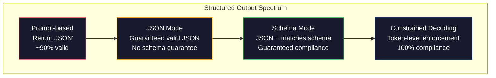
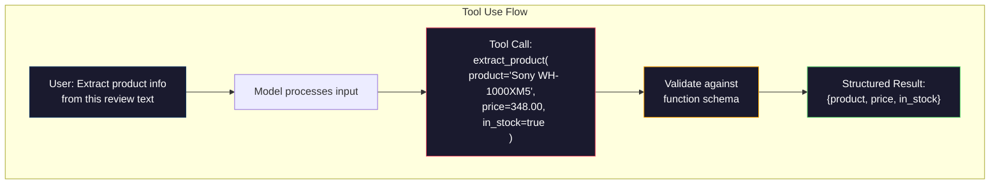

# 结构化输出: JSON、Schema Validation、Crestricted Decoding

> تعود درجة الماجستير الخاص بك هي الخط. وتحتاج تطبيقك إلى JSON. هذا التفاوت الذي أدى إلى انهيار النظام الإنتاجي، أكثر من أي نموذج.

**类型：**بناء
**语言：**بايثون
**先修要求：**المرحلة 10، الدروس 01-05 (LLM من الصفر)
**时间：**حوالي 90 دقيقة
**相关内容：**المرحلة 5 · 20 (المخرجات المهيكلة والتشفير المحدود) 涵盖解码 层面的理论(FSM/CFG المعالجات اللوجيت、概要、XGrammar)`response_format`استخدام الأدوات الإنسانية (استشار) إذا كنت تريد أن تفهم ما حدث تحت API، يرجى قراءة المرحلة 5 · 20‬

## 學习目标

- استخدام OpenAI و API الأنثروبية 参数 لتحقيق وضع JSON و الخروج المقيود من النظام
- إنشاء طبقة التحقق من الاختبار البيانتي ، لرفض النتائج الخطأ في الجامعة ، ومع مرور خطأ في الاختبار
-  شرح تشخيص القيود المحدود  كيفية توليد JSON الفعال على مستوى الوهم  الضروري ، و لا حاجة بعد المعالجة
- 设计稳健的抽取提示,将非结构化文本可靠转换为类型化数据结构

## 问题

ستسأل ماجستير في العلوم: من هذا المقال استخرج من الصفحة اسم المنتج ‬السعر والحالة المخزونية‬‬‬‬‬‬‬‬‬‬‬‬‬‬‬‬‬‬‬‬‬‬‬‬‬‬‬‬‬‬‬‬‬‬‬‬‬‬‬‬‬‬‬‬‬‬‬‬‬‬‬‬‬‬‬‬‬‬‬‬‬‬‬‬‬‬‬‬‬‬‬‬‬‬‬‬‬‬‬‬‬‬‬‬‬‬‬‬‬‬‬‬‬‬‬‬‬‬‬‬‬‬‬‬‬‬‬‬‬‬‬‬‬‬‬‬‬‬‬‬‬‬‬‬‬‬‬‬‬‬‬‬‬‬‬‬‬‬‬‬‬‬‬‬‬‬‬‬‬‬‬‬‬‬‬‬‬‬‬‬‬‬‬‬‬‬‬‬‬‬‬‬‬‬‬‬‬‬‬‬‬‬‬‬‬‬‬‬‬‬‬‬‬‬‬‬‬‬‬‬‬‬‬‬‬‬‬‬‬‬‬‬‬‬‬‬‬‬‬‬‬‬‬‬‬‬‬‬‬‬‬‬‬‬‬‬‬‬‬‬‬‬‬‬‬‬‬‬‬‬‬‬‬‬‬‬‬‬‬‬‬‬‬‬‬‬‬‬‬‬‬‬‬‬‬‬‬‬‬‬‬‬‬‬‬‬‬‬‬‬‬‬‬‬‬‬‬‬‬‬‬‬‬‬‬‬‬‬‬‬‬‬‬‬‬‬‬‬‬‬‬‬‬‬‬‬‬‬‬‬‬‬‬‬‬‬‬‬‬‬‬‬‬‬‬‬‬‬‬‬‬‬‬‬‬‬‬‬‬‬‬‬‬‬‬‬‬‬‬‬‬‬‬‬‬‬‬‬‬‬‬‬‬‬‬‬‬‬‬‬‬‬‬‬‬‬‬‬‬‬‬‬‬‬‬‬‬‬‬‬‬‬‬‬‬‬‬‬‬‬‬‬‬‬‬‬‬‬‬‬‬‬‬‬‬‬‬‬‬‬‬‬‬‬‬‬‬‬‬‬‬‬‬‬‬‬‬‬‬‬‬‬‬‬‬‬‬‬‬‬‬‬‬‬‬

```
The product is the Sony WH-1000XM5 headphones, which cost $348.00 and are currently in stock.
```

هذا هو الإجابة الصحيحة تماما. بالنسبة لتطبيقك، فإنه أيضا غير مفيد تماما.`{"product": "Sony WH-1000XM5", "price": 348.00, "in_stock": true}` تحتاج إلى كليف محدد ‬نوع محدد وتحديد القيمة المحددة ‬‬‬‬‬‬‬‬‬‬‬‬‬‬‬‬‬‬‬‬‬‬‬‬‬‬‬‬‬‬‬‬‬‬‬‬‬‬‬‬‬‬‬‬‬‬‬‬‬‬‬‬‬‬‬‬‬‬‬‬‬‬‬‬‬‬‬‬‬‬‬‬‬‬‬‬‬‬‬‬‬‬‬‬‬‬‬‬‬‬‬‬‬‬‬‬‬‬‬‬‬‬‬‬‬‬‬‬‬‬‬‬‬‬‬‬‬‬‬‬‬‬‬‬‬‬‬‬‬‬‬‬‬‬‬‬‬‬‬‬‬‬‬‬‬‬‬‬‬‬‬‬‬‬‬‬‬‬‬‬‬‬‬‬‬‬‬‬‬‬‬‬‬‬‬‬‬‬‬‬‬‬‬‬‬‬‬‬‬‬‬‬‬‬‬‬‬‬‬‬‬‬‬‬‬‬‬‬‬‬‬‬‬‬‬‬‬‬‬‬‬‬‬‬‬‬‬‬‬‬‬‬‬‬‬‬‬‬‬‬‬‬‬‬‬‬‬‬‬‬‬‬‬‬‬‬‬‬‬‬‬‬‬‬‬‬‬‬‬‬‬‬‬‬‬‬‬‬‬‬‬‬‬‬‬‬‬‬‬‬‬‬‬‬‬‬‬‬‬‬‬‬‬‬‬‬‬‬‬‬‬‬‬‬‬‬‬‬‬‬‬‬‬‬‬‬‬‬‬‬‬‬‬‬‬‬‬‬‬‬‬‬‬‬‬‬‬‬‬‬‬‬‬‬‬‬‬‬‬‬‬‬‬‬‬‬‬‬‬‬‬‬‬‬‬‬‬‬‬‬‬‬‬‬‬‬‬‬‬‬‬‬‬‬‬‬‬‬‬‬‬‬‬‬‬‬‬‬‬‬‬‬‬‬‬‬‬‬‬‬‬‬‬‬‬‬‬‬‬‬‬‬‬‬‬‬‬‬‬‬‬‬‬‬‬‬‬‬‬‬‬‬‬‬‬‬‬‬‬‬‬‬‬‬‬‬‬‬‬‬‬‬‬‬‬‬‬‬‬‬‬‬‬‬‬‬‬

朴素解法: 在快速里加上响应 JSON──这在90%的情况下有效──另外10%的情况下,模型将JSON包在标记代码围中,或加上类似

هذا ليس هندسة سريعة  مشكلة. هذا هو فك التشفير  مشكلة. النموذج من اليسار إلى اليمين توليد الجيوب. في كل موقع، فإنه سوف يختار من أكثر من 100,000 خيارات من المفردات من بين المحتملة التالية الجيوب. في أي موقع محدد، معظم الخيارات سوف تولد غير فعال JSON.`{"price":`,下一个 Token 必须是数字、引号(用于 strings)`null`.`true`.`false`أو负号―― أي محتوى آخر سوف ينتج JSON غير فعال. بدون قيود، قد يختار النموذج كلمة إنجليزية تبدو معقولة تماما، ولكن في اللغة الخطأ الكارثي.

## 概念

### 结构化输出谱系

تحتوي على أربع مستويات من التحكم في المخرجات والخروج، كل مستوى أكثر موثوقية من المستوى السابق.



**基于 Prompt**(رد في JSON صالحة): ليس هناك قيود مضطرة. النموذج عادة ما يتبع، ولكن في بعض الأحيان لن يتبع.

**JSON mode**:API ضمان النتائج هو فعال JSON。OpenAI `response_format: { type: "json_object" }`سوف يتمكن من استخدام هذا النموذج. يمكن أن يكون الناتج خالي من الحل الخطأ. ولكن لا يتطابق بالضرورة مع النموذج الذي تتوقعه.

**Schema mode**:API قبل مخطط JSON،并保证输出与匹配──到2026年, جميع المزودين الرئيسيين كانوا يدعمون هذا النقطة.`response_format: { type: "json_schema", json_schema: {...} }`(يمكنك أن تمر بها أيضاً)`tool_choice="required"`)、استعمال الأدوات الإنسانية 配合 `input_schema`، و التوأم`response_schema`+ `response_mime_type: "application/json"` الخروج من الموقع يتضمن المفتاح المحدد الذي تحددينه

**Constrained decoding**: في عملية إنتاج كل رمز  موقع، سوف يمنع المُعاقر كل شيء مما يؤدي إلى إصدار غير فعال من الوهم. إذا كانت النموذج تطلب رقمًا، والنموذج سوف يخرج حرفًا واحدًا، فإن احتمالية إصدار هذا الوهم سيتم تحديده إلى صفر.

### مخطط JSON:契约语言

مخطط JSON هو الطريقة التي تستخدمها لإخبار النموذج (أو طبقة التحقق) أن المخرجات يجب أن يكون لها شكل ما. جميع أنظمة المخرجات المهيكلة الرئيسية تستخدمها.

```json
{
  "type": "object",
  "properties": {
    "product": { "type": "string" },
    "price": { "type": "number", "minimum": 0 },
    "in_stock": { "type": "boolean" },
    "categories": {
      "type": "array",
      "items": { "type": "string" }
    }
  },
  "required": ["product", "price", "in_stock"]
}
```

هذا النموذج يعبر عن: output يجب أن يكون كائنًا ، يحتوي على سلسلة  نوع `product`、عدد غير سلبي  نوع `price`、بولي 类型 `in_stock`، وسلسلة اختيارية عدد `categories`أي تصدير غير متوافق سيتم رفضه

المخططات يمكن أن يعالج المشكلة:嵌套 الأشياء 包含类型化对象的阵列、enums(将 string 约束到特定取值) 模式匹配(对 strings 使用 regex),以及组合器(用于多态输出 oneOf、anyOf、allOf) 

### البيانات

في بايثون، لن تكتب خطة JSON بيدك.

```python
from pydantic import BaseModel

class Product(BaseModel):
    product: str
    price: float
    in_stock: bool
    categories: list[str] = []
```

يمكن أن يتم إنتاج نفس النظام JSON المذكور أعلاه. مكتبة المعلمين (و SDK OpenAI) يمكن أن تقبل بشكل مباشر النماذج Pydantic: إدخال فئة النماذج، والعودة إلى مثال من تجربة.

### مكالمة الوظيفة / استخدام الأدوات

هذا هو نوع آخر من المشكلة نفسها. أنت لا تجعل النموذج ينتج مباشرة JSON، ولكن تعريف مع معدات مكونات التنسيقية مكونات مكونات مكونات مكونات مكونات مكونات مكونات مكونات مكونات مكونات مكونات مكونات مكونات مكونات مكونات مكونات مكونات مكونات مكونات مكونات مكونات مكونات مكونات مكونات مكونات مكونات مكونات مكونات مكونات مكونات مكونات مكونات مكونات مكونات مكونات مكونات مكونات مكونات مكونات مكونات مكونات مكونات مكونات مكونات مكونات مكونات مكونات مكونات مكونات مكونات مكونات مكونات مكونات م:



عندما يحتاج النموذج إلى اختيار أي وظيفة تستخدم، وليس فقط ملء العناصر، استخدام الأداة أكثر ملاءمة. إذا كان لديك 10 أنواع مختلفة من مخططات الاستخراج، ويجب أن يكون النموذج على أساس إدخال اختيار صحيح، استخدام الأداة سوف يعطيك في نفس الوقت اختيار مخطط ومخرج منظم.

### 常见失败模式

حتى لو كان هناك تطبيق مخطط، فإن الإصدارات المهيكلية قد تفشل بطريقة صغيرة.

**幻觉值**: النتائج المنسقة، ولكن تحتوي على بيانات المنسقة.`{"price": 299.99}` التحقق من المخطط 捕捉不到这一点类型正确,但值错误──

**Enum 混淆**أنتِ تُحَمِلينَ`["in_stock", "out_of_stock", "preorder"]` نموذج النفاذ`"available"`语义正确,但不是允许集合中──优秀的限制解码可以避免这一点──基于快速的方法不能──

**嵌套 object 深度**: مخططات الـ deep layer嵌套 (الأربع مستويات أو أكثر) سوف تحدث المزيد من الأخطاء. كل مستوى من الـ deep layer嵌套 هي نموذج يمكن أن ينسى موقع الهيكل.

**Array 长度**: النموذج قد ينتج الكثير أو القليل جدا من العناصر في الترتيبات.`minItems`和 `maxItems`ولكن ليس كل المقدمين يقومون بتحديد التعريفات على مستوى الإجبار على تنفيذها.

**可选字段省略**: النموذج سوف تنسى تلك التقنيات المتاحة، ولكن في حالة استخدامك في المعنى اللغوي الأساسي الأجزاء الهامة. حتى لو كانت البيانات في بعض الأحيان لا توجد، يجب أيضا أن تكون في النموذج المطلوبة النموذج القسري واضحاً.`null`.


```figure
mx-schema-funnel
```

## بناءها

### الخطوة 1: مؤكدة مخطط JSON

من صفر بناء مؤكدة، تستخدم للتحقق من ما إذا كان كائن Python يتناسب مع نظام JSON.

```python
import json

def validate_schema(data, schema):
    errors = []
    _validate(data, schema, "", errors)
    return errors

def _validate(data, schema, path, errors):
    schema_type = schema.get("type")

    if schema_type == "object":
        if not isinstance(data, dict):
            errors.append(f"{path}: expected object, got {type(data).__name__}")
            return
        for key in schema.get("required", []):
            if key not in data:
                errors.append(f"{path}.{key}: required field missing")
        properties = schema.get("properties", {})
        for key, value in data.items():
            if key in properties:
                _validate(value, properties[key], f"{path}.{key}", errors)

    elif schema_type == "array":
        if not isinstance(data, list):
            errors.append(f"{path}: expected array, got {type(data).__name__}")
            return
        min_items = schema.get("minItems", 0)
        max_items = schema.get("maxItems", float("inf"))
        if len(data) < min_items:
            errors.append(f"{path}: array has {len(data)} items, minimum is {min_items}")
        if len(data) > max_items:
            errors.append(f"{path}: array has {len(data)} items, maximum is {max_items}")
        items_schema = schema.get("items", {})
        for i, item in enumerate(data):
            _validate(item, items_schema, f"{path}[{i}]", errors)

    elif schema_type == "string":
        if not isinstance(data, str):
            errors.append(f"{path}: expected string, got {type(data).__name__}")
            return
        enum_values = schema.get("enum")
        if enum_values and data not in enum_values:
            errors.append(f"{path}: '{data}' not in allowed values {enum_values}")

    elif schema_type == "number":
        if not isinstance(data, (int, float)):
            errors.append(f"{path}: expected number, got {type(data).__name__}")
            return
        minimum = schema.get("minimum")
        maximum = schema.get("maximum")
        if minimum is not None and data < minimum:
            errors.append(f"{path}: {data} is less than minimum {minimum}")
        if maximum is not None and data > maximum:
            errors.append(f"{path}: {data} is greater than maximum {maximum}")

    elif schema_type == "boolean":
        if not isinstance(data, bool):
            errors.append(f"{path}: expected boolean, got {type(data).__name__}")

    elif schema_type == "integer":
        if not isinstance(data, int) or isinstance(data, bool):
            errors.append(f"{path}: expected integer, got {type(data).__name__}")
```

### 步骤 2: الوسيط 风格 النموذج إلى الخطة

构建一个最小的类到方案转换器──定义一个Python类,并自动生成它的JSON Schema──

```python
class SchemaField:
    def __init__(self, field_type, required=True, default=None, enum=None, minimum=None, maximum=None):
        self.field_type = field_type
        self.required = required
        self.default = default
        self.enum = enum
        self.minimum = minimum
        self.maximum = maximum

def python_type_to_schema(field):
    type_map = {
        str: "string",
        int: "integer",
        float: "number",
        bool: "boolean",
    }

    schema = {}

    if field.field_type in type_map:
        schema["type"] = type_map[field.field_type]
    elif field.field_type == list:
        schema["type"] = "array"
        schema["items"] = {"type": "string"}
    elif isinstance(field.field_type, dict):
        schema = field.field_type

    if field.enum:
        schema["enum"] = field.enum
    if field.minimum is not None:
        schema["minimum"] = field.minimum
    if field.maximum is not None:
        schema["maximum"] = field.maximum

    return schema

def model_to_schema(name, fields):
    properties = {}
    required = []

    for field_name, field in fields.items():
        properties[field_name] = python_type_to_schema(field)
        if field.required:
            required.append(field_name)

    return {
        "type": "object",
        "properties": properties,
        "required": required,
    }
```

### 步骤 3: مرشح رموز مقيد

模拟 محدودة فك التشفير──给定一个部分 JSON strings 和一个 schema,判断当前位点哪些代币 类别是有效的──

```python
def next_valid_tokens(partial_json, schema):
    stripped = partial_json.strip()

    if not stripped:
        return ["{"]

    try:
        json.loads(stripped)
        return ["<EOS>"]
    except json.JSONDecodeError:
        pass

    last_char = stripped[-1] if stripped else ""

    if last_char == "{":
        return ['"', "}"]
    elif last_char == '"':
        if stripped.endswith('":'):
            return ['"', "0-9", "true", "false", "null", "[", "{"]
        return ["a-z", '"']
    elif last_char == ":":
        return [" ", '"', "0-9", "true", "false", "null", "[", "{"]
    elif last_char == ",":
        return [" ", '"', "{", "["]
    elif last_char in "0123456789":
        return ["0-9", ".", ",", "}", "]"]
    elif last_char == "}":
        return [",", "}", "]", "<EOS>"]
    elif last_char == "]":
        return [",", "}", "<EOS>"]
    elif last_char == "[":
        return ['"', "0-9", "true", "false", "null", "{", "[", "]"]
    else:
        return ["any"]

def demonstrate_constrained_decoding():
    partial_states = [
        '',
        '{',
        '{"product"',
        '{"product":',
        '{"product": "Sony"',
        '{"product": "Sony",',
        '{"product": "Sony", "price":',
        '{"product": "Sony", "price": 348',
        '{"product": "Sony", "price": 348}',
    ]

    print(f"{'Partial JSON':<45} {'Valid Next Tokens'}")
    print("-" * 80)
    for state in partial_states:
        valid = next_valid_tokens(state, {})
        display = state if state else "(empty)"
        print(f"{display:<45} {valid}")
```

### الخطوة 4: استخراج خط الأنابيب

وضع كل المحتوى في خط أنابيب استخراج: تعريف النظام، ومثل LLM 生成 output منظم، تجربة output،并处理重试──

```python
def simulate_llm_extraction(text, schema, attempt=0):
    if "headphones" in text.lower() or "sony" in text.lower():
        if attempt == 0:
            return '{"product": "Sony WH-1000XM5", "price": 348.00, "in_stock": true, "categories": ["audio", "headphones"]}'
        return '{"product": "Sony WH-1000XM5", "price": 348.00, "in_stock": true}'

    if "laptop" in text.lower():
        return '{"product": "MacBook Pro 16", "price": 2499.00, "in_stock": false, "categories": ["computers"]}'

    return '{"product": "Unknown", "price": 0, "in_stock": false}'

def extract_with_retry(text, schema, max_retries=3):
    for attempt in range(max_retries):
        raw = simulate_llm_extraction(text, schema, attempt)

        try:
            data = json.loads(raw)
        except json.JSONDecodeError as e:
            print(f"  Attempt {attempt + 1}: JSON parse error -- {e}")
            continue

        errors = validate_schema(data, schema)
        if not errors:
            return data

        print(f"  Attempt {attempt + 1}: Schema validation errors -- {errors}")

    return None

product_schema = {
    "type": "object",
    "properties": {
        "product": {"type": "string"},
        "price": {"type": "number", "minimum": 0},
        "in_stock": {"type": "boolean"},
        "categories": {"type": "array", "items": {"type": "string"}},
    },
    "required": ["product", "price", "in_stock"],
}
```

### الخطوة 5:运行完整管道

```python
def run_demo():
    print("=" * 60)
    print("  Structured Output Pipeline Demo")
    print("=" * 60)

    print("\n--- Schema Definition ---")
    product_fields = {
        "product": SchemaField(str),
        "price": SchemaField(float, minimum=0),
        "in_stock": SchemaField(bool),
        "categories": SchemaField(list, required=False),
    }
    generated_schema = model_to_schema("Product", product_fields)
    print(json.dumps(generated_schema, indent=2))

    print("\n--- Schema Validation ---")
    test_cases = [
        ({"product": "Test", "price": 10.0, "in_stock": True}, "Valid object"),
        ({"product": "Test", "price": -5.0, "in_stock": True}, "Negative price"),
        ({"product": "Test", "in_stock": True}, "Missing price"),
        ({"product": "Test", "price": "ten", "in_stock": True}, "String as price"),
        ("not an object", "String instead of object"),
    ]

    for data, label in test_cases:
        errors = validate_schema(data, product_schema)
        status = "PASS" if not errors else f"FAIL: {errors}"
        print(f"  {label}: {status}")

    print("\n--- Constrained Decoding Simulation ---")
    demonstrate_constrained_decoding()

    print("\n--- Extraction Pipeline ---")
    texts = [
        "The Sony WH-1000XM5 headphones are priced at $348 and currently available.",
        "The new MacBook Pro 16-inch laptop costs $2499 but is sold out.",
        "This is a random sentence with no product info.",
    ]

    for text in texts:
        print(f"\n  Input: {text[:60]}...")
        result = extract_with_retry(text, product_schema)
        if result:
            print(f"  Output: {json.dumps(result)}")
        else:
            print(f"  Output: FAILED after retries")
```

## استخدمها

### المخرجات المهيكلة OpenAI

```python
# from openai import OpenAI
# from pydantic import BaseModel
#
# client = OpenAI()
#
# class Product(BaseModel):
#     product: str
#     price: float
#     in_stock: bool
#
# response = client.beta.chat.completions.parse(
#     model="gpt-5-mini",
#     messages=[
#         {"role": "system", "content": "Extract product information."},
#         {"role": "user", "content": "Sony WH-1000XM5, $348, in stock"},
#     ],
#     response_format=Product,
# )
#
# product = response.choices[0].message.parsed
# print(product.product, product.price, product.in_stock)
```

وضع الخروج المهيكلي لـ OpenAI في داخلي استخدام تشخيص مقيد. كل رمز تم إنشاؤه من خلال نموذج يتم ضمانه لتوفير إصدار متطابق من مخطط بيدانتيك.

### استخدام الأدوات الإنسانية

```python
# import anthropic
#
# client = anthropic.Anthropic()
#
# response = client.messages.create(
#     model="claude-opus-4-7",
#     max_tokens=1024,
#     tools=[{
#         "name": "extract_product",
#         "description": "Extract product information from text",
#         "input_schema": {
#             "type": "object",
#             "properties": {
#                 "product": {"type": "string"},
#                 "price": {"type": "number"},
#                 "in_stock": {"type": "boolean"},
#             },
#             "required": ["product", "price", "in_stock"],
#         },
#     }],
#     messages=[{"role": "user", "content": "Extract: Sony WH-1000XM5, $348, in stock"}],
# )
```

النظام النموذجي يطلق دعوة أداة، تحتوي على حججات هيكلية من input_schema متطابقة. النتيجة هي نفسها، سطح API مختلفة.

### مكتبة المعلمين

```python
# pip install instructor
# import instructor
# from openai import OpenAI
# from pydantic import BaseModel
#
# client = instructor.from_openai(OpenAI())
#
# class Product(BaseModel):
#     product: str
#     price: float
#     in_stock: bool
#
# product = client.chat.completions.create(
#     model="gpt-5-mini",
#     response_model=Product,
#     messages=[{"role": "user", "content": "Sony WH-1000XM5, $348, in stock"}],
# )
```

المعلم  الحزمة أي LLM العميل،并加入带验证的自动重试──如果第一次尝试验证 失败, فإنه سوف يضع الخطأ على النحو السياق 发送回给模型,并要求模型修复输出── هذا ينطبق على أي مزود, ليس فقط على OpenAI──

## 交付 it

本课会产出 `outputs/prompt-structured-extractor.md` نموذج استرادي قابل للرد، يستخدم وفقا لتعريف النظام من أي نص استخراج بيانات هيكلية.

سوف يخرج`outputs/skill-structured-outputs.md` إطار قرار، يستخدم وفقا لمزودك ‬متطلبات موثوقية والخطط ‬التعقيد اختيار استراتيجية إصدار هيكلية صحيحة‬‬‬‬‬‬‬‬‬‬‬‬‬‬‬‬‬‬‬‬‬‬‬‬‬‬‬‬‬‬‬‬‬‬‬‬‬‬‬‬‬‬‬‬‬‬‬‬‬‬‬‬‬‬‬‬‬‬‬‬‬‬‬‬‬‬‬‬‬‬‬‬‬‬‬‬‬‬‬‬‬‬‬‬‬‬‬‬‬‬‬‬‬‬‬‬‬‬‬‬‬‬‬‬‬‬‬‬‬‬‬‬‬‬‬‬‬‬‬‬‬‬‬‬‬‬‬‬‬‬‬‬‬‬‬‬‬‬‬‬‬‬‬‬‬‬‬‬‬‬‬‬‬‬‬‬‬‬‬‬‬‬‬‬‬‬‬‬‬‬‬‬‬‬‬‬‬‬‬‬‬‬‬‬‬‬‬‬‬‬‬‬‬‬‬‬‬‬‬‬‬‬‬‬‬‬‬‬‬‬‬‬‬‬‬‬‬‬‬‬‬‬‬‬‬‬‬‬‬‬‬‬‬‬‬‬‬‬‬‬‬‬‬‬‬‬‬‬‬‬‬‬‬‬‬‬‬‬‬‬‬‬‬‬‬‬‬‬‬‬‬‬‬‬‬‬‬‬‬‬‬‬‬‬‬‬‬‬‬‬‬‬‬‬‬‬‬‬‬‬‬‬‬‬‬‬‬‬‬‬‬‬‬‬‬‬‬‬‬‬‬‬‬‬‬‬‬‬‬‬‬‬‬‬‬‬‬‬‬‬‬‬‬‬‬‬‬‬‬‬‬‬‬‬‬‬‬‬‬‬‬‬‬‬‬‬‬‬‬‬‬‬‬‬‬‬‬‬‬‬‬‬‬‬‬‬‬‬‬‬‬‬‬‬‬‬‬‬‬‬‬‬‬‬‬‬‬‬‬‬‬‬‬‬‬‬‬‬‬‬‬‬‬‬‬‬‬‬‬‬‬‬‬‬‬‬‬‬‬‬‬‬‬‬‬‬‬‬‬‬‬‬‬‬‬‬‬‬‬‬‬‬‬‬‬‬

## التدريب

1. 扩展 مخطط مؤكد،使其支持 `oneOf`(البيانات يجب أن تتطابق بشكل صحيح مع واحدة من العديد من النظم)`Product`كائن مختلف`Service`الموضوع

2. بناء أداة مختلفة عن النظام، للمقارنة بين النظامين،并识别 التغييرات المطلوبة (إزالة الحقول المطلوبة  تغيير الأنواع) مع التغييرات غير المطلوبة (إزالة الحقول الاختيارية الجديدة  إفراج القيود) 

3. 实现 a more real constrained decoding simulator──给定 a JSON Schema 和一个包含100 个 Token 的词汇库(حروف、أرقام、بقع、كلمات رئيسية),逐步走过代,在每个位置屏蔽不行 Tokens──衡量每一步词汇中有效 Token 的比例──

4. 构建一个抽取评估套件──创建 50 条产品描述,并手工标签 JSON输出──在全部 50 条上运行您的提取管道,并衡量精确匹配、现场级准确性和类型合规──找出哪些字段最难正确抽取──

5. لخط أنابيب استخراجك إضافة نقاط الثقة── على كل حصة استخراج، إعتماد نموذج التقييمات🏻 على أساس احتمالات الوهم، أو من خلال عملية 3 مرات استخراج ومقياس توافقية──🏻 سوف تكون حصة الإعتمادات أقل علامة على الاختبار الإنشائي🏻

## 关键术语

| Term | 人们通常怎么说 | 它实际意味着什么 |
|------|----------------|----------------------|
| JSON mode | “返回 JSON” | 一个 API flag，保证输出在语法上是有效 JSON，但不强制任何特定 schema |
| Structured output | “类型化 JSON” | 匹配特定 JSON Schema 的输出，具有正确的 key、type 和 constraint |
| Constrained decoding | “引导式生成” | 在每个 Token 位置屏蔽会产生无效输出的 Tokens——保证 100% schema compliance |
| JSON Schema | “一个 JSON template” | 用于描述 JSON 数据结构、type 和 constraint 的声明式语言（被 OpenAPI、JSON Forms 等使用） |
| Pydantic | “Python dataclasses+” | Python library，用于定义带有 type validation 的 data models，FastAPI 和 Instructor 使用它生成 JSON Schemas |
| Function calling | “Tool use” | LLM 输出结构化 function invocation（name + typed arguments），而不是 free text——OpenAI 和 Anthropic 都支持 |
| Instructor | “面向 LLMs 的 Pydantic” | Python library，用于包装 LLM clients 以返回经过验证的 Pydantic instances，并在 validation failure 时自动 retry |
| Token masking | “过滤 vocabulary” | 在 generation 期间将特定 Token probabilities 设为零，使模型无法生成它们 |
| Schema compliance | “匹配形状” | 输出包含每个 required field、正确 types、约束范围内的 values，并且没有额外的不允许字段 |
| Retry loop | “不断重试直到成功” | 将 validation errors 发回给模型，并要求它修复输出——Instructor 会自动执行这一点，最多重试到可配置上限 |

## 延伸阅读

- [OpenAI Structured Outputs Guide](https://platform.openai.com/docs/guides/structured-outputs)OpenAI API 中 على أساس JSON Schema القيود المحدود 官方文档
- [Willard & Louf, 2023——“Efficient Guided Generation for Large Language Models”](https://arxiv.org/abs/2307.09702)الوصف 论文, وصف كيفية وضع مخططات JSON 编译为有限状态机器以实现 Token 级约束
- [Instructor documentation](https://python.useinstructor.com/) استخدام التحقق من المعلومات والتحقق من القانون القانوني المتعدد  الحصول على المنهج المنتج
- [Anthropic Tool Use Guide](https://docs.anthropic.com/en/docs/tool-use)كلود  كيفية استخدام الأدوات 和 JSON Schema input_schema  تحقيق الخروج المهيكلي
- [JSON Schema specification](https://json-schema.org/) جميع الناتج المهيكلي الرئيسي  نظام استخدام لغة النظام 完整规范
- [Outlines library](https://github.com/outlines-dev/outlines) استخدام regex 和编译为有限状态机器的 JSON Schema 进行开源有限生成
- [Dong et al., “XGrammar: Flexible and Efficient Structured Generation Engine for Large Language Models” (MLSys 2025)](https://arxiv.org/abs/2411.15100) حاليًا أحدث محركات اللغة؛ تجميع التشغيل الآلي للدفع إلى أسفل، يمكن أن يحمي الوهم بسرعة حوالي 100 نسان / رمز.
- [Beurer-Kellner et al., “Prompting Is Programming: A Query Language for Large Language Models” (LMQL)](https://arxiv.org/abs/2212.06094)LMQL 论文,将限制解码表述为带有类型和值限制的查询语言──
- [Microsoft Guidance (framework docs)](https://github.com/guidance-ai/guidance)الجهاز المحدد الذي يديره الموديلات 补充
