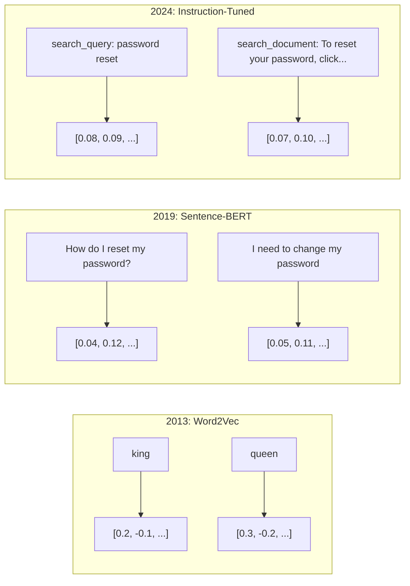
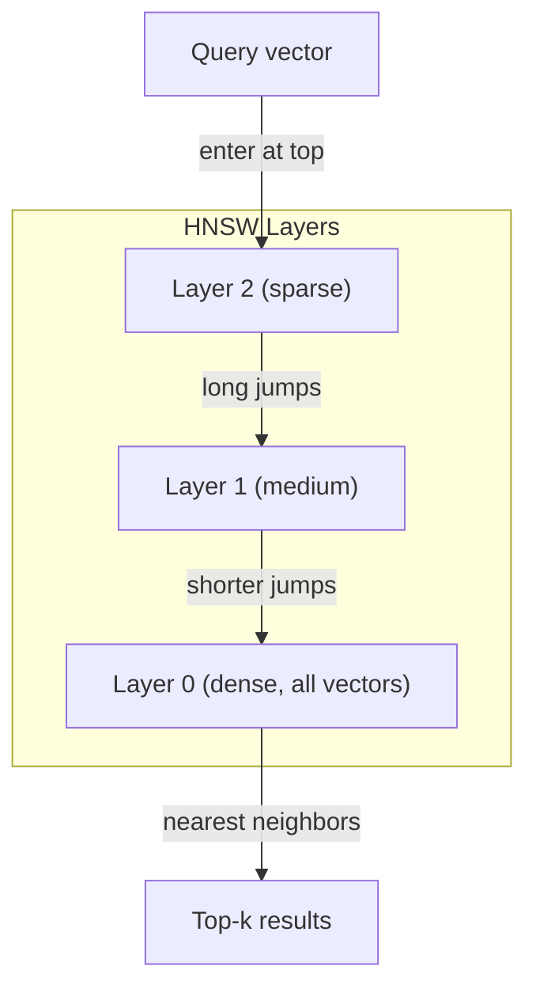
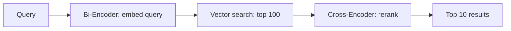

# إدخالات ومجهرات

> 文本是离散的──数学是连续的── 每当你要求LLM 查找相似文档、比较含义,或超越关键词进行搜索时,你都依赖于连接这两个世界的一个桥──这座桥就是嵌入──如果你不理解嵌入,你就不理解现代AI──你只是会使用它──

**Type:** Build
**Languages:** Python
**Prerequisites:** Phase 11, Lesson 01 (Prompt Engineering)
**Time:** ~75 minutes
**Related:**المرحلة 5 · 22 (إمبيدينغ موديلز غوص عميق) 涵盖 كثيفة vs نادرة vs متعددة المتجهات、 ماتريوشكا 截断,以及按轴选择模型──本课聚焦生产管eline(متجهات DBs、HNSW、相似度数学)──在选择模型之前,请先阅读Phase 5 · 22──

## 學习目标
- استخدام مزودي API و نماذج المصدر المفتوح 生成文本 إدمجات،并计算 بينهم تشابهات كوسين
-  شرح لماذا إدخالات 能解决 مطلوبة الكلمات البحث 无法处理的词汇不匹配问题
- إنشاء مؤشر بحث معنوي، على أساس المفاهيم وليس تحديد المفاتيح المتناسبة لتحقيق الملفات
- استخدام استرداد المعايير ((precision@k、recall) تقييم إضافة 质量,并为你的任务选择合适的 إضافة نموذج

## 问题
لديك 10،000 张支持工单──一位客户写道:我的支付没有通过. 你需要找到相似的历史工单──关键词搜索会找到包含 支付 和 没有通过 的工单──它会漏掉 交易失败,  收费被拒绝,  和 收费错误. 这些工单用完全不同的词描述完全相同的问题──

هذه هي مشكلة عدم توافق المفردات. في لغات الإنسان هناك العديد من الطرق للتعبير عن نفس الشيء. في البحث عن الكلمات الرئيسية، وضع كل كلمة كرمز مستقل بلا معنى.

تحتاج إلى طريقة، لا تمر  دفعي  和 معاملة تم رفضها   放到某某数学空间中相相近位置,同时把 دفعي وصلت في الوقت المناسب  推得很远, حتى لو كان يشارك دفع هذا الكلمة.

هذا يعني "إدماج"

## 概念
### ما هو التبني؟

التثبيت هو متجه كثيف يتكون من浮点数، يستخدم لإظهار معنى النص.

القطة جلست على السرير`[0.023, -0.041, 0.087, ..., 0.012]`وفقًا للنموذج ، فهناك قائمة تتضمن 768 إلى 3072 رقمًا.

### الانفجار في Word2Vec

في عام 2013، نشر توماس ميكولوف من جوجل وزملاؤه Word2Vec。

著名结果:

```
king - man + woman = queen
```

على إضافة الكلمات  إجراء الرياضيات المتجهة يمكن أن تلتقط علاقة لغوية  من من إلى من، تقريباً على قدم المساواة مع من إلى ملكة  من من.

Word2Vec 生成 300 维 vektورات. كل كلمة بغض النظر عن كيفية النص، تو تو تو فقط واحد متجه. بانك في ريفر بنك و بانك حساب تمتلك نفس التوابل. هذا القيود دفعت إلى دراسة العقد التالي.

### من الكلمات إلى الجمل

تعبر التوابع الكلمة عن علامات واحدة. تحتاج نظام الإنتاج إلى إجراء التوابع الكاملة.

**Averaging**:取句中所有文字向量的平均值──成本低、有损,但对短文出奇地还不错──它完全丢失词序序狗咬人 和 人咬狗 会得到相同的嵌入式──

**CLS token**:موديلات المحولات ((BERT، 2018)输出一个特殊的 [CLS] رمز إدراج، يعبر عن كل输入──比平均更好, ولكن [CLS] رمز هو للتنبؤ الجملة التالية 训练的,不是为相似度训练的──

**Contrastive learning**: ظاهرة التدريب النموذج،把相似配对拉近,把不相似配对推远.

**Instruction-tuned embeddings**: أحدث طريقة. E5 和 GTE 等模型接受任务前(search_query:、 search_document:), أخبر الموديل أن يخلق أي نوع من الإدمجات.



### نماذج إضافة حديثة

وقد تلقى السوق عدد قليل من خيارات درجة الإنتاج  حتى بداية عام 2026 درجات MTEB،MTEB v2):

| Model | Provider | Dimensions | MTEB | Context | Cost / 1M tokens |
|-------|----------|-----------|------|---------|------------------|
| Gemini Embedding 2 | Google | 3072 (Matryoshka) | 67.7 (retrieval) | 8192 | $0.15 |
| embed-v4 | Cohere | 1024 (Matryoshka) | 65.2 | 128K | $0.12 |
| voyage-4 | Voyage AI | 1024/2048 (Matryoshka) | 66.8 | 32K | $0.12 |
| text-embedding-3-large | OpenAI | 3072 (Matryoshka) | 64.6 | 8192 | $0.13 |
| text-embedding-3-small | OpenAI | 1536 (Matryoshka) | 62.3 | 8192 | $0.02 |
| BGE-M3 | BAAI | 1024 (dense+sparse+ColBERT) | 63.0 multilingual | 8192 | Open-weight |
| Qwen3-Embedding | Alibaba | 4096 (Matryoshka) | 66.9 | 32K | Open-weight |
| Nomic-embed-v2 | Nomic | 768 (Matryoshka) | 63.1 | 8192 | Open-weight |

MTEB(Masssive Text Embedding Benchmark) v2  تغطي 100+ 个任务, بما في ذلك الاستحواذ والتصنيف والتجميع والتقييم والتقييم والتقييم والتجميع. 分数越高越好── حتى 2026 سنة, نماذج ذات الوزن المفتوحة(Qwen3-Embedding、BGE-M3) على الأغلبية الأبعاد قد تمت توازن أو تجاوزت ما يصل إلى الموقع التابع للنظام التنفيذي.

### مقاييس التشابه

وبالإعطاء متجهين إضافيين، هناك ثلاثة طرق لقياسهم لديهم الكثير من التشابه:

**Cosine similarity**: اثنين من المتجهات 角的余弦值──范围从 -1(相反) إلى 1(方向相同)──忽略大小 إذا كان 10 词句和一个 500 词文档指向相同方向, فإنها يمكن الحصول على 1.0──这是 90% من الاختيار المتبقي في المثال.

```
cosine_sim(a, b) = dot(a, b) / (||a|| * ||b||)
```

**Dot product**: اثنين من المتجهات الاصلية في كمية واحدة. عندما يتم تسجيل المتجهات إلى حد واحد، فإنه مع التشابه الكوسيني 等价──计算更快── تم تسجيل إدخالات OpenAI، لذلك فإن المنتج النقطة 和 الكوسيني سوف تعطى نفس الترتيب.

```
dot(a, b) = sum(a_i * b_i)
```

**Euclidean (L2) distance**:مدى المساواة المباشرة في الفضاء: 越小 = 越相似── حساسة للتباين الكبير──الموقع الحتمي في الفضاء مهم، وليس فقط الاتجاه مهم عند استخدامها──

```
L2(a, b) = sqrt(sum((a_i - b_i)^2))
```

何時使用哪一种:

| Metric | Use when | Avoid when |
|--------|----------|------------|
| Cosine similarity | 比较长度不同的文本；大多数 retrieval 任务 | 大小携带信息 |
| Dot product | Embeddings 已经归一化；需要最高速度 | Vectors 大小不同 |
| Euclidean distance | Clustering；空间 nearest-neighbor 问题 | 比较长度差异巨大的文档 |

### قواعد بيانات المتجهات و HNSW

暴力相似度搜索将查询与每一个已存储的矢量 逐一比较──当有100,000 维 矢量 时,每一次查询需要1500亿次乘加操作──太慢──

قواعد بيانات متجهة تستخدم الحسابات القريبة القريبة لحل هذه المشكلة. الحسابات الرئيسية هي HNSW:

1. إنشاء رسمية متجهة متعددة المستويات
2. الصف الاولى هو نادرة من بين الكتائب على بعد بعيد
3. الدرجة السفلية كثيفة من بين المتجهات القريبة
4. البحث من الأعلى من المستوى بدأ، الغرور ينخفض و يتفصّل تدريجياً
5. 以 O(log n) 时间返回近似 top-k نتائج، بدلا من O(n)

HNSW باستخدام معدل تحديد ضئيل جداً ((عادة 95-99٪ التذكر) لتغيير السرعة العظيمة ارتفاعاً.



生产选项:

| Database | Type | Best for | Max scale |
|----------|------|----------|-----------|
| Pinecone | Managed SaaS | 零运维生产环境 | Billions |
| Weaviate | Open source | 自托管、hybrid search | 100M+ |
| Qdrant | Open source | 高性能、过滤 | 100M+ |
| ChromaDB | Embedded | 原型开发、本地开发 | 1M |
| pgvector | Postgres extension | 已经使用 Postgres | 10M |
| FAISS | Library | 进程内、研究 | 1B+ |

### استراتيجيات التجزئة

الملفات طويلة جدا، لا يمكن أن تكون مجرد متجهة  إجراء إدمجها ‬‬‬‬‬‬‬‬‬‬‬‬‬‬‬‬‬‬‬‬‬‬‬‬‬‬‬‬‬‬‬‬‬‬‬‬‬‬‬‬‬‬‬‬‬‬‬‬‬‬‬‬‬‬‬‬‬‬‬‬‬‬‬‬‬‬‬‬‬‬‬‬‬‬‬‬‬‬‬‬‬‬‬‬‬‬‬‬‬‬‬‬‬‬‬‬‬‬‬‬‬‬‬‬‬‬‬‬‬‬‬‬‬‬‬‬‬‬‬‬‬‬‬‬‬‬‬‬‬‬‬‬‬‬‬‬‬‬‬‬‬‬‬‬‬‬‬‬‬‬‬‬‬‬‬‬‬‬‬‬‬‬‬‬‬‬‬‬‬‬‬‬‬‬‬‬‬‬‬‬‬‬‬‬‬‬‬‬‬‬‬‬‬‬‬‬‬‬‬‬‬‬‬‬‬‬‬‬‬‬‬‬‬‬‬‬‬‬‬‬‬‬‬‬‬‬‬‬‬‬‬‬‬‬‬‬‬‬‬‬‬‬‬‬‬‬‬‬‬‬‬‬‬‬‬‬‬‬‬‬‬‬‬‬‬‬‬‬‬‬‬‬‬‬‬‬‬‬‬‬‬‬‬‬‬‬‬‬‬‬‬‬‬‬‬‬‬‬‬‬‬‬‬‬‬‬‬‬‬‬‬‬‬‬‬‬‬‬‬‬‬‬‬‬‬‬‬‬‬‬‬‬‬‬‬‬‬‬‬‬‬‬‬‬‬‬‬‬‬‬‬‬‬‬‬‬‬‬‬‬‬‬‬‬‬‬‬‬‬‬‬‬‬‬‬‬‬‬‬‬‬‬‬‬‬‬‬‬‬‬‬‬‬‬‬‬‬‬‬‬‬‬‬‬‬‬‬‬‬‬‬‬‬‬‬‬‬‬‬‬‬‬‬‬‬‬‬‬‬‬‬‬‬‬‬‬‬‬‬‬‬‬‬‬‬‬‬‬‬‬‬‬‬‬‬‬‬‬‬‬‬‬‬‬‬‬‬‬‬‬‬‬‬‬‬‬‬‬‬‬‬‬‬‬‬‬‬‬

**Fixed-size chunking**: كل N 个 Tokens 切分一次,并带 M-token overlap──简单且可预测──当文档没有清晰结构时效果很好──一个512-token piece 带50-token overlap:chunk 1 是 tokens 0-511,chunk 2 是 tokens 462-973──

**Sentence-based chunking**: في الحدود الحدودية للقواعد، سوف تقوم بتقسيم القواعد حتى تصل إلى حد الرمز. كل جزء على الأقل جملة كاملة. أفضل من الحجم الثابت، لأنك لن تقسم فكرة إلى نصفين.

**Recursive chunking**: أولا حاول في أكبر الحدود في التقسيم (قوائم القسم) ، إذا كان لا يزال كبير جدا، حاول مرة أخرى حدود الفقرة، ثم حدود الجملة، وأخيرا حدود الأحرف، وهذا هو لنجنجين.`RecursiveCharacterTextSplitter`، لـ (كوربوس) المختلطة

**Semantic chunking**: للجميع من العبارات القيام بتثبيت، ثم تثبيت التثبيتات 相似ة连续句子分组── عندما تثبيت التشابه 低于某值时, start new piece──成本高── تحتاج إلى كل جملة بشكل منفصل التثبيت، ولكن يمكن أن تنتج أكثر قطع تسلسل──

| Strategy | Complexity | Quality | Best for |
|----------|-----------|---------|----------|
| Fixed-size | Low | Decent | 非结构化文本、logs |
| Sentence-based | Low | Good | 文章、emails |
| Recursive | Medium | Good | Markdown、HTML、mixed docs |
| Semantic | High | Best | 对 retrieval 质量要求关键的场景 |

                                                                                                                                                                                                                                                              

### مقارنة بين المُشفّرات الثنائية ومُشفّرات الصليب

سوف يكون المُشفّر الثنائي مستقلًا عن البحث و المستندات، ثم يقوم بتحويله، ثم يُقارن المتجهات.

سيتم استخدام المترجم المتقاطع لتحديد المعلومات والحصول على المعلومات والحصول على المعلومات والحصول على المعلومات والحصول على المعلومات والحصول على المعلومات والحصول على المعلومات والحصول على المعلومات والحصول على المعلومات والحصول على المعلومات والحصول على المعلومات والحصول على المعلومات والحصول على المعلومات والحصول على المعلومات والحصول على المعلومات والحصول على المعلومات والحصول على المعلومات والحصول على المعلومات والحصول على المعلومات والحصول على المعلومات والحصول على المعلومات والحصول على المعلومات والحصول على المعلومات والحصول على المعلومات والحصول على المعلومات والحصول على المعلومات والحصول على المعلومات والحصول على المعلومات والحصول على المعلومات والحصول على المعلومات والحصول على المعلومات والحصول على المعلومات والحصول على المعلومات والحصول على المعلومات والحصول على المعلومات والمساعدة.

النموذج هو: إعادة تشفير المواد الثنائية بحث عن أفضل 100 مرشح، إعادة تشفير المواد المتقاطعة إلى أفضل 10 



نموذجات الترتيب:Cohere Rerank 3.5( في 1000 مرة استفسار $ 2)

### "متروشكا"

التوابل التقليدية هي كاملة أو كاملة. 1536 维 متجهة استخدام 1536 浮ات.

تعريف الماتريوشكا التعلم ((Kusupati et al., 2022) عكس هذا المشكلة. تم تدريب النموذج على جعل N 个维度 التقاط المعلومات الأهم، مثل روسيا套娃── وضع 1536-d الماتريوشكا إدراج 截截截至 256 维会损失 بعض التأكد، ولكن لا يزال قابل الاستخدام──

OpenAI's إضافة نصية-3-صغيرة 和 إضافة نصية-3-كبير 通過 `dimensions`参数支持 ماتريوشكا 截断── طلب 256 维 بدلا من 1536 维، تخفيض الاحتفاظ 6 مرات، في مقارنات MTEB 准确率大约损失 3-5%──

### الكمية الثنائية

واحد 1536 维 إضافة إلى float32  تخزين تحتاج 6,144 字节── ضرب إلى 10000000 文档: فقط المتجهات تحتاج إلى 61 جيجا بايت──

تعدد الكميات الثنائية وضع كل عجلة 转成单个位:正值变成1,负值变成0── تخزين من 6,144 字节降至192 字节减少 32 倍──相似度使用汉姆距离(统计不同位数数)计算,CPU 可以使用单条命令完成──

يؤثر معدل تحديد التذكر على الاسترداد على حوالي 5-10٪. النموذج الشائع هو: أولاً استخدام الكميات الثنائية في ملايين المتجهات فوق القيام بالبحث الأول ، ثم استخدام متجهات الدقة الكاملة على أعلى 1000 重新打分.


```figure
cosine-similarity
```

## بناءها
نحن من الصفر بدأنا بناء محرك بحث معنوي. لا تستخدم قاعدة بيانات المتجهات. لا تستخدم API خارجية تضمين.

### الخطوة 1: تحديد النص

```python
def chunk_text(text, chunk_size=200, overlap=50):
    words = text.split()
    chunks = []
    start = 0
    while start < len(words):
        end = start + chunk_size
        chunk = " ".join(words[start:end])
        chunks.append(chunk)
        start += chunk_size - overlap
    return chunks


def chunk_by_sentences(text, max_chunk_tokens=200):
    sentences = text.replace("\n", " ").split(".")
    sentences = [s.strip() + "." for s in sentences if s.strip()]
    chunks = []
    current_chunk = []
    current_length = 0
    for sentence in sentences:
        sentence_length = len(sentence.split())
        if current_length + sentence_length > max_chunk_tokens and current_chunk:
            chunks.append(" ".join(current_chunk))
            current_chunk = []
            current_length = 0
        current_chunk.append(sentence)
        current_length += sentence_length
    if current_chunk:
        chunks.append(" ".join(current_chunk))
    return chunks
```

### 步骤 2: بناء التوابل من الصفر

نحن نستخدم TF-IDF و L2 التطبيع  لتحقيق مجرد إدراج كثيف ‬‬‬‬‬‬‬‬‬‬‬‬‬‬‬‬‬‬‬‬‬‬‬‬‬‬‬‬‬‬‬‬‬‬‬‬‬‬‬‬‬‬‬‬‬‬‬‬‬‬‬‬‬‬‬‬‬‬‬‬‬‬‬‬‬‬‬‬‬‬‬‬‬‬‬‬‬‬‬‬‬‬‬‬‬‬‬‬‬‬‬‬‬‬‬‬‬‬‬‬‬‬‬‬‬‬‬‬‬‬‬‬‬‬‬‬‬‬‬‬‬‬‬‬‬‬‬‬‬‬‬‬‬‬‬‬‬‬‬‬‬‬‬‬‬‬‬‬‬‬‬‬‬‬‬‬‬‬‬‬‬‬‬‬‬‬‬‬‬‬‬‬‬‬‬‬‬‬‬‬‬‬‬‬‬‬‬‬‬‬‬‬‬‬‬‬‬‬‬‬‬‬‬‬‬‬‬‬‬‬‬‬‬‬‬‬‬‬‬‬‬‬‬‬‬‬‬‬‬‬‬‬‬‬‬‬‬‬‬‬‬‬‬‬‬‬‬‬‬‬‬‬‬‬‬‬‬‬‬‬‬‬‬‬‬‬‬‬‬‬‬‬‬‬‬‬‬‬‬‬‬‬‬‬‬‬‬‬‬‬‬‬‬‬‬‬‬‬‬‬‬‬‬‬‬‬‬‬‬‬‬‬‬‬‬‬‬‬‬‬‬‬‬‬‬‬‬‬‬‬‬‬‬‬‬‬‬‬‬‬‬‬‬‬‬‬‬‬‬‬‬‬‬‬‬‬‬‬‬‬‬‬‬‬‬‬‬‬‬‬‬‬‬‬‬‬‬‬‬‬‬‬‬‬‬‬‬‬‬‬‬‬‬‬‬‬‬‬‬‬‬‬‬‬‬‬‬‬‬‬‬‬‬‬‬‬‬‬‬‬‬‬‬‬‬‬‬‬‬‬‬‬‬‬‬‬‬‬‬‬‬‬‬‬‬‬‬‬‬‬‬‬‬‬‬‬‬‬‬‬‬‬‬‬‬‬‬‬‬‬‬‬‬‬‬‬‬‬‬‬‬‬‬‬‬‬

```python
import math
import numpy as np
from collections import Counter

class SimpleEmbedder:
    def __init__(self):
        self.vocab = []
        self.idf = []
        self.word_to_idx = {}

    def fit(self, documents):
        vocab_set = set()
        for doc in documents:
            vocab_set.update(doc.lower().split())
        self.vocab = sorted(vocab_set)
        self.word_to_idx = {w: i for i, w in enumerate(self.vocab)}
        n = len(documents)
        self.idf = np.zeros(len(self.vocab))
        for i, word in enumerate(self.vocab):
            doc_count = sum(1 for doc in documents if word in doc.lower().split())
            self.idf[i] = math.log((n + 1) / (doc_count + 1)) + 1

    def embed(self, text):
        words = text.lower().split()
        count = Counter(words)
        total = len(words) if words else 1
        vec = np.zeros(len(self.vocab))
        for word, freq in count.items():
            if word in self.word_to_idx:
                tf = freq / total
                vec[self.word_to_idx[word]] = tf * self.idf[self.word_to_idx[word]]
        norm = np.linalg.norm(vec)
        if norm > 0:
            vec = vec / norm
        return vec
```

### 步骤 3: وظائف التشابه

```python
def cosine_similarity(a, b):
    dot = np.dot(a, b)
    norm_a = np.linalg.norm(a)
    norm_b = np.linalg.norm(b)
    if norm_a == 0 or norm_b == 0:
        return 0.0
    return float(dot / (norm_a * norm_b))


def dot_product(a, b):
    return float(np.dot(a, b))


def euclidean_distance(a, b):
    return float(np.linalg.norm(a - b))
```

### 步骤 4: مؤشر المتجه مع البحث عن القوة الخام

```python
class VectorIndex:
    def __init__(self):
        self.vectors = []
        self.texts = []
        self.metadata = []

    def add(self, vector, text, meta=None):
        self.vectors.append(vector)
        self.texts.append(text)
        self.metadata.append(meta or {})

    def search(self, query_vector, top_k=5, metric="cosine"):
        scores = []
        for i, vec in enumerate(self.vectors):
            if metric == "cosine":
                score = cosine_similarity(query_vector, vec)
            elif metric == "dot":
                score = dot_product(query_vector, vec)
            elif metric == "euclidean":
                score = -euclidean_distance(query_vector, vec)
            else:
                raise ValueError(f"Unknown metric: {metric}")
            scores.append((i, score))
        scores.sort(key=lambda x: x[1], reverse=True)
        results = []
        for idx, score in scores[:top_k]:
            results.append({
                "text": self.texts[idx],
                "score": score,
                "metadata": self.metadata[idx],
                "index": idx
            })
        return results

    def size(self):
        return len(self.vectors)
```

### الخطوة 5: محرك البحث التعريفي

```python
class SemanticSearchEngine:
    def __init__(self, chunk_size=200, overlap=50):
        self.embedder = SimpleEmbedder()
        self.index = VectorIndex()
        self.chunk_size = chunk_size
        self.overlap = overlap

    def index_documents(self, documents, source_names=None):
        all_chunks = []
        all_sources = []
        for i, doc in enumerate(documents):
            chunks = chunk_text(doc, self.chunk_size, self.overlap)
            all_chunks.extend(chunks)
            name = source_names[i] if source_names else f"doc_{i}"
            all_sources.extend([name] * len(chunks))
        self.embedder.fit(all_chunks)
        for chunk, source in zip(all_chunks, all_sources):
            vec = self.embedder.embed(chunk)
            self.index.add(vec, chunk, {"source": source})
        return len(all_chunks)

    def search(self, query, top_k=5, metric="cosine"):
        query_vec = self.embedder.embed(query)
        return self.index.search(query_vec, top_k, metric)

    def search_with_scores(self, query, top_k=5):
        results = self.search(query, top_k)
        return [
            {
                "text": r["text"][:200],
                "source": r["metadata"].get("source", "unknown"),
                "score": round(r["score"], 4)
            }
            for r in results
        ]
```

### الخطوة 6: مقارنة مقاييس التشابه

```python
def compare_metrics(engine, query, top_k=3):
    results = {}
    for metric in ["cosine", "dot", "euclidean"]:
        hits = engine.search(query, top_k=top_k, metric=metric)
        results[metric] = [
            {"score": round(h["score"], 4), "preview": h["text"][:80]}
            for h in hits
        ]
    return results
```

## استخدمها
استخدام الإنتاج إضافة API 时,架构保持一致.

```python
from openai import OpenAI

client = OpenAI()

def openai_embed(texts, model="text-embedding-3-small", dimensions=None):
    kwargs = {"model": model, "input": texts}
    if dimensions:
        kwargs["dimensions"] = dimensions
    response = client.embeddings.create(**kwargs)
    return [item.embedding for item in response.data]
```

استخدام OpenAI من ماتريوشكا 截断同一个模型,更少维度,更低存储:

```python
full = openai_embed(["semantic search query"], dimensions=1536)
compact = openai_embed(["semantic search query"], dimensions=256)
```

256-d متجه استخدام الاحتفاظ به خفض 6 倍 ∙ مقابل 10000000 مستندات، هذا هو 10 جيجابايت مقابل 61 جيجابايت ∙ معدل الوقوف على الوقوف في المعايير المعيارية أعلى حوالي 3-5% ∙

استخدام المجموعة  إجراء إعادة التصنيف:

```python
import cohere

co = cohere.ClientV2()

results = co.rerank(
    model="rerank-v3.5",
    query="What is the refund policy?",
    documents=["Full refund within 30 days...", "No refunds after 90 days..."],
    top_n=3
)
```

استخدامات محلية ، لا تعتمد على API:

```python
from sentence_transformers import SentenceTransformer

model = SentenceTransformer("BAAI/bge-small-en-v1.5")
embeddings = model.encode(["semantic search query", "another document"])
```

يمكننا بناء فئة VectorIndex يمكن أن يرتبط مع هذه المخططات الإستعمال.

## 交付 it
本课产出:
- `outputs/prompt-embedding-advisor.md` واحد يستخدم لتحديد المثال المحدد اختيار إدراج نماذج و استراتيجيات
- `outputs/skill-embedding-patterns.md`إحد الاطباء وكلاء  كيفية استخدام المكثفات بشكل فعال في الإنتاج

## التدريب
1. **Metric comparison**: استخدام شبيهة الكوسينات、نتج النقاط و المسافة الأوكليدية، على المستندات العينة 运行 نفس 5 أسئلة 记录 top-3 نتائج كل طريقة 

2. **Chunk size experiment**: باستخدام 50、100、200 و500 كلمة من حجم القطعة 索引 نموذج الوثائق。 لجميع الإعدادات 运行 5 أسئلة،并记录 top-1 نقاط التشابه。 رسم حجم القطعة والجودة الاسترداد 之间的关系──找到更大的 chunks 开始产生负面影响的点──

3. **Matryoshka simulation**: بناء واحد الذي سيخلق 500-د المتجهات البسيطةEmbedder‬ قطع إلى 50‬100‬200‬ و 500 维‬ قياس كل قسم قطع تحت استرداد التذكر ‬ كيف ينخفض‬‬‬‬‬‬‬‬‬‬‬‬‬‬‬‬‬‬‬‬‬‬‬‬‬‬‬‬‬‬‬‬‬‬‬‬‬‬‬‬‬‬‬‬‬‬‬‬‬‬‬‬‬‬‬‬‬‬‬‬‬‬‬‬‬‬‬‬‬‬‬‬‬‬‬‬‬‬‬‬‬‬‬‬‬‬‬‬‬‬‬‬‬‬‬‬‬‬‬‬‬‬‬‬‬‬‬‬‬‬‬‬‬‬‬‬‬‬‬‬‬‬‬‬‬‬‬‬‬‬‬‬‬‬‬‬‬‬‬‬‬‬‬‬‬‬‬‬‬‬‬‬‬‬‬‬‬‬‬‬‬‬‬‬‬‬‬‬‬‬‬‬‬‬‬‬‬‬‬‬‬‬‬‬‬‬‬‬‬‬‬‬‬‬‬‬‬‬‬‬‬‬‬‬‬‬‬‬‬‬‬‬‬‬‬‬‬‬‬‬‬‬‬‬‬‬‬‬‬‬‬‬‬‬‬‬‬‬‬‬‬‬‬‬‬‬‬‬‬‬‬‬‬‬‬‬‬‬‬‬‬‬‬‬‬‬‬‬‬‬‬‬‬‬‬‬‬‬‬‬‬‬‬‬‬‬‬‬‬‬‬‬‬‬‬‬‬‬‬‬‬‬‬‬‬‬‬‬‬‬‬‬‬‬‬‬‬‬‬‬‬‬‬‬‬‬‬‬‬‬‬‬‬‬‬‬‬‬‬‬‬‬‬‬‬‬‬‬‬‬‬‬‬‬‬‬‬‬‬‬‬‬‬‬‬‬‬‬‬‬‬‬‬‬‬‬‬‬‬‬‬‬‬‬‬‬‬‬‬‬‬‬‬‬‬‬‬‬‬‬‬‬‬‬‬‬‬‬‬‬‬‬‬‬‬‬‬‬‬‬‬‬‬‬‬‬‬‬‬‬‬‬‬‬‬‬‬‬‬‬‬‬‬‬‬‬‬‬‬‬‬‬‬‬‬‬‬‬

4. **Binary quantization**: خذ محرك البحث بين التوابل، سوف تحويلها إلى ثنائية(عدد صريح = 1 ، عدد سلبي = 0) ، ونجح في البحث عن المسافة هامينغ── سوف تحصل على أفضل 10 نتائج مع تشابه كوسين بدقة كاملة 比较──衡量重叠百分比──

5. **Sentence-based chunking**:用 `chunk_by_sentences`بدل التقطيع الحجم الثابت  إدارة نفس الأسئلة ومقارنة درجات الاسترداد  احترام الحدود الحدود هل تحسنت النتائج؟

## 关键术语
| Term | What people say | What it actually means |
|------|----------------|----------------------|
| Embedding | “文本到数字” | 一种 dense Vector，其中几何接近性编码语义相似性 |
| Word2Vec | “最早的经典 Embedding” | 2013 年通过预测上下文词学习 word vectors 的模型；证明 Vector arithmetic 可以编码含义 |
| Cosine similarity | “两个 Vectors 有多相似” | Vectors 夹角的余弦值；1 = 方向相同，0 = 正交，-1 = 相反 |
| HNSW | “快速 Vector search” | Hierarchical Navigable Small World graph——一种多层结构，可实现 O(log n) 的 approximate nearest neighbor search |
| Bi-encoder | “分开 Embedding，快速比较” | 将 query 和 document 独立编码为 Vectors；支持预计算和快速 retrieval |
| Cross-encoder | “慢但准确的 reranker” | 让 query-document pair 联合通过完整模型处理；准确率更高，但无法预计算 |
| Matryoshka embeddings | “可截断的 Vectors” | 经过训练的 Embeddings，使前 N 个维度捕捉最重要的信息，从而支持可变大小存储 |
| Binary quantization | “1-bit embeddings” | 将 float vectors 转换为 binary（仅保留 sign bit），通过 Hamming distance search 实现 32 倍存储减少 |
| Chunking | “为 Embedding 拆分文档” | 将文档拆成 256-512 token 片段，使每个片段都可以独立 Embedding 和检索 |
| Vector database | “Embeddings 的搜索引擎” | 为存储 Vectors 并在规模化场景下执行 approximate nearest neighbor search 而优化的数据存储 |
| Contrastive learning | “通过比较训练” | 一种训练方法，把相似配对的 Embeddings 拉近，把不相似配对的 Embeddings 推远 |
| MTEB | “Embedding benchmark” | Massive Text Embedding Benchmark——覆盖 8 类任务的 56 个数据集；用于比较 Embedding models 的标准 |

## 延伸阅读
- ميكولوف وزملاء، "التقدير الفعال لممثلي الكلمات في الفضاء المتجه" (2013) Word2Vec 论文,通过 king-queen 类比开启了 Embedding 革命
- ريمرز و غورفيتش، "Sentence-BERT: Sentence Embeddings using Siamese BERT-Networks" (2019)  كيفية تدريب لغة الحروف الصفرية المماثلة من الممثلين الثنائي، أساس نماذج التركيب الحديث
- كوسوباتي وغيرهم، "التعلم التمثيلي للماتريوشكا" (2022) 可变维度 إدمجات 背后的技术,OpenAI 在文本嵌入-3采用它
- مالكوف و ياشونين، "الجهة القريبة القريبة المثلى والثابتة باستخدام الرسوم البيانية التسلسلية الملاحية للعالم الصغير" (2018) HNSW 论文,多数生产 البحث عن المتجهات 背后的算法
- دليل إضافة OpenAI (platform.openai.com/docs/guides/embeddings) text-embedding-3 نماذج
- لوحة الرئيسي MTEB (Huggingface.co/spaces/mteb/leaderboard)  مقياس حقيقي، للمقارنة مع جميع نماذج التثبيت في مختلف المهام واللغة
- [Muennighoff et al., "MTEB: Massive Text Embedding Benchmark" (EACL 2023)](https://arxiv.org/abs/2210.07316) تعريف 8 类任务(صنفية تمجميع ‬صنفية زوجات ‬إعادة التصنيف ‬التحقيق ‬STS ‬التخفيض ‬التعدين ‬التعدين ‬التعدين ‬التعدين ‬التعدين ‬التعدين ‬التعدين ‬التعدين ‬التعدين ‬التعدين ‬التعدين ‬التعدين ‬التعدين ‬التعدين ‬التعدين ‬التعدين ‬التعدين ‬التعدين ‬التعدين ‬التعدين ‬التعدين ‬التعدين ‬التعدين ‬التعدين ‬التعدين ‬التعدين ‬التعدين ‬التعدين ‬التعدين ‬التعدين ‬التعدين ‬التعدين ‬التعدين ‬التعدين ‬التعدين ‬التعدين ‬التعدين ‬التعدين ‬التعدين ‬التعدين ‬التعدين ‬التعدين ‬التعدين ‬التعدين ‬التعدين ‬التعدين ‬
- [Sentence Transformers documentation](https://www.sbert.net/)مُخترع ثنائي مقابل مُخترع متعدد، استراتيجيات التجميع، وكذلك سلطة تحقيق خط أنابيب RAG المُتجزئة المُضمنة للمخزن.
