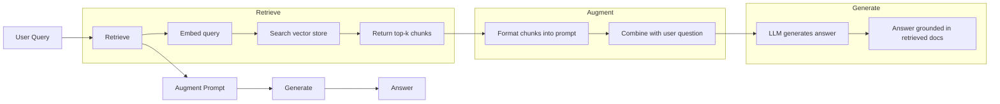
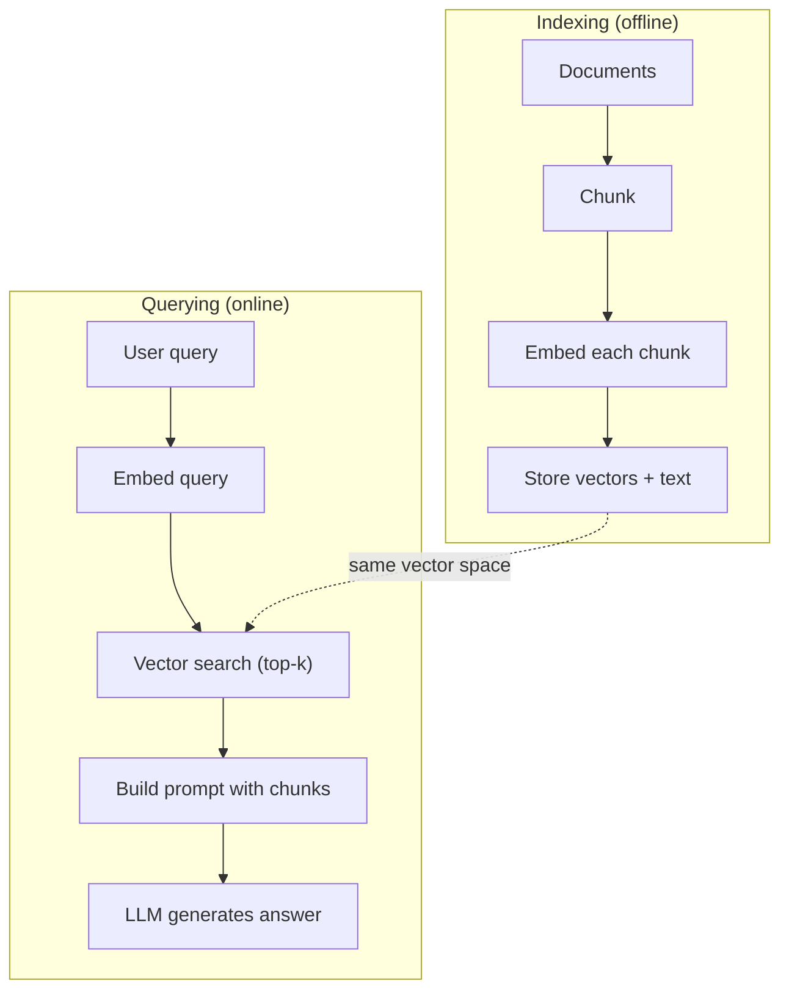

# (RAG) (الجيول المُعززة بالانتعاش)

> لم تكن دراسة الماجستير الخاصة بك تعرف كل شيء قبل انتهاء وقت التدريب. لم تكن تعرف وثائق شركتك أو قاعدة رموزك، ولم تكن تعرف سجلات المؤتمرات السابقة.

**Type:** Build
**Languages:** Python
**Prerequisites:** Phase 10 (LLMs from Scratch), Phase 11 Lessons 01-05
**Time:** ~90 minutes
**Related:**المرحلة 5 · 23 (استراتيجيات التشغيل لـ RAG) 讲解六种 chunking 算法以及各自适用场景──المرحلة 5 · 22 (إمبيدينغ موديلز غوص عميق) 讲解如何选择嵌入者──المرحلة 11 · 07 (متقدمة RAG) 讲解混合 البحث、تقييم المرتبة والتحول في استفسارات──

## 學习目标
- 构建完整的RAG管道:تحمل الوثائق                                                                                                                                                                                                                                                       
- استخدام قاعدة بيانات المتجهات ((ChromaDB、FAISS أو Pinecone)并配合合适的索引,实现语义搜索
-  شرح لماذا في التطبيقات المستندة إلى المعرفة  RAG  أفضل من التأقلم الدقيق                                                                                                                                                                                                                                                                                                                                                                                                                                                                                                    
- استخدام مقاييس الاسترداد (استعمال الدقة والتذكر) ومقياسات التوليد (التزام)

## 问题
هل قمت ببناء روبوت دردشة للشركة. أسئلة العملاء: ما هي سياسة إعادة الرسوم الخاصة ببرنامج الشركات؟ LLM أعطى إجابة عامة حول سياسة إعادة الرسوم النموذجية للشركة SaaS. في حين أن السياسة الفعلية مدفونة في ويكي داخلي يبلغ 200 صفحة، تشير إلى أن العملاء الشركات لديهم 60 نافذة، ويمكن إعادة الرسوم بنسبة.

التأقلم الدقيق هو حل. خذ هذا ماجستير في الأعمال، ومرحله من خلال المستندات الداخلية، ثم قم بتطبيق النموذج الذي يتم تحديثه. هذا ممكن، ولكن هناك مشاكل خطيرة.

RAG هو حل آخر. الحفاظ على النموذج لا يتغير. عندما تأتي المشكلة، ابحث عن المقاطع ذات الصلة في متجر الوثائق الخاص بك، ورصقها على طلب المشكلة في المواجهة السابقة، دع النموذج يعتمد على هذه المقاطع  كمصطلح للإجابة. متجر الوثائق يمكن تحديثها في غضون بضع دقائق. يمكنك أن ترى بوضوح ما هي الملفات التي يتم تحديدها.

## 概念
### نمط RAG

يمكن أن يُعمّر النموذج بأربعة خطوات:



استفسار -> استرداد -> إضافة عرض -> توليد. كل نظام RAG 系统都遵循 هذا النموذج.

### لماذا يُفوق الرق على التنسيق الجيد

| Concern | Fine-tuning | RAG |
|---------|------------|-----|
| 成本 | 每次 training run 需要 $1,000-$100,000+ | 每次 query 约 $0.01-$0.10（embedding + LLM） |
| 新鲜度 | 重新训练前一直过时 | 通过重新 indexing docs，可在几分钟内更新 |
| 可审计性 | 无法追踪 answer 到 source | 可以展示准确检索到的 passages |
| Hallucination | 仍然会自由 hallucinate | 基于检索到的 documents |
| 数据隐私 | training data 被烘焙进 weights | documents 留在你的 vector store 中 |

التنسيق الدقيق سوف تغير الأوزان الدائمة للموديل.

الموقف الوحيد الذي يخرج من التنظيم الجيد: تحتاج إلى نموذج يتبنى نوعاً ما من النمط أو النمط أو النمط التفكيري، ولكن لا يمكن أن يتم ذلك فقط من خلال الإحساس بالتحقيق.

### إضافة النماذج

نموذج إضافة 会把文本转换成密集向量──相似文本会在这个高维空间产生彼此接近的向量── 如何重置密码? 和 我需要改变密码 尽管共享的词很少,但会产生几乎相同的向量── القط الذي جلس على المطبخ 则会产生非常不同的向量──

常见嵌入型号(2026 阵容  完整分析见阶段 5 · 22):

| Model | Dimensions | Provider | Notes |
|-------|-----------|----------|-------|
| text-embedding-3-small | 1536 (Matryoshka) | OpenAI | 适合大多数用例的最佳性价比 |
| text-embedding-3-large | 3072 (Matryoshka) | OpenAI | 更高准确率，可截断到 256/512/1024 |
| Gemini Embedding 2 | 3072 (Matryoshka) | Google | 顶级 MTEB retrieval；8K context |
| voyage-4 | 1024/2048 (Matryoshka) | Voyage AI | 领域变体（code、finance、law） |
| Cohere embed-v4 | 1024 (Matryoshka) | Cohere | 强 multilingual，128K context |
| BGE-M3 | 1024 (dense + sparse + ColBERT) | BAAI (open-weight) | 一个模型提供三种视图 |
| Qwen3-Embedding | 4096 (Matryoshka) | Alibaba (open-weight) | 顶级 open-weight retrieval score |
| all-MiniLM-L6-v2 | 384 | Open-weight (Sentence Transformers) | prototyping baseline |

في هذا الدروس، سنستخدم TF-IDF لإنشاء إضافة بسيطة الخاصة بنا. ليس لأن TF-IDF هو الحل الذي يستخدمه نظام الإنتاج، ولكن لأنه يجعل المفهوم يصبح محدداً: إدخال المستندات، والمتنقلات، والخروجات، مماثلة للمستندات لتوليد متنقلات مماثلة.

### تشابه المتجه

أعطينا متجهين، كيف تقيس التشابه؟

**Cosine similarity**: اثنين من المتجهات 之间角的余弦值──范围从 -1(相反) إلى 1(完全相同)──忽略大小,只关注方向──这是RAG默认选择──

```
cosine_sim(a, b) = dot(a, b) / (||a|| * ||b||)
```

**Dot product**: المنتج الداخلي الأصلي. المتجهات الأكبر ستحصل على عدد أعلى.

```
dot(a, b) = sum(a_i * b_i)
```

**L2 (Euclidean) distance**: مساحة متجهة وسطاً على طول الطريق. المسافة فوق الصغر = زيادة التشابه.

```
L2(a, b) = sqrt(sum((a_i - b_i)^2))
```

تشابه الكوسين هو معيار الاختيار. فإنه من خلال الكبيرة، يمكن أن يعالج المستندات من مختلف طولات. عندما يقول البعض:

### استراتيجيات التجزئة

المستندات طويلة جداً، لا يمكن أن تكون متجهات فردية لتدمجها. يمكن أن يكون هناك دمج سيء جداً في 50 صفحة PDF، لأنه يحتوي على عدة عشرات من المواضيع. على العكس من ذلك، يجب عليك أن تقطع المستندات إلى قطع، وتدمج كل قطعة.

**Fixed-size chunking**: كل N 个代币 拆分一次──简单且可预测── 512 جزء 配合 50 رمز تداخل، يعني الجزء 1 هو رموز 0-511, الجزء 2 هو رموز 462-973,以此类推── تداخل 确保你不会在不走运的边界处切断句子──

**Semantic chunking**: في الحدود الطبيعية处拆分──段落、章节或标记标题── كل قطعة 都是一个语义连贯的单元──实现更复杂,但检索效果更好──

**Recursive chunking**:先尝试在最大边界处拆分(ርእስታት القسم) ・・・ إذا كان قسم ما زال كبير جداً، فلتقوم بتقسيم حدود الفقرة 拆分。 إذا كان الفقرة ما تزال كبيرة جداً، فلتقوم بتقسيم حدود الجملة 拆分── هذه هي طريقة لـ LangChain Recursive CharacterTextSplitter، في الممارسة العملية تكون فعالة جداً。

حجم الجزء أكثر أهمية من ما يعتقد الناس:

- 太小(64-128 رموز): كل قطعة 缺乏 السياق──لقد زادت بنسبة 15% الربع الماضي
- 太大(2048+ توكن): كل جزء 覆盖多主题,稀释相关性── عندما تبحث عن بيانات الإيرادات 时, تحصل على 10% 关于收入、90% 关于人数的部分──
- 理想范围 ((256-512 tokens):context 足够自包含,同时足够聚焦以保持相关性──

غالبية الإنتاج درجة RAG 系统 استخدام 256-512 قطعة رمزية،并配 50 رمز تداخلاتها.

### قواعد بيانات المتجهات

بمجرد أن يكون لديك إضافة، تحتاج إلى مكان لتخزينها والبحث عنها.

| Database | Type | Best for |
|----------|------|----------|
| FAISS | Library (in-process) | Prototyping，中小型 datasets |
| Chroma | Lightweight DB | 本地开发，小型部署 |
| Pinecone | Managed service | 无需运维负担的生产环境 |
| Weaviate | Open source DB | 自托管生产环境 |
| pgvector | Postgres extension | 已经在使用 Postgres |
| Qdrant | Open source DB | 高性能自托管 |

في هذا الدروس، سنقوم ببناء متجر متجه بسيط في الذاكرة. يضع المتجهات في قائمة الموجودات، ويجري بحثاً عن شبيهة الكوسين القوة الخامسة. وهذا يساوي استخدام FAISS للمؤشر المسطح. يمكن أن يمتد إلى 100,000 متجه قبل أن يتغير ببطء.

### خط الأنابيب الكامل



المرحلة التسجيل 阶段 على كل وثيقة 运行一次 或在文件 更新时运行)  查询 阶段在每次用户请求时运行 在生产环境中,indexing可能需要处理数百万文件在几个小时内──查询 必须在一秒内响应

### الأرقام الحقيقية

معظم النظم الإنتاجية RAG  نظام استخدام هذه العناصر:

- **k = 5 to 10**: كل استفسار 检索的块 数量
- **Chunk size = 256 to 512 tokens**,并配 50 رمز تتداخل
- **Context budget**: كل استفسار استخدام 2500-5000 رموز المحتوى المسترد
- **Total prompt**: حوالي 8000-16,000 رمزات ((استعلام النظام + قطع استرداد + تاريخ المحادثة + استفسار المستخدم)
- **Embedding dimension**:384-3072، يعتمد على النموذج
- **Indexing throughput**: استخدام إضافة API 时每秒 100-1,000 مستندات
- **Query latency**:التحقيق 50-200ms، الجيل 500-3000ms


```figure
rag-chunking
```

## بناءها
### الخطوة 1: تحديد الوثائق

```python
def chunk_text(text, chunk_size=200, overlap=50):
    words = text.split()
    chunks = []
    start = 0
    while start < len(words):
        end = start + chunk_size
        chunk = " ".join(words[start:end])
        chunks.append(chunk)
        start += chunk_size - overlap
    return chunks
```

### الخطوة الثانية: إدخال TF-IDF

نُبني وظيفة إضافة بسيطة.TF-IDF ((تردد الموعد العكسي-تردد المستند العكسي) ليست إضافة عصبية، ولكنها قادرة على التقاط أهمية الكلمات بطريقة تحويل النص إلى متجهات.

```python
import math
from collections import Counter

def build_vocabulary(documents):
    vocab = set()
    for doc in documents:
        vocab.update(doc.lower().split())
    return sorted(vocab)

def compute_tf(text, vocab):
    words = text.lower().split()
    count = Counter(words)
    total = len(words)
    return [count.get(word, 0) / total for word in vocab]

def compute_idf(documents, vocab):
    n = len(documents)
    idf = []
    for word in vocab:
        doc_count = sum(1 for doc in documents if word in doc.lower().split())
        idf.append(math.log((n + 1) / (doc_count + 1)) + 1)
    return idf

def tfidf_embed(text, vocab, idf):
    tf = compute_tf(text, vocab)
    return [t * i for t, i in zip(tf, idf)]
```

### 步骤 3: بحث عن تشابهات الكوزين

```python
def cosine_similarity(a, b):
    dot = sum(x * y for x, y in zip(a, b))
    norm_a = math.sqrt(sum(x * x for x in a))
    norm_b = math.sqrt(sum(x * x for x in b))
    if norm_a == 0 or norm_b == 0:
        return 0.0
    return dot / (norm_a * norm_b)

def search(query_embedding, stored_embeddings, top_k=5):
    scores = []
    for i, emb in enumerate(stored_embeddings):
        sim = cosine_similarity(query_embedding, emb)
        scores.append((i, sim))
    scores.sort(key=lambda x: x[1], reverse=True)
    return scores[:top_k]
```

### الخطوة 4: بناء سريع

هذا هو المكان الذي يحدث فيه في RAG المزيد ..‬‬‬‬‬‬‬‬‬‬‬‬‬‬‬‬‬‬‬‬‬‬‬‬‬‬‬‬‬‬‬‬‬‬‬‬‬‬‬‬‬‬‬‬‬‬‬‬‬‬‬‬‬‬‬‬‬‬‬‬‬‬‬‬‬‬‬‬‬‬‬‬‬‬‬‬‬‬‬‬‬‬‬‬‬‬‬‬‬‬‬‬‬‬‬‬‬‬‬‬‬‬‬‬‬‬‬‬‬‬‬‬‬‬‬‬‬‬‬‬‬‬‬‬‬‬‬‬‬‬‬‬‬‬‬‬‬‬‬‬‬‬‬‬‬‬‬‬‬‬‬‬‬‬‬‬‬‬‬‬‬‬‬‬‬‬‬‬‬‬‬‬‬‬‬‬‬‬‬‬‬‬‬‬‬‬‬‬‬‬‬‬‬‬‬‬‬‬‬‬‬‬‬‬‬‬‬‬‬‬‬‬‬‬‬‬‬‬‬‬‬‬‬‬‬‬‬‬‬‬‬‬‬‬‬‬‬‬‬‬‬‬‬‬‬‬‬‬‬‬‬‬‬‬‬‬‬‬‬‬‬‬‬‬‬‬‬‬‬‬‬‬‬‬‬‬‬‬‬‬‬‬‬‬‬‬‬‬‬‬‬‬‬‬‬‬‬‬‬‬‬‬‬‬‬‬‬‬‬‬‬‬‬‬‬‬‬‬‬‬‬‬‬‬‬‬‬‬‬‬‬‬‬‬‬‬‬‬‬‬‬‬‬‬‬‬‬‬‬‬‬‬‬‬‬‬‬‬‬‬‬‬‬‬‬‬‬‬‬‬‬‬‬‬‬‬‬‬‬‬‬‬‬‬‬‬‬‬‬‬‬‬‬‬‬‬‬‬‬‬‬‬‬‬‬‬‬‬‬‬‬‬‬‬‬‬‬‬‬‬‬‬‬‬‬‬‬‬‬‬‬‬‬‬‬‬‬‬‬‬‬‬‬‬‬‬‬‬‬‬‬‬‬‬‬‬‬‬‬‬‬‬‬‬‬‬‬‬‬‬‬‬‬‬‬‬‬‬‬‬‬‬‬‬‬‬‬‬‬‬‬‬‬‬

```python
def build_rag_prompt(query, retrieved_chunks):
    context = "\n\n---\n\n".join(
        f"[Source {i+1}]\n{chunk}"
        for i, chunk in enumerate(retrieved_chunks)
    )
    return f"""Answer the question based ONLY on the following context.
If the context doesn't contain enough information, say "I don't have enough information to answer that."

Context:
{context}

Question: {query}

Answer:"""
```

### الخطوة 5: خط أنابيب RAG الكامل

```python
class RAGPipeline:
    def __init__(self):
        self.chunks = []
        self.embeddings = []
        self.vocab = []
        self.idf = []

    def index(self, documents):
        all_chunks = []
        for doc in documents:
            all_chunks.extend(chunk_text(doc))
        self.chunks = all_chunks
        self.vocab = build_vocabulary(all_chunks)
        self.idf = compute_idf(all_chunks, self.vocab)
        self.embeddings = [
            tfidf_embed(chunk, self.vocab, self.idf)
            for chunk in all_chunks
        ]

    def query(self, question, top_k=5):
        query_emb = tfidf_embed(question, self.vocab, self.idf)
        results = search(query_emb, self.embeddings, top_k)
        retrieved = [(self.chunks[i], score) for i, score in results]
        prompt = build_rag_prompt(
            question, [chunk for chunk, _ in retrieved]
        )
        return prompt, retrieved
```

### 步骤 6: الجيل (مُحاكاة)

في بيئة الإنتاج، هنا سوف نستعمل API LLM. في هذه الدورة، نأخذ من خلال السياق المطلوب من بين القصص الأكثر صلة لتشكل الجيل المماثل.

```python
def simple_generate(prompt, retrieved_chunks):
    query_words = set(prompt.lower().split("question:")[-1].split())
    best_sentence = ""
    best_score = 0
    for chunk in retrieved_chunks:
        for sentence in chunk.split("."):
            sentence = sentence.strip()
            if not sentence:
                continue
            words = set(sentence.lower().split())
            overlap = len(query_words & words)
            if overlap > best_score:
                best_score = overlap
                best_sentence = sentence
    return best_sentence if best_sentence else "I don't have enough information."
```

## استخدمها
استخدام النموذج الحقيقي للتضمين و LLM 时,代码几乎不变:

```python
from openai import OpenAI

client = OpenAI()

def embed(text):
    response = client.embeddings.create(
        model="text-embedding-3-small",
        input=text
    )
    return response.data[0].embedding

def generate(prompt):
    response = client.chat.completions.create(
        model="gpt-4o-mini",
        messages=[{"role": "user", "content": prompt}],
        temperature=0
    )
    return response.choices[0].message.content
```

أو استخدام الأنثروبيك:

```python
import anthropic

client = anthropic.Anthropic()

def generate(prompt):
    response = client.messages.create(
        model="claude-sonnet-4-20250514",
        max_tokens=1024,
        messages=[{"role": "user", "content": prompt}]
    )
    return response.content[0].text
```

خط الأنابيب هو نفسه. استبدال وظيفة إضافة. استبدال وظيفة توليد. استرداد المنطق. تشونكينغ. بناء سريع.

 بالنسبة لتخزين المتجهات الكبيرة، باستخدام قاعدة بيانات متجهات مناسبة بدل البحث عن القوة الخام:

```python
import chromadb

client = chromadb.Client()
collection = client.create_collection("my_docs")

collection.add(
    documents=chunks,
    ids=[f"chunk_{i}" for i in range(len(chunks))]
)

results = collection.query(
    query_texts=["What is the refund policy?"],
    n_results=5
)
```

Chroma 会在内部处理嵌入式 (默认使用全-MiniLM-L6-v2),并把向量 存储在本地数据库中──同样模式,不同管道实现──

## 交付 it
本课会产出:
- `outputs/prompt-rag-architect.md` عرض للمستخدمين في تصميم RAG 系统
- `outputs/skill-rag-pipeline.md` مهارة وكيل تدريس كيفية بناء وتصميم خطوط أنابيب RAG

## التدريب
1. استخدام بسيط من كيس الكلمات  طريقة بديل تضمينات TF-IDF(二值: كلمة وجودها = 1,不存在则为 0) ・・・ في المستندات العينة 上比较检索质量──TF-IDF 应该表现更好,因为它会给罕见词更高权重──

2. 试验不同块大小: في مجموعة الوثائق نفسها 上尝试 50、100、200 和 500 كلمة。 لكل حجم، نفذ نفس 5 أسئلة،并统计有多少能返回相关块在前3中──找到检索质量 达到峰值的甜点──

3. لكل جزء 添加元数据 ((اسم الوثيقة المصدر  موقع الجزء) )

4. 实现 a simple evaluation: give determin 10  زوجات من الأسئلة والإجابات، دع كل سؤال  عبر خطوط الأنابيب RAG،并衡检索到的块中有多少比例包含答案──这是检索回忆在 k──

5. 构建对话意识的RAG管道:维护最近3轮交易的历史,并将其与检索的块 一起包含在快速中──使用后续问题 测试,例如在询问定价 后再问 怎么样企业?──

## 关键术语
| Term | What people say | What it actually means |
|------|----------------|----------------------|
| RAG | “能阅读你文档的 AI” | 检索相关 documents，把它们粘贴到 prompt 中，并生成一个基于这些 documents 的 answer |
| Embedding | “把文本转换成数字” | 文本的 dense vector representation，其中相似含义会产生相似 vectors |
| Vector database | “面向 AI 的搜索引擎” | 为存储 vectors 并按 similarity 找到 nearest neighbors 而优化的数据存储 |
| Chunking | “把 docs 拆成片段” | 将 documents 拆成更小的 segments（通常 256-512 tokens），以便每个 segment 可以独立 embed 和 retrieve |
| Cosine similarity | “两个 vectors 有多相似” | 两个 vectors 之间夹角的余弦值；1 = 方向相同，0 = 正交，-1 = 相反 |
| Top-k retrieval | “取 k 个最佳匹配” | 从 vector store 中返回与 query 最相似的 k 个 chunks |
| Context window | “LLM 能看到多少文本” | LLM 在单次请求中可以处理的最大 tokens 数；retrieved chunks 必须放入这个范围内 |
| Augmented generation | “使用给定 context 回答” | 使用检索到的 documents 作为 context 来生成响应，而不是仅依赖训练得到的知识 |
| TF-IDF | “词语重要性评分” | Term Frequency 乘以 Inverse Document Frequency；根据词语在 corpus 中的区分度为其加权 |
| Indexing | “为搜索准备 docs” | 离线执行 chunking、embedding 和 storing documents 的过程，使它们能在 query time 被搜索 |

## 延伸阅读
- لويس وغيره ، التحقيق-الجيول المُزدهرة لمهام NLP المكثفة المعرفة  (2020)  بحث فيسبوك عن الذكاء الاصطناعي 提出的原始 RAG 论文,形式化了恢复-then-genera 模式
- وثائق RAG الأنثروبية (docs.anthropic.com)   حول حجم الجزء、بناء سريع و تقييم
- مركز التعلم باينكون، ما هو RAG؟  用清晰可视化解释 راج أنابيب،并包含生产环境考量
- جملة-BERT: Reimers & Gurevych (2019)  كل من نماذج إدمج MiniLM 背后的论文,展示如何为语义相似性 训练双码器
- [Karpukhin et al., “Dense Passage Retrieval for Open-Domain Question Answering” (EMNLP 2020)](https://arxiv.org/abs/2004.04906) DPR 论文, اثبات كثافة إعادة الوصول إلى المرموزين الثنائي في النطاق المفتوح QA 上优于 BM25,并建立了现代RAG استرداد النموذج.
- [LlamaIndex High-Level Concepts](https://docs.llamaindex.ai/en/stable/getting_started/concepts.html) بناء خطوط أنابيب RAG 时需要了解主要概念:حاملات البيانات ‧مصفحات العقدات ‧مؤشرات ‧المستردودات ‧مختلفات الاستجابة‬‬‬‬‬‬‬‬‬‬‬‬‬‬‬‬‬‬‬‬‬‬‬‬‬‬‬‬‬‬‬‬‬‬‬‬‬‬‬‬‬‬‬‬‬‬‬‬‬‬‬‬‬‬‬‬‬‬‬‬‬‬‬‬‬‬‬‬‬‬‬‬‬‬‬‬‬‬‬‬‬‬‬‬‬‬‬‬‬‬‬‬‬‬‬‬‬‬‬‬‬‬‬‬‬‬‬‬‬‬‬‬‬‬‬‬‬‬‬‬‬‬‬‬‬‬‬‬‬‬‬‬‬‬‬‬‬‬‬‬‬‬‬‬‬‬‬‬‬‬‬‬‬‬‬‬‬‬‬‬‬‬‬‬‬‬‬‬‬‬‬‬‬‬‬‬‬‬‬‬‬‬‬‬‬‬‬‬‬‬‬‬‬‬‬‬‬‬‬‬‬‬‬‬‬‬‬‬‬‬‬‬‬‬‬‬‬‬‬‬‬‬‬‬‬‬‬‬‬‬‬‬‬‬‬‬‬‬‬‬‬‬‬‬‬‬‬‬‬‬‬‬‬‬‬‬‬‬‬‬‬‬‬‬‬‬‬‬‬‬‬‬‬‬‬‬‬‬‬‬‬‬‬‬‬‬‬‬‬‬‬‬‬‬‬‬‬‬‬‬‬‬‬‬‬‬‬‬‬‬‬‬‬‬‬‬‬‬‬‬‬‬‬‬‬‬‬‬‬‬‬‬‬‬‬‬‬‬‬‬‬‬‬‬‬‬‬‬‬‬‬‬‬‬‬‬‬‬‬‬‬‬‬‬‬‬‬‬‬‬‬‬‬‬‬‬‬‬‬‬‬‬‬‬‬‬‬‬‬‬‬‬‬‬‬‬‬‬‬‬‬‬‬‬‬‬‬‬‬‬‬‬‬‬‬‬‬‬‬‬‬‬‬‬‬‬‬‬‬‬‬‬‬‬‬‬‬‬‬‬‬‬‬‬‬‬‬‬‬‬‬‬‬‬‬‬
- [LangChain RAG tutorial](https://python.langchain.com/docs/tutorials/rag/) 另一种风格的管弦乐器;以 سلسلة من المدار 视角理解同一个恢复-然后生成模式──
