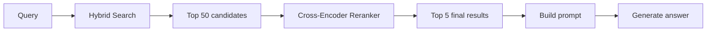
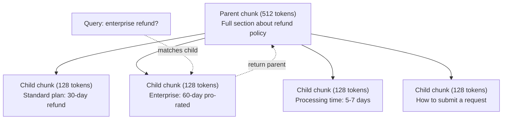
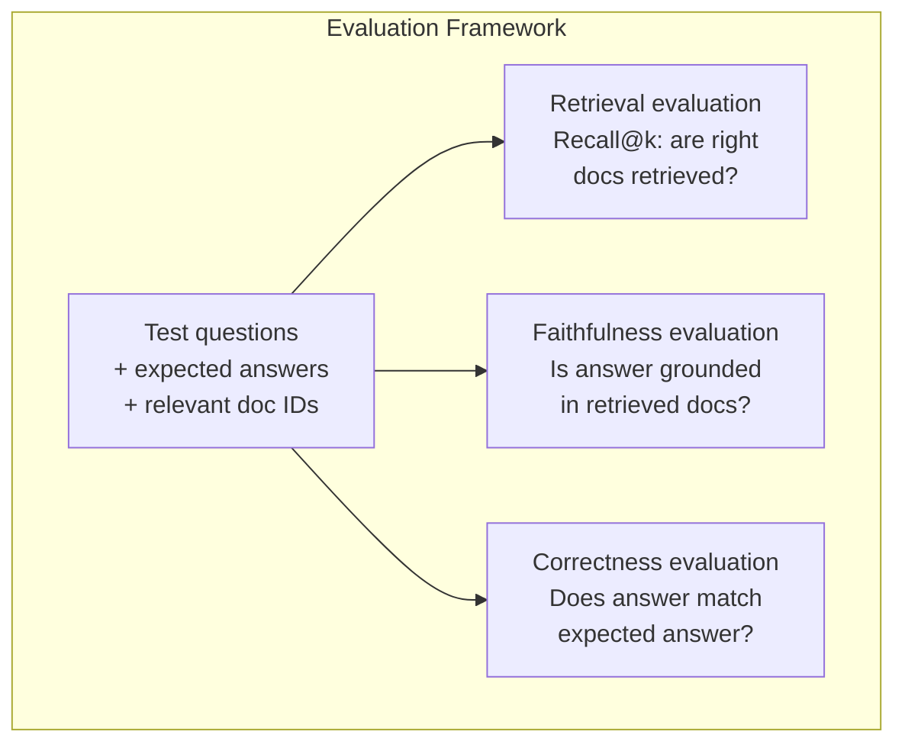

# RAG المتقدمة ((تجزئة ‬تصنيف ‬بحث هجين)

> RAG الأساسية سوف تفتش أكثر جزءا مماثلا من الملفات المشتركة. هذا ينطبق على مشكلة بسيطة. ولكن في مواجهة التفكير متعدد المراكز.

**类型：**الإنشاء
**语言：**بايثون
**前置要求：**المرحلة 11، الدروس 06 (RAG)
**时间：**90 دقيقة
**相关：**المرحلة 5 · 23 (استراتيجيات التقطيع للجوهرات الرقمية) تغطي جميع أنواع التقطيع الالتقطيع الالتقطيع الالتقطيع الالتقطيع الالتقطيع الالتقطيع الالتقطيع الالتقطيع الالتقطيع الالتقطيع الالتقطيع الالتقطيع الالتقطيع الالتقطيع الالتقطيع الالتقطيع الالتقطيع الالتقطيع الالتقطيع الالتقطيع الالتقطيع الالتقطيع الالتقطيع الالتقطيع الالتقطيع الالتقطيع الالتقطيع الالتقطيع الالتقطيع الالتقطيع الالتقطيع الالتقطيع الالتقطيع الالتقطيع الالتقطيع الالتقطيع الالتقطيع الالتقطيع الالتقطيع الالتقطيع الالتقطيع الالتقطيع الالتقطيع الالتقطيع الالتقطيع الالتقطيع الالتقطيع الالتقطيع الالتقطيع الالتقطيع الالتقطيع الالتقطيع الالتقطيع الالتقطيع الالتقطيع الالتقطيع الالتقطيع الالتقطيع الالتقطعي

## 學习目标

- 实现能够保留文档结构和上下文的高级分化 策略
- بناء خط أنابيب بحث هجين، و سوف BM25 المقابلة الكلمات الرئيسية مع البحث المتجهة و الترابط المتقاطع
- تطبيق تحويل المعلومات 技术 HyDE、متعدد المعلومات、خطوة إلى الوراء) ، تحسين المعلومات أو المشكلة المعقدة
- 诊断并修复常见 RAG 失败:检索到错误块、答案不在背景 中、多跳推理 崩

## 问题

في الدروس 06 ، قمنا ببناء خط أنابيب RAG الأساسي.

**模糊 query**:"ما كان الإيرادات الربع الماضي؟" البحث النطاقي  العودة حول استراتيجية الإيرادات ‬التوقعات الإيرادات، وكذلك المدير المالي على نمو الإيرادات ‬ ‬ ‬ ‬ ‬ ‬ ‬ ‬ ‬ ‬ ‬ ‬ ‬ ‬ ‬ ‬ ‬ ‬ ‬ ‬ ‬ ‬ ‬ ‬ ‬ ‬ ‬ ‬ ‬ ‬ ‬ ‬ ‬ ‬ ‬ ‬ ‬ ‬ ‬ ‬ ‬ ‬ ‬ ‬ ‬ ‬ ‬ ‬ ‬ ‬ ‬ ‬ ‬ ‬ ‬ ‬ ‬ ‬ ‬ ‬ ‬ ‬ ‬ ‬ ‬ ‬ ‬ ‬ ‬ ‬ ‬ ‬ ‬ ‬ ‬ ‬ ‬ ‬ ‬ ‬ ‬ ‬ ‬ ‬ ‬ ‬ ‬ ‬ ‬ ‬ ‬ ‬ ‬ ‬ ‬ ‬ ‬ ‬ ‬ ‬ ‬ ‬ ‬ ‬ ‬ ‬ ‬ ‬ ‬ ‬ ‬ ‬ ‬ ‬ ‬ ‬ ‬ ‬ ‬ ‬ ‬ ‬ ‬ ‬ ‬ ‬ ‬ ‬ ‬ ‬ ‬ ‬ ‬ ‬ ‬ ‬ ‬ ‬ ‬ ‬ ‬ ‬ ‬ ‬ ‬ ‬ ‬ ‬ ‬ ‬ ‬ ‬ ‬ ‬ ‬ ‬ ‬ ‬ ‬ ‬ ‬ ‬ ‬ ‬ ‬ ‬ ‬ ‬ ‬ ‬ ‬ ‬ ‬ ‬ ‬ ‬ ‬ ‬ ‬ ‬ ‬ ‬ ‬ ‬ ‬ ‬ ‬ ‬ ‬ ‬ ‬ ‬ ‬ ‬ ‬ ‬ ‬ ‬ ‬ ‬ ‬ ‬ ‬ ‬ ‬ ‬ ‬ ‬ ‬ ‬ ‬ ‬ ‬ ‬ ‬ ‬ ‬ ‬ ‬ ‬ ‬ ‬ ‬ ‬ ‬ ‬ ‬ ‬ ‬ ‬ ‬$47.2M in Q3 2025"，但使用的是 "earnings" 而不是 "revenue"。Embedding model 认为 "revenue strategy" 比 "Q3 earnings were $47،2 م" أكثر قرب السؤال

**Multi-hop question**:"أي فريق كان لديه أعلى تحسن في درجة رضا العملاء؟" هذا يحتاج إلى العثور على درجة رضا كل فريق، إجراء مقارنة، ومعرفة أقصى قيمة.

**大规模 corpus 问题**: لديك 200 مليون قطعة. صحيح جواب في قطعة #1,847,293. استرجاعك في المرتبة الخامسة الأوّل قد أخذ قطعة #14、#89,201、#1,200,000、#44 و #901,333.

السبب الأساسي للفشل في RAG هو شبكة المتوهج غير متساوية إلى ارتباطها. جزء يمكن أن يكون على النحو الحرفي مع السؤال.

## مفهوم الأساسي

### البحث الهجري: السيمنتيك + الكلمة الرئيسية

البحث الاسمني ((شبهة المتجه)擅长理解含义。"كيف أُلغِي الاشتراك الخاص بي؟" حتى مع "خطوات لإنهاء خطتك" 没有共享单词,也能匹配──但它会漏掉精确匹配──"رمز الخطأ E-4021"可能不能匹配包含 "E-4021" جزء، لأن نموذج الإدراج قد يجعل ذلك صوتاً──

بحث الكلمات الرئيسية ((BM25) صحيح جيد في المقابل. انها جيدة في تحديد الموافقة.

البحث الهجري سوف يعمل معا ثم يجمع النتائج

**BM25**(Best Matching 25) هو الوسائط القياسية للبحث عن الكلمات الرئيسية 算法. منذ 1990s، كان هو قلب محرك البحث.

```
BM25(q, d) = sum over terms t in q:
    IDF(t) * (tf(t,d) * (k1 + 1)) / (tf(t,d) + k1 * (1 - b + b * |d| / avgdl))
```

من بين tf(t،d) هو المصطلح t في الوثيقة d 中的 المصطلحات تردد،IDF(t) هو تردد الوثيقة العكسية،

يقول المقال: عندما يحتوي الملف على مصطلحات استفسار خاصة في مصطلحات نادرة، فإن BM25 سوف يعطي الملفات أعلى، ولكن الملفات التي تكرر الملفات سوف تتراجع.

### الاندماج المتبادل للدرجة ((RRF)

لديك قائمة مرتبة: واحدة من البحث عن المتجهات، والآخر من BM25... كيف تجميعها؟

```
RRF_score(d) = sum over rankings R:
    1 / (k + rank_R(d))
```

من بينها k هو عدد ثابت (معظمها 60) ، لمنع نتائج التصنيف الأول من الاستفادة من الميزات الكبيرة.

واحد في البحث عن المتجهات 中排名 # 1 ∙ في BM25 中排名 # 5 的文档得分为:1/(60+1) + 1/(60+5) = 0.0164 + 0.0154 = 0.0318

واحد في البحث عن المتجهات 中排名 #3 ✓ في BM25 中排名 #2 的文档得分为:1/(60+3) + 1/(60+2) = 0.0159 + 0.0161 = 0.0320

RRF سوف توازن الطبيعي هذه النوعين من الإشارات. واحد من المستندات التي تصنف عالياً في قائمتين يحصل على أفضل النتيجة. واحد من المستندات التي تصنف في قائمة معينة # 1 ، ولكن المستندات التي لا تظهر في قائمة أخرى تحصل على درجة متوسطة. هذا أمر ثابت للغاية ، لأنه يستخدم الترتيب ، وليس النتائج الأصلية ، لذلك لن يؤثر اختلافات توزيع النتائج بين النظمين على ذلك.

### إعادة التصنيف

استرداد (((无论是矢量、关键词还是混合) 速度快,但不够精确──它使用双编码: query 和每个文档 独立进行嵌入,然后比较──嵌入会提前计算并缓存──这可以扩展到数百万文档──

التصنيف باستخدام رمز عبر: استفسار 和 وثيقة المرشح 会一起输入模型,模型输出相关性分数――模型能同时看到两段文本,因此可以捕捉它们之间的细粒度交互―― رمز عبر 能理解 "ما كانت أرباح Q3؟" مع الحجم الذي يحتوي على "$47.2M في Q3" 高度相关, حتى لو كان رمز اثنين 漏掉这种联系──

权衡是:Cross-encoder比 bi-encoder 慢 100-1000 倍, لأنه يحتاج إلى معالجة مشتركة زوج السؤال وثيقة.



常见 إعادة تصنيف النموذج ((2026 阵容):
- Cohere Rerank 3.5: إدارة API,多语言, في مختلطة corpus 上 استرجاع أفضل
- تعديل رتبة الرحلة-2.5: إدارة API, توبيب الاختيارات
- Jina-Reranker-v2 متعددة اللغات:مفتوحة الوزن،支持 100+ 语言
- bge-reanker-v2-m3: الوزن المفتوح، خط أساسي قوي
- كراس-مخفف /ms-ماركو-MiniLM-L-6-v2: مفتوح الوزن،可在CPU 上运行، تناسب النموذج الأول
- ColBERTv2 / Jina-ColBERT-v2: المتفاعل المتأخر المتعدد المتجهات، في المقاييس هي O(tokens) وليس O(docs)

### التحويل المطلوب

هناك بعض المشكلة في استرداد البيانات، ولكن في البحث في الواقع. "ما كان ذلك الشيء حول تغيير السياسة الجديدة؟" هو سؤال بحثي سيء جدا.

**Query rewriting**:把用户查询 改写成更好的搜索查询――LLM يمكن القيام بذلك:

```
User: "What was that thing about the new policy change?"
Rewritten: "Recent policy changes and updates"
```

**HyDE（Hypothetical Document Embeddings）**لا تستخدم الاستطلاع، بل تستخدم إجابة افتراضية، و تقوم بتثبيتها، ثم تبحث عن المستندات الحقيقية المماثلة.

```
Query: "What is the refund policy for enterprise?"
Hypothetical answer: "Enterprise customers are eligible for a full refund
within 60 days of purchase. Refunds are pro-rated based on the remaining
subscription period and processed within 5-7 business days."
```

للجواب المفترض قم بتدمج، ومبحث عن المستندات الحقيقية المماثلة لها.

HyDE 会在检索前增加一次LLM调调――这会增加500-2000ms latency――当原始查询检索质量较差时,这是值得的――

### التشويش بين الوالدين والأطفال

標準 chunking 迫使你做取舍:                                                                                                                                                                                                                                                         

索引小块(128 توكن) لاستخدامها في الاسترداد.



السؤال "استرداد الشركات؟" 会精确匹配 طفل جزء C2── ولكن الإرشاد  استلم جزء كامل الوالد P، والتي تتضمن حول الوقت المعالجة وتقديم الاتصال 

### تصفية البيانات المعدنية

في عملية البحث المتجهة 之前, حسب البيانات الوصفية 过 corpus:date、source、category、author、language。 هذا سوف يقلل من المجال البحث ومجنب عدم الارتباط بالمنتجات。

"ما الذي تغير في سياسة الأمن الشهر الماضي؟" 应只搜索最近 30 天、安全类 中的文档──如果 لا يوجد تصفية البيانات المعدنية، فسوف تبحث في كامل الجسم، ربما تفتش إلى وثيقة أمن قبل عامين، فقط لأنه في القول يشبهها──

إنتاج RAG 系统会把元数据与每块一起存储:源文档、创建日期、类别、作者、版本──矢量数据库 支持在相似性搜索前按元数据 进行预过,这对大规模性能至关重要──

### التقييم

كيف تعرف إن كان يعمل؟

**Retrieval relevance（Recall@k）**: بالنسبة لمجموعة من الأسئلة الاختبارية التي تحمل وثائق ذات صلة معروفة ، ما هو النسبة بين النتائج التي ظهرت في المقالة الأولى؟ إذا كان إجابة سؤال ما في الجزء #47 ، الجزء #47 ، هل ظهرت في المقالة الأولى؟

**Faithfulness**إذا كان جزء البحث يكتب "فندوق استرداد 60 يوما" ، بينما النموذج يجيب "فندوق استرداد 90 يوما" ، فهذا يعني الوفاء 失败。 النموذج لا يزال يقع في الهلوسة في حالة وجود سياق صحيح‬‬‬‬‬‬‬‬‬‬‬‬‬‬‬‬‬‬‬‬‬‬‬‬‬‬‬‬‬‬‬‬‬‬‬‬‬‬‬‬‬‬‬‬‬‬‬‬‬‬‬‬‬‬‬‬‬‬‬‬‬‬‬‬‬‬‬‬‬‬‬‬‬‬‬‬‬‬‬‬‬‬‬‬‬‬‬‬‬‬‬‬‬‬‬‬‬‬‬‬‬‬‬‬‬‬‬‬‬‬‬‬‬‬‬‬‬‬‬‬‬‬‬‬‬‬‬‬‬‬‬‬‬‬‬‬‬‬‬‬‬‬‬‬‬‬‬‬‬‬‬‬‬‬‬‬‬‬‬‬‬‬‬‬‬‬‬‬‬‬‬‬‬‬‬‬‬‬‬‬‬‬‬‬‬‬‬‬‬‬‬‬‬‬‬‬‬‬‬‬‬‬‬‬‬‬‬‬‬‬‬‬‬‬‬‬‬‬‬‬‬‬‬‬‬‬‬‬‬‬‬‬‬‬‬‬‬‬‬‬‬‬‬‬‬‬‬‬‬‬‬‬‬‬‬‬‬‬‬‬‬‬‬‬‬‬‬‬‬‬‬‬‬‬‬‬‬‬‬‬‬‬‬‬‬‬‬‬‬‬‬‬‬‬‬‬‬‬‬‬‬‬‬‬‬‬‬‬‬‬‬‬‬‬‬‬‬‬‬‬‬‬‬‬‬‬‬‬‬‬‬‬‬‬‬‬‬‬‬‬‬‬‬‬‬‬‬‬‬‬‬‬‬‬‬‬‬‬‬‬‬‬‬‬‬‬‬‬‬‬‬‬‬‬‬‬‬‬‬‬‬‬‬‬‬‬‬‬‬‬‬‬‬‬‬‬‬‬‬‬‬‬‬‬‬‬‬‬‬‬‬‬‬‬‬‬‬‬‬‬‬‬‬‬‬‬‬‬‬‬‬‬‬‬‬‬‬‬‬‬‬‬‬

**Answer correctness**: هل إجابة المنتج تتطابق مع الإجابة المتوقعة؟ هذا مؤشر من نهاية إلى نهاية.

واحد بسيط من الوفاء 检查:取生成答案中的每个索赔,并验证它是否(实质上) ظهرت في جزء من المشتريات.




```figure
agentic-rag-loop
```

## الإنشاء

### الخطوة 1:BM25

```python
import math
from collections import Counter

class BM25:
    def __init__(self, k1=1.2, b=0.75):
        self.k1 = k1
        self.b = b
        self.docs = []
        self.doc_lengths = []
        self.avg_dl = 0
        self.doc_freqs = {}
        self.n_docs = 0

    def index(self, documents):
        self.docs = documents
        self.n_docs = len(documents)
        self.doc_lengths = []
        self.doc_freqs = {}

        for doc in documents:
            words = doc.lower().split()
            self.doc_lengths.append(len(words))
            unique_words = set(words)
            for word in unique_words:
                self.doc_freqs[word] = self.doc_freqs.get(word, 0) + 1

        self.avg_dl = sum(self.doc_lengths) / self.n_docs if self.n_docs else 1

    def score(self, query, doc_idx):
        query_words = query.lower().split()
        doc_words = self.docs[doc_idx].lower().split()
        doc_len = self.doc_lengths[doc_idx]
        word_counts = Counter(doc_words)
        score = 0.0

        for term in query_words:
            if term not in word_counts:
                continue
            tf = word_counts[term]
            df = self.doc_freqs.get(term, 0)
            idf = math.log((self.n_docs - df + 0.5) / (df + 0.5) + 1)
            numerator = tf * (self.k1 + 1)
            denominator = tf + self.k1 * (1 - self.b + self.b * doc_len / self.avg_dl)
            score += idf * numerator / denominator

        return score

    def search(self, query, top_k=10):
        scores = [(i, self.score(query, i)) for i in range(self.n_docs)]
        scores.sort(key=lambda x: x[1], reverse=True)
        return scores[:top_k]
```

### الخطوة الثانية: الاندماج المتبادل

```python
def reciprocal_rank_fusion(ranked_lists, k=60):
    scores = {}
    for ranked_list in ranked_lists:
        for rank, (doc_id, _) in enumerate(ranked_list):
            if doc_id not in scores:
                scores[doc_id] = 0.0
            scores[doc_id] += 1.0 / (k + rank + 1)
    fused = sorted(scores.items(), key=lambda x: x[1], reverse=True)
    return fused
```

### الخطوة 3: خط أنابيب البحث الهجري

```python
def hybrid_search(query, chunks, vector_embeddings, vocab, idf, bm25_index, top_k=5, fusion_k=60):
    query_emb = tfidf_embed(query, vocab, idf)
    vector_results = search(query_emb, vector_embeddings, top_k=top_k * 3)
    bm25_results = bm25_index.search(query, top_k=top_k * 3)
    fused = reciprocal_rank_fusion([vector_results, bm25_results], k=fusion_k)
    return fused[:top_k]
```

### الخطوة الرابعة:

في الإنتاج، ستستخدم نموذج التشفير المتقاطع. هنا نُبني رينكر، باستخدام تعليق الكلمات. أهمية المصطلحات.

```python
def rerank(query, candidates, chunks):
    query_words = set(query.lower().split())
    stop_words = {"the", "a", "an", "is", "are", "was", "were", "what", "how",
                  "why", "when", "where", "do", "does", "for", "of", "in", "to",
                  "and", "or", "on", "at", "by", "it", "its", "this", "that",
                  "with", "from", "be", "has", "have", "had", "not", "but"}
    query_terms = query_words - stop_words

    scored = []
    for doc_id, initial_score in candidates:
        chunk = chunks[doc_id].lower()
        chunk_words = set(chunk.split())

        term_overlap = len(query_terms & chunk_words)

        query_bigrams = set()
        q_list = [w for w in query.lower().split() if w not in stop_words]
        for i in range(len(q_list) - 1):
            query_bigrams.add(q_list[i] + " " + q_list[i + 1])
        bigram_matches = sum(1 for bg in query_bigrams if bg in chunk)

        position_boost = 0
        for term in query_terms:
            pos = chunk.find(term)
            if pos != -1 and pos < len(chunk) // 3:
                position_boost += 0.5

        rerank_score = (
            term_overlap * 1.0
            + bigram_matches * 2.0
            + position_boost
            + initial_score * 5.0
        )
        scored.append((doc_id, rerank_score))

    scored.sort(key=lambda x: x[1], reverse=True)
    return scored
```

### 步骤 5:HyDE(مشاركات الوثيقة المفترضة)

```python
def hyde_generate_hypothesis(query):
    templates = {
        "what": "The answer to '{query}' is as follows: Based on our documentation, {topic} involves specific policies and procedures that define how the process works.",
        "how": "To address '{query}': The process involves several steps. First, you need to initiate the request. Then, the system processes it according to the defined rules.",
        "default": "Regarding '{query}': Our records indicate specific details and policies related to this topic that provide a comprehensive answer."
    }
    query_lower = query.lower()
    if query_lower.startswith("what"):
        template = templates["what"]
    elif query_lower.startswith("how"):
        template = templates["how"]
    else:
        template = templates["default"]

    topic_words = [w for w in query.lower().split()
                   if w not in {"what", "is", "the", "how", "do", "does", "a", "an",
                                "for", "of", "to", "in", "on", "at", "by", "and", "or"}]
    topic = " ".join(topic_words) if topic_words else "this topic"

    return template.format(query=query, topic=topic)


def hyde_search(query, chunks, vector_embeddings, vocab, idf, top_k=5):
    hypothesis = hyde_generate_hypothesis(query)
    hypothesis_emb = tfidf_embed(hypothesis, vocab, idf)
    results = search(hypothesis_emb, vector_embeddings, top_k)
    return results, hypothesis
```

### الخطوة 6: إزالة الوالدين من الأطفال

```python
def create_parent_child_chunks(text, parent_size=200, child_size=50):
    words = text.split()
    parents = []
    children = []
    child_to_parent = {}

    parent_idx = 0
    start = 0
    while start < len(words):
        parent_end = min(start + parent_size, len(words))
        parent_text = " ".join(words[start:parent_end])
        parents.append(parent_text)

        child_start = start
        while child_start < parent_end:
            child_end = min(child_start + child_size, parent_end)
            child_text = " ".join(words[child_start:child_end])
            child_idx = len(children)
            children.append(child_text)
            child_to_parent[child_idx] = parent_idx
            child_start += child_size

        parent_idx += 1
        start += parent_size

    return parents, children, child_to_parent
```

### 步骤 7: تقييم الوفاء

```python
def evaluate_faithfulness(answer, retrieved_chunks):
    answer_sentences = [s.strip() for s in answer.split(".") if len(s.strip()) > 10]
    if not answer_sentences:
        return 1.0, []

    grounded = 0
    ungrounded = []
    context = " ".join(retrieved_chunks).lower()

    for sentence in answer_sentences:
        words = set(sentence.lower().split())
        stop_words = {"the", "a", "an", "is", "are", "was", "were", "and", "or",
                      "to", "of", "in", "for", "on", "at", "by", "it", "this", "that"}
        content_words = words - stop_words
        if not content_words:
            grounded += 1
            continue

        matched = sum(1 for w in content_words if w in context)
        ratio = matched / len(content_words) if content_words else 0

        if ratio >= 0.5:
            grounded += 1
        else:
            ungrounded.append(sentence)

    score = grounded / len(answer_sentences) if answer_sentences else 1.0
    return score, ungrounded


def evaluate_retrieval_recall(queries_with_relevant, retrieval_fn, k=5):
    total_recall = 0.0
    results = []

    for query, relevant_indices in queries_with_relevant:
        retrieved = retrieval_fn(query, k)
        retrieved_indices = set(idx for idx, _ in retrieved)
        relevant_set = set(relevant_indices)
        hits = len(retrieved_indices & relevant_set)
        recall = hits / len(relevant_set) if relevant_set else 1.0
        total_recall += recall
        results.append({
            "query": query,
            "recall": recall,
            "hits": hits,
            "total_relevant": len(relevant_set)
        })

    avg_recall = total_recall / len(queries_with_relevant) if queries_with_relevant else 0
    return avg_recall, results
```

## استخدام

استخدام حقيقية التشفير المتقاطع  إجراء إعادة التصنيف:

```python
from sentence_transformers import CrossEncoder

reranker = CrossEncoder("cross-encoder/ms-marco-MiniLM-L-6-v2")

def rerank_with_cross_encoder(query, candidates, chunks, top_k=5):
    pairs = [(query, chunks[doc_id]) for doc_id, _ in candidates]
    scores = reranker.predict(pairs)
    scored = list(zip([doc_id for doc_id, _ in candidates], scores))
    scored.sort(key=lambda x: x[1], reverse=True)
    return scored[:top_k]
```

استخدام Cohere's إدارة المرتبة المعدلة:

```python
import cohere

co = cohere.Client()

def rerank_with_cohere(query, candidates, chunks, top_k=5):
    docs = [chunks[doc_id] for doc_id, _ in candidates]
    response = co.rerank(
        model="rerank-english-v3.0",
        query=query,
        documents=docs,
        top_n=top_k
    )
    return [(candidates[r.index][0], r.relevance_score) for r in response.results]
```

استخدام الحقوق القانونية 实现 HyDE:

```python
import anthropic

client = anthropic.Anthropic()

def hyde_with_llm(query):
    response = client.messages.create(
        model="claude-sonnet-4-20250514",
        max_tokens=256,
        messages=[{
            "role": "user",
            "content": f"Write a short paragraph that would be a good answer to this question. Do not say you don't know. Just write what the answer would look like.\n\nQuestion: {query}"
        }]
    )
    return response.content[0].text
```

استخدام لتنفيذ البحث الهجري في الإنتاج:

```python
import weaviate

client = weaviate.connect_to_local()

collection = client.collections.get("Documents")
response = collection.query.hybrid(
    query="enterprise refund policy",
    alpha=0.5,
    limit=10
)
```

ألفا 参数控制平衡:0.0 = 纯键词(BM25),1.0 = 纯矢量,0.5 = 等权重── معظم الإنتاج 系统使用 0.3 إلى 0.7 之间的 ألفا──

## 交付

本课会产出:
- `outputs/prompt-advanced-rag-debugger.md`-- للمعالجة والإصلاح من قِبل المُحاكِم
- `outputs/skill-advanced-rag.md`-- يستخدم لتكوين مهارات RAG في مستوى الإنتاج مع البحث الهجين وإعادة التصنيف

## التدريب

1. في مستند العينة 上比较 BM25、البحث عن الجهاز والبحث عن الهجين── لكل من 5 استفسارات اختبارية، سجّل أيّة طرق في الموقف الأول عودة إلى الجزء الأكثر ارتباطا ً──البحث عن الهجين 应至少 فاز 3 个 ∙

2. 实现 metadata filter──为每一文档 添加一个"类别" 字段(安全、发票、api、产品)──在运行 متجهة البحث 前,只过出相关类别的部分──用"أي تشفير يستخدم؟" 测试,并验证它只搜索安全类别部分──

3. استخدام الدروس 06 中的简单生成函数 构建完整HyDE管道──在全部 5 测试查询 上比较直接查询搜索与HyDE搜索的检索质量(前-3相关性)──HyDE 应能改善模糊查询的结果──

4. في المستند العينية 上实现 parent-chunking 策略── استخدام child_size=30 和 parent_size=100── استخدام child_size=100── بحث ، ولكن في الفور في العودة إلى parent chunk── سوف تولد إجابة مع chunk_size=50 进行比较──

5. 创建评估数据集:10 个问题,带已知答案分别测量 (أ) 仅向量搜索,(ب) 仅 BM25,(ج) 混合搜索,(د) 混合 + 重排的 Recall@3、Recall@5 和 Recall@10──绘制结果,并识别重排 最有帮助的位置──

## 关键术语

| Term | 人们通常怎么说 | 实际含义 |
|------|----------------|----------------------|
| BM25 | "Keyword search" | 一种概率排序算法，根据 term frequency、inverse document frequency 和 document length normalization 给文档打分 |
| Hybrid search | "Best of both worlds" | 并行运行 semantic（Vector）search 和 keyword（BM25）search，然后用 rank fusion 合并结果 |
| Reciprocal Rank Fusion | "Merge ranked lists" | 对每个文档在所有列表中的 1/(k + rank) 求和，从而组合多个 ranked list |
| Reranking | "Second pass scoring" | 使用成本更高的 cross-encoder model，对 initial retrieval 得到的 candidate set 重新打分 |
| Cross-encoder | "Joint query-document model" | 将 query 和 document 作为单个输入并生成相关性分数的模型；比 bi-encoder 更准确，但对 full corpus search 来说太慢 |
| Bi-encoder | "Independent embedding model" | 独立对 query 和 document 做 Embedding 的模型；由于 Embedding 可预计算，因此速度快，但不如 cross-encoder 准确 |
| HyDE | "Search with a fake answer" | 为 query 生成 hypothetical answer，对其做 Embedding，并搜索与它相似的真实文档 |
| Parent-child chunking | "Small search, big context" | 为精确 retrieval 索引小 chunk，但返回更大的 parent chunk 以提供足够 context |
| Metadata filtering | "Narrow before searching" | 在运行 Vector search 前，根据属性（date、source、category）过滤文档以缩小搜索空间 |
| Faithfulness | "Did it stay grounded" | 生成答案是否由 retrieved document 支持，而不是来自模型训练数据的 hallucination |

## 延伸阅读

- روبرتسون و زاراغوزا، "إطار الصلة المحتملة: BM25 وخارجها" (2009) -- BM25
- كورماك وغيره، "الاندماج المتبادل للرتب يفوق أساليب التعلم الكوندورسيتي والرمز الفردي" (2009) -- RRF 原始论文,展示它优于更复杂的融合方法
- غاو وغيرهم، "الانتشارا الكثيف بدقة من الصفر بدون علامات ذات الصلة" (2022) -- HyDE 论文، دليل على مستند افتراضي يمكن أن يحسن الاستخراج دون أي بيانات تدريبية
- نوغيرا وشو، "إعادة تصنيف الممر مع بيرت" (2019) -- 展示在 BM25 之上 إجراء إعادة تصنيف المترجمات المتقاطعة 能显著提升 استرداد الجودة
- [Khattab et al., "DSPy: Compiling Declarative Language Model Calls into Self-Improving Pipelines" (2023)](https://arxiv.org/abs/2310.03714)-- سوف البناء السريع و اختيار الوزن 视为 استرداد خط الأنابيب 上的优化问题; قراءة هذا المقال لفهم "برنامج LLM" ، بدلا من " LLM السريع".
- [Edge et al., "From Local to Global: A Graph RAG Approach to Query-Focused Summarization" (Microsoft Research 2024)](https://arxiv.org/abs/2404.16130)-- GraphRAG 论文: استخراج العلاقات بين الكيانات + اكتشاف المجتمع في ليدن، تستخدم لجمع الاختبارات المركزة على الاستفسار، فضلا عن الاختلافات بين الاستخدام العالمي والمحلي.
- [Asai et al., "Self-RAG: Learning to Retrieve, Generate, and Critique through Self-Reflection" (ICLR 2024)](https://arxiv.org/abs/2310.11511)-- 带反射代币 的自评估RAG;静态恢复-then-genera 后后的代理前沿──
- [LangChain Query Construction blog](https://blog.langchain.dev/query-construction/)-- 如何将自然语言查询 转换为结构数据库查询(Text-to-SQL、Cypher) ، كخطوة من قبل الاسترداد
