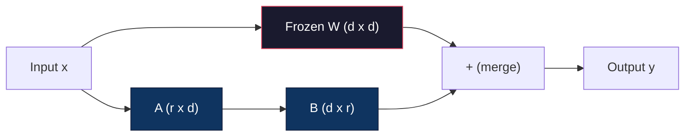
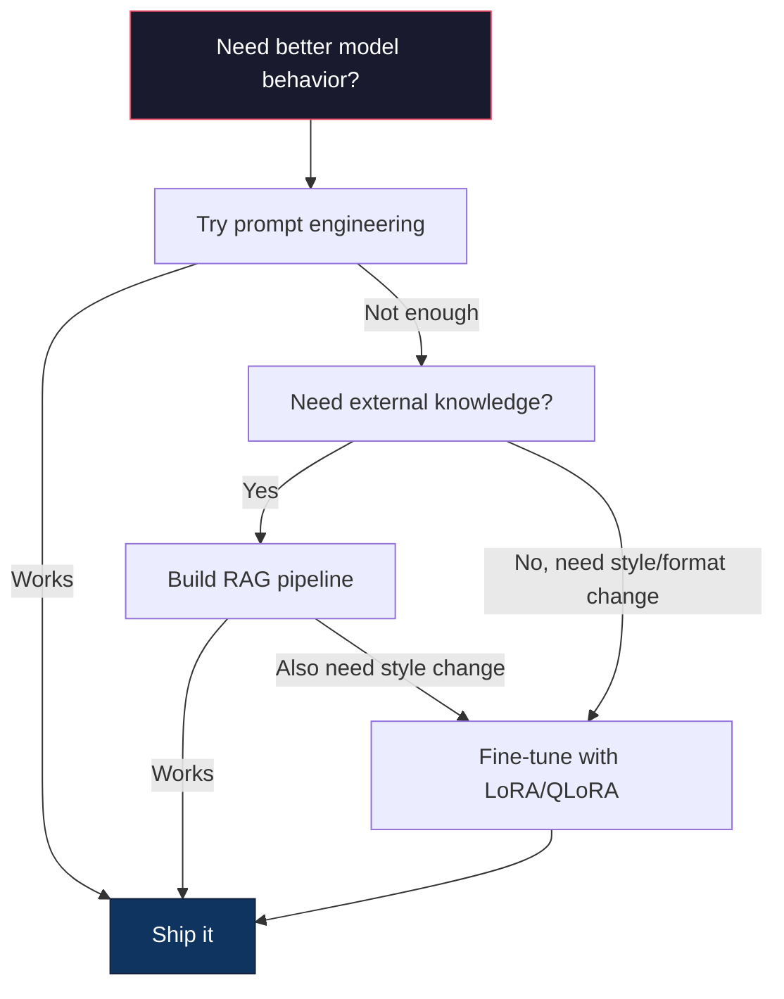

# استخدام LoRA & QLoRA  إجراء التنسيق الدقيق

> على نموذج 7B القيام بتحسين كامل  بحاجة إلى 56GB VRAM── لا يوجد الكثير ‬ معظم الشركات أيضا ‬ لا يوجد ‬ ‬ ‬ ‬ ‬ ‬ ‬ ‬ ‬ ‬ ‬ ‬ ‬ ‬ ‬ ‬ ‬ ‬ ‬ ‬ ‬ ‬ ‬ ‬ ‬ ‬ ‬ ‬ ‬ ‬ ‬ ‬ ‬ ‬ ‬ ‬ ‬ ‬ ‬ ‬ ‬ ‬ ‬ ‬ ‬ ‬ ‬ ‬ ‬ ‬ ‬ ‬ ‬ ‬ ‬ ‬ ‬ ‬ ‬ ‬ ‬ ‬ ‬ ‬ ‬ ‬ ‬ ‬ ‬ ‬ ‬ ‬ ‬ ‬ ‬ ‬ ‬ ‬ ‬ ‬ ‬ ‬ ‬ ‬ ‬ ‬ ‬ ‬ ‬ ‬ ‬ ‬ ‬ ‬ ‬ ‬ ‬ ‬ ‬ ‬ ‬ ‬ ‬ ‬ ‬ ‬ ‬ ‬ ‬ ‬ ‬ ‬ ‬ ‬ ‬ ‬ ‬ ‬ ‬ ‬ ‬ ‬ ‬ ‬ ‬ ‬ ‬ ‬ ‬ ‬ ‬ ‬ ‬ ‬ ‬ ‬ ‬ ‬ ‬ ‬ ‬ ‬ ‬ ‬ ‬ ‬ ‬ ‬ ‬ ‬ ‬ ‬ ‬ ‬ ‬ ‬ ‬ ‬ ‬ ‬ ‬ ‬ ‬ ‬ ‬ ‬ ‬ ‬ ‬ ‬ ‬ ‬ ‬ ‬ ‬ ‬ ‬ ‬ ‬ ‬ ‬ ‬ ‬ ‬ ‬ ‬ ‬ ‬ ‬ ‬ ‬ ‬ ‬ ‬ ‬ ‬ ‬ ‬ ‬ ‬ ‬ ‬ ‬ ‬ ‬ ‬ ‬ ‬ ‬ ‬ ‬ ‬ ‬ ‬ ‬ ‬ ‬ ‬ ‬ ‬ ‬ ‬ ‬ ‬ ‬ ‬ ‬ ‬ ‬ ‬ ‬ ‬ ‬ ‬ ‬ ‬ ‬ ‬

**Type:** Build
**Languages:** Python
**Prerequisites:** Phase 10, Lesson 06 (Instruction Tuning / SFT)
**Time:** ~75 minutes
**Related:**المرحلة 10 من التخلي عن حلول SFT/DPO.

## 學习目标
- 通過将低排序 المعدلات المعدلة(A 和 B) إدخال طبقات الاهتمام من النموذج المُدرب مسبقا لتحقيق LoRA
- 计算 LoRA 相比 كامل تحسين 参数节省:rank r、d_model 维度时, تدريب هو 2*r*d 个参数, وليس d^2
- استخدام QLoRA(4 بت قاعدة كمية + LoRA مكيّفات)مُحَلّقَة دقيقة، نموذج، يجعلُها مناسبة للاستهلاك من درجة الذاكرة GPU
- وضع وزنات LoRA 合并回 أساس نموذج 用于部署,并比较带适配与不带适配的推理速度

## 问题
لديك نموذج أساسي. لاما 3 8 ب. أنت تريد استخدامها في استخدام لغة شركتك للإجابة على العملاء.

في fp16، كل عنصر يشكل 2 بايتس。 فقط تحميل الوزن يحتاج إلى 16GB。 خلال التدريب، تحتاج أيضا إلى تراجعيات(16GB)、حالات تحسين آدم ‬momentum + variance ‬ 32GB) وكذلك تنشيطات。 إجمالي: نموذج واحد 8B ‬大约需要 56GB VRAM‬‬

A100 80GB 勉强能装下──两张 A100 在云提供商 上每小时花费 $3-4。用 50,000 个样本训练 3 个 epochs 需要 6-10 小时。每次实验就是 $30-40‬‬‬‬‬‬‬‬‬‬‬‬‬‬‬‬‬‬‬‬‬‬‬‬‬‬‬‬‬‬‬‬‬‬‬‬‬‬‬‬‬‬‬‬‬‬‬‬‬‬‬‬‬‬‬‬‬‬‬‬‬‬‬‬‬‬‬‬‬‬‬‬‬‬‬‬‬‬‬‬‬‬‬‬‬‬‬‬‬‬‬‬‬‬‬‬‬‬‬‬‬‬‬‬‬‬‬‬‬‬‬‬‬‬‬‬‬‬‬‬‬‬‬‬‬‬‬‬‬‬‬‬‬‬‬‬‬‬‬‬‬‬‬‬‬‬‬‬‬‬‬‬‬‬‬‬‬‬‬‬‬‬‬‬‬‬‬‬‬‬‬‬‬‬‬‬‬‬‬‬‬‬‬‬‬‬‬‬‬‬‬‬‬‬‬‬‬‬‬‬‬‬‬‬‬‬‬‬‬‬‬‬‬‬‬‬‬‬‬‬‬‬‬‬‬‬‬‬‬‬‬‬‬‬‬‬‬‬‬‬‬‬‬‬‬‬‬‬‬‬‬‬‬‬‬‬‬‬‬‬‬‬‬‬‬‬‬‬‬‬‬‬‬‬‬‬‬‬‬‬‬‬‬‬‬‬‬‬‬‬‬‬‬‬‬‬‬‬‬‬‬‬‬‬‬‬‬‬‬‬‬‬‬‬‬‬‬‬‬‬‬‬‬‬‬‬‬‬‬‬‬‬‬‬‬‬‬‬‬‬‬‬‬‬‬‬‬‬‬‬‬‬‬‬‬‬‬‬‬‬‬‬‬‬‬‬‬‬‬‬‬‬‬‬‬‬‬‬‬‬‬‬‬‬‬‬‬‬‬‬‬‬‬‬‬‬‬‬‬‬‬‬‬‬‬‬‬‬‬‬‬‬‬‬‬‬‬‬‬‬‬‬‬‬‬‬‬‬‬‬‬‬‬‬‬‬‬‬‬‬‬‬‬‬‬‬‬‬‬‬‬‬‬‬‬‬‬‬‬‬‬‬‬‬‬‬‬‬‬‬‬‬‬‬‬‬‬‬‬‬‬‬‬‬‬‬‬‬‬‬‬‬‬‬‬‬‬‬‬‬‬‬‬‬‬‬‬‬‬

إذا تمتدّت إلى Llama 3 70B، فإنّ الرقم سيكون مُهدرًا.

هناك مشكلة أعمق أيضا ً. التنسيق الكامل للنموذج سيتم تعديله كل وزن في النموذج. إذا كنت تقوم بتنسيق بيانات دعم العملاء، فيمكن أن تضر في القدرة العامة للنموذج.

تحتاج إلى طريقة: تدريب أقل من العناصر ‬استعمال أقل من الذاكرة، ولن تدمير النموذج ‬المعرفة المتاحة‬‬‬‬‬‬‬‬‬‬‬‬‬‬‬‬‬‬‬‬‬‬‬‬‬‬‬‬‬‬‬‬‬‬‬‬‬‬‬‬‬‬‬‬‬‬‬‬‬‬‬‬‬‬‬‬‬‬‬‬‬‬‬‬‬‬‬‬‬‬‬‬‬‬‬‬‬‬‬‬‬‬‬‬‬‬‬‬‬‬‬‬‬‬‬‬‬‬‬‬‬‬‬‬‬‬‬‬‬‬‬‬‬‬‬‬‬‬‬‬‬‬‬‬‬‬‬‬‬‬‬‬‬‬‬‬‬‬‬‬‬‬‬‬‬‬‬‬‬‬‬‬‬‬‬‬‬‬‬‬‬‬‬‬‬‬‬‬‬‬‬‬‬‬‬‬‬‬‬‬‬‬‬‬‬‬‬‬‬‬‬‬‬‬‬‬‬‬‬‬‬‬‬‬‬‬‬‬‬‬‬‬‬‬‬‬‬‬‬‬‬‬‬‬‬‬‬‬‬‬‬‬‬‬‬‬‬‬‬‬‬‬‬‬‬‬‬‬‬‬‬‬‬‬‬‬‬‬‬‬‬‬‬‬‬‬‬‬‬‬‬‬‬‬‬‬‬‬‬‬‬‬‬‬‬‬‬‬‬‬‬‬‬‬‬‬‬‬‬‬‬‬‬‬‬‬‬‬‬‬‬‬‬‬‬‬‬‬‬‬‬‬‬‬‬‬‬‬‬‬‬‬‬‬‬‬‬‬‬‬‬‬‬‬‬‬‬‬‬‬‬‬‬‬‬‬‬‬‬‬‬‬‬‬‬‬‬‬‬‬‬‬‬‬‬‬‬‬‬‬‬‬‬‬‬‬‬‬‬‬‬‬‬‬‬‬‬‬‬‬‬‬‬‬‬‬‬‬‬‬‬‬‬‬‬‬‬‬‬‬‬‬‬‬‬‬‬‬‬‬‬‬‬‬‬‬‬‬‬‬‬‬‬‬‬‬‬‬‬‬‬‬‬‬‬‬‬‬‬‬‬‬‬‬‬‬‬‬‬‬‬

## 概念
### لورا: التكيف منخفض الرتب

نشر إدوارد هو وزملاؤه في مايكروسوفت في شهر يونيو 2021 LoRA。 دراسة من رؤى:تحديثات الوزن خلال التنسيق الجيد  مع درجة داخلية منخفضة。 لا تحتاج إلى تحديث ماتريكس الوزن 4096x4096 من بين جميع 1670،000 جزيئات。 تحديث المعلومات المفيدة يمكن الحصول عليها من خلال الدرجة 16 أو 32 من ماتريكس ‬‬‬‬‬‬‬‬‬‬‬‬‬‬‬‬‬‬‬‬‬‬‬‬‬‬‬‬‬‬‬‬‬‬‬‬‬‬‬‬‬‬‬‬‬‬‬‬‬‬‬‬‬‬‬‬‬‬‬‬‬‬‬‬‬‬‬‬‬‬‬‬‬‬‬‬‬‬‬‬‬‬‬‬‬‬‬‬‬‬‬‬‬‬‬‬‬‬‬‬‬‬‬‬‬‬‬‬‬‬‬‬‬‬‬‬‬‬‬‬‬‬‬‬‬‬‬‬‬‬‬‬‬‬‬‬‬‬‬‬‬‬‬‬‬‬‬‬‬‬‬‬‬‬‬‬‬‬‬‬‬‬‬‬‬‬‬‬‬‬‬‬‬‬‬‬‬‬‬‬‬‬‬‬‬‬‬‬‬‬‬‬‬‬‬‬‬‬‬‬‬‬‬‬‬‬‬‬‬‬‬‬‬‬‬‬‬‬‬‬‬‬‬‬‬‬‬‬‬‬‬‬‬‬‬‬‬‬‬‬‬‬‬‬‬‬‬‬‬‬‬‬‬‬‬‬‬‬‬‬‬‬‬‬‬‬‬‬‬‬‬‬‬‬‬‬‬‬‬‬‬‬‬‬‬‬‬‬‬‬‬‬‬‬‬‬‬‬‬‬‬‬‬‬‬‬‬‬‬‬‬‬‬‬‬‬‬‬‬‬‬‬‬‬‬‬‬‬‬‬‬‬‬‬‬‬‬‬‬‬‬‬‬‬‬‬‬‬‬‬‬‬‬‬‬‬‬‬‬‬‬‬‬‬‬‬‬‬‬‬‬‬‬‬‬‬‬‬‬‬‬‬‬‬‬‬‬‬‬‬‬‬‬‬‬‬‬‬‬‬‬‬‬‬‬‬‬

数学如下──一个标准线性层 计算:

```
y = Wx
```

من بينها W هو المصفوفة d_out x d_in. بالنسبة إلى 4096x4096 توقيع الاهتمام، هذا هو 16،777،216 个参数.

لورا 结 W,并添加一个低排序分解:

```
y = Wx + BAx
```

بينها B هو (d_out x r) ، A هو (r x d_in)。مرتبة r 远小于 d -- عادةً 8、16 أو 32、

بالنسبة للقسم 4096x4096 فوق r=16:
- العنصر الأصلي:4096 × 4096 = 16,777,216
- الحد الأساسي: 4096 × 16) + (16 × 4096) = 65536 + 65536 = 131 072
-                                                                                                                                                                                                                                                                                                                                                                                                                                                                                                                              

تمارسين 0.78% من المعدات، لكنهم يحصلون على 95-100% من الجودة.



استخدام随机 غوسيان ابتدایی化──B ابتدایی化为零── هذا يعني مساهمة LoRA من صفر开始 -- نموذج من السلوك الأولي البدء بالتدريب، ثم التعلم التكيف تدريجيا ً──

### عامل الحجم: ألفا

إدخال لورا عنصر مقياس ألفا، لتحكم تحديثات النطاق المنخفض على درجة تأثير الناتج:

```
y = Wx + (alpha / r) * BAx
```

عندما ألفا = r 时، التوسع هو 1x。 عندما ألفا = 2r(常见默认值) عندما، التوسع هو 2x。 هذا المعلم المفرط  مستقل عن معدل التعلم الأساسي  تحكم معدل التعلم في مسار LoRA。

实践建议:
- ألفا = 2 * رتبة هو habitu见社区约定(原始论文在多数实验中使用 ألفا = رتبة)
- الفا = رتبة 提供 1x مقياس، حافظة ولكن مستقرة
- الفا أعلى يعني كل خطوة تحديثات أكبر، قد تزيد من الإصدار، وربما يؤدي إلى عدم الاستقرار

### أين تطبيق LoRA

واحد محول لديه العديد من الطبقات الخطية.

| Target Layers | Trainable Params (7B) | Quality |
|--------------|----------------------|---------|
| q_proj only | 4.7M | 好 |
| q_proj + v_proj | 9.4M | 更好 |
| q_proj + k_proj + v_proj + o_proj | 18.9M | 对 attention 最好 |
| All linear (attention + MLP) | 37.7M | 边际收益，参数量 2x |

准备自我注意 中的查询和值预测,它们控制模型 关注什么以及提取什么信息──添加 MLP层对代码生成等复杂任务有帮助,但会让参数数翻倍,对简单任务则收益递减──

### اختيار الرتب

الدرجة r 控制 التكيف

| Rank | Trainable Params (per layer) | Best For |
|------|---------------------------|----------|
| 4 | 32,768 | 简单 classification、sentiment |
| 8 | 65,536 | 单领域 Q&A、summarization |
| 16 | 131,072 | 多领域任务、instruction following |
| 32 | 262,144 | 复杂 reasoning、代码生成 |
| 64 | 524,288 | 大多数任务收益递减 |
| 128 | 1,048,576 | 很少值得使用 |

هوو وآخرون أظهروا، بالنسبة للمهمة البسيطة، r=4 已經能捕捉大部分 التكيف. r=8 和 r=16 هي الخيار الأكثر شيوعا في الممارسة.

### QLoRA: 4-bit كمية + LoRA

نشر تيم ديتمرز وزملاء جامعة واشنطن في مايو 2023 QLoRA.

هذا سيغير الذاكرة بشكل كبير

| Method | Weight Memory (7B) | Training Memory (7B) | GPU Required |
|--------|-------------------|---------------------|-------------|
| Full fine-tune (fp16) | 14GB | ~56GB | 1x A100 80GB |
| LoRA (fp16 base) | 14GB | ~18GB | 1x A100 40GB |
| QLoRA (4-bit base) | 3.5GB | ~6GB | 1x RTX 3090 24GB |

QLoRA لديها ثلاث مساهمات تقنية:

**NF4 (Normal Float 4-bit)**: نوع خاص لوزن الشبكات العصبية  صمم نوع بيانات جديد وزن الشبكات العصبية 大致服从正常分布──NF4 وضع 16 مستوى كمية 放在标准正常分布的量度上──对于正常分布的数据,这在信息学意义上是最优的──相比均的4位量化(INT4) أو标准 Float4,它损失信息更少──

**Double quantization**: ثابتات الكمية 本身也占存储力──每 64 个重量的块 需要一个 fp32 尺度因子(4 بايت)──对于7B模型,这将额外占0.4GB──双量化将这些 ثابتات 量化到fp8,把上空费 降至0.1GB──虽然小但会积累──

**Paged optimizers**خلال التدريب، الحالة المثلى على المخططات طويلة المدى (مدة التسلسل) قد تتجاوز ذاكرة GPU.

### مسألة الجودة

減量参数或量化基會损害质量吗?多篇论文的结果:

| Method | MMLU (5-shot) | MT-Bench | HumanEval |
|--------|--------------|----------|-----------|
| Full fine-tune (Llama 2 7B) | 48.3 | 6.72 | 14.6 |
| LoRA r=16 | 47.9 | 6.68 | 14.0 |
| QLoRA r=16 (NF4) | 47.5 | 6.61 | 13.4 |
| QLoRA r=64 (NF4) | 48.1 | 6.70 | 14.2 |

لورا في r=16 ، في معظم المعايير التوقيتية ، ، ، ، ،،،،،،،،،،،،،،،،،،،،،،،،،،،،،،،،،،،،،،،،،،،،،،،،،،،،،،،،،،،،،،،،،،،،،،،،،،،،،،،،،،،،،،،،،،،،،،،،،،،،،،،،،،،،،،،،،،،،،،،،،،،،،،،،،،،،،،،،،،،،،،،،،،،،،،،،،،،،،،،،،،،،،،،،،،،،،،،،،،،،،،،،،،

### التكاليف الحقيقية

في 50،000 个样本 على المستناد الدقيق للاما 3 8B ((3 دور):

| Method | GPU | Time | Cost |
|--------|-----|------|------|
| Full fine-tune | 2x A100 80GB | 8 hours | ~$32 |
| LoRA r=16 | 1x A100 40GB | 4 hours | ~$8 |
| QLoRA r=16 | 1x RTX 4090 24GB | 6 hours | ~$5 |
| QLoRA r=16 (Unsloth) | 1x RTX 4090 24GB | 2.5 hours | ~$2 |
| QLoRA r=16 | 1x T4 16GB | 12 hours | ~$4 |

في مجال التشغيل على مستوى الاستهلاك واحد في الجيبو، لا يصل تكلفة QLoRA إلى طعام واحد. هذا هو السبب في أن التنسيق المفتوح للوزن الدقيق في المجتمع قد اندلع في عام 2023.

### كومة PEFT 2026

| Framework | What it is | Pick when |
|-----------|-----------|-----------|
| **Hugging Face PEFT** | 规范的 LoRA/QLoRA/DoRA/IA3 library | 你想要原始控制权，并且 training loop 已经基于 `transformers.Trainer` |
| **TRL** | HF 的 reinforcement-from-feedback trainers（SFT, DPO, GRPO, PPO, ORPO） | 你在 SFT 后需要 DPO/GRPO；构建在 PEFT 之上 |
| **Unsloth** | forward/backward pass 的 Triton-kernel 重写 | 你想要 2-5x 加速 + 一半 VRAM 且无 accuracy loss；Llama/Mistral/Qwen 系列 |
| **Axolotl** | PEFT + TRL + DeepSpeed + Unsloth 之上的 YAML-config wrapper | 你想要可复现、版本控制的 training runs |
| **LLaMA-Factory** | PEFT + TRL 之上的 GUI/CLI/API | 你想要 zero-code fine-tuning；支持 100+ model families |
| **torchtune** | Native PyTorch recipes，无 `transformers` 依赖 | 你想要最少依赖，且组织已经标准化使用 PyTorch |

 تجربة قانون: دراسة استخدام أو تجربة مرة واحدة → PEFT──可重复的生产管 line→ 启用Unsloth kernels的 Axolotl──一次性原型 → LLaMA-Factory──

### إندماج المعدات

بعد التدريب، لديك اثنين من الأشياء: نموذج أساسي ومركز لورا صغير

1. **保持分离**:حميل النموذج الأساسي، على ذلكحميل المعدل.

2. **永久合并**:计算 W' = W + (الفا/ر) * BA,并把结果保存为一个新的完整模型──合并模型与原始模型 大小相同──没有推断过head──没有适配器 需要管理──

إذا خدمة العديد من المهام ((عملاء دعم المعدل 代码 adaptor 翻译 adaptor) ، حافظ على الانفصال.

تستخدم لتجميع العديد من المعدات التنسيقية المتقدمة:

- **TIES-Merging**(يادف وزملاء 2023): تراجع الحجم 参数، حل صراعات العلامات، ثم合并── تقليل المعدلات 之间的干扰──
- **DARE**(Yu et al. 2023): في دمج قبل随机丢弃适配参数,并重新缩放剩余部分──组合能力时出人意料地有效──
- **Task arithmetic**: مباشرة إضافة خفض وزن المعدل.

### عندما لا يجب أن تكون على ما يرام

التنسيق الجيد هو الخيار الثالث وليس الأول

**第一：prompt engineering。**写一个更好的系统提示──加入几个镜头的例子──使用链思维──这没有成本,只需要几分钟──如果提示已经能达到80%,你可能不需要细调──

**第二：RAG。**إذا كان النموذج بحاجة إلى معرفة بياناتك المحددة ((وثائق  قاعدة المعرفة ‬ كتالوج المنتجات) ، فان استعادتها 比把它 into weights 更便宜,也更易维护──见课 06──

**第三：fine-tuning。**عندما تحتاج إلى نموذج 采用 نمط محدد format أو نمط التفكير، والتحفيز 无法实现 عند استخدامها  عندما تحتاج إلى ناتج مهيكلي متوافق  عندما تحتاج إلى وضع نموذج أكبر لتحفيز إلى نموذج أصغر  عندما يكون التأخير  مهم، وأنت تحمل عدم استنادا إلى عدد قليل من الأدلة 




```figure
lora-params
```

## بناءها
نستخدم بيكتورتش خالص من التنفيذ لـ LoRA. لا توجد مكتبات. لا يوجد سحر.

### الخطوة الأولى: طبقة لورا

```python
import torch
import torch.nn as nn
import math

class LoRALayer(nn.Module):
    def __init__(self, in_features, out_features, rank=8, alpha=16):
        super().__init__()
        self.rank = rank
        self.alpha = alpha
        self.scaling = alpha / rank

        self.A = nn.Parameter(torch.randn(in_features, rank) * (1 / math.sqrt(rank)))
        self.B = nn.Parameter(torch.zeros(rank, out_features))

    def forward(self, x):
        return (x @ self.A @ self.B) * self.scaling
```

استخدام الحجم بعد التخفيض. B الحجم الأول هو صفر.

### 步骤 2: طبقة خطية مغلفة لورا

```python
class LinearWithLoRA(nn.Module):
    def __init__(self, linear, rank=8, alpha=16):
        super().__init__()
        self.linear = linear
        self.lora = LoRALayer(
            linear.in_features, linear.out_features, rank, alpha
        )

        for param in self.linear.parameters():
            param.requires_grad = False

    def forward(self, x):
        return self.linear(x) + self.lora(x)
```

الطبقة الخطية الأصلية 被结──只有 LoRA 参数(A 和 B) 是可训练的──

### 步骤 3: حقن LoRA في النموذج

```python
def inject_lora(model, target_modules, rank=8, alpha=16):
    for param in model.parameters():
        param.requires_grad = False

    lora_layers = {}
    for name, module in model.named_modules():
        if isinstance(module, nn.Linear):
            if any(t in name for t in target_modules):
                parent_name = ".".join(name.split(".")[:-1])
                child_name = name.split(".")[-1]
                parent = dict(model.named_modules())[parent_name]
                lora_linear = LinearWithLoRA(module, rank, alpha)
                setattr(parent, child_name, lora_linear)
                lora_layers[name] = lora_linear
    return lora_layers
```

أولاً،结模型中每个参数──然后穿越模型树,找到与你的目标名匹配的线性层,并使用LoRA-wrapped 版本替换它们──LoRA A 和 B矩阵是整个模型中唯一可训练的参数──

### 步骤 4: إعداد المعايير

```python
def count_parameters(model):
    total = sum(p.numel() for p in model.parameters())
    trainable = sum(p.numel() for p in model.parameters() if p.requires_grad)
    frozen = total - trainable
    return {
        "total": total,
        "trainable": trainable,
        "frozen": frozen,
        "trainable_pct": 100 * trainable / total if total > 0 else 0
    }
```

### الخطوة 5: إندماج الوزن مرة أخرى

```python
def merge_lora_weights(model):
    for name, module in model.named_modules():
        if isinstance(module, LinearWithLoRA):
            with torch.no_grad():
                merged = (
                    module.lora.A @ module.lora.B
                ) * module.lora.scaling
                module.linear.weight.data += merged.T
            parent_name = ".".join(name.split(".")[:-1])
            child_name = name.split(".")[-1]
            if parent_name:
                parent = dict(model.named_modules())[parent_name]
            else:
                parent = model
            setattr(parent, child_name, module.linear)
```

合并后,LoRA طبقات 消失──模型 与原始模型 大小相同,适应被进重量──没有推断的过度──

### الخطوة 6: محاكاة QLoRA كمية

```python
def quantize_to_nf4(tensor, block_size=64):
    blocks = tensor.reshape(-1, block_size)
    scales = blocks.abs().max(dim=1, keepdim=True).values / 7.0
    scales = torch.clamp(scales, min=1e-8)
    quantized = torch.round(blocks / scales).clamp(-8, 7).to(torch.int8)
    return quantized, scales

def dequantize_from_nf4(quantized, scales, original_shape):
    dequantized = quantized.float() * scales
    return dequantized.reshape(original_shape)
```

من خلال ذلك سوف يتم تصوير الوزن إلى 16 مستوى انفصال في كل 64 عنصر من كتلة ‬‬‬‬‬‬‬‬‬‬‬‬‬‬‬‬‬‬‬‬‬‬‬‬‬‬‬‬‬‬‬‬‬‬‬‬‬‬‬‬‬‬‬‬‬‬‬‬‬‬‬‬‬‬‬‬‬‬‬‬‬‬‬‬‬‬‬‬‬‬‬‬‬‬‬‬‬‬‬‬‬‬‬‬‬‬‬‬‬‬‬‬‬‬‬‬‬‬‬‬‬‬‬‬‬‬‬‬‬‬‬‬‬‬‬‬‬‬‬‬‬‬‬‬‬‬‬‬‬‬‬‬‬‬‬‬‬‬‬‬‬‬‬‬‬‬‬‬‬‬‬‬‬‬‬‬‬‬‬‬‬‬‬‬‬‬‬‬‬‬‬‬‬‬‬‬‬‬‬‬‬‬‬‬‬‬‬‬‬‬‬‬‬‬‬‬‬‬‬‬‬‬‬‬‬‬‬‬‬‬‬‬‬‬‬‬‬‬‬‬‬‬‬‬‬‬‬‬‬‬‬‬‬‬‬‬‬‬‬‬‬‬‬‬‬‬‬‬‬‬‬‬‬‬‬‬‬‬‬‬‬‬‬‬‬‬‬‬‬‬‬‬‬‬‬‬‬‬‬‬‬‬‬‬‬‬‬‬‬‬‬‬‬‬‬‬‬‬‬‬‬‬‬‬‬‬‬‬‬‬‬‬‬‬‬‬‬‬‬‬‬‬‬‬‬‬‬‬‬‬‬‬‬‬‬‬‬‬‬‬‬‬‬‬‬‬‬‬‬‬‬‬‬‬‬‬‬‬‬‬‬‬‬‬‬‬‬‬‬‬‬‬‬‬‬‬‬‬‬‬‬‬‬‬‬‬‬‬‬‬‬‬‬‬‬‬‬‬‬‬‬‬‬‬‬‬‬‬‬‬‬‬‬‬‬‬‬‬‬‬‬‬‬‬‬‬‬‬‬‬‬‬‬‬‬‬‬‬‬‬‬‬‬‬‬‬‬‬‬‬‬‬‬‬‬‬‬‬‬‬‬‬‬‬‬‬‬‬‬‬‬‬‬‬‬‬‬‬‬‬‬‬‬‬‬‬‬

### الخطوة 7: حلقة التدريب

```python
def train_lora(model, data, epochs=5, lr=1e-3, batch_size=4):
    optimizer = torch.optim.AdamW(
        [p for p in model.parameters() if p.requires_grad], lr=lr
    )
    criterion = nn.MSELoss()

    losses = []
    for epoch in range(epochs):
        epoch_loss = 0.0
        n_batches = 0
        indices = torch.randperm(len(data["inputs"]))

        for i in range(0, len(indices), batch_size):
            batch_idx = indices[i:i + batch_size]
            x = data["inputs"][batch_idx]
            y = data["targets"][batch_idx]

            output = model(x)
            loss = criterion(output, y)

            optimizer.zero_grad()
            loss.backward()
            optimizer.step()

            epoch_loss += loss.item()
            n_batches += 1

        avg_loss = epoch_loss / n_batches
        losses.append(avg_loss)

    return losses
```

### 步骤 8: التجربة الكاملة

```python
def demo():
    torch.manual_seed(42)
    d_model = 256
    n_classes = 10

    model = nn.Sequential(
        nn.Linear(d_model, 512),
        nn.ReLU(),
        nn.Linear(512, 512),
        nn.ReLU(),
        nn.Linear(512, n_classes),
    )

    n_samples = 500
    x = torch.randn(n_samples, d_model)
    y = torch.randint(0, n_classes, (n_samples,))
    y_onehot = torch.zeros(n_samples, n_classes).scatter_(1, y.unsqueeze(1), 1.0)

    data = {"inputs": x, "targets": y_onehot}

    params_before = count_parameters(model)

    lora_layers = inject_lora(
        model, target_modules=["0", "2"], rank=8, alpha=16
    )

    params_after = count_parameters(model)

    losses = train_lora(model, data, epochs=20, lr=1e-3)

    merge_lora_weights(model)
    params_merged = count_parameters(model)

    return {
        "params_before": params_before,
        "params_after": params_after,
        "params_merged": params_merged,
        "losses": losses,
    }
```

هذا التجربة إنشاء نموذج صغير، سوف LoRA مدخل في طبقتين، تدريبها،并把 الأوزان 合并回去── الحسابات العنصرية من التدريب الكامل 降低 إلى LoRA تدريب  خلال حوالي 1% تدريبية، ثم في التدريب 合并后回到原始架构──

## استخدمها
في حلق الوجه 生态中, استخدام لورا على النموذج الحقيقي

```python
from transformers import AutoModelForCausalLM, AutoTokenizer
from peft import LoraConfig, get_peft_model, TaskType

model = AutoModelForCausalLM.from_pretrained("meta-llama/Llama-3.1-8B")
tokenizer = AutoTokenizer.from_pretrained("meta-llama/Llama-3.1-8B")

lora_config = LoraConfig(
    task_type=TaskType.CAUSAL_LM,
    r=16,
    lora_alpha=32,
    lora_dropout=0.05,
    target_modules=["q_proj", "v_proj"],
)

model = get_peft_model(model, lora_config)
model.print_trainable_parameters()
```

 بالنسبة لـ QLoRA، إضافة بيتساند بايتس كمية:

```python
from transformers import BitsAndBytesConfig

bnb_config = BitsAndBytesConfig(
    load_in_4bit=True,
    bnb_4bit_quant_type="nf4",
    bnb_4bit_compute_dtype=torch.bfloat16,
    bnb_4bit_use_double_quant=True,
)

model = AutoModelForCausalLM.from_pretrained(
    "meta-llama/Llama-3.1-8B",
    quantization_config=bnb_config,
    device_map="auto",
)

model = get_peft_model(model, lora_config)
```

هكذا. نفس حلقة التدريب. نفس خط أنابيب البيانات. النموذج الأساسي الآن باستخدام 4 بتات.

استخدام تعليمات معاناة الوجه

```python
from transformers import TrainingArguments, Trainer
from datasets import load_dataset

dataset = load_dataset("tatsu-lab/alpaca", split="train[:5000]")

training_args = TrainingArguments(
    output_dir="./lora-llama",
    num_train_epochs=3,
    per_device_train_batch_size=4,
    gradient_accumulation_steps=4,
    learning_rate=2e-4,
    fp16=True,
    logging_steps=10,
    save_strategy="epoch",
    optim="paged_adamw_8bit",
)

trainer = Trainer(
    model=model,
    args=training_args,
    train_dataset=dataset,
)

trainer.train()

model.save_pretrained("./lora-adapter")
```

保存的适配器是 10-100MB──البنية النموذج 保持不变──你可以在 Hugging Face Hub 上分享适配器,而无需重新分发完整模型──

## 交付 it
本课产出:
- `outputs/prompt-lora-advisor.md`-- إرسال مفاجئ، لمساعدتك في تحديد المهام تحديد LoRA رتبة
- `outputs/skill-fine-tuning-guide.md`-- مهارة، تدريس وكلاء  الحكم متى وكيفية تحسين شجرة القرار

## التدريب
1. **Rank ablation study。**استخدام صفوف 2、4、8、16、32 و 64 运行 demo。 رسم الخسارة النهائية مقابل الرتبة。 العثور على نقطة إضافة إلى الخسارة، أي الرتبة 翻倍不再让损失 减半的位置。 بالنسبة لميزات 256-dim 上的简单分类任务, this should be located r=8-16 附近──

2. **Target module comparison。**修改 inject_lora، جعله تمييز فقط من الطبقة الهادفة "0"、 فقط من الطبقة الهادفة "2"、 فقط من الطبقة الهادفة "4" وبالإضافة إلى جميع الستة.

3. **Quantization error analysis。**获取训练模型 在 quantize_to_nf4 / dequantize_from_nf4 前后的权重矩阵――计算平均平方错误、最大绝对错误,以及原始与重复的权重之间的相关性──尝试 block_size 取值 32、64、128 和 256。

4. **Multi-adapter serving。**في مختلف المجموعات من البيانات (حتى المؤشرات مقابل المؤشرات الغير عادية) على تدريب إعدادات LoRA اثنين.

5. **Merge vs. unmerged inference。**مقارنة نفس 100 مدخلة على نموذج LoRA في merge_lora_weights سابقة الناتج السابقة، وتجربة نتائج مماثلة، في 1e-5 من التسامح في نقطة العبور داخل) ، ثم مقياس السرعة الاستنتاجية من الاثنين -- دمج  ينبغي أن يكون أسرع قليلا، لأنه هو مضاعفة المصفوفة مرة واحدة، وليس مرتين.

## 关键术语
| Term | What people say | What it actually means |
|------|----------------|----------------------|
| LoRA | "Efficient fine-tuning" | Low-Rank Adaptation：冻结 base weights，训练两个小 matrices A 和 B，其乘积近似完整 weight update |
| QLoRA | "Fine-tune on a laptop" | Quantized LoRA：以 4-bit NF4 加载 base model，在其上用 fp16 训练 LoRA adapters，从而让 7B fine-tuning 能在 6GB VRAM 中完成 |
| Rank (r) | "How much the model can learn" | A 和 B matrices 的内部维度；控制表达能力与参数量之间的权衡 |
| Alpha | "LoRA learning rate" | 应用于 LoRA output 的 scaling factor；alpha/r 会缩放 adaptation 对 final output 的贡献 |
| NF4 | "4-bit quantization" | Normal Float 4：一种 4-bit data type，其 quantization levels 位于 normal distribution quantiles 上，对 Neural Network weights 最优 |
| Adapter | "The small trained part" | 作为单独文件保存的 LoRA A 和 B matrices（10-100MB），可以加载到 base model 的任意副本之上 |
| Target modules | "Which layers to LoRA" | 注入 LoRA adapters 的特定 linear layers（q_proj、v_proj 等） |
| Merging | "Bake it in" | 计算 W + (alpha/r) * BA 并替换原始 weight，从而消除 inference 时的 adapter overhead |
| Paged optimizers | "Don't OOM during training" | 当 GPU memory 耗尽时，将 optimizer states（Adam momentum、variance）offload 到 CPU |
| Catastrophic forgetting | "Fine-tuning broke everything else" | 更新所有 weights 导致 model 丢失先前学到的能力 |

## 延伸阅读
- هو وغيره، "لورا: التكيف منخفض الرتبة لنماذج اللغة الكبيرة" (2021) -- 介绍低秩分解方法的原始论文,在 GPT-3 175B 上测试,rank 低至 4
- ديتمرز وغيرهم، "QLoRA: التنسيق الفعال لنماذج اللغة المعدلة" (2023) --  إدخال NF4、تنسيق المعدل المزدوج و المكملات المضافة، جعل واحد张 48GB GPU 上 fine-tune 65B  become possible
- وثائق مكتبة PEFT (Huggingface.co/docs/peft) -- تعاطف الوجه 生态中 LoRA、QLoRA 及其他 المعايير الفعالة 方法的标准库
- ياداف وزملاء، "TIES-Merging: Solving Interference When Merging Models" (2023) -- في حالة عدم تقليل الجودة مجموعة من مُعدات LoRA
- [Rafailov et al., "Direct Preference Optimization: Your Language Model is Secretly a Reward Model" (NeurIPS 2023)](https://arxiv.org/abs/2305.18290)-- DPO 推导؛SFT 后的偏好调整阶段,无需奖励模式──
- [TRL documentation](https://huggingface.co/docs/trl/)- .`SFTTrainer`.`DPOTrainer`.`KTOTrainer`وذلك مع PEFT/bitsandbytes/Unsloth 集成面的官方参考.
- [Unsloth documentation](https://docs.unsloth.ai/)-- الأجزاء المدمجة،可让精细调度吞吐量 翻倍并将内存 减半;TRL 下方的性能层──
- [Axolotl documentation](https://axolotl-ai-cloud.github.io/axolotl/)-- مدرب متعدد GPU SFT / DPO / QLoRA بتكوين YAML ؛相对于手写脚本的配置-as-code 替代方案──
