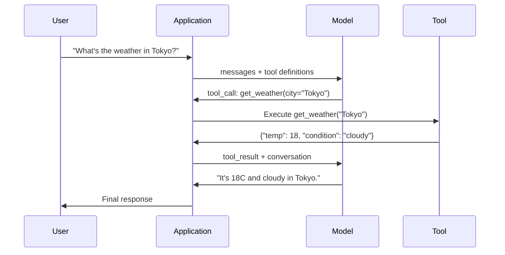

# استخدام الوظيفة والدعوة

> لا يمكن لـ LLM أن تفعل أي شيء بنفسه. أنها تولد نص. هذا هو كل القدرة. لا يمكنها أن تراقب الطقس. لا يمكنها أن تطلب قاعدة بيانات. لا يمكنها إرسال رسائل إلكترونية. لا يمكنها أن تعمل على كود أو تقرأ الملفات. كل وكيل من قِبلك يُعرف بـ JSON، هو في الأساس LLM.

**Type:** Build
**Languages:** Python
**Prerequisites:** Phase 11 Lesson 03 (Structured Outputs)
**Time:** ~75 minutes
**Related:**المرحلة 11 · 14 (مثالية بروتوكول السياق)  عندما تحتاج أداة عبر مضيف 共享时,应从线上函数调用升级为MCP服务器──本课覆盖线上场景;MCP 覆盖协议 场景──

## 學习目标
- 实现 a function calling loop: define tool schemas、解析模型的 tool-call JSON、执行 functions,并返回结果
- تصميم مع وصف واضح ومخططات أدوات المخططات، مما يجعل النموذج قادر على الاستخدام الموثوق
- قم ببناء حلقة وكيل متعددة التحولات ، من خلال اتصال العديد من المكالمات الوظيفية للإجابة على استفسارات معقدة
- 处理 function calling 边界 circumstance:دعوات الأداة المتوازية  انتشار الأخطاء، وكذلك منع حلقات الأداة المحدود

## 问题
قمت ببناء جهاز دردشة. سؤال المستخدم: ما هو الطقس في طوكيو الآن؟

模型回答: ليس لدي إمكانية الوصول إلى بيانات الطقس في الوقت الحقيقي، ولكن بناءً على الموسم، من المحتمل أن تكون طوكيو في حوالي 15 درجة مئوية...

هذا هو الهلوسة من الملابس الخارجية. النموذج لا يعرف الطقس. لن يعرف أبدا. الطقس يتغير كل ساعة.

صحيح جواب تحتاج إلى تعديل OpenWeatherMap API، الحصول على درجة الحرارة الحالية، ومعودة إلى العدد الحقيقي.

هذا هو الدعوة للعمل. . . . . . . . . . . . . . . . . . . . . . . . . . . . . . . . . . . . . . . . . . . . . . . . . . . . . . . . . . . . . . . . . . . . . . . . . . . . . . . . . . . . . . . . . . . . . . . . . . . . . . . . . . . . . . . . . . . . . . . . . . . . . . . . . . . . . . . . . . . . . . . . . . . . . . . . . . . . . . . . . . . . . . . . . . . . . . . . . . . . . . . . . . . . . . . . . . . . . . . . . . . . . . . . . . . . . . . . . . . . . . . . . . . . . . . . . . . . . . . . . . . . . . . . . . . . . . . . . . . . . . . . . . . . . . . . . . . . . . . . . . . . . . . . . . . . . . . . . . . . . . . . . . . . . . . . . . . . . . . . . . . . . . . . . . . . . . . . . . . . . . . . . . . . . . . . . . . . . . . . . . . . . . . . . . . . . . . . . . . . . . . . . . . . . . . . . . . . . . . . . . . . . . . . . . . . . . . . . . . . . . . . . . . . . . . . . . . . . . . . . . . . . . . . . . . . . . . . . . . . . . . . . . . . . . . . . . . . . . . . . . . . . . . . . . . . . . . . . . . . . . .

لا يوجد وظيفة في الدعوة، وكل هذه المعلومات هي الكتب المكتوبة.

## 概念
### الوظيفة التي تدعو إلى الحلقة

كل مرة تستخدم الأدوات 交互都 تتبع نفس دورة 5 خطوات



الخطوة 1: المستخدم يرسل رسالة. الخطوة 2: رسالة الاستقبال من النموذج و تعريفات الأداة. الخطوة 3: النموذج لا يعود مباشرة إلى النص، ولكن يصدر مكالمة أداة، ويعني ذلك يحتوي على اسم الوظيفة و الجدالات من المكونات من جسم JSON. الخطوة 4: تنفيذ رمزك و عمل المستخدم و الحصول على النتائج. الخطوة 5: النتائج العودة إلى النموذج، والنموذج الآن لديه بيانات حقيقية، يمكن أن تولد الإجابة النهائية.

النموذج لا يقوم بإجراء أي شيء. إنه يقرر فقط ما يستخدم، وكذلك ما هو الحجج التي يستخدمها.

### تعريفات الأداة:عقد مخطط JSON

كل أداة تم تحديدها بواسطة مخطط JSON ، وهو يخبر النموذج بهذا العمل ما الذي يجب القيام به ، والحجج التي يجب أن تكون نوعها.

```json
{
  "type": "function",
  "function": {
    "name": "get_weather",
    "description": "Get current weather for a city. Returns temperature in Celsius and conditions.",
    "parameters": {
      "type": "object",
      "properties": {
        "city": {
          "type": "string",
          "description": "City name, e.g. 'Tokyo' or 'San Francisco'"
        },
        "units": {
          "type": "string",
          "enum": ["celsius", "fahrenheit"],
          "description": "Temperature units"
        }
      },
      "required": ["city"]
    }
  }
}
```

`description`الحالات 至关重要──模型会读取它们,以决定何时以及如何使用工具──如get weather这样含糊的描述,比Get current weather for a city.

### مقارنة المزودين

كل مزود رئيسي يدعم الاتصال بالعمل، ولكن سطح API لديه اختلافات.

| Provider | API Parameter | Tool Call Format | Parallel Calls | Forced Calling |
|----------|--------------|-----------------|---------------|----------------|
| OpenAI (GPT-5, o4) | `tools` | `tool_calls[].function` | Yes (multiple per turn) | `tool_choice="required"` |
| Anthropic (Claude 4.6/4.7) | `tools` | `content[].type="tool_use"` | Yes (multiple blocks) | `tool_choice={"type":"any"}` |
| Google (Gemini 3) | `function_declarations` | `functionCall` | Yes | `function_calling_config` |
| Open-weight (Llama 4, Qwen3, DeepSeek-V3) | Native `tools` on Llama 4; Hermes or ChatML on others | Mixed | Model-dependent | Prompt-based or `tool_choice` if supported |

بحلول عام 2026، ثلاثة مزودي مغلقين قد حصلوا على نفس الشكل تقريباً على أساس نظام JSON.`tools`المجال، الشكل مع OpenAI 匹配──الثنيات الدقيقة ذات الوزن المفتوحة 仍然各不相同, منها تنسيق هيرمز(NousResearch) هو النسيق الدقيق من طرف ثالث في النسيقات الدقيقة الأكثر شيوعا ً.

### اختيار الأدوات: تلقائي، مطلوب، محدد

يمكنك التحكم في كيفية استخدام الأدوات

**Auto**(默认):模型自行决定是调用工具 还是直接回答──什么是2+2?会直接回答──什么是天气?会调用工具──

**Required**يجب على النموذج استخدام أداة واحدة على الأقل. عندما تعرف أن المستخدم يريد استخدام أداة، فإنه يمكن أن يمنع النموذج من استفسار البيانات الحقيقية والخمن مباشرة.

**Specific function**: نظام إضافي لتحديد وظيفة معينة`tool_choice={"type":"function", "function": {"name": "get_weather"}}`ضمان أداة الطقس سوف يتم استخدامها، مهما كان السؤال هو. سوف تستخدم في التوجيه، أي المنطق الصعودي.

### مكالمة الوظيفة المتوازية

GPT-4o 和 Claude يمكن أن يكون في دور واحد 中调调多功能──用户问:What is the weather in Tokyo and New York?模型会同时输出两个工具通话:

```json
[
  {"name": "get_weather", "arguments": {"city": "Tokyo"}},
  {"name": "get_weather", "arguments": {"city": "New York"}}
]
```

你的代码执行两者 () ، في حالة مثالية،并发执行) ، عودة النتائج الثانية، ثم النموذج يجمع إجابة موحدة.

### النتائج المهيكلة مقابل المكالمات الوظيفية

الدرس 03 覆盖了结构化输出──Function calling 使用同一套 JSON Schema 机制,但目的不同──

**Structured outputs**: النموذج القسري لإنتاج البيانات بأشكال محددة.`{name, price, in_stock}`.

**Function calling**: نموذج بيان تنفيذ خطة أو خطة أو خطة أو خطة أو خطة أو خطة أو خطة أو خطة أو خطة أو خطة أو خطة أو خطة أو خطة أو خطة أو خطة أو خطة أو خطة أو خطة أو خطة أو خطة أو خطة أو خطة أو خطة أو خطة أو خطة أو خطة أو خطة أو خطة أو خطة أو خطة أو خطة أو خطة أو خطة أو خطة أو خطة أو خطة أو خطة أو خطة أو خطة أو خطة أو خطة أو خطة أو خطة أو خطة أو خطة أو خطة أو خطة أو خطة أو خطة أو خطة أو خطة أو خطة أو خطة أو خطة أو خطة أو خطة أو خطة أو خطة أو خطة أو خطة أو خطة أو خطة أو خطة أو خطة أو خطة أو خطة أو خطة أو خطة أو خطة أو خطة أو خطة أو خطة أو خطة أو خطة أو خطة أو خطة أو خطة أو خطة أو خطة أو خطة أو خطة أو خطة أو خطة أو خطة أو خطة أو خطة أو خطة أو خطة أو خطة أو خطية أو خطة أو خطية أو خطية أو خطية أو خطية أو خطية أو أخرى.`get_weather(city="Tokyo")`النموذج هو طلب عمل، وليس إنتاج الإجابة النهائية.

عندما تحتاج إلى استخراج البيانات، استخدم الخروجات المهيكلة. عندما تحتاج إلى نموذج مع الأنظمة الخارجية.

### الأمن: قواعد لا يمكن تسوية

دعوة الوظيفة هي أكثر القدرات خطورة في إدارة الأعمال.

**Rule 1: Never pass model-generated SQL directly to a database.**模型可能且确实会生成 DROP TABLE、UNION injections, أو عودة إلى كل سطر من الأسئلة──始终参数化──始终验证──始终使用操作允许列表──

**Rule 2: Allowlist functions.**模型 only can调用你显然定义的函数──永远不要构建通用按名 执行任意函数的工具──如果你有50函数, فقط افشاء 5 个用户需要──

**Rule 3: Validate arguments.**模型可能传入一个城市的名字:`"; DROP TABLE users; --"` تنفيذ الاعتبار على أشكال الوقوف، والتنوعات والشكلات

**Rule 4: Sanitize tool results.**إذا أداة عودة البيانات الحساسة ((مفاتيح API、PII、خطأ داخلي) ، فان将其发回模型之前先过──模型将把工具结果原样包含在它的反应中──

**Rule 5: Rate limit tool calls.**处于循环中的模型可能调调用工具 数百次──设置最大值                                                                                                                                                                                                                                                     

### التعامل مع الأخطاء

الأدوات سوف تفشل. أجهزة التطبيقات سوف تتخطى الوقت. قواعد البيانات سوف تفشل. الملفات لا توجد.

إعادة الأخطاء كنتائج أداة هيكلة بدلاً من إلقاء الاستثناءات:

```json
{
  "error": true,
  "message": "City 'Toky' not found. Did you mean 'Tokyo'?",
  "code": "CITY_NOT_FOUND"
}
```

模型读取这个结果,调整论点,并重试――模型 很擅长从结构化错误信息中自我纠正──它们不擅长从空响或泛泛的有错误中恢复──

### المخططات: نموذج بروتوكول السياق

MCP هو معيار مفتوح للتفاعل بين الأدوات من قبل الإنسانية. لا يسمح لكل تطبيق بتعريف أدواته الخاصة ، بل يوفر بروتوكولًا عالميًا: الأدوات التي يقدمها خوادم MCP ، ويقوم بها عملاء MCP ((مثل Claude Code、Cursor أو تطبيقك)

خادم MCP يمكن أن تتعامل مع أي مشترك متوافق  إعلان الأدوات  خادم MCP متوافق بعد التقدم   دع أي وكيل MCP متوافق  الحصول على إمكانية الوصول إلى قاعدة البيانات  خادم GitHub MCP  دع أي وكيل  الحصول على إمكانية الوصول إلى مخزن  أدوات  حددت مرة واحدة ، حتى استخدامها 

MCP 之于功能调用,就像HTTP 之于网络化──它标准化交通层,使工具变得便携式──


```figure
mx-tool-call-loop
```

## بناءها
### الخطوة 1: تعريف سجل الأدوات

بناء سجل، لتحديدات أداة التخزين وتطبيقاتها. كل أداة لديها تعريف JSON Schema.

```python
import json
import math
import time
import hashlib


TOOL_REGISTRY = {}


def register_tool(name, description, parameters, function):
    TOOL_REGISTRY[name] = {
        "definition": {
            "type": "function",
            "function": {
                "name": name,
                "description": description,
                "parameters": parameters,
            },
        },
        "function": function,
    }
```

### 步骤 2: تنفيذ 5 أدوات

بناء محاسبة بحث الطقس  محاكاة البحث على شبكة الإنترنت قرئ الملفات ومدرب الرمز

```python
def calculator(expression, precision=2):
    allowed = set("0123456789+-*/.() ")
    if not all(c in allowed for c in expression):
        return {"error": True, "message": f"Invalid characters in expression: {expression}"}
    try:
        result = eval(expression, {"__builtins__": {}}, {"math": math})
        return {"result": round(float(result), precision), "expression": expression}
    except Exception as e:
        return {"error": True, "message": str(e)}


WEATHER_DB = {
    "tokyo": {"temp_c": 18, "condition": "cloudy", "humidity": 72, "wind_kph": 14},
    "new york": {"temp_c": 22, "condition": "sunny", "humidity": 45, "wind_kph": 8},
    "london": {"temp_c": 12, "condition": "rainy", "humidity": 88, "wind_kph": 22},
    "san francisco": {"temp_c": 16, "condition": "foggy", "humidity": 80, "wind_kph": 18},
    "sydney": {"temp_c": 25, "condition": "sunny", "humidity": 55, "wind_kph": 10},
}


def get_weather(city, units="celsius"):
    key = city.lower().strip()
    if key not in WEATHER_DB:
        suggestions = [c for c in WEATHER_DB if c.startswith(key[:3])]
        return {
            "error": True,
            "message": f"City '{city}' not found.",
            "suggestions": suggestions,
            "code": "CITY_NOT_FOUND",
        }
    data = WEATHER_DB[key].copy()
    if units == "fahrenheit":
        data["temp_f"] = round(data["temp_c"] * 9 / 5 + 32, 1)
        del data["temp_c"]
    data["city"] = city
    return data


SEARCH_DB = {
    "python function calling": [
        {"title": "OpenAI Function Calling Guide", "url": "https://platform.openai.com/docs/guides/function-calling", "snippet": "Learn how to connect LLMs to external tools."},
        {"title": "Anthropic Tool Use", "url": "https://docs.anthropic.com/en/docs/tool-use", "snippet": "Claude can interact with external tools and APIs."},
    ],
    "MCP protocol": [
        {"title": "Model Context Protocol", "url": "https://modelcontextprotocol.io", "snippet": "An open standard for connecting AI models to data sources."},
    ],
    "weather API": [
        {"title": "OpenWeatherMap API", "url": "https://openweathermap.org/api", "snippet": "Free weather API with current, forecast, and historical data."},
    ],
}


def web_search(query, max_results=3):
    key = query.lower().strip()
    for db_key, results in SEARCH_DB.items():
        if db_key in key or key in db_key:
            return {"query": query, "results": results[:max_results], "total": len(results)}
    return {"query": query, "results": [], "total": 0}


FILE_SYSTEM = {
    "data/config.json": '{"model": "gpt-4o", "temperature": 0.7, "max_tokens": 4096}',
    "data/users.csv": "name,email,role\nAlice,alice@example.com,admin\nBob,bob@example.com,user",
    "README.md": "# My Project\nA tool-use agent built from scratch.",
}


def read_file(path):
    if ".." in path or path.startswith("/"):
        return {"error": True, "message": "Path traversal not allowed.", "code": "FORBIDDEN"}
    if path not in FILE_SYSTEM:
        available = list(FILE_SYSTEM.keys())
        return {"error": True, "message": f"File '{path}' not found.", "available_files": available, "code": "NOT_FOUND"}
    content = FILE_SYSTEM[path]
    return {"path": path, "content": content, "size_bytes": len(content), "lines": content.count("\n") + 1}


def run_code(code, language="python"):
    if language != "python":
        return {"error": True, "message": f"Language '{language}' not supported. Only 'python' is available."}
    forbidden = ["import os", "import sys", "import subprocess", "exec(", "eval(", "__import__", "open("]
    for pattern in forbidden:
        if pattern in code:
            return {"error": True, "message": f"Forbidden operation: {pattern}", "code": "SECURITY_VIOLATION"}
    try:
        local_vars = {}
        exec(code, {"__builtins__": {"print": print, "range": range, "len": len, "str": str, "int": int, "float": float, "list": list, "dict": dict, "sum": sum, "min": min, "max": max, "abs": abs, "round": round, "sorted": sorted, "enumerate": enumerate, "zip": zip, "map": map, "filter": filter, "math": math}}, local_vars)
        result = local_vars.get("result", None)
        return {"success": True, "result": result, "variables": {k: str(v) for k, v in local_vars.items() if not k.startswith("_")}}
    except Exception as e:
        return {"error": True, "message": f"{type(e).__name__}: {e}"}
```

### 步骤 3: تسجيل جميع الأدوات

```python
def register_all_tools():
    register_tool(
        "calculator", "Evaluate a mathematical expression. Supports +, -, *, /, parentheses, and decimals. Returns the numeric result.",
        {"type": "object", "properties": {"expression": {"type": "string", "description": "Math expression, e.g. '(10 + 5) * 3'"}, "precision": {"type": "integer", "description": "Decimal places in result", "default": 2}}, "required": ["expression"]},
        calculator,
    )
    register_tool(
        "get_weather", "Get current weather for a city. Returns temperature, condition, humidity, and wind speed.",
        {"type": "object", "properties": {"city": {"type": "string", "description": "City name, e.g. 'Tokyo' or 'San Francisco'"}, "units": {"type": "string", "enum": ["celsius", "fahrenheit"], "description": "Temperature units, defaults to celsius"}}, "required": ["city"]},
        get_weather,
    )
    register_tool(
        "web_search", "Search the web for information. Returns a list of results with title, URL, and snippet.",
        {"type": "object", "properties": {"query": {"type": "string", "description": "Search query"}, "max_results": {"type": "integer", "description": "Maximum results to return", "default": 3}}, "required": ["query"]},
        web_search,
    )
    register_tool(
        "read_file", "Read the contents of a file. Returns the file content, size, and line count.",
        {"type": "object", "properties": {"path": {"type": "string", "description": "Relative file path, e.g. 'data/config.json'"}}, "required": ["path"]},
        read_file,
    )
    register_tool(
        "run_code", "Execute Python code in a sandboxed environment. Set a 'result' variable to return output.",
        {"type": "object", "properties": {"code": {"type": "string", "description": "Python code to execute"}, "language": {"type": "string", "enum": ["python"], "description": "Programming language"}}, "required": ["code"]},
        run_code,
    )
```

### 步骤 4: بناء وظيفة الدعوة حلقة

هذا المحرك الأساسي. إنه يتحكم في ما يستخدم الأداة، ويؤدي إلى النتائج.

```python
def simulate_model_decision(user_message, tools, conversation_history):
    msg = user_message.lower()

    if any(word in msg for word in ["weather", "temperature", "forecast"]):
        cities = []
        for city in WEATHER_DB:
            if city in msg:
                cities.append(city)
        if not cities:
            for word in msg.split():
                if word.capitalize() in [c.title() for c in WEATHER_DB]:
                    cities.append(word)
        if not cities:
            cities = ["tokyo"]
        calls = []
        for city in cities:
            calls.append({"name": "get_weather", "arguments": {"city": city.title()}})
        return calls

    if any(word in msg for word in ["calculate", "compute", "math", "what is", "how much"]):
        for token in msg.split():
            if any(c in token for c in "+-*/"):
                return [{"name": "calculator", "arguments": {"expression": token}}]
        if "+" in msg or "-" in msg or "*" in msg or "/" in msg:
            expr = "".join(c for c in msg if c in "0123456789+-*/.() ")
            if expr.strip():
                return [{"name": "calculator", "arguments": {"expression": expr.strip()}}]
        return [{"name": "calculator", "arguments": {"expression": "0"}}]

    if any(word in msg for word in ["search", "find", "look up", "google"]):
        query = msg.replace("search for", "").replace("look up", "").replace("find", "").strip()
        return [{"name": "web_search", "arguments": {"query": query}}]

    if any(word in msg for word in ["read", "file", "open", "cat", "show"]):
        for path in FILE_SYSTEM:
            if path.split("/")[-1].split(".")[0] in msg:
                return [{"name": "read_file", "arguments": {"path": path}}]
        return [{"name": "read_file", "arguments": {"path": "README.md"}}]

    if any(word in msg for word in ["run", "execute", "code", "python"]):
        return [{"name": "run_code", "arguments": {"code": "result = 'Hello from the sandbox!'", "language": "python"}}]

    return []


def execute_tool_call(tool_call):
    name = tool_call["name"]
    args = tool_call["arguments"]

    if name not in TOOL_REGISTRY:
        return {"error": True, "message": f"Unknown tool: {name}", "code": "UNKNOWN_TOOL"}

    tool = TOOL_REGISTRY[name]
    func = tool["function"]
    start = time.time()

    try:
        result = func(**args)
    except TypeError as e:
        result = {"error": True, "message": f"Invalid arguments: {e}"}

    elapsed_ms = round((time.time() - start) * 1000, 2)
    return {"tool": name, "result": result, "execution_time_ms": elapsed_ms}


def run_function_calling_loop(user_message, max_iterations=5):
    conversation = [{"role": "user", "content": user_message}]
    tool_definitions = [t["definition"] for t in TOOL_REGISTRY.values()]
    all_tool_results = []

    for iteration in range(max_iterations):
        tool_calls = simulate_model_decision(user_message, tool_definitions, conversation)

        if not tool_calls:
            break

        results = []
        for call in tool_calls:
            result = execute_tool_call(call)
            results.append(result)

        conversation.append({"role": "assistant", "content": None, "tool_calls": tool_calls})

        for result in results:
            conversation.append({"role": "tool", "content": json.dumps(result["result"]), "tool_name": result["tool"]})

        all_tool_results.extend(results)
        break

    return {"conversation": conversation, "tool_results": all_tool_results, "iterations": iteration + 1 if tool_calls else 0}
```

### الخطوة 5: تأكيد الحجج

构建一个验证器,在执行前根据 JSON Schema 检查工具呼叫参数──

```python
def validate_tool_arguments(tool_name, arguments):
    if tool_name not in TOOL_REGISTRY:
        return [f"Unknown tool: {tool_name}"]

    schema = TOOL_REGISTRY[tool_name]["definition"]["function"]["parameters"]
    errors = []

    if not isinstance(arguments, dict):
        return [f"Arguments must be an object, got {type(arguments).__name__}"]

    for required_field in schema.get("required", []):
        if required_field not in arguments:
            errors.append(f"Missing required argument: {required_field}")

    properties = schema.get("properties", {})
    for arg_name, arg_value in arguments.items():
        if arg_name not in properties:
            errors.append(f"Unknown argument: {arg_name}")
            continue

        prop_schema = properties[arg_name]
        expected_type = prop_schema.get("type")

        type_checks = {"string": str, "integer": int, "number": (int, float), "boolean": bool, "array": list, "object": dict}
        if expected_type in type_checks:
            if not isinstance(arg_value, type_checks[expected_type]):
                errors.append(f"Argument '{arg_name}': expected {expected_type}, got {type(arg_value).__name__}")

        if "enum" in prop_schema and arg_value not in prop_schema["enum"]:
            errors.append(f"Argument '{arg_name}': '{arg_value}' not in {prop_schema['enum']}")

    return errors
```

### الخطوة 6: تشغيل الديمو

```python
def run_demo():
    register_all_tools()

    print("=" * 60)
    print("  Function Calling & Tool Use Demo")
    print("=" * 60)

    print("\n--- Registered Tools ---")
    for name, tool in TOOL_REGISTRY.items():
        desc = tool["definition"]["function"]["description"][:60]
        params = list(tool["definition"]["function"]["parameters"].get("properties", {}).keys())
        print(f"  {name}: {desc}...")
        print(f"    params: {params}")

    print(f"\n--- Argument Validation ---")
    validation_tests = [
        ("get_weather", {"city": "Tokyo"}, "Valid call"),
        ("get_weather", {}, "Missing required arg"),
        ("get_weather", {"city": "Tokyo", "units": "kelvin"}, "Invalid enum value"),
        ("calculator", {"expression": 123}, "Wrong type (int for string)"),
        ("unknown_tool", {"x": 1}, "Unknown tool"),
    ]
    for tool_name, args, label in validation_tests:
        errors = validate_tool_arguments(tool_name, args)
        status = "VALID" if not errors else f"ERRORS: {errors}"
        print(f"  {label}: {status}")

    print(f"\n--- Tool Execution ---")
    direct_tests = [
        {"name": "calculator", "arguments": {"expression": "(10 + 5) * 3 / 2"}},
        {"name": "get_weather", "arguments": {"city": "Tokyo"}},
        {"name": "get_weather", "arguments": {"city": "Mars"}},
        {"name": "web_search", "arguments": {"query": "python function calling"}},
        {"name": "read_file", "arguments": {"path": "data/config.json"}},
        {"name": "read_file", "arguments": {"path": "../etc/passwd"}},
        {"name": "run_code", "arguments": {"code": "result = sum(range(1, 101))"}},
        {"name": "run_code", "arguments": {"code": "import os; os.system('rm -rf /')"}},
    ]
    for call in direct_tests:
        result = execute_tool_call(call)
        print(f"\n  {call['name']}({json.dumps(call['arguments'])})")
        print(f"    -> {json.dumps(result['result'], indent=None)[:100]}")
        print(f"    time: {result['execution_time_ms']}ms")

    print(f"\n--- Full Function Calling Loop ---")
    test_queries = [
        "What's the weather in Tokyo?",
        "Calculate (100 + 250) * 0.15",
        "Search for MCP protocol",
        "Read the config file",
        "Run some Python code",
        "Tell me a joke",
    ]
    for query in test_queries:
        print(f"\n  User: {query}")
        result = run_function_calling_loop(query)
        if result["tool_results"]:
            for tr in result["tool_results"]:
                print(f"    Tool: {tr['tool']} ({tr['execution_time_ms']}ms)")
                print(f"    Result: {json.dumps(tr['result'], indent=None)[:90]}")
        else:
            print(f"    [No tool called -- direct response]")
        print(f"    Iterations: {result['iterations']}")

    print(f"\n--- Parallel Tool Calls ---")
    multi_city_query = "What's the weather in tokyo and london?"
    print(f"  User: {multi_city_query}")
    result = run_function_calling_loop(multi_city_query)
    print(f"  Tool calls made: {len(result['tool_results'])}")
    for tr in result["tool_results"]:
        city = tr["result"].get("city", "unknown")
        temp = tr["result"].get("temp_c", "N/A")
        print(f"    {city}: {temp}C, {tr['result'].get('condition', 'N/A')}")

    print(f"\n--- Security Checks ---")
    security_tests = [
        ("read_file", {"path": "../../etc/passwd"}),
        ("run_code", {"code": "import subprocess; subprocess.run(['ls'])"}),
        ("calculator", {"expression": "__import__('os').system('ls')"}),
    ]
    for tool_name, args in security_tests:
        result = execute_tool_call({"name": tool_name, "arguments": args})
        blocked = result["result"].get("error", False)
        print(f"  {tool_name}({list(args.values())[0][:40]}): {'BLOCKED' if blocked else 'ALLOWED'}")
```

## استخدمها
### الاتصال بالعمل OpenAI

```python
# from openai import OpenAI
#
# client = OpenAI()
#
# tools = [{
#     "type": "function",
#     "function": {
#         "name": "get_weather",
#         "description": "Get current weather for a city",
#         "parameters": {
#             "type": "object",
#             "properties": {
#                 "city": {"type": "string"},
#                 "units": {"type": "string", "enum": ["celsius", "fahrenheit"]}
#             },
#             "required": ["city"]
#         }
#     }
# }]
#
# response = client.chat.completions.create(
#     model="gpt-4o",
#     messages=[{"role": "user", "content": "Weather in Tokyo?"}],
#     tools=tools,
#     tool_choice="auto",
# )
#
# tool_call = response.choices[0].message.tool_calls[0]
# args = json.loads(tool_call.function.arguments)
# result = get_weather(**args)
#
# final = client.chat.completions.create(
#     model="gpt-4o",
#     messages=[
#         {"role": "user", "content": "Weather in Tokyo?"},
#         response.choices[0].message,
#         {"role": "tool", "tool_call_id": tool_call.id, "content": json.dumps(result)},
#     ],
# )
# print(final.choices[0].message.content)
```

OpenAI سوف تقوم بمكالمات الأداة  عودة إلى `response.choices[0].message.tool_calls`كل مكالمة لديها واحدة`id`يجب أن تكون هناك في النتيجة التي تستردها. يجب أن تكون هناك في النتيجة التي تستردها. يجب أن تكون هناك في النتيجة التي تستخدم هذه الهوية.

### استخدام الأدوات الإنسانية

```python
# import anthropic
#
# client = anthropic.Anthropic()
#
# response = client.messages.create(
#     model="claude-sonnet-4-20250514",
#     max_tokens=1024,
#     tools=[{
#         "name": "get_weather",
#         "description": "Get current weather for a city",
#         "input_schema": {
#             "type": "object",
#             "properties": {
#                 "city": {"type": "string"},
#                 "units": {"type": "string", "enum": ["celsius", "fahrenheit"]}
#             },
#             "required": ["city"]
#         }
#     }],
#     messages=[{"role": "user", "content": "Weather in Tokyo?"}],
# )
#
# tool_block = next(b for b in response.content if b.type == "tool_use")
# result = get_weather(**tool_block.input)
#
# final = client.messages.create(
#     model="claude-sonnet-4-20250514",
#     max_tokens=1024,
#     tools=[...],
#     messages=[
#         {"role": "user", "content": "Weather in Tokyo?"},
#         {"role": "assistant", "content": response.content},
#         {"role": "user", "content": [{"type": "tool_result", "tool_use_id": tool_block.id, "content": json.dumps(result)}]},
#     ],
# )
```

أداة الأنثروبيك ستقوم بالاتصال بالعودة`type: "tool_use"`كتب المحتوى. النتيجة أداة`type: "tool_result"`من المستخدم الرسالة 中──注意关键区别:Anthropic 使用 `input_schema`تعريف معايير الأداة، و OpenAI استخدام `parameters`.

### تكامل MCP

```python
# MCP servers expose tools over a standardized protocol.
# Any MCP-compatible client can discover and call these tools.
#
# Example: connecting to a Postgres MCP server
#
# from mcp import ClientSession, StdioServerParameters
# from mcp.client.stdio import stdio_client
#
# server_params = StdioServerParameters(
#     command="npx",
#     args=["-y", "@modelcontextprotocol/server-postgres", "postgresql://localhost/mydb"],
# )
#
# async with stdio_client(server_params) as (read, write):
#     async with ClientSession(read, write) as session:
#         await session.initialize()
#         tools = await session.list_tools()
#         result = await session.call_tool("query", {"sql": "SELECT count(*) FROM users"})
```

سيتم تنفيذ MCP مع استهلاك الأدوات 解──Postgres Server 了解 SQL── GitHub Server 了解 API──你的代理 只是发现并调用工具,它不需要每个集成 编写供应商特定代码──

## 交付 it
本课会产出 `outputs/prompt-tool-designer.md`، هو نموذج استشارة قابلة للاستعادة لتعريفات أداة التصميم. أعطيه وصف عن ما تريد أداة القيام به ، فإنه سوف ينتج تعريف كامل لخطط JSON ، بما في ذلك التصفيات، الأنواع والقيود.

سوف يخرج`outputs/skill-function-calling-patterns.md`، هو إطار قرار يستخدم في الإنتاج لتنفيذ دعوة الوظائف ، تغطي تصميم الأدوات ، إدارة الأخطاء ، الأمن ، والأنماط المحددة للمورد.

## التدريب
1. **Add a 6th tool: database query.**实现 a محاكاة أداة SQL، استخدام الجدول في الذاكرة。 هذا الأداة 接收 الجدول اسم 和 فلتر شروط(ليس SQL خام)。验证 الجدول اسم 位于allowlist, و أيضاً فلتر مشغلي 仅限于 `=`.`>`.`<`.`>=`.`<=`△ سوف تكييف الصفوف 作为 JSON 返回──

2. **Implement retry with error feedback.**عندما يصل أداة 失败时(على سبيل المثال المدينة لم يتم العثور عليها) ، ضع رسالة خطأ 回 نموذج العمل القرار،并让它修正 arguments──记录每 call 需要多少次重复――为每 tool call 设置最多 3次重复──

3. **Build a multi-step agent.**某些 queries 需要串联工具 calls:قراءة ملف التكوين وأخبرني ما هو النموذج المثبت، ثم البحث على شبكة الإنترنت لتسعير ذلك النموذج. 实现一个循环,持续运行直到模型决定不再需要工具,并把累积结果 传进每个决策步──限制为10次,以防止无限循环──

4. **Measure tool selection accuracy.**创建30个带有预期工具名的测试查询──在全部30个查询 上运行你的决策功能,并衡量它选择正确工具的比例──识别哪些查询最容易导致工具之间的混──

5. **Implement tool call caching.**إذا تم استخدام نفس الأداة في 60 ثانية مع نفس الحجج ، فإنها تعيد النتيجة المحفوظة في الاحتفاظ بها ، بدلاً من إعادة تنفيذها.`(tool_name, frozenset(args.items()))`لغة المفتاح.

## 关键术语
| Term | What people say | What it actually means |
|------|----------------|----------------------|
| Function calling | “Tool use” | 模型输出结构化 JSON，描述要用特定 arguments 调用的 function，由你的代码执行，而不是模型执行 |
| Tool definition | “Function schema” | 一个 JSON Schema object，描述 tool 的 name、purpose、parameters 和 types，模型读取它来决定何时以及如何使用该 tool |
| Tool choice | “Calling mode” | 控制模型必须调用 tool（required）、可以调用 tool（auto），还是必须调用特定 tool（named） |
| Parallel calling | “Multi-tool” | 模型在单个 turn 中输出多个 tool calls，从而减少 round trips，GPT-4o 和 Claude 都支持这一点 |
| Tool result | “Function output” | 执行 tool 后得到的 return value，作为 message 发回模型，使它能在 response 中使用真实数据 |
| Argument validation | “Input checking” | 在执行 tool 前，验证模型生成的 arguments 是否匹配预期 types、ranges 和 constraints |
| MCP | “Tool protocol” | Model Context Protocol，即 Anthropic 的 open standard，用于通过 servers 暴露 tools，让任何兼容 client 都能发现并调用 |
| Agent loop | “ReAct loop” | model-decides-tool、code-executes-tool、result-feeds-back 的迭代循环，直到模型拥有足够信息作出回答 |
| Tool poisoning | “Prompt injection via tools” | 一种攻击，其中 tool results 包含会操纵模型行为的 instructions，因此要 sanitize 所有 tool outputs |
| Rate limiting | “Call budget” | 设置每个 conversation 中 tool calls 的最大数量，以防止 infinite loops 和失控的 API costs |

## 延伸阅读
- [OpenAI Function Calling Guide](https://platform.openai.com/docs/guides/function-calling)استخدام GPT-4o  استخدام الأدوات المرجعية، بما في ذلك المكالمات الموازية
- [Anthropic Tool Use Guide](https://docs.anthropic.com/en/docs/tool-use) استخدام أداة كلود 实现، بما في ذلك input_schema、multi-tool responses 和 tool_choice تشكيل
- [Model Context Protocol Specification](https://modelcontextprotocol.io) 跨 AI تطبيقات أداة التفاعل المفتوحة المعيار، يحتوي على الخادم / عميل الهندسة المعمارية
- [Schick et al., 2023 — “Toolformer: Language Models Can Teach Themselves to Use Tools”](https://arxiv.org/abs/2302.04761) مقال أساسي حول تدريب الـ LLM يقرر متى وكيفية استخدام الأدوات الخارجية
- [Patil et al., 2023 — “Gorilla: Large Language Model Connected with Massive APIs”](https://arxiv.org/abs/2305.15334)  توجيهات API دقيقة لـ 1645 API   ‬ ‬ ‬ ‬ ‬ ‬ ‬ ‬ ‬ ‬ ‬ ‬ ‬ ‬ ‬ ‬ ‬ ‬ ‬ ‬ ‬ ‬ ‬ ‬ ‬ ‬ ‬ ‬ ‬ ‬ ‬ ‬ ‬ ‬ ‬ ‬ ‬ ‬ ‬ ‬ ‬ ‬ ‬ ‬ ‬ ‬ ‬ ‬ ‬ ‬ ‬ ‬ ‬ ‬ ‬ ‬ ‬ ‬ ‬ ‬ ‬ ‬ ‬ ‬ ‬ ‬ ‬ ‬ ‬ ‬ ‬ ‬ ‬ ‬ ‬ ‬ ‬ ‬ ‬ ‬ ‬ ‬ ‬ ‬ ‬ ‬ ‬ ‬ ‬ ‬ ‬ ‬ ‬ ‬ ‬ ‬ ‬ ‬ ‬ ‬ ‬ ‬ ‬ ‬ ‬ ‬ ‬ ‬ ‬ ‬ ‬ ‬ ‬ ‬ ‬ ‬ ‬ ‬ ‬ ‬ ‬ ‬ ‬ ‬ ‬ ‬ ‬ ‬ ‬ ‬ ‬ ‬ ‬ ‬ ‬ ‬ ‬ ‬ ‬ ‬ ‬ ‬ ‬ ‬ ‬ ‬ ‬ ‬ ‬ ‬ ‬ ‬ ‬ ‬ ‬ ‬ ‬ ‬ ‬ ‬ ‬ ‬ ‬ ‬ ‬ ‬ ‬ ‬ ‬ ‬ ‬ ‬ ‬ ‬ ‬ ‬ ‬ ‬ ‬ ‬ ‬ ‬ ‬ ‬ ‬ ‬ ‬ ‬ ‬ ‬ ‬ ‬ ‬ ‬ ‬ ‬ ‬ ‬ ‬ ‬ ‬ ‬ ‬ ‬ ‬ ‬ ‬ ‬ ‬ ‬ ‬ ‬ ‬ ‬ ‬ ‬ ‬ ‬ ‬ ‬ ‬ ‬ ‬ ‬ ‬ ‬ ‬ ‬ ‬ ‬ ‬ ‬ ‬ ‬ ‬ ‬ ‬ ‬ ‬ ‬ ‬ ‬ ‬ ‬ ‬ ‬ ‬
- [Berkeley Function Calling Leaderboard](https://gorilla.cs.berkeley.edu/leaderboard.html) 实时基准, مقارنة مع GPT-4o、Claude、Gemini و نماذج مفتوحة دقة الدعوة الوظيفية
- [Yao et al., “ReAct: Synergizing Reasoning and Acting in Language Models” (ICLR 2023)](https://arxiv.org/abs/2210.03629) حلقة التفكير-العمل-الملاحظة، إنها كل مرة تدعو الأداة حلقة وكيل من الطبقة الخارجية؛ هذا هو نهاية الدورة، هذا هو المرحلة 14 接续之处。
- [Anthropic — Building effective agents (Dec 2024)](https://www.anthropic.com/research/building-effective-agents) من أداة واحدة استخدام البدائية 构建出五种可组合模式 ((سريعة السلسلة 路由  الموازاة 乐团员工 评价者优化器) 
