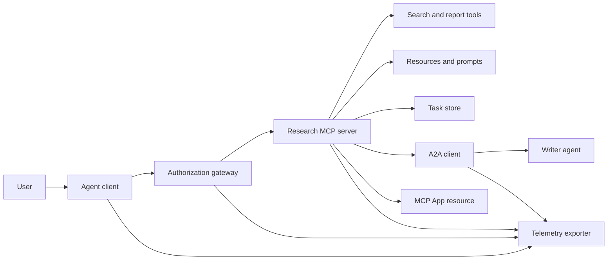
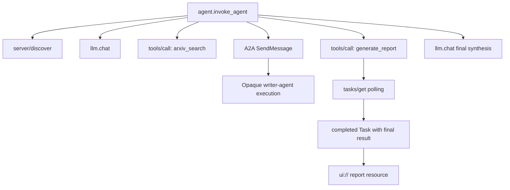
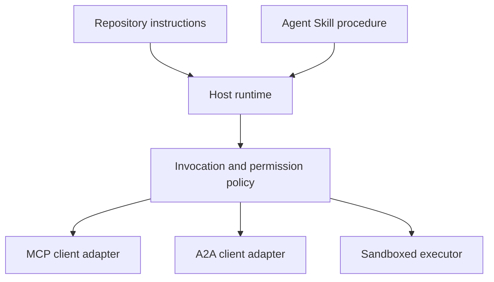

# 综合实战项目:无状态工具生态系统

> وكيل درجة الإنتاج  النظام هو مجموعة من مجموعة من الحدود الواضحة، وليس مجرد مجموعة من الخيارات.

**Type:** Build
**Languages:** Python (stdlib, in-process simulation)
**Prerequisites:** Phase 13 · 01 through 22, using MCP revision `2026-07-28`
**Time:** ~120 minutes

## 學习目标

- استخدام الأداة، ووضع المهام، ونتائج، وكيل عبر الوكيل، ووكل، وUI، وموارد، وسلطة استراتيجيات وتسجيلات التتبع الموزعة،
- في كل طلب من MCP، تنص على إصدارات صارمة للاتفاقية، والصحة والقدرات على المستخدمين، والتخلي عن التوقف على التبعية على اجتماعات الطبقة التنقلية.
- في المرتبة الأولى، تم إكتشاف عمليات تنفيذية، ومع مرور المهام الرسمية  توسيع النشاطات الاستقرارية
- 清晰区分符合协议形态的本地模拟(نموذج المحاكاة على شكل بروتوكول) مع MCP الحقيقي、A2A、OAuth 及 OpenTelemetry 生产实现──
- يتم رسم كل حد تجريبي في المثالي بشكل دقيق حتى يتم استبداله في عملية الإنتاج.
- 确保 `AGENTS.md`、موهبة العميل 、عمل في المعدات 、أدوات 及 استراتيجيات الأمن الخاصة بهم
- 明确指出哪些 تقنية القول يمكن أن تكون مباشرة من محلي الصادرة على دليل، والتي يجب أن تعتمد على حقيقة نهاية إلى نهاية التجميع

## 问题

 تصميم نظام دراسة علمية وتقديم تقارير: طلب المستخدم للحصول على معلومات عن وكيل  إتفاقية الاتصال  نظام بحث مقالات المقال  مفوضية كتابة المجموع  توليد تقرير تحليل  عودة UI  متواصلة الموارد، ومكملة سجل نظام تنفيذ الوصول إلى الصلة 

هذه العبارة تبدو بسيطة، في الواقع تخفي عدة اتفاقيات مستقلة عن بعضها البعض:

- إعلانات عن مخطط أداة 面向模型
- 无状态请求信封与服务发现契约
- 针对主体(演员) 、范围 和工具 身份的网关决策;
- 长周期任务操作契约
- 跨代理 委托协作协议(A2A) ؛
- بريدج الاتصال بين المضيف و (مكب)
- 链路追踪上下文传播与导出
- قابلة للاستعادة

`code/main.py`استخدام Pure Python  وظيفة و الكتب يجعل الحدود المذكورة واضحة قابلة. فإنه لا يفتح شبكة مراقبة ‬ غير حقيقي طلب arXiv‬ لا تنفيذ عملي OAuth ‬ يدي ‬ لا ي调用 بعيد الأمد A2A  خدمة‬ لا يلوث MCP App، ولا يخرج إلى الخارج من البيانات بعيدة التقييم‬‬‬. وهذا يجعل التحكم في التدفقات سهل جداً في التقييم والفهم، في حين تجنب إضفاء الضمير المماثلة المحلية على خدمة الإنتاج المتوافقة مع القواعد‬‬‬‬‬‬‬‬‬‬‬‬‬‬‬‬‬‬‬‬‬‬‬‬‬‬‬‬‬‬‬‬‬‬‬‬‬‬‬‬‬‬‬‬‬‬‬‬‬‬‬‬‬‬‬‬‬‬‬‬‬‬‬‬‬‬‬‬‬‬‬‬‬‬‬‬‬‬‬‬‬‬‬‬‬‬‬‬‬‬‬‬‬‬‬‬‬‬‬‬‬‬‬‬‬‬‬‬‬‬‬‬‬‬‬‬‬‬‬‬‬‬‬‬‬‬‬‬‬‬‬‬‬‬‬‬‬‬‬‬‬‬‬‬‬‬‬‬‬‬‬‬‬‬‬‬‬‬‬‬‬‬‬‬‬‬‬‬‬‬‬‬‬‬‬‬‬‬‬‬‬‬‬‬‬‬‬‬‬‬‬‬‬‬‬‬‬‬‬‬‬‬‬‬‬‬‬‬‬‬‬‬‬‬‬‬‬‬‬‬‬‬‬‬‬‬‬‬‬‬‬‬‬‬‬‬‬‬‬‬‬‬‬‬‬‬‬‬‬‬‬‬‬‬‬‬‬‬‬‬‬‬‬‬‬‬‬‬‬‬‬‬‬‬‬‬‬‬‬‬‬‬‬‬‬‬‬‬‬‬‬‬‬‬‬‬‬‬‬‬‬‬‬‬‬‬‬‬‬‬‬‬‬‬‬‬‬‬‬‬‬‬‬‬‬‬‬‬‬‬‬‬‬‬‬‬‬‬‬‬‬‬‬‬‬‬‬‬‬‬‬‬‬‬‬‬‬‬‬‬‬‬‬‬‬‬‬‬‬‬

## 概念

### 目标架构



إن هذا الإطار هو مجموعة مفاهيمية لنموذج اتفاقية المعايير العامة، وليس تنفيذًا خاصًا داخل أي منتج خاص واحد.

### 目标分布式追踪链路



في الواقع، كل شبكة تمر على الإنترنت على الانترنت على الانترنت على الانترنت على الانترنت على الانترنت على الانترنت على الانترنت على الانترنت على الانترنت على الانترنت على الانترنت على الانترنت على الانترنت على الانترنت على الانترنت على الانترنت على الانترنت على الانترنت على الانترنت على الانترنت على الانترنت على الانترنت على الانترنت على الانترنت على الانترنت على الانترنت على الانترنت على الانترنت على الانترنت على الانترنت على الانترنت على الانترنت على الانترنت على الانترنت على الانترنت على الانترنت على الانترنت على الانترنت على الانترنت على الانترنت على الانترنت على الانترنت على الانترنت على الانترنت على الانترنت على الانترنت على الانترنت على الانترنت على الانترنت على الانترنت على الانترنت على الانترنت على الانترنت على الانترنت على الانترنت على الانترنت على الانترنت على الانترنت على الانترنت على الانترنت على الانترنت على الانترنت على الانترنت على الانترنت على الانترنت على الانترنت على الانترنت على الانترنت على الانترنت على الانترنت على الانترنت على الانترنت على الانترنت على الانترنت على الانترنت على الانترنت على الانترنت على الانترنت على الانترنت على الانترنت على الانترنت على الانترنت على الانترنت على الانترنت على الانترنت على الانترنت على الانترنت على الانترنت على الانترنت على الانترنت على الانترنت على الانترنت على الانترنت على الانترنت على الانترنت على الانترنت على الانترنت على الانترنت على الانترنت على الانترنت على الانترنت

### 当前协议交互表面

استخدام حالي جديد قواعد تعريف اسم الطرق، لا يمكن أبدا أن تتبع ذكريات في مشروع القديم:

| 边界 | 当前标准交互表面 | 本实战项目的本地模拟实现 |
|---|---|---|
| MCP 服务发现 | 强制性的 `server/discover` | 返回版本、capabilities 和服务器身份的直接函数 |
| MCP 请求上下文 | 每个 `params._meta` 均携带版本、capabilities 及客户端信息 | 传递给每次模拟调用的全新请求元数据 |
| MCP 工具调用 | `tools/call` | Python 本地函数直接分发 |
| MCP 任务轮询 | `io.modelcontextprotocol/tasks` 扩展与 `tasks/get` | 先返回处理中的任务句柄，后返回内联最终结果的完成任务 |
| A2A 跨代理委托 | gRPC 和 JSON-RPC 中为 `SendMessage`；HTTP+JSON 中为 `POST /message:send` | 无远程调用与人为延迟的单层嵌套 Span |
| MCP App 调用宿主工具 | `app.callServerTool({ name, arguments })` | 无实时通信桥梁的纯 HTML 字符串 |
| OAuth 鉴权 | 授权服务器、受保护资源元数据、Audience 与 Scope 校验 | 静态 Token 字典查找与 Scope 集合判断 |
| OpenTelemetry | SDK、传播器（Propagator）、导出器（Exporter）及收集器（Collector） | 纯内存 Span 字典数组 |

协议名称仅仅是最外层的表象――生产测试必须覆盖真实网络线缆上的序列化反序列化、认证失败、取消中断、超时重试以及协议多版本兼容――

### 无状态 MCP 重构集成边界

`2026-07-28`修订版本 تم إزالة جلسة الاتفاقية تماماً و`initialize`- لا ، لا`notifications/initialized`تم إلغاء اليدين في نفس الوقت`Mcp-Session-Id`كل طلب موجود`params._meta`中携带如下命名空间字段:

```json
{
  "io.modelcontextprotocol/protocolVersion": "2026-07-28",
  "io.modelcontextprotocol/clientCapabilities": {
    "extensions": {
      "io.modelcontextprotocol/tasks": {}
    }
  },
  "io.modelcontextprotocol/clientInfo": {
    "name": "capstone-client",
    "version": "1.0.0"
  }
}
```

 خدمة يجب أن تتم`server/discover` نتائج استخدام`resultType: "complete"`؛返回任务句柄时使用 `resultType: "task"`كل النتائج يجب أن تكون`_meta.io.modelcontextprotocol/serverInfo`中表明服务器自身身份──

المهام 扩展包含 `tasks/get`.`tasks/update`و`tasks/cancel`أداة 首次调用可以回来 `resultType: "task"`ولاحقاً`tasks/get`-عُودتُ إلى هنا`resultType: "complete"`, و أنتهى`Task`المشاريع المباشرة للشركة`tasks/result`مع`tasks/list`تم نقلها بالكامل. يجب على العميل أن يقدم دعمًا في نفس الطلب الذي قد يتلقى منه.`io.modelcontextprotocol/tasks`扩展;若未声明,服务端将返回 `-32021`错误، و و `requiredCapabilities`وأشار إلى أن هناك غياب في التوسع.

### سلامة حاليات

预期的生产部署环境必须采用 دفاعات متعمقة:

-  إصدار تصريحات إصدارية لتنظيمات المستخدمين المحتملة للحماية
- لـ " إصدار " الـ " توكنات الـ " الـ " الـ " الـ " الـ " الـ " الـ " الـ " الـ " الـ " الـ " الـ " الـ " الـ " الـ " الـ " الـ " الـ " الـ " الـ " الـ " الـ " الـ " الـ " الـ " الـ " الـ " الـ " الـ " الـ " الـ " الـ " الـ " الـ " الـ " الـ " الـ " الـ " الـ " الـ " الـ " الـ " الـ " الـ " الـ " الـ " الـ " الـ " الـ " الـ " الـ " الـ " الـ " الـ " الـ " الـ " الـ " الـ " " الـ " الـ " "
- 网关 على أساس الصفة الصارمة الاختبار المستخدمة أداة ومدى الوصول
- 访问上游 API                                                                                                                                                                                                                                                                                                                                                                                                                                                                                                                         
- 严格锁定并审查工具 描述元数据清单(مظاهر) ؛
- · التنفيذ الشامل للقانون الثاني؛
- في صندوق تنفيذ منفصل، يجب الحد من نظام الملفات، العمليات، الشبكة، الشهادات والإستهلاك الموارد، يجب أن يحد من التنفيذ القسري في وزارة المهارات الخارجية.

هذا الدرس مثالية كود فقط تحقق حالة الوضع الوضع الوضعية Token、Scope 校验以及描述哈希، والتي تهدف إلى توضيح استراتيجية التوجه، لا يمكن أن تحل محل ضمان الأمن الإنتاج.

### المهارات هي عملية التشغيل وليس نقل الشبكة

يستخدم المهارة العميلة لإخبارك كيفية إطلاق تدريب العمل أثناء التشغيل، ما هي الأدوات التي تتوقع مطابقة، ما هي الصفقات، ما هي الأدلة التي تبقى في البقاء، ما هي أدلة المراجعة العملية، وما هو وقت إنهاء المهمة، ولكن لا يمكن أن تكون مجانية لإنشاء خادم MCP، أو إنشاء A2A، أو إرسال الوصول، أو بناء صندوق كود.



عندما يتطلب قواعد التشغيل استشهاد بملفات المواد المستندية، يجب أن يتم إصدارها في شكل كامل من أشكال المعلومات المهنية.

###  درجة المنتجات و البيانات هي المعدات المحلية

هذا البرنامج هو دليل وجهاز التثبيت قادر على التعرف على اسم`skill-*.md`المعلومات المعلوماتية المعلوماتية المعلوماتية المعلوماتية المعلوماتية المعلوماتية المعلوماتية المعلوماتية المعلوماتية المعلوماتية المعلوماتية المعلوماتية المعلوماتية المعلوماتية المعلوماتية المعلوماتية المعلوماتية المعلوماتية المعلوماتية المعلوماتية المعلوماتية المعلوماتية المعلوماتية المعلوماتية المعلوماتية المعلوماتية المعلوماتية المعلوماتية المعلوماتية المعلوماتية المعلوماتية المعلوماتية المعلوماتية المعلوماتية المعلوماتية المعلوماتية المعلوماتية المعلوماتية المعلوماتية المعلوماتية المعلوماتية المعلوماتية المعلوماتية المعلوماتية المعلوماتية المعلوماتية المعلوماتية المعلوماتية المعلوماتية المعلوماتية المعلوماتية المعلوماتية المعلوماتية المعلوماتية المعلوماتية المعلوماتية المعلوماتية المعلوماتية المعلوماتية المعلوماتية المعلوماتية المعلوماتية المعلوماتية المعلوماتية المعلوماتية المعلوماتية المعلوماتية المعلوماتية المعلوماتية المعلوماتية المعلوماتية المعلوماتية

```yaml
---
name: ecosystem-blueprint
description: Produce a full Phase 13 ecosystem architecture for a product need.
version: "1.0.0"
phase: "13"
lesson: "23"
tags: [mcp, capstone, ecosystem, architecture, a2a, otel]
---
```

`name`مع`description`هو يمكن نقله معايير الأساسية`version`.`phase`.`lesson`和 `tags`يواجه البرنامج لغرض توسيع الصفحة.`tags`اكتب لعدد واحد من الجهات`--tag capstone`准确匹配──

标准的可移植目录 مهارات يمكن استخدامها`metadata`الكتب المتحفظة تعريفات المعلومات الموسعة. ولكن في الملفات المحددة في المخزن، إذا كان`version`أو`tags`嵌套缩进写入 `metadata`内部,极简解析器会直接忽略, مما يؤدي إلى عدم استرجاع النسخة رقم وتعليق على الفشل.

### مقارنة بين المثيلات المحلية والبيئة الإنتاجية الحقيقية

| 架构分层 | `code/main.py` 实现 | 生产落地替换方案 | 必须出示的验收证据 |
|---|---|---|---|
| 服务发现 | `server_discover()` 加静态 `TOOLS` | `server/discover` 配合带缓存的 `tools/list` | 报文轨迹、确定性排序与 Schema 校验 |
| 身份认证 | 基于 Token 的内存字典 | 独立的 OAuth 授权服务器与资源服务器验证 | 签发者、受众、Scope、过期与故障降级测试 |
| 授权鉴权 | Scope 集合成员判定 | 绑定主体、tool、目标和租户的网关策略 | 允许与拒绝分支的完整审计日志用例 |
| 论文检索 | 静态论文测试夹具（Fixtures） | 真实检索 API 或专门的 MCP Server | 数据溯源、排序打分与网络异常测试 |
| 异步任务 | 本地句柄加立即 `tasks/get` | 持久化 `io.modelcontextprotocol/tasks` 存储，实现 get/update/cancel 与 TTL | 状态迁移、用户输入、取消及宕机恢复测试 |
| 跨 Agent 委托 | 本地 Sleep 加嵌套 Span | 真实的 A2A 客户端与远程 Agent Card | 契约校验、超时重试与不透明执行测试 |
| 前端交互 App | HTML 字符串与 URI 协议头 | MCP Apps 资源与官方 `App` 通信桥梁 | CSP 安全策略、权限受控、tool 调用与浏览器渲染测试 |
| 链路遥测 | 内存 Python 字典列表 | 完整的 OTel SDK 与远程导出器（Exporter） | 收集端接收凭证与父子 Span 关联断言 |
| 执行沙箱 | 无 | 宿主强制隔离的安全沙箱执行器 | 沙箱逃逸、出站网络、敏感凭证与资源上限测试 |

المقابلات تشكل المشاريع المهنية المرتبطة الحدود الواضحة.

### المرحلة 13 全景知识图谱

| 课次区间 | 核心贡献与架构职责 |
|---|---|
| 01-05 | Tool 接口标准、模型调用、Schema 设计、结构化输出及确定性校验 |
| 06-14 | 无状态 MCP 请求信封、服务发现、底层传输、资源、Prompt、扩展及 Apps |
| 15-18 | 防投毒安全防线、OAuth 鉴权、网关路由、Registry 准入及生产部署落地 |
| 19 | A2A 协议：跨代理的消息传递与异步任务协作 |
| 20 | 基于 OpenTelemetry 的 GenAI 分布式链路追踪设计 |
| 21 | 面向大模型供应商的智能路由与降级分流层 |
| 22 | 可移植 Agent Skill 契约规范与运行时安全边界 |

```figure
t3-capstone-chain
```

## 动手构建

运行进程内综合实战模拟脚本:

```bash
cd phases/13-tools-and-protocols/23-capstone-tool-ecosystem
python3 code/main.py
```

重点审查 الخصائص الرئيسية الستة:

1. `server/discover`لقد أعلنت عن ذلك`2026-07-28`协议版本以及 مهام  توسيع القدرة
2. أليس قادرة على قراءة مقال وتوليد تقرير ، بينما بوب فقط يحمل كتابة طلبات من المجال تم رفضه بقوة.
3. مع كل المجموعة التنفيذية المرحلة التالية كل المواقع Span 均共享 unique Trace ID،并准确记录父级 Span ID.
4. 報告生成操作首先返回任务句柄──随后`tasks/get`                                                                                                                                                                                                                                                                                                                                                                                                                                                                                                                             `ui://`资源引用。
5. وكيل الكتاب الموكل الموكب للحفاظ على تنفيذها لا شفافية الصندوق الأسود، المعدّر فقط سجل الحدود الخارجية
6. 控制台输出没有冒充发生真实网络请求、OAuth 换标、遥测收集器网络导出、浏览器染或沙箱隔离──

脚本会连续执行两次,分别生成两条独立的根追踪链路──审计日志完全保存在本地内存中,进程退出即重置──

## استخدمها

按部就班将模拟层替换为生产级真实组件:

1. ستعمل`server_discover()`و أداة حالة حالة                                                                                                                                                                                                                                                                                                                                                                                                                                                                                                                        `server/discover`مع`tools/list`网络请求──在每个请求中完整携带协议版本、客户端身份和能力──
2. 将静态 Token 字典替换为遵循 RFC 标准的独立授权服务器与受保护资源验证中间件──
3. 完整接入 `io.modelcontextprotocol/tasks`扩展,测试 `tasks/get`.`tasks/update`.`tasks/cancel`、超时时间、TTL 清理及进程重启恢复──坚决不增加已废弃的`tasks/result`أو`tasks/list`.
4. سيتم إعطاء المكتب لتحويل الكود إلى قادر على تحليل الحركات وكالة البطاقة وإرسال الرسائل الحقيقية A2A 客户端
5. استخدام SDK 开发前端交互 App، من خلال `app.callServerTool`规范发起反向工具调用──
6. سوف يخرج إلى محرك التجميع (Collector) ، في محطة التجميع
7. سيتم إدخال جميع الأدوات المستخدمة والكتابة التنفيذية في المادة 26 من القواعد التنظيمية للعمل في حاوية أمن الصندوق.
8. وضع قواعد التشغيل على مستوى المهارات المحددة، وموافقة على إصدار الدورة 27

في كل مرحلة بديلة، يجب أن يكتب كل منهما اختبارًا متكاملًا عبر الحدود الفيزيائية الحقيقية. لا تنسحب اختبارًا استراتيجيًا محليًا من المستويات المنخفضة بعد الاتصال بالشبكة الحقيقية.

## 交付 it

本课交付 `outputs/skill-ecosystem-blueprint.md` هي مخططات بنية ملف واحد، تتطلب في صفحة واحدة أن تشرح بشكل كامل نوع المكونات الأساسية، وضع الأمن، التفويض عبر الوكالة، والقيام بعمق البحث، وتخطيط الهيكل الحامل، والتي هي أكثر خطورة للشغف والتنظيم.

وبما أنه مجرد رسم بياني، فإنه لا يمكن أن يحمل الإشارات، والمنشورات، والأصول أو تقييم الاختبار. عندما يتم بناء مهارات مستوى الإنتاج قابلة للتكرار خارج البرنامج، يجب أن تتبنى الصف 22 و 24 إلى 27 من أشكال البرنامج المعتاد.

## 课后深练习

1. 运行 `code/main.py`◊仔别控制台输出已在本地验证的事实,与在生产中仍需表达真实集成测试证的断言──
2. في المكيماة إضافة إلى وضع ثاني في النهاية اللاحقة، تحديد اثنين من أدوات ذات الاسم نفسه 发生命名冲突时的解决规则── ثم ستبدل قائمة الكود الصلبين إلى حقيقية `tools/list`调用。
3. ستبدل كود وكيل الكتابة بجهاز اختبار A2A حقيقي. ستقوم بتسجيل وتحقيق بطاقة وكيل. ستقوم بتسجيل طلبات رسائل. ستقوم بتسجيل نتائج المنتجات.
4. كحالة المهمة تطوير عملية إعادة تشغيل مستوى التخزين الدائم.`tasks/get`恢复执行、遵守 `pollIntervalMs`轮询间隔, و لا يعتمد `tasks/result`على أساس مباشرة الوصول إلى المنتج النهائي للمهمة المكتملة.
5. بناء تطبيق MCP بسيط جدا، في تحديد استراتيجية CSP وضوح الحدود السلطة`app.callServerTool`من الاتصال
6. سيتم نقل المنتج المثالي Span من خلال OpenTelemetry SDK 导出 إلى محلية True Running Collector 实例中──在收集端断言验证数据接收状态、Trace ID 连续性、父子继承关系与错误标记──
7. وكتب تحريراً لتنظيمات التنمية والتطوير`AGENTS.md`وذلك في إطار مجموعة مستقلة من المهارات المستخدمة في إرشاد دراسة المستندات.

## 关键术语

| 术语 | 通俗说法 | 精确工程含义 |
|---|---|---|
| 实战项目（Capstone） | "把所有东西串起来" | 分阶段构建的集成系统，其本地模拟与真实线上边界保持绝对清晰 |
| 协议形态模拟（Protocol-shaped simulation） | "差不多就是个 MCP" | 在本地构建的与协议数据结构高度相似的代码，但未实现底层的网络传输契约 |
| Tasks 扩展 | "长耗时 tool 调用" | 可选的 `io.modelcontextprotocol/tasks` 扩展规范，定义了持久化标识、轮询、客户端补全、最终结果与取消机制 |
| 不透明边界（Opacity boundary） | "丢给另一个 agent 处理" | 调用方仅能看到公开声明的接口与交付成果，无法窥探其内部思维链与私有状态 |
| 运行时适配器（Runtime adapter） | "接入 Skill 的胶水代码" | 宿主层负责将通用可移植的操作规程映射到服务发现、交互调用、工具权限、安全策略及上下文管理的代码 |
| 集成证据（Integration evidence） | "测试跑通了" | 完整的报文日志、交付产物或接收端实测数据，确凿证明系统跨越了真实的物理边界 |

## 延伸阅读

- [MCP 2026-07-28 核心规范](https://modelcontextprotocol.io/specification/2026-07-28)- التعرف على طلبات الوضع الخدمة العثور على الأدوات استخدام الحقوق والقواعد التنقل الأساسية
- [MCP 2026-07-28 关键变更日志](https://modelcontextprotocol.io/specification/2026-07-28/changelog)- معرفة التفاصيل التطورية للتحويلات والتطبيقات المفروضة
- [MCP Tasks 扩展规范草案](https://tasks.extensions.modelcontextprotocol.io/specification/draft/tasks)- تعلم `tasks/get`.`tasks/update`.`tasks/cancel`وآلية التحول الكاملة لنتائج المهمة النهائية
- [MCP Apps 官方 SDK](https://github.com/modelcontextprotocol/ext-apps/blob/main/docs/overview.md)- التأمين`App`类及 `app.callServerTool`من قبل
- [A2A 跨代理协议最新规范](https://a2a-protocol.org/latest/)- معرفة بطاقات العميل, رسائل, مواصلات المهام, صفقات المواد, تسليم المواد والشبكات, المعايير السلطة المرتبطة بالاتصال
- [OpenTelemetry GenAI 语义约定](https://opentelemetry.io/docs/specs/semconv/gen-ai/)- التبع المعايير المتوحدة في الصناعة للتعقيل الذكري والسلوكيات المختلفة
- [Agent Skills 规范官方文档](https://agentskills.io/specification)- إتقان هذه المشاريع العملية من خلال قواعد التخطيطات المفتوحة من المستوى الذي يعتمد عليه
