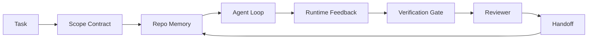

# وكيل الهندسة المكتبية: لماذا نموذج الكفاءة القوية لا يزال يفشل

>  نموذج قوي فقط ليس كافيا ً  وكيل موثوق به ‬ يحتاج إلى منصة عمل: تعليمات ‬الوضع ‬المجال ‬التغذية ‬التحقق ‬المراجعة ‬التسليم ‬التسليم ‬التخلص منها، حتى إذا كان النموذج الحدودي أيضاً سوف يظهر غير مناسب للعمل المنشرو ‬

**Type:** Learn + Build
**Languages:** Python (stdlib)
**Prerequisites:** Phase 14 · 01 (Agent Loop), Phase 14 · 26 (Failure Modes)
**Time:** ~45 minutes

## 學习目标
- 区分模型能力与执行可靠性
- ستة أسطح من مكتب العمل التي يمكن أن تسلمها العميل
- في مهمة إعادة التأمين الصغيرة مقارنة التشغيل المفروض فقط مع التشغيل الموجز على سطح العمل
- 產出一個失败模式 報告, 將每缺失的表面 映射到它造成的症状──

## 问题
أنت وضع نموذج حدودي وضع في إعادة التأمين الحقيقية، دعها تضيف إدخال إثباتات ‬‬‬‬‬‬‬‬‬‬‬‬‬‬‬‬‬‬‬‬‬‬‬‬‬‬‬‬‬‬‬‬‬‬‬‬‬‬‬‬‬‬‬‬‬‬‬‬‬‬‬‬‬‬‬‬‬‬‬‬‬‬‬‬‬‬‬‬‬‬‬‬‬‬‬‬‬‬‬‬‬‬‬‬‬‬‬‬‬‬‬‬‬‬‬‬‬‬‬‬‬‬‬‬‬‬‬‬‬‬‬‬‬‬‬‬‬‬‬‬‬‬‬‬‬‬‬‬‬‬‬‬‬‬‬‬‬‬‬‬‬‬‬‬‬‬‬‬‬‬‬‬‬‬‬‬‬‬‬‬‬‬‬‬‬‬‬‬‬‬‬‬‬‬‬‬‬‬‬‬‬‬‬‬‬‬‬‬‬‬‬‬‬‬‬‬‬‬‬‬‬‬‬‬‬‬‬‬‬‬‬‬‬‬‬‬‬‬‬‬‬‬‬‬‬‬‬‬‬‬‬‬‬‬‬‬‬‬‬‬‬‬‬‬‬‬‬‬‬‬‬‬‬‬‬‬‬‬‬‬‬‬‬‬‬‬‬‬‬‬‬‬‬‬‬‬‬‬‬‬‬‬‬‬‬‬‬‬‬‬‬‬‬‬‬‬‬‬‬‬‬‬‬‬‬‬‬‬‬‬‬‬‬‬‬‬‬‬‬‬‬‬‬‬‬‬‬‬‬‬‬‬‬‬‬‬‬‬‬‬‬‬‬‬‬‬‬‬‬‬‬‬‬‬‬‬‬‬‬‬‬‬‬‬‬‬‬‬‬‬‬‬‬‬‬‬‬‬‬‬‬‬‬‬‬‬‬‬‬‬‬‬‬‬‬‬‬‬‬‬‬‬‬‬‬‬‬‬‬‬‬‬‬‬‬‬‬‬‬‬‬‬‬‬‬‬‬‬‬‬‬‬‬‬‬‬‬‬‬‬‬‬‬‬‬‬‬‬‬‬‬‬‬‬‬‬‬‬‬‬‬‬‬‬‬‬‬‬‬‬‬‬‬‬‬‬‬‬‬‬

النموذج ليس لا يفهم بيثون. إنه لا يفهم هذا العمل. إنه لا يعرف ما الذي يجب أن ينجزه. يسمح لكتابة أيّة اختبارات لها سلطة، ولا يعرف كيفية التعامل مع الجلسة القادمة.

هذا ليس خطأ نموذج. هذا خطأ لوحة العمل.

## 概念
المكتب هو محطة عمل الموديل خلال المهام.

| Surface | 它承载什么 | 缺失时的失败 |
|---------|------------|--------------|
| Instructions | 启动规则、禁止动作、完成定义 | Agent 猜测交付意味着什么 |
| State | 当前任务、已触碰文件、blockers、下一步动作 | 每个 session 都从零开始 |
| Scope | 允许文件、禁止文件、验收标准 | 修改泄漏到无关代码 |
| Feedback | 捕获进 loop 的真实命令输出 | Agent 在 400 上宣布成功 |
| Verification | Tests、lint、smoke run、scope check | “看起来不错”进入 main |
| Review | 由不同角色执行的第二遍检查 | Builder 批改自己的作业 |
| Handoff | 改了什么、为什么改、还剩什么 | 下一个 session 重新发现一切 |

المكتب العمل 独立于模型──你可以替换模型并保留这些表面──你不能替换表面 还保持可靠性──



هذه الحلقة مغلقة على الملفات الحكومية وليس تاريخ الدردشة

### منصة العمل مع الهندسة السريعة

التسجيل  أخبر النموذج هذا الجولة ما تريد ‬المكتب العمل  أخبر النموذج كيف عبر الجولة ‬المجلس العمل 地完成工作‬ معظم العملاء 失败故事,其实是披着快速工程 外衣的工作桌 失败‬

### مقارنة بين منصة العمل والإطار

الإطار قدم وقت تشغيل LangGraph、AutoGen、Agents SDK)  منصة عمل قدم مكان عمل للعميل في ذلك الوقت

### من البدائيات تظهر التفكير، وليس من السوقيات التشريعية تظهر

هناك الكثير من المقالات حول هندسة الـ"هيرنس" في الوقت الحالي. لا يوجد الكثير من المقالات حول هذه المقالة. لا يوجد في المقالة ما يحتوي على الحدود والمقالات التي يستخدمها الـ"هيرنس". لا يوجد حاجة إلى اختيار السطح. السطح السبع هو طبقة UX. كل سطح يعمل تحت كل سطح، هو نفس مجموعة من أساسيات أي نظام تقسيمي موثوق به.

قبل أن تأخذ العاملة لفترة، هذه العلامة. مرة واحدة العميل تشغيل هو عبر الوقت، العمليات والآلة الحساب.

| Primitive | 它是什么 | 它为 agent 承载什么 |
|-----------|----------|---------------------|
| Function | 类型化 handler。尽可能保持纯。拥有自己的 inputs 和 outputs。 | 一次 tool call、一次 rule check、一个 verification step、一次模型调用 |
| Worker | 拥有一个或多个 functions 和 lifecycle 的长生命周期进程 | builder、reviewer、verifier、一个 MCP server |
| Trigger | 调用 function 的事件源 | Agent loop tick、HTTP request、queue message、cron、file change、hook |
| Runtime | 决定什么在哪里运行、使用什么 timeouts 和 resources 的边界 | Claude Code 的 process、LangGraph 的 runtime、一个 worker container |
| HTTP / RPC | caller 与 worker 之间的网络线缆 | Tool-call protocol、MCP request、model API |
| Queue | trigger 与 worker 之间的持久 buffer；back-pressure、retry、idempotency | task board、feedback log、review inbox |
| Session persistence | 在 crashes、restarts、model swaps 后仍保留的 state | `agent_state.json`、checkpoints、KV stores、repo 本身 |
| Authorization policy | 谁能以什么 scope 调用什么 function | allowed/forbidden files、approval boundaries、MCP capability lists |

الآن ضع سبعة سطحات من المكتب المعمل على هذه الأسباب

- **Instructions** سياسة + وظيفة البيانات المعدنية。القواعد هي التحققات(ال وظائف)―الجهاز التوجيهي`AGENTS.md`) هي المرتبطة بسياسة التشغيل
- **State** استمرار الجلسة.‬وقت تشغيل.‬ ‬ ‬ ‬ ‬ ‬ ‬ ‬ ‬ ‬ ‬ ‬ ‬ ‬ ‬ ‬ ‬ ‬ ‬ ‬ ‬ ‬ ‬ ‬ ‬ ‬ ‬ ‬ ‬ ‬ ‬ ‬ ‬ ‬ ‬ ‬ ‬ ‬ ‬ ‬ ‬ ‬ ‬ ‬ ‬ ‬ ‬ ‬ ‬ ‬ ‬ ‬ ‬ ‬ ‬ ‬ ‬ ‬ ‬ ‬ ‬ ‬ ‬ ‬ ‬ ‬ ‬ ‬ ‬ ‬ ‬ ‬ ‬ ‬ ‬ ‬ ‬ ‬ ‬ ‬ ‬ ‬ ‬ ‬ ‬ ‬ ‬ ‬ ‬ ‬ ‬ ‬ ‬ ‬ ‬ ‬ ‬ ‬ ‬ ‬ ‬ ‬ ‬ ‬ ‬ ‬ ‬ ‬ ‬ ‬ ‬ ‬ ‬ ‬ ‬ ‬ ‬ ‬ ‬ ‬ ‬ ‬ ‬ ‬ ‬ ‬ ‬ ‬ ‬ ‬ ‬ ‬ ‬ ‬ ‬ ‬ ‬ ‬ ‬ ‬ ‬ ‬ ‬ ‬ ‬ ‬ ‬ ‬ ‬ ‬ ‬ ‬ ‬ ‬ ‬ ‬ ‬ ‬ ‬ ‬ ‬ ‬ ‬ ‬ ‬ ‬ ‬ ‬ ‬ ‬ ‬ ‬ ‬ ‬ ‬ ‬ ‬ ‬ ‬ ‬ ‬ ‬ ‬ ‬ ‬ ‬ ‬ ‬ ‬ ‬ ‬ ‬ ‬ ‬ ‬ ‬ ‬ ‬ ‬ ‬ ‬ ‬ ‬ ‬ ‬ ‬ ‬ ‬ ‬ ‬ ‬ ‬ ‬ ‬ ‬ ‬ ‬ ‬ ‬ ‬ ‬ ‬ ‬ ‬ ‬ ‬ ‬ ‬ ‬ ‬ ‬ ‬ ‬ ‬ ‬ ‬ ‬ ‬ ‬ ‬ ‬ ‬ ‬ ‬ ‬ ‬ ‬ ‬
- **Scope**سياسة تصريح كل مهمة. المجال المسموح به/المحرم منه هو ACL.
- **Feedback** 写入 queue 的呼唤日志──每次 shell call 都是一篇记录,持久、可重放──
- **Verification** وظيفة ∼ إلى المدخلات 确定性‬ بواسطة المهمة إغلاق 触发‬
- **Review** عمال مستقلون، لديهم حقوق القراءة فقط على أدوات البناء، لديهم حقوق الكتابة فقط على تقارير المراجعة.
- **Handoff** من قبل إطلاق نهاية الجلسة  إصدار سجل طويل الأمد.

حلقة العميل 本身就是一個工人,它消费事件(رسالة المستخدم 工具結果 提মার تيك) ،调用函数 ((先是模型,然后是模型选择的工具),写记录 ((状态、反),并发发发发触发 ((تصديق、 مراجعة、 赠款) 没有神秘之处;形状与工作处理器 相同──

### 流行模式,转换为 بدائية

كل نمط من أشكال الحزام المنتشرة يمكن أن يتم تقسيمه إلى حوالي 8 أسباب.

| Vendor or community pattern | 它实际是什么 |
|------------------------------|--------------|
| Ralph Loop（Claude Code、Codex、agentic_harness book）— 当 agent 试图过早停止时，把原始意图重新注入一个新的 context window | 一个将 task 以干净 context 重新入队的 trigger；session persistence 负责把目标向前传递 |
| Plan / Execute / Verify (PEV) | 三个 workers，每个角色一个，通过 state 和 phases 之间的 queue 通信 |
| Harness-compute separation（OpenAI Agents SDK，April 2026）— 将 control plane 与 execution plane 分开 | 对 control-plane / data-plane 的重新表述。比 agent 标签早几十年就存在 |
| Open Agent Passport（OAP，March 2026）— 在执行前根据声明式 policy 签名并审计每次 tool call | 由 pre-action worker 强制执行的 authorization policy，并带有 signed audit queue |
| Guides and Sensors（Birgitta Böckeler / Thoughtworks）— feedforward rules + feedback observability | Authorization policy + verification functions + observability traces |
| Progressive compaction, 5-stage（Claude Code reverse engineering，April 2026） | 一个 state-management worker，像 cron 一样在 session persistence 上运行，使其保持在 budget 内 |
| Hooks / middleware（LangChain、Claude Code）— 拦截 model 和 tool calls | 包裹 runtime invocation path 的 triggers + functions |
| Skills as Markdown with progressive disclosure（Anthropic、Flue） | 一个 function registry，其中 function metadata 会 just-in-time 加载到 context 中 |
| Sandbox agents（Codex、Sandcastle、Vercel Sandbox） | compute plane：具备隔离 filesystem、network 和 lifecycle 的 runtime |
| MCP servers | 通过稳定 RPC 暴露 functions 的 workers，capability lists 作为 authorization |

كل شيء في هذه الجدول، هو وكيل المجتمع يصل إلى بدائية من الكلمات المشهورة في الأنظمة الموزعة، ثم يعطيها اسم جديد.

### الإيصالات  في الواقع تشرح ماذا

ويقولون أن القول عن الاستغلال على النموذج أصبح موجوداً الآن.

- البينك التاريخي 2.0  مع نموذج واحد، فقط استخدام التغيير 就让一个编码代理从前30 之外提升到第五名(LangChain,*Anatomy of an Agent Harness*) 
- ورسل   حذف 80% من أدوات وكيلها؛ معدل النجاح من 80%  قفز إلى 100%  مونغودب)
- هارفي  وكلاء قانوني  فقط من خلال تحسين الاستخدام 就让 دقت 翻倍以上(MongoDB) ‬
- 88% من مشاريع وكلاء الذكاء الاصطناعي المؤسسية غير قادرة على دخول الإنتاج.
- دراسة مقياس 2025 في ثلاثة إطارات مفتوحة المصدر منتشرة، أبلغت عن إنجاز 50٪ من المهام؛ و WebAgent في ظروف طويلة المدى، أسفل من 40-50٪  هبوط إلى 10٪، وذلك بسبب حلقات لا نهاية لها وفقدان الأهداف (((تناقش على نطاق واسع في كتابات بداية عام 2026):

النقطة ليست التعبئة 永遠胜出── النموذج سوف يستوعب مع مرور الوقت خدوش التعبئة── النقطة هي اليوم، تحمل المشروعات حول النموذج، وليس داخل النموذج؛ تحمل هذه الحملات البدائية، هي بالضبط كل نظام إنتاج دائما ما تحتاج إلى شيء──

### كتابات البائع 止步的地方

هذا جزء لا تحتاج إلى زبون

- * أناثومية الوكيل Harness من LangChain * تمتثل عشرة مكونات  محذوفات ، أدوات ، هوقات ، صناديق الرمل ، ترقية ، ذاكرة ، مهارات ، فرعية ، وكذلك حلقة تشغيل غبية .
- أددي أوسماني من * وكيل حزم الهندسة *  طرحت `Agent = Model + Harness`أساسية، ولكن لا يوجد أي تفسير إضافي حول ما يشكله الحزام.
- انتروبيك و OpenAI على السطحات  بحثت أكثر عمقا، ولكن لا تزال تبقى في وقت تشغيلها 内。 أبريل 2026 وكلاء SDK في harness-computing separation الإعلان هو أول قطعة واضحة يمكن تحديد التحكم-طائرة / بيانات-طائرة من البائع منفصلة。 ذلك فكرة بدائية، وليس شيئا جديدا ً‬
- كتاب agentic_harness سوف تستخدم 视为 config object((جايمين ويست *Agentic Engineering*, الفصل 6) ، من بينها أكثر جملة فعالية هوالسلسلة هي الحدود الأمن الرئيسية في نظام وكالة──
- حلقات الأخبار المختارة 一直抵达同一个地方── أبريل 2026 حلقات *السلسلة العميل تنتمي خارج صندوق الرمل* 认为 harness 应该位于更像是一个处在一切之外、并基于背景 和用户 授权访问的超级浏览器──这是再次作为独立平面的授权政策──

أنت لا تحتاج إلى معارضة أي من هذه المواد، ويمكن أيضا أن ترى عيبات.`AGENTS.md`色也修不好缺失的排队──

لذلك، عندما تسمع في أماكن أخرى عن هندسة القوة 时,把它翻译成原始ية──提示和规则是政策与功能──Scaffolding是运行时间──Guardrails是授权 +验证──Hooks是触发器──ذاكرة是会议持续性──Ralph Loop是 Requeue──Sandboxes是计算平面──词汇会变化;工程不会──工作台是面向代理 UX;而能够挺过下一次的供应商重构的链接,本质是函数、工人、触发器、运行时间、排列、持续和政策被正确连接在一起──


```figure
wb-seven-surfaces
```

## بناءها
`code/main.py`سأضع مهمة إعادة التأمين الصغيرة 运行两次. المرة الأولى هي الإستعارة فقط، والمرة الثانية هي الدخول إلى سبعة أسطح.

مهمة repo 刻意设计得很小: أعطوا ملف واحد عامل نمط FastAPI 添加输入验证,并写一个通过测试──

运行它:

```
python3 code/main.py
```

输出: اثنين من عمليات التشغيل المشتركة, واحد مجموعات سريعة فقط`failure_modes.json`وذلك من خلال حكم الإدارة

العامل هو حجر قاعدة صغيرة جدا، والتركيز هو السطح، وليس النموذج. في بقية هذه المسار الصغيرة، سوف تجعل كل سطح تعيد بناءها لأنها حقيقية.

## استخدمها
ثلاثة أماكن بالفعل في الواقع هناك سطحات لوحة العمل، حتى لا يوجد أحد يدعوها هكذا:

- **Claude Code, Codex, Cursor.** `AGENTS.md`和 `CLAUDE.md`تعريفات سطحها. أوامر شاشة هو نطاقها.
- **LangGraph, OpenAI Agents SDK.**نقاط التفتيش ومخازن الدورة هي سطح الدولة.
- **真实 repo 上的 CI。**اختبارات 、lint 和 التحقق من النوع هو التحقق.

هندسة منصة العمل هي نوع من القانون: جعل هذه السطحات 显式化、可复用化، بدلا من جعل كل فريق نفسه إعادة اكتشافها.

## 交付 it
`outputs/skill-workbench-audit.md`هو مهارة قابلة للانتقال، تستخدم لمراجعة سبعة أسطح العمل الموجودة في الاحتياطي، وتقديم تقرير عن ما فات، ما هو جزء من الميزانية، ما هو الصحة، وضعه إلى أي جهاز إعداد، فإنه سيخبرك أولاً ما هو.

## التدريب
1. 选择一个你已经运行代理的 repo──把七个表面从0(缺失) 到2(健康)打分──你最弱的表面是什么?
2. 扩展 `main.py`، دع إرسال الإشارة فقط و أيضاً تظهر إعلان نجاح مزيف
3. إضافة السطح الثامن لمنتجك الخاص. شرح لماذا لا يمكن أن يتم تجميعه إلى واحدة من السبع الموجودة.
4. مع شخص آخر سوف تلهسون ... وكيل المكتب المضغوطة إعادة تشغيل الكتاب المقدس ..
5. ستقوم المرحلة 14 · 26 في الخمسة أنظمة التلفل المتكررة في الصناعات بتقديمها إلى سبعة أسطحات.

## 关键术语
| Term | What people say | What it actually means |
|------|----------------|------------------------|
| Workbench | “那套 setup” | 围绕模型设计的 engineered surfaces，使工作可靠 |
| Surface | “一个 doc” 或 “一个 script” | agent 每一轮读取或写入的命名、machine-readable input |
| System of record | “那些 notes” | chat history 消失后 agent 视为 truth 的文件 |
| Definition of done | “Acceptance” | 一个客观、file-backed 的 checklist，agent 无法伪造 |
| Workbench audit | “Repo readiness check” | 在工作开始前遍历七个 surfaces，标记缺失部分 |

## 延伸阅读
ضع هذه النقاط كمعلومات وليس سلطة. كل منها هو تصنيف جزئي. في اتخاذ قرار ما إذا كان تبني مفهوم ما، أولاً ترجمته إلى البدائية.

إطارات البائع:

- [Addy Osmani, Agent Harness Engineering](https://addyosmani.com/blog/agent-harness-engineering/) `Agent = Model + Harness`و نمط الرفع؛ الجزء من البنية التحتية
- [LangChain, The Anatomy of an Agent Harness](https://blog.langchain.com/the-anatomy-of-an-agent-harness/) 十一个组件:مواصلات، أدوات، هيكات، أوركستراسيون، صناديق الرمل، الذاكرة، المهارات، المكونات الفرعية، وقت التشغيل،省略 queues、deployment、authz
- [OpenAI, Harness engineering: leveraging Codex in an agent-first world](https://openai.com/index/harness-engineering/) نظرة كودكس 团队 على وقت تشغيله  حول السطحات
- [OpenAI, Unrolling the Codex agent loop](https://openai.com/index/unrolling-the-codex-agent-loop/) 将代理循环 归约为函数调用 上一个 `while`
- [Anthropic, Effective harnesses for long-running agents](https://www.anthropic.com/engineering/effective-harnesses-for-long-running-agents)  أسطح الأفق الطويل في وقت تشغيل محدد
- [Anthropic, Harness design for long-running application development](https://www.anthropic.com/engineering/harness-design-long-running-apps)  تطبيق نوع تصميم
- [LangChain Deep Agents harness capabilities](https://docs.langchain.com/oss/python/deepagents/harness) سطح تشكيل الوقت

هناك تفاصيل مفيدة للممارس:

- [Martin Fowler / Birgitta Böckeler, Harness engineering for coding agent users](https://martinfowler.com/articles/harness-engineering.html) دليلات إغذاءمضي قدما) + أجهزة استشعار رد فعل) ؛最清晰的控制理论框架
- [HumanLayer, Skill Issue: Harness Engineering for Coding Agents](https://www.humanlayer.dev/blog/skill-issue-harness-engineering-for-coding-agents)   هذا ليس مشكلة نموذج، بل تشكيل 问题
- [MongoDB, The Agent Harness: Why the LLM Is the Smallest Part of Your Agent System](https://www.mongodb.com/company/blog/technical/agent-harness-why-llm-is-smallest-part-of-your-agent-system)شهادة: 80٪ إلى 100٪، تحديد دقة 2x، البنك المحمول أعلى 30 إلى أعلى 5
- [Augment Code, Harness Engineering for AI Coding Agents](https://www.augmentcode.com/guides/harness-engineering-ai-coding-agents) القيود - المشي الأول
- [Sequoia podcast, Harrison Chase on Context Engineering Long-Horizon Agents](https://sequoiacap.com/podcast/context-engineering-our-way-to-long-horizon-agents-langchains-harrison-chase/) مخاوف الوقت المباشر 高于 مخاوف النموذج

书籍、论文 وممارسات مرجعية:

- [Jaymin West, Agentic Engineering — Chapter 6: Harnesses](https://www.jayminwest.com/agentic-engineering-book/6-harnesses) معالجة طول الكتاب،将 Harness 视为 أول حدود الأمن
- [preprints.org, Harness Engineering for Language Agents (March 2026)](https://www.preprints.org/manuscript/202603.1756) 将其作为控制 /机构 / runtime 的学术框架
- [walkinglabs/awesome-harness-engineering](https://github.com/walkinglabs/awesome-harness-engineering)  跨背景、评估、可观察性、 Orchestration  قائمة القراءة المنتظمة
- [ai-boost/awesome-harness-engineering](https://github.com/ai-boost/awesome-harness-engineering)  قائمة أخرى مختصة ((أدوات تقييمات ذاكرة MCP ‬الاجازات)
- [andrewgarst/agentic_harness](https://github.com/andrewgarst/agentic_harness) تنفيذ مرجع جاهز للإنتاج، مع ذاكرة تدعم Redis و مجموعة تقييم
- [HKUDS/OpenHarness](https://github.com/HKUDS/OpenHarness) داخل الجهاز الشخصي من مفتوح الجهاز الحزام

值得 قراءة تفاصيلها وليس توافقها 讨论:

- [HN: Effective harnesses for long-running agents](https://news.ycombinator.com/item?id=46081704)
- [HN: Improving 15 LLMs at Coding in One Afternoon. Only the Harness Changed](https://news.ycombinator.com/item?id=46988596)
- [HN: The agent harness belongs outside the sandbox](https://news.ycombinator.com/item?id=47990675) 主张将授权 作为独立平面

الإشارات المتقاطعة داخل هذا المناهج الدراسية:

- المرحلة 14 · 23  OpenTelemetry GenAI: مؤتمرات الأدب الاستشعارية
- المرحلة 14 · 26  七个表面 设计来吸收的故障模式目录
- المرحلة 14 · 27  قع في سياسة الإذن البدائية 上的
- المرحلة 14 · 29  أوقات تشغيل الإنتاج ((مرسلة ‬الحدث ‬القتال): البدائيات في درجة درجة تعزيز في موقع النشر
