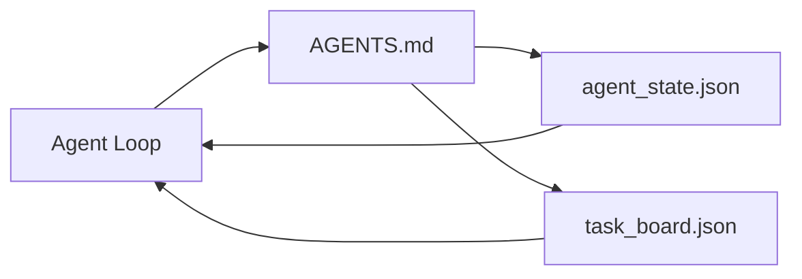

# أحدث عميل في مكتب العمل

> أقصر مقعد عمل متاح  فقط ثلاثة ملفات: راوتر تعليمات جذرية ‬ملف حالة، فضلا عن لوحة مهمة‬ كل شيء آخر يقع فوقها‬‬‬‬‬‬‬‬‬‬‬‬‬‬‬‬‬‬‬‬‬‬‬‬‬‬‬‬‬‬‬‬‬‬‬‬‬‬‬‬‬‬‬‬‬‬‬‬‬‬‬‬‬‬‬‬‬‬‬‬‬‬‬‬‬‬‬‬‬‬‬‬‬‬‬‬‬‬‬‬‬‬‬‬‬‬‬‬‬‬‬‬‬‬‬‬‬‬‬‬‬‬‬‬‬‬‬‬‬‬‬‬‬‬‬‬‬‬‬‬‬‬‬‬‬‬‬‬‬‬‬‬‬‬‬‬‬‬‬‬‬‬‬‬‬‬‬‬‬‬‬‬‬‬‬‬‬‬‬‬‬‬‬‬‬‬‬‬‬‬‬‬‬‬‬‬‬‬‬‬‬‬‬‬‬‬‬‬‬‬‬‬‬‬‬‬‬‬‬‬‬‬‬‬‬‬‬‬‬‬‬‬‬‬‬‬‬‬‬‬‬‬‬‬‬‬‬‬‬‬‬‬‬‬‬‬‬‬‬‬‬‬‬‬‬‬‬‬‬‬‬‬‬‬‬‬‬‬‬‬‬‬‬‬‬‬‬‬‬‬‬‬‬‬‬‬‬‬‬‬‬‬‬‬‬‬‬‬‬‬‬‬‬‬‬‬‬‬‬‬‬‬‬‬‬‬‬‬‬‬‬‬‬‬‬‬‬‬‬‬‬‬‬‬‬‬‬‬‬‬‬‬‬‬‬‬‬‬‬‬‬‬‬‬‬‬‬‬‬‬‬‬‬‬‬‬‬‬‬‬‬‬‬‬‬‬‬‬‬‬‬‬‬‬‬‬‬‬‬‬‬‬‬‬‬‬‬‬‬‬‬‬‬‬‬‬‬‬‬‬‬‬‬‬‬‬‬‬‬‬‬‬‬‬‬‬‬‬‬‬‬‬‬‬‬‬‬‬‬‬‬‬‬‬‬‬‬‬‬‬‬‬‬‬‬‬‬‬‬‬‬‬‬‬‬‬‬‬‬‬‬‬‬‬‬‬‬‬‬

**Type:** Build
**Languages:** Python (stdlib)
**Prerequisites:** Phase 14 · 31（为什么强大的模型仍然失败）
**Time:** ~45 分钟

## 學习目标
- تعريف تشكيل الحد الأدنى من المكتب العملي القابل للعمل.
- شرح لماذا جهاز توجيه جذري قصير يفوز بجسم واحد طويل`AGENTS.md`.
- بناء وكيل كل دورة يمكن قراءته و كتابته في نهاية الملف الحكومي
- بناء تاريخ الدردشة غير الاعتماد 也能支多 جلسة 工作的任务板──

## 问题
معظم الفريق سوف يمرون في كتابة 3000 صف`AGENTS.md`أنشئ منصة عمل، ثم نعتقد أنه قد تم، النموذج سوف يحملها، يتجاهل تلك الأجزاء غير الموجزة، ثم لا يزال على نفس الجماعة من السطح الذي كان يفشل.

تحتاج إلى شيء عكس ذلك. . . . . . . . . . . . . . . . . . . . . . . . . . . . . . . . . . . . . . . . . . . . . . . . . . . . . . . . . . . . . . . . . . . . . . . . . . . . . . . . . . . . . . . . . . . . . . . . . . . . . . . . . . . . . . . . . . . . . . . . . . . . . . . . . . . . . . . . . . . . . . . . . . . . . . . . . . . . . . . . . . . . . . . . . . . . . . . . . . . . . . . . . . . . . . . . . . . . . . . . . . . . . . . . . . . . . . . . . . . . . . . . . . . . . . . . . . . . . . . . . . . . . . . . . . . . . . . . . . . . . . . . . . . . . . . . . . . . . . . . . . . . . . . . . . . . . . . . . . . . . . . . . . . . . . . . . . . . . . . . . . . . . . . . . . . . . . . . . . . . . . . . . . . . . . . . . . . . . . . . . . . . . . . . . . . . . . . . . . . . . . . . . . . . . . . . . . . . . . . . . . . . . . . . . . . . . . . . . . . . . . . . . . . . . . . . . . . . . . . . . . . . . . . . . . . . . . . . . . . . . . . . . . . . . . . . . . . . . . . . . . . . . . . . . . . . . . . . . . . . . . . .

ثلاث وثائق. كل وثيقة لها وظيفة. كل وثيقة كافية للآلة القراءة، ثم يمكن تطويرها إلى نظام حقيقي.

## 概念


### وكلاء.md هو جهاز توجيه، وليس يدوي

حسناً`AGENTS.md`很短──它把代理指向:

- ملف الدولة (((你在哪里)
- اللجنة المهمة (((
- 更深层的规则(在 `docs/agent-rules.md`أسفل
- أمر التحقق (كيف تعرف أنه يعمل)

المحتويات المضيفة في المواد المضافة إلى المستويات العميقة، فقط في الوقت الحالي لتحميل.

### الوكيل_state.json هو نظام تسجيل

الحالة 携带:active task id、被触及文件、已做假设、阻塞,以及下一步行动── العميل كل دورة都会读取它──下一个会议 读取它,而不是重放聊天──

الحالة موجودة في الملفات، لأن تاريخ الدردشة لا يمكن الاعتماد عليه.

### task_board.json هو الصف

اللوحة المهام  حمل كل مهمة، حالة `todo | in_progress | done | blocked`عندما تكون في الفضاء، فهي صف العميل الذي يأخذ المهمة، عندما تتساءل عما إذا كان العميل يمشي على السباق الصحيح، فهي أيضا صفك الذي تُقرأ.

المجلس أعلى المهام لديه الهوية الغرض صاحب`builder`.`reviewer`أو`human`(و معايير قبولها)). المجلس لديه نية للحفاظ على صغر: عندما يصل إلى أكثر من شاشة واحدة، فإنك تواجه مشكلة التخطيط، وليس مشكلة المجلس.

### ثلاث وثائق هي القائمة وليس القائمة

后续课程将添加范围合同、反运行者、验证门、审查者检查清单和交付包──其中三个文件是它们共同假设的基础──


```figure
wb-three-files
```

## بناءها
`code/main.py`سأضع أقل طاولة عمل كتب إلى إعادة التأمين فارغة،并演示 دور العامل الواحد، فإنه سوف:

1. 读取 `agent_state.json`.
2. إذا كانت الحالة فارغة، فلنذهب`task_board.json`لا تأخذ مهمة أخرى
3. في نطاق النطاق داخل التواصل الملفات
4. 写回更新后的状态──

运行它:

```
python3 code/main.py
```

الكتابة سوف تكون على جانبها`workdir/`، وضع هذه الملفات الثلاثة ، وتسير في جولة واحدة ، ثم طبع فرقها.

## استخدمها
في منتجات الوكيلات في فئة الإنتاج، تظهر نفس الملفات الثلاثة باسم مختلف:

- **Claude Code:**استخدام`AGENTS.md`أو`CLAUDE.md`كمجهاز، استخدام`.claude/state.json`المتاجر كـ دولة، مع الكعب كـ لوح
- **Codex / Cursor:**قواعد مساحة العمل 作为 راوتر, جلسة الذاكرة 作为状态,聊天横行 中的排队任务 作为板──
- **Custom Python agent:**هذه هي الملفات التي كتبتها للتو

名称会变──形状不会──

## نمط الإنتاج في المشهد الحقيقي

عندما يتم وضع ثلاثة أنماط على سطح أقل من منصة العمل ، فإنه يتحمل اختبارات الاحتفاظ الحقيقي.

**带 nearest-wins precedence 的嵌套 `AGENTS.md`。**أعلنت شركة OpenAI عن 88 إصداراً في صندوقها الرئيسي`AGENTS.md`文件, كل مكون فرعي واحد ∙Codex、Cursor、Claude Code 和 Copilot 都会从当前工作文件一路向 repo root 遍历,并连接沿途找到的每个 `AGENTS.md`◊ الإرشادات الفرعية 文件扩展 ملف الجذر──Codex 添加了 `AGENTS.override.md`، لتحويل بدلا من التوسع؛ الجهاز الإفراج هو محدد لـ كودكس، القيام بالأدوات المتقاطعة 工作时应避免使用──Augment Code`AGENTS.md`تحسين جودة الملفات التي تأتي بها، يعادل تحسينها من هايكو إلى أوبوس؛ أسوأ الملفات ستجعلها أقل من الصادرة من أي مستندات.

**即使看起来像 coverage，也要拒绝的 anti-patterns。**相互冲突的指示 会把代理从互动模式 降至贪模式(ICLR 2026 AMBIG-SWE:48.8% → 28% شرح القرار);应给优先事项 编号,而不是把它们平铺堆叠――不可验证的风格规则(遵循Google Python Style Guide) إذا لم يكن هناك أمر تنفيذ,就会让代理自行想象遵守; 条款风格规则都应配上精确的 lint命令;; 开始而不是命令 开头,会埋没验证路径; 命令在前风格, 在后风格, 在后风格.

**Cross-tool symlinks。**واحد واحد ملف الجذر  مع مراكز التواصل`ln -s AGENTS.md CLAUDE.md`.`ln -s AGENTS.md .github/copilot-instructions.md`.`ln -s AGENTS.md .cursorrules`يمكن لكل وكيل برمجة استخدام مصدر واحد للحق`nx ai-setup`سوف تستند إلى إعداد واحد، في كلود كودكورس كوبيلوتر جيمين كودكس و اوبن كود إنجاز هذا الشيء تلقائيا.

## 交付 it
`outputs/skill-minimal-workbench.md`سأقوم لأي إعادة تأمين جديد 生成三文件`AGENTS.md`راوتر يحمل مفاتيح صحيحة`agent_state.json`، و أيضاً إستخدام الخصم السابق`task_board.json`.

## التدريب
1. أعطني`agent_state.json`إضافة واحدة`last_run`طابع زمني: إذا كان الملف يصل إلى 24 ساعة، إلا إذا أكد المدير، وإلا رفض التنفيذ.
2. أعطني اللوحة المهام إضافة واحدة`priority`المجال،并修改拉, جعلها دائما اختيار الدرجة الأولى أعلى `todo`.
3. ستعمل`task_board.json`迁移到JSON Lines,让每个任务占一行,并让区别在版本控制中保持清晰──
4. 编写一个 `lint_workbench.py`، كن`AGENTS.md`أكثر من 80 صف، أو اقتباسات لم تكن موجودة في الملفات فشلت.
5. الحكم على هذه الملفات الثلاثة التي فقدت أكبر إيذاء.

## 关键术语
| Term | What people say | What it actually means |
|------|----------------|------------------------|
| Router | `AGENTS.md` | 指向更深层 docs 和 files 的简短 root file |
| State file | "The notes" | 记录 agent 所在位置的 machine-readable 记录，每一轮都会写入 |
| Task board | "The backlog" | 带有 status、owner、acceptance 的工作 JSON queue |
| System of record | "Source of truth" | 当 chat 消失时，workbench 视为权威的文件 |

## 延伸阅读
- [agents.md — the open spec](https://agents.md/) 被 Cursor、Codex、Claude Code、Copilot、Gemini、OpenCode 采用
- [Augment Code, A good AGENTS.md is a model upgrade. A bad one is worse than no docs at all](https://www.augmentcode.com/blog/how-to-write-good-agents-dot-md-files) 测得的质量提升
- [Blake Crosley, AGENTS.md Patterns: What Actually Changes Agent Behavior](https://blakecrosley.com/blog/agents-md-patterns)ما هو فعال في الواقع، ما هو غير فعال
- [Datadog Frontend, Steering AI Agents in Monorepos with AGENTS.md](https://dev.to/datadog-frontend-dev/steering-ai-agents-in-monorepos-with-agentsmd-13g0) عملية الاولوية المُعشّرة
- [Nx Blog, Teach Your AI Agent How to Work in a Monorepo](https://nx.dev/blog/nx-ai-agent-skills) 跨六种工具的单源生成
- [The Prompt Shelf, AGENTS.md Best Practices: Structure, Scope, and Real Examples](https://thepromptshelf.dev/blog/agents-md-best-practices/) 能经受审核的部分订单
- [Anthropic, Claude Code subagents and session store](https://docs.anthropic.com/en/docs/agents-and-tools/claude-code/sub-agents)
- المرحلة 14 · 31  هذا الحد الأدنى من أنواع الفشل في استيعاب
- المرحلة 14 · 34  本课预览 من مخطط حالة دائمة
